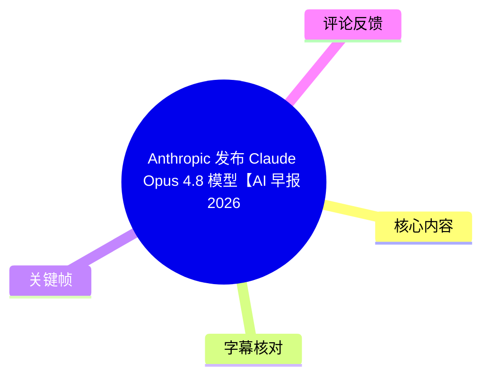
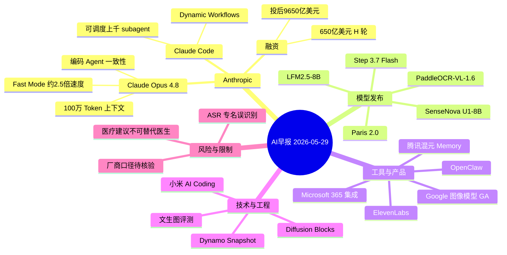
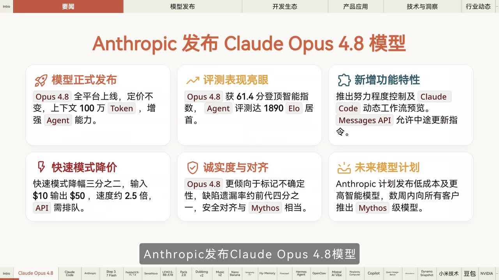
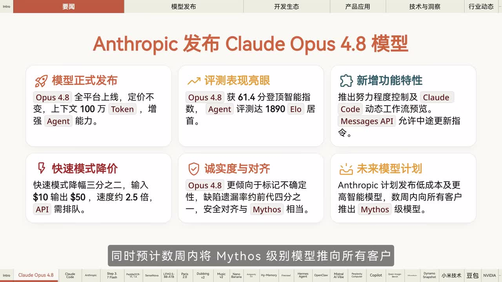
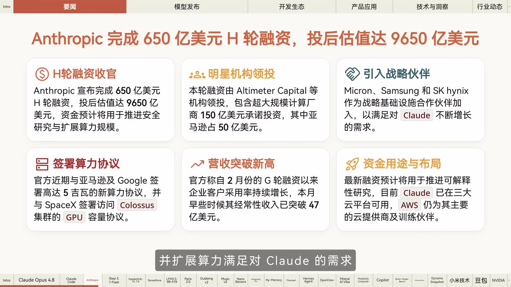
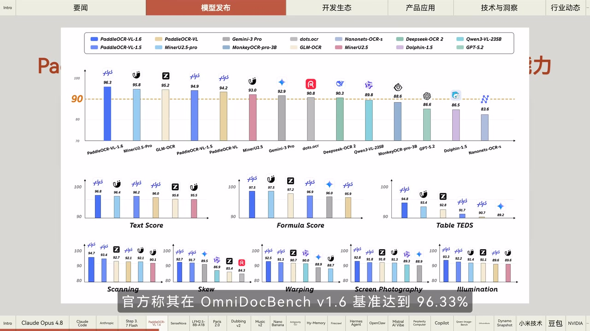

# Anthropic 发布 Claude Opus 4.8 模型【AI 早报 2026-05-29】

> 来源：[Bilibili 视频](https://www.bilibili.com/video/BV1h1V46eEfL)  
> UP 主：橘鸦Juya｜视频时长：05:42｜栏目：AIcode  
> 视频简介提供文字版及相关链接：<https://mp.weixin.qq.com/s/iF9p9ErkYHQyTYae634Rhg>

## 小结

这是一期 2026 年 5 月 29 日的 AI 新闻早报，重点是 Anthropic 发布 **Claude Opus 4.8**。视频称该模型着重提高编码 Agent 在任务执行、反复尝试与工作一致性上的能力；已在官方平台和第三方平台上线，官方 API 常规定价不变。画面还补充了其 **100 万 Token 上下文**、Agent 评测 **61.4 分 / 1890 Elo**、努力程度控制、Claude Code 动态工作流预览等信息。

对开发者最直接的成本与延迟信息是：Opus 4.8 的 Fast Mode 以更高价格换取约 2.5 倍速度；但 ASR 与画面在具体价格描述上存在冲突。画面写明 Fast Mode 输入 `$10`、输出 `$50`，并称“API 需排队”；因此应以实际控制台、模型页和 API 定价页为准，不能仅根据口播决定采购预算。

视频还报道 Anthropic 完成 **650 亿美元 H 轮融资、投后估值 9650 亿美元**，资金拟用于安全、可解释性研究和算力扩展；画面进一步列出 Altimeter Capital 等领投、150 亿美元超大规模计算厂商承诺投资、亚马逊 50 亿美元，以及 Micron、Samsung、SK hynix 等战略基础设施合作信息。上述均为视频转述的官方信息，未在本素材中附原始公告全文。

其余内容覆盖模型发布、Agent 与开发工具、企业办公集成、评测与基础设施：Step 3.7 Flash、PaddleOCR-VL-1.6、SenseNova U1-8B、LFM2.5-8B、Paris 2.0、ElevenLabs 配音/音乐模型、Google 图像模型 GA、腾讯混元记忆插件、OpenClaw、Mistral Vibe、Perplexity Computer、Microsoft 365 Copilot、Dynamo Snapshot、小米 AI Coding 工程化，以及豆包婴儿喂养争议回应与 OpenMD 许可证。

本期是新闻速览而非产品教程：没有演示 API 调用、安装命令、实际提示词、独立复现实验或横向实测。所有“性能提升”“首个”“最高减少”等结论应理解为视频所转述的厂商宣称，尤其是模型名称、版本名和若干专有术语受 ASR 误识别影响，需要回到原始发布渠道复核。

信息具有明显时效性：视频标题日期为 2026-05-29，而素材抓取时间为 2026-07-16。模型可用性、Fast Mode 排队与价格、GA 状态、插件上架情况、融资和产品命名均可能已经发生变化。

## 思维导图

## 目录

- [内容范围与阅读方法（00:00）](#内容范围与阅读方法0000)
- [Claude Opus 4.8：能力、价格与后续计划（00:00）](#claude-opus-48能力价格与后续计划0000)
- [Claude Code 与 Anthropic 融资（00:24）](#claude-code-与-anthropic-融资0024)
- [模型发布：多模态、OCR、信息图与视频（01:12）](#模型发布多模态ocr信息图与视频0112)
- [音视频与图像生成产品（02:02）](#音视频与图像生成产品0202)
- [Agent、记忆与网页监控工具（02:50）](#agent记忆与网页监控工具0250)
- [企业 Agent 与办公软件集成（03:38）](#企业-agent-与办公软件集成0338)
- [评测、训练框架、推理基础设施与工程实践（04:26）](#评测训练框架推理基础设施与工程实践0426)
- [争议回应与开源许可证（05:14）](#争议回应与开源许可证0514)
- [实践核验步骤（00:00）](#实践核验步骤0000)
- [结论与限制（05:39）](#结论与限制0539)
- [字幕比对](#字幕比对)
- [评论分析](#评论分析)
- [处理记录](#处理记录)

## [内容范围与阅读方法（00:00）](https://www.bilibili.com/video/BV1h1V46eEfL?t=0)

视频开场说明当天为 5 月 29 日、周五，并展示要闻目录后进入逐条播报。本期采用“新闻卡片 + 口播”的形式，底部时间轴导航按主题切换，主线可分为：

1. **要闻**：Claude Opus 4.8、Claude Code 与 Anthropic 融资；
2. **模型发布**：多模态推理、OCR、信息图、语言模型、视频生成；
3. **开发生态**：图像模型 GA、CLI、Agent 记忆、网页监控、OpenClaw、Mistral Vibe；
4. **产品应用**：Microsoft 365 集成、Copilot 改版；
5. **技术与洞察**：评测基准、训练框架、Kubernetes 推理冷启动、组织级 AI Coding；
6. **行业动态**：医疗建议争议与 AI 模型许可证。

> 图：画面用六张信息卡概括 Opus 4.8 的发布、评测、功能、价格、安全对齐与后续模型计划。它是校正 ASR 中“Cloud”“退离努力程度”等错误识别的重要视觉依据，也表明本期的首要新闻确为 Claude Opus 4.8。

---

## [Claude Opus 4.8：能力、价格与后续计划（00:00）](https://www.bilibili.com/video/BV1h1V46eEfL?t=0)

### 发布范围与能力重点

视频称 Anthropic 发布 **Claude Opus 4.8**，强化了编码 Agent 处理任务、尝试运行工作时的一致性。画面中的“模型正式发布”卡片补充：

- Opus 4.8 已“全平台上线”；
- 常规定价不变；
- 上下文长度为 **100 万 Token**；
- 重点是增强 Agent 能力。

这里的“全平台”在口播中对应官方全平台及第三方平台，但素材没有逐一列出支持平台、地区或账户层级，也没有给出模型 ID。因此，若要接入，仍应确认目标平台是否已经开放该版本。

### 评测、安全与控制能力

画面称 Opus 4.8：

- 获得 **61.4 分**“终顶智能指数”（画面文字如此表述）；
- Agent 评测达到 **1890 Elo**、居首；
- 新增努力程度控制；
- Claude Code 提供动态工作流预览；
- Messages API 允许在中途更新指令；
- 更倾向于标记不确定性；
- 缺陷遗漏率约为前代四分之一；
- 安全对齐与 **Mythos** 相当。

上述“终顶智能指数”“Mythos”均依赖画面文字，素材未提供原始英文术语、评测设置、前代具体型号、样本范围或统计显著性。尤其“缺陷遗漏率约为前代四分之一”不是通用能力保证，不能直接外推到任意代码库或业务流程。

### Fast Mode 的成本与速度

口播表达为：官方 API 定价不变，Fast Mode “降价三分之二且提速约 2.5 倍”；随后又说 Opus 4.8 Fast Mode “以两倍价格换取约 2.5 倍速度”。这两段 ASR 文本彼此不一致。

关键帧中的价格卡给出更明确的画面信息：

| 项目 | 画面显示 |
| --- | --- |
| Fast Mode 价格 | “快速模式降幅三分之二” |
| 输入价格 | `$10` |
| 输出价格 | `$50` |
| 速度 | 约 `2.5` 倍 |
| 使用限制 | API 需排队 |

由于画面“降幅三分之二”与 `$10 / $50` 的参照价格、计费单位、是否针对特定档位没有在素材中解释，不能将其推导为完整价格表。可确认的是，视频将 Fast Mode 描述为**以价格/排队条件换取更高吞吐或更低等待的选项**；实际计费须以 Anthropic 当前文档为准。

### 后续模型计划

视频称 Anthropic 正开发“更低成本、同等能力”模型，并预计数周内将 **Mythos 级别模型**推向所有客户。该计划属于未来展望，不能视作已上线功能；“数周内”相对视频日期 2026-05-29 而言也已经过期，应单独核查兑现情况。

> 图：该帧同时呈现努力程度控制、Claude Code 动态工作流、Messages API 中途更新指令、Fast Mode 价格/速度描述和 Mythos 计划，是本节区分“已公布能力”与“未来计划”的直接画面依据。

---

## [Claude Code 与 Anthropic 融资（00:24）](https://www.bilibili.com/video/BV1h1V46eEfL?t=24)

### Claude Code：Dynamic Workflows

视频称 Anthropic 更新 Claude Code，推出 **Dynamic Workflows** 功能，并与 Opus 4.8 配合。口播称 Workflows 可调度“上千个 subagent”并行处理大规模任务。

从工作流角度理解，这意味着任务可能被拆分并分配给多个子 Agent 后汇总；但视频未展示：

- 工作流的具体创建入口；
- 子 Agent 的上下文隔离、权限与资源上限；
- 并行调度的失败重试机制；
- 价格、配额与实际可用账户；
- “上千个”是理论上限、任务规模描述，还是单次实际运行承诺。

因此，这项消息可作为关注 Claude Code 编排能力的信号，不能据此直接设计生产系统容量。

### H 轮融资与算力布局

视频称 Anthropic 完成 **650 亿美元 H 轮融资**，投后估值达 **9650 亿美元**。按视频说法，资金将用于：

1. 推进安全与可解释性研究；
2. 扩展算力规模；
3. 满足 Claude 持续增长的需求。

画面补充的融资信息包括：

| 画面项目 | 视频转述内容 |
| --- | --- |
| 领投方 | Altimeter Capital 等机构 |
| 超大规模计算厂商承诺投资 | 150 亿美元 |
| 亚马逊投资 | 50 亿美元 |
| 战略基础设施合作伙伴 | Micron、Samsung、SK hynix |
| 算力合作 | 近期与亚马逊、Google 签署高达 5 吉瓦的新算力协议；并与 SpaceX 签署访问 Colossus 集群 GPU 容量协议 |
| 收入描述 | 自 2 月 G 轮融资以来企业客户采用率持续增长；本月早些时候其经常性收入突破 47 亿美元 |
| 云平台 | Claude 已在“三大云平台”可用，AWS 仍为主要云提供商及训练伙伴 |

这些数字均来自新闻视频画面。视频未给出协议起止时间、5 吉瓦对应的部署状态、150 亿美元承诺投资的构成、经常性收入统计口径，也没有原始公告链接，使用时应保留“视频转述/官方称”的限定。

> 图：该帧将融资规模、估值、投资方、芯片供应链合作、算力协议、收入和资金用途拆分展示，便于将“模型发布”与“算力和资本扩张”两条新闻线联系起来。

---

## [模型发布：多模态、OCR、信息图与视频（01:12）](https://www.bilibili.com/video/BV1h1V46eEfL?t=72)

### Step 3.7 Flash

视频称阶跃星辰发布 **Step 3.7 Flash** 多模态推理模型，参数结构与许可信息为：

- 采用 **198B**（1980 亿）“稀疏 MoE 架构”；
- 激活参数约 **11B**（110 亿）；
- 支持多档推理努力程度；
- 开放 API 调用；
- 以 **Apache 2.0** 协议开源全部权重。

其中“198B、激活 11B”表达的是总参数与每次激活参数之间的区别，不能将 11B 直接当作完整模型规模。视频未交代上下文长度、支持的模态范围、推理硬件、具体仓库或 API 端点。

### PaddleOCR-VL-1.6

视频称 PaddlePaddle/PaddleOCR 正式发布 **PaddleOCR-VL-1.6**：

- 官方称其在 **OmniDocBench v1.6** 达到 **96.33%**；
- 架构兼容前代；
- 支持即插即用。

关键帧图表显示，PaddleOCR-VL-1.6 在总览柱状图中标注为 96.3；下方还分列了 Text Score、Formula Score、Table TEDS、Scanning、Skew、Warping、Screen Photography、Illumination 等指标。图中包含多家模型对比，但视频没有讲解测试集组成、各模型的运行版本或统一推理配置。因此该分数是厂商基准结果，不等同于任何扫描件、表格或公式的实际正确率。

> 图：画面直接呈现 96.3/96.33 的基准成绩及文本、公式、表格和图像扰动等细项，有助于理解该新闻的评价对象是文档解析基准，而不是一般视觉问答能力。

### SenseNova、Liquid AI 与 Paris 2.0

接续播报的模型消息如下：

| 项目 | 视频转述的发布内容 |
| --- | --- |
| 商汤 SenseNova U1-8B Model Infographic | 发布并开源；提升高密度信息图中的文字准确率和排版稳定性；在相关基准测试达到开源“SOTA”水平。ASR 将“SOTA”误识别为“搜踏”。 |
| Liquid AI LFM2.5-8B AEB | 具备 **128K** 上下文；官方称性能可媲美参数量约为其 4 倍的同类 MoE 模型。`AEB` 为 ASR 所得，素材未提供可供核对的画面拼写。 |
| Vagal Labs Paris 2.0 | 视频生成模型；官方称是首个去中心化训练的视频生成模型；权重已在 Hugging Face 有限度开放。模型名、团队名与“有限度开放”的具体条件均应回查原发布页。 |

这组内容体现了当日发布方向从通用多模态推理延伸到文档理解、信息图生成/理解和视频生成，但视频没有给出统一的能力横评，不能按新闻排序推断优劣。

---

## [音视频与图像生成产品（02:02）](https://www.bilibili.com/video/BV1h1V46eEfL?t=122)

### ElevenLabs：配音与音乐

视频报道 ElevenLabs 两项产品：

1. **Dubbing V2** 配音模型  
   - 直接处理原始音频；
   - 可在 90 多种语言翻译中保留原说话人的情感、语气与声音特征；
   - 通过同步感知逻辑实现配音精准对齐。

2. **Music V2** 音乐模型  
   - 支持在同一首歌内无缝融合歌剧与重金属风格；
   - 新增局部重绘功能；
   - 已正式上线。

这里“保留声音特征”属于视频转述的功能表述，不代表可不受限制地复刻任意真实人物声音。视频也没有讲述授权、声纹同意、版权、输入时长、导出格式或语言质量差异。

### Google 图像模型与 Anti-Gravity CLI

视频称 Google 已将 **Nano Banana Pro** 与 **Nano Banana 2** 两款图像生成模型转为 **GA（General Availability，正式可用）**，可以通过 **Gemini API** 投入生产环境。ASR 将 Gemini 误识别为“Gemline”。

同时，**Anti-Gravity CLI 1.0.3** 发布：

- 新增配额耗尽时启用 Google AI Credits 的功能；
- 改进“DIF”体验；
- 修复多项关键问题。

“DIF”的全称、CLI 的安装方式、支持平台和配额策略未在素材中说明。对生产部署而言，GA 仅说明产品状态，不自动意味着成本、稳定性、地区合规和输出许可均适合具体业务。

---

## [Agent、记忆与网页监控工具（02:50）](https://www.bilibili.com/video/BV1h1V46eEfL?t=170)

### 腾讯混元 Memory 与 Firecrawl Monitoring

视频称腾讯混元发布面向 OpenClaw 等长期协作型 Agent 的 **混元 Memory** 记忆插件：

- 使用“六层记忆框架”；
- 使用“演化链技术”；
- 目标是解决记忆碎片化问题。

视频没有展示六层分别是什么，也没有说明记忆持久化位置、检索策略、隐私边界或如何与 OpenClaw 集成，因此不能直接作为架构实施说明。

另据视频，**Firecrawl** 发布 **Monitoring** 功能：

- 当网页发生变化时，仅提取变化内容；
- 通知 Agent；
- 官方称最高可减少 **90% 的 LLM Token 消耗**。

这类机制的可迁移经验是：对需要周期性抓取的 Agent，可以先做页面变更检测，再把差异而非完整页面送入模型。但“最高减少 90%”依赖网页变化频率、差分粒度、首次抓取是否计入、解析失败率与 Agent 后续推理链路，不能作为固定节省比例。

### Hermes Agent 与 OpenClaw

视频称 **Nous Research** 发布 **Hermes Agent v0.15.0**：

- 新增对 Opus 4.8 等模型的支持；
- 新增 SpaceX AI 集成；
- 官方称网页搜索速度提升最高 **750 倍**。ASR 此处误识别为“绘画搜索”。

此外，**OpenClaw** 发布 2026 年 5 月 27 日版本：

- 官方称稳定“…… Agent 轮次”（ASR 在该短语上不清晰，无法据素材准确还原）；
- 提速 **2.9 倍**；
- 发布包体积缩小 **59%**；
- 收紧运行时安全边界。

“750 倍”“2.9 倍”“59%”均缺少测量基线。特别是 OpenClaw 的“安全边界收紧”没有列出沙箱、权限、网络访问、密钥处理或破坏性命令限制，不能据此判断其完整安全性。

---

## [企业 Agent 与办公软件集成（03:38）](https://www.bilibili.com/video/BV1h1V46eEfL?t=218)

### Mistral Vibe

视频称 Mistral AI 将 **Le Chat** 更名为 **Vibe**，并升级为面向长周期生产力与编码的统一 Agent。同步上线：

- Work 模式；
- Code 模式；
- 全新的 VS Code 扩展。

这条消息呈现出从聊天入口走向多模式 Agent 工作台的产品方向。视频未解释更名是否影响原账户、订阅、地区、模型选择及 VS Code 扩展的数据传输策略。

### Perplexity Computer 与 Microsoft 365

视频称 Perplexity AI 的 **Computer** 产品已集成至 **Microsoft 365**，用户可以在 Word、Excel 等应用中直接：

1. 起草内容；
2. 分析内容；
3. 进行联网搜索。

插件已上架微软应用商店。视频没有给出其在不同 Microsoft 365 租户、组织管理员策略、企业数据隔离和联网检索来源方面的细节。对企业用户而言，是否能安装与可否将内部文档交给外部服务处理是两个独立问题。

### Microsoft 365 Copilot 改版

视频称微软近日重构 Microsoft 365 Copilot：

- 新版应用加载速度提升超过 **50%**；
- 引入统一的跨应用入口；
- 将静态提示框升级为任务感知系统。

“加载速度提升超 50%”没有说明是冷启动、首屏、特定平台，还是平均值；任务感知系统的触发规则和数据使用范围也没有在视频中展开。

---

## [评测、训练框架、推理基础设施与工程实践（04:26）](https://www.bilibili.com/video/BV1h1V46eEfL?t=266)

### 文生图评测与 Diffusion Blocks

视频称“谦问团队”推出文生图评测基准 **谦问 ImageBench** 及开源模型 **Q-Judger**：

- 基准包含 **56 个专业创作考点**；
- 官方称自动评分结果与人类专家评估高度相关。

“高度相关”不等于自动评分可替代人工审美、版权审核或商业验收；视频未提供相关系数、专家人数、题集公开方式或 Q-Judger 的已知偏差。

视频还称 Sakana AI 提出 **Diffusion Blocks** 训练框架：

- 将 Transformer 划分为多个独立块进行训练；
- 性能与端到端训练相当；
- 代码已开源。

这是一种训练组织方式的新闻。素材没有提供块间通信、损失设计、适用模型规模、收敛条件或资源节省数据，不能直接推断其在任意 Transformer 上均可无损替换端到端训练。

### NVIDIA Dynamo Snapshot

视频称 NVIDIA 推出 **Dynamo Snapshot**，结合 **CRIU** 与 **CUDA Checkpoint** 技术：

- 将 Kubernetes（K8S）推理冷启动降至 **5 秒内**；
- 当前实验版仅限 **单 GPU** 的 **vLLM** 与 **SGLang** 使用。

这是本期最明确的部署限制之一。若评估该方案，至少需要同时核查：

- 是否为单 GPU；
- 推理引擎是否为 vLLM 或 SGLang；
- 冷启动定义是否包含镜像拉取、模型下载、权重加载和网络就绪；
- CUDA、驱动、Kubernetes、CRIU 的版本兼容性；
- 快照与模型权重、缓存、隐私数据的存储和回收策略。

### 小米零售研发团队的 AI Coding 工程化

视频称小米分享零售研发团队的 AI Coding 工程化实践。其目标是解决 AI 效能仅局限于个体的问题，实现组织级效能和知识沉淀；视频列出的组成包括：

| 组成 | 视频中的称呼 | 作用描述 |
| --- | --- | --- |
| 统一工作流 | VAF | 统一研发流程 |
| 代码支持索引工具 | VKF | 提供代码索引支持 |
| 协作工作台 | 基于飞书的“8Core” | 促进协作与沉淀 |

这些缩写由 ASR 转写所得，未有画面可校验其英文全称或拼写。可明确提炼的工程经验是：若希望 AI Coding 从个人助手变成组织能力，需要将工作流、代码知识检索和团队协作入口组合起来，而不仅是给员工配置单一模型。

---

## [争议回应与开源许可证（05:14）](https://www.bilibili.com/video/BV1h1V46eEfL?t=314)

### 豆包回应婴儿喂养争议

视频称豆包回应婴儿喂养相关争议：媒体将“每顿”表述为“每天”，且家长未提供完整对话背景。豆包同时强调：

> AI 内容仅供参考，不替代医生。

这是涉及婴幼儿健康的高风险场景。无论争议中的具体对话如何，视频明确保留了“不替代医生”的边界；对喂养、用药、疾病判断等问题，不能将模型输出作为医疗建议执行，应向具备资质的医生或专业机构咨询。

### OpenMD 宽松许可证

视频称 Linux Foundation 发布面向 AI 模型的宽松许可证 **OpenMD**；NVIDIA 宣布在 Cosmos、Emotron 等多个开源模型系列中采用该框架，以简化许可。

“Emotron”是 ASR 文本，素材中没有对应画面确认，名称可能存在误识别。视频也未提供 OpenMD 的授权条款、商用要求、再分发义务、专利条款或与 Apache/MIT 等许可证的差异。因此只能记录其“简化 AI 模型许可”的定位，不能据此判断任何具体模型的合规条件。

---

## [实践核验步骤（00:00）](https://www.bilibili.com/video/BV1h1V46eEfL?t=0)

本视频不包含可复现的操作演示。若读者希望将其中新闻转化为技术选型或部署行动，可按下列顺序核验，避免将新闻口径直接当成生产结论。

1. **确认产品身份与入口**  
   对 Claude Opus 4.8、Fast Mode、Dynamic Workflows、Memory、Vibe、Dynamo Snapshot 等名称，优先查原厂公告、文档、控制台或代码仓库。特别核对模型 ID、地区、账户权限、Beta/GA 状态。

2. **核对计费与配额**  
   Claude Fast Mode 的画面包含 `$10` 输入、`$50` 输出、约 2.5 倍速度及 API 排队信息，但单位与基准未展开。接入前应确认输入/输出计费单位、缓存收费、限流、排队规则和企业合同价格。

3. **对性能声明做本地验证**  
   - OCR：用自己的扫描件、表格、公式、屏幕截图和倾斜/畸变图像测试，而非仅看 OmniDocBench 总分。  
   - Agent：记录任务成功率、重试次数、工具调用失败率、运行时和总成本。  
   - 网页监控：分别计算完整抓取与差分抓取的 Token、漏检率和误报率。  
   - 推理冷启动：明确计时边界，区分容器启动、权重恢复、服务就绪和首个请求成功。

4. **评估安全与数据边界**  
   对长期记忆 Agent、Microsoft 365 集成、代码索引和 AI Coding 工作台，应审查数据是否出域、权限最小化、日志保留、密钥隔离、删除机制和管理员审计能力。

5. **保留回退方案**  
   Opus 4.8 的可用性、模型版本、第三方平台支持和价格都可能变化。生产工作流应保留模型切换、超时降级、人工审批和故障回滚方案。

---

## [结论与限制（05:39）](https://www.bilibili.com/video/BV1h1V46eEfL?t=339)

视频在 05:39 左右结束。其最重要的信号不是单一模型分数，而是 AI 工具链同时向四个方向推进：

- **更强的 Agent 执行与编排**：Opus 4.8、Claude Code Dynamic Workflows、OpenClaw、Vibe；
- **更低的运行成本与更快的部署**：Fast Mode、网页差分监控、Dynamo Snapshot；
- **更多模态的生产能力**：OCR、信息图、配音、音乐、视频和图像生成；
- **更组织化的应用落地**：Microsoft 365 集成、小米的统一工作流与协作平台。

但本视频是快讯集合，大多数指标采用“官方称”口径，缺少方法、基线和原始链接；此外 ASR 对专有名词存在较多错误。读者适合把它作为新闻发现入口，再以原始文档完成采购、开发和合规决策。

关键限制汇总：

| 限制 | 影响 |
| --- | --- |
| 无站内字幕 | 无法用平台人工字幕校正专名 |
| ASR 粒度较粗 | 多个模型、产品与组织名称可能误识别 |
| 无完整原文来源 | 难以核验评测、融资、价格及开放条件 |
| 无操作演示 | 不提供可复制的 API、命令或配置 |
| 时间敏感 | 视频日期为 2026-05-29，后续状态可能变更 |
| 医疗信息风险 | 豆包相关内容明确不能替代医生建议 |

## 字幕比对

| 字幕来源 | 完整性 | 专有名词 | 时间轴 | 主要问题 |
| --- | --- | --- | --- | --- |
| Bilibili 站内字幕 | 未提供可用字幕，无法比较内容覆盖 | 无法评价 | 无可用分段 | 素材明确说明未提供可用站内字幕。 |
| 本次 ASR 字幕 | 高：15 段，覆盖约 340.96 秒；诊断覆盖率 0.9982 | 较弱：英文模型、人名、缩写多处误识别 | 高：SRT 提供 00:00:00.300 至 00:05:41.260 的真实时间段 | 如 Claude 被识别为 Cloud、Gemini 为 Gemline、SOTA 为“搜踏”、网页搜索为“绘画搜索”；部分产品名和技术短语不清。 |

### 最终字幕选择

最终采用**本次 ASR 的 SRT 时间轴**作为章节定位依据：其有真实起止时间、全片几乎无空缺，且 ASR 诊断未标记 `noAudioStream=true`，因此可确认源视频有音轨，并非无音轨素材。

由于没有站内字幕，正文对专有名词采取“ASR + 标题 + 关键帧画面”的校正方式，并保留无法确认项：

| ASR 原文/问题 | 正文处理 | 校正依据 |
| --- | --- | --- |
| “Cloud Opus 4.8” | Claude Opus 4.8 | 视频标题与关键帧标题均为 Claude |
| “退离努力程度” | 努力程度控制 | 关键帧功能卡文字 |
| “Gemline API” | Gemini API | 常见产品名称结合 ASR 上下文；画面未单独提供该帧，仍建议回查官方文档 |
| “开源搜踏水平” | 开源 SOTA 水平 | 中文语境与 ASR 音近误识别 |
| “绘画搜索速度提升” | 网页搜索速度提升 | 上下文为 Hermes Agent，ASR 语义明显不通 |
| “Mizos 级别” | Mythos 级别 | 关键帧文字为 Mythos |
| “AEB”“Vagal Labs”“Emotron”“DIF”“VAF/VKF/8Core” | 保留 ASR 形式并标为待核 | 素材没有足够画面或站内字幕进行可靠校正 |

## 评论分析

以下仅分析可获取的热评前三条；评论反映用户体验和立场，不构成对模型能力、蒸馏行为或 API 可用性的已验证事实。

1. **至高机器智能｜514 赞**  
   评论称自己“已经转 Codex”，以“核弹爆炸”的夸张比喻回应 Opus 4.8 新闻。其核心观点是：即便 Anthropic 发布重大模型更新，个人工具选择可能已转向 Codex。该评论没有性能数据、使用场景或版本信息，属于情绪化的产品偏好表达。

2. **奶咖不嘉糖｜328 赞**  
   评论声称早上测试时，在“无系统提示词、关闭思考”的条件下“几乎稳定触发”，并对某公司指责他人蒸馏的立场提出批评。其补充价值在于指出可能存在模型行为或内容争议，但没有附带对话记录、测试提示词、平台入口、模型版本、时间戳或可复现步骤，无法独立验证“稳定触发”及其所指的具体问题。

3. **优秀的黑羊｜316 赞**  
   评论批评部分中文用户混淆 API、网页端、OpenRouter 与官方 API 端点，并质疑缺乏 API 实测证据的舆论辩护。其可取之处是提出了一个方法论提醒：讨论模型能力、限制或异常时，应区分不同产品入口和版本，并提供可复测的 API 结果。评论本身仍是立场性表达，没有给出具体测试数据或结论证据。

## 处理记录

- Worker ID：`worker-mrj0www4-e8d79408`
- 任务模型：`gpt-5.6-terra`
- 使用素材与工具结果：
  - 视频元数据：Bilibili 元数据与页面信息；
  - 音频转写：ASR `medium` 模型，语言 `zh`，CUDA / `float16`；
  - 时间轴来源：`asr/transcript.srt`，15 个真实时间分段；
  - 关键帧：素材提供 `frames/frame-001.jpg` 至 `frames/frame-012.jpg`；
  - 评论：`comments/comments.json`，可获取热评上限为 3 条。
- 字幕选择：站内字幕未提供可用版本；已检查本次 ASR，采用其 SRT 时间轴。ASR 语音覆盖约 340.96 秒、覆盖率 0.9982，未标记 `noAudioStream=true`。
- 关键帧选择依据：
  - `frame-001`：Claude Opus 4.8 六项要闻总览，校正主标题和功能分类；
  - `frame-002`：补充努力程度控制、动态工作流、Messages API、Fast Mode 与 Mythos 计划；
  - `frame-003`：展示融资、估值、投资方、算力和收入相关信息；
  - `frame-004`：展示 PaddleOCR-VL-1.6 的 OmniDocBench v1.6 成绩与细分对比。
- 缓存清理：提供的素材未包含缓存清理执行日志，无法确认是否已清理；本记录不将其表述为已完成。
- 未解决问题：
  - 多个专有名词受 ASR 误识别影响，特别是 Liquid AI 模型后缀、Paris 2.0 团队名、OpenMD 采用模型名及小米内部工具缩写；
  - 价格、评测、融资和性能提升均未附原始公告或实验方法；
  - 未提供站内字幕，无法做逐句人工字幕交叉校验。
