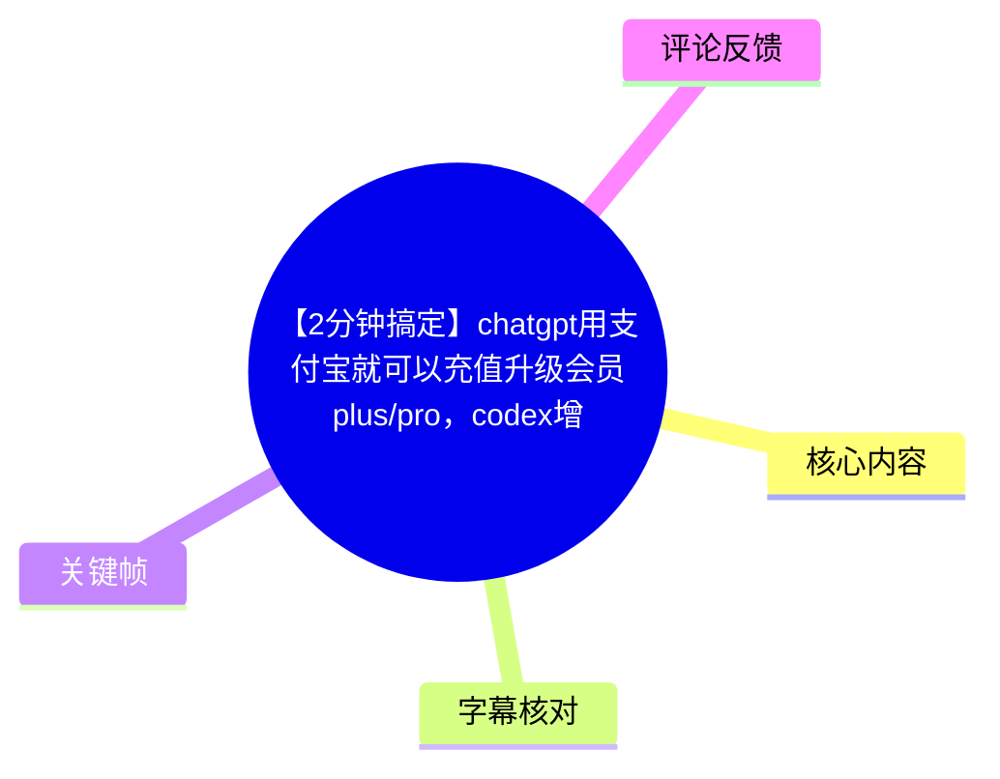
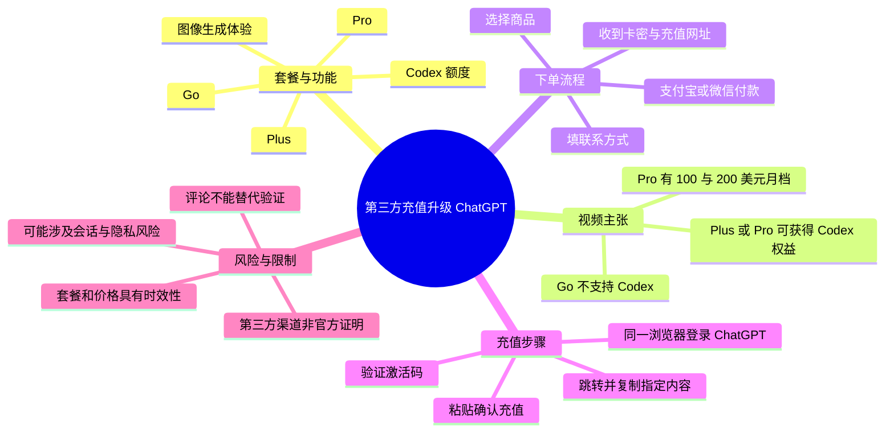
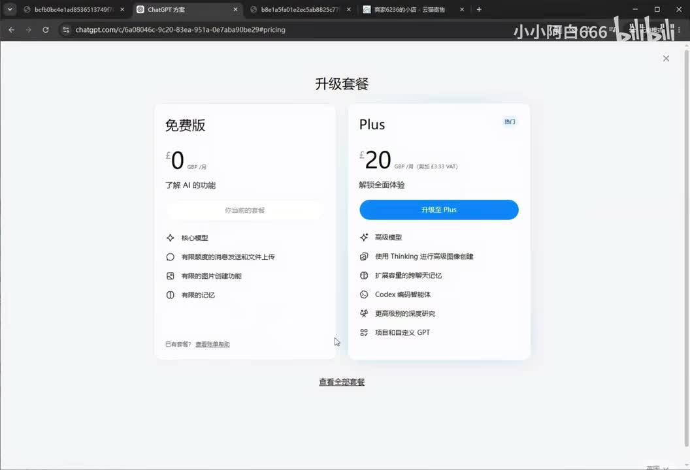
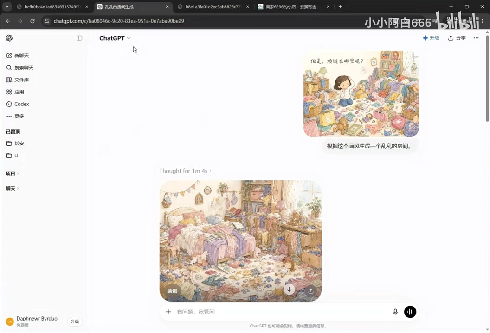
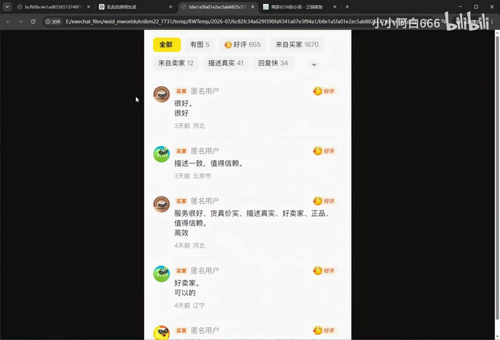

# 【2分钟搞定】chatgpt用支付宝就可以充值升级会员plus/pro，codex增加额度开通plus/pro套餐！gpt5.6模型！image2画图！5.5！

> 来源：[Bilibili 视频](https://www.bilibili.com/video/BV1HmMb6GE4R)  
> UP 主：小小阿白666 ｜时长：06:12 ｜合集：AIcode  
> 视频简介提供了一个第三方“自动发货”店铺网址；本片内容属于第三方代充/兑换流程演示，不是 OpenAI 官方购买指引。

## 小结

视频演示的是：用户通过视频简介中的第三方销售页面购买 ChatGPT `Go`、`Plus` 或 `Pro` 相关商品，使用支付宝或微信付款，获得“卡密”和自助充值网址，再在浏览器中完成验证与充值。UP 主以 Plus 套餐作为完整操作案例。

在套餐选择上，视频称 ChatGPT 存在 Go、Plus、Pro 三类付费选项；若要使用 Codex 并获得更多额度，应选择 Plus 或 Pro，Go 不支持 Codex。视频还称 Pro 有每月 100 美元和 200 美元两个档位，价格越高，额度越高。以上均为视频中的讲述与当时页面/流程展示，不应视作当前官方套餐规则或价格承诺。

实操中的关键条件是**同一浏览器登录 ChatGPT 账号**：先在第三方充值页面输入卡密并验证激活码，再跳转至 ChatGPT 页面，复制页面指定的“全部内容”回填至充值页，确认充值邮箱后完成操作。视频称手机和电脑浏览器都可以操作。

该方法的核心限制与风险同样明显：它依赖第三方渠道、卡密、跳转页和账号会话流程；视频没有展示 OpenAI 对该方式的授权、合规性、账号归属、退款机制或长期稳定性证明。不要向不可信网站输入密码、验证码、恢复码、API Key、完整 Cookie 或任何可接管账号的内容；若页面要求复制敏感会话数据，应停止并核实风险。优先使用官方订阅入口和官方支持渠道。

视频发布信息与素材抓取时间均处于 2026 年，套餐名称、地区币种、功能可用性、Codex 权益及支付路径都可能快速变化。画面中的价格为英镑，不能外推到其他地区；标题提及的“gpt5.6”“image2”“5.5”等说法在正文演示中没有获得独立、清晰的验证。

## 思维导图

## 目录

- [视频定位、套餐画面与适用对象](#视频定位套餐画面与适用对象)
- [套餐、Codex 与图像生成主张](#套餐codex-与图像生成主张)
- [第三方渠道背景与下单方式](#第三方渠道背景与下单方式)
- [Plus 案例：卡密充值步骤](#plus-案例卡密充值步骤)
- [结论、限制与安全建议](#结论限制与安全建议)
- [字幕比对](#字幕比对)
- [评论分析](#评论分析)
- [处理记录](#处理记录)

## 视频定位、套餐画面与适用对象 [00:00:00](https://www.bilibili.com/video/BV1HmMb6GE4R?t=0)

视频开头展示一个已登录的免费版 ChatGPT 账号，并说明从左下角“升级”入口进入套餐页、查看全部套餐。UP 主的目标是介绍如何将免费账号升级为付费会员，而不是演示 ChatGPT 的模型使用技巧或 Codex 编程过程。

视频口述将付费套餐概括为：

| 套餐 | 视频中的定位 | 视频是否称其支持 Codex |
| --- | --- | --- |
| Go | 三个可充值套餐之一 | 不支持 |
| Plus | 可充值套餐之一；后续实操案例 | 支持/可获得更多额度的选择之一 |
| Pro | 面向项目需求多的“深度用户” | 支持/可获得更多额度的选择之一 |

> 图：关键帧展示了“升级套餐”页面中的免费版和 Plus 卡片。Plus 卡片画面价为 **£20 GBP/月（另加税费）**，并列出高级模型、Thinking 图像创建、扩展聊天记忆、Codex 编码智能体、深度研究、项目与自定义 GPT 等项目。它是本片关于套餐能力的直接画面证据，但只反映录制时所登录账号/地区的页面，不能推导为全球统一定价或永久权益。

需要注意，视频标题中虽列出“gpt5.6”“image2画图”“5.5”等关键词，但 ASR 口述和给定关键帧未提供足以确认这些具体版本名、模型名或功能名的连续证据。因此，本文不将标题中的这些名称当作已验证功能说明。

## 套餐、Codex 与图像生成主张 [00:00:24](https://www.bilibili.com/video/BV1HmMb6GE4R?t=24)

### Codex 与额度选择 [00:00:24](https://www.bilibili.com/video/BV1HmMb6GE4R?t=24)

UP 主表示，若用户同时使用 ChatGPT 和 Codex、希望取得更多额度，应选择 Plus 或 Pro；Go 不支持 Codex。其对 Codex 的用途概括为构建应用、网站和工具等。

这里应区分三层信息：

1. **视频陈述**：Go 不支持 Codex；Plus/Pro 是使用 Codex 的选择。
2. **画面可见信息**：Plus 卡片确实列有“Codex 编码智能体”字样。
3. **尚不能由本片确认的信息**：不同套餐究竟包含多少 Codex 额度、额度按什么周期刷新、是否受地区或高峰期限制，以及当前套餐规则是否仍与视频一致。

### Pro 档位与图像生成功能 [00:00:51](https://www.bilibili.com/video/BV1HmMb6GE4R?t=51)

UP 主称：对项目需求很多的深度用户，Pro 有“100 美元/月”和“200 美元/月”两个档位，价格更高则额度更高。视频没有展示对应 Pro 套餐页、币种地区、额度数字或功能清单，因此这是一项未被画面进一步佐证的口述信息。

随后 UP 主提到部分用户是为了 ChatGPT 的画图功能而订阅，并评价画图“体验感非常好”。该评价属于主观体验，不构成生成质量、速度、版权或商用可用性的客观结论。

> 图：关键帧显示对话中上传了一张参考图，并输入“根据这个画风生成一个凌乱的房间。”，下方出现一张生成结果。这说明视频以图生图/参考风格生成作为能力示例；但截图未标明具体模型、生成参数、版权授权范围或套餐专属关系。

## 第三方渠道背景与下单方式 [00:01:30](https://www.bilibili.com/video/BV1HmMb6GE4R?t=90)

### UP 主对渠道的个人经历描述 [00:01:30](https://www.bilibili.com/video/BV1HmMb6GE4R?t=90)

UP 主称，自己在一年多前通过闲鱼找到过该类店家，后来因平台清理而搜不到相关词，自己此前购买的店铺也被封；其后改为通过一个充值网站下单。UP 主还称自己曾按店铺的销量和好评判断其“比较靠谱”，购买一个月后认为稳定，并在该渠道续费一年多。

这些内容均为**UP 主个人陈述**。它们不能验证：

- 第三方卖家与 OpenAI 的关系；
- 账户升级来源是否符合平台规则；
- 售后、退款、争议处理是否可靠；
- 所谓“稳定”是否适用于所有买家；
- 账号是否可能被限制、回收、降级或触发风控。

### 两种视频所述下单入口 [00:02:19](https://www.bilibili.com/video/BV1HmMb6GE4R?t=139)

视频为担心网站下单的用户提供了替代路径：在网站内联系微信客服，由客服提供新的闲鱼链接；UP 主称其可能以卡通图片和非直接商品标题显示，再在闲鱼平台拍下。另一条路径是直接在网站下单，视频称其可自动发货，提供 Plus、Go、Pro 三种套餐，并宣称“带质保”。

“平台下单”“自动发货”“带质保”都是视频或卖方的说法，并不等于平台或官方担保。即使交易页面处于某个平台内，仍应分别确认商品描述、付款对象、维权依据、售后条件和个人信息处理方式。

> 图：关键帧中可见一个第三方商品评价页面，顶部显示“好评 655”“来自买家 1670”等统计，并列出匿名买家的正向评价。它解释了 UP 主为何将销量和评价作为渠道判断依据；但截图不能验证评价真实性、商品来源、评价对应的具体服务，也不能替代官方授权证明。

### 下单时填写的信息与支付方式 [00:03:41](https://www.bilibili.com/video/BV1HmMb6GE4R?t=221)

以 Plus 套餐为例，视频说明下单页面可填写：

- 邮箱；
- 微信号；
- 手机号。

支付方式为：

- 支付宝；
- 微信支付。

付款后，视频称用户将收到：

1. 一张卡密；
2. 一个自助充值网址；
3. 店家提供的视频教程。

这不是“支付宝直接向 OpenAI 订阅”的官方支付流程，而是通过第三方商家付款后领取卡密并进入其自助页面的流程。填写联系方式前应考虑隐私泄露和营销骚扰风险；如无必要，不要额外提供真实姓名、身份证件、账号密码或验证码。

## Plus 案例：卡密充值步骤 [00:04:14](https://www.bilibili.com/video/BV1HmMb6GE4R?t=254)

以下按视频中 Plus 示例的真实顺序整理。该流程仅描述视频展示内容，不构成安全或合规推荐。

### 1. 获取卡密与充值网址 [00:04:14](https://www.bilibili.com/video/BV1HmMb6GE4R?t=254)

下单成功后，取得卡密与“充值网址”。在手机或电脑浏览器打开该网址。视频称两类设备均可操作。

### 2. 输入卡密并验证激活码 [00:04:14](https://www.bilibili.com/video/BV1HmMb6GE4R?t=254)

在充值页第一步输入收到的卡密，点击“验证激活码”。

**限制**：视频未展示该服务的运营主体、隐私政策、数据存储方式或卡密来源，不能据此判断其可信度。

### 3. 在同一浏览器登录 ChatGPT [00:04:35](https://www.bilibili.com/video/BV1HmMb6GE4R?t=275)

UP 主强调，需在**同一个浏览器**内登录自己的 ChatGPT 账号。若尚未登录，可以在该浏览器另开一个窗口登录 ChatGPT；其示例中账号已登录且为免费版本，因此未再演示登录动作。

这一条件表明第三方页面可能依赖浏览器内的登录状态完成跳转或关联。任何与账号会话相关的操作都应格外谨慎。

### 4. 跳转、复制指定内容并回填 [00:04:35](https://www.bilibili.com/video/BV1HmMb6GE4R?t=275)

视频的操作描述为：

1. 打开指定位置并点击跳转；
2. 在跳转后的页面“复制全部内容”；
3. 将复制内容粘贴回充值页面；
4. 点击“确认充值”；
5. 在弹窗中确认充值邮箱。

视频未明确说明“全部内容”的具体类型。从安全角度，若其中含有 Cookie、访问令牌、会话标识、浏览器导出信息、OAuth 回调数据或其他可登录凭据，则不应复制或提交给第三方。用户应先确认该数据是否会导致账号被接管，并优先通过官方支付与订阅页面完成升级。

### 5. 视频中的完成提示 [00:05:00](https://www.bilibili.com/video/BV1HmMb6GE4R?t=300)

UP 主在确认邮箱后口述“好了，充成功”，并在之后总结该教程操作难度不高。视频没有展示长期到账状态、套餐持续时间、订单号、退款流程或账号后续使用情况，因此“成功”只能理解为视频录制时该流程显示完成，不能外推为所有订单均能成功或长期稳定。

## 结论、限制与安全建议 [00:05:17](https://www.bilibili.com/video/BV1HmMb6GE4R?t=317)

视频提供了一条第三方卡密充值的操作路径，其可迁移的信息主要是：

- 升级前先区分自己的需求：仅使用普通聊天、需要图像能力，还是需要 Codex 及更高额度；
- 同一浏览器登录状态是视频流程中的必要前提；
- 下单后应核对联系方式、充值邮箱和实际到账套餐；
- 视频中展示的英镑 Plus 价格、Pro 美元档位及 Codex 归属都具有账户、地区和时间条件。

但更重要的是边界：

1. **非官方性**：视频没有提供 OpenAI 官方授权或官方支付合作证明，不能将其描述为官方支付宝充值方案。  
2. **账号安全**：不要向第三方提交密码、短信验证码、Authenticator 验证码、恢复码、API Key、完整 Cookie 或可复用的浏览器会话内容。  
3. **第三方风险**：卡密可能失效，权益可能变化；所谓“质保”、售后、闲鱼链接和自动发货均需以实际订单条款为准。  
4. **套餐时效性**：产品权益、价格、币种、Codex 可用性和限额会调整，视频录制时的界面不等于当前界面。  
5. **证据不足**：标题列出的特定模型/版本名没有在给定正文素材中被清晰演示，不能据此确认已开通或包含。  

若目标是降低账户、资金和隐私风险，应优先从 ChatGPT 官方“升级套餐”入口确认当前可订阅套餐、付款方式和地区限制；遇到订阅异常或付款失败，使用官方帮助中心/支持渠道处理，而不是提交账号会话数据给不明第三方。

## 字幕比对

| 字幕来源 | 完整性 | 专有名词 | 时间轴 | 主要问题 |
| --- | --- | --- | --- | --- |
| Bilibili 站内字幕 | 未提供可用字幕，无法比较文本内容 | 无法评估 | 无法评估 | 素材明确标注“未提供可用站内字幕” |
| 本次 ASR 字幕 | 较完整：22 段，语音覆盖约 330.82 秒/371.52 秒，覆盖率约 89.05% | 存在多处识别错误 | 可用：含逐段起止时间 | ChatGPT、Codex、Plus、Pro、闲鱼等词频繁误识别；约 05:01—05:15 有约 13.06 秒较大语音空段 |

本次 ASR 使用 `medium` 模型，识别语言为中文，语言置信度约 `0.9956`，音频流存在；诊断中**未标记** `noAudioStream=true`。因此，本片不是无音轨视频，本文以 ASR 的真实时间戳为章节时间轴依据，并以关键帧和上下文修正专有名词。

重要校正如下：

| ASR 原文/近似词 | 本文采用 | 校正依据 |
| --- | --- | --- |
| “GBTR”“GBT”“拆GPT” | ChatGPT | 视频标题、界面左侧品牌文字及上下文一致 |
| “Codes” | Codex | 视频标题、口述上下文与 Plus 卡片“Codex 编码智能体” |
| “TOS 套餐” | Plus 套餐 | 前后文为“Go 不支持 Codex，应选 Plus 或 Pro”；ASR 的音近误识别 |
| “咸鱼/鲜鱉”等 | 闲鱼 | 中文平台名称及上下文 |
| “卡秘” | 卡密 | 充值码语境中的常用表述 |
| “兼值署/充止网址” | 充值网址 | 同段反复描述为充值链接/页面 |

由于不存在站内字幕，无法进行逐句一致性验证；且 ASR 有“画团”“网纸”等明显错词，本文避免将其错误字面直接当作事实。

## 评论分析

可获取的热评不足三条，本次仅获得 2 条，以下仅分析这两条，不补造第三条。

1. **念安fg（4 赞）**：“每天都有白嫖，我一直在用”。  
   - 观点：评论者称自己一直使用某种“白嫖”方式。  
   - 补充价值：反映部分观众对低成本或免费获取权益方式有兴趣。  
   - 可信度与限制：未说明具体途径、账号状态、适用条件或合规性；“白嫖”不代表稳定、合法、安全或适用于他人，不能作为购买/充值依据。

2. **她呢-_（4 赞）**：寻求共享“plus5.6”会员，称研究生日常自用、账号稳定，故障可沟通。  
   - 观点：评论者尝试招募共享会员使用者，并声称账号稳定。  
   - 补充价值：显示评论区存在账号共享需求。  
   - 风险与限制：共享账号会带来隐私暴露、对话与文件混用、付款纠纷、账号封禁及服务条款风险；“稳定”只是发言者自述，未提供可核验凭据。评论中“plus5.6”亦不能证明某个官方套餐或模型版本存在。

## 处理记录

- Worker ID：`worker-mrj0wjed-b0c290ad`
- 模型：`gpt-5.6-terra`
- ASR 模型：`medium`（CUDA / float16，自动语言识别为中文）
- 使用的素材与工具结果：视频元数据、时长 372 秒、ASR `asr/transcript.srt` 与 `asr/asr-result.json`、关键帧 `frames/`、热评 `comments/comments.json`。
- 字幕选择：站内字幕未提供可用文本；已检查本次 ASR，确认存在音轨且时间戳可用。正文以 ASR SRT 的真实分段时间作为时间轴基础，并结合关键帧校正 ChatGPT、Codex、Plus、Pro、闲鱼、卡密等错识别词。
- 关键帧选择依据：
  - `frames/frame-001.jpg`：直接显示免费版与 Plus 升级页、英镑月费及 Plus 功能条目；
  - `frames/frame-003.jpg`：展示参考图驱动的图像生成实例；
  - `frames/frame-004.jpg`：展示 UP 主用以判断商家可信度的店铺评价页面。
- 缓存清理：素材清单未提供缓存清理执行结果；本文未声称已执行或完成缓存清理。
- 未解决问题：
  - 无法验证第三方充值服务的授权、资金流、卡密来源、隐私政策、质保和售后；
  - 无法验证视频所述 Go/Plus/Pro、Codex 额度及 Pro 两个美元档位是否仍为当前规则；
  - 标题中的“gpt5.6”“image2”“5.5”未在可核验的 ASR 与关键帧中获得充分对应证据；
  - 热评仅获取 2 条，未达到“前三条”的完整数量。
