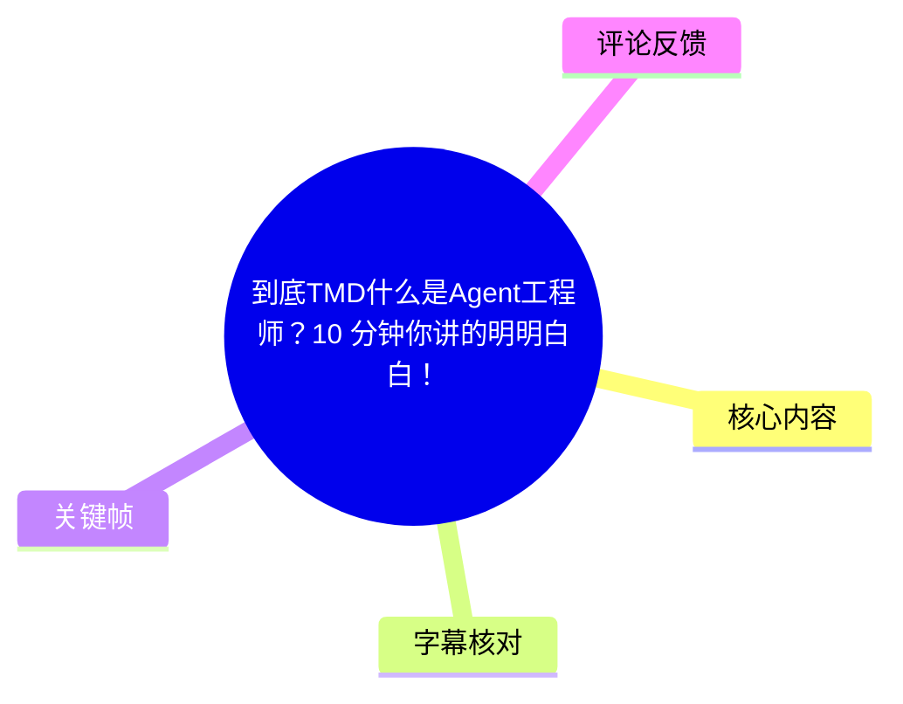
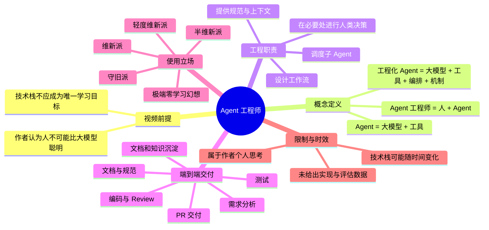
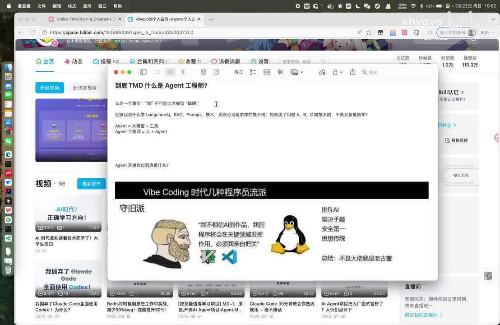
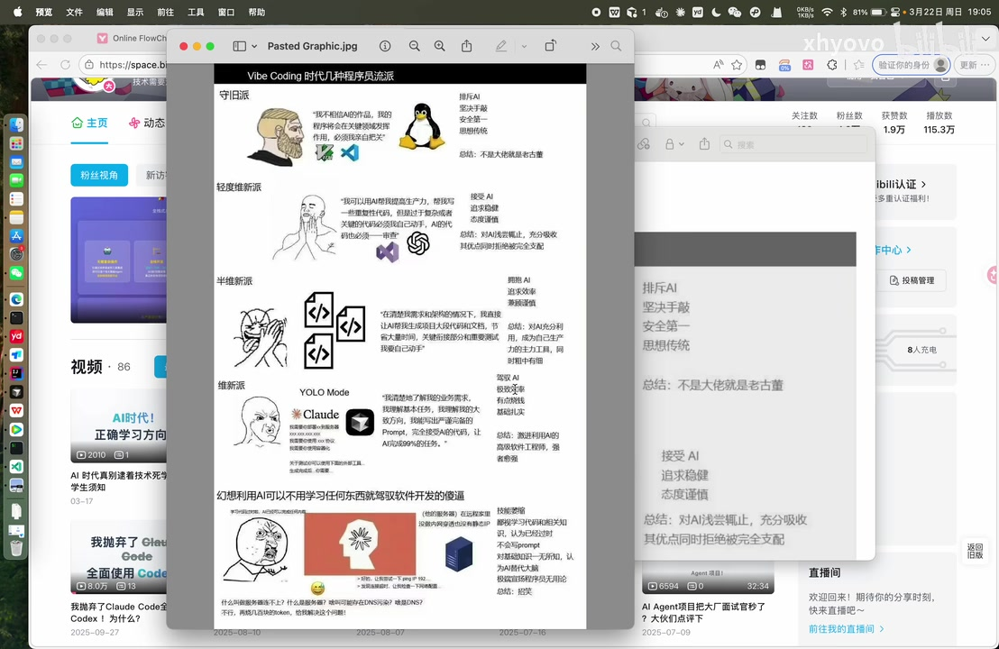
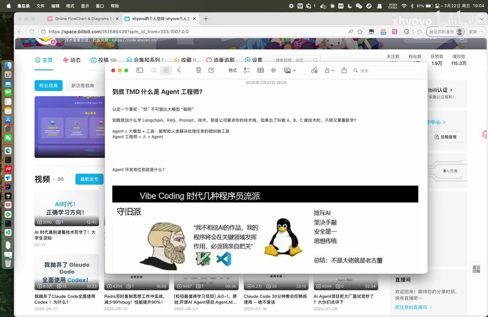

# 到底TMD什么是Agent工程师？10 分钟你讲的明明白白！

> 来源：[Bilibili 视频](https://www.bilibili.com/video/BV19NAGzEEBT)  
> UP 主：xhyovo｜合集：AIcode｜时长：14 分 07 秒  
> 标签：人工智能、AI、技术、Agent、学习、校招、社招

## 小结

视频以“Agent 工程师究竟做什么”为核心问题，给出的是一套**偏工作流设计与 AI Coding 实践**的个人定义：Agent 不只是“大模型”，而是“大模型 + 工具”；进一步用于工程交付时，还应加入工作流编排，以及让 Agent 充分执行任务的机制。相应地，Agent 工程师的主要价值被描述为：作为人类指挥者，设计上下文、工具、子 Agent 和流程，使 AI 能完成更完整的研发闭环。

UP 主的前提判断是“人不可能比大模型聪明”，据此反对把持续追逐框架、语言、RAG、Prompt 等技术栈本身视为核心竞争力。他认为这些是公司或项目提出的技术要求；人更应学习如何让模型调用合适的工具、遵循规范并完成任务。此处属于视频作者的观点与职业策略，不是已被普遍验证的工程定律。

视频将 AI Coding 使用者划分为守旧派、轻度维新派、半维新派、维新派，以及“幻想不学习任何东西即可驾驭开发”的极端情形。作者倾向于“全力拥抱 AI”的维新立场，但也明确认为初学者没有足够能力直接驾驭复杂 AI 工具，说明其主张并非“零基础即可完全自动开发”。

实践层面，作者提出一个端到端交付设想：从读取或生成项目规范、进行多轮需求分析，到代码实现、并行调用子 Agent、Review、文档更新、测试、需求知识沉淀，最终产出 PR。理想状态是用户只提交需求；只有 AI 在需求判断中确实无法决策时，才回到人类进行二次讨论。

这是一支概念阐释视频，并未展示可运行的 Agent 框架、配置文件、提示词模板、评估数据、成本控制、权限设计或真实项目指标。因此，它可作为理解“编排型 Agent 工程角色”的思维材料，但不能直接替代工程落地方案。视频口述以 **2026 年 3 月 22 日**为当前时间，并明确提示技术栈到 2027 年可能变化，结论具有明显时效性。

适合希望理解 AI Coding、Agent 工作流、研发自动化方向的学生、转型开发者和小团队从业者阅读；不适合将其直接作为“可以不学习编程基础”或“模型输出无需审查”的依据。

## 思维导图





## 目录

- [问题背景：从技术栈焦虑到 Agent 工程角色](#问题背景从技术栈焦虑到-agent-工程角色)
- [核心定义：Agent、工具与人的位置](#核心定义agent工具与人的位置)
- [AI Coding 使用流派与作者立场](#ai-coding-使用流派与作者立场)
- [Agent 工程师的核心职责：把模型能力编排出来](#agent-工程师的核心职责把模型能力编排出来)
- [端到端研发工作流：从需求到 PR](#端到端研发工作流从需求到-pr)
- [学习建议、适用边界与时效性](#学习建议适用边界与时效性)
- [关键帧索引](#关键帧索引)
- [字幕比对](#字幕比对)
- [评论分析](#评论分析)
- [处理记录](#处理记录)

## 问题背景：从技术栈焦虑到 Agent 工程角色

### 开场前提与讨论范围 [00:31](https://www.bilibili.com/video/BV19NAGzEEBT?t=31)

视频开场直接提出问题：“Agent 工程师到底是什么、到底做什么”。作者要求观众先接受一个讨论前提：**“你不可能比大模型聪明。”** 随后的推理均建立在这个前提之上。

需要注意：

- 这不是对人类能力与模型能力的普遍事实证明，而是作者为了论述 AI Coding 使用方式而设定的价值判断。
- 在实际软件工程中，模型可能在编码、检索、生成等局部任务中表现强劲，但仍可能产生错误、遗漏安全约束、误解业务需求或无法承担责任；视频没有讨论这些情形。
- ASR 从 `00:00:31,220` 开始识别到连续人声，说明视频前约 31 秒没有被本次语音稿覆盖的正式论述内容。

### 不把技术栈更新等同于核心竞争力 [00:33](https://www.bilibili.com/video/BV19NAGzEEBT?t=33)

作者举例提到 LangChain、RAG、Prompt 等概念，认为它们可以是公司或项目要求掌握的技术栈，但不应让开发者陷入“每出现一个 A/B/C 新技术就重新追逐学习”的旧式框架迭代循环。

其论证链条如下：

1. 公司会基于项目要求特定技术栈；
2. 大模型可以较快获得并调用这些技术知识；
3. 若人的目标只是抢先记住每个新框架，长期竞争很困难；
4. 因此，学习重点应转向“如何让大模型为任务服务”。

这一段并非说开发者不需要理解技术栈。视频后段也承认，当公司要求 Python、Go 等具体语言时，仍需面对实际任务；作者的建议是优先寻找对应的 Skill 或提示词，让模型辅助完成，而非仅靠人工逐项手写。



> 图：画面展示作者在笔记中列出的讨论前提、LangChain/RAG/Prompt 等示例，以及“Agent = 大模型 + 工具”“Agent 工程师 = 人 + Agent”等提纲。它将视频从“学什么技术”转到“如何组织 AI 完成任务”的主线可视化。

## 核心定义：Agent、工具与人的位置

### Agent = 大模型 + 工具 [02:10](https://www.bilibili.com/video/BV19NAGzEEBT?t=130)

作者给出第一层定义：

> **Agent = 大模型（LLM） + 工具。**

这里“工具”被宽泛定义为：能够解决、处理任务，或帮助人类完成劳动的能力组件。作者口述举例包括 Function Call、MCP、Skill。

基于画面文字及上下文，可相对可靠地整理为：

| 概念 | 视频中的含义 | 备注 |
| --- | --- | --- |
| 大模型 / LLM | 负责理解、推理、生成和决策的模型能力 | 视频未限定具体模型 |
| 工具 | 可被模型或流程调用以处理任务的能力 | 例如函数调用、MCP、Skill |
| Function Call | 让模型按结构化方式调用外部函数的能力 | 仅被列举，未演示 |
| MCP | 工具/上下文连接机制的示例 | 视频未解释协议细节 |
| Skill | 面向某类任务复用的能力或工作单元 | 后文用作工作流示例 |

ASR 在此将部分术语识别为“Function Code”“MZP”，但关键帧中的笔记可辨认为 **Function Call、MCP、Skill**，因此正文采用后者；详见[字幕比对](#字幕比对)。

### Agent 工程师 = 人 + Agent [02:35](https://www.bilibili.com/video/BV19NAGzEEBT?t=155)

在上述定义之上，作者把“工程师”解释为人，将角色概括为：

> **Agent 工程师 = 人 + Agent。**

其强调的不是由模型完全替代人，而是人通过 AI Coding 去指挥、组织 Agent 工作。这里的“人”至少承担以下职责：

- 输入目标与业务需求；
- 提供项目背景、规范或必要上下文；
- 制定或调整工作流；
- 在模型无法决定的节点进行判断；
- 对最终交付承担组织与决策责任。

视频的关键判断是：同一模型、同一 AI Coding 工具在不同人手中表现不同，问题不一定出在模型或项目规模，而可能出在使用者是否有效调度了模型。

## AI Coding 使用流派与作者立场

### 五种使用倾向 [02:59](https://www.bilibili.com/video/BV19NAGzEEBT?t=179)

作者借助一张“Vibe Coding 时代几种程序员流派”的图，对不同态度作出分类。画面中的分类与口述可整理如下：

| 流派 | 视频描述 | 作者的态度 |
| --- | --- | --- |
| 守旧派 | 坚决排斥 AI，认为 AI 代码没有质量，大型项目不能用 | 作者不认同 |
| 轻度维新派 | 接受 AI，但主要让其写重复代码 | 作者认为仍未充分发挥 AI |
| 半维新派 | 追求效率，但复杂部分和重要测试仍主要亲自完成 | 作者认为仍不够彻底 |
| 维新派 | 全力拥抱 AI，让 AI 完成绝大多数任务 | 作者明显倾向 |
| 极端幻想者 | 认为无需学习任何东西即可凭 AI 驾驭软件开发 | 作者明确排除，认为是初学者的误区 |



> 图：该图以守旧派、轻度维新派、半维新派、维新派和“幻想利用 AI 可以不用学习”的极端情形，呈现作者用于讨论 AI Coding 态度差异的分类框架。它是理解作者立场的关键视觉材料。

### 作者对“信任模型”的推论 [04:35](https://www.bilibili.com/video/BV19NAGzEEBT?t=275)

作者认为，若使用者属于排斥 AI、只做轻度使用或关键部分完全不信任 AI 的群体，就与其“模型比人聪明”的前提矛盾。他提出的问题是：为什么使用相同模型和工具，有些人能获得更好结果？

作者给出的答案是：

- Agent 的表现依赖人的指挥；
- 人可以把强模型引导到低质量输出；
- 因而应优化指挥、上下文、流程和调用方式，而不是简单归因于模型不行。

这一逻辑有启发性，但必须补充工程限制：**不应把“信任 Agent”理解为取消验证。** 尤其涉及生产环境、数据权限、支付、医疗、合规、安全和不可逆操作时，仍应配置测试、代码审查、权限隔离、回滚与人工审批。视频未展开这些风险控制措施。

## Agent 工程师的核心职责：把模型能力编排出来

### 从“会用工具”到“设计工作流” [05:49](https://www.bilibili.com/video/BV19NAGzEEBT?t=349)

作者将 Agent 工程师的核心工作概括为：尽可能发挥、甚至“压榨”Agent 的能力，让“绝顶聪明的人 + 执行力”真正形成生产力。其比喻是，模型能力本身很强，但不良指挥会让输出变得低效或低质。

在工程语境下，可以将视频表达转换为以下工作内容：

1. **任务拆分**：将模糊需求变为可处理的分析、编码、Review、测试等阶段。
2. **工具接入**：让 Agent 能够读取文档、访问代码、生成文件、运行检查或调用其他能力。
3. **流程编排**：规定任务先后关系、条件分支、循环修正与交付标准。
4. **上下文治理**：让模型在每轮任务中获得正确且必要的项目规范、历史决策与当前状态。
5. **多 Agent 协作**：按视频说法，为不同子任务开启多个子 Agent。
6. **人机升级路径**：只在模型无法确定、需业务裁决或存在风险时，升级到人类决策。

### 当前技术说法与未来变化 [06:21](https://www.bilibili.com/video/BV19NAGzEEBT?t=381)

作者明确标注了论述时点：**2026 年 3 月 22 日**。他认为到 2027 年，可能会出现新的“人操作 Agent 辅助工作”的技术栈，因此只讨论当时的理解。

视频口述将当前实践表述为“AI Coding 加上某种工作流方式”。ASR 多次将该词识别为“SQL”或“Scale”，但语义与前后文均不稳定；关键帧可见的文字更接近 **Skill**，且作者紧接着说明其本质是“工作流编排”。因此，本整理不把它断言为 SQL 数据库语言，而统一记为：

> **以 Skill/工作流编排为代表的机制：把开发规范、任务步骤、子 Agent 调度和提示策略组织起来。**

作者强调，编排可包括：

- 一套开发手册或开发规范；
- 某项工作的完整事项列表；
- 过程中开启多个子 Agent；
- 通过提示词进一步发挥 Agent 能力。

此处没有提供具体的编排引擎、DSL、框架名或代码样例，无法据视频复现。

### 多轮对话是待被流程化的摩擦 [07:55](https://www.bilibili.com/video/BV19NAGzEEBT?t=475)

作者认为，日常 AI Coding 中需求分析、写代码、Review、测试都反复进行多轮对话，往往意味着没有把 AI 能力“用好”。他的方向不是单纯减少沟通，而是将重复性沟通转化为 Agent 可执行的流程。

视频给出的新定义是：

> **面向工程交付的 Agent = 大模型 + 工具 + 编排 +（可能还包括）机制上的“压榨”。**

其中“机制上的压榨”是作者的口语化说法，未定义严格技术含义。按照上下文，可理解为通过明确规则、提示、任务分工、反馈与知识沉淀，让 Agent 在约束下更充分完成任务；不宜将其误读为某个标准术语或具体产品功能。

## 端到端研发工作流：从需求到 PR

### 目标：一次输入需求，端到端完成交付 [09:03](https://www.bilibili.com/video/BV19NAGzEEBT?t=543)

作者提出的理想场景是：无论需求小或大，交给已写好的 Agent 后，它可从需求分析一路走向端到端交付，并在完成后进行自我沉淀，形成“飞轮”。

这里的“飞轮”指的是：

1. 本次任务完成后，Agent 记录做过什么；
2. 收集涉及的文档、规范与需求信息；
3. 新需求到来时，Agent 能主动了解项目既有状态；
4. 人不必每次从头手工补充全部背景；
5. 积累越多，可复用上下文越多。

视频没有说明沉淀存放在哪里、如何检索、如何处理过期知识、如何避免错误知识污染后续任务，因此“飞轮”是目标架构而非已验证实现。

### 视频中的 Skill/工作流步骤 [10:50](https://www.bilibili.com/video/BV19NAGzEEBT?t=650)

作者以“提出一个需求后如何设计端到端交付”为例，描述了如下流程。原视频口述存在 ASR 术语误识别，以下仅保留可从上下文稳定确认的步骤：

| 阶段 | 视频描述的动作 | 产物或目的 |
| --- | --- | --- |
| 1. 项目检查 | 先查看项目内已有文档、规范和各类约束；若没有则生成 | 项目文档与规范基础 |
| 2. 需求分析 | 对需求进行一次或多次分析 | 明确需求、发现疑问 |
| 3. 需求沉淀 | 需求分析确认无问题后，沉淀需求文档 | 可复用的需求知识 |
| 4. 编写代码 | 进入代码实现 | 功能实现 |
| 5. 子 Agent 协作 | 可能针对不同任务开启多个子 Agent | 并行或分工处理 |
| 6. Review | 进行代码 Review，且可能多次 Review | 发现实现与规范问题 |
| 7. 文档同步 | Review 或实现后及时更新原有文档、需求文档 | 让知识与实现一致 |
| 8. 测试 | 在流程后进行测试 | 验证交付 |
| 9. 知识沉淀 | 记录本次完成内容与关联资料 | 为后续需求提供上下文 |
| 10. PR | 整体完成后形成 PR | 工程化交付单元 |

可将视频的流程关系抽象为：

```text
提交需求
  → 读取/生成项目规范
  → 多轮需求分析
  → 沉淀需求文档
  → 编码（可调度子 Agent）
  → 多次 Review
  → 同步更新文档
  → 测试
  → 知识沉淀
  → PR
```

### 人类何时介入 [12:05](https://www.bilibili.com/video/BV19NAGzEEBT?t=725)

在作者设想中，用户通常只要“提交需求”。流程中可能出现需要人类介入的情况：AI 在需求分析或方案判断时“拿不定主意”，才向人请求二次讨论。

这是该视频对 Agent 工程师角色最具体的结论：

> **Agent 工程师的工作是编排这些工作流，而不是仅把一段代码交给模型生成。**

但生产实践中，人类介入条件通常还应包括：

- 需求自身不完整、互相冲突或涉及商业取舍；
- 访问生产数据、密钥、付费资源或外部系统；
- 安全、隐私、法律、审计与合规风险；
- 测试失败、性能退化或影响范围不明；
- 模型输出不符合架构约束或团队规范。

这些补充是工程风险控制的常见考虑，**不是视频直接提供的步骤或参数**。

## 学习建议、适用边界与时效性

### Python、Go 示例：学习的重点是“调动模型” [12:42](https://www.bilibili.com/video/BV19NAGzEEBT?t=762)

作者以 Java 开发者被公司要求处理 Python、Go 为例，提出不应只把问题理解成“重新完整学习一门技术栈”。他建议寻找 Python、Go 相关的 Skill、提示词或辅助机制，让大模型帮助完成任务；开发者担当“领导”角色，重点发挥模型能力。

可迁移的经验是：

- 先明确交付目标与已有约束；
- 再为模型提供语言、框架、代码库和规范的可靠上下文；
- 将需求、实现、测试和审查组织为可重复流程；
- 不能只依赖“问一句、改一句”的随机对话模式；
- 即使使用 AI，也要保留自己的独立思考。

### 必须保留的边界 [13:09](https://www.bilibili.com/video/BV19NAGzEEBT?t=789)

视频最后再次强调“学技术栈学不过大模型”，并建议不要什么都问大模型，否则思考不属于自己。这个提醒与其“充分使用 AI”的主张共同构成一个张力：一方面要让模型承担更多执行工作，另一方面人仍要有独立判断能力。

结合视频实际内容，以下限制必须明确：

- **没有代码与配置**：视频未给出 Agent 工作流的提示词、目录结构、工具配置、鉴权方式或部署方案。
- **没有验证数据**：未展示完成率、代码缺陷率、成本、时延、人工介入率或与人工流程的对照。
- **没有安全机制**：未涉及模型权限、工具沙箱、密钥管理、数据脱敏、审计、回滚等。
- **“模型更聪明”是观点**：模型能力受任务、模型版本、上下文质量、工具权限和评估方法影响，不能据此放弃技术理解与质量验证。
- **职业职责因组织而异**：小公司、大公司、平台团队、业务研发与 AI 产品团队对“Agent 工程师”的职责划分可能完全不同。
- **时效性有限**：作者自己说明，2027 年可能出现新的技术栈或操作方式；本文仅记录视频在 2026 年 3 月的论述。

## 关键帧索引

| 关键帧 | 对应内容 | 使用价值 |
| --- | --- | --- |
|  | 开场笔记：技术栈示例、Agent 与 Agent 工程师的定义 | 用于校正 ASR 对 LangChain、RAG、Prompt、Function Call、MCP、Skill 等术语的误识别，并确认视频论述结构 |
|  | “Vibe Coding 时代几种程序员流派”的初始画面 | 展示作者从守旧到接受 AI 的态度分类 |
|  | 开场笔记与流派图同屏 | 交叉确认核心定义和流派讨论的衔接 |
|  | 五种 AI Coding 使用倾向的完整图示 | 用于正文中对五类人群的逐项整理；该图是分类内容最直接的视觉依据 |

> 未将其余关键帧强行插入正文：提供的素材中未附带逐帧时间戳和画面说明；为避免根据文件序号臆造时间位置，仅选用能从所给画面直接辨认且与正文概念对应的帧。

## 字幕比对

| 字幕来源 | 完整性 | 专有名词 | 时间轴 | 主要问题 |
| --- | --- | --- | --- | --- |
| Bilibili 站内字幕 | 未提供可用字幕，无法比较文本完整性 | 无法核验 | 无可用时间轴 | 素材明确标注“未提供可用站内字幕” |
| 本次 ASR 字幕 | 较完整：44 段，识别语音约 784.45 秒，覆盖率 92.7%；首段 00:31.220，末段 14:05.320 | 多处术语失真 | 可用，SRT 含毫秒级起止时间 | LangChain、RAG、Prompt、Function Call、MCP、Skill、Review、PR 等存在误识别或不稳定转写 |

本次 ASR 使用 `medium` 模型，语言识别为中文，置信度 `0.9990234375`，使用 CUDA / float16；诊断未标记 `noAudioStream=true`，且检测到正常音轨与连续语音，因此不存在“源视频无音轨”的情况。

最终字幕策略：

1. **时间轴采用本次 ASR 的 SRT 时间段**，所有章节链接均按真实 ASR 起始时间换算秒数生成。
2. **正文语义以 ASR 为基础**，但对可由关键帧文字直接校正的术语进行修正。
3. 对无法由站内字幕或关键帧可靠确认的词汇，不作过度纠正。例如 ASR 中多次出现的“SQL”“Scale”等词，在上下文中可能指 Skill 或工作流机制；正文保留其不确定性，不将其编造成明确技术方案。

重点校正与保留项：

| ASR 转写 | 正文处理 | 依据 |
| --- | --- | --- |
| “A进 / Agin / Aging” | Agent | 视频标题、语境与关键帧 |
| “none charge” | LangChain | 关键帧文字可辨认 |
| “RIG” | RAG | 关键帧文字可辨认 |
| “方金扣” | Prompt | 关键帧文字可辨认 |
| “Function Code” | Function Call | 关键帧文字可辨认 |
| “MZP” | MCP | 关键帧文字可辨认 |
| “Rail / Reu” | Review | 软件研发上下文；以“Review”标注为语义校正 |
| “PRT PR” | PR | 前后文为代码交付流程 |
| “SQL / Scale” | 不确定，正文记为 Skill/工作流编排机制 | 关键帧中的“Skill”及上下文支持，但无法完全还原全部口述词 |

## 评论分析

以下仅分析素材中可获取的热评前三条；评论代表个人经验或担忧，不构成已核验事实。

### 1. 小公司中的角色往往是“全栈式 AI 解决问题者”

> 评论者「唔泛」｜99 赞  
> 观点：入职 Agent 方向一周后感觉，小公司没有严格意义上的 Agent 工程师职责；公司需要用 AI 优化什么、做什么业务，就做什么。公司不太在意手写还是 Vibe Coding，其认识的大多数相关从业者都使用 Vibe Coding。

这条评论补充了视频未充分讨论的组织现实：在小公司，“Agent 工程师”可能不是一个边界清晰的专职岗位，而是业务、全栈开发、自动化和 AI 应用工作混合后的职责集合。其“一周”工作经验样本期很短，且“几乎所有认识的人”属于个人社交圈观察，不能据此推断行业整体。

### 2. AI 放大能力差距，可能影响新人培养

> 评论者「ADC0815」｜47 赞  
> 观点：AI Coding 使用者需要达到什么水平，才能充分发挥 AI？AI 可能提升 KPI 与项目进度要求；高级程序员借助 AI 会拉大与新人的差距。若多数公司不愿承担新人培养成本，行业可能出现“公司招不到人、人也找不到工作”的断层。

这条评论指出视频中的关键缺口：作者说初学者“段位不匹配”，但没有界定可有效使用 AI Coding 的最低能力，也没有说明新人如何获得项目理解、架构判断、调试和质量责任能力。问题具有现实讨论价值，但评论中的长期行业推演是担忧而非证据结论。

### 3. 用自嘲表达“人类能力拖累 AI”的感受

> 评论者「让大快」｜19 赞  
> 观点：认为自己的智力和技术能力“拖累了 AI”。

这条评论以玩笑方式呼应作者“模型能力强、问题可能出在指挥者”的核心说法。它说明部分观众认同“提示、上下文与任务编排决定输出质量”的直觉；但不应把低质量结果全部归因于用户能力，模型局限、工具失败、上下文缺失和需求本身不明确同样可能造成问题。

## 处理记录

- **Worker ID**：`worker-mrj0wbly-5dc4e50c`
- **整理模型**：`gpt-5.6-terra`
- **ASR 模型与参数**：`medium`；语言 `zh`；语言置信度 `0.9990234375`；设备 `cuda`；计算类型 `float16`
- **使用的素材工具结果**：已提供合并视频 `merged.mp4`、音频 `audio/audio.wav`、关键帧目录 `frames/`、ASR SRT `asr/transcript.srt`、ASR 分段 JSON `asr/asr-result.json`、评论 JSON `comments/comments.json`。
- **字幕选择**：站内字幕未提供可用版本；检查并采用本次 ASR 的毫秒级 SRT 时间轴。根据关键帧可辨文字校正专有名词；对“SQL/Scale”等无法可靠判定的词保留不确定性。
- **音轨检查**：ASR 诊断未标记 `noAudioStream=true`；音频时长约 `846.19` 秒，检测到有效语音，故按正常有音轨视频处理。
- **关键帧选择依据**：选择 `frame-001.jpg` 至 `frame-004.jpg`，因为画面可直接辨认视频的笔记提纲、核心公式与五类 AI Coding 流派，且能辅助校正 ASR 术语；未为其他帧虚构时间位置或画面含义。
- **评论范围**：仅处理可获取热评前三条，按点赞数为 99、47、19。
- **缓存清理**：素材未提供缓存清理执行日志，无法确认是否已清理；本记录不虚构清理结果。
- **未解决问题**：
  - 视频未提供可运行的工作流、Skill、提示词或工具配置；
  - “SQL / Scale / Skill”相关口述存在 ASR 歧义，无法完全还原；
  - 关键帧素材未附逐帧时间戳，未将帧文件序号视为真实视频时间。
