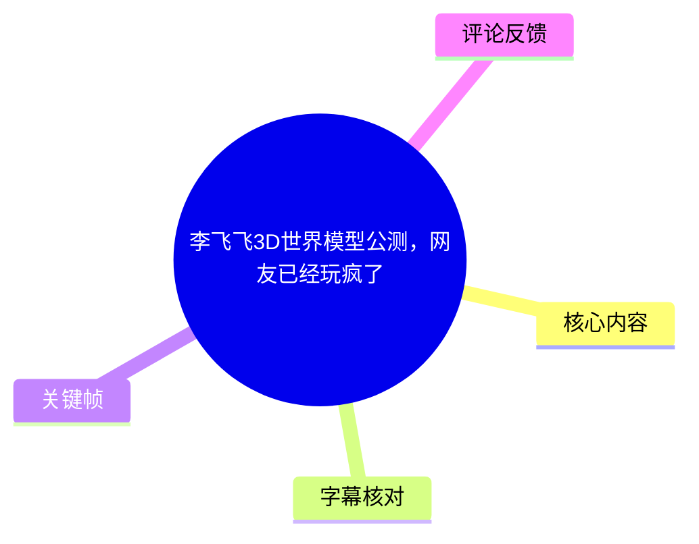
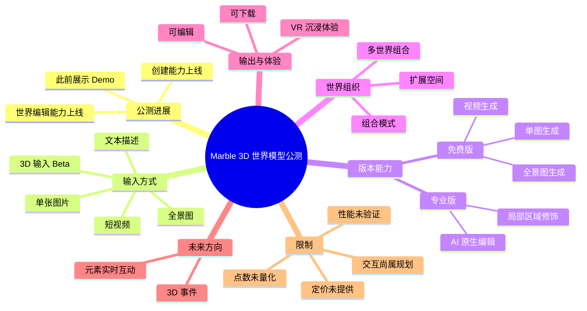
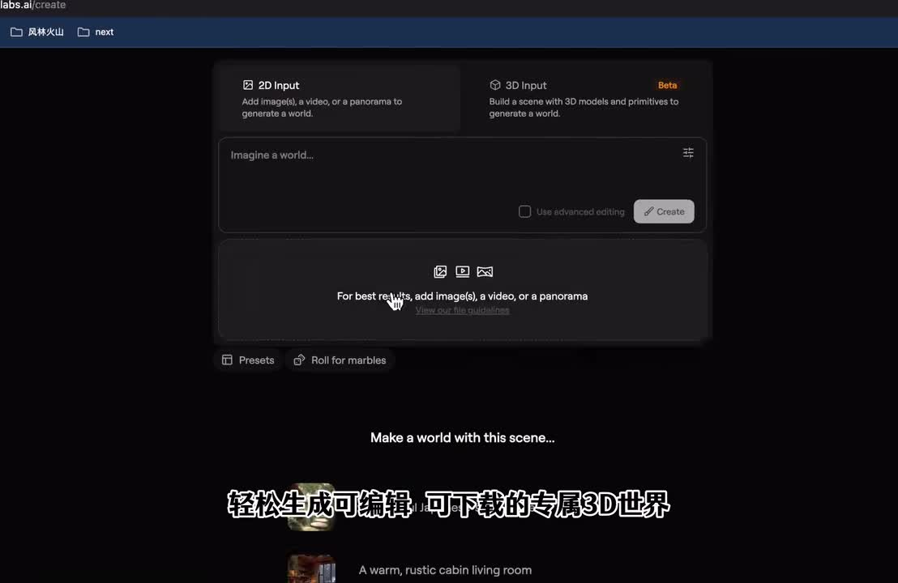
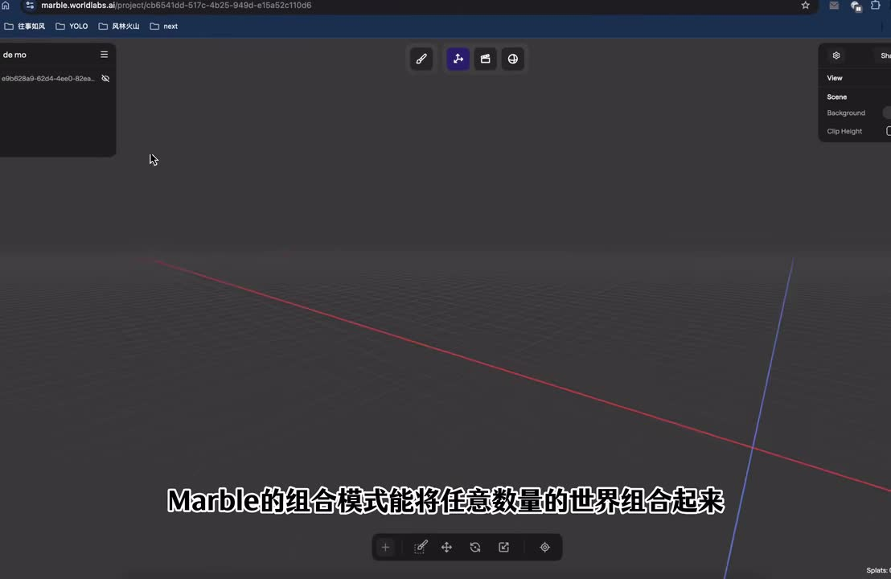

# 李飞飞3D世界模型公测，网友已经玩疯了

> 来源：[Bilibili 视频](https://www.bilibili.com/video/BV1wnCtBRE52)  
> UP 主：AI逐风｜时长：1 分 09 秒｜合集：AIcode  
> 视频简介提供的产品地址：<https://marble.worldlabs.ai/>

## 小结

视频介绍了 Marble 世界模型的公测进展。UP 主表示，该产品此前主要展示 Demo，而创建世界与世界编辑能力现已上线。其主张是：普通用户不依赖专业 3D 建模团队，也可以用文本、照片、短视频或全景图等输入生成个人 3D 世界。

视频展示和描述的能力链路包括：生成可浏览的 3D 世界、继续编辑、下载，以及在 VR 中沉浸式访问。版本方面，免费版被称支持单图、视频、全景图生成；专业版则支持 AI 原生世界编辑，尤其是对局部区域进行修饰。

Marble 还提供“组合模式（Composition Mode）”：视频称可将任意数量的世界组合为更广阔的空间。UP 主以“梦幻蘑菇小屋”和从像素风世界继续向未知区域延展的例子，强调生成式世界创作与空间扩展的想象力。

不过，视频没有给出实际点数额度、生成耗时、价格、导出格式、商用许可、VR 设备兼容性、局部编辑精度和组合后的性能上限。“免费账号点数很多”“任意数量”“无限制、无边界扩展”等应视为视频宣传或体验性表述，不能直接推断为没有资源、性能或配额限制。

该信息具有时效性。视频处于 Marble 公测语境，产品入口、免费权益、专业版功能、点数规则及加载表现均可能已经变化。热评中亦有用户反馈页面加载缓慢，但这只是个体体验，不能代表整体服务表现。

## 思维导图





## 目录

- [公测消息与适用范围](#公测消息与适用范围)
- [创建入口、输入方式与产物](#创建入口输入方式与产物)
- [免费版、专业版与局部编辑](#免费版专业版与局部编辑)
- [组合模式与未来交互](#组合模式与未来交互)
- [可依据视频执行的尝试流程](#可依据视频执行的尝试流程)
- [限制、时效性与结论](#限制时效性与结论)
- [字幕比对](#字幕比对)
- [评论分析](#评论分析)
- [处理记录](#处理记录)

## 公测消息与适用范围 [00:00](https://www.bilibili.com/video/BV1wnCtBRE52?t=0)

视频开头的新闻点是 Marble 3D 世界模型进入公测。UP 主称其此前“只是放出 Demo”，当前“创建”和“世界编辑”能力均已上线。视频简介明确给出了 Marble 网站地址：<https://marble.worldlabs.ai/>。

### 视频明确陈述

- 用户不需要专业团队建模。
- 可以使用文本、照片，甚至短视频创建 3D 世界。
- 生成结果被描述为可编辑、可下载。
- 用户可以在 VR 中沉浸式体验生成的世界。

这里的“无需专业团队建模”应理解为**降低生成式空间创作的起步门槛**，而非证明传统 3D 建模、游戏引擎、网格优化、材质制作、动画制作或工程交付已经不再需要。

视频素材没有展示或说明以下专业生产指标：

| 未提供项目 | 不能据视频确认的内容 |
| --- | --- |
| 几何质量 | 网格拓扑、面数、法线、碰撞体、可编辑网格质量 |
| 视觉质量 | 纹理分辨率、光照稳定性、材质可控性、风格一致性 |
| 工程兼容 | 是否可导入 Unity、UE5、Blender 等软件 |
| 交付能力 | 导出文件格式、许可范围、是否可商用 |
| 性能表现 | 场景加载速度、浏览器性能、VR 帧率和设备要求 |

### 适合关注的人群

1. **视觉创作者与设计师**：可尝试将概念图、照片或视频转成可浏览的空间原型。
2. **VR / XR 兴趣用户**：视频将 VR 访问作为用途之一，但未展示具体头显或操作步骤。
3. **独立游戏与空间叙事创作者**：多世界组合的思路可用于快速搭建场景概念。
4. **AI 3D 工具观察者**：可观察“生成世界—编辑世界—交互世界”的产品路径。

## 创建入口、输入方式与产物 [00:10](https://www.bilibili.com/video/BV1wnCtBRE52?t=10)

视频称用户可通过文本、照片和短视频生成世界；ASR 还提到免费版支持单图、视频、全景图生产。关键帧中的创建页面进一步提供了可见界面依据。



> 图：关键帧直接显示 Marble 的创建页。可见 `2D Input`、`3D Input`、文本描述区和图片/视频/全景图上传提示，为正文中的输入方式与创建入口提供界面证据；其中 `3D Input` 被标记为 `Beta`，说明该入口仍处于测试状态。

### 界面可见信息

| 界面项 | 关键帧可见内容 | 可确认范围 |
| --- | --- | --- |
| `2D Input` | “Add image(s), a video, or a panorama to generate a world.” | 图片、视频、全景图可作为生成世界的输入 |
| `3D Input` | “Build a scene with 3D models and primitives to generate a world.”，标记 `Beta` | 可以通过 3D 模型和基础几何体构建场景后生成世界；该入口仍为 Beta |
| 文本框 | `Imagine a world...` | 支持以自然语言描述构思世界 |
| 上传区域 | 建议加入图片、视频或全景图以得到更好结果 | 平台推荐使用视觉输入辅助生成 |
| 高级编辑选项 | `Use advanced editing` | 创建页存在高级编辑相关选项，但用途和权限规则未被视频说明 |
| 创建按钮 | `Create` | 用户可在页面发起创建任务 |

### 输入到产物的链路

```text
文本描述 / 图片 / 视频 / 全景图 / 3D 模型与基础几何体（Beta）
                              ↓
                       创建一个 3D 世界
                              ↓
                  浏览、编辑、下载、尝试 VR 体验
```

视频称生成结果可编辑、可下载并支持 VR 沉浸体验，但并未说明下载格式、下载是否受账户等级限制、VR 支持哪些设备或浏览器，也没有展示生成后的工程文件结构。因此，不能将“可下载”扩展为可导出某一种特定格式，或可直接进入某个专业制作流程。

## 免费版、专业版与局部编辑 [00:28](https://www.bilibili.com/video/BV1wnCtBRE52?t=28)

视频将 Marble 能力分为免费版与专业版，但没有展示定价页、权益对照表或实际点数数据。

| 账户层级 | 视频所述能力 | 素材未提供的信息 |
| --- | --- | --- |
| 免费版 | 支持单图、视频、全景图生成世界；账号点数“很亲民”“非常多” | 点数数值、刷新周期、单次生成消耗、排队优先级、下载和 VR 是否受限 |
| 专业版 | 支持 AI 原生世界编辑工具 | 价格、订阅周期、编辑次数、具体控制方式和完整功能范围 |
| 专业版编辑 | 可“狠狠局部修饰一个区域” | 区域选择方式、遮罩能力、重绘精度、撤销与版本管理机制 |

### 局部编辑的可理解边界

视频将专业版的重点放在 AI 原生世界编辑，特别是局部区域修饰。这说明产品目标并不只是一次性生成静态空间，也希望用户能在已有世界基础上继续修改。

但下列细节没有被素材证实：

- 如何指定需要修改的区域；
- 是否依赖画笔、框选、遮罩、文字指令或其他方式；
- 编辑后是否保持原有空间的比例、风格、光照和几何连续性；
- 编辑耗时、失败重试机制与点数消耗；
- 是否支持撤销、历史版本或多人协作。

因此，“局部编辑”可记录为视频宣称的产品能力，不能据此判断其可控程度已达到传统 DCC 软件中的精细编辑水平。

### 视频中的创作示例

UP 主称自己生成了一个“梦幻的蘑菇小屋”，并描述由像素风世界向未知区域继续延展的体验。该示例主要用于展示创作氛围与空间拓展想象；ASR 对其中部分语句存在不稳定识别，故不将异常句子视为可量化的功能参数。

## 组合模式与未来交互 [00:48](https://www.bilibili.com/video/BV1wnCtBRE52?t=48)

视频介绍了 Marble 的“组合模式”，称其可以将任意数量的世界组合起来，构建更广阔的空间。



> 图：关键帧展示 Marble 的项目编辑工作区、网格视图和底部工具栏，同时字幕写明“Marble 的组合模式能将任意数量的世界组合起来”。该画面有助于理解“组合”面向场景组织与扩展，而不是单纯切换多个独立项目。

### 对组合模式的稳妥理解

视频可以确认的是：Marble 存在将多个世界组合的工作流。它强调由多个小世界构建更大空间的可能性。

但“任意数量”不能直接推导为：

- 没有世界数量、场景尺寸或账户资源上限；
- 没有浏览器、显存、网络和渲染性能限制；
- 不会出现尺度、地形、光照、风格或边界衔接问题；
- 组合后的场景一定可以在 VR 中稳定流畅运行。

视频提及“无限制、无边界的扩展生产”，更适合被理解为生成式空间可持续延展的创作愿景，而不是已被素材验证的无限计算资源或无限场景能力。

### 未来世界模型方向

UP 主转述团队观点：当前的生成和编辑能力“还只是基础”，未来世界模型会重点发展：

1. **创造 3D 事件**：不仅生成环境，也能让场景中发生事件。
2. **实时互动**：用户可与世界内部元素实时互动。
3. **从场景生成走向交互环境**：世界模型的目标将从视觉空间进一步延伸到可互动空间。

上述内容属于视频对未来规划的转述，并非本视频展示的已上线功能。素材未提供交互 API、脚本系统、物理系统、多人同步、事件编辑方式或上线时间表。

## 可依据视频执行的尝试流程 [00:10](https://www.bilibili.com/video/BV1wnCtBRE52?t=10)

以下流程仅依据视频、ASR、简介链接和关键帧中可确认的信息整理。未出现的按钮名称、收费策略和参数规则不作补充推断。

### 1. 进入 Marble 站点并核对当前账户权限

访问视频简介给出的 <https://marble.worldlabs.ai/>，查看当前账户是否可使用创建、编辑、下载和 VR 相关入口。

视频只说明存在免费版和专业版，未说明每类账户的完整权限范围，因此应以实际页面当下显示的规则为准。

### 2. 选择输入模式

可按手头素材选择输入：

- **文本描述**：在 `Imagine a world...` 区域描述想要生成的场景。
- **图片**：上传单图或多张图片，适合概念图、照片或视觉参考。
- **视频**：上传短视频，作为生成空间的视觉依据。
- **全景图**：使用全景画面提供更完整的空间视野。
- **3D 输入（Beta）**：如已有 3D 模型或基础几何体，可尝试建立场景后生成世界。

关键帧仅能证实平台建议加入图片、视频或全景图以取得较好结果，不能证明各类输入的质量、成功率或消耗相同。

### 3. 发起创建

输入文字和/或添加视觉素材后，点击 `Create` 发起世界创建。页面中存在 `Use advanced editing` 选项，但视频未解释该选项的实际功能、适用账户或点数影响。

### 4. 检查生成世界

生成后，可围绕视频宣称的能力链路进行检查：

- 是否成功得到可浏览的三维空间；
- 关键物体和空间关系是否接近输入意图；
- 是否出现漂浮、破碎、遮挡、尺度异常或不可进入区域；
- 若需要后续编辑，局部区域能否按预期调整；
- 若需要下载或 VR 访问，当前账户是否实际开放相应入口。

这些项目是根据视频所述“生成—编辑—下载—VR”流程形成的验收建议，不是视频展示的官方测试标准。

### 5. 编辑或组合世界

- 需要局部调整时，视频将 AI 原生编辑定位为专业版能力。
- 需要拓展场景时，可尝试将多个世界组合到更大空间。
- 组合后应检查边界、比例、视觉一致性和加载表现；视频没有证明这些问题能够自动解决。

### 6. 使用前确认外部限制

如计划公开展示、用于商业项目、导出工程或进行 VR 体验，仍需在当前产品页面额外确认：

- 点数规则与收费方式；
- 上传素材与生成结果的版权、隐私及许可；
- 下载格式和导出限制；
- 浏览器、网络与设备要求；
- VR 平台及头显兼容性。

这些关键条件均未在视频中给出确定答案。

## 限制、时效性与结论 [00:58](https://www.bilibili.com/video/BV1wnCtBRE52?t=58)

### 已知能力与信息缺口

| 项目 | 视频或关键帧可确认内容 | 仍无法确认的内容 |
| --- | --- | --- |
| 输入 | 文本、图片、视频、全景图；另有 Beta 3D 输入 | 支持格式、文件大小、分辨率、时长和上传上限 |
| 创建 | 可生成 3D 世界 | 生成耗时、失败率、质量稳定性与资源消耗 |
| 编辑 | 专业版支持 AI 原生局部编辑 | 选区方式、精度、撤销、版本管理与协作 |
| 组合 | 可将多个世界组合 | 数量上限、自动衔接能力和性能代价 |
| 免费权益 | 视频称点数较多、较亲民 | 实际点数、重置周期、单次消耗与地区差异 |
| 下载 | 视频称可下载 | 文件格式、商用许可、编辑保留程度 |
| VR | 视频称可沉浸式体验 | 设备支持、浏览器要求、帧率与控制方式 |
| 未来交互 | 未来可能有 3D 事件与实时互动 | 上线时间、功能形态与开放范围 |

### 时效性说明

- 元数据显示视频发布时间为 **2025-11-13**。
- 素材抓取时间为 **2026-07-13**。
- 视频描述的是 Marble 的公测阶段能力，产品开放范围、价格、点数、功能入口和性能表现可能已经发生变化。
- 本文仅依据所给视频、简介、关键帧、ASR 与热评整理，不把宣传性表达或未来规划视为稳定承诺。

### 结论

Marble 在视频中呈现的是一条从二维内容到可浏览 3D 世界的工具路径：

```text
输入素材与文本
    ↓
生成 3D 世界
    ↓
局部编辑与多世界组合
    ↓
下载或 VR 体验
    ↓
未来扩展至事件与实时互动
```

它的现实价值在于降低 3D 场景概念创作的入口，尤其适合快速原型、沉浸式展示和空间灵感探索。但对于专业生产或正式交付，仍需逐项验证生成质量、可编辑性、性能、下载格式、许可和设备兼容性。

## 字幕比对 [00:00](https://www.bilibili.com/video/BV1wnCtBRE52?t=0)

本任务未提供可用的 Bilibili 站内字幕；本次 ASR 已执行。正文以 ASR 为主要语音文本依据，并结合视频简介和关键帧中可见的英文界面文字校正关键术语。

| 字幕来源 | 完整性 | 专有名词 | 时间轴 | 主要问题 |
| --- | --- | --- | --- | --- |
| Bilibili 站内字幕 | 未提供可用文件，无法使用 | 无法评估 | 无法评估 | 无可逐句对照的站内字幕内容 |
| 本次 ASR 字幕 | 覆盖公测、创建、版本、编辑、组合和未来展望等主要叙述 | 可识别 `Marble`、VR、专业版、组合模式等，但存在误识别 | 仅提供文本顺序，未提供逐句时间戳 | 繁简混杂、个别同音误识别、部分句子语义不通顺 |

### 最终字幕选择与校正

- **字幕选择**：站内字幕不可用，因此采用本次 ASR 作为主文本来源。
- **Marble**：ASR 中出现 Marble；与视频简介 URL `marble.worldlabs.ai` 及关键帧页面域名一致，可确认。
- **“建筑”校正为“建模”**：ASR 写作“不需要专业团队建筑”，但视频简介为“不需要专业团队建模”，因此正文采用“建模”。
- **“专业版”“编辑”“组合模式”**：ASR 存在繁简混用，但语义稳定，并可由关键帧字幕“Marble 的组合模式”辅助确认。
- **异常句处理**：ASR 中“一个从像素世界穿越到未知领域”等表述无法稳定还原原句，不作为确定功能或参数引用。
- **时间轴说明**：正文链接时间点依据 ASR 内容顺序、关键帧位置与 69 秒总时长划分，仅用于导航，不等同于官方逐字级时间轴。

## 评论分析 [00:00](https://www.bilibili.com/video/BV1wnCtBRE52?t=0)

仅处理本次可获取的热评前三条。评论反映用户态度或个体使用感受，不构成对 Marble 功能的独立验证。

| 热评 | 点赞 | 观点与参考价值 | 可信度与边界 |
| --- | ---: | --- | --- |
| `taobao2321441`：“以后建模都不用了，直接画张图得了” | 13 | 表达了对图片驱动 3D 生成降低门槛的期待，与视频“普通人可通过照片生成世界”的主线呼应。 | 属于夸张式感叹。视频没有证明传统建模在高精度资产、动画、性能优化或工程交付中已被替代。 |
| `草稿动画-小鹏`：“为什么打开加载非常慢，一直只有小点点” | 7 | 提供了一个潜在实践问题：页面或场景可能发生加载缓慢、长时间停留在加载状态的情况。 | 单一用户反馈，未说明网络、地区、设备、浏览器、时间和账户状态，不能归因为平台整体性能问题。 |
| `绯樱欢愉`：“给你们讲个笑话，UE5和Unity也是属于大模型。[笑哭]” | 5 | 以调侃方式提醒：生成式世界模型工具与 Unity、UE5 等游戏引擎并非同一类别，不能简单等同或替代。 | 评论未提供技术论证，但“区分工具定位”的提醒具有参考意义；实际兼容性仍需查阅产品文档。 |

## 处理记录 [00:00](https://www.bilibili.com/video/BV1wnCtBRE52?t=0)

- **Worker ID**：`worker-mrj0wbly-5dc4e50c`
- **模型**：`gpt-5.6-terra`
- **调用工具与素材**：基于任务提供的 Bilibili 元数据、视频简介、素材清单、已执行的 ASR 文本、关键帧和热评前三条进行整理。
- **字幕选择**：未提供可用站内字幕；本次 ASR 已执行，采用 ASR 作为正文主字幕来源。对“Marble”“建模”“组合模式”等内容，使用视频简介及关键帧可见文字进行上下文校正。
- **关键帧依据**：
  - `frames/frame-001.jpg`：展示创建页中的 2D 输入、Beta 3D 输入、文本框、图片/视频/全景图上传提示和创建按钮，适合支撑输入与创建章节。
  - `frames/frame-002.jpg`：展示项目编辑工作区及“组合模式能将任意数量的世界组合起来”的字幕，适合支撑多世界组合章节。
- **热评范围**：仅分析素材中可获取的热评前三条，未扩展到其他评论、回复或站外讨论。
- **缓存清理**：任务素材未提供缓存清理执行日志，无法确认实际清理动作；本文未虚构清理结果，也未新增素材外文件。
- **未解决问题**：缺少逐句时间戳字幕；缺少 Marble 当前价格、点数、生成耗时、导出格式、VR 兼容性、许可证及性能上限的独立资料；视频对“无限扩展”和未来交互的表述尚未在素材内获得进一步验证。

## 评论分析

本次流程未获取到可用热评，因此不推断观众态度或额外结论。
