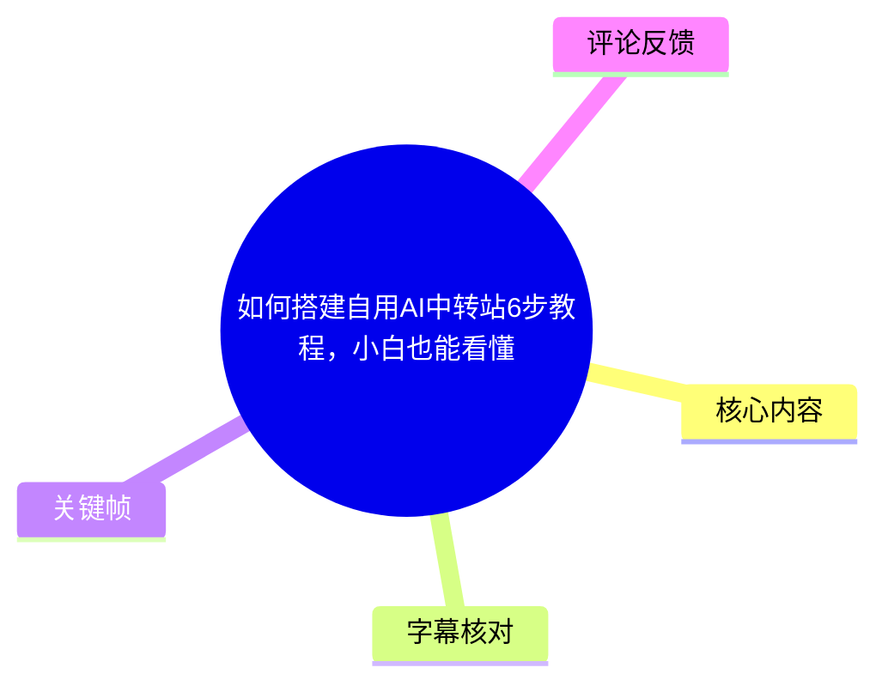
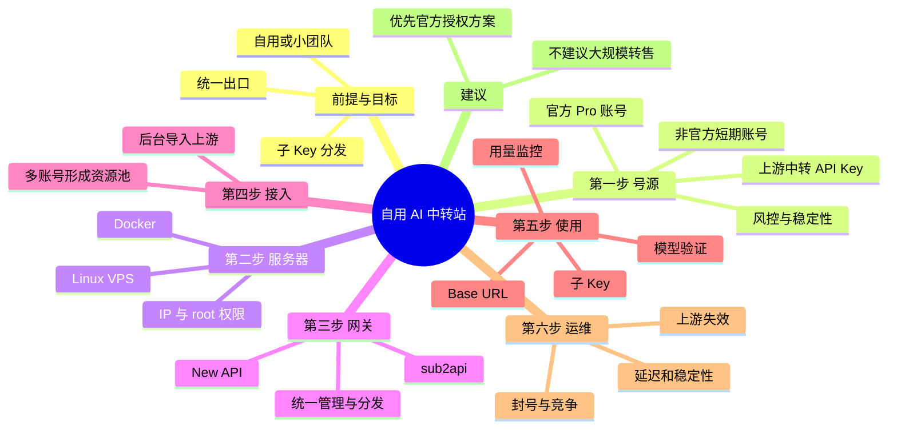
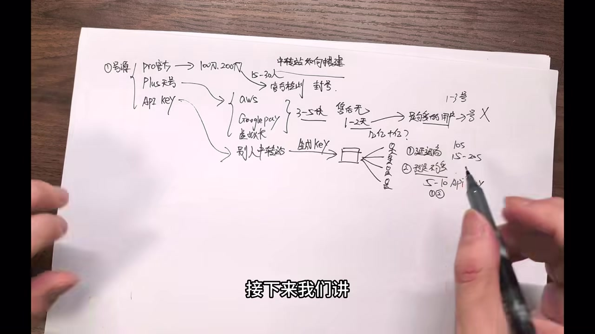

# 如何搭建自用AI中转站6步教程，小白也能看懂

> 来源：[Bilibili 视频](https://www.bilibili.com/video/BV1oK7A62EK2)<br>
> UP 主：方鑫三个金｜视频时长：10 分 55 秒｜合集：AIcode  
> 本文中的价格、额度、封号风险、模型名称与产品能力均为视频作者的口述或示例，不构成事实保证、服务承诺或合规建议。

## 小结

视频以“自用或小团队 AI 中转站”为目标，拆解了一套从上游账号/密钥、服务器、网关部署、账号接入、生成子 Key，到测试和日常维护的六步思路。其核心不是给出可复制的命令，而是解释中转站的资源流转关系：上游账号或 API Key 经网关形成统一出口，再按用户生成子 Key 进行分发和用量管理。

作者首先强调，真正的难点并不只是部署，而是**号源稳定性、风控和后续维护**。他列举官方 Pro 账号、所谓“Plus 天号”、其他中转站 API Key 三类上游渠道，并分别指出批量使用可能触发封号、短生命周期账号需要快速消耗额度、二级中转会提高延迟且依赖上游稳定性等问题。

基础设施层面，视频建议准备具有 IP 与 root 权限的 Linux/VPS 服务器，并安装 Docker。网关项目提到 New API 与 sub2api：它们可将上游接入统一管理，提供统一的 Base URL，并生成可分发给不同用户的子 Key。视频没有展示具体 Docker 命令、镜像地址、环境变量、域名解析、HTTPS 配置或实际部署界面，因此不能据此直接复现一个可运行站点。

作者特别警示“模型灌水/模型替换”风险：前端标注的模型名称未必等于实际调用的上游模型。其建议是使用第三方“中转站测评”工具，输入 Base URL 和 Key 测试模型表现；但视频未说明测试工具的名称、方法学、准确率与数据安全策略，因此测试结果只能作为参考，不能视作模型来源的确定性证明。

结论上，视频认为自用或小团队中转的风险相对可控，但面向外部大量售卖 Token 会面对封号、投诉、竞争和上游不稳定等风险。作者最终更倾向建议直接购买并使用官方账号，而非将中转站作为规模化盈利业务。涉及账号共享、第三方账号、转售与绕过平台限制的做法，可能违反相应平台规则或带来安全、隐私及法律风险，应优先使用官方授权的 API、团队计划和计费方式。

## 思维导图





## 目录

- [视频定位、时效性与边界](#视频定位时效性与边界)
- [第 1 步：上游号源与风险评估](#第-1-步上游号源与风险评估-0030)
- [第 2 步：准备服务器与 Docker](#第-2-步准备服务器与-docker-0258)
- [第 3—4 步：选择网关并接入账号](#第-34-步选择网关并接入账号-0337)
- [第 5 步：Base URL、子 Key 与模型验证](#第-5-步base-url子-key-与模型验证-0602)
- [第 6 步：日常维护与业务风险](#第-6-步日常维护与业务风险-0811)
- [可执行的合规实践清单](#可执行的合规实践清单-0213)
- [结论与限制](#结论与限制-0947)
- [字幕比对](#字幕比对)
- [评论分析](#评论分析)
- [处理记录](#处理记录)

## 视频定位、时效性与边界

本视频定位为面向“小白”的概念型教程，采用纸笔示意讲解中转站的组成和商业/技术风险。实际内容覆盖了作者所说的六步，但更接近架构解释与经验判断，而不是从零开始的可复现实操课程。

视频发布于 2026 年 6 月。视频中提到的产品名称、模型版本、价格、额度、重置频率和风控强度具有明显时效性；例如“GPT 5.4 / GPT 5.5”“Claude 4.7 / 4.8”“Codex 20X”等均来自 ASR 口述，未提供官方链接、产品页面或具体版本说明，不能据此确认当前仍然有效。

此外，视频将部分非官方账号称为“天号”，并涉及第三方账号、二级中转及 Token 转售情境。该类表达缺少来源、授权状况与合法性说明。本文仅整理视频观点，不补充账号获取、绕过限制、入侵或未经授权使用服务的操作方法。

## 第 1 步：上游号源与风险评估 [00:30](https://www.bilibili.com/video/BV1oK7A62EK2?t=30)

作者将中转站的首要问题概括为“号源”，即能够向下游用户提供模型调用能力的上游凭据或账号。视频列出三种路径：

1. **官方 Pro 账号**  
   作者口述存在“100 刀、200 刀”等档位，并估计 200 刀账号可供 15—30 人使用；但他明确表示自己“没有测过”，因此人数和额度仅是个人估计。  
   风险在于，若官方检测到批量使用痕迹，账号可能被封禁。作者认为这是一项共性风险，尤其当单个账号承载多人时更明显。

2. **所谓“Plus 天号”**  
   作者称，这类账号可能通过 AWS、Google Pay、虚拟卡等渠道获得，并称市场收购成本约为 3—5 元/个、售后基本没有。这些信息均未经视频内证实。  
   作者声称其生命周期可能只有 1—2 天，因此如果不能在短时间内消耗完额度，成本会直接损失；维护上可能需要每天持续导入新账号。这里反映的关键不是具体价格，而是：**短周期、非官方来源的上游会将稳定性问题转化为持续的运维负担和合规风险。**

3. **接入其他中转站的 API Key**  
   作者认为这条路径“较省功夫”：把别人的中转 Key 接入自己的网关，再向自己的用户分发子 Key。  
   其代价是多一层转发。作者给出的经验值是：普通中转延迟约 10 秒，二级中转可能达到 10—20 秒；且一旦上游中转失效，下游无法自行恢复。视频建议可接入 5—10 个备用 Key，或选择 1—2 个官方企业级 Key 来提升稳定性。以上均为作者经验性建议，未给出压测条件、网络位置、并发量或模型类型。


> 图：画面将“Pro 账号、Plus 账号、API Key”并列，并标出封号、短生命周期、二级中转等风险。它直观呈现视频的核心判断：中转站首先是上游资源与风险管理问题，而不只是部署问题。

### 资源池与体验的关系 [02:34](https://www.bilibili.com/video/BV1oK7A62EK2?t=154)

作者认为，上游一旦崩溃会直接影响下游服务；备用 Key 可以缓解单点失效，但无法消除对上游的依赖。若使用多个官方账号形成资源池，理论上可改善稳定性、延迟和用户体验；但账号的批量或共享使用仍可能引入平台规则与风控问题。

对于自用场景，更稳妥的原则是：

- 使用本人或团队依法、依约获取的官方服务与 API；
- 不把共享账号、非官方账号或不明来源 Key 视为可靠生产资源；
- 为上游调用建立限额、失败重试、异常告警和停用机制；
- 不将 API Key 暴露给不可信用户，也不让客户端直接持有高权限主密钥。

## 第 2 步：准备服务器与 Docker [02:58](https://www.bilibili.com/video/BV1oK7A62EK2?t=178)

作者将服务器描述为中转服务的“房子”：需要购买 Linux 服务器/VPS，获取 IP 和 root 权限，并安装 Docker。ASR 在 02:58—03:05 存在一句被截断的话，之后从 03:13 恢复；可确认的信息是作者强调服务器内存资源会影响使用体验，且 Docker 被视为后续部署工具的基础。

视频还提到可以借助 Codex、Claude Code 等“Web Coding”工具辅助编写或完成部署任务，但没有展示任何提示词、脚本或部署结果。

### 本步可确认的最低前置条件

| 项目 | 视频明确提及 | 视频未提供的关键细节 |
| --- | --- | --- |
| 操作系统 | Linux | 具体发行版与版本 |
| 服务器权限 | IP、root 权限 | 安全组、SSH 加固、普通用户策略 |
| 容器环境 | Docker | Docker Compose 版本、安装方式、镜像来源 |
| 资源考量 | 内存不能过低，以免“崩掉” | CPU、内存、磁盘、带宽、并发的量化要求 |
| 辅助工具 | Codex、Claude Code | 实际提示词、代码与审核流程 |



> 图：画面右侧将上游、站点和用户分发关系连在一起，并标出延迟与备用 API 等要点。它有助于理解服务器的角色：服务器不是额度来源，而是承载网关、统一接入和转发的运行环境。

### 安全限制

视频没有讲到服务器安全，而这对任何实际部署都不可省略。若基于官方授权 API 搭建内部网关，至少应落实：

- 不把管理后台、数据库、Docker Socket 或 root SSH 直接暴露在公网；
- 使用独立的密钥管理和环境变量，不将 Key 写入前端、日志或公开仓库；
- 为管理后台设置强身份认证、最小权限和访问控制；
- 定期更新系统与容器镜像，保留审计日志和备份；
- 为异常调用、成本突增、上游连续失败设置监控与告警。

## 第 3—4 步：选择网关并接入账号 [03:37](https://www.bilibili.com/video/BV1oK7A62EK2?t=217)

作者称，常见开源网关项目包括 **New API** 和 **sub2api**。视频以 sub2api 为主要说明对象，但没有给出项目仓库、许可证、具体版本、安装命令或配置文件；因此只能确认作者在概念上把它们视为网关/分发平台，而不能确认某个项目的当前功能或安全状态。

### 网关在视频中的逻辑

作者的比喻是“造一个小房子”：

1. 将上游的 ChatGPT / Claude Pro 等账号或上游能力导入网关；
2. 网关提供一个统一出口；
3. 管理员基于统一出口生成多个子 Key；
4. 再将子 Key 分发给不同用户；
5. 用户通过子 Key 调用服务，后台记录或监控额度、使用情况。

```text
经授权的上游 API / 团队服务
            │
            ▼
    网关管理后台 / 统一出口
            │
     ┌──────┼──────┐
     ▼      ▼      ▼
  子 Key A 子 Key B 子 Key C
     │      │      │
   用户/内部工具/团队成员
```

### 接入与资源池 [05:14](https://www.bilibili.com/video/BV1oK7A62EK2?t=314)

作者称，将 Pro 账号接入并由网关“反代”后，可以生成多个 Key；接入多个 Pro 账号可形成资源池，理论上可提升稳定性并降低用户感知延迟。但作者紧接着重申：Pro 账号价格较高，且被封后损失可能很大，官方风控也在变严。

这里需要区分两个层次：

- **视频的架构描述**：一个上游接入，经网关产生多份下游凭据；
- **实际可行性与授权**：是否允许账号共享、批量调用、转发和再分发，取决于各服务的当前条款、API 协议、团队授权和地区规则，视频未作验证。


> 图：该帧完整保留了作者纸笔梳理的“号源 → 中转 → 用户”结构，并出现“第三个方法比较省功夫”的字幕。它适合作为理解网关分发关系的视觉辅助，但其中数字和来源仅代表作者口述，不应当作经过验证的参数。

## 第 5 步：Base URL、子 Key 与模型验证 [06:02](https://www.bilibili.com/video/BV1oK7A62EK2?t=362)

作者把账号接入后的使用凭据概括为两部分：

- **Base URL**：网关向用户暴露的统一服务地址；
- **Key / 子 Key**：为某个用户或用途生成的访问密钥。

视频称用户将 Base URL、Key，以及模型名称等信息填入客户端或配置文件后，Codex、Claude Code 等工具可以识别并经由该中转调用额度。这里未展示实际配置格式，也没有说明不同客户端的兼容性、认证方式、路径格式或模型映射规则。

### 用量监控

作者提到 sub2api 后台可监控不同用户的额度与使用情况。对于内部团队，这意味着应至少按人、按项目或按应用分配独立凭据，而不是共用一个主 Key。独立 Key 的价值包括：

- 发生泄露时可以单独吊销；
- 可定位异常流量和成本来源；
- 可为不同成员设置配额或用途限制；
- 避免一个用户的问题影响所有人。

### “模型灌水”风险 [06:34](https://www.bilibili.com/video/BV1oK7A62EK2?t=394)

作者提出一个关键风险：后台实际接入的模型可能与前端宣传的名称不同。例如，他假设后台接入“GPT 5.4”，前端却显示“GPT 5.5”；在低难度任务中，普通用户可能难以判断实际模型。作者进一步举例称，某些服务可能使用成本更低的模型，却按高价模型收费。

应注意：

- “GPT 5.4 / 5.5”“Claude 4.7 / 4.8”“Compose2”“Dipsig V4”等名称均按 ASR 转写保留，部分专有名词存在识别不确定性；
- 视频没有给出任何具体服务商、证据、测试样本或结论，不能据此指控某个服务存在替换模型行为；
- 对第三方网关而言，技术测试只能评估响应特征，不一定能证明真实上游来源，因为结果可受提示词、路由、缓存、系统提示、工具调用和后处理影响。

### 作者的验证建议 [07:22](https://www.bilibili.com/video/BV1oK7A62EK2?t=442)

作者建议在搜索引擎寻找“中转站测评”工具，输入 Base URL 与 Key，测试服务是否“满血”以及是否对应宣传模型。此建议存在两项重要限制：

1. **密钥安全**：将 Base URL 和 Key 提交给第三方测试站，可能泄露访问凭据、调用额度、请求数据甚至内网地址。应避免提交生产主 Key；若确需测试，应使用权限最小、额度受限、可随时撤销的临时测试 Key。
2. **结论边界**：模型基准或对比题只能提供概率性信号，不能替代官方账单、审计记录、服务商合同和上游透明度证明。


> 图：画面用最简洁的手绘列出 Pro 账号、Plus 账号与 API Key 三项，为后文关于统一出口、子 Key 和模型来源风险提供了概念起点。

## 第 6 步：日常维护与业务风险 [08:11](https://www.bilibili.com/video/BV1oK7A62EK2?t=491)

作者将日常维护称为六步中“最麻烦”的一环，原因包括：

- 官方打击或风控导致上游账号失效；
- 号池质量不稳定；
- 上游服务质量波动；
- 站点规模变大后，可能遭遇同行竞争或恶意行为；
- 若一次依赖大量短期账号，可能在次日集体失效并导致站点停运。

这部分的核心经验是：**部署成功不等于服务可持续**。一个中转系统的持续成本包括上游采购与合规、容量规划、故障处理、密钥轮换、成本控制、用户支持、滥用治理和安全响应，而不仅是服务器费用。

### 行业竞争与商业化判断 [08:59](https://www.bilibili.com/video/BV1oK7A62EK2?t=539)

作者认为，相比一两年前，如今进入该领域的技术人员和使用 AI 编程工具的人变多，竞争重点转向用户和营销能力，价格也更低。这是作者对市场状态的主观观察，视频没有提供市场规模、成本、利润率、样本或行业报告。

作者承认相关业务存在“灰色利润”，但不建议观众去做规模化业务；他更建议把它作为使用工具，而非对外卖 Token 的生意。对于对外销售，作者提示需准备面对封号、投诉和竞争。

## 可执行的合规实践清单 [02:13](https://www.bilibili.com/video/BV1oK7A62EK2?t=133)

以下清单将视频的“统一出口—子 Key—监控—维护”思路收束为适用于**已获官方授权 API 或团队计划**的内部使用场景；它不包含不明账号采购、账号绕过、入侵、未授权共享或 Token 转售方法。

1. **确认授权边界**  
   阅读上游服务当前的服务条款、API 条款、团队/企业方案条款和计费政策，确认是否允许网关转发、多人使用、密钥再分配与内部共享。

2. **准备隔离的运行环境**  
   使用 Linux 服务器和 Docker 承载服务，但限制管理端口暴露；管理后台与用户 API 应分层保护。

3. **接入正式上游凭据**  
   只导入来源清晰、可审计、已获授权的 API Key 或团队凭据。为不同环境（开发、测试、生产）使用不同密钥。

4. **建立统一 API 出口**  
   通过经过审查的网关实现统一认证、模型路由、速率限制、日志与配额管理。部署前核验项目维护状态、许可证、漏洞公告和默认安全配置。

5. **生成最小权限子 Key**  
   按人员、应用或项目创建独立 Key，设置有效期、预算、速率和模型范围；避免将管理员 Key 或长期无限额 Key 发给客户端。

6. **测试正确性与故障路径**  
   验证鉴权失败、配额耗尽、上游超时、模型不可用、Key 撤销等场景。模型能力测试应使用临时 Key，并避免把敏感提示词或生产密钥提交给第三方测试网站。

7. **持续监控与响应**  
   监控调用量、错误率、延迟、费用、异常 IP 和密钥泄露信号；建立禁用 Key、切换官方备用上游、通知用户和复盘的流程。

## 结论与限制 [09:47](https://www.bilibili.com/video/BV1oK7A62EK2?t=587)

作者的最终判断是：自用或小团队使用中转可能较方便，但若大规模对外卖 Token，就必须承担封号、投诉、竞争和运维压力；其个人更推荐直接购买 Codex 账号而非从事中转转售。作者还称自己使用“Codex 20X”额度，每月会有三四次重置，折合“80X”，并认为足以支撑很高的使用量。此为个人使用经验和口述估计，缺少账号计划名称、计费规则和官方说明，不应视为当前产品参数。

本视频的可迁移价值主要在于以下几点：

- 网关部署只是开始，上游合法性、稳定性、密钥治理与维护才决定服务质量；
- Base URL + 子 Key 的结构适合内部统一管理，但应配合最小权限、限额、撤销与审计；
- 对模型名称和服务宣传保持验证意识，但也应避免为验证而泄露 Key；
- 对外商业化会显著放大合规、安全、售后和成本风险。

视频的主要缺口包括：没有具体部署命令、没有配置文件、没有域名和 HTTPS 步骤、没有压测数据、没有官方条款核验、没有故障演练，也没有对开源项目版本与安全性进行说明。因此，它适合用于建立问题框架，不足以作为生产环境的完整实施手册。

## 字幕比对

| 字幕来源 | 完整性 | 专有名词 | 时间轴 | 主要问题 |
| --- | --- | --- | --- | --- |
| Bilibili 站内字幕 | 未提供可用字幕 | 无法评估 | 无法使用 | 字幕工具返回 `Invalid URL`，未获取到站内字幕内容 |
| 本次 ASR 字幕 | 较完整：28 段，覆盖约 614.5 秒 / 654.464 秒，语音覆盖率 93.89% | 存在明显误识别或不确定拼写 | 可用，具有 SRT 起止时间 | 02:58—03:05 句子截断；03:05—03:13 有约 8.46 秒语音空档；部分模型/产品名、术语和数字不可靠 |

本次素材未提供可用站内字幕，因此正文以**本次 ASR 的 SRT 时间轴**作为章节链接依据。ASR 诊断未标记 `noAudioStream=true`，且识别到中文语音，故不存在“源视频无音轨”的情况。

ASR 使用 `medium` 模型，识别语言为中文，语言概率约为 0.9995；有时间戳，可作为定位依据，但不宜将所有转写词视为准确原文。结合上下文和关键帧，对以下词语作了谨慎整理：

- `new API`、`sub2 API`：ASR 有“new API”“sub2 API”等表述，正文统一以视频口述形式记录为 New API、sub2api；
- `Cloud code`：结合上下文整理为 Claude Code，但视频未给出拼写展示，保留不确定性；
- `Chad7PT5.5`、`cloud 是 4.7 4.8`：疑为 GPT、Claude 等模型名的误识别，正文使用“ASR 所述名称”并明确不作官方事实确认；
- `Dipsig V4`、`Compose2`：无法仅凭素材可靠确认准确产品名称，未擅自改写为具体正式名称；
- `天号`：视频口述词，未定义且可能指向非官方账号来源，正文不扩展其获取或使用方法。

## 评论分析

仅获取到热评前三条，评论不作为已验证事实或操作建议。

1. **摇啊摇啊摇（2 赞）**：“能不能讲一下如何黑入这种网站， 然后免费用”  
   该评论表达了未经授权入侵并免费使用服务的诉求，属于明显不当且可能违法的方向。视频本身并未提供这类内容，本文也不会补充任何入侵、绕过认证或盗用账户的方法。

2. **跟着哥哥来巡山（3 赞）**：“有人一起拼，up这种共享gpt pro 么，两人用。私聊”  
   评论反映出观众对分摊订阅成本、共享 Pro 账号的需求。但是否允许多人共享及如何共享，取决于服务条款和账号类型；视频也提醒批量使用可能带来风控。应优先考虑官方团队方案或正式 API 计费，不应把私下共享视为低风险方案。

3. **Z市热心好市民（2 赞）**：“支持一下up！”  
   这是对作者的支持性反馈，不包含新的技术信息或可验证补充。

## 处理记录

- Worker ID：`worker-mrj0www4-e8d79408`
- 调用模型：`gpt-5.6-terra`
- 使用素材与工具结果：读取视频元数据、ASR SRT、ASR 诊断、12 张关键帧清单、热评前三条；站内字幕获取工具曾返回 `Invalid URL`，故无可用站内字幕。
- 字幕选择：未提供站内字幕，采用本次 ASR 的带时间戳 SRT 作为正文定位来源；对明显不确定的专有名词保留 ASR 不确定性，不将其校正为未经素材证明的正式名称。
- 关键帧选择依据：选用 `frames/frame-001.jpg`、`frames/frame-002.jpg`、`frames/frame-003.jpg`、`frames/frame-004.jpg`。这些画面均为作者手绘讲解，分别展示号源分类、风险要点、二级中转与用户分发关系，能直接辅助理解正文架构；未将关键帧当作未出现内容的证据。
- 时间轴依据：所有章节链接均按本次 ASR SRT 的真实起始秒数生成；未按文字顺序推测时间。
- 缓存清理：素材未提供缓存清理执行日志或结果，无法确认是否已清理；本文不虚构清理状态。
- 未解决问题：缺少站内字幕、完整画面逐帧时间戳、网关项目具体版本与仓库、实际部署命令、官方条款与产品参数来源；ASR 中部分产品名及数字存在识别误差风险。
