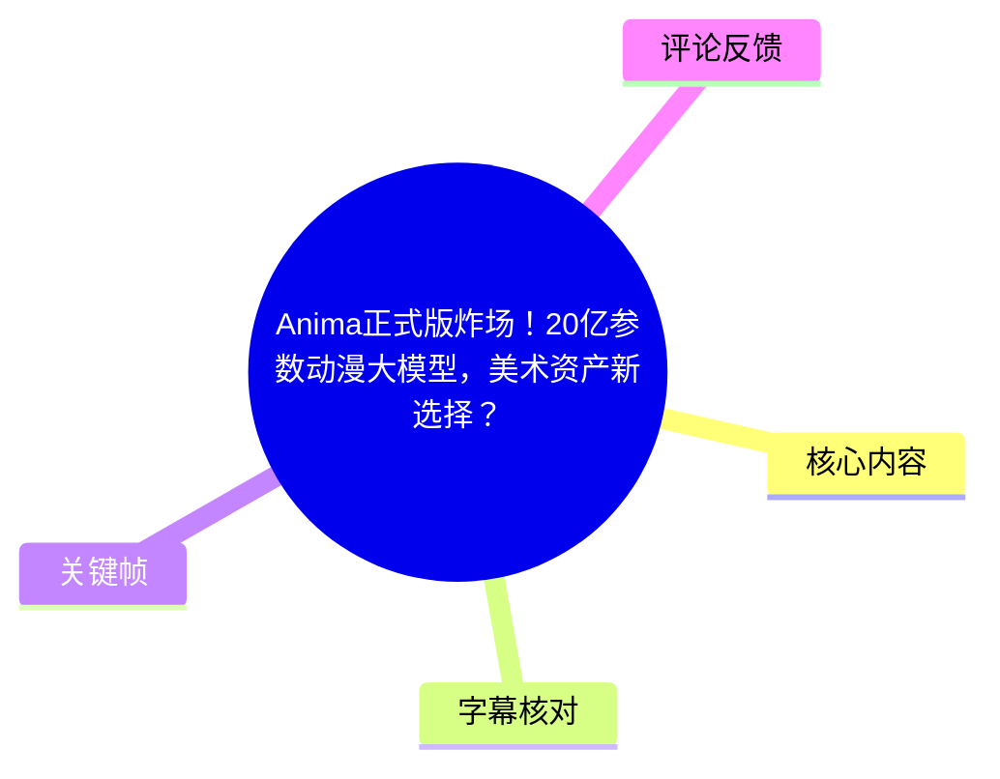
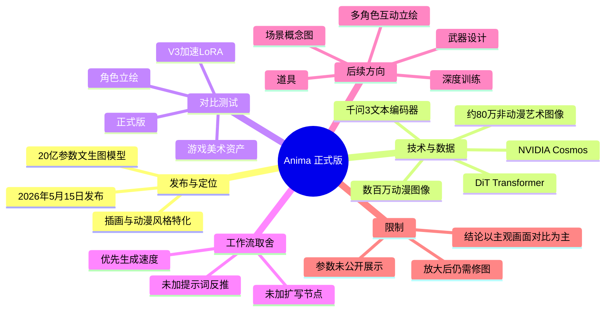
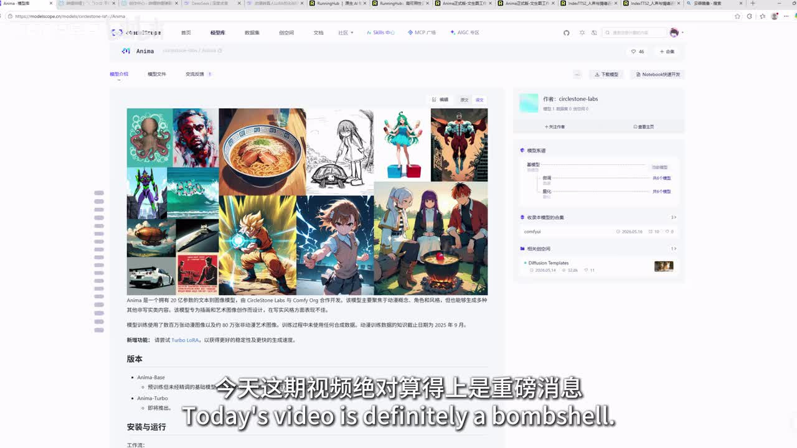
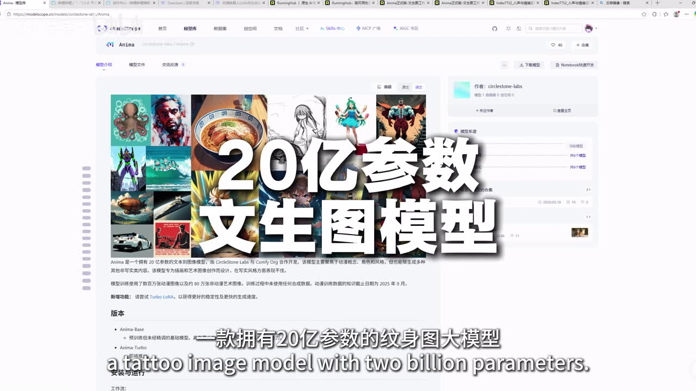
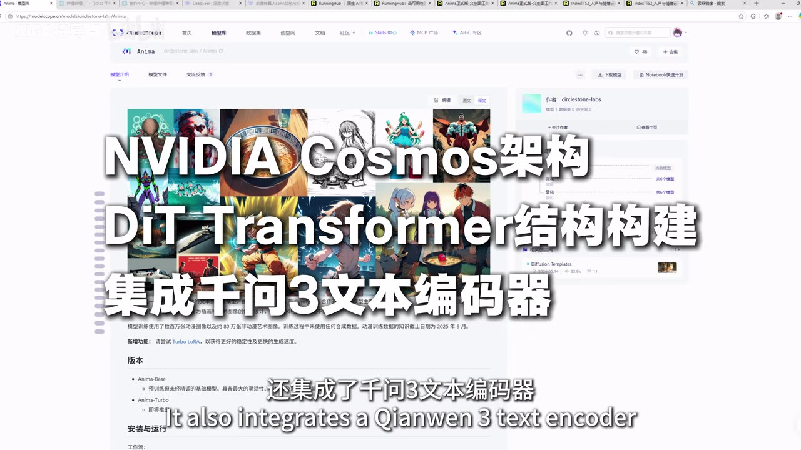
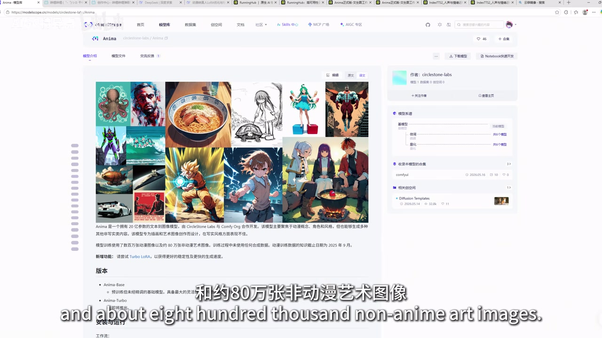

# Anima正式版炸场！20亿参数动漫大模型，美术资产新选择？

> 来源：[Bilibili 视频](https://www.bilibili.com/video/BV1HdLG67Eo3)  
> UP 主：AIGC特异点｜视频时长：2 分 39 秒｜合集：AIcode  
> 标签：二次元、动漫、AI 绘画、美术资产、训练、Anima、ComfyUI

## 小结

视频介绍了 Anima 正式版：UP 主称其于 **2026 年 5 月 15 日**发布，是一个面向插画与动漫风格的文生图模型，参数量为 **20 亿**。视频所展示的模型页面将其定位为由 CircleStone Labs 与 Comfy Org 联合开发的项目；这些名称与具体技术描述均主要来自 UP 主转述及屏幕页面，不应替代官方模型卡或技术报告的核验。

UP 主重点强调 Anima 的训练与架构卖点：基于 NVIDIA Cosmos 架构和 DiT Transformer，集成“千问 3”文本编码器；训练数据据称包含数百万张画师绘制的动漫图像与约 80 万张非动漫艺术图像，且未使用合成数据。视频将这些信息与更流畅的线条、更自然的色彩、较少“塑料感”的生成观感相关联，但没有给出可复现实验、基准分数或官方数据集审计材料。

实践部分是一次面向游戏美术资产的视觉对比。UP 主比较了 **Anima V3 + 加速 LoRA** 与“全新正式版”在深层动漫图、游戏美术资产上的表现，主观结论是正式版在细腻程度、色彩层次、笔触、线条、质感和纹理方面更进一步，尤其看好游戏角色立绘。与此同时，UP 主明确承认：图像放大后“很多地方都得修”，因此它尚不能被视频中的结果证明为可直接交付的成品资产方案。

当前工作流刻意**未接入提示词反推与扩写节点**，原因是这些节点会拖慢生成速度；视频未展示具体节点图、采样器、步数、CFG、分辨率、显存占用、推理时长或 LoRA 权重。因此，本片提供的是模型方向与主观对比参考，而非一套可逐项复现的 ComfyUI 教程。

该内容具有明显时效性：模型发布状态、下载方式、在线体验入口、工作流链接及版本能力都可能随时间变化。视频称模型、工作流及在线使用链接放在评论区置顶，但所给素材未提供置顶评论内容，无法在本文中确认具体链接或资源可用性。

## 思维导图

## 目录

- [发布消息与模型定位](#发布消息与模型定位)
- [架构、训练数据与画风主张](#架构训练数据与画风主张)
- [正式版相对 V2/V3 的定位](#正式版相对-v2v3-的定位)
- [游戏美术资产对比测试](#游戏美术资产对比测试)
- [工作流取舍与后续训练计划](#工作流取舍与后续训练计划)
- [限制、适用范围与时效性](#限制适用范围与时效性)
- [字幕比对](#字幕比对)
- [评论分析](#评论分析)
- [处理记录](#处理记录)

## [发布消息与模型定位](https://www.bilibili.com/video/BV1HdLG67Eo3?t=0)

视频开头将 Anima 正式版定义为一条“重磅消息”。UP 主的核心陈述包括：

1. **发布日期**：2026 年 5 月 15 日。
2. **开发方**：CircleStone Labs 与 Comfy Org 联合开发。
3. **规模**：20 亿参数。
4. **类型与方向**：专注插画、动漫风格的艺术特化文生图模型。

这里需要区分两层信息：

- **可由画面直接辅助确认的信息**：视频中的模型页面与叠加大字均呈现“20 亿参数文生图模型”；模型页显示名称为 Anima，右侧作者栏可见 `circlestone-labs`。
- **由 UP 主讲述但未在素材中获得外部材料验证的信息**：发布日期、联合开发关系，以及“艺术特化”的具体工程含义。

> 图：模型页面展示了多种图像示例，包括动漫角色、线稿、场景与非动漫画面。这张图的价值在于，它说明视频并非只展示单一角色立绘，也以混合画面拼贴来介绍模型的覆盖范围；但页面样图不能单独证明模型在全部任务上的稳定性。

> 图：画面以“20 亿参数 文生图模型”突出模型规模，且背景仍为 Anima 模型页面。它可用于校正 ASR 将“文生图”误识别为“纹身图”的错误。

## [架构、训练数据与画风主张](https://www.bilibili.com/video/BV1HdLG67Eo3?t=24)

UP 主接着说明其理解中的 Anima 技术组成：

| 项目 | 视频中的表述 | 应如何理解 |
| --- | --- | --- |
| 基础架构 | 基于 NVIDIA Cosmos 架构与 DiT Transformer 构建 | 属于视频转述；没有给出网络层数、训练策略、推理配置或官方技术文档链接。 |
| 文本侧 | 集成“千问 3”文本编码器 | 视频认为这会增强提示词理解与画风还原；没有展示提示词理解的对照样例或量化指标。 |
| 动漫训练数据 | 数百万张真实画师绘制的动漫图像 | 数据来源、授权、清洗标准、去重规则均未在视频中展开。 |
| 非动漫训练数据 | 约 80 万张非动漫艺术图像 | 意在说明模型并非只学习单一动漫数据分布。 |
| 合成数据 | “没有任何合成数据” | 这是强事实性主张，但本视频没有展示可独立审计的训练数据证明，应以官方声明为准。 |
| 画面观感 | 线条流畅、色彩不塑料、无廉价感 | 属于创作者评价和视觉判断，不等同于通用性能结论。 |

视频画面还以大字强调“**NVIDIA Cosmos 架构 / DiT Transformer 结构 / 集成千问 3 文本编码器**”。ASR 在这一段将 `DiT` 误作 `Deta`，将“千问 3”识别为“千问三”，本文根据画面与上下文统一使用 **DiT Transformer**、**千问 3 文本编码器**的写法。

> 图：画面直接标出“NVIDIA Cosmos 架构”“DiT Transformer 结构构建”“集成千问 3 文本编码器”。其价值是为专有技术名词提供视觉交叉核验，避免仅依赖存在较多错词的 ASR 文本。

> 图：字幕画面出现“约 80 万张非动漫艺术图像”，与旁白关于训练数据构成的说明对应。这有助于确认数量级和“非动漫艺术图像”这一分类；但无法仅从视频画面核验数据的实际来源或授权情况。

## [正式版相对 V2/V3 的定位](https://www.bilibili.com/video/BV1HdLG67Eo3?t=48)

UP 主称自己此前已分享过 Anima V2 与 V3 的效果，且当时在相关圈层中反响热烈。本次正式版的主要变化被概括为：

- 对**高分辨率图片训练**投入更多；
- 画面细腻度与细节表现出现明显提升；
- 用于回应其在 AI 游戏美术资产项目中遇到的创作瓶颈。

从视频给出的信息看，“正式版更强”的论证链条是：更重视高分辨率训练 → 画面细节更好 → 更适合尝试游戏美术资产。这个链条是 UP 主的使用体验和判断，并未展示统一提示词、随机种子、相同分辨率、相同采样参数下的严格实验设置。

在 [01:12](https://www.bilibili.com/video/BV1HdLG67Eo3?t=72) 至 [01:21](https://www.bilibili.com/video/BV1HdLG67Eo3?t=81) 的片段中，UP 主明确测试目标：以 **V3 版本加速 LoRA** 与“全新正式版”比较，观察它们生成深层动漫图与游戏美术资产时的差异。

## [游戏美术资产对比测试](https://www.bilibili.com/video/BV1HdLG67Eo3?t=95)

ASR 在 01:21 至 01:35 存在 **13.83 秒无语音识别区间**；字幕诊断将其标记为最大空档。基于可用字幕，视频在 [01:35](https://www.bilibili.com/video/BV1HdLG67Eo3?t=95) 后回到解说，并要求观众观察屏幕中的画面对比。

UP 主对正式版的主观评价如下：

- 相比 V3，正式版的**画面细腻程度**与**色彩层次**上了一个新台阶；
- 最令其惊喜的是**游戏立绘**表现；
- 其认为笔触、线条、质感与纹理均有所提升；
- 但将图像放大后，仍会发现“很多地方都得修”。

最后一条是对实际生产最重要的限制：视频没有把生成结果描述成“零修图可用”。若目标是游戏正式资产，仍应为结构修正、手部与饰品细节、服装纹理一致性、局部重绘、风格统一、分层与版权审核预留人工环节。

视频还提到“大家想要的那种效果是可以的”，但没有说明具体效果、提示词、控制方式或参数；UP 主仅称“群友比较懂”，并未继续展开。因此，该句不能整理为可执行技术步骤。

### 对比结论的证据边界

| 可从视频得到 | 视频未提供，不能据此推定 |
| --- | --- |
| UP 主认为正式版的立绘观感优于 V3。 | 两个版本在相同条件下的客观胜率。 |
| 正式版在视频展示中有更丰富的细节、色彩与纹理观感。 | 所有题材、所有角色、所有提示词下均更优。 |
| 放大后依然需要修图。 | 所需修图时间、返工率和交付成本。 |
| 测试面向游戏美术资产方向。 | 已具备成熟工业化生产能力。 |

## [工作流取舍与后续训练计划](https://www.bilibili.com/video/BV1HdLG67Eo3?t=119)

视频给出的工作流信息较少，但有两个明确的取舍：

1. **未使用提示词反推节点**；
2. **未使用提示词扩写节点**。

UP 主给出的原因是：加入这些节点后生成速度会变慢。视频同时提及群内有更好的“提示池生成方式”，但没有展示其工作流结构、节点名称、提示池内容或接入方法，因此不能将其写成可复现方案。

### 可从视频整理出的实践顺序

1. 选取 Anima V3 加速 LoRA 与 Anima 正式版作为对照对象。
2. 围绕深层动漫图、游戏美术资产和角色立绘观察画面差异。
3. 为优先保证生成速度，暂时不加入提示词反推与扩写节点。
4. 对生成结果保留人工修图预期，尤其是放大查看时暴露的局部问题。
5. 后续以正式版为底模，探索面向游戏美术资产方向的深度训练。

### 后续拟探索的高难度内容

UP 主计划尝试的方向包括：

- 武器设计；
- 场景概念图；
- 多角色互动立绘；
- 道具；
- 其他游戏美术资产类内容。

其目标是评估 Anima 正式版在工业化管线中的实际潜力。需要注意的是，这是**未来计划**而非视频已完成并验证的成果。

### 视频未公开的关键参数

以下信息并未出现在所给字幕与关键帧中，不能补写或猜测：

- 基础模型文件版本与下载校验信息；
- LoRA 名称、权重、触发词；
- 分辨率、采样器、采样步数、CFG、调度器；
- 随机种子、批量数、生成耗时；
- 显卡、显存、系统及 ComfyUI 版本；
- 提示词全文、负面提示词；
- ControlNet、参考图、放大器、修复节点配置；
- 深度训练数据、训练参数与评估方法。

## [限制、适用范围与时效性](https://www.bilibili.com/video/BV1HdLG67Eo3?t=143)

### 适合什么读者

- 希望跟进动漫 / 插画方向文生图底模动态的创作者；
- 正在尝试 AI 游戏美术概念图、角色立绘或资产预研的人；
- 想了解 Anima 正式版相较 V3 的创作者主观视觉反馈的人。

### 不宜直接得出的结论

- 不应仅凭本片判定 Anima 在所有动漫模型中“最好”；
- 不应把视觉展示等同于生产级稳定性或版权合规性；
- 不应把“无合成数据”“真实画师数据”等陈述视为已完成独立审计的事实；
- 不应据此推定不需要提示词、控制节点、后处理或人工修图；
- 不应把视频提到的评论区资源视作当前仍可访问的链接。

### 时效性说明

视频中的发布日期为 2026 年 5 月 15 日，元数据抓取时间为 2026 年 7 月 15 日。模型版本、在线空间、下载资源、模型页说明及评论区置顶链接可能已经变化。若要用于实际项目，应优先检查模型官方页面、许可协议、权重版本、数据声明与当前工作流兼容性。

## 字幕比对

| 字幕来源 | 完整性 | 专有名词 | 时间轴 | 主要问题 |
| --- | --- | --- | --- | --- |
| Bilibili 站内字幕 | 未提供可用字幕，无法比较正文内容。 | 无法评估。 | 无法评估。 | 素材中没有可使用的站内 SRT / 字幕轨。 |
| 本次 ASR 字幕 | 覆盖约 144.44 秒语音，语音覆盖率约 91.09%；共 7 段。 | 存在多处误识别。 | 具有真实 SRT 起止时间，可用于章节链接。 | 01:21.47—01:35.30 有 13.83 秒大空档；部分术语与句意错误。 |

### 最终字幕选择

正文以**本次 ASR 时间轴**作为章节定位依据，因为没有提供可用的站内字幕。ASR 任务正常完成：识别语言为中文，置信度约 0.9990，音频时长约 158.57 秒；诊断中**没有** `noAudioStream=true` 标记，因此本视频不是“无音轨”素材。

但 ASR 文本存在明显识别错误，以下词语已结合关键帧、标题和上下文进行保守校正：

| ASR 原文或疑似错误 | 正文采用 | 校正依据 |
| --- | --- | --- |
| “纹身图大模型” | 文生图模型 | 关键帧大字明确显示“20 亿参数 文生图模型”。 |
| “纯雪艺术特化模型” | 艺术特化模型 | 语义上下文为“专注于插画和动漫风格的……艺术特化模型”；“纯雪”不通顺，未额外扩展其含义。 |
| “Deta Transformer” | DiT Transformer | 关键帧直接显示“DiT Transformer”。 |
| “正四版” | 正式版 | 视频标题与全段语义均为“正式版”。 |
| “深层动漫图” | 保留原意但不定义 | ASR 词语不够确定，视频未解释具体任务类别。 |
| “游戏美数资产” | 游戏美术资产 | 标题、标签和上下文一致。 |
| “底膜” | 底模 | AI 模型语境中的常用术语，且与后续深度训练计划一致。 |

01:21—01:35 的无 ASR 语音段没有被用文字顺序补造内容；本文仅在该处说明其存在，并从 01:35 后可用字幕继续记录。

## 评论分析

素材限定获取热评前三条，但实际仅返回 **2 条**，因此不补造第 3 条评论。

### 1. 小爆毛-HEIHUNGE（28 赞）

> “炫技来了[脱单doge]”

这是一条简短的调侃式正向反馈，表达对视频展示效果的注意力，但没有提供模型效果、参数、资源或技术验证信息。它反映的是观看氛围，不能作为 Anima 性能证据。

### 2. 十里一碗香（27 赞）

> “真是感慨，从24年后基本就停滞不前了，之前倒是有个zimage稍微打了点水花，不知这个如何，但是现在的我确实也懒得研究本地ai了，怀念一年前探索模型和学习的时光。”

该评论表达了两层观点：

1. 评论者主观感到 2024 年后本地 AI 模型进展趋缓，仅提及 `zimage` 曾带来一些讨论；
2. 评论者对继续研究本地 AI 的投入意愿下降，带有回顾早期模型探索热潮的情绪。

其对 Anima 的态度仍是观望：“不知这个如何”。评论没有提供可验证测试或资源信息，不能据此确认行业整体停滞，也不能证明 Anima 的实际竞争力；不过它提示了目标受众的一项现实门槛：即使有新模型发布，用户是否愿意重新投入本地部署、调参与工作流学习，仍是采用率的重要变量。

## 处理记录

- **Worker ID**：worker-mrj0wjed-b0c290ad
- **模型**：gpt-5.6-terra
- **素材与工具输出**：使用提供的视频元数据、关键帧清单、ASR 诊断、ASR SRT 时间轴、热评 JSON 与视频页面截图素材进行整理；未执行外部网页检索。
- **字幕选择**：站内字幕未提供可用版本；已检查本次 ASR，确认存在音频识别结果且无 `noAudioStream=true` 标记。正文采用 ASR SRT 的真实起止时间生成链接，并以关键帧校正明显术语错识别。
- **关键帧选择依据**：选用 `frames/frame-001.jpg` 展示 Anima 模型页和样图范围；`frames/frame-002.jpg` 核验“20 亿参数文生图模型”；`frames/frame-003.jpg` 核验 NVIDIA Cosmos、DiT Transformer、千问 3；`frames/frame-004.jpg` 辅助确认“约 80 万张非动漫艺术图像”的训练数据表述。其余已列路径未在给定画面素材中提供可判读内容，未强行引用。
- **缓存清理**：未提供缓存清理执行记录；本文不声称已清理本地缓存。
- **未解决问题**：未获得模型官方技术报告、模型卡、许可协议、完整工作流、推理参数、对比样张原图、置顶评论资源链接及严格评测数据；相关内容均不作推断。
