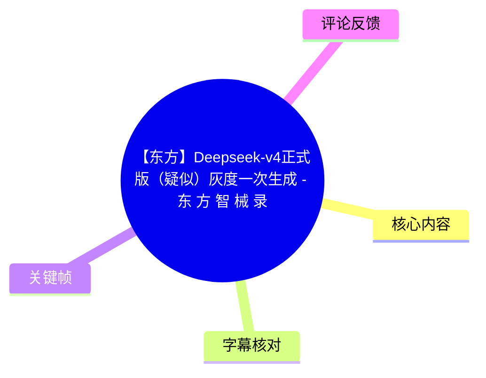
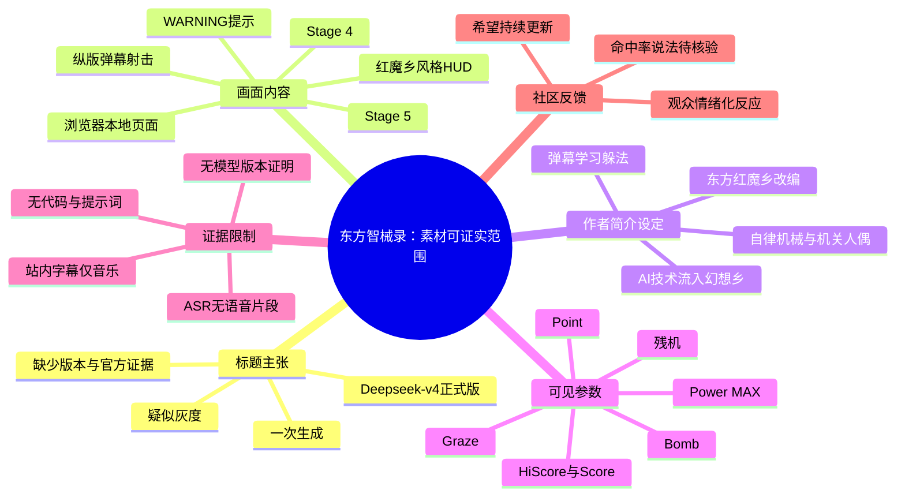
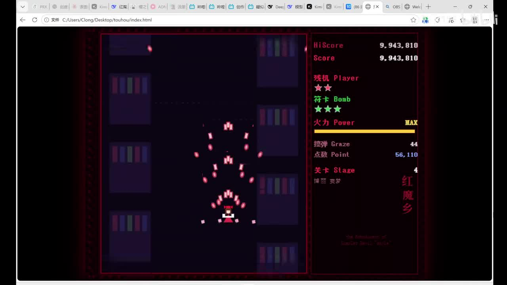
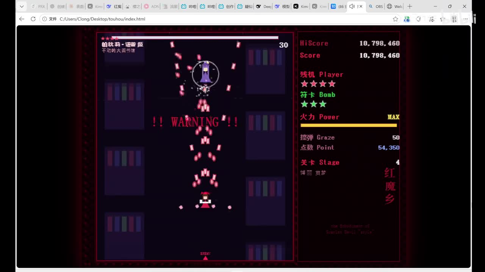
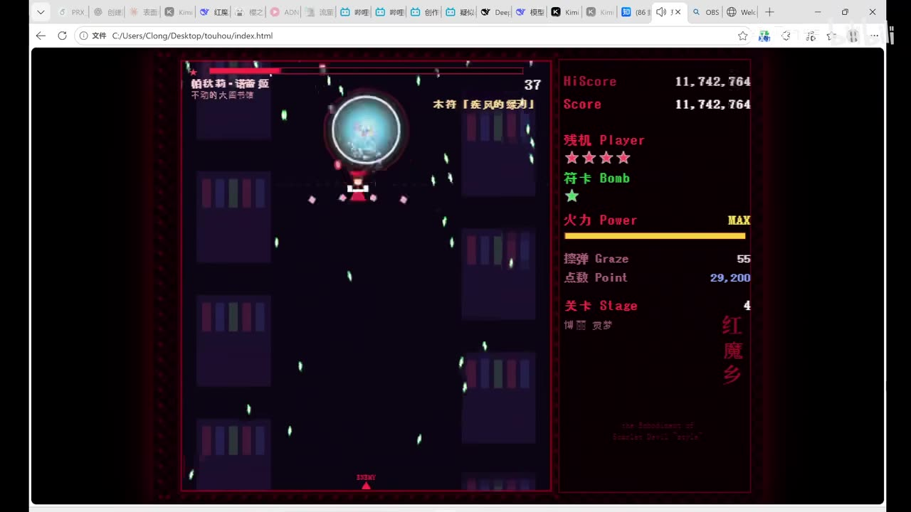
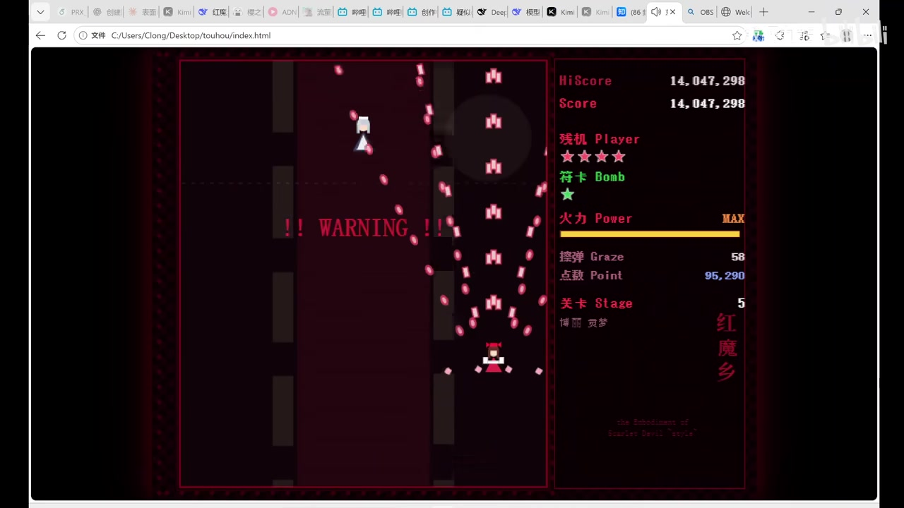

# 【东方】Deepseek-v4正式版（疑似）灰度一次生成 - 东 方 智 械 录

> 来源：[Bilibili 视频](https://www.bilibili.com/video/BV1qgN66xEQk)  
> UP 主：飯綱九龍｜时长：05:47｜分辨率：1920×1080｜合集：AIcode

## 小结

本视频素材呈现的是一段《东方》风格纵版弹幕射击画面：画面运行在浏览器本地文件页面中，右侧保留了类似《东方红魔乡》的分数、残机、Bomb、火力、擦弹、点数与关卡信息栏。已提供的关键帧可确认至少出现了 Stage 4 与 Stage 5，以及 Boss 出场前后的 `!! WARNING !!` 提示。

标题将内容称为“Deepseek-v4 正式版（疑似）灰度一次生成”，但“疑似”本身已经表明其并非确定性结论。现有站内字幕只记录音乐，ASR 也没有识别出任何可用语音内容；关键帧中没有出现模型版本号、官方公告、生成提示词、源码、接口返回、评测数据或部署日志。因此，不能仅凭标题与成品画面验证“DeepSeek-V4 正式版”“灰度发布”或“一次生成”的真实性与技术归因。

UP 主视频简介把作品定位为对《东方红魔乡》原作的改编，并以“幻想乡流入 AI 技术、自律机械与机关人偶出现”为叙事设定；玩法仍是纵版射击，但简介声称弹幕会“学习”玩家躲法。这个“学习”机制属于作者在简介中的创作描述，且作者同时说明自己并未真正搞懂学习算法，因此不能将其整理为已被演示或实现验证的机器学习系统。

对希望了解 DeepSeek-V4 动态的读者而言，本视频不能替代官方渠道、模型卡、版本公告或可复现实验；对关注 AI 生成游戏原型、东方同人视觉风格和网页弹幕游戏呈现的人而言，它可作为一个成品观感样本。需要特别注意：视频元数据中的 `pubdate` 晚于素材抓取时间，时间信息存在矛盾，故本文不据此推导新闻发生日期。

## 思维导图

## 目录

- [证据范围、新闻属性与时效限制](#证据范围新闻属性与时效限制-000007)
- [可确认的画面结构与玩法呈现](#可确认的画面结构与玩法呈现-000034)
- [作者简介中的设定与“学习弹幕”边界](#作者简介中的设定与学习弹幕边界-000007)
- [可见参数、操作经验与缺失的技术步骤](#可见参数操作经验与缺失的技术步骤-000034)
- [关键帧索引](#关键帧索引)
- [结论与限制](#结论与限制)
- [字幕比对](#字幕比对)
- [评论分析](#评论分析)
- [处理记录](#处理记录)

## 证据范围、新闻属性与时效限制 [00:00:07](https://www.bilibili.com/video/BV1qgN66xEQk?t=7)

站内时间轴字幕在 **00:00:07.700–00:00:22.370** 的内容均为“♪ 音乐 ♪”。这一时段是本素材中可直接使用的时间轴证据之一，但字幕并未提供旁白、模型名称或技术说明。

### 标题可以说明什么，不能说明什么

| 信息来源 | 可如实记录的内容 | 不能据此确认的内容 |
| --- | --- | --- |
| 视频标题 | 作者以“Deepseek-v4正式版（疑似）灰度一次生成”描述视频主题。 | DeepSeek-V4 是否已正式发布、是否处于灰度阶段、作品是否由该模型单次生成。 |
| UP 主简介 | 作品被描述为《东方红魔乡》改编的纵版射击设计，带有 AI 进入幻想乡的幻想设定。 | 具体使用的 AI 产品、模型版本、工作流、生成次数及人工修改比例。 |
| 关键帧 | 可见浏览器中的东方风弹幕游戏运行画面与数值 HUD。 | 画面背后的代码来源、生成工具、制作流程和可复现条件。 |
| 站内字幕与 ASR | 两者均没有提供技术口述。 | 任何未展示的模型能力、性能或公告内容。 |

### 时效性说明

- 元数据的 `fetchedAt` 为 `2026-07-16T13:42:01.825Z`，而 `pubdate` 数值为 `1784159100`；二者按常规 Unix 时间解释时存在先后不一致。
- 因此，本文将“Deepseek-v4 正式版（疑似）”视为**视频标题中的待证实说法**，而不是已确认新闻。
- 即使标题所指版本在之后发生变化，现有素材仍不足以追溯其具体版本、发布日期、访问资格、灰度范围、价格、上下文长度或 API 参数。

## 可确认的画面结构与玩法呈现 [00:00:34](https://www.bilibili.com/video/BV1qgN66xEQk?t=34)

站内字幕在 **00:00:34.120–00:00:41.980** 再次连续标注“♪ 音乐 ♪”。这段字幕同样没有语言信息；以下内容依据所给关键帧作画面层面的确认。由于关键帧素材未提供逐帧提取时刻，本文不为每张截图虚构精确秒数。

### 1. 浏览器本地页面中的游戏运行画面

关键帧可见 Chrome 浏览器界面，地址栏显示本地文件路径形式，画面主体为游戏区域。这至少说明录屏展示的是浏览器环境中的运行结果；但不能进一步判断其使用的网页框架、游戏引擎、脚本语言或部署方式。

> 图：关键帧显示浏览器内运行的竖版游戏画面。右侧 HUD 包含 `HiScore`、`Score`、`Player`、`Bomb`、`Power`、`Graze`、`Point` 与 `Stage` 等栏目，是判断作品采用东方系射击游戏界面语言的重要视觉证据。

### 2. Stage 4 的战斗和警告提示

已提供画面中，HUD 的关卡位置可见 `Stage 4`，场景为暗色书架/室内背景。玩家机位于下方，敌弹以粉红色弹幕为主，存在由上方朝玩家区域延展的弹幕轨迹。另有一帧出现红色 `!! WARNING !!`，表明战斗流程进入 Boss 出现或高威胁转换节点。

> 图：该帧同时保留 Stage 4 标识、红色 `!! WARNING !!`、Boss 血条区域及粉色弹幕。它有助于辨认视频并非静态概念图，而是展示了具备关卡推进和 Boss 预警结构的游戏流程。

### 3. Boss 战与符卡式界面元素

另一张画面中，顶部有 Boss 血条与中文招式/符卡文本区域，中间为带圆形特效的敌方单位，屏幕内分布绿色与粉色的子弹。由于截图分辨率下招式文字无法可靠辨认，本文不转写其具体名称，以避免误识别。

> 图：该帧展示 Boss 血条、中心敌方特效与双色弹幕分布，可用于说明作品尝试了东方系列常见的 Boss／符卡战斗视觉结构；但该图不能证明弹幕轨迹由 AI 实时学习或生成。

### 4. Stage 5 关卡转换

所给关键帧还可见 `Stage 5`，背景色调转为红黑，中央再次出现 `!! WARNING !!`。右侧 HUD 仍保持统一布局，说明画面至少包含由第四关向第五关的推进，而不是单一战斗场景的循环录制。

> 图：画面右侧清楚显示 `Stage 5`，中央为警告文本，能够支撑“素材呈现了至少两个关卡阶段”的判断；具体关卡剧情、敌人身份和阶段切换条件没有字幕或文字证据，不作延伸推断。

## 作者简介中的设定与“学习弹幕”边界 [00:00:07](https://www.bilibili.com/video/BV1qgN66xEQk?t=7)

### 已公开的创作设定

视频简介给出的文本设定包括：

1. 幻想乡中出现自律机械、会思考的机关人偶；
2. 起因被描述为外界流入的“AI”技术，被妖怪用于改造；
3. 红魔馆钟楼报错、神社赛钱箱自动拒绝硬币等内容属于世界观玩笑式描写；
4. 基础玩法沿用纵版射击；
5. 弹幕被描述为会“学习”玩家躲法，并形成更具针对性的形状。

这些内容可作为作者对作品氛围和玩法方向的说明。简介还给出“由东方红魔乡原作进行改编”的表述，因此应将作品理解为东方同人风格改编展示，而非《东方红魔乡》官方版本。

### “弹幕学习”不能直接等同于机器学习

作者在简介中使用“学习算法”“看起来聪明一点的弹幕”等说法，并明确表示自己对学习算法并未真正搞懂。结合素材缺少代码、配置、演示讲解与语音内容，当前只能得出以下边界清晰的结论：

- **可记录的作者意图**：希望弹幕针对玩家躲避方式表现得更刁难或更“聪明”。
- **无法确认的实现层级**：无法确认是否使用神经网络、强化学习、行为预测、轨迹统计、有限状态机、预制弹幕模式切换，或完全由人工脚本制作。
- **无法验证的运行方式**：看不到训练数据、奖励函数、在线学习频率、延迟、模型输入输出、命中率计算方法或性能开销。
- **审慎表述**：更准确的说法是“简介宣称弹幕具有学习玩家躲法的设计意图”，而不是“视频证明实现了 AI 自适应弹幕算法”。

## 可见参数、操作经验与缺失的技术步骤 [00:00:34](https://www.bilibili.com/video/BV1qgN66xEQk?t=34)

### 画面中可见的 HUD 参数

| 栏目 | 画面可见形式 | 可确认含义 | 不能确认的细节 |
| --- | --- | --- | --- |
| `HiScore` | 右侧顶部数字 | 历史最高分栏目。 | 计分规则、是否本地持久化。 |
| `Score` | 右侧顶部数字 | 当前分数栏目。 | 击破、擦弹、道具等各项得分权重。 |
| `Player` | 星形图标 | 玩家残机/生命显示。 | 初始残机数与续关规则。 |
| `Bomb` | 星形图标 | Bomb 储备显示。 | Bomb 触发方式、无敌帧、伤害范围。 |
| `Power` | 黄色进度条，部分画面为 `MAX` | 火力等级或火力上限状态。 | 升级阈值、道具掉落规则、最大等级数值。 |
| `Graze` | 数字值 | 擦弹计数。 | 擦弹判定半径、奖励机制。 |
| `Point` | 数字值 | 点数相关计数。 | 点数与分数、残机或火力的关联。 |
| `Stage` | 画面中出现 4、5 | 关卡阶段。 | 总关数、各关 Boss、通关条件。 |

### 从画面可提炼的游玩经验

以下是基于可见 UI 和弹幕布局的**界面阅读经验**，不是视频明确讲授的操作教程：

1. **优先观察底部玩家机与上方弹幕间的空隙**：关键帧中的玩家机位于较低位置，弹幕自上方或侧上方进入，保持下方机动空间通常有助于观察轨迹。
2. **将 `WARNING` 视为战斗状态转换提示**：画面出现 `!! WARNING !!` 时，可预期 Boss 或高压弹幕阶段接近；这是东方风射击游戏中常见的界面语义，截图也支持其作为流程提示存在。
3. **同时关注 Bomb 与残机图标**：右侧将两类资源分开显示，说明资源管理是界面设计的一部分；但具体何时使用、是否可补充，素材没有说明。
4. **不要将“弹幕看似追踪”误判为已证实的自适应算法**：静态截图只能展示某一时刻的弹型，不能比较玩家不同走位下的行为变化，也无法建立因果关系。

### 素材未提供的步骤、命令与参数

本视频没有可用语音讲解，也未提供以下关键信息，因此不能补写成教程：

- 没有展示 DeepSeek 的网页、API、模型选择器或版本标识；
- 没有提示词、系统提示词、上下文内容、温度、采样参数、Token 限制或费用；
- 没有源码、文件结构、依赖安装命令、构建命令或运行命令；
- 没有说明游戏采用 Canvas、WebGL、HTML DOM、Unity WebGL 或其他技术栈；
- 没有 AI 生成前后对比、失败案例、人工修复过程或“一次生成”的计数依据；
- 没有关于弹幕“学习”模块的输入、状态、算法、训练数据或测试指标。

## 关键帧索引

| 关键帧 | 可见内容 | 正文使用价值 | 时间信息 |
| --- | --- | --- | --- |
| `frames/frame-001.jpg` | 浏览器本地页面、基础战斗界面、右侧完整 HUD、Stage 4。 | 证明素材展示的是可运行的东方风弹幕游戏界面。 | 未提供该帧提取秒数。 |
| `frames/frame-002.jpg` | Stage 4、Boss 血条、`!! WARNING !!`、粉色弹幕。 | 说明存在 Boss 预警和关卡战斗流程。 | 未提供该帧提取秒数。 |
| `frames/frame-003.jpg` | Boss 战、圆形特效、双色弹幕、符卡式文字区域。 | 展示战斗视觉层次与招式界面。 | 未提供该帧提取秒数。 |
| `frames/frame-004.jpg` | Stage 5、红黑背景、`!! WARNING !!`。 | 支持至少存在 Stage 4 至 Stage 5 的关卡推进。 | 未提供该帧提取秒数。 |

> 未将其他未展示内容的关键帧强行写入正文。现有帧图没有附带精确提取时间，故不能把它们与任一秒数一一绑定。

## 结论与限制

### 可迁移的观察方法

- 对“某模型一次生成完整项目”的内容，应将**成品画面**与**生成过程证据**分开评估。一个可运行界面只能说明录屏中存在该结果，不能单独证明模型、版本、生成轮次或人工参与比例。
- 对“AI 弹幕”“自适应敌人”等概念，应要求至少看到输入、决策逻辑、输出变化与对照实验；仅有设计文案或单段游戏录屏不足以确认算法性质。
- 纵版弹幕游戏的成品呈现可从 HUD 完整度、关卡推进、Boss 预警、弹幕层次及资源显示等维度观察。本视频关键帧在这些视觉维度上提供了可确认的样本。

### 核心限制

1. **模型新闻未被证实**：没有官方来源、模型版本截图或可验证链接来支撑标题中的 DeepSeek-V4 灰度说法。
2. **生成过程不可复现**：没有提示词、代码、依赖、参数或操作记录。
3. **算法不可验证**：简介中的“学习弹幕”没有实现细节，不能判断是否为实际机器学习。
4. **时间轴信息有限**：站内字幕仅覆盖两段音乐标注；ASR 没有得到任何可用语音段落。
5. **关键帧无精确时间标签**：只能用于画面内容确认，不能用于推断截图发生于视频的精确秒点。
6. **元数据时间异常**：`pubdate` 与抓取时间呈现不一致，影响新闻时效判断。

## 字幕比对

| 字幕来源 | 完整性 | 专有名词 | 时间轴 | 主要问题 |
| --- | --- | --- | --- | --- |
| Bilibili 站内字幕 `p01-ai-zh.srt` | 极低：仅有 14 段“♪ 音乐 ♪”。 | 未包含 DeepSeek、东方角色、关卡名称或技术词。 | 有效：覆盖 00:00:07.700–00:00:22.370、00:00:34.120–00:00:41.980。 | 没有口述内容，无法支持技术整理。 |
| 本次 ASR 字幕 | 无有效文本：`segments` 为空。 | 无法识别。 | ASR 文件具备时间戳能力，但没有产生时间段。 | 诊断显示 `speechCoverage=0`、`speechSeconds=0`，并提示未识别到语音。 |

### 最终字幕选择与校正策略

- 本次 ASR 使用 `medium` 模型、CUDA、`float16`，自动检测语言结果为英语，置信度 `0.541015625`，但最终没有输出任何语音分段。
- ASR 诊断仅提示“未识别到语音”；提供的诊断中**没有** `noAudioStream=true` 标记。因此，不能将其表述为“源视频没有音轨”，也不能将空 ASR 简化为工具故障。现有证据只能说明：本次识别未获得可用语音文本。
- 站内字幕可用作两段音乐区间的真实时间轴依据，但不能补足内容。
- 正文最终采用“**站内字幕时间轴 + 关键帧视觉识别 + 视频标题、简介与元数据**”的组合策略。
- 关键帧可校正的词语仅限 HUD 中清晰可见的英文/数字栏目，如 `HiScore`、`Score`、`Player`、`Bomb`、`Power`、`Graze`、`Point`、`Stage`、`WARNING`；模糊的 Boss 名称与符卡文字未擅自转写。

## 评论分析

仅处理本次可获取的热评前三条。评论反映观众感受或未经证实的线索，不作为模型发布、生成质量或玩法机制的事实依据。

1. **墨水4号A｜242 赞**  
   > “请继续更新，这是我了解deepseek v4的唯一方式”  
   该评论表达了对持续追踪 DeepSeek-V4 信息的需求，也说明部分观众将该系列视作相关资讯入口。它没有提供可验证的版本、公告或技术材料，不能作为 V4 已发布或已灰度的证据。

2. **桥田阳｜60 赞**  
   > “眩晕瘫坐在椅子上，仿佛看到灵乌路空爆炸💥”  
   该评论属于借用《东方 Project》角色意象的情绪化表达，反映观众对画面或信息冲击的娱乐性反应。其不包含可供核验的游戏或模型信息。

3. **小男孩同志｜74 赞**  
   > “群友有给最新数据了，这命中率接近100了”  
   该评论声称“群友”提供了“最新数据”，并提到命中率接近 100%，但没有说明数据对象、采样量、指标定义、实验条件、来源链接或是否对应视频中的弹幕机制。该说法只能记录为未证实的社区转述，不能写入结论或性能评价。

## 处理记录

- Worker ID：`worker-mrj0www4-e8d79408`
- 整理模型：`gpt-5.6-terra`
- 已使用素材工具链结果：视频元数据读取、关键帧提取、站内字幕获取、音频 ASR、热评获取。
- ASR 模型与运行信息：`medium`／CUDA／`float16`／自动语言检测；检测语言为 `en`，概率 `0.541015625`；输出分段数为 0。
- 字幕选择：站内字幕 `p01-ai-zh.srt` 仅用于两个已知音乐时段的时间轴；ASR 输出为空，未作为正文语义依据。
- 关键帧选择依据：选用 `frame-001` 至 `frame-004`，因为它们分别呈现基础 HUD、Stage 4 警告、Boss 战与 Stage 5 转换，能覆盖可验证的游戏结构；未对无精确提取时刻的帧图补造时间戳。
- 缓存清理：提供的素材清单未记录缓存清理操作或结果；本文不虚构“已清理”状态。
- 未解决问题：
  - DeepSeek-V4 是否正式发布、是否灰度及视频标题与真实版本的对应关系；
  - 游戏是否确由某一模型一次生成；
  - 弹幕“学习”是否真实实现，以及其算法和性能；
  - 关键帧对应的精确视频时间；
  - 元数据 `pubdate` 与抓取时间不一致的原因。
