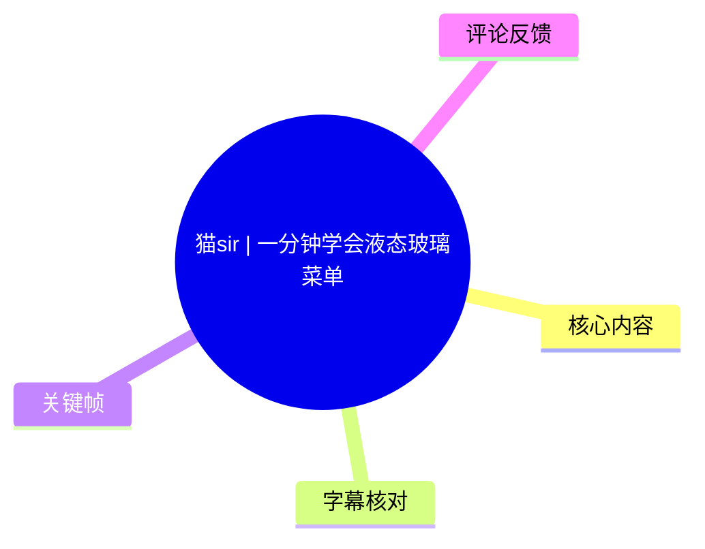
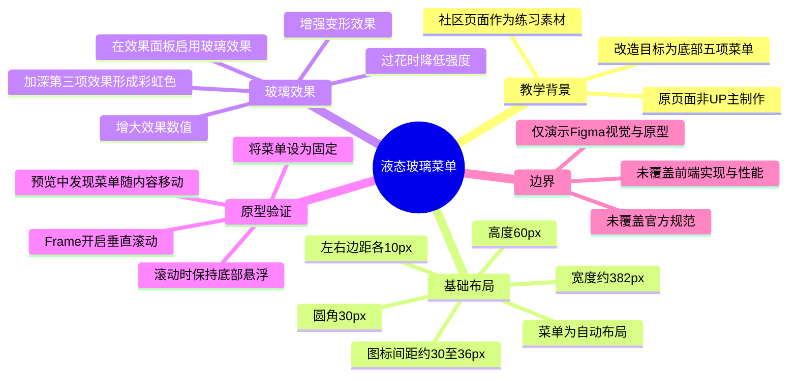
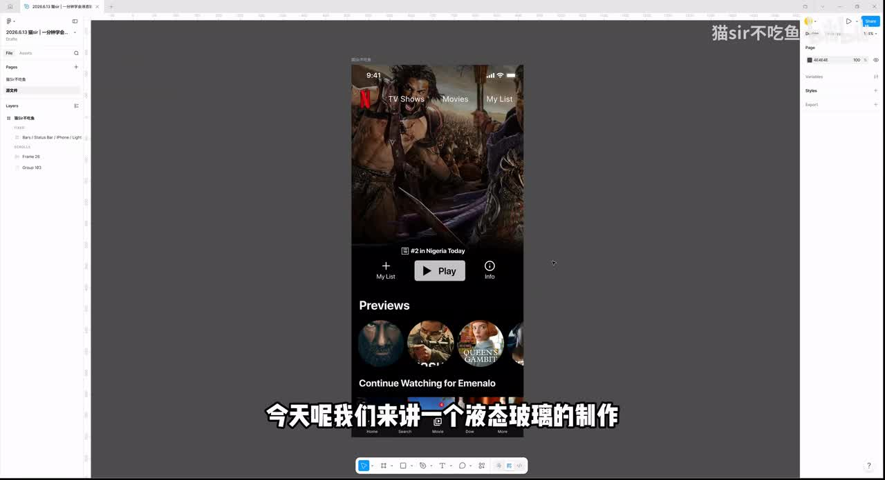
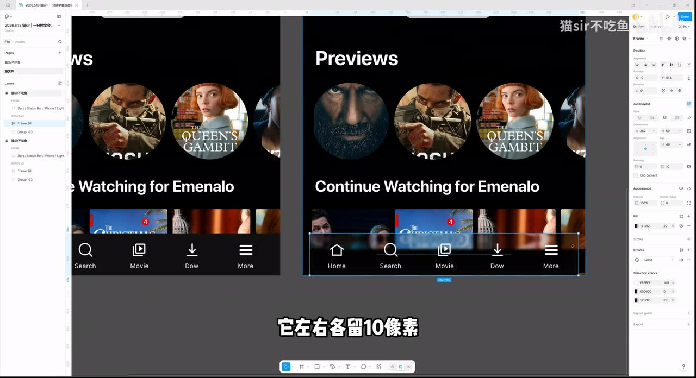
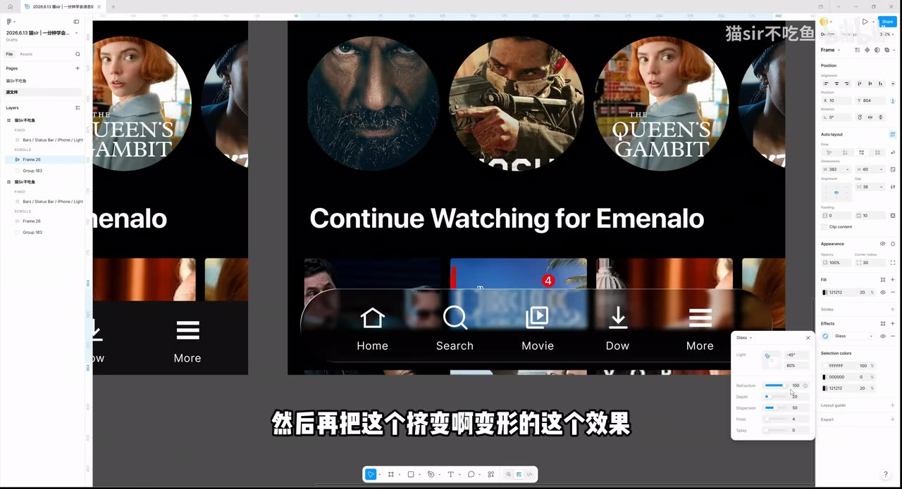
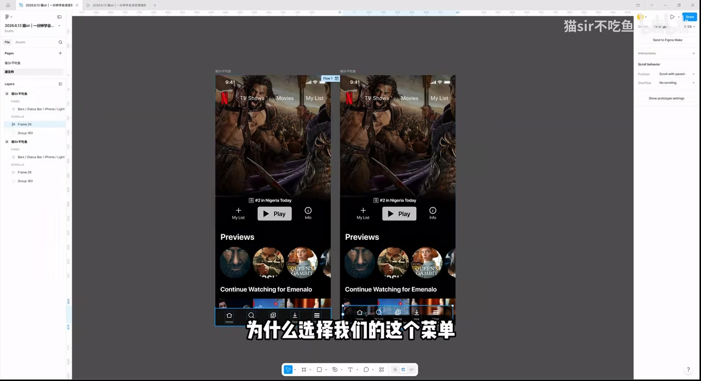

# 猫sir | 一分钟学会液态玻璃菜单

> 来源：[Bilibili 视频](https://www.bilibili.com/video/BV1zaJn66Ecm) 
> UP 主：猫sir不吃鱼｜发布时间：2026-06-13｜视频时长：02:00｜分辨率：3966 × 2160

## 小结

视频演示了在 Figma 中为移动端底部菜单制作“液态玻璃”视觉效果的简化流程。UP 主使用社区现成的影视类移动端页面作为教学素材，明确说明该原始页面并非其本人制作；本次实际改造对象是页面底部的五项导航菜单。

核心做法不是手工叠加模糊图层，而是先选中菜单所在的自动布局（Auto Layout）容器，再在效果面板启用“玻璃效果”，随后从菜单尺寸、位置、圆角、图标间距，以及玻璃效果的强度、变形和第三项色彩效果等维度逐步调整。视频给出了若干可直接复用的数值：菜单宽度约为 `382 px`、左右边距各 `10 px`、向上移动 `10 px`、菜单高度 `60 px`、圆角 `30 px`、图标间距由 `46 px` 下调至约 `30 px`（口播还提及可尝试 `36 px`）。

制作完成后，视频进一步在原型设置中为页面 Frame 开启垂直滚动，并通过预览确认菜单随页面滚动的问题。解决方式是将菜单设为固定（Fixed），从而使其在滚动时停留在底部，且能持续呈现底层内容带来的液态玻璃观感。

该方法适合已使用支持“玻璃效果”的 Figma 环境、并希望快速制作概念稿或交互原型的 UI/交互设计师。它主要展示视觉制作与原型验证，不涉及前端实现、Apple 官方设计规范、可访问性、性能、不同系统版本兼容性或真实产品中的开发落地标准。由于 Figma 的功能入口、名称和参数范围可能随版本更新变化，实际界面应以当前版本为准。

## 思维导图

## 目录

- [背景、素材与目标](#背景素材与目标)
- [启用玻璃效果并调整菜单布局](#启用玻璃效果并调整菜单布局)
- [强化液态玻璃的视觉表现](#强化液态玻璃的视觉表现)
- [配置滚动原型与固定菜单](#配置滚动原型与固定菜单)
- [可复用步骤与参数清单](#可复用步骤与参数清单)
- [结论、限制与时效性](#结论限制与时效性)
- [字幕比对](#字幕比对)
- [评论分析](#评论分析)
- [处理记录](#处理记录)

## [背景、素材与目标](https://www.bilibili.com/video/BV1zaJn66Ecm?t=0)

视频开场展示 Figma 编辑界面中的一张移动端影视内容页面。UP 主说明，这张图来自社区，直接拿来作为教学材料，并非其本人原创设计。教程的目标不是完整重建页面，而是将注意力集中在底部菜单区域，制作液态玻璃效果。

画面中的菜单包含五个图标及对应文字标签，处于页面底部。后续操作表明，菜单本身是一个自动布局容器；这一结构是后续统一修改宽度、间距与整体效果的前提。

> 图：该关键帧展示教程使用的完整移动端页面及其底部菜单位置。它的价值在于交代效果的真实应用上下文：液态玻璃不是孤立组件，而是覆盖在高对比内容卡片之上的底部导航层。

## [启用玻璃效果并调整菜单布局](https://www.bilibili.com/video/BV1zaJn66Ecm?t=20)

### 1. 复制页面并选中菜单容器

UP 主先复制页面，再选择底部菜单。根据其口播，菜单是一个“自动布局”（Auto Layout）。这意味着菜单项的排布可通过容器属性和间距参数统一控制，而不是逐个手动移动图标。

### 2. 在效果区域选择玻璃效果

选中菜单后，在右侧属性面板的效果区域选择“玻璃效果”。视频中，选择后菜单立即呈现透明、模糊和内容折射感的玻璃外观；此时只是应用了基础效果，布局与视觉细节仍需继续调整。

### 3. 调整菜单宽度和位置

视频给出的空间处理逻辑是：菜单左右各保留 `10 px` 边距。据此，UP 主将宽度从原值调整为约 `382 px`，并使菜单居中。

接着，菜单向上移动 `10 px`。其操作方式是按住 `Shift` 后按键盘方向键上键，使对象以较大步长上移。UP 主的判断是，这样能让菜单与屏幕底部之间保留更舒适的视觉边距。

### 4. 以高度的一半设置圆角

菜单高度为 `60 px`，因此圆角被设为 `30 px`，即高度的一半。该比例使组件形成胶囊形轮廓，配合玻璃效果更接近视频所展示的悬浮导航条。

### 5. 收紧五个菜单项的间距

UP 主观察到五个图标之间原先的间距偏宽。视频中当前间距为 `46 px`，随后建议改为 `30 px`；口播中还出现“30 或者 36”的尝试性说法。可确认的是，作者希望通过缩小间距提升五项导航在有限宽度内的整体感，而非保留 `46 px` 的较疏布局。

> 图：关键帧中，右侧属性区域可见菜单的自动布局与尺寸信息，画布中选中的底部导航宽度为约 382、高度为 60。它直接对应“左右各留 10 像素”和胶囊式菜单的布局依据。

## [强化液态玻璃的视觉表现](https://www.bilibili.com/video/BV1zaJn66Ecm?t=55)

在完成尺寸与间距调整后，UP 主回到效果面板继续调节玻璃参数。视频的表达偏演示性，未逐项报出所有控制项的准确数值，但明确说明了三个调整方向：

1. **增大玻璃效果中的一个数值**：用于增强整体玻璃观感。
2. **适度增大“变形”效果**：UP 主将其描述为“挤变啊、变形”的效果；提高后，底层图像在玻璃区域内的扰动感更明显。
3. **加深第三个效果**：加深后出现更明显的五彩、彩虹色视觉表现。

从画面结果看，菜单透明层不再只是普通半透明深色矩形：它对底层影视缩略图和颜色产生了更强的模糊、折射/形变与彩色高光效果。视频最后也提供了反向调节建议：如果认为效果“太花”，只需降低效果强度。

> 图：该帧显示已形成玻璃质感的五项菜单，以及右侧弹出的效果参数面板。它的价值在于说明本教程的“液态”感来自基础玻璃之外的变形与色彩强化；同时也能看到底层内容穿透菜单的实际效果。

### 参数与意图对照

| 调整对象 | 视频中的数值或动作 | 目的 | 注意事项 |
| --- | --- | --- | --- |
| 菜单宽度 | 约 `382 px` | 在左右留白条件下缩短菜单 | 该值依赖当前示例画板尺寸，不应脱离画板直接套用 |
| 左右边距 | 各 `10 px` | 避免菜单贴边 | 适合本例视觉尺度，不等同于通用平台规范 |
| 菜单垂直位置 | 向上移动 `10 px` | 留出底部呼吸空间 | 使用 `Shift + ↑` 是视频中的快捷操作 |
| 菜单高度 | `60 px` | 作为圆角计算基础 | 视频未讨论触控热区是否足够 |
| 圆角 | `30 px` | 形成半圆端胶囊形 | 采用“高度的一半”的比例关系 |
| 图标间距 | `46 px` 调至约 `30 px`，口播提及 `36 px` | 收紧五项导航排布 | 可按图标尺寸、文字长度和屏宽微调 |
| 玻璃效果数值 | 调大，未给出精确值 | 强化玻璃观感 | 具体参数名称和范围未被完整口播 |
| 变形效果 | 稍微调大 | 增强液态/折射感 | 过大可能降低图标与文字辨识度 |
| 第三个效果 | 加深，未给出精确值 | 增加五彩、彩虹色 | 若画面过花，应降低强度 |

## [配置滚动原型与固定菜单](https://www.bilibili.com/video/BV1zaJn66Ecm?t=82)

### 1. 为页面 Frame 创建垂直滚动

UP 主为页面所在 Frame 设置垂直滚动，然后添加预览并创建/连接一个 Flow 入口，再进入预览页面检查交互效果。该步骤的目的不是创建复杂转场，而是验证页面滚动时菜单的位置和玻璃效果是否符合预期。

### 2. 发现菜单会随页面内容移动

首次预览时，UP 主发现菜单会随着页面一起移动。对于预期中的底部悬浮导航而言，这是不符合目标的：菜单应停在视口底部，而不是作为长页面内容的一部分随滚动离开屏幕。

### 3. 将菜单设置为固定

视频随后重新选中菜单，在右侧与原型/滚动相关的设置区域选择“固定”。站内字幕将界面位置识别为“RETAB”，本次 ASR 则识别为“BroadTime”；两者都不能可靠地还原精确英文标签。结合画面和最终行为，可确定作者执行的是将菜单固定在滚动容器内的操作，而不宜据此断言某个特定版本 Figma 的固定入口名称。

完成固定后再次预览，菜单在页面滚动时保持在底部；同时，由于其仍覆盖在不断变化的页面内容上，液态玻璃效果得以持续展示。

> 图：该关键帧展示两个移动端页面/原型画板和被选中的底部菜单，右侧为原型与滚动相关设置区域。它的价值在于对应教程中最重要的交互修正：仅有玻璃外观不足以完成体验，菜单还需要在滚动场景下固定。

## [可复用步骤与参数清单](https://www.bilibili.com/video/BV1zaJn66Ecm?t=10)

以下流程按视频实际顺序整理，可用于复现同类移动端底部液态玻璃导航：

1. 准备一个包含滚动内容的移动端页面，并复制一份用于修改。
2. 选中底部菜单的整体容器，确认其为自动布局。
3. 在菜单的效果区域启用玻璃效果。
4. 调整菜单宽度，使左右各保留约 `10 px`；视频示例中宽度为约 `382 px`。
5. 将菜单居中，并向上移动 `10 px`；视频使用 `Shift + ↑` 完成移动。
6. 将菜单圆角设为高度的一半：`60 px` 高度对应 `30 px` 圆角。
7. 将五个图标/菜单项间距从 `46 px` 收紧至约 `30 px`；可根据实际效果试验 `36 px`。
8. 回到玻璃效果参数，增大基础效果数值，并适度增加变形效果。
9. 加深第三项效果，以获得更突出的彩色、彩虹式视觉表现。
10. 为页面 Frame 开启垂直滚动，添加预览 Flow 并进入原型预览。
11. 若菜单会随内容滚动，选中菜单并启用固定，使其保持在视口底部。
12. 若彩色/折射效果过强，降低玻璃效果强度，优先保证图标和文字可读性。

## [结论、限制与时效性](https://www.bilibili.com/video/BV1zaJn66Ecm?t=108)

视频的可迁移经验包括：

- **先处理容器，再处理视觉。** 菜单作为自动布局整体被选中，才便于统一控制尺寸、边距与项目间距。
- **圆角可从比例推导。** 高度 `60 px`、圆角 `30 px` 的关系使底部栏获得稳定的胶囊轮廓。
- **液态感需要克制。** 玻璃、变形与彩色效果能够提升视觉冲击，但作者也明确提醒，效果过花时应降低强度。
- **原型行为必须验证。** 视觉层做完后，页面滚动会暴露菜单随内容移动的问题；固定菜单是本例能成立的必要交互条件。

同时应注意以下限制：

1. 视频只展示 Figma 中的设计和原型操作，未提供 CSS、SwiftUI、UIKit、Android、React Native 或其他前端/客户端实现。
2. 视频未给出玻璃效果全部参数的精确名称与数值；除尺寸、边距、圆角和间距外，其余效果参数需要在实际界面中目测调整。
3. 教程所用页面为社区素材，且 UP 主已声明并非其原创；复用具体界面、海报或图像时应另行确认素材授权。
4. 评论中有人提出应参照 Apple 设计稿中的边距和宽度标准，但视频本身未引用、验证或对齐任何 Apple 官方规范，因此示例中的 `382 px`、`10 px` 等数值应视为当前画板的设计取值，而不是平台标准。
5. 该视频发布于 2026-06-13。Figma 的 Glass/玻璃效果功能、原型侧栏位置、参数名称及可用范围均可能在之后变更；复现时应以当前 Figma 版本和团队设计系统为准。

## [字幕比对](https://www.bilibili.com/video/BV1zaJn66Ecm?t=0)

本次任务同时提供了站内字幕和已执行的 ASR 字幕。两者均无逐句时间戳，因此本文的章节时间轴依据视频总时长、关键帧内容和口播顺序进行定位，而非字幕文件内嵌时间码。

| 字幕来源 | 完整性 | 专有名词与界面词 | 时间轴 | 主要问题 |
| --- | --- | --- | --- | --- |
| Bilibili 站内字幕 | 较完整，包含结尾“如果你觉得这样太花……”及降低强度的建议 | “auto out”应结合语境理解为 Auto Layout；“RETAB”无法确认具体界面标签 | 未提供逐句时间码 | 存在自动识别/转写式拼写，如“编剧”实际语境为“边距”；部分效果控制项未说出标准名称 |
| 本次 ASR 字幕 | 已执行，但在结尾“如果你觉得这样太花的话”处截断，缺少后续降低强度的完整句 | 将“猫sir”识别为“Mosser”；“自动布局”误作“自动补局”；“玻璃效果”出现“玻碧效果”；固定入口识别为“BroadTime” | 未提供逐句时间码 | 数字被拆分为“3 8 2”，出现“圆点”等语义错误，且若干句子断裂或重复 |

### 最终字幕选择与校正

正文以**站内字幕为主、本次 ASR 为交叉核验**，并依据关键帧和上下文进行有限校正：

- “auto out / 自动补局”统一记为 **自动布局（Auto Layout）**。这是由视频语境与关键帧中右侧布局属性共同支持的校正。
- “3 8 2”统一记为 **约 382 px**；站内字幕连续给出“382”，关键帧中菜单尺寸也与之相符。
- “编剧就看着舒服了”按上下文校正为 **边距看着舒服**，不将其误解为影视相关词。
- “这样它就是一个圆点了”按前文“高度 60、圆角改 30”的逻辑，记为 **形成圆角/胶囊形菜单**，不保留“圆点”的 ASR 误识别。
- 关于固定入口，保留“设为固定”这一可确认的操作结果；不根据“RETAB”或“BroadTime”等不可靠转写臆测具体 UI 英文标签。
- 站内字幕中的“第三个效果”未给出确切官方参数名称，本文仅记录其效果结果为彩色/彩虹感增强，未擅自命名为某一具体控制项。

## [评论分析](https://www.bilibili.com/video/BV1zaJn66Ecm?t=0)

以下仅处理当前可获取的热评前三条，共 3 条；评论观点不等同于已验证事实。

1. **aaahji（4 赞）**  
   评论认为教程的像素边距和宽度应参照 Apple 的 iOS 26/iOS 27 Figma 设计稿进行标准化。该评论提出了一个专业层面的质疑：视觉教程中的数值是否符合官方平台规范。视频并未展示或引用相关官方设计稿，因此这条评论不能用于证明视频数值错误，但提示读者应区分“示例画板上的视觉调参”与“面向正式产品的设计系统规范”。

2. **葵司sama（1 赞）**  
   评论询问“前端呢？不考虑一下吗”。这反映了观看者对设计效果如何工程化实现的需求。视频内容确实仅覆盖 Figma 制作和原型预览，未涉及 Web 或客户端实现；因此该评论指出的是教程范围缺口，而非对视频内操作正确性的直接反驳。

3. **bili_18383625765（0 赞）**  
   评论称“苹果自带的液态玻璃没这么好看”。这是对视觉审美的主观比较，没有提供设备、系统版本、截图或官方规范作为依据，无法验证。它可作为受众对本视频夸张彩色玻璃风格的偏好反馈；而视频本身也承认效果可能“太花”，并建议通过降低强度收敛视觉表现。

## [处理记录](https://www.bilibili.com/video/BV1zaJn66Ecm?t=0)

- Worker ID：`worker-mrj0www4-e8d79408`
- 模型：`gpt-5.6-terra`
- 调用工具与素材：基于任务提供的视频元数据、素材清单、站内字幕、本次 ASR 输出、4 张关键帧及可获取热评数据整理；未提供可核验的具体命令行或工具运行日志。
- 使用的应用工具：素材处理结果显示已生成合并视频、音频、关键帧、评论、字幕和 ASR 目录；本次文档未额外执行外部网页检索或前端代码验证。
- 字幕选择：站内字幕为主，ASR 为交叉校验；对 Auto Layout、`382 px`、`60 px`、`30 px`、`46 px`、固定菜单等内容结合上下文与关键帧校正。ASR 已执行，但其结尾内容不完整。
- 关键帧选择依据：
  - `frames/frame-001.jpg`：展示初始页面与底部菜单的应用场景；
  - `frames/frame-002.jpg`：展示菜单被选中后的尺寸、自动布局和边距调整依据；
  - `frames/frame-003.jpg`：展示液态玻璃成效及效果参数调节界面；
  - `frames/frame-004.jpg`：展示滚动原型场景与菜单固定相关设置。
- 缓存清理：提供的素材记录未包含缓存清理执行日志，无法确认是否已清理；本文不虚构清理结果。
- 未解决问题：
  - 玻璃效果三个具体控制项的官方名称、精确数值和版本差异未在素材中完整给出；
  - “RETAB / BroadTime”等字幕识别无法可靠确定为哪一项 Figma 英文菜单或侧栏标签；
  - 未提供前端实现、官方 Apple 设计稿对照或可访问性测试结果。

## 评论分析

本次流程未获取到可用热评，因此不推断观众态度或额外结论。
