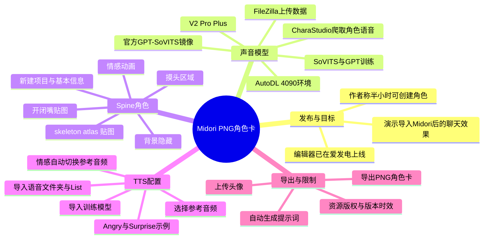
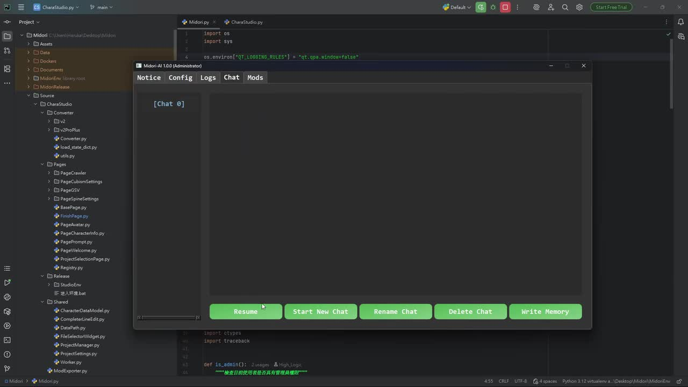
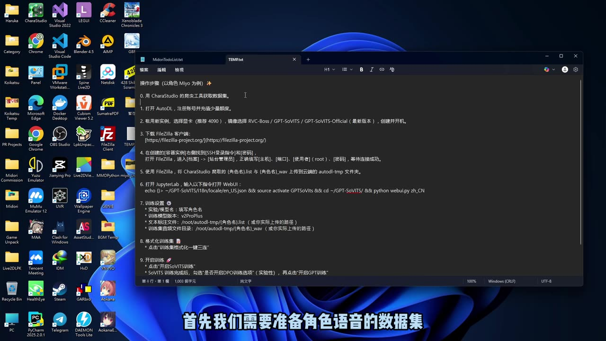
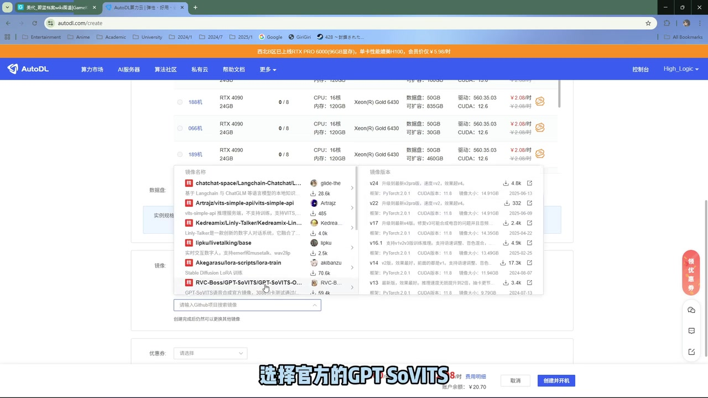
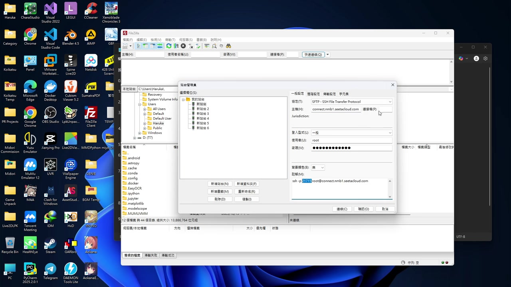

# 一张PNG图片，就是一个活生生的AI桌宠？【Midori 角色卡编辑器教程】

> 来源：[Bilibili 视频](https://www.bilibili.com/video/BV1CzWqz9Env) 
> UP 主：High_Logic｜时长：11 分 22 秒｜合集：AIcode  
> 视频简介提到后续计划包括：R18 TTS 引擎、为 Genie 增加英文支持、开源 Python Spine Live2D 库等；这些均为作者计划，不代表已经发布。

## 小结

视频演示了 Midori 角色卡编辑器的一套完整制作链路：先为角色训练 GPT-SoVITS 声音模型，再导入 Spine 角色资源，配置嘴型、背景、情感动画与摸头交互，最后绑定不同情感的参考音频，并导出为 PNG 角色卡。作者称编辑器已在爱发电上线，并称“半小时”可创建一个角色。

成品并非仅展示静态 PNG 图片：视频开头将导出的角色卡导入 Midori、重启并进行聊天，展示了角色在聊天时的语音与动态交互效果。根据视频实际流程，PNG 是最终导出载体，角色能否呈现为“桌宠”还依赖 Midori 对角色卡的导入与运行。

语音部分使用 CharaStudio 的内置爬虫收集角色语音数据，通过 AutoDL 的 4090 GPU 环境部署官方 GPT-SoVITS 镜像，再以 FileZilla 上传数据集、在 JupyterLab 启动 Web UI、完成数据集格式化和 SoVITS/GPT 两阶段训练。视频明确要求模型版本选为 `V2 Pro Plus`，训练 GPT 阶段开启 `DPO` 训练选项。

角色资源部分以《碧蓝档案》为例。作者说明其 Live2D 资源为 Spine 格式，所需目录至少包含 skeleton 文件、atlas 文件和若干贴图文件；资源通常要从游戏文件解包获得，也可通过订阅 Live2D Viewer 或 Wallpaper Engine 创意工坊内容后打开资源文件夹取得。视频未给出资源授权条件，因此实际使用时需自行确认游戏资源、创意工坊资源及角色语音的版权与平台规则。

本教程适合已经具备基础 Windows 操作能力、愿意使用云 GPU、文件传输工具和角色资源的人。所谓“半小时创建角色”更接近编辑器制作阶段的宣传性描述；首次注册 AutoDL、准备/清洗音频、训练模型、获取 Spine 资源及排错所需时间，视频没有量化，也不应默认包含在半小时内。

## 思维导图

## 目录

- [发布信息与最终效果](#发布信息与最终效果)
- [步骤一：训练 GPT-SoVITS 声音模型](#步骤一训练-gpt-sovits-声音模型)
- [步骤二：建立角色卡项目与准备 Spine 资源](#步骤二建立角色卡项目与准备-spine-资源)
- [步骤三：配置 Spine 表现、背景与交互](#步骤三配置-spine-表现背景与交互)
- [步骤四：配置 TTS 与情感参考音频](#步骤四配置-tts-与情感参考音频)
- [步骤五：上传头像并导出 PNG 角色卡](#步骤五上传头像并导出-png-角色卡)
- [完整操作清单](#完整操作清单)
- [限制、风险与时效性](#限制风险与时效性)
- [字幕比对](#字幕比对)
- [评论分析](#评论分析)
- [处理记录](#处理记录)

## [发布信息与最终效果](https://www.bilibili.com/video/BV1CzWqz9Env?t=2)

视频开场称角色卡编辑器“千呼万唤始出来”，已经在爱发电上线，并定位为一个可在约半小时内创建角色的工具。随后作者导入已完成的角色卡到 Midori，重启应用后发起聊天，以此展示角色的输出效果；约 01:06 作者评价“效果还是不错的”。

这里可以确认的产品链路是：

1. 在角色卡编辑器中制作角色；
2. 导出角色卡 PNG；
3. 将角色卡导入 Midori；
4. 在 Midori 中重启、聊天，触发角色呈现。

视频没有解释 PNG 内部的数据封装方式、Midori 的版本要求、导入失败时的排查路径，也没有展示不同平台的兼容性。因此不能据此推断任意 PNG 都能成为桌宠；视频只证明编辑器导出的角色卡可被演示中的 Midori 环境导入。

> 图：关键帧展示 Midori 窗口及其 `Notice / Config / Logs / Chat / Mods` 标签页，背景为 CharaStudio 项目代码。它说明视频的目标环境是 Midori 中运行角色卡，而不只是制作一张普通图片。

## [步骤一：训练 GPT-SoVITS 声音模型](https://www.bilibili.com/video/BV1CzWqz9Env?t=68)

### 1. 收集角色语音数据集 [01:08](https://www.bilibili.com/video/BV1CzWqz9Env?t=68)

作者先说明：GPT-SoVITS 的训练说明书已经较详细，视频只快速走一遍流程。准备工作是在 CharaStudio 中使用内置爬虫：

1. 准备角色语音数据集；
2. 将角色 Wiki 页面链接粘贴到 CharaStudio 爬虫；
3. 点击开始爬取；
4. 等待音频下载完成。

视频只展示“音频已经下载成功”，未说明音频条数、时长、采样率、文本标注质量、静音过滤、去噪或数据集清洗标准。它也没有说明 Wiki 音频的授权来源；实际使用角色声音前应自行确认原始音频的版权、平台条款及是否获得授权。

> 图：关键帧中的文本说明列出了从 CharaStudio 收集数据、创建 AutoDL 实例、通过 FileZilla 上传、启动 Web UI 到训练模型的顺序。它可作为视频口播流程的补充，但其中命令与路径应以实际项目说明书和当前镜像为准。

### 2. 创建 AutoDL 云端训练环境 [01:52](https://www.bilibili.com/video/BV1CzWqz9Env?t=112)

作者的云端环境步骤为：

1. 打开 AutoDL；首次使用者需要先注册。
2. 租用实例时选择 `4090` 显卡。
3. 在镜像选项中选择官方 `GPT-SoVITS` 镜像。
4. 创建容器，等待创建完成。

视频画面显示 AutoDL 创建实例页面和 RTX 4090 可选项，但没有给出实例地区、计费方式、显存实际占用、训练耗时、磁盘容量或价格。因此，4090 是作者演示中的选择，而不是视频论证过的最低硬件门槛。

> 图：关键帧显示 AutoDL 的实例创建界面及镜像下拉列表，其中可见 GPT-SoVITS 相关官方镜像选项。这是“使用官方镜像创建容器”这一操作的画面依据。

### 3. 通过 FileZilla 上传音频与 List 文件 [02:18](https://www.bilibili.com/video/BV1CzWqz9Env?t=138)

容器创建完成后，作者使用 FileZilla 将本地训练数据上传至服务器：

1. 下载并打开 FileZilla 客户端。
2. 在菜单中进入“文件 → 站点管理器”。
3. 从 AutoDL 提供的信息复制登录指令或连接信息。
4. 填写主机、端口、用户名和密码。
5. 连接服务器，进入 `autodl-tmp` 文件夹。
6. 将刚才下载的**语音文件夹**和**List 文件**上传到服务器。

视频中的画面为 SFTP 连接配置，用户名显示为 `root`，但没有公开完整可复用的主机地址和密码。连接信息是实例私密凭据，不应在公开笔记中复述、截图或分享。

> 图：关键帧展示 FileZilla 的站点管理器，协议为 SFTP，并有主机、端口、用户名与密码字段。它强调此步骤是建立云端文件传输连接，而非在本地直接训练。

### 4. 启动 Web UI、格式化与训练 [03:45](https://www.bilibili.com/video/BV1CzWqz9Env?t=225)

上传完成后，作者在 AutoDL 中：

1. 打开 JupyterLab。
2. 输入说明书提供的指令。
3. 点击下方生成的公网链接，进入 GPT-SoVITS Web UI。
4. 将模型版本切换为 **`V2 Pro Plus`**。
5. 填写 List 文件路径和音频文件夹路径；作者特别提醒，这里必须填写**服务器上的路径**。
6. 在“训练集格式化”处执行“一键三连”。
7. 开始微调训练，先训练 **SoVITS** 模型。
8. SoVITS 完成后，训练 **GPT** 模型，并开启 **`DPO` 训练选项**。
9. 训练完成后，将模型下载回本地。

视频口播中将前一阶段称为“ViTS/SoVITS”，站内英文字幕作 “ViTS”；结合 GPT-SoVITS 的上下文及中文 ASR，本文统一按 **SoVITS 模型训练**记录，不将其扩展为一个单独、已验证的 “ViTS” 模型名称。

| 项目 | 视频给出的设置或动作 |
| --- | --- |
| GPU 示例 | RTX 4090 |
| 镜像 | 官方 GPT-SoVITS 镜像 |
| Web UI 模型版本 | `V2 Pro Plus` |
| 路径要求 | List 与音频目录均填写服务器路径 |
| 数据预处理 | 训练集格式化“一键三连” |
| 训练顺序 | 先 SoVITS，后 GPT |
| GPT 训练选项 | 开启 `DPO` |
| 产物处理 | 将训练好的模型下载至本地 |

## [步骤二：建立角色卡项目与准备 Spine 资源](https://www.bilibili.com/video/BV1CzWqz9Env?t=376)

作者在约 06:16 宣布开始正式制作角色卡，首先新建项目，并自行填写基本信息。视频未逐项展示或解释这些字段，因此不能补写其必填规则、角色设定字段或默认值。

### Spine 资源组成 [06:36](https://www.bilibili.com/video/BV1CzWqz9Env?t=396)

作者以《碧蓝档案》角色为例，说明其 Live2D 资源为 Spine 格式。导入所需的 Spine 文件夹应包含：

- 一个 **skeleton** 文件；
- 一个 **atlas** 文件；
- 若干**贴图（texture）文件**。

通常需要解包游戏文件才能取得这些资源。若不会解包，作者建议下载 Live2D Viewer 或 Wallpaper Engine，并从创意工坊订阅相关 Live2D 内容；订阅后点击“打开文件夹”，可跳转到资源文件所在位置。

需要注意：

- 视频没有说明 skeleton、atlas 与贴图的具体文件扩展名，也没有给出目录层级示例；
- 视频没有保证所有创意工坊资源均可用于此编辑器；
- 从游戏文件或创意工坊获取资源可能涉及著作权、二次分发限制和平台订阅协议，使用者需要自行确认权限；
- “《碧蓝档案》的 Live2D 都是 Spine 格式”是作者在视频中的示例性表述，本文不据此推导其他游戏或所有角色资源的兼容性。

## [步骤三：配置 Spine 表现、背景与交互](https://www.bilibili.com/video/BV1CzWqz9Env?t=431)

### 1. 设置嘴型贴图 [07:11](https://www.bilibili.com/video/BV1CzWqz9Env?t=431)

进入 Spine 编辑器页面后，基础参数可自行调整。视频明确展示的嘴型步骤为：

1. 选择一张**张嘴时**使用的贴图；
2. 选择一张**闭嘴时**使用的贴图；
3. 点击“保持张嘴”，预览张嘴效果。

这说明口型表现依赖于至少两种状态贴图的正确指定。视频没有展示自动嘴型识别，也没有说明复杂口型、音素映射或贴图命名规则。

### 2. 管理背景附件 [07:40](https://www.bilibili.com/video/BV1CzWqz9Env?t=460)

在附件管理器中，作者先勾选所有背景附件，然后点击“隐藏所有背景控件”，再预览隐藏背景后的效果。该流程的目的，是让角色在桌宠或聊天场景中不携带原始背景元素。

这里的“所有背景附件”取决于具体 Spine 资源如何拆分。若资源将背景与角色身体元素错误合并，视频未提供可替代的分层编辑或修复办法。

### 3. 情感动画与摸头交互 [08:15](https://www.bilibili.com/video/BV1CzWqz9Env?t=495)

在动画管理器中，可指定不同情感应播放什么动画，建立“情感 → 动画”的映射。其后可配置摸头交互：

1. 框选一个可摸头区域；
2. 为此区域设置触发动画；
3. 完成后，即可在该区域进行摸头交互。

视频只展示了一个摸头区域及触发后的可爱效果，没有展示多个交互区冲突、触控/鼠标坐标校准、区域层级或动画中断处理规则。

## [步骤四：配置 TTS 与情感参考音频](https://www.bilibili.com/video/BV1CzWqz9Env?t=532)

### 1. 导入训练产物和数据 [08:52](https://www.bilibili.com/video/BV1CzWqz9Env?t=532)

进入 TTS 页面后，作者要求导入：

- 刚刚训练好的 GPT-SoVITS 模型；
- 语音文件夹；
- List 文件。

导入后，右侧会列出全部参考音频文件。用户选择其中一个参考音频，再填充到左侧配置区域。视频没有展示模型文件名、后缀、目录规范或加载失败提示，因此这些细节需要以编辑器当前版本文档为准。

### 2. 测试单条参考音频 [09:37](https://www.bilibili.com/video/BV1CzWqz9Env?t=577)

选择一条听感合适的参考音频后：

1. 点击“测试 TTS”；
2. 系统将使用所选参考音频进行文本转语音；
3. 根据试听结果判断是否适合作为该情感的声音参考。

视频中的测试文本包含日语口语片段，ASR 与站内字幕对此段识别不稳定；重点应理解为“用选定参考音频试听 TTS”，而不是将该测试文本当作固定配置参数。

### 3. 为不同情感配置声音 [09:54](https://www.bilibili.com/video/BV1CzWqz9Env?t=594)

作者说明可以继续添加更多情感；在聊天时，系统会按情感自动切换对应的参考音频。视频实际演示了：

- 将一段音频用作 `Angry` 情感参考；
- 再增加一条 `Surprise` 情感；
- 说明还可继续添加各种情感。

因此，该编辑器中的情感至少关联两层表现：

| 情感相关配置 | 对应作用 |
| --- | --- |
| 动画管理器 | 决定该情感播放什么角色动画 |
| TTS 情感参考音频 | 决定聊天时切换哪条参考音频进行发声 |

视频没有展示情感由哪个聊天模型生成、情感标签是否可自定义、自动判定准确率或情感与动画/音频之间是否必须一一对应。评论中有人希望让 AI 按输入自动选择七种情绪，但这只是评论者的需求，不是视频已经验证的能力。

## [步骤五：上传头像并导出 PNG 角色卡](https://www.bilibili.com/video/BV1CzWqz9Env?t=654)

最后阶段的操作顺序为：

1. 找一张头像图片并上传；
2. 程序自动生成提示词；
3. 预览生成结果；
4. 点击“导出角色卡为 PNG 文件”；
5. 一键完成导出。

作者只称程序“自动帮我们生成了提示词”，没有展示提示词全文、生成逻辑、可否手动编辑、头像的尺寸/格式限制，或导出的 PNG 是否包含全部训练模型文件。因此应将自动提示词视为编辑器在该演示中的功能，不应推断其质量、隐私处理方式或可迁移性。

## [完整操作清单](https://www.bilibili.com/video/BV1CzWqz9Env?t=68)

以下按视频实际顺序整理，便于复现时核对：

### 阶段 A：准备语音模型

- [ ] 在 CharaStudio 准备角色语音数据集。
- [ ] 粘贴 Wiki 页面链接，使用内置爬虫下载音频。
- [ ] 注册并打开 AutoDL。
- [ ] 选择 RTX 4090 实例。
- [ ] 选择官方 GPT-SoVITS 镜像，创建容器。
- [ ] 安装 FileZilla。
- [ ] 通过“文件 → 站点管理器”填写云端连接信息。
- [ ] 连接后进入 `autodl-tmp`。
- [ ] 上传语音文件夹和 List 文件。
- [ ] 打开 JupyterLab，按说明书执行启动命令。
- [ ] 通过公网链接进入 Web UI。
- [ ] 选择 `V2 Pro Plus`。
- [ ] 填入服务器上的 List 路径和音频目录路径。
- [ ] 执行训练集格式化“一键三连”。
- [ ] 训练 SoVITS。
- [ ] 训练 GPT，并开启 `DPO` 训练。
- [ ] 将训练模型下载至本地。

### 阶段 B：制作角色表现

- [ ] 新建角色卡项目，填写基本信息。
- [ ] 准备含 skeleton、atlas、贴图的 Spine 资源目录。
- [ ] 在 Spine 编辑器配置基础参数。
- [ ] 选择开嘴和闭嘴贴图，预览开嘴效果。
- [ ] 在附件管理器中标记背景附件，并测试隐藏背景。
- [ ] 为各情感配置播放动画。
- [ ] 框选摸头区域并绑定触发动画。

### 阶段 C：绑定声音、导出与验证

- [ ] 在 TTS 页面导入 GPT-SoVITS 模型、语音文件夹和 List 文件。
- [ ] 从右侧参考音频列表选择音频，填入左侧配置。
- [ ] 点击“测试 TTS”，检查声音效果。
- [ ] 增加 `Angry`、`Surprise` 等情感及其参考音频。
- [ ] 上传头像。
- [ ] 预览程序自动生成的提示词。
- [ ] 导出 PNG 角色卡。
- [ ] 导入 Midori、重启并通过聊天验证角色效果。

## [限制、风险与时效性](https://www.bilibili.com/video/BV1CzWqz9Env?t=670)

### 视频明确或可直接观察到的限制

1. **依赖云端资源**：作者使用 AutoDL、RTX 4090、JupyterLab 和公网 Web UI，教程不是纯本地离线流程。
2. **依赖外部工具与服务**：CharaStudio、AutoDL、FileZilla、GPT-SoVITS、Midori、Live2D Viewer、Wallpaper Engine 均可能更新、改名、调整权限或停止服务。
3. **模型和路径具有版本依赖**：视频使用 `V2 Pro Plus` 和服务器路径。不同 GPT-SoVITS 镜像或 Web UI 版本可能有不同选项、目录和训练流程。
4. **资源格式有前提**：角色部分按 Spine 资源制作，需要 skeleton、atlas 和贴图文件；不是任意单张人物 PNG 都能直接获得同等动态效果。
5. **训练质量未量化**：视频没有提供数据量、训练轮数、训练时间、音质对比、显存占用或失败案例。
6. **自动情感效果未完整说明**：视频展示“聊天时按情感切换参考音频”，但没有说明情感由何种模型产生、情感识别的准确性以及角色卡与聊天模型的完整接口。
7. **导出兼容性未验证**：仅演示了一个角色卡导入 Midori 的成功案例，未展示跨设备、跨版本或批量角色卡的兼容性。

### 合规与安全提醒

- 角色语音、游戏拆包资源、创意工坊订阅内容可能受到著作权、角色形象权、游戏用户协议与平台规则约束；不要将视频中的示例理解为使用或分发这些资源的授权。
- AutoDL 登录地址、端口、账号和密码属于敏感凭据。连接 FileZilla 时避免录屏公开，完成使用后应按服务商规则轮换或销毁临时实例。
- 通过公网链接开放 Web UI 可能产生暴露风险。视频没有展示访问控制设置，实际部署时应自行评估访问范围与账户安全。
- 视频发布日期为 **2025-10-16**；本文基于当时视频材料整理。编辑器的爱发电可用性、AutoDL 镜像、GPT-SoVITS 版本、Midori 导入格式及创意工坊内容都可能在之后变化。

## [字幕比对](https://www.bilibili.com/video/BV1CzWqz9Env?t=68)

站内提供阿拉伯语、英语、西班牙语、葡萄牙语和中文时间轴字幕；本次 ASR 也成功识别到中文音轨。ASR 诊断中**没有** `noAudioStream=true` 标记，且音频时长为约 681.04 秒，因此本视频确有音轨，不属于“源视频没有音轨”的情况。

| 字幕来源 | 完整性 | 专有名词 | 时间轴 | 主要问题 |
| --- | --- | --- | --- | --- |
| Bilibili 站内中文字幕 | 覆盖至 11:19，步骤分段完整 | 多处音译错误，如 “midi”“chair studio”“GPT soviet”“span”；但上下文完整 | SRT 起止时间明确，可直接用于时间轴 | 技术名词错写较多，英文歌曲和试听语句混杂 |
| Bilibili 站内英文字幕 | 覆盖完整 | `GPT SoVITS`、`V2 Pro Plus`、`skeleton / atlas / texture` 较清晰 | 与中文站内字幕逐段对应 | 部分中文口语、菜单名和音乐歌词翻译不准确 |
| 本次 ASR（medium，中文） | 52 段，语音覆盖约 239.71 秒；长音乐/演示空档未强行转写 | 可确认 Midori、AutoDL、FileZilla、JupyterLab、Spine 等上下文，但识别为 “Chanel Studio”“VR ProPlus”“Scarleton”等 | 具真实起止时间；首段 00:02.570，末段 11:19.170 | 术语、英语缩写和“DPO”存在明显听写误差；若干段文本截断或乱码 |

### 最终字幕选择与校正原则

本文以**站内中文 SRT 的完整分段时间**作为主要章节定位依据，并逐段检查本次 ASR 的实际语音时间；对技术名词采用“站内英文字幕 + 视频上下文 + ASR 相互校正”的方式统一：

| 最终采用写法 | 站内中文/ASR 常见误识别 | 校正依据 |
| --- | --- | --- |
| Midori | `midi`、`MIDORI` | 标题、开场画面、ASR 上下文 |
| CharaStudio | `chair studio`、`Chanel Studio` | 关键帧项目目录与英文字幕 |
| GPT-SoVITS | `GPT service s`、`GPT SOV词`、`GPT soviet` | 标题标签、英文字幕、镜像语境 |
| FileZilla | `file jella`、`放热` | 英文字幕、关键帧软件界面 |
| JupyterLab | `JUPITLAB`、`JupiterLab` | 英文字幕与常见产品名 |
| `V2 Pro Plus` | `ping looking...`、`VR ProPlus` | 英文/葡语字幕明确写法 |
| Spine | `span` | 英文字幕与资源格式上下文 |
| skeleton / atlas / texture | `Scarleton`、`ASUS`、`FS` | 英文字幕提供的资源文件列表 |
| `DPO` | `DPU` | 站内中文与 ASR 均有混淆；视频英文字幕写作 DPU，但画面材料不足以独立复核，本文按中文语音语境记录为 DPO，并保留不确定性 |

其中，`DPO`/`DPU` 是材料内部唯一无法由关键帧独立确认的关键选项：站内中文与 ASR 都倾向“DPU/类似发音”，英文字幕写为 “DPU training option”，而中文语境可能指 `DPO`。因此正文将其标为视频口播所称的 `DPO`，实际操作必须以当期 GPT-SoVITS Web UI 的选项名称为准。

## [评论分析](https://www.bilibili.com/video/BV1CzWqz9Env?t=594)

以下仅处理可获取热评前三条；评论反映用户体验或疑问，不等同于已验证事实。

1. **江山啦啦啦啦（13 赞）**  
   评论者自述零基础花数小时已经跑出 SoVITS 的 GPT 和 VITS，并希望继续保留其他 AI 部署能力；其计划将声音分为七种情绪，希望 AI 根据输入/回答的情绪自动选择对应语音。  
   - 补充价值：反映新手完成基础训练可能需要“数小时”，与视频“半小时创建角色”的宣传性表述构成实践层面的时间提醒。  
   - 与视频的关系：视频确实展示了根据情感自动切换参考音频，但没有验证七种情绪、自动情感判定或外部 AI 部署整合。  
   - 可信度边界：这是个人自述和功能期待，不能据此认定该方案已经实现。

2. **晓康233（6 赞）**  
   评论者询问 GPT-SoVITS 的 V2 与后续 V4 Pro 等模型版本之间的差距。  
   - 补充价值：指出模型版本选择是观众关心的实际问题。  
   - 与视频的关系：视频明确建议 `V2 Pro Plus`，但没有给出 V2、V4 Pro 或其他版本的效果对比、训练成本和兼容性数据。  
   - 可信度边界：这是提问而非结论，不能用来判断不同版本优劣。

3. **OgaSen（5 赞）**  
   评论内容为“老大，不奈”，语义简短，缺少可识别的技术信息。  
   - 补充价值：无可验证的功能补充或争议。  
   - 处理结论：不将其作为技术事实或用户反馈证据。

## [处理记录](https://www.bilibili.com/video/BV1CzWqz9Env?t=0)

- **Worker ID**：`worker-mrj0wbly-5dc4e50c`
- **模型**：`gpt-5.6-terra`
- **素材与工具结果**：
  - 视频元数据、封面与关键帧素材；
  - Bilibili 站内多语言 SRT，重点核对中文 `p01-ai-zh.srt` 与英文 `p01-ai-en.srt`；
  - 本次 ASR：`medium`，CUDA、`float16`、自动识别中文，音频约 681.04 秒；
  - 热评抓取：限制为可获取的前三条。
- **字幕选择**：以站内中文 SRT 的完整时间轴为主，ASR 用于核验实际口播覆盖与时间；技术术语以英文站内字幕、画面和上下文交叉校正。未发现 `noAudioStream=true`，因此未采用“无音轨”处理路径。
- **关键帧选择依据**：
  - `frames/frame-001.jpg`：展示 Midori 运行界面，支撑“导入后在 Midori 使用”的最终效果；
  - `frames/frame-002.jpg`：展示教程操作说明，支撑完整流程的前置步骤；
  - `frames/frame-003.jpg`：展示 AutoDL 与 GPT-SoVITS 官方镜像选择；
  - `frames/frame-004.jpg`：展示 FileZilla 的 SFTP 站点管理器与连接字段。
- **缓存清理**：提供的素材清单未包含缓存清理工具调用或清理结果；本文不虚构已执行清理，记录为“未提供清理结果”。
- **未解决问题**：
  - 编辑器的具体版本号、爱发电页面状态、价格与安装包获取方式未提供；
  - `DPO`/`DPU` 选项名称在字幕与 ASR 中存在冲突，需以当前 Web UI 为准；
  - 未提供训练数据规模、模型参数、训练时长、费用、模型文件格式和导出 PNG 的内部格式；
  - 未提供游戏资源、角色语音和创意工坊资源的授权证明。

## 评论分析

- 热评 1：Up主，本人真的今天0基础花了几个小时，把sovits的gpt和vits跑出来了，按照西瓜的教程，但是又不想在其他ai部署上面放弃掉（很多其他up都是没办法这一步）。现在花了几个小时看见你的方法，觉得明天试试说不定有用。但是本人为了声音分了七种情绪，并且想让ai根据我的input回答时候自己根据情绪，调整情绪对应输出语音的模型。不知道行不行得通，计算机小白努力部署露娜的第七天。感觉这个有希望
- 热评 2：gpt sovits的模型v2往后那几个v4 pro比v2模型差距多少啊
- 热评 3：老大，不奈

以上内容是观众反馈摘录，只用于补充理解视频反响，不作为正文事实依据。
