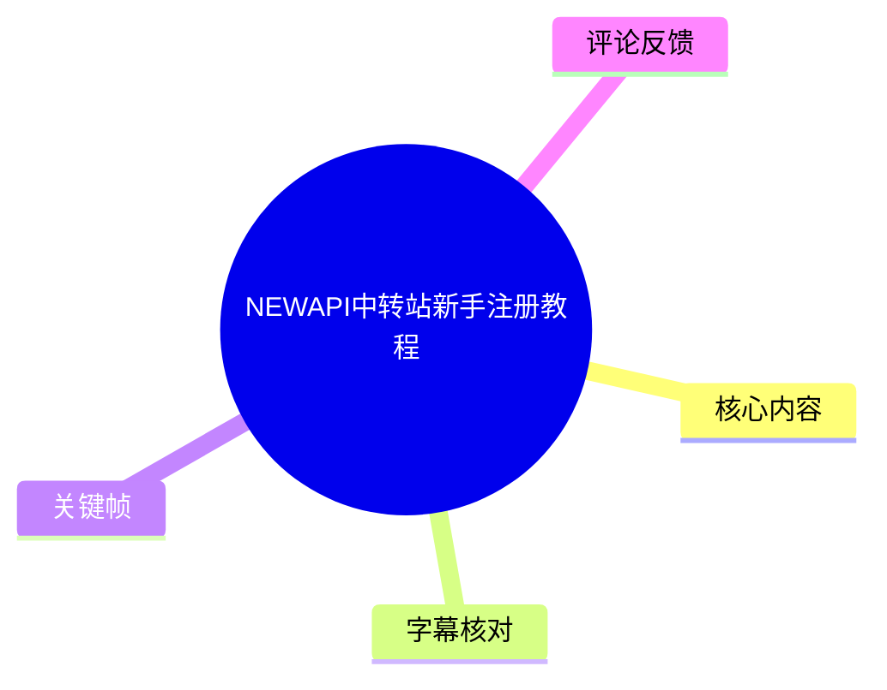
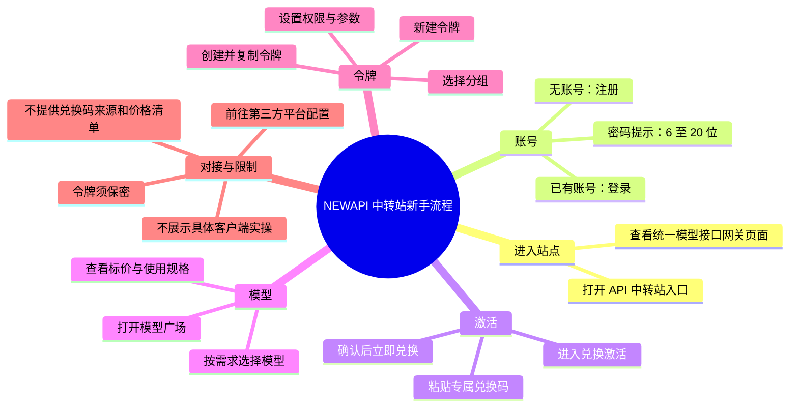
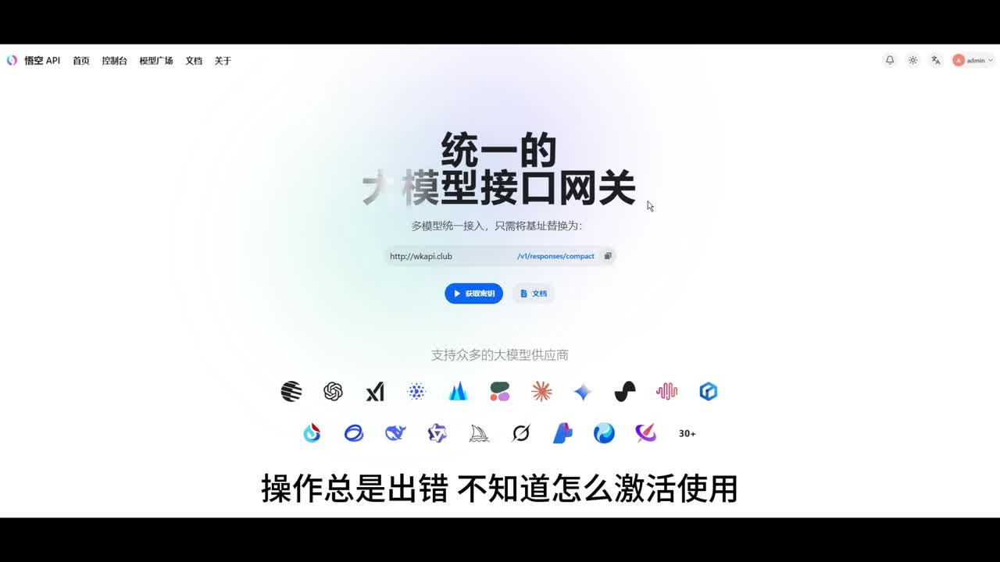
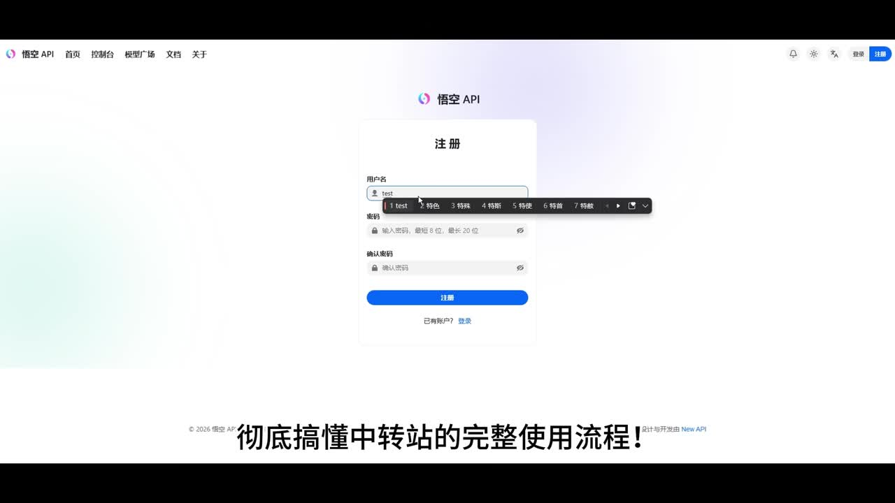
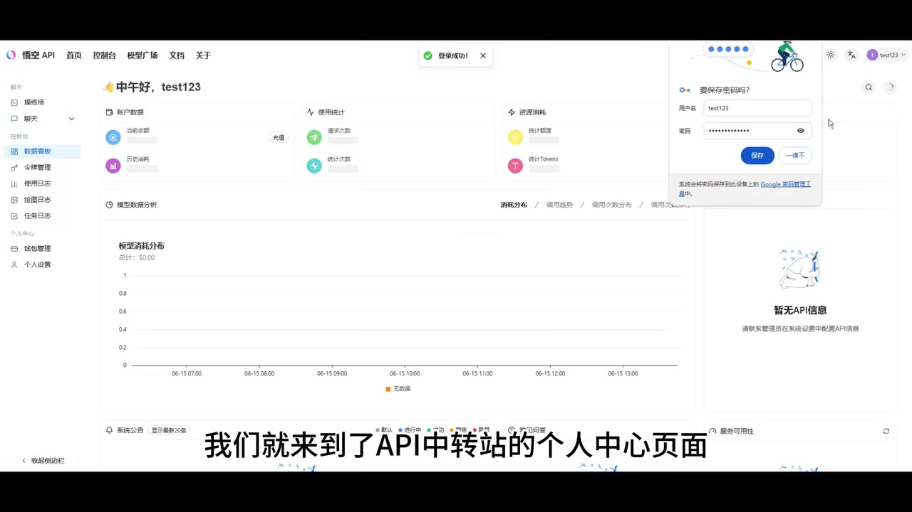

# NEWAPI中转站新手注册教程

> 来源：[Bilibili 视频](https://www.bilibili.com/video/BV1QuJV6GEXa) 
> UP 主：老便秘了｜发布时间：2026-06-15｜视频时长：02:28｜分辨率：1920×1080

## 小结

这是一支面向完全新手的 API 中转站基础操作演示，主题是从注册账号开始，依次完成登录、兑换码激活、浏览模型、创建令牌，以及将令牌用于第三方平台对接的流程。视频所展示的页面品牌为“悟空 API”，但标题将其称为“NEWAPI 中转站”；应将其理解为一套以 New API 类界面为基础的具体站点操作实例，而非适用于所有中转站的通用界面保证。

视频给出的主流程是：**注册/登录 → 兑换码激活 → 模型广场选模型 → 新建令牌 → 复制令牌并前往第三方平台配置**。其中，UP 主特别强调兑换码应完整复制粘贴，避免多输、少输或夹带字符导致激活失败。

从画面可确认，注册页包含用户名、密码、确认密码和“注册”按钮；密码输入框的页面提示为“最短 6 位，最长 20 位”。登录成功后进入包含数据面板、令牌管理、使用日志等入口的后台。视频并未实际展示某个具体第三方客户端的完整对接页面，也没有提供兑换码获取方法、可用模型清单、价格、令牌权限具体取值或接口文档，因此这些内容不能从本视频推导。

该教程适合已经获得站点入口、账号注册资格及兑换码的新用户，用于理解后台操作顺序。令牌属于敏感凭据，复制到第三方平台时应避免在截图、公开文本、聊天记录或代码仓库中泄露。站点的模型价格、权限、分组、页面入口及可用渠道均可能随平台运营策略变动，应以实际后台和官方文档为准。

## 思维导图

## 目录

- [背景、适用对象与界面定位](#背景适用对象与界面定位)
- [注册、登录与进入个人中心](#注册登录与进入个人中心)
- [兑换码激活账号权限](#兑换码激活账号权限)
- [模型广场：查看模型、规格与计费信息](#模型广场查看模型规格与计费信息)
- [创建令牌并用于第三方对接](#创建令牌并用于第三方对接)
- [完整操作清单与安全建议](#完整操作清单与安全建议)
- [结论、限制与时效性](#结论限制与时效性)
- [字幕比对](#字幕比对)
- [评论分析](#评论分析)
- [处理记录](#处理记录)

## 背景、适用对象与界面定位 [00:00:00](https://www.bilibili.com/video/BV1QuJV6GEXa?t=0)

UP 主开场称，部分用户私信反馈“不懂 API 中转站怎么用”“操作总是出错”以及“不知道怎么激活使用”，因此制作本期保姆级实操说明。视频目标是让新手理解从进入中转站到获取可用于对接的令牌的完整路径。

画面中的首页顶部导航包含“首页、控制台、模型广场、文档、关于”等入口；首页主文案为“统一的大模型接口网关”，并写有“多模型统一接入，只需将基础址替换为：”。画面还展示了多个模型/供应商图标，说明该站点的定位是将多类模型服务汇集到统一的 API 网关下。

> 图：关键帧展示“悟空 API”首页、统一模型接口网关的宣传语、模型供应商图标及接口路径示例。它有助于确认视频演示的是一个带模型广场与 API 网关能力的站点，而非单一模型官方控制台。画面中可见域名及接口路径仅作为演示页面信息，不应据此推断其当前仍有效。

### 前置条件与适用边界

- **适用对象**：已找到该站点入口、希望完成基础注册和令牌配置的用户。
- **视频假设的前置条件**：用户已拥有或能准备“专属兑换码”；视频没有讲解兑换码的购买、领取或申请方式。
- **不是本视频范围的内容**：站点部署、上游渠道接入、具体第三方客户端配置、模型效果对比、价格核验、故障排查细节。
- **术语说明**：
  - **兑换码**：视频中用于解锁账号权限的代码。
  - **模型广场**：展示平台可用模型、标价、规格及适配场景的页面。
  - **令牌（Token/API Key）**：创建后复制到第三方平台或客户端进行接口鉴权的凭据；视频称其可用于“各类对接端口”。

## 注册、登录与进入个人中心 [00:00:24](https://www.bilibili.com/video/BV1QuJV6GEXa?t=24)

UP 主说明：进入 API 中转站入口后，没有账号的用户点击“注册”，按页面提示填写信息完成注册；已有账号的用户则输入账号和密码后登录。注册完成并不等于已经获得全部使用权限，后续还需要兑换码激活。

从注册页画面可读到以下字段和约束：

| 项目 | 画面/视频可确认内容 |
| --- | --- |
| 用户名 | 注册页提供用户名输入框。 |
| 密码 | 注册页提供密码输入框，提示“最短 6 位，最长 20 位”。 |
| 确认密码 | 注册页要求再次确认密码。 |
| 提交动作 | 点击“注册”。 |
| 已有账号入口 | 页面底部有“已有账户？登录”。 |

> 图：关键帧直接展示注册表单中的用户名、密码、确认密码和“注册”按钮；密码栏下方可见“最短 6 位，最长 20 位”的界面提示。这是视频中可确认的唯一明确输入参数约束。

注册成功后，画面跳转到登录页并出现“注册成功！”提示。登录页面包含“用户名或邮箱”“密码”输入框和“继续”按钮；UP 主的口述简化为输入账号密码并登录。由此可见，登录标识在实际页面上可使用“用户名或邮箱”，但注册时展示的是用户名字段。

登录成功后会进入个人中心/数据面板。画面左侧菜单可见“模型广场”“聊天”“数据面板”“令牌管理”“使用日志”“绘图日志”“任务日志”“兑换码管理”“个人设置”等栏目；主区域展示账户余额、调用统计、模型消耗分布等数据卡片。示例账户页面还显示“暂无 API 信息”，并提示联系管理员在系统设置中配置 API 信息，表明后台是否有可用 API 还依赖站点管理员配置，不能只凭注册完成就假定服务已就绪。

> 图：关键帧展示登录成功提示、左侧“令牌管理”等菜单以及数据面板。右侧“暂无 API 信息”的提示说明示例页面没有可展示的 API 数据，也体现站点可用性存在后台配置依赖。

## 兑换码激活账号权限 [00:00:48](https://www.bilibili.com/video/BV1QuJV6GEXa?t=48)

UP 主将兑换码激活称为登录后的“第一步”和“最重要”的操作。其描述的操作顺序为：

1. 在个人主页/后台找到“兑换激活”入口。
2. 进入激活页面。
3. 将提前准备好的专属兑换码复制并粘贴到输入框。
4. 检查兑换码无误后，点击“立即兑换”。
5. 若页面提示激活成功，则表示账号权限已解锁。
6. 返回主页，继续进入模型广场。

### 视频明确给出的避坑点

- 兑换码应采用**完整复制粘贴**，不要多输、少输或输入错误字符。
- 是否激活成功以页面成功提示为准。
- 视频没有展示失败提示、兑换码失效、已使用、兑换额度不足等异常场景，也没有说明失败后应联系谁或如何申诉。

需要注意，UP 主使用“账号权限已经解锁”的表述，但没有说明解锁的具体内容，例如可使用哪些模型、额度多少、有效期多久、是否有调用频率限制。因此，激活成功只可理解为该站点对该账号确认了某种权限状态，具体权益仍须以实际后台显示为准。

## 模型广场：查看模型、规格与计费信息 [00:01:12](https://www.bilibili.com/video/BV1QuJV6GEXa?t=72)

激活后，UP 主指引用户从主页打开“模型广场”。按视频口述，模型广场汇集平台可用的 AI 模型，用户可查看每款模型的：

- 详细标价；
- 使用规格；
- 适配场景；
- 计费标准；
- 使用权限。

UP 主的建议是，按自身使用需求自由选择合适模型，并认为其性价比高。这里的“性价比高”是 UP 主的主观评价，并未在视频中通过价格表、测试数据或横向比较论证，不能将其当作已验证结论。

### 选型时应实际核对的项目

视频没有给出具体模型名称、价格或上下文长度等参数，但基于其所说的“标价、规格、适配场景”，用户在实际页面中至少应核实：

1. 模型是否位于当前账号可用的分组或权限范围内；
2. 计费单位和价格展示的具体含义；
3. 模型是否符合文本、代码、视觉等实际任务；
4. 调用所需的接口兼容格式；
5. 是否存在余额、并发、速率或额度限制。

以上是对视频提到的“按需求选模型”的执行性拆解，不代表视频已经展示了这些字段的具体取值。

## 创建令牌并用于第三方对接 [00:01:36](https://www.bilibili.com/video/BV1QuJV6GEXa?t=96)

选好模型后，UP 主进入本教程的核心配置步骤：创建专属令牌。视频将该令牌描述为可用于第三方平台各类对接端口的凭据，通用性较强。

操作顺序如下：

1. 找到“创建令牌”或“新建令牌”功能入口。
2. 点击“新建令牌”。
3. 按视频说法，填写对应的第三方地址/对接位置。
4. 按使用习惯和需求选择对应分组。
5. 自定义设置令牌的使用权限和参数。
6. 完成配置后点击“创建并保存”。
7. 等待页面加载完成。
8. 复制生成的令牌，前往各平台进行对接使用。

### 视频未公开的令牌参数

视频提及“分组、权限和参数”，但未展示字段名称、可选值、默认值或推荐设置；也没有显示所创建的令牌内容。因此不能编造具体配置，例如令牌名称、有效期、额度、模型白名单、IP 白名单、速率限制或接口 Base URL。

对接步骤同样停留在“复制令牌后去各平台使用”的层面。视频没有展示任何第三方软件、代码片段、环境变量、请求示例或接口测试结果。因此，用户仍需依据目标平台的文档，将站点实际提供的地址与令牌填入其对应配置项。

## 完整操作清单与安全建议 [00:02:00](https://www.bilibili.com/video/BV1QuJV6GEXa?t=120)

UP 主在结尾回顾，本教程完成的是“从注册激活到选模型、配置令牌”的全套流程；随后预告下一期将讲中转站搭建及上游渠道对接的详细步骤。

### 可按视频执行的最小流程

| 顺序 | 操作 | 成功信号 | 视频未覆盖部分 |
| --- | --- | --- | --- |
| 1 | 打开 API 中转站入口 | 能访问首页或注册/登录页 | 站点来源、入口获取方式 |
| 2 | 新用户注册 | 页面提示注册成功 | 邮箱验证、风控、注册失败处理 |
| 3 | 使用用户名或邮箱与密码登录 | 登录成功并进入后台 | 找回密码、二次验证 |
| 4 | 进入兑换激活页面 | 找到兑换码输入位置 | 入口的准确菜单层级 |
| 5 | 粘贴并提交兑换码 | 页面提示激活成功 | 兑换码的来源、有效期及失败处置 |
| 6 | 打开模型广场 | 可查看模型信息 | 模型具体清单、实时价格、调用限制 |
| 7 | 新建令牌 | 可进入令牌配置页面 | 字段含义及推荐参数 |
| 8 | 选择分组、设置权限和参数后保存 | 令牌创建完成 | 权限值、分组规则、参数范围 |
| 9 | 复制令牌并到第三方平台配置 | 第三方平台请求成功 | 实际客户端配置和连通性验证 |

### 令牌安全与操作经验

1. **令牌只在必要时复制**：它相当于调用权限凭据，不应直接发到公开评论区、群聊、截图或代码仓库。
2. **核对粘贴内容**：视频强调兑换码不能多输少输；同样地，复制令牌时也应避免首尾空格、截断或混入换行。
3. **先确认权限，再排查对接**：如果激活未成功或模型不在当前分组权限内，即使令牌创建成功，也可能无法按预期调用。
4. **以后台实时信息为准**：模型价格、可用模型及权限属于站点运营信息，不能以本视频中的泛化描述替代实际页面。
5. **第三方对接需参考目标平台文档**：本视频没有给出具体客户端配置；不要依据未经验证的网络示例臆测接口字段。

## 结论、限制与时效性 [00:02:24](https://www.bilibili.com/video/BV1QuJV6GEXa?t=144)

本视频的核心价值是为新手建立清晰的操作顺序：**先完成账户与兑换码激活，再查看可用模型，最后创建令牌进行对接**。对于首次使用此类聚合 API 网关的用户，这一顺序能减少“注册后直接拿不到权限”或“未创建令牌就尝试第三方调用”的流程性问题。

但它是一支流程概览视频，而不是可直接复现全部配置的技术文档。以下信息在视频中没有给出或没有被验证：

- 站点官方入口、服务主体及运营稳定性；
- 兑换码如何获取、兑换后的具体权益、额度与有效期；
- 可用模型名称、实时价格、计费单位、上下文限制和速率限制；
- 令牌配置表单的全部字段与参数范围；
- 任一第三方平台的实际对接方法与成功请求示例；
- 调用失败、余额不足、权限不足、模型不可用等问题的排查路径；
- UP 主关于“全部主流模型”“性价比超高”“通用性非常强”的判断依据。

视频发布于 2026-06-15，收藏记录为 2026-06-20。此类中转站的模型供应、接口格式、站点域名、菜单结构、权限政策与价格均可能变化。尤其是画面中出现的接口地址示例和品牌信息，仅能证明视频录制时的页面展示，不能证明当前可访问或适用于其他站点。

## 字幕比对

| 字幕来源 | 完整性 | 专有名词 | 时间轴 | 主要问题 |
| --- | --- | --- | --- | --- |
| Bilibili 站内字幕 | 未提供可用字幕 | 无法核对 | 无法核对 | 素材记录显示字幕工具请求因 `Invalid URL` 退出，未获得可用站内字幕。 |
| 本次 ASR 字幕 | 高：7 段，语音覆盖约 99.93% | 一般：多处同音/错字 | 可用：00:00:00.080 至 00:02:27.580 | “中转站”“兑换激活”“令牌”等词被识别为“中轰站/中轢站”“兑換激火”“令牨”等；缺少画面文字级细节。 |

### 最终字幕选择与校正

本次整理采用 **ASR 时间轴字幕** 作为时间依据。ASR 诊断信息显示：

- 识别语言：中文；
- 模型：`medium`；
- 音频时长：147.609 秒；
- 首段语音：00:00:00.080；
- 末段语音：00:02:27.580；
- 语音覆盖率：约 99.93%；
- 未标记 `noAudioStream=true`，说明源视频存在音轨，未发生“无音轨”情形。

由于没有可用的站内字幕，无法进行逐句对照；但仍完成了对本次 ASR 的检查。结合视频标题、口述上下文和关键帧界面文字，对以下高频词做了正文层面的规范化处理：

| ASR 原文倾向 | 正文采用写法 | 校正依据 |
| --- | --- | --- |
| API 中轰站 / 中轢站 | API 中转站 | 视频标题及上下文一致指向“中转站”。 |
| 兑換激火 / 激和 | 兑换激活 | 语义为输入兑换码后解锁权限。 |
| 令牨 / 令排 | 令牌 | 视频明确说明其会生成、复制并用于第三方对接。 |
| 模型广场点几 | 模型广场点击 | ASR 同音识别误差，语义明确。 |
| 添建令牨 | 创建令牌 / 新建令牌 | 结合口述与后台左侧“令牌管理”菜单画面。 |

## 评论分析

本次仅获取到 2 条热评，少于“热评前三条”的上限；以下不补充不可获取的第三条，也不将评论内容视为已验证事实。

1. **UP 主「老便秘了」：提供群号并称可 1 对 1 远程协助**
   - 评论内容：有配置问题可以到群里寻找 UP 主，附有群号，并称可提供“1 对 1 远程”。
   - 补充价值：说明视频发布者愿意针对配置问题提供后续沟通渠道。
   - 可信度与风险：这是 UP 主自述的支持承诺，无法从现有素材验证响应时效、服务范围或安全性。远程协助涉及账号、令牌和设备权限时，应避免暴露密码、兑换码、API 令牌及其他敏感信息。

2. **用户「布丁布丁爱学习」：询问兑换码来源**
   - 评论内容：“兑换码从哪里找？”
   - 补充价值：印证“兑换码获取方式”确实是视频流程中的信息缺口。
   - 结论：现有素材中没有 UP 主对此评论的回复，也没有视频内说明兑换码来源。因此不能据此推断兑换码由何处获取、是否免费或是否存在固定领取渠道。

## 处理记录

- Worker ID：`worker-mrj0wbly-5dc4e50c`
- 调用模型：`gpt-5.6-terra`；本次 ASR 模型为 `medium`（CUDA / `float16`）。
- 使用的素材与工具产物：视频元数据、`audio/audio.wav`、`asr/transcript.srt`、`asr/asr-result.json`、关键帧目录 `frames/`、热评文件 `comments/comments.json`。
- 字幕选择：未提供可用 Bilibili 站内字幕；已检查本次 ASR，采用其带时间戳的 7 段结果作为章节时间轴依据，并对明显同音错字作上下文规范化。
- 关键帧选择依据：
  - `frames/frame-001.jpg`：展示统一模型接口网关首页、模型支持图标与接口示例，支撑站点定位说明；
  - `frames/frame-002.jpg`：展示注册字段及“密码最短 6 位、最长 20 位”这一明确参数；
  - `frames/frame-004.jpg`：展示登录后的后台、令牌管理入口与“暂无 API 信息”提示，支撑后台功能和配置依赖说明。
- 站内字幕情况：字幕获取环节记录了 `Invalid URL` 警告，未获得可用站内字幕；这不影响对本次 ASR 音轨结果的检查。
- 缓存清理：提供的素材记录未包含缓存清理执行结果，无法确认是否已清理；本文不对清理状态作未证实声明。
- 未解决问题：兑换码来源与权益、模型清单和实时价格、令牌字段的实际取值、站点接口与第三方客户端的完整对接方法，均未在视频或可获取评论中给出。
