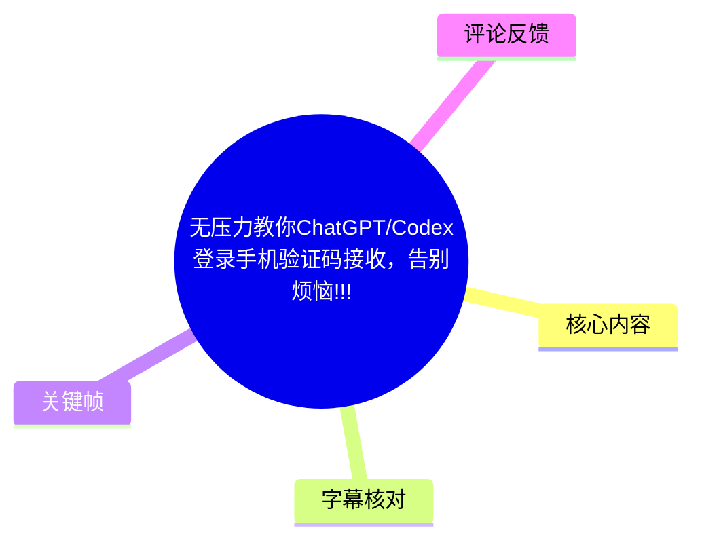
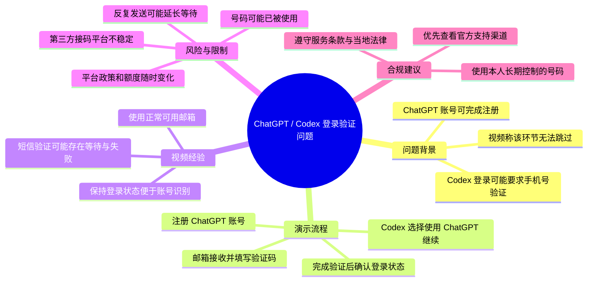
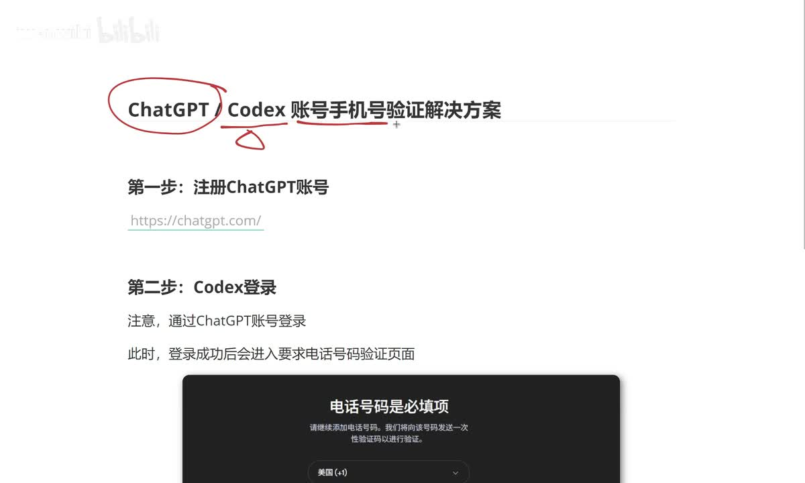
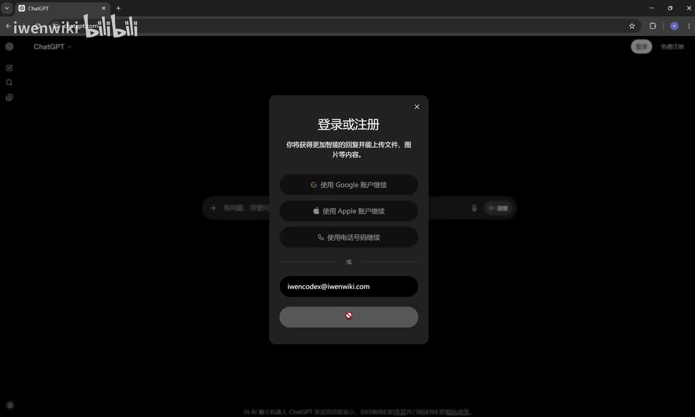
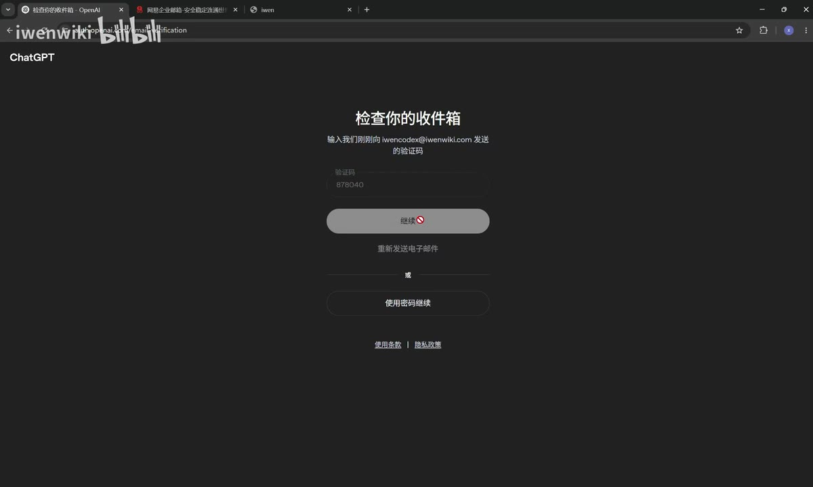
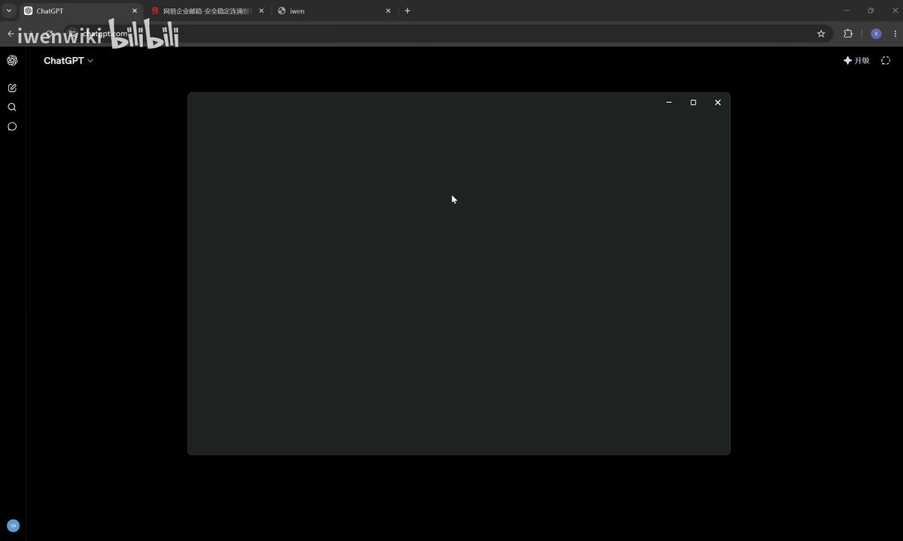

# 无压力教你 ChatGPT/Codex 登录手机验证码接收，告别烦恼!!!

> 来源：[Bilibili 视频](https://www.bilibili.com/video/BV1BqG16ZESm)  
> UP 主：iwenwiki｜时长：08:20｜合集：AIcode  
> 视频描述称：Free 账号新注册后“大概率无法登录”；另附 Codex 使用教程链接。该说法属于视频发布时的经验，不能视为当前平台规则。

## 小结

视频围绕一个具体登录障碍展开：用户可以注册 ChatGPT 账号，但在 Codex 中选择以 ChatGPT 账号登录时，页面可能进一步要求手机号验证。UP 主将此验证描述为其演示流程中“跳不过去”的环节，并从账号注册、Codex 发起登录、等待验证码，到最终确认 Codex 已登录，完整演示了一次操作。

视频的核心经验是：若某一服务要求手机号验证，应优先使用**自己可合法控制、可长期接收短信、且符合服务所在地与平台规则的号码**完成验证。UP 主在原视频中演示了第三方接码平台及网络位置配置；这类操作可能违反服务条款、触发风控，且会带来账号、隐私、资金和号码复用风险，因此本文只记录其事实性主张和风险，不复述用于规避验证的可执行购买、选国家、重试等步骤。

视频展示的账号注册部分较常规：访问 ChatGPT 官网、以正常邮箱收取邮件验证码、填写姓名并创建账号。画面中显示了邮件验证码页面，说明“邮箱可用”是账户创建的基础前提；视频称 163、QQ 邮箱等正常邮箱均可使用，但这只是 UP 主当时的经验，并非官方兼容性承诺。

在 Codex 的登录环节，视频强调应选择“使用 ChatGPT 继续”，而不是其他登录入口。成功后，UP 主在 Codex 页面看到新登录账户及“剩余用量 1 周 97%”的显示；这只是演示账号当时的界面状态，不能据此推断所有新账号的额度、周期或功能权限。

时效性尤其重要：视频元数据发布时间为 2026-05-27（UTC），但 ChatGPT、Codex、登录页、地区支持、手机号验证政策、免费账户额度以及第三方平台供给都可能随时变化。视频末尾也明确提醒接码平台并不稳定，可能失败；用户不应据此期待稳定、可复制的成功率。

## 思维导图

## 目录

- [问题定义与视频范围](#问题定义与视频范围-0000)
- [注册 ChatGPT 账号：邮箱验证](#注册-chatgpt-账号邮箱验证-0024)
- [在 Codex 中选择 ChatGPT 登录](#在-codex-中选择-chatgpt-登录-0209)
- [手机号验证：视频方案与关键限制](#手机号验证视频方案与关键限制-0344)
- [结果确认、额度展示与完整流程](#结果确认额度展示与完整流程-0710)
- [可迁移经验、风险与合规替代](#可迁移经验风险与合规替代-0755)
- [字幕比对与术语校正](#字幕比对与术语校正-0000)
- [评论分析](#评论分析-0000)
- [处理记录](#处理记录-0000)

## 问题定义与视频范围 [00:00](https://www.bilibili.com/video/BV1BqG16ZESm?t=0)

视频开头说明，UP 主收到的主要反馈是：有用户已经可以注册 ChatGPT 账号，但通过 ChatGPT 账号登录 Codex 时遭遇手机号码验证，而现有手机号不被页面支持。视频因此从零演示账号注册至 Codex 登录完成的完整链路。

根据视频开场页，演示主题为“ChatGPT Codex 账号手机号验证解决方案”，并将流程划分为两步：

1. 注册 ChatGPT 账号；
2. 通过 ChatGPT 账号登录 Codex，此时可能进入要求手机号验证的页面。

> 图：画面直接列出了“注册 ChatGPT 账号”与“Codex 登录”两阶段，并在 Codex 登录下方标注手机号为必填项。这是理解视频问题边界和流程顺序的关键帧。

需要区分三类信息：

- **视频事实**：UP 主在其录屏环境中确实进入了手机号验证相关页面，并完成了后续演示。
- **视频观点**：UP 主认为在其遇到的 Codex 登录情形中，手机号验证“跳不过去”。
- **不能外推的结论**：不同账号、地区、时间、客户端版本、风险状态及 OpenAI 政策下，页面是否要求验证、可支持哪些方式，均可能不同。

## 注册 ChatGPT 账号：邮箱验证 [00:24](https://www.bilibili.com/video/BV1BqG16ZESm?t=24)

### 访问官网并开始注册 [00:24](https://www.bilibili.com/video/BV1BqG16ZESm?t=24)

UP 主先退出已有登录状态，以便从头展示注册过程；随后进入 ChatGPT 网站并选择免费注册。视频口述中出现的“XGPT”“XGPD”等词是 ASR 对专有名词的误识别，结合标题、画面和上下文，应校正为 **ChatGPT**。

画面展示了 ChatGPT 的登录或注册弹窗，其中可选择 Google、Apple、手机号等方式继续，也可填写邮箱地址。UP 主在演示中选用了邮箱方式。

> 图：该帧显示 ChatGPT 登录/注册窗口和邮箱输入区域，证明视频的第一阶段是账号创建与身份验证，而非直接进入 Codex。

### 邮箱验证码与账户创建 [01:01](https://www.bilibili.com/video/BV1BqG16ZESm?t=61)

视频说明，提交邮箱后需要到邮箱收取验证码。UP 主称只要邮箱状态正常即可，并举例提到 163 邮箱、QQ 邮箱；该内容应理解为个人实测经验。

演示步骤可归纳为：

1. 在 ChatGPT 注册页面输入一个可访问的邮箱；
2. 到该邮箱收取 ChatGPT 发出的验证码；
3. 将验证码填回注册页面并继续；
4. 填写全名并创建账户。

> 图：画面显示“检查你的收件箱”及验证码输入位置，直观说明这一阶段依赖邮箱验证。截图中存在演示邮箱和验证码信息，实际操作不应公开自己的邮箱、一次性验证码或会话信息。

### 注册成功不等于 Codex 登录完成 [01:45](https://www.bilibili.com/video/BV1BqG16ZESm?t=105)

UP 主特别区分了两个状态：

- **ChatGPT 账户注册成功**：只表明账号已创建，且当前已登录 ChatGPT；
- **Codex 以该账号登录成功**：在其演示中仍会触发额外的手机号码验证。

该区分是视频最重要的认知点之一：账户创建和产品授权/登录校验并不是同一个步骤。即使邮箱注册顺利，Codex 的登录页仍可能根据账号或环境发起附加校验。

## 在 Codex 中选择 ChatGPT 登录 [02:09](https://www.bilibili.com/video/BV1BqG16ZESm?t=129)

### 启动 Codex 并退出已有会话 [02:14](https://www.bilibili.com/video/BV1BqG16ZESm?t=134)

UP 主打开 Codex 后发现自己此前已处于登录状态，因此先退出登录，再重新演示授权流程。视频称如果程序打开较慢，可以重新打开或多打开几次；这是排查客户端加载状态的经验，不代表能解决服务端验证、账号权限或地区限制问题。

> 图：该帧展示 Codex 独立窗口正在加载，用于说明视频操作对象是 Codex 客户端/窗口，而不是仅在浏览器内完成全部流程。

### 选择“使用 ChatGPT 继续” [03:20](https://www.bilibili.com/video/BV1BqG16ZESm?t=200)

退出 Codex 登录后，UP 主选择“使用 ChatGPT 继续”。视频说明，这会跳转到网页；若浏览器中已经登录刚注册的 ChatGPT 账号，网页可能自动识别该账号，用户可继续登录；若未识别，则需在正常登录页选择或输入正确账户。

这里的操作原则是：

- Codex 登录入口应与目标账户类型匹配；
- 浏览器已有会话可能影响账号自动识别；
- 自动识别错误时，应确认登录的是自己的正确账号，而非盲目继续。

### 视频展示的剩余用量差异 [03:02](https://www.bilibili.com/video/BV1BqG16ZESm?t=182)

UP 主在退出前展示了 Codex 的“剩余用量”区域，并称自己此前的 Plus 账号出现“一周”和“一天”两个选项，而普通新注册账号在其经验中只显示一个周期性额度。该说明仅反映其当时账户与界面，不能作为套餐权益或额度规则的依据。

## 手机号验证：视频方案与关键限制 [03:44](https://www.bilibili.com/video/BV1BqG16ZESm?t=224)

> **安全与合规说明**：这一段视频演示了借助第三方临时号码/接码服务完成手机号验证的做法。由于此类方法可能规避平台身份验证、违反服务条款、涉及号码滥用或账号安全风险，本文不提供购买号码、选择服务地区、配置网络位置、复制号码、提交验证码或失败重试的操作指引。以下仅保留视频的事实性内容、参数描述和风险提示，便于理解其论证与局限。

### 视频所述第三方平台方案 [03:44](https://www.bilibili.com/video/BV1BqG16ZESm?t=224)

UP 主称其测试过多个接码平台，视频中选用的是 **5SIM**，理由是其个人测试中验证成功较方便、成功率相对较高。随后，UP 主在该平台中搜索并选择 “OpenAI”/“ChatGPT” 相关服务，选择国家，并购买一个号码以接收短信。

这不是 OpenAI 官方支持流程。视频没有提供 OpenAI 对该平台、该号码来源或该方法的授权证明。因此，“UP 主测试成功”不能等同于“官方允许”“长期有效”或“对其他用户安全可靠”。

### 视频列出的三个关键条件 [04:08](https://www.bilibili.com/video/BV1BqG16ZESm?t=248)

视频明确强调了三个操作条件：

| 视频所述条件 | 视频表达的含义 | 需要注意的限制 |
| --- | --- | --- |
| 网络位置与手机号国家一致 | UP 主认为 IP 所在国家应与号码所属国家相同 | 这是视频经验，不是可验证的官方规则；刻意伪造位置或规避地区要求可能违反条款 |
| 使用全局网络模式 | UP 主称应将网络设置为“全局” | 网络配置会影响隐私、安全和合规；本文不提供配置方法 |
| 选择 `Text Message` | 视频称应通过短信而非 WhatsApp 收取验证码 | 具体验证通道由页面实际提供内容决定；不要假定所有账号均有相同选项 |

视频还给出了演示中的资金参数：UP 主先输入 **2 美元**，称约合人民币 14 元多；随后建议“1 美元就足够”。这只是当时第三方平台的展示价格与个人建议，价格、退款规则、币种汇率、服务可用性均不可保证。

### 等待、取消与号码复用问题 [06:21](https://www.bilibili.com/video/BV1BqG16ZESm?t=381)

视频列举了若干失败或延迟场景：

- 接收验证码可能需要 1—3 分钟；
- 超过 5 分钟仍未收到时，UP 主建议取消当前订单并更换号码；
- 页面可能提示该号码已被使用；
- 反复触发发送验证码，可能导致等待时间拉长至 2 小时、24 小时甚至 48 小时。

这些内容体现了临时号码服务的不确定性：号码可能被多人使用、短信投递可能失败、服务端风控可能升级。即便平台声称未收到短信可以退款，仍应以该平台当时的公开条款为准，且需自行承担第三方服务带来的隐私和支付风险。

## 结果确认、额度展示与完整流程 [07:10](https://www.bilibili.com/video/BV1BqG16ZESm?t=430)

### 视频中的成功判据 [07:10](https://www.bilibili.com/video/BV1BqG16ZESm?t=430)

在验证码输入后，UP 主等待页面继续跳转，并以两个现象作为成功依据：

1. 网页侧显示已经登录 Codex；
2. 返回 Codex 后，看到新注册账号已处于登录状态。

UP 主称此时可关闭网页侧授权窗口。需要注意，网页显示已登录只说明当次会话可能建立成功；账户能否长期稳定使用、能否通过后续安全检查、是否符合使用资格，仍取决于平台后续规则。

### 演示账号的额度画面 [07:31](https://www.bilibili.com/video/BV1BqG16ZESm?t=451)

视频中，UP 主返回 Codex 后看到剩余用量为“1 周 97%”，并将其视为账户已成功接入的佐证。该数值仅属于演示画面中的特定账户状态，不能推导出：

- 所有新账号都有一周额度；
- 所有地区的免费账户具备相同能力；
- 额度百分比对应固定次数、固定 Token 或固定功能；
- 账户在后续仍可保持该状态。

### 视频最终结论 [07:55](https://www.bilibili.com/video/BV1BqG16ZESm?t=475)

UP 主在结尾再次提醒：接码平台“不一定很稳定”，可能不稳定或失败；用户需判断是否值得为一次验证花费约 1 美元。这个提醒与前文的等待、号码复用和多次失败现象一致，也侧面说明该方案没有稳定性保证。

## 可迁移经验、风险与合规替代 [07:55](https://www.bilibili.com/video/BV1BqG16ZESm?t=475)

### 可以迁移的排查思路

不涉及规避验证时，视频仍提供了几项可迁移的排查框架：

1. **区分注册与产品登录。** 邮箱创建账户成功，不代表另一个产品或客户端已完成授权。
2. **确认登录入口。** 在 Codex 中应选与目标身份一致的登录方式，并检查浏览器是否自动带入了错误账号。
3. **识别等待与失败的差异。** 验证码延迟、号码已使用、重复请求导致的限制，属于不同故障现象，不能以“继续刷新”一概处理。
4. **以界面状态交叉验证。** 网页授权成功后，应回到 Codex 检查账号名称、登录态和可用功能，而不是只看单一页面提示。
5. **不要把个人实测视为通用规则。** 平台权益、地区策略和风控条件都可能随时间变化。

### 主要风险

| 风险类别 | 本视频关联内容 | 建议 |
| --- | --- | --- |
| 账号安全 | 临时或多人复用号码可能无法长期控制 | 优先使用本人合法持有、可持续接收短信的号码 |
| 服务条款 | 第三方接码和位置伪装可能违反平台规定 | 阅读 OpenAI/Codex 当前条款、地区政策和账号规则 |
| 隐私泄露 | 验证码、邮箱、号码、登录会话均属于敏感信息 | 不在截图、评论或公共渠道披露验证码与会话数据 |
| 资金损失 | 第三方服务存在收费、退款与供给不确定性 | 不向不可信第三方支付，不因一次性验证需求大额充值 |
| 账号风控 | 高频请求或异常环境可能引发更长等待或限制 | 避免重复触发验证；如无法完成，转向官方支持 |
| 时效失效 | 视频发布后产品界面和规则可能更新 | 以当前官方页面与帮助中心为准 |

### 合规替代路径

如果遇到手机号验证，优先考虑以下方式：

- 使用自己的、可长期控制且符合服务支持范围的手机号码；
- 检查账号国家/地区信息与服务可用区域是否一致；
- 通过官方帮助中心、账户支持页面或产品内提示处理验证失败；
- 若所在地区或账号类型不受支持，不尝试绕过限制，而是等待官方支持或选择本地合规的替代产品。

## 字幕比对与术语校正 [00:00](https://www.bilibili.com/video/BV1BqG16ZESm?t=0)

| 字幕来源 | 完整性 | 专有名词 | 时间轴 | 主要问题 |
| --- | --- | --- | --- | --- |
| Bilibili 站内字幕 | 未提供可用字幕 | 无法评估 | 无法评估 | 素材记录显示字幕工具因 URL 无效而未取得站内字幕 |
| 本次 ASR 字幕 | 较完整：26 段，语音覆盖约 462.82 秒，占视频约 92.68% | 存在较多误识别 | 完整提供 SRT 起止时间 | 将 ChatGPT、Codex、5SIM 等多次识别为相近但错误的词形 |

本次 ASR 检测到中文音轨，语言置信度为 **0.9985**，未标记 `noAudioStream=true`。因此，本视频并非无音轨视频；可直接使用 ASR 的 SRT 时间段作为时间轴依据。

最终采用策略为：**以本次 ASR 的真实时间戳为准，以视频标题、关键帧画面和上下文校正专有名词。**

重点校正如下：

| ASR 常见写法 | 正文采用写法 | 校正依据 |
| --- | --- | --- |
| XGPT / XGPD / XGPP | ChatGPT | 视频标题、开场页、浏览器页面均显示 ChatGPT |
| QDEX / QDEZ / CodeX | Codex | 视频标题、口述上下文、Codex 客户端画面 |
| 5SIN | 5SIM | ASR 语境为第三方接码平台名称，结合口述发音校正 |
| Chargbt | ChatGPT | “OpenAI, Chargbt”所在段落的产品名称语境 |
| 邮相 / 邮销 | 邮箱 | 上下文为接收邮件验证码 |

ASR 在术语上不可靠，但各段时间边界与视频流程高度吻合：注册在 00:24—02:09，Codex 登录在 02:09—03:44，第三方验证方案在 03:44—07:28，结果确认与结尾提醒在 07:31—08:18。因此，本文的章节链接均依据 ASR/SRT 的实际起止秒数生成，而非按文字顺序估算。

## 评论分析 [00:00](https://www.bilibili.com/video/BV1BqG16ZESm?t=0)

可获取热评数量为 **2 条**，未达到“前三条”的上限；以下仅分析这 2 条，不补造缺失评论。

### 热评 1：节点、短信方式与号码价格经验

- **评论者**：大费周喆
- **获赞**：294
- **观点概述**：评论者称自己尝试八十多次后成功，并复述了视频中的若干经验：网络节点国家与号码国家一致、使用全局代理、选择短信接收；其额外补充称随机号码多次失败后，选择约 0.2 美元的较贵号码，两次成功。
- **补充价值**：该评论提供了“号码质量/价格可能影响成功率”的个人观察，这是原视频未具体展开的变量。
- **可信度与限制**：这是单一用户的自述，没有订单、时间、账号状态或平台规则证据，也无法排除环境、时段、账号风控等混杂因素。不能据此得出“贵号码必然更有效”的结论，更不应将其作为规避验证的操作建议。

### 热评 2：提供付费代操作

- **评论者**：徐徐嘘嘘不虚虚
- **获赞**：134
- **观点概述**：评论者以“一次 1r”为价格，邀请其他用户私信代办。
- **补充价值**：该评论反映出视频主题下存在付费代操作需求。
- **风险判断**：该内容没有提供可验证的服务资质、隐私保护机制或售后保障。将账号登录、验证码或会话交给陌生人可能导致账户被接管、个人信息泄露、支付损失或违反服务规则，不建议采用。

## 处理记录 [00:00](https://www.bilibili.com/video/BV1BqG16ZESm?t=0)

- **Worker ID**：worker-mrj0www4-e8d79408
- **模型**：gpt-5.6-terra
- **可用素材与工具产物**：视频元数据、关键帧目录、音频、ASR 结果 JSON、ASR SRT 时间轴字幕、评论 JSON。
- **站内字幕检查**：未提供可用站内字幕；素材警告记录为 `subtitles: Tool process exited with code 1`，原因是 `Invalid URL`。
- **ASR 检查结果**：已检查 `asr-result.json`；中文识别，26 个片段，含有效时间戳，音轨存在，未出现 `noAudioStream=true`。
- **字幕选择**：采用本次 ASR 的 SRT 起止时间作为全部时间轴链接依据；以标题、关键帧和上下文纠正 ChatGPT、Codex、5SIM 等 ASR 专有名词误识别。
- **关键帧选择依据**：
  - `frames/frame-001.jpg`：流程标题页，明确主题、两步结构与手机号必填提示；
  - `frames/frame-002.jpg`：ChatGPT 登录/注册弹窗，对应邮箱注册阶段；
  - `frames/frame-003.jpg`：邮箱验证码输入页，对应收件箱验证阶段；
  - `frames/frame-004.jpg`：Codex 窗口加载画面，对应客户端登录阶段。
- **内容安全处理**：对第三方接码、临时号码、网络位置伪装等内容保留视频陈述、价格、等待时间与风险信息；未复写可执行的规避验证步骤。
- **缓存清理**：素材中未提供可验证的缓存清理执行记录；本文不虚构清理结果。
- **未解决问题**：
  - 无法取得站内字幕以进行逐句对照；
  - 未提供全部关键帧的画面预览，正文只使用已给出的、可明确对应流程的关键帧；
  - 无法验证视频发布后 ChatGPT、Codex 的当前验证政策、地区支持、额度或第三方平台服务状态。

## 评论分析

- 热评 1：成功了，试了八十多次。 分享一下我的经验，首先是魔法的节点地址要和你在5sim选的地址一样，然后要开全局代理。 之后就是要textMessage接收，然后就是去挑贵的号码买，我之前一直随机买，全不行，然后我去选0.2美元的账号，两次就成功了。
- 热评 2：一次 1r，点赞评论 私信我都可以，回回血

以上内容是观众反馈摘录，只用于补充理解视频反响，不作为正文事实依据。
