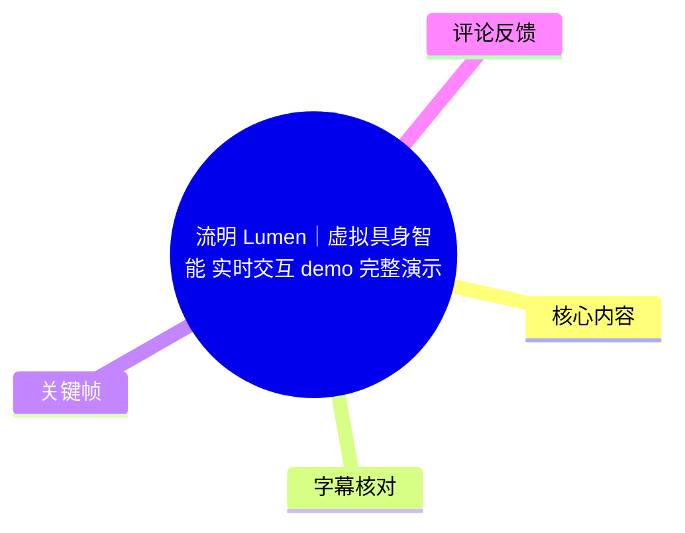
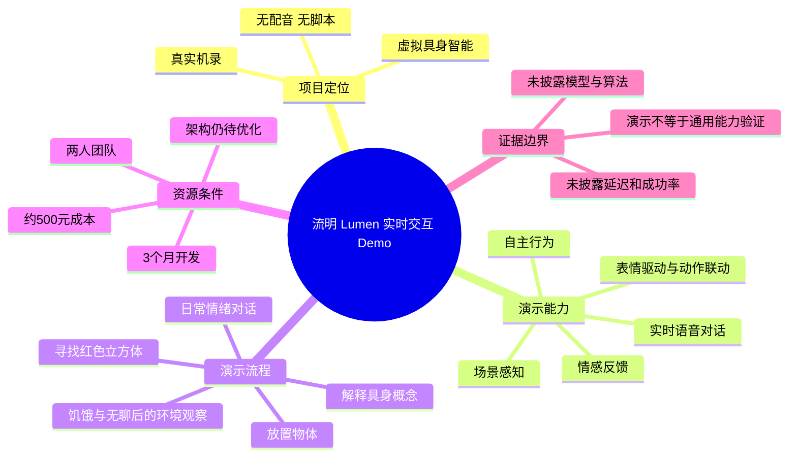
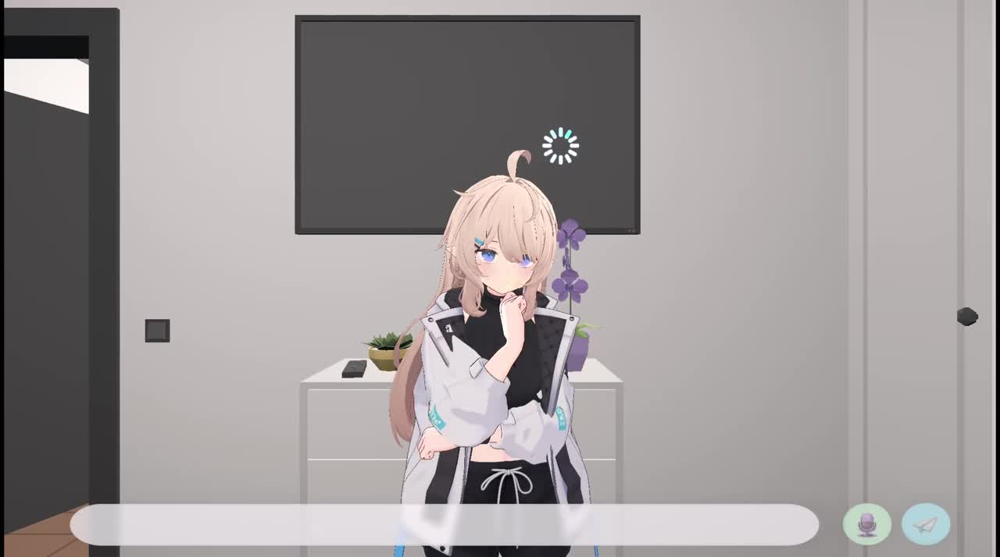
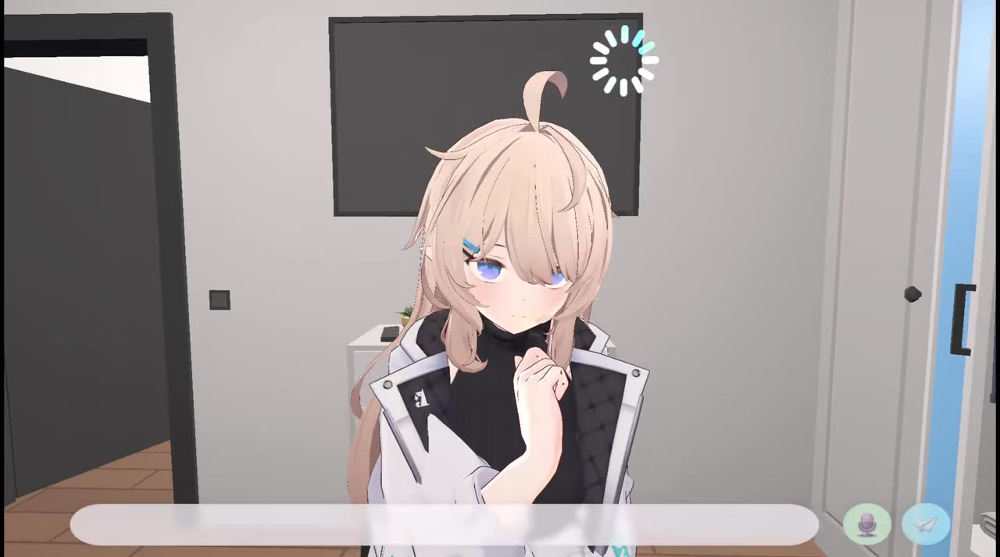
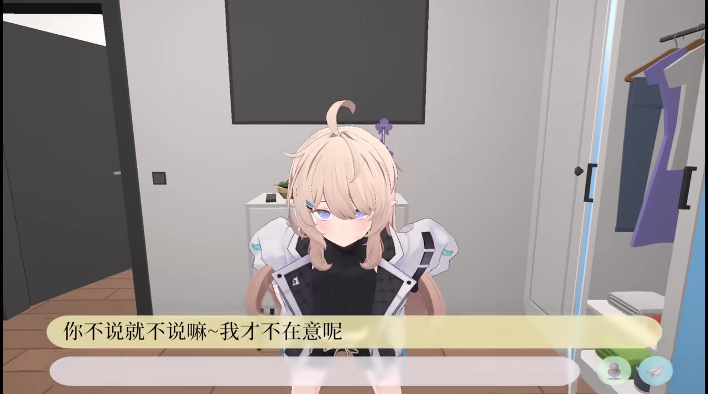
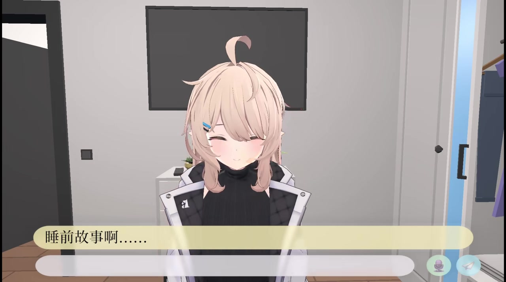

# 流明 Lumen｜虚拟具身智能 实时交互 demo 完整演示

> 来源：[Bilibili 视频](https://www.bilibili.com/video/BV1Wp9EBZEV2)  
> UP 主：流明_Lumen_｜视频时长：4 分 38 秒｜分辨率：1932×1078｜所属收藏：AIcode  
> 元数据发布时间戳为 `1775051772`（约 2026-04-01）；播放量、互动量及项目能力均应以视频抓取时的页面状态和演示版本为准。

## 小结

这是一个**真实机录、无配音、无脚本**的虚拟具身智能交互 Demo。画面中，一名二次元 3D 虚拟角色处于可探索的室内环境，演示了与用户的实时语音式对话、随对话变化的表情与动作，以及根据物体和房间环境作出行动或观察的过程。

视频标题和简介将项目描述为“虚拟具身智能”，并明确列出当前版本的核心功能：**实时语音对话、情感反馈、表情驱动、动作联动、场景感知与自主行为**。实际展示按时间可概括为三段：前半段是带有情绪表达的日常对话；中段是角色解释“不是屏幕里的声音，而是有身体、能被看见、触摸和走动的人”，随后完成寻找门外红色立方体、取回并放置的任务；结尾则出现“有点饿”“有点无聊”等自主状态表达，并主动环顾房间、评价环境。

最重要的信息不在于视频证明了某一项特定算法，而在于它呈现了一个将语言交互、角色动画与场景内行为串联到同一界面的原型。视频**没有公开模型选型、感知管线、世界模型、动作规划、强化学习、延迟、成功率或硬件配置**，因此不能从演示效果反推其使用了深度学习、强化学习或端到端具身模型。

作者在简介中披露了资源约束：项目由**两人团队开发 3 个月，成本约 500 元**；现有架构是资金有限下的“权宜方案”，仍有较大优化空间。这意味着视频适合关注 Unity/AI NPC/二次元实时交互原型的人了解产品形态，不宜据此视为成熟、可规模化部署的具身智能方案。

素材中的日语 ASR 与站内中文字幕大部分时间可相互印证；站内字幕更适合整理中文语义，ASR 更有助于确认原始语音存在及分段。两者都存在个别听写、翻译或措辞不稳定处，尤其是技术概念处应保持审慎。

## 思维导图

## 目录

- [项目背景、范围与时效性](#项目背景范围与时效性-0000)
- [日常对话：情绪、表情与角色动作](#日常对话情绪表情与角色动作-0016)
- [具身概念与物体取放任务](#具身概念与物体取放任务-0208)
- [自主状态与环境观察](#自主状态与环境观察-0350)
- [项目参数、资产声明与实现边界](#项目参数资产声明与实现边界-0000)
- [可复核的交互流程](#可复核的交互流程-0250)
- [关键帧索引](#关键帧索引)
- [字幕比对](#字幕比对)
- [评论分析](#评论分析)
- [结论与限制](#结论与限制)
- [处理记录](#处理记录)

## 项目背景、范围与时效性 [00:00](https://www.bilibili.com/video/BV1Wp9EBZEV2?t=0)

视频简介将该作品定位为“虚拟具身智能实时交互 demo 完整演示”。作者明确强调这是**真实机录演示**，没有额外配音和预设脚本；因此，画面中的对话、角色表情、场景内移动与交互，是作者希望展示的当前版本交互流程，而非剪辑后配音说明片。

从标签可知，该项目处于人工智能、Unity、AI NPC、二次元 AI、游戏开发 Demo 等交叉语境。不过，标签只是发布者归类，不能替代对技术实现的证明。

视频有效时长为 **277.873 秒**（约 4 分 38 秒）。本次 ASR 检测到语音总时长约 **64.88 秒**、语音覆盖率约 **23.35%**，说明成片存在较多无对白或以动作/画面呈现的段落；这些空白并不意味着演示中断，而是需要结合站内字幕和画面理解。

## 日常对话：情绪、表情与角色动作 [00:16](https://www.bilibili.com/video/BV1Wp9EBZEV2?t=16)

站内字幕在 **00:16.580—00:20.160** 显示“晚上好，你回来了”；本次 ASR 于 **00:17.330—00:19.150** 识别到日语“ああ戻ってきたね”，两者都指向角色对用户归来的招呼。这一段构成 Demo 的对话入口。

随后，角色围绕“想听你说有趣的事”“你不说就不说嘛～我才不在意呢”“睡前故事啊……”等内容作出回应。站内字幕给出了连续的中文表达，ASR 也在相近时间检测到对应日语语音：

- **00:38.880—00:45.560**：用户/角色对“有趣的事”的对话回应；
- **00:50.960—00:57.520**：出现“不说不行”“说不说根本不在意”等带有嘴硬或轻微不满意味的台词；
- **01:13.260—01:20.580**：谈到“睡前故事”，并要求届时“好好说”；
- **01:33.349—01:44.700**：角色评论当天购买的物品，并称某件衬衫适合对方，随后表达“感觉更精神了”。

这里能直接观察到的是：角色在不同台词处配合了近景姿态、闭眼笑或前倾等视觉表现，符合作者所称“情感反馈、表情驱动、动作联动”的展示方向。但视频未给出情绪状态如何计算、表情是否由规则/动画状态机驱动、动作是否实时生成等实现信息。

> 图：该帧展示角色位于室内场景中央，底部有文本输入/显示区域，右下角可见麦克风与发送样式按钮。它有助于辨认该 Demo 的交互形态：角色、场景和输入界面被置于同一画面中；但单帧不能证明语音识别、对话模型或网络调用的具体机制。

> 图：该帧突出角色面部与手部姿态，背景仍为同一室内环境。其价值在于展示视频并非只呈现文字聊天窗口，而是将角色表情和动作作为交互反馈的一部分。

> 图：画面文字与站内字幕 **00:50.960—00:57.520** 的内容相呼应。它是“语言内容—情绪化台词—角色姿态”同步呈现的直接画面证据；不过，无法仅凭该帧判断动作由何种算法生成。

> 图：该帧对应站内字幕中 **01:13.260** 开始的“睡前故事”话题，展示角色以闭眼微笑配合台词。它支持“表情与对话联动”的现象描述，但不支持对底层表情控制技术作进一步断言。

## 具身概念与物体取放任务 [02:08](https://www.bilibili.com/video/BV1Wp9EBZEV2?t=128)

### 角色对“具身”的口头解释 [02:08](https://www.bilibili.com/video/BV1Wp9EBZEV2?t=128)

在 **02:08.119—02:23.860**，站内字幕将角色表述转写为：具身智能“不只是屏幕里的声音”，而是“有身体、能看见、能触摸、走动的那个人”，并以“像我这样高性能的”收束。ASR 在 **02:09.040—02:23.920** 检测到同一段日语语音，虽然其中有词形不完整和疑似误识别，但“不是仅在屏幕中的声音”“有身体”“看得见、可触摸、能走动”等核心语义与站内字幕一致。

需要区分两层含义：

1. **视频明确展示/陈述的层面**：角色存在于 3D 室内场景中，作者以角色口吻强调视觉呈现、可移动性和可与环境交互的形态。
2. **不能由视频确认的层面**：是否具备机器人意义上的物理身体、真实触觉传感器、通用环境建模或开放世界行动能力。当前画面呈现的是虚拟场景中的具身交互，而不是实体机器人演示。

### 红色立方体：从指令到取放 [02:50](https://www.bilibili.com/video/BV1Wp9EBZEV2?t=170)

物体任务的可复核时间线如下：

| 时间段 | 站内字幕/ASR 可确认内容 | 可得出的谨慎结论 |
| --- | --- | --- |
| [02:50.640](https://www.bilibili.com/video/BV1Wp9EBZEV2?t=170) — [02:53.440](https://www.bilibili.com/video/BV1Wp9EBZEV2?t=173) | 站内字幕：“好，给你看”；ASR：“見せてあげるね”（给你看）。 | 角色进入展示或响应任务的阶段。 |
| [02:57.340](https://www.bilibili.com/video/BV1Wp9EBZEV2?t=177) — [03:03.460](https://www.bilibili.com/video/BV1Wp9EBZEV2?t=183) | “门外有红色立方体”“我去取”；ASR 同样识别到门外、红色立方体及“我去取”的语义。 | 视频明确将目标物设定为门外的红色立方体，并宣告取物行为。 |
| [03:05.580](https://www.bilibili.com/video/BV1Wp9EBZEV2?t=185) — [03:07.380](https://www.bilibili.com/video/BV1Wp9EBZEV2?t=187) | “在右边看到了”。 | 角色报告目标位置在右侧；这是一条场景定位结果的口头输出。 |
| [03:09.580](https://www.bilibili.com/video/BV1Wp9EBZEV2?t=189) — [03:11.060](https://www.bilibili.com/video/BV1Wp9EBZEV2?t=191) | “结束了”。 | 站内字幕记录任务完成式反馈，但未披露完成判定条件。 |
| [03:36.360](https://www.bilibili.com/video/BV1Wp9EBZEV2?t=216) — [03:39.480](https://www.bilibili.com/video/BV1Wp9EBZEV2?t=219) | “知道了，放这里”。 | 角色/系统对放置位置作出确认。 |

这是视频中最接近“感知—行动—任务完成”的演示段落。它表明系统至少将“红色”“立方体”“门外”“右边”“取”和“放置”等自然语言/场景关系组织成了可展示的交互流程。

但以下问题未被素材回答：红色立方体是否通过视觉模型检测、是否是 Unity 场景中预先注册的对象、右侧定位是否由导航网格或固定触发器实现、抓取动作是否为预设动画，以及失败时会如何恢复。因此，这一段应被记为**任务演示证据**，而不是“世界模型”或“强化学习控制”的证据。

## 自主状态与环境观察 [03:50](https://www.bilibili.com/video/BV1Wp9EBZEV2?t=230)

物体任务之后，角色出现多条看似不由用户立即指令触发的状态表达。视频简介称其包含“自主行为”，以下时间轴是这一主张在成片中的对应展示：

- [03:50.500](https://www.bilibili.com/video/BV1Wp9EBZEV2?t=230) — [03:52.780](https://www.bilibili.com/video/BV1Wp9EBZEV2?t=232)：站内字幕“有点饿了”；ASR 识别到“ちょっと腹減った”（有点饿）。
- [03:56.380](https://www.bilibili.com/video/BV1Wp9EBZEV2?t=236) — [03:59.780](https://www.bilibili.com/video/BV1Wp9EBZEV2?t=239)：站内字幕“找找看”“有什么吗”；ASR 同样有“探してみるか、何かあるかな”的近似表达。
- [04:10.840](https://www.bilibili.com/video/BV1Wp9EBZEV2?t=250) — [04:14.440](https://www.bilibili.com/video/BV1Wp9EBZEV2?t=254)：站内字幕“有点无聊啊”。
- [04:16.560](https://www.bilibili.com/video/BV1Wp9EBZEV2?t=256) — [04:19.200](https://www.bilibili.com/video/BV1Wp9EBZEV2?t=259)：“看看周围吧”。
- [04:20.270](https://www.bilibili.com/video/BV1Wp9EBZEV2?t=260) — [04:24.550](https://www.bilibili.com/video/BV1Wp9EBZEV2?t=264)：角色评价周围“虽然有点脏，但挺时尚的”。
- [04:26.000](https://www.bilibili.com/video/BV1Wp9EBZEV2?t=266) — [04:33.320](https://www.bilibili.com/video/BV1Wp9EBZEV2?t=273)：角色评论窗帘整齐，并称转了一圈后心情舒畅。

这段提供的可见事实是：角色会产生“饿”“无聊”等拟人化语言表达，继而提议查看环境，并对环境中可见元素给出描述或评价。作者将此归入“自主行为”和“场景感知”。

不过，“自主”可能涵盖预先设置的状态机、计时触发、提示词驱动、规则系统或其他机制。由于没有源码、日志、触发条件、状态转移图和重复测试，无法判断这些行为是否持续自主地产生，也无法评估其在未见场景中的泛化能力。

## 项目参数、资产声明与实现边界 [00:00](https://www.bilibili.com/video/BV1Wp9EBZEV2?t=0)

### 作者公开参数

| 项目 | 视频简介明确披露的信息 |
| --- | --- |
| 团队规模 | 两人 |
| 开发周期 | 3 个月 |
| 成本 | 约 500 元 |
| 演示形式 | 真实机录、无配音、无脚本 |
| 当前架构 | 资金有限条件下的权宜方案 |
| 优化状态 | 作者明确称仍有巨大优化空间 |
| 标注核心功能 | 实时语音对话、情感反馈、表情驱动、动作联动、场景感知、自主行为 |
| 画面环境 | 室内虚拟场景中的二次元 3D 角色与交互界面 |
| 视频时长 | 278 秒（元数据）/ 277.873 秒（ASR 音频时长检测） |

### 资产、音乐与使用范围声明

作者在简介中说明：

- 团队尚未成立工作室或公司，项目为个人使用，并称符合作者授权使用范围；
- 项目使用的模型资产原名为 **Nayu**，为作者自费购买，并称遵守作者“ぷらすわん”的授权使用范围；
- 其余美术资产亦为自费购买；
- 使用的音乐为许可商用音乐，简介标注 BGM 作者为“黑耀耀_officialてす”，选取曲目为《行走的钱包》《富有的日常》。

这些内容属于作者自述的授权与购买声明。本整理不对授权的法律有效性、资产许可证具体条款或音乐商用范围作独立核验。

### 视频未公开的关键技术参数

以下是评论和研究者可能关心、但视频及给定素材没有说明的内容：

- 使用了哪些语言模型、语音识别、语音合成或视觉模型；
- 是否使用深度学习、强化学习、世界模型或行为树；
- 目标物识别、空间关系判断、寻路、抓取和放置分别由哪些模块实现；
- Unity 项目版本、渲染管线、角色控制器和动画系统；
- 端到端响应延迟、帧率、网络依赖、硬件配置与单次推理成本；
- 多轮记忆长度、长期任务规划能力、异常恢复和失败率；
- 任务是否由固定场景、预标注物体或预设交互点支持。

因此，任何将该视频直接概括为“已验证世界模型”“已使用强化学习”或“具备长期规划”的结论，均超出了现有素材。

## 可复核的交互流程 [02:50](https://www.bilibili.com/video/BV1Wp9EBZEV2?t=170)

如果把视频按可复现的产品演示顺序整理，可得到如下流程；这是对视频内**展示步骤**的归纳，不是底层工程实现步骤。

1. **进入角色交互界面**  
   画面显示虚拟角色站在室内环境中，底部有用于交互的长条区域，右下角有麦克风和发送样式图标。  
   适用场景：以角色化界面承载对话，而不是单独的聊天窗口。

2. **进行日常自然语言对话**  
   从 [00:16](https://www.bilibili.com/video/BV1Wp9EBZEV2?t=16) 起，角色回应“回来了”、有趣的事、睡前故事和衣物评价等日常话题。  
   可观察结果：台词伴随面部表情和姿态变化。

3. **用语言说明角色的“可行动”定位**  
   在 [02:08](https://www.bilibili.com/video/BV1Wp9EBZEV2?t=128) 左右，角色将自身描述为不只是屏幕中的声音，而是能看见、触摸和走动的存在。  
   可观察结果：视频主动将对话能力与场景中可移动的角色形态关联。

4. **提出/接收物体目标并执行取物**  
   在 [02:57](https://www.bilibili.com/video/BV1Wp9EBZEV2?t=177)，目标被描述为“门外的红色立方体”；角色称将去取，并在 [03:05](https://www.bilibili.com/video/BV1Wp9EBZEV2?t=185) 报告“在右边看到了”。  
   可观察结果：语言中包含对象属性、相对位置和行动意图。

5. **完成放置确认**  
   在 [03:36](https://www.bilibili.com/video/BV1Wp9EBZEV2?t=216)，字幕显示“知道了，放这里”。  
   可观察结果：流程包含对放置位置的确认性反馈。

6. **以内部状态语言触发环境观察**  
   在 [03:50](https://www.bilibili.com/video/BV1Wp9EBZEV2?t=230) 后，角色表达饿、寻找食物、无聊、查看周围，并对场景清洁度、风格和窗帘作出评价。  
   可观察结果：视频尝试展示角色从状态表达过渡到环境观察与评论。

### 使用该流程时的前置条件与限制

- 演示位于作者构建的特定虚拟室内环境中，不能据此外推至陌生场景。
- 角色语言为日语语音，站内提供中文译字幕；中文文本的个别细节与 ASR 原文并非逐字一致。
- 取物段落的完整画面行为未由字幕逐帧解释，不能仅凭“找到了”“结束了”认定其具有通用视觉抓取能力。
- 视频无失败案例、重复实验、性能面板或算法日志，无法量化鲁棒性。

## 关键帧索引

| 关键帧 | 正文位置 | 画面价值 |
| --- | --- | --- |
| `frames/frame-001.jpg` | 日常对话开端 | 展示角色处于室内 3D 环境、底部交互栏与右下角输入控制，说明产品界面形态。 |
| `frames/frame-002.jpg` | 日常对话开端 | 以角色近景呈现面部和手部姿态，辅助理解“表情/动作反馈”是演示重点之一。 |
| `frames/frame-003.jpg` | “不在意”对话 | 画面直接显示中文台词，并与角色前倾姿态同屏，适合说明语言和角色表现的结合。 |
| `frames/frame-004.jpg` | “睡前故事”对话 | 显示“睡前故事啊……”文本和闭眼微笑表情，适合说明情绪化对话的视觉反馈。 |

给定素材列出了 `frame-001.jpg` 至 `frame-012.jpg` 共 12 张关键帧路径，但本次可见的多模态画面仅提供前 4 张的实际图像内容。为避免臆测其余帧的具体画面，正文只引用了已可直接核验的前 4 张。

## 字幕比对

| 字幕来源 | 完整性 | 专有名词/技术词 | 时间轴 | 主要问题 |
| --- | --- | --- | --- | --- |
| Bilibili 站内字幕 `p01-ai-zh.srt` | 覆盖 00:16—04:33 的主要发言，共 35 条分段；涵盖对话、具身说明、红色立方体任务与环境观察。 | “嵌入式智能”出现在 02:08 段，与标题中的“虚拟具身智能”用词不一致，不能据此确认正式术语。 | 分段细，起止时间可直接使用。 | 为中文翻译字幕，部分措辞与日语 ASR 并不逐字对应；如衣物颜色/描述等细节存在翻译概括。 |
| 本次 ASR `medium` | 检出 14 段、64.88 秒语音，覆盖率 23.35%；确认视频有日语音轨。 | 在“インテリジェンス”等技术相关语句中出现断裂或误识别，无法单独作为术语依据。 | 具备时间戳；与站内字幕大体对齐，通常存在约 0—2 秒级边界差异。 | 识别语言为日语，概率 0.9712；存在断词、漏词和语义不完整，如“ちょっと腹減った探”“あわりをぐるっと见てみる”等。 |

### 最终字幕选择与校正原则

本次整理以**站内中文字幕作为中文叙事主文本**，以**本次日语 ASR 作为语音存在、原语言和时间段的交叉验证**。原因如下：

1. 站内字幕的中文可直接表达视频语义，且在红色立方体、放置位置、环境评价等段落中分段较完整。
2. ASR 确认音轨实际语言为日语，并与站内字幕的大部分语义和时序对应，未出现“站内字幕完全脱离语音”的迹象。
3. ASR 仅覆盖约四分之一时长，且多处存在日语断词；它不适合作为中文逐字转写的唯一来源。
4. “嵌入式智能/具身智能”等概念表述存在不稳定性。本文仅记录字幕原文和作者标题，不将其擅自校正为某一种技术定义。

ASR 诊断中**没有** `noAudioStream=true` 标记；相反，检测到 14 个日语语音片段，因此本视频并非无音轨视频。

## 评论分析

以下仅处理可获取热评前三条。评论体现的是观众观点或建议，不构成项目技术事实。

### 1. 对感知、决策与动作实现的追问

- 评论者：光纤Ray｜获赞：3
- 核心观点：追问哪些部分使用深度学习或强化学习；进一步询问物体感知是否采用世界模型、动作决策与动作本身哪些是预设，并指出具身智能的难点在动作、决策大模型的难点在长期决策。
- 价值：该评论准确指出本视频没有公开的技术拆解维度——感知、决策、动作执行，以及长期决策。它与视频的证据边界一致。
- 可信度判断：评论提出的是问题和一般性判断，不是对该项目实现的证实。素材中没有作者回复，也没有足以验证“世界模型”“强化学习”或“长期决策”的信息。

### 2. 对项目发展前景的鼓励

- 评论者：账号已注销｜获赞：2
- 核心观点：“无名小卒，还是名扬天下”，以调侃式表达鼓励。
- 价值：反映部分观众对小团队项目的正面期待。
- 可信度判断：这是一条态度型评论，不补充技术、商业或产品事实，也不存在可核验的论据。

### 3. 对新鲜感与成本支持的建议

- 评论者：yufuyufu｜获赞：1
- 核心观点：认为当前演示尚未充分体现“新鲜感”；建议申请 AI 创业扶持，称一些地方政府可能提供 Token 补贴，并指出 Token 也是成本。
- 价值：补充了两个现实问题：产品展示的差异化，以及大模型调用可能带来的持续成本。
- 可信度判断：视频仅公开“约 500 元成本”，没有说明是否调用 Token、调用规模或地区扶持资格；“地方政府都会送 Token 补贴”属于评论者经验性建议，不能视作普遍政策事实，实际申请条件需逐地核查。

## 结论与限制

该视频最清楚地展示了一个虚拟角色交互原型的产品方向：将日常对话、拟人化表情/动作、场景物体任务和环境评论整合在一个 Unity 风格的室内 3D 场景中。对希望设计 AI NPC、陪伴型虚拟角色或游戏内实时交互体验的人而言，视频提供了一个可观察的交互流程参考。

可迁移的产品经验包括：

- 不把 AI 限定为文本框或悬浮语音，而是让其以角色身体、表情、姿态和场景位置参与交互；
- 将对话内容和环境任务串联，例如从“门外红色立方体”到寻找、取回、放置；
- 让角色在任务之外表达状态并观察环境，以增加持续存在感；
- 在资源有限时，先完成完整的端到端可展示闭环，再迭代架构与性能。

但技术结论必须严格收敛：视频没有披露模型、数据、算法、系统架构、性能指标或测试条件；它能证明的是作者录制了一个当前版本的交互 Demo，不能证明通用具身能力、真实触觉、世界模型、强化学习控制、长期规划能力或生产级稳定性。

时效性方面，作者已说明当前架构是资金有限下的权宜方案且仍待优化。该结论反映的是视频所展示版本，不应自动延伸到其后续版本、商业化状态、授权状态或实际部署能力。

## 处理记录

- Worker ID：`worker-mrj0wjed-b0c290ad`
- 模型：`gpt-5.6-terra`
- 任务素材：Bilibili 元数据、视频素材清单、站内字幕 `p01-ai-zh.srt`、本次 ASR 结果与 SRT、关键帧路径、可获取热评前三条。
- 调用/使用的工具结果：本次 ASR 模型为 `medium`，运行设备为 `cuda`，计算类型为 `float16`；输入音频为 `audio/audio.wav`；关键帧目录为 `frames/`。
- 字幕选择：以站内中文字幕为中文正文依据；逐段对照本次日语 ASR 的时间戳和语义。ASR 检测到日语音轨，未标记 `noAudioStream=true`。
- 关键帧选择依据：仅使用已提供实际可见画面的 `frames/frame-001.jpg` 至 `frames/frame-004.jpg`；分别对应交互界面、角色近景、“不在意”台词和“睡前故事”台词。其余关键帧虽有路径但未提供可核验画面，未作内容性引用。
- 缓存清理：给定素材未提供缓存清理执行日志；本整理未虚构已删除的文件或目录。素材中列出的 `merged.mp4`、`audio/`、`frames/`、`asr/`、`subtitles/` 和 `comments/` 仍按任务输入记录处理。
- 未解决问题：底层感知、动作、决策、语音和模型架构未公开；红色立方体任务的实现方式、失败处理、响应时延、稳定性与泛化能力均无法由现有素材确认。
