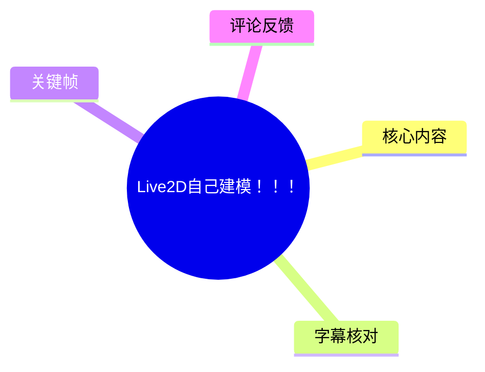
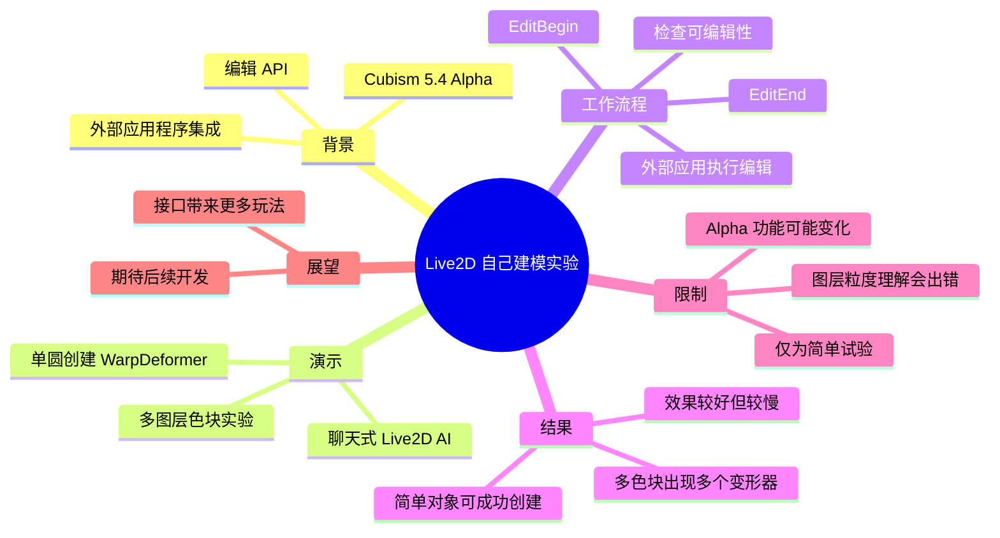
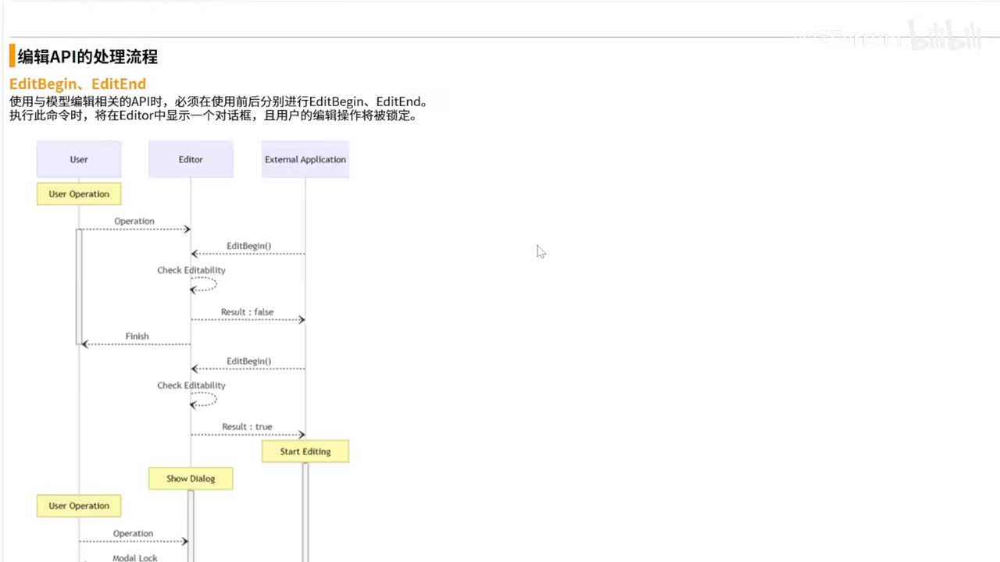
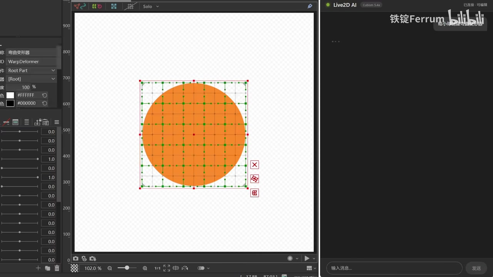
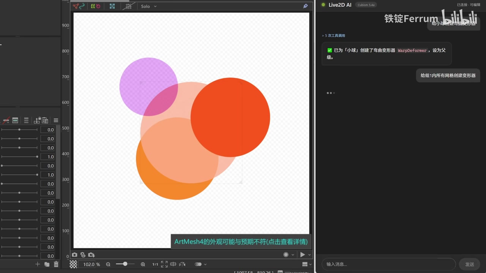

# Live2D自己建模！！！

> 来源：[Bilibili 视频](https://www.bilibili.com/video/BV1VyN86pENy) 
> UP 主：铁锭Ferrum｜发布时间：2026-07-15｜视频时长：02:10｜合集：AIcode  
> 视频简介提供的官方链接：[Cubism 5.4 Alpha 相关信息](https://www.live2d.com/zh-CHS/information/cubism-5_4-alpha/)

## 小结

视频展示了 Live2D Cubism 5.4 Alpha 中可由外部应用程序驱动编辑器的能力，并以一个名为“Live2D AI”的聊天式界面进行了简短实验。UP 主认为这是“盼望已久”的功能：外部程序理论上可以通过接口向 Cubism 发起建模/编辑操作。

演示从简单图形开始：AI 在 Cubism 画布中为单个圆形创建了网格变形器（WarpDeformer）。随后，UP 主尝试要求其“每个图层建一个”，但 AI 将多个图层整体框选后只建成一个对象，说明自然语言意图与实际图层粒度之间仍可能发生偏差。

视频中的正面结果是：AI 成功针对多个独立色块创建了对应的变形器，UP 主评价“效果挺好的”；同时也明确指出生成或执行过程“慢了点”。因此，这不是“一句话完成可交付 Live2D 模型”的证明，而是外部接口已能把部分重复编辑动作交给程序驱动的早期演示。

技术上，画面展示的官方文档强调编辑 API 的事务边界：涉及模型编辑的 API 调用前后需要分别执行 `EditBegin` 与 `EditEnd`。该流程意味着外部工具并非可随时无约束地修改模型，而要先确认编辑器是否允许编辑，并在编辑会话中执行操作。

适合关注 Live2D 自动化、AI Agent、MCP/外部应用集成以及建模流程提效的读者。需要注意，视频对应的是 **Cubism 5.4 Alpha** 阶段能力，且样例仅覆盖圆形色块与变形器创建；复杂角色拆件、参数绑定、物理、表情及成品质量均未在视频中验证。

## 思维导图

## 目录

- [背景：Cubism 5.4 Alpha 与外部编辑能力](#背景cubism-54-alpha-与外部编辑能力)
- [官方 API 编辑流程](#官方-api-编辑流程)
- [演示一：单个圆形与网格变形器](#演示一单个圆形与网格变形器)
- [演示二：图层粒度误解与多图层结果](#演示二图层粒度误解与多图层结果)
- [可复现的操作链与适用边界](#可复现的操作链与适用边界)
- [结论、限制与时效性](#结论限制与时效性)
- [字幕比对](#字幕比对)
- [评论分析](#评论分析)
- [处理记录](#处理记录)

## 背景：Cubism 5.4 Alpha 与外部编辑能力 [00:00](https://www.bilibili.com/video/BV1VyN86pENy?t=0)

视频开场，UP 主表示 Live2D 这次“真得夸夸”，称自己期待已久的功能“终于端上来了”。结合视频简介中的官方链接、画面中的 Alpha 下载页，以及后续出现的 API 文档，可确认视频关注的是 **Live2D Cubism 5.4 Alpha 的外部应用程序集成功能**。

画面中的官方页面提供：

- Alpha 版下载链接；
- Alpha 版使用手册；
- `Cubism Editor 使用手册`；
- `外部应用程序集成使用手册`；
- `Cubism Core 使用手册`；
- `Cubism SDK 使用手册`。

> 图：画面列出 Alpha 下载页及多份手册，其中“外部应用程序集成使用手册”直接说明本次能力并非普通编辑器功能更新，而是面向外部程序的集成接口。这为后续聊天式 AI 操作 Cubism 提供背景。

视频未展示 Alpha 的安装过程、版本号完整字符串、接口调用代码或授权条件，因此这些内容不能从本片进一步确认。标签中虽包含 Claude Code、MCP、DeepSeek，但视频画面与口播并未明确说明具体由哪一个模型或工具链驱动，不能据此断言其实现方案。

## 官方 API 编辑流程 [00:06](https://www.bilibili.com/video/BV1VyN86pENy?t=6)

约 00:06 起，视频展示“编辑 API 的处理流程”文档。画面可读到的核心规则是：

> 使用与模型编辑相关的 API 时，必须在使用前后分别进行 `EditBegin`、`EditEnd`。  
> 执行命令时，将在 Editor 中显示一个对话框，且用户的编辑操作将被锁定。

流程图中涉及三方：

1. **User（用户）**：原本可在 Editor 中执行操作。
2. **Editor（Cubism 编辑器）**：接收或协调编辑状态。
3. **External Application（外部应用程序）**：请求并执行模型编辑操作。

从图中可见的关键控制点包括：

- 外部应用调用 `EditBegin()`；
- Editor 检查是否可编辑（`Check Editability`）；
- 若结果为 `false`，流程结束或无法进入编辑；
- 若结果为 `true`，外部应用进入编辑状态（`Start Editing`）；
- 编辑器展示对话框，同时用户操作受到锁定；
- 外部应用完成编辑后，应通过 `EditEnd` 结束编辑会话。

> 图：该流程图是理解视频技术前提的关键帧。它表明外部 AI 不是直接绕过编辑器修改文件，而是在编辑器许可的编辑事务中操作；可编辑性检查、用户锁定和 `EditBegin`/`EditEnd` 构成明确的控制边界。

### 视频可确认的接口约束

| 项目 | 视频画面可确认的内容 | 含义 |
| --- | --- | --- |
| 编辑开始 | `EditBegin` | 外部程序开始模型编辑前需要调用。 |
| 编辑结束 | `EditEnd` | 编辑相关调用完成后需要调用。 |
| 可编辑性 | `Check Editability` | 编辑器会判断当前是否能接受外部编辑。 |
| 用户操作 | 编辑期间显示对话框并锁定用户编辑操作 | 避免用户与外部程序同时改动同一模型。 |
| 外部调用者 | External Application | AI 聊天界面可被视为外部应用的一种前端形态，但视频未公开其具体实现。 |

## 演示一：单个圆形与网格变形器 [00:13](https://www.bilibili.com/video/BV1VyN86pENy?t=13)

约 00:13，UP 主称“随便做了一个试试，让我们看看效果”，随后画面切换至 Cubism 编辑器与右侧“Live2D AI”对话界面。

约 00:24，左侧 Cubism 画布中的橙色圆形被选中，并显示规则网格；左侧属性区域可见：

- 对象名称：`弯曲变形器`；
- ID：`WarpDeformer`；
- 所属层级：`Root Part`；
- 网格控制点覆盖圆形所在区域。

右侧“Live2D AI”界面显示其已连接、可编辑，说明演示中的外部界面能够请求编辑器执行实际操作，而不只是生成文字建议。

> 图：橙色圆形周围出现的网格和左侧 `WarpDeformer` 属性，是“外部指令已经落到 Cubism 模型对象上”的直接视觉证据。相比仅有聊天回复，这一帧能验证编辑器中的实际产物。

UP 主在约 00:29 感叹“也是只用动嘴就能建模的时代到来了吗”，这里的“动嘴”是对自然语言驱动编辑的概括。就视频证据而言，已经完成的是**对简单对象创建变形器**，而非完整角色建模流程。

## 演示二：图层粒度误解与多图层结果 [00:39](https://www.bilibili.com/video/BV1VyN86pENy?t=39)

约 00:39，UP 主指出 AI 的一次执行偏离了要求：

> “不是，我是要你每个图层建一个，你怎么全框起来建一个哦。”

这句话明确反映了一个关键问题：当画面中存在多个图层或多个可选对象时，AI 可能将其作为整体范围处理，而不是逐层创建对象。约 00:48，UP 主以“果然还是人工智能”调侃这一失误。

随后，视频展示了多个半透明或不透明圆形色块组成的画面。右侧界面中可读到执行反馈：

- “已为「小球」创建了弯曲变形器 `WarpDeformer`，设为父级。”
- 提供了“给组1内所有网格创建变形器”的操作入口。

约 01:05，UP 主评价：“效果挺好的，就是慢了点。”这同时给出了成功性和效率两方面的经验判断。

> 图：多个不同颜色、相互重叠的圆形保留了各自的视觉范围，右侧出现已创建 `WarpDeformer` 的反馈及批量创建入口。这一帧适合说明：简单多对象场景可以获得可用结果，但需要警惕“按组”与“逐图层”之间的目标差异。

### 经验归纳：自然语言操作需要明确对象范围

从这一正反两次演示，可以得到以下**仅限于本片样例**的实践建议：

1. **先确认选区、组与图层层级。**  
   “每个图层”是粒度要求；若外部程序把多个对象框选为一个范围，就可能只创建一个整体变形器。

2. **将批量操作与逐对象操作区分表达。**  
   画面中出现“给组1内所有网格创建变形器”，这是以“组”为单位的批量动作；它不必然等价于“每一个图层各建一个”。

3. **执行后必须回到 Cubism 检查结果。**  
   应检查网格、层级归属、`WarpDeformer` 的创建数量和覆盖范围。视频中正是通过画布与属性面板发现了整体框选的偏差。

4. **为执行时间留出预期。**  
   UP 主明确感受到速度较慢。视频没有提供耗时秒数、硬件配置、模型规模或 API 性能数据，因此无法量化这一限制。

## 可复现的操作链与适用边界 [02:00](https://www.bilibili.com/video/BV1VyN86pENy?t=120)

视频结尾，UP 主总结：

> “理论上只要有了接口就有无限种玩法。我这里只是简单试了试，期待各路大佬后续的开发好玩。”

结合画面，可以整理出一条不超出视频证据范围的操作链：

1. **使用包含外部程序集成能力的 Cubism 5.4 Alpha 环境。**  
   视频展示了 Alpha 下载与手册入口，但没有演示安装和配置。

2. **准备一个可编辑的 Cubism 模型/画布对象。**  
   样例使用的是单个或多个圆形色块，而不是完整角色立绘。

3. **通过外部应用发起编辑请求。**  
   视频所示前端是“Live2D AI”聊天界面；其具体模型、协议、代码与部署方式未公开。

4. **由编辑器进入受控编辑状态。**  
   按文档画面，应在编辑前调用 `EditBegin`，并通过可编辑性检查；编辑期间会锁定用户编辑操作。

5. **让外部应用执行具体模型编辑。**  
   视频可确认的具体结果是创建 `WarpDeformer`，包括针对单个圆形以及多色块/组的尝试。

6. **在编辑器内核验对象范围与结果。**  
   特别检查是否错误把多个图层合并为一个对象处理。

7. **结束编辑会话。**  
   按文档要求，操作后调用 `EditEnd`；视频未展示实际调用日志或代码。

### 本片未覆盖的关键环节

- 从 PSD/原画自动拆件；
- 角色面部、头部、身体等复杂网格的自动生成质量；
- 参数创建与关键形状绑定；
- 物理、动作、表情、导出与运行时验证；
- 失败重试、撤销策略、冲突恢复；
- 外部应用的模型选择、提示词、MCP 配置或源码；
- Alpha 版本的系统要求、许可方式与稳定性。

因此，不能将本片外推为“AI 已能自动完成全部 Live2D 建模”。更准确的表述是：视频展示了一个由外部 AI 界面触发、并在 Cubism 内生成简单变形器对象的可行性样例。

## 结论、限制与时效性 [01:42](https://www.bilibili.com/video/BV1VyN86pENy?t=102)

视频的核心价值不在于展示一套完整教程，而在于确认一个新的自动化入口：当 Cubism 编辑能力能够以受控 API 方式暴露给外部应用后，AI Agent、脚本和其他工具可以参与部分编辑流程。

UP 主认为这种接口会带来“很多玩法”乃至“无限种玩法”。这是对生态可能性的主观展望，而不是对当前功能覆盖范围的量化结论。已被视频直接演示的能力仅包括：外部界面连入编辑器、创建弯曲变形器、处理简单图形，以及在多图层目标理解上出现一次偏差。

### 限制清单

| 类型 | 本片证据 |
| --- | --- |
| 功能成熟度 | 页面与视频均指向 Cubism 5.4 Alpha，属于预发布阶段。 |
| 意图理解 | “每个图层建一个”被错误处理成整体框选创建一个。 |
| 性能 | UP 主评价“慢了点”，但没有性能指标。 |
| 样例复杂度 | 仅展示圆形色块和 `WarpDeformer`，未展示完整角色建模。 |
| 可复现性 | 未公开外部应用的代码、模型、提示词、配置及安装步骤。 |
| 版本时效 | 视频发布于 2026-07-15；Alpha 功能、接口名称、权限和行为可能在后续版本中变更。 |

如要将这一方向用于实际生产，应以对应版本的官方“外部应用程序集成使用手册”为准，并在副本模型上进行验证；尤其要为图层选择、批量作用范围和人工复核保留明确流程。

## 字幕比对 [00:00](https://www.bilibili.com/video/BV1VyN86pENy?t=0)

本次同时检查了站内字幕和 ASR 结果。ASR 诊断显示音频存在，识别语言为中文，音频时长约 **129.08 秒**，并未标记 `noAudioStream=true`；因此不存在“源视频没有音轨”的情况。

| 字幕来源 | 完整性 | 专有名词 | 时间轴 | 主要问题 |
| --- | --- | --- | --- | --- |
| Bilibili 站内字幕 | 覆盖主要口播，另含若干难以辨识的片段 | `live2D` 基本正确；未呈现画面中的 `WarpDeformer`、`EditBegin` 等术语 | 分段更细，例如 00:00:00.140–00:00:03.860 | 约 00:32–00:38、00:54–01:02、01:13–01:35 等处存在明显乱码或非语义文本。 |
| 本次 ASR 字幕 | 共 10 段，口播覆盖约 34.28 秒，覆盖率约 26.56% | `Live2D` 正确；将 `WarpDeformer` 等未被口播的画面术语自然遗漏 | 时间戳稳定，首段 00:00:00.050–00:00:03.490，末段至 00:02:08.900 | 个别识别错误，如“断上来”“人工质素”“我挺好的”；在音乐、演示操作及无明确口播处留有较大空档。 |

### 最终字幕使用原则

- **时间轴定位**：优先采用站内 SRT 的细分时间；正文链接均按其起止时间换算为秒。站内字幕缺失或明显不完整处，以本次 ASR 的对应时间校验。
- **文本校正**：以两份字幕的共同部分为主，并结合画面校正明显错误。  
  - ASR “终于断上来”校正为“终于端上来了”；  
  - ASR “人工质素”校正为“人工智能”；  
  - ASR “我挺好的”校正为“效果挺好的”；  
  - `WarpDeformer`、`EditBegin`、`EditEnd`、`Check Editability` 来自关键帧中的界面/文档可见文字，而非凭空补全。
- **无法可靠转写的内容**：站内字幕中多段无意义音节未作为事实性文字采纳；它们不影响视频关于接口、变形器效果与速度评价的核心信息。

## 评论分析

未能获取可供分析的热评。素材处理告警显示评论工具进程以代码 `3221226505` 退出，且提供的热评数据为空 `{}`。

因此，本节不补写、猜测或将普通互动数据视为评论观点；可获取热评前三条为 **0 条**。

## 处理记录

- Worker ID：`worker-mrj0wjed-b0c290ad`
- 主模型：`gpt-5.6-terra`
- ASR 模型：`medium`，运行环境为 CUDA / `float16`，识别语言为中文（置信度 `0.9921875`）。
- 使用的素材与工具产物：视频合并文件、音频 WAV、ASR SRT/JSON、Bilibili 站内 SRT、12 张关键帧目录及已提供的关键帧画面、视频元数据、评论获取结果。
- 字幕选择：以站内字幕的细粒度时间段作为主要时间轴，以本次 ASR 交叉核对口播；对两者的明显识别错误结合画面进行校正。ASR 检查确认音轨存在，未出现 `noAudioStream=true`。
- 关键帧选择依据：
  - `frames/frame-001.jpg`：Alpha 下载页与“外部应用程序集成使用手册”入口，说明功能背景；
  - `frames/frame-002.jpg`：`EditBegin`/`EditEnd` 与编辑锁定流程，说明 API 约束；
  - `frames/frame-003.jpg`：单圆对象上的 `WarpDeformer` 网格，验证实际编辑结果；
  - `frames/frame-004.jpg`：多色块和 AI 执行反馈，说明批量/多图层实验及结果。
- 评论处理：仅允许分析可获取热评前三条；本次无可用热评，未进行推断。
- 缓存清理：素材清单未提供缓存清理执行结果；为避免编造，记录为“未提供清理回执，无法确认是否已清理”。
- 未解决问题：外部“Live2D AI”的具体实现、所用模型与协议、可运行配置、复杂角色的建模效果及 Alpha 后续版本变化，均未在提供素材中披露。
