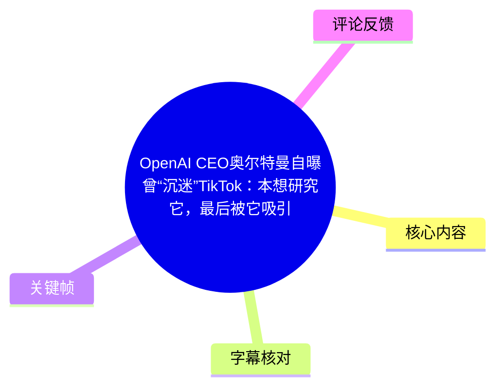
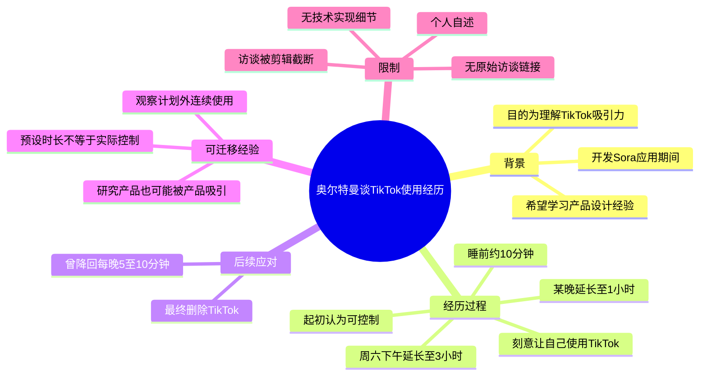
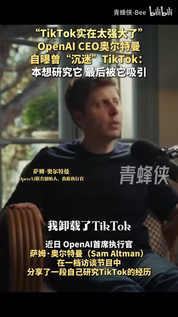
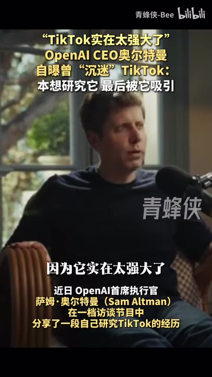

# OpenAI CEO奥尔特曼自曝曾“沉迷”TikTok：本想研究它，最后被它吸引

> 来源：[Bilibili 视频](https://www.bilibili.com/video/BV1uy3Y6rEBS)  
> UP 主：青蜂侠-Bee｜时长：27 秒｜画面规格：1080×1920（竖屏）  
> 标签：人工智能、TikTok、OpenAI、资讯直通车

## 小结

视频剪辑了一段萨姆·奥尔特曼（Sam Altman）的英文访谈片段。其核心说法是：在开发 Sora 应用期间，他曾为理解 TikTok 为何如此吸引用户，刻意让自己使用并“沉迷”TikTok；但实际体验让他意识到，自己对使用时长的控制会逐步失效，因此后来删除了 TikTok。

视频给出的关键过程具有明确的时间量级：奥尔特曼起初认为自己只会在睡前用约 **10 分钟**放松；后来某晚使用到 **1 小时**，又有一个周六下午在沙发上连续使用约 **3 小时**。他一度将使用量降回每晚约 **5—10 分钟**，但片段在其后续感叹处截断，未呈现完整结论。

这段内容的知识价值不在于给出 TikTok 算法或 Sora 产品的技术细节，而在于提供一个来自产品从业者的第一手体验：即使使用者带着“研究产品机制”的明确目的，也可能受到短视频产品的持续吸引。画面中的中文说明进一步将其动机概括为：希望从 TikTok 的产品设计中学习经验。

可迁移的实践经验是，不要仅以“我有明确目的”“我每天只看几分钟”作为自控有效的证据；应关注使用时长是否从预设上限逐渐扩张，以及是否已经出现“计划外长时间连续使用”。不过，这只是个人访谈中的自述案例，不能据此推导 TikTok 对所有人必然具有相同影响，也不能从本视频确认其具体研究方法或 Sora 团队是否将相关经验用于产品设计。

时效性方面，视频元数据发布时间为 2026 年 7 月；视频只呈现了短截取片段，且没有提供原始访谈出处、完整上下文或 TikTok、Sora 的版本信息。因此，“开发 Sora 应用期间”的表述应限于视频和字幕所呈现的说法，不应延展为对当前产品策略的确定性判断。

## 思维导图

## 目录

- [背景与信息边界](#背景与信息边界)
- [核心内容：删除 TikTok 的直接原因](#核心内容删除-tiktok-的直接原因)
- [核心内容：从“可控十分钟”到长时间使用](#核心内容从可控十分钟到长时间使用)
- [核心内容：短暂恢复控制与片段截断](#核心内容短暂恢复控制与片段截断)
- [经验提炼与可执行步骤](#经验提炼与可执行步骤)
- [技术、参数与限制](#技术参数与限制)
- [关键帧索引](#关键帧索引)
- [字幕比对](#字幕比对)
- [评论分析](#评论分析)
- [处理记录](#处理记录)

## 背景与信息边界 [00:00:07](https://www.bilibili.com/video/BV1uy3Y6rEBS?t=7)

视频为竖屏资讯剪辑。开头画面以中文标题概括事件：“TikTok 实在太强大了”“OpenAI CEO 奥尔特曼自曝曾‘沉迷’TikTok：本想研究它，最后被它吸引”。

本次 ASR 在 **00:00:07.420** 开始识别到英文原声；在此之前，现有素材仅能确认存在标题、人物标识和中文导语画面，不能依据文字顺序为其虚构精确的口播时间点。

视频画面标注人物为“萨姆·奥尔特曼 / OpenAI 联合创始人、首席执行官”。英文 ASR 中出现的直接信息包括：

- 他删除了 TikTok；
- 原因是它“太强大了”（`too powerful`）；
- 该经历发生在“开发 Sora 应用时”（`when we were building the Sora app`）；
- 他称自己曾“让自己对 TikTok 上瘾”（`made myself get addicted to TikTok`）；
- 他原本相信自己能够控制使用。

> 图：该关键帧同时呈现中文新闻导语、奥尔特曼受访画面及人物身份标注。它有助于确认本视频的叙事主题和人物指向，但中文导语属于视频制作者的概括，不能替代完整访谈原文。

## 核心内容：删除 TikTok 的直接原因 [00:00:07](https://www.bilibili.com/video/BV1uy3Y6rEBS?t=7)

ASR 第 1 段（00:00:07.420—00:00:08.820）识别到的开场表述为：

> “And I deleted TikTok because it was just, like, too powerful.”

可直译为：“我删除了 TikTok，因为它实在太强大了。”

这里的“强大”是受访者的主观评价，而非视频给出的可量化技术指标。视频没有解释这一判断是指推荐算法、内容供给、交互机制、用户留存指标，还是其他具体产品能力。因此，更严谨的理解是：奥尔特曼认为 TikTok 对其个人注意力和使用行为具有很强的吸引/影响能力。

同一 ASR 段还提到：

> “When we were building the Sora app, I made myself get addicted to TikTok.”

视频画面中的中文说明将其动机解释为：为了弄清 TikTok 为何如此吸引用户，他曾刻意让自己沉迷其中，希望从产品设计中学习经验。该说明与英文中“开发 Sora 应用时”和“让自己上瘾”的内容方向一致，但“研究 TikTok 吸引用户机制”“学习产品设计经验”是剪辑画面提供的中文概括，英文 ASR 片段未详细说明具体研究方案。

> 图：该帧将英文原声中的“too powerful”概括为“因为它实在太强大了”。其价值在于帮助中文读者快速定位受访者删除 TikTok 的直接理由；但“强大”的技术含义在原片段中未被拆解。

## 核心内容：从“可控十分钟”到长时间使用 [00:00:08](https://www.bilibili.com/video/BV1uy3Y6rEBS?t=8)

奥尔特曼随后描述了自己最初对使用边界的判断。ASR 第 2 段（00:00:08.860—00:00:15.140）显示：

> “I thought I could, like, control it.”  
> “I only use it for, like 10 minutes to wind down before bed, and I'm, like totally in control of it.”

其含义是：他起初认为 TikTok 很有趣，但自己只是睡前使用大约 10 分钟放松，并且完全处于掌控之中。

视频给出了一个明显的“预设边界—实际行为”反差：

| 阶段 | 受访者的表述 | 可确认的时长参数 |
| --- | --- | --- |
| 初始判断 | 认为自己能控制使用 | 睡前约 10 分钟 |
| 第一次扩张 | 某个夜晚使用时间拉长 | 约 1 小时 |
| 第二次扩张 | 某个周六下午坐在沙发上持续刷视频 | 约 3 小时 |

在 ASR 第 3 段（00:00:15.140—00:00:19.200）中，他说：

> “And then it was, like an hour one night. And then some Saturday afternoon, I was on my couch for, three hours.”

即：“后来有天晚上变成了大约一个小时；又有一个周六下午，我坐在沙发上（用了）三个小时。”

这不是严谨的行为实验或使用统计，而是受访者回忆的几个典型节点。但它清楚呈现了一个值得警惕的行为信号：当实际使用从预期的 10 分钟，扩展至 1 小时乃至 3 小时，就表明先前设定的时长规则未能稳定约束实际行为。

> 图：该帧的中文画面说明强调“为了弄清楚 TikTok 为何如此吸引用户”而进行体验，并提及希望从产品设计中学习经验。它补足了短英文片段未展开的动机背景，但不能据此推断其研究涉及算法测试、数据分析或正式实验设计。

> 图：该帧对应“起初认为自己可以控制使用时间、每天睡前只刷 10 分钟”的阶段。它适合作为理解后续 1 小时、3 小时反差的参照点。

## 核心内容：短暂恢复控制与片段截断 [00:00:19](https://www.bilibili.com/video/BV1uy3Y6rEBS?t=19)

ASR 第 4 段（00:00:19.420—00:00:25.540）记录：

> “And then, I, like briefly got it back under control, and I was down to, like five, ten minutes a night, whatever. You know, like a little wind-down before bed. Then I was just like...”

可确认的内容是：

1. 奥尔特曼称自己曾**短暂**恢复控制；
2. 使用量一度回落到每晚约 **5—10 分钟**；
3. 使用场景仍是睡前“放松”（`wind-down before bed`）；
4. 该片段在“Then I was just like...”处结束，没有呈现他紧接着的完整话语。

因此，视频能够支持“他曾减少使用量、但最终删除 TikTok”的概括；但无法仅凭这段截取说明他恢复控制后又经历了什么、删除发生在何时、是否使用过具体的数字健康工具，或是否彻底不再接触短视频产品。

## 经验提炼与可执行步骤 [00:00:08](https://www.bilibili.com/video/BV1uy3Y6rEBS?t=8)

以下是根据视频中已出现的个人经历整理的行为管理框架，不是视频原话中的正式方法论，也不是医疗或心理诊断建议。

### 1. 先写下“预期用途”和“时间上限”

奥尔特曼最初为自己设定的用途是睡前放松，时长约 10 分钟。实际使用前，可明确记录：

- 使用目的：例如娱乐、观察产品交互、获取信息；
- 允许时段：例如只限某一固定时间窗口；
- 单次时长上限：例如 10 分钟；
- 结束条件：闹钟响起、看完预先选定的内容、完成记录后退出。

视频提示的关键不是“10 分钟是否合适”，而是预设值必须能够与实际值对照。

### 2. 记录“计划时长”与“实际时长”的偏差

本视频最明确的量化信息是从约 10 分钟，延长至 1 小时和 3 小时。可用下表观察是否存在持续扩张：

| 记录项 | 示例 |
| --- | --- |
| 原计划时长 | 10 分钟 |
| 实际时长 | 60 分钟 |
| 偏差 | 超出 50 分钟 |
| 使用场景 | 睡前 / 周末下午 |
| 结束原因 | 主动退出 / 被外部打断 / 忘记时间 |
| 次日影响 | 仅在确有影响时记录，如睡眠、工作安排变化 |

这里的“偏差”比单独的使用时长更重要：同样是 1 小时，若原计划就是 1 小时，与“原定 10 分钟却刷了 1 小时”代表的自控情况不同。

### 3. 把“计划外长时间连续使用”视为复盘信号

视频中的两个关键节点分别是某晚约 1 小时、某个周六下午约 3 小时。可以将以下现象视作需要复盘的信号：

- 实际时长多次显著超过预设值；
- 明知要停止却继续下滑；
- 本来只计划睡前短暂使用，却扩展到其他场景；
- 需要反复“重新夺回控制”，但边界无法稳定维持。

这不自动等同于成瘾诊断；视频本身也没有提供诊断标准。它只是提示使用者应从“我感觉还能控制”转向观察可记录的实际行为。

### 4. 根据结果调整接触方式

奥尔特曼在自述中采取过两种不同强度的措施：

1. 将用量压回每晚约 5—10 分钟；
2. 最终删除 TikTok。

对于一般用户而言，是否采用限制、卸载或其他措施属于个人选择。视频没有提供一种被证明普适有效的干预方案，也没有说明他在删除前使用了哪些设置或工具。

## 技术、参数与限制 [00:00:07](https://www.bilibili.com/video/BV1uy3Y6rEBS?t=7)

### 视频实际给出的参数

| 项目 | 视频可确认内容 | 说明 |
| --- | --- | --- |
| 视频时长 | 27 秒 | 元数据提供 |
| ASR 音频时长 | 26.517 秒 | 本次音频识别诊断提供 |
| 识别语言 | 英语 | ASR 语言概率为 0.9995 |
| 有效口播覆盖 | 17.86 秒 | 占音频约 67.35% |
| 首段可识别语音 | 00:00:07.420 | ASR 时间戳 |
| 最后可识别语音 | 00:00:25.540 | ASR 时间戳 |
| 初始自定使用量 | 睡前约 10 分钟 | 受访者个人表述 |
| 曾恢复后的使用量 | 每晚约 5—10 分钟 | 受访者个人表述 |
| 使用扩张案例 | 某晚约 1 小时、某周六下午约 3 小时 | 受访者个人表述 |

### 未提供的技术信息

视频没有给出以下内容，不能补写或推断：

- TikTok 推荐算法的具体技术机制；
- TikTok 留存、完播、使用时长等平台指标；
- 奥尔特曼如何设计“让自己沉迷”的具体实验步骤；
- Sora 应用的版本、发布日期、功能设计或与 TikTok 经验之间的技术对应关系；
- 访谈节目名称、原始视频链接、录制时间及完整上下文；
- 删除 TikTok 后的长期效果或行为变化数据。

### 内容边界

- “TikTok 太强大”是奥尔特曼的主观感受，不是技术性能结论。
- “沉迷”同时出现在标题、画面说明和英文自述语境中，但视频没有提供医学或心理学意义上的诊断依据。
- 这是一个人的经历，不能作为对所有用户、所有短视频平台或所有推荐系统的普遍因果证明。
- ASR 末段在未完成句处结束，不能将其后续观点擅自补全。

## 关键帧索引

| 关键帧 | 画面内容 | 正文使用价值 |
| --- | --- | --- |
|  | 新闻标题、奥尔特曼受访画面、人物身份标注 | 确认视频主题、人物与资讯剪辑性质 |
|  | “因为它实在太强大了”字幕 | 对应其删除 TikTok 的直接主观理由 |
|  | 关于研究 TikTok 吸引力、学习产品设计的中文说明 | 补充视频剪辑所给出的动机背景 |
|  | “每天睡前只刷 10 分钟”的画面说明 | 作为后续使用时长扩张的基线参照 |

其余已提供关键帧路径为 `frames/frame-005.jpg` 至 `frames/frame-012.jpg`，但本次正文优先选用了与人物身份、核心判断、研究动机和明确时长参数直接相关的画面，避免为增加图片数量而作无依据解读。

## 字幕比对

| 字幕来源 | 完整性 | 专有名词 | 时间轴 | 主要问题 |
| --- | --- | --- | --- | --- |
| Bilibili 站内字幕 | 未提供可用字幕 | 无法核验 | 无法核验 | 素材明确标注“未提供可用站内字幕” |
| 本次 ASR 字幕 | 覆盖 00:00:07.420—00:00:25.540 的英文口播，片段末尾不完整 | 正确识别 TikTok、Sora app | 提供 4 个带毫秒的 SRT 分段 | 第 1 段在 1.4 秒内包含较长文本，分段时长与文字量不完全匹配；口语填充词较多；末句截断 |

### 最终字幕选择与校正原则

最终以**本次英语 ASR 时间轴字幕**作为正文时间定位和英文原话依据，原因是没有可用的 Bilibili 站内字幕。

本次 ASR 结果已实际检查，诊断中**未标记 `noAudioStream=true`**；相反，它识别到英语音轨，语言概率为 0.99951171875。因此，本视频不是“无音轨源视频”，无需改用纯画面理解流程。

校正与使用原则如下：

- 将 `TikTok`、`Sora app` 保持为英文专有名词；
- 中文画面中出现的“萨姆·奥尔特曼”用于辅助确认人物和中文语境；
- “为了研究 TikTok”“希望从产品设计中学习经验”来自关键帧中文说明，正文已明确标识其来源，不把它伪装成完整英文逐字稿；
- 由于第 1 个 ASR 分段的文本长度与标注时长存在明显不协调，正文只将 **00:00:07** 作为该主题开始出现的跳转点，不对该段内每一句强行分配更细的时间；
- 最后一段以未完成句结束，因此未补写原访谈在截断后可能出现的内容。

## 评论分析

以下仅分析可获取的热评前三条。评论反映观众理解与二次创作，不构成对视频事实的额外验证。

1. **克尔白｜915 赞**  
   > “省流：OpenAI CEO自爆蒸馏TikTok失败。”

   该评论用 AI 圈常见的“蒸馏”概念进行戏谑：本意是研究/学习 TikTok 的产品能力，结果自己反而被吸引。它准确捕捉了视频叙事的反转感，但“蒸馏 TikTok 失败”并不是奥尔特曼在视频中说过的技术结论。视频没有提及模型蒸馏、数据蒸馏或任何技术复制行为。

2. **雅里奇｜175 赞**  
   > “哈哈，大家都一样，刷一刷就停不下来了[笑哭]”

   该评论表达了对“短视频难以停止使用”的共鸣，与视频中从 10 分钟扩张到 1 小时、3 小时的个人经历相呼应。但“大家都一样”是泛化表达，不能据此推出所有用户都有相同体验或程度。

3. **夏雅-艾丽姿娜布露｜24 赞**  
   > “OpenAi CEO 奥特曼为研究 Sora 打开 TikTok，被推荐算法击垮眩晕瘫倒在椅子上，仿佛看到了核弹爆炸”

   该评论以夸张的画面化语言重述事件，突出了推荐算法的冲击感。视频确实出现受访者坐在椅子上的画面，也提到开发 Sora 应用和使用 TikTok，但“被推荐算法击垮”“眩晕瘫倒”“仿佛看到核弹爆炸”均不是视频提供的事实，应视为修辞和娱乐化表达。

## 处理记录

- Worker ID：`worker-mrj0wjed-b0c290ad`
- 模型：`gpt-5.6-terra`
- 已检查素材：视频元数据、ASR 识别诊断、ASR SRT 时间轴字幕、已提供关键帧、可获取热评前三条。
- ASR 工具与参数：`large-v3-turbo`；语言自动识别为英语（`en`）；CUDA 推理；`int8_float16` 计算类型；音频时长 26.517 秒。
- 字幕选择：站内字幕未提供可用版本；已检查本次 ASR，最终采用 ASR 的英文文本和 SRT 时间戳作为时间轴依据，并以关键帧中文文字辅助理解动机与人物身份。
- 关键帧依据：选取 `frame-001` 至 `frame-004`，原因是其分别覆盖新闻主题与人物、删除理由、研究动机、10 分钟使用基线；未对未展示内容的其余关键帧作推断。
- 评论范围：严格限定为可获取的热评前三条，未扩展至其他评论。
- 缓存清理：素材清单未提供缓存清理执行结果；本记录不虚构已清理状态。
- 未解决问题：缺少原始访谈来源与完整上下文；缺少 Bilibili 站内字幕；ASR 第 1 段文字量与时长存在不协调，且视频末尾原话被剪辑截断。
