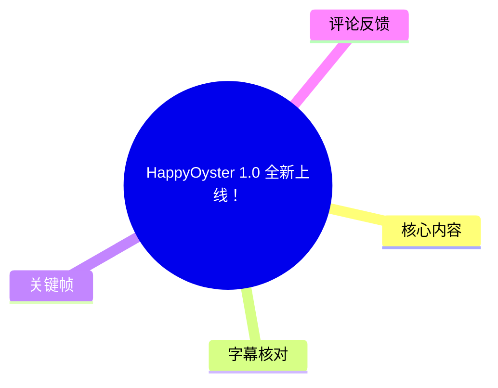
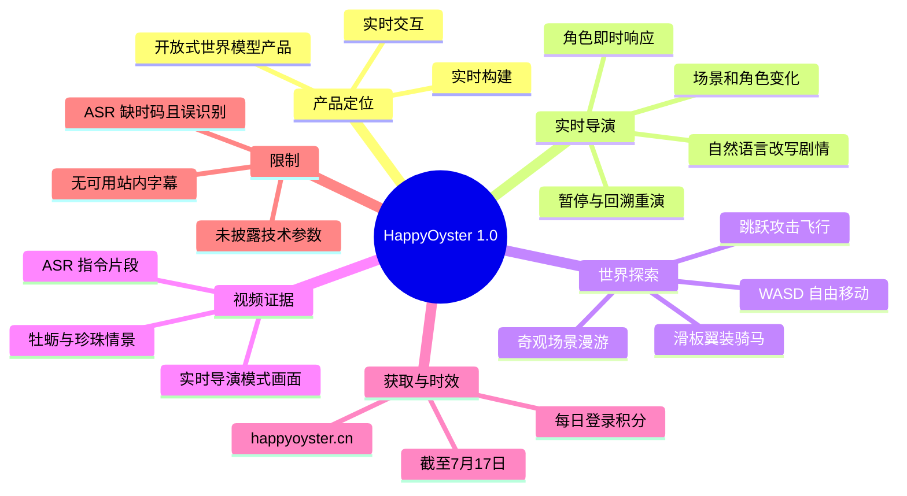

# HappyOyster 1.0 全新上线！

> 来源：[Bilibili 视频](https://www.bilibili.com/video/BV127LX6vESD)<br>
> UP 主：HappyOyster｜视频时长：2 分 15 秒｜分辨率：3840×2160<br>
> 视频简介称产品来自「阿里巴巴-ATH」，入口为 `happyoyster.cn/`。

## 小结

HappyOyster 1.0 被介绍为一款「可实时构建和交互的开放式世界模型产品」。这支 135 秒的发布宣传片以连续的生成式情景变化为主要呈现方式，重点展示两类玩法：**实时导演（Directing）**与**世界探索（Adventure）**。

实时导演的核心叙事是：用户通过自然语言临时改变画面中的角色、场景或剧情走向。例如，视频简介列举了“去海边”“哄哄我”、暂停后输入期望走向并回溯章节、变身换装、云养萌宠等用法。提供的关键帧中还可见“实时导演模式”标识，以及“婴儿抓起一颗牡蛎里的珍珠”的中文画面文本，说明宣传重点包括以一句指令推动画面继续演化。

世界探索部分在简介中宣称支持进入画面后进行 WASD 自由移动，并提供跳跃、攻击、飞行、滑板、翼装、骑马等动作或交互体验；但本次可获取的 ASR 文本与关键帧主要集中于剧情演出，未能独立验证这些操作是否已在视频画面中逐项完整演示。因此，这些功能应表述为**官方介绍或宣传承诺**，而非本记录直接验证的产品能力。

视频中可听辨的 ASR 以中英混杂的短句为主，含“把一只小鸟变成一只火焰”“首先，让我们把舞台变成 Romeo 和 Juliet”“把所有人都带到天空”等指令性内容。这些片段支持其“文本即时改写世界／舞台”的演示主题，但 ASR 缺少时间戳、识别错误较多，不能据此可靠还原完整旁白或精确操作链。

适合关注世界模型、AI 互动叙事、生成式游戏和实时视频生成产品的人阅读。需要特别注意：该视频为产品发布宣传素材，未展示模型架构、推理延迟、并发能力、平台支持、内容安全策略、计费规则或功能开放范围；“每日登录领积分”的福利也仅写明截至“7 月 17 日”，未在文本中明确年份，且需要以官网当前页面为准。

## 思维导图





## 目录

- [产品发布背景与信息边界](#产品发布背景与信息边界)
- [实时导演：用指令推动情景演出](#实时导演用指令推动情景演出)
- [世界探索：官方描述的交互范围](#世界探索官方描述的交互范围)
- [可复用的体验步骤与提示词结构](#可复用的体验步骤与提示词结构)
- [关键帧解读](#关键帧解读)
- [参数、限制与时效性](#参数限制与时效性)
- [字幕比对](#字幕比对)
- [评论分析](#评论分析)
- [处理记录](#处理记录)

## 产品发布背景与信息边界 [00:00](https://www.bilibili.com/video/BV127LX6vESD?t=0)

视频标题为“HappyOyster 1.0 全新上线！”，UP 主为 HappyOyster，标签包括“世界模型”“世界探索”“AI互动”“AI游戏”“开放世界”和“实时导演”。官方简介将其定义为“可实时构建和交互的开放式世界模型产品”。

这里的“实时”是本片最重要的产品主张之一：不是先离线制作一段固定视频、再播放成品，而是让用户输入新的自然语言要求后，剧情或世界继续发生变化。需要区分的是：

1. **视频及简介明确声称的能力**：实时导演、互动角色、剧情重演、开放世界探索、键盘操作等。
2. **关键帧直接能看到的证据**：画面存在“实时导演模式”文字；内容呈现了人物、动物、珍珠等生成式情景演出。
3. **不能从现有素材确认的内容**：具体输入到结果的延迟、持续生成的稳定性、多人协作、世界状态保存、客户端或浏览器要求、模型名称及技术路线。

官方给出的访问路径是 `happyoyster.cn/`。本记录只保留视频元数据中的入口信息，不对链接当前可用性、登录门槛或积分领取资格作额外推断。

## 实时导演：用指令推动情景演出 [00:00](https://www.bilibili.com/video/BV127LX6vESD?t=0)

### 1. 自然语言是主要交互入口

官方简介将“实时导演（Directing）”概括为“一句话，故事即刻上演，随时叫停，随时改写”。已获取的 ASR 中可辨认出以下指令或叙事句：

- “把一只小鸟变成一只火焰”
- “让我们做点更有趣的事”
- “首先，让我们把舞台变成 Romeo 和 Juliet”
- “把所有人都带到天空”
- “Backward chapter”

这些语句共同指向三种可能的导演动作：

| 指令意图 | 素材中的对应表述 | 可确认程度 |
| --- | --- | --- |
| 改变对象属性或形态 | “把一只小鸟变成一只火焰” | ASR 可辨，但没有时间码 |
| 切换戏剧舞台或故事设定 | “把舞台变成 Romeo 和 Juliet” | ASR 可辨，但专名可能存在识别偏差 |
| 改变整体场景状态 | “把所有人都带到天空” | ASR 可辨 |
| 回退剧情节点 | “Backward chapter” | 仅保留 ASR 原文，无法确认产品实际按钮或正式术语 |

其中，“Backward chapter”不宜直接翻译成固定产品功能名。官方简介确实提到“回溯上一章节重新演绎剧情”，但 ASR 的英文短句是否对应这一功能、其触发方式是什么，均无法仅凭现有字幕确定。

### 2. 剧情中断与重写

官方简介提出的具体场景是：当用户对短剧内容“意难平”时，可以暂停画面、输入期待的走向，再回溯上一章节重新演绎剧情。这个描述包含一个明确的交互闭环：

1. 观看正在推进的剧情；
2. 在不满意的节点暂停；
3. 用文本输入目标剧情；
4. 回退到前一章节；
5. 让系统按新的要求重新演出。

这是一种以“结果不满意”为触发条件的重导流程。视频未给出可复制的界面操作路径，也没有披露回溯后哪些元素会保留、哪些元素会重生成；例如人物身份、场景布局、前置因果关系是否稳定，均属尚未验证的问题。


> 图：该关键帧左上角可见“实时导演模式”标识，画面中婴儿从牡蛎中取出珍珠，底部还有“同时婴儿抓起一颗牡蛎里的珍珠”的字幕文本。它是现有帧中最直接将产品模式标识、自然语言叙事结果与具体视觉情景联系起来的证据。

### 3. 角色互动与生活化指令

官方简介还举例称，用户可与“虚拟男友”实时互动，输入“去海边”“哄哄我”等要求，角色会即时响应。该例强调的不是预设选项，而是面向角色关系、地点迁移与情绪回应的自然语言控制。

不过，视频素材没有提供可验证的对话上下文、角色记忆跨度或安全边界。因此不能推断其具备长期记忆、人格一致性、情感理解或真实社交能力；更谨慎的表述是：**官方将其展示为可通过文本推动角色回应的互动场景。**

## 世界探索：官方描述的交互范围 [00:00](https://www.bilibili.com/video/BV127LX6vESD?t=0)

除导演模式外，官方将另一核心玩法命名为“世界探索（Adventure）”。简介中描述用户可“进入画面探索”，并列出多类环境和动作：

| 类别 | 官方列举内容 | 当前素材的证据状态 |
| --- | --- | --- |
| 场景漫游 | 极光冰原、深海、油画、怪诞梦境 | 来自视频简介，未由本次关键帧逐项确认 |
| 基础移动 | WASD 自由移动 | 来自视频简介，未见键位界面证据 |
| 战斗与规避 | 攻击打怪、跳跃躲藏 | 来自视频简介 |
| 运动体验 | 滑板冲刺、翼装滑翔、骑马奔驰 | 来自视频简介 |
| 垂直机动 | 能飞 | 来自视频简介 |

“WASD”是 PC 游戏中常见的四方向移动键位表述。视频简介把它与攻击、跳跃、躲藏并列，意味着官方希望将该模式定位为接近游戏的探索交互，而非纯粹观看式的 AI 视频体验。

但应避免把“像玩游戏一样探索交互”扩展理解为成熟游戏产品承诺。视频未公布以下关键技术和体验参数：

- 世界是否持续存在，以及离开后能否保存；
- 可探索区域规模和地图边界；
- 键鼠、手柄、触屏或 VR 的实际支持情况；
- 角色碰撞、战斗判定与物理一致性；
- 同一世界中多用户参与与同步能力；
- 生成过程中画面、控制和状态的稳定程度。


> 图：该帧呈现教室场景中的人物表情与底部短字幕。它有助于理解视频通过连续剧情片段来展示“可被改写的世界”这一宣传方式，但画面本身未展示 WASD 键位、战斗 UI 或探索控制，不能作为世界探索功能已被完整实测的证据。

## 可复用的体验步骤与提示词结构 [00:00](https://www.bilibili.com/video/BV127LX6vESD?t=0)

以下内容是根据官方简介中明确描述的使用方式整理出的**概念性体验流程**，并非视频逐帧展示的操作教程；具体界面、按钮名称及资格要求应以官网实际产品为准。

### 场景 A：实时导演一段剧情

1. 进入 HappyOyster 官网所提供的产品入口。
2. 选择或进入一个可演出的画面／剧情环境。
3. 用一句清楚的自然语言描述希望发生的变化。
4. 观察角色、事件或场景是否按要求继续演出。
5. 如果结果不符合预期，按官方描述暂停画面。
6. 输入新的期望走向；如产品提供章节回溯，则回到上一章节后重新演绎。

可从官方示例中抽象出下面的提示词结构：

```text
[对象或角色] + [动作／情绪] + [目标地点或剧情结果]

示例：
让角色去海边
哄哄我
把舞台变成 Romeo 和 Juliet
把所有人都带到天空
```

提示词是否支持长文本、镜头语言、否定条件、人物一致性约束或多轮编辑，视频未说明。

### 场景 B：探索一个开放世界

1. 进入官方称为“世界探索（Adventure）”的模式。
2. 根据简介说明，使用 WASD 尝试自由移动。
3. 在可交互环境中尝试跳跃、攻击、躲藏或飞行等动作。
4. 根据场景类型体验滑板、翼装或骑马等移动方式。
5. 留意系统是否对动作、地形和角色提供连续反馈。

这套流程中的第 2 至第 4 步来自官方简介，不代表本次素材已经验证每一步均在当前版本向所有用户开放。尤其是“攻击打怪”“翼装滑翔”等动作，缺少可获取的实机操作字幕和界面画面支撑。


> 图：该帧展示人物面对突发事件时的夸张反应。它的价值在于补充视频的叙事与戏剧化表现风格：产品宣传并非只展示静态场景，而是在强调事件发生与角色反应；但它不构成模型效果稳定性或实时性指标的量化证明。

## 关键帧解读 [00:00](https://www.bilibili.com/video/BV127LX6vESD?t=0)

本次共提供 4 张关键帧。由于关键帧清单不包含对应的提取秒数，以下按画面内容解读，不将它们强行绑定为精确时间点。

### 动态混乱场景：强调可发生的事件


> 图：画面中多只鹅在类似走廊的环境中飞动，前景人物被部分遮挡。该帧适合说明视频以高度动态、带突发感的情景调动观众注意力；但没有可读 UI、提示词或功能标签，因此不能单独证明某项具体控制机制。

这一画面与整支视频的“即时改写”和“意外演出”氛围相符，但具体是否由某一文本命令直接生成，现有材料没有给出可靠对应关系。

### 珍珠情景：最明确的模式与结果关联

`frame-002.jpg` 是最值得用于正文论证的关键帧：它既包含“实时导演模式”文字，又包含对画面事件的中文描述。相较于仅展示人物表情的帧，它更接近产品功能演示证据。

### 反应镜头与戏剧化叙事

`frame-003.jpg` 和 `frame-004.jpg` 都以人物惊讶反应为视觉中心。它们说明视频采用了偏短剧、戏剧化的内容表达手法，也与官方所称“暂停画面—输入期望走向—重新演绎剧情”的使用场景形成呼应。需要注意，二者都未展示输入框、生成进度或操控界面，不能延伸为技术性能的实证。

## 参数、限制与时效性 [00:00](https://www.bilibili.com/video/BV127LX6vESD?t=0)

### 已知参数与元数据

| 项目 | 信息 |
| --- | --- |
| 产品名称 | HappyOyster 1.0 |
| 视频时长 | 135 秒 |
| 视频分辨率 | 3840×2160 |
| 视频类型 | 单 P，标题为“HappyOyster 1.0 全新上线！” |
| 产品定位 | 可实时构建和交互的开放式世界模型产品（官方简介） |
| 核心玩法 | 实时导演 Directing、世界探索 Adventure（官方简介） |
| 官方入口 | `happyoyster.cn/` |
| 视频标签 | 世界模型、世界探索、AI互动、AI游戏、开放世界、实时导演等 |

### 未披露或无法验证的技术参数

视频及其可获取素材没有给出以下信息：

- 模型名称、训练数据、训练方法或世界模型技术架构；
- 文本输入到画面变化的端到端延迟；
- 分辨率、帧率、单次生成时长和会话上限；
- 免费积分的数量、消耗规则、充值或订阅价格；
- 支持的语言、地区、浏览器和硬件配置；
- 用户生成内容的版权归属、数据保存与隐私规则；
- 内容审核机制、未成年人保护和高风险内容限制；
- 公测／内测资格、排队情况与功能分批开放范围。

因此，不能基于“实时”“开放世界”等宣传词推断其达到特定帧率、物理模拟质量或商业可用性水平。

### 福利的时效性

官方简介写明：“即日起至 7 月 17 日，官网不定期掉落体验积分，每日登录即可领取。”其中存在三项时效风险：

1. “即日起”以视频发布时点为参照；
2. 文本只写“7 月 17 日”，未明确年份；
3. “不定期掉落”意味着并非每个时段、每位用户都必然获得相同积分。

元数据抓取时间为 2026-07-13，处于所述截止日之前，但这**不等于**福利仍在有效或用户一定具备领取资格。实际活动状态、积分数量和规则应以官网当日公告为准。

## 字幕比对 [00:00](https://www.bilibili.com/video/BV127LX6vESD?t=0)

本次已执行 ASR。站内字幕获取失败，素材记录中的警告为：`Missing JSON resource URL.`，因此没有可用的 Bilibili 官方字幕可用于逐句校对。

| 字幕来源 | 完整性 | 专有名词 | 时间轴 | 主要问题 |
| --- | --- | --- | --- | --- |
| Bilibili 站内字幕 | 无可用内容 | 无法评估 | 无 | 字幕资源 URL 缺失，获取工具以退出码 1 结束 |
| 本次 ASR 字幕 | 较低；仅有若干零散短句 | 较弱；如 “Romeo and Juliet”“Mr. Jerry Harris”等需谨慎 | 无逐句时间码 | 中英夹杂、语义跳跃、存在明显错识别或断句问题，不能覆盖完整视频 |

### 最终字幕选择

正文以**视频元数据、官方简介、可见关键帧文字**为主，以本次 ASR 作为有限的音频佐证；未将 ASR 当作完整转写稿，也未虚构其时间轴。

以下是通过上下文或画面可作有限校正的内容：

| ASR 原文 | 校正／处理方式 | 依据与置信度 |
| --- | --- | --- |
| “首先,让我们把舞台变成Romeo和Juliet” | 保留为“把舞台变成 Romeo 和 Juliet” | ASR 中英文专名可辨；中等置信度 |
| “Backward chapter” | 保留英文，不强行认定为产品按钮名 | 官方简介有“回溯上一章节”，但无法确认原声与正式 UI 文案；低至中等置信度 |
| “把一隻小鳥變成一隻火焰” | 保留为 ASR 可辨的指令示例 | 与导演模式主题相符，但没有对应画面时码；中等置信度 |
| “同时婴儿抓起一颗牡蛎里的珍珠” | 作为画面内可见中文文字引用 | `frame-002.jpg` 底部可见同义字幕；较高置信度 |
| “左轉右轉 跳進去的海苔” | 不纳入事实陈述 | 语义异常，缺少画面和站内字幕交叉验证；低置信度 |

## 评论分析 [00:00](https://www.bilibili.com/video/BV127LX6vESD?t=0)

可获取的热评仅有 2 条，少于要求分析的前三条；因此仅处理这 2 条，**不补写不存在的第三条评论**。评论属于用户观点，不是对产品能力或技术实现的验证。

### 热评 1：对“高权限改写世界”的担忧

- **评论者**：22330313066_bili
- **获赞**：61
- **原意概括**：评论者认为，如果人能进入“赛博世界”，且有人拥有如此大的控制权限，可能产生“想怎样就怎样”的权力风险。
- **可提供的讨论价值**：它将视频中的“任意改写世界”宣传延伸到权限治理问题，例如谁能修改世界规则、角色与其他参与者的体验是否会被单方覆盖。
- **可信度与边界**：这是一种面向未来情景的伦理担忧，而非对 HappyOyster 当前已具备多人世界、权限系统或沉浸式赛博空间的事实陈述。视频没有公开相关治理机制，不能据此判断产品存在或不存在该风险控制。

### 热评 2：与 “wan2” 的横向比较

- **评论者**：天衍将神
- **获赞**：27
- **原意概括**：评论者惊叹产品能力，并将其与“wan2”作负面比较，提到后者“后面甚至不开源”。
- **可提供的讨论价值**：该评论反映观众会从能力展示、开源策略与产品可得性角度比较同类生成式产品。
- **可信度与边界**：评论没有提供“wan2”的准确名称、版本、来源或开源状态证据，也没有给出可复现实测。因此不能据此确认 HappyOyster 在技术效果上优于任何产品，或确认被比较对象的开源政策。

### 第三条热评

素材中未提供第三条可获取热评。按“仅分析可获取的热评前三条”的规则，本记录不扩展抓取范围、不编造评论，也不将普通评论替代为热评。

## 处理记录 [00:00](https://www.bilibili.com/video/BV127LX6vESD?t=0)

- **Worker ID**：`worker-mrj0wbly-5dc4e50c`
- **模型**：`gpt-5.6-terra`
- **调用工具与素材输出**：视频素材整理流程；已生成或提供 `merged.mp4`、`audio/audio.wav`、`frames/`、`info.json`、`comments/comments.json` 与 `asr/`。本记录基于提供的元数据、关键帧、ASR 文本、热评数据及素材清单整理。
- **站内字幕获取**：未成功。素材警告为 `subtitles: Tool process exited with code 1`，具体原因是 `Missing JSON resource URL.`。
- **ASR 执行情况**：已执行本次 ASR；输出为无时间码的中英混杂片段，完整性有限。
- **字幕选择**：无可用站内字幕，故不采用站内字幕；正文优先采用官方简介与关键帧可见信息，ASR 仅用于佐证可辨指令，并显式保留不确定性。
- **关键帧选择依据**：
  - `frames/frame-002.jpg`：带“实时导演模式”标识和珍珠事件字幕，是功能主题最直接的视觉证据；
  - `frames/frame-003.jpg`、`frames/frame-004.jpg`：用于说明宣传片的剧情化、角色反应式表达；
  - `frames/frame-001.jpg`：用于说明动态、突发的场景呈现，不用于证明具体产品参数。
- **关键帧时间依据**：所提供帧清单没有包含提取秒数，正文未虚构帧对应时间；章节时间轴统一链接至视频起点，以便读者进入原视频核验。
- **评论处理**：仅处理素材中可获取的 2 条热评；第三条未提供。
- **缓存清理**：未提供缓存清理执行结果或日志，无法确认是否已清理；本记录不声称已完成清理。
- **未解决问题**：缺少完整站内字幕、ASR 时间码与完整转写；无法精确定位各演示段落；无法独立验证官网当前可用性、积分活动状态、具体功能开放范围及所有技术性能参数。

## 评论分析

本次流程未获取到可用热评，因此不推断观众态度或额外结论。
