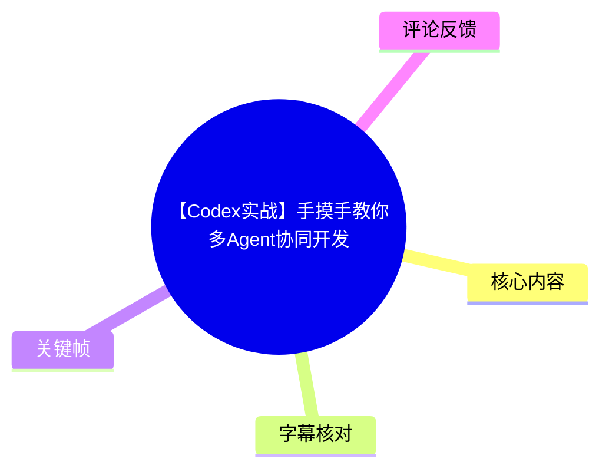
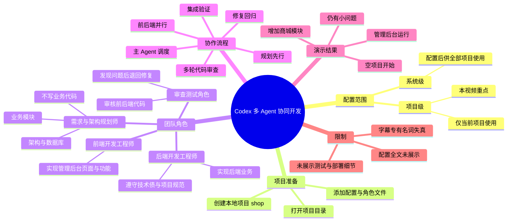
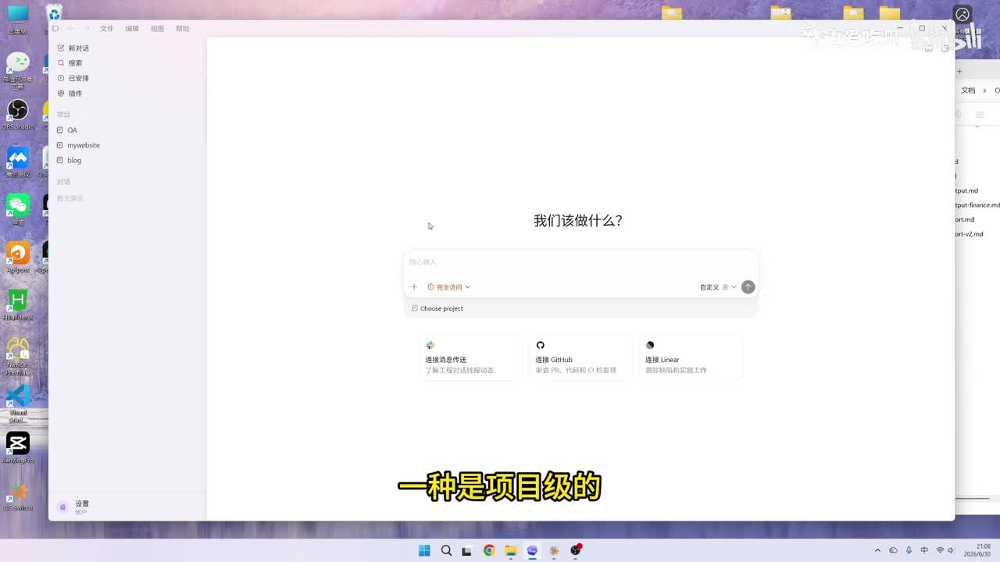
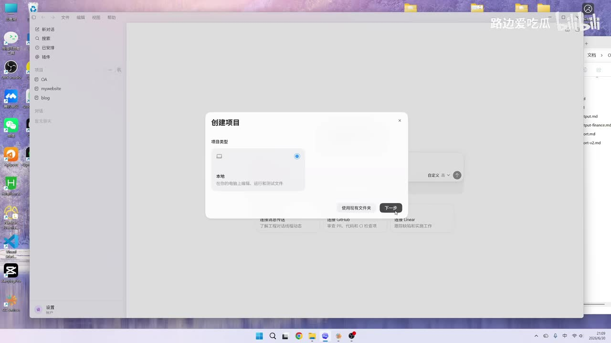
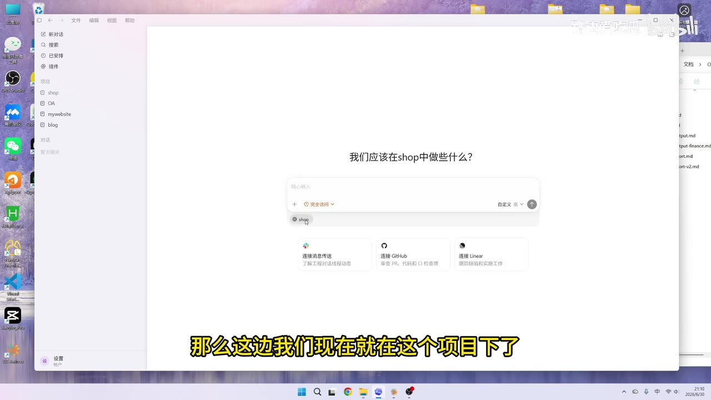
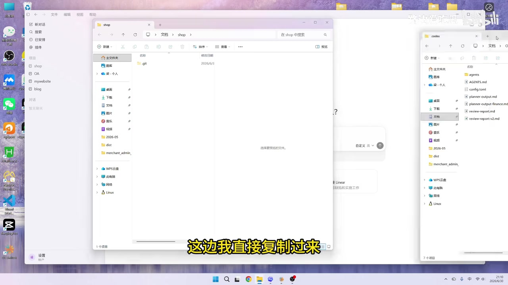

# 【Codex实战】手摸手教你多Agent协同开发

> 来源：[Bilibili 视频](https://www.bilibili.com/video/BV16hTc6xEpF)  
> UP 主：路边爱吃瓜｜时长：18 分 46 秒｜分区合集：AIcode  
> 视频主题：以一个商城管理后台为例，演示如何在 Codex 项目中通过角色配置与协作流程，让多个子智能体分工完成规划、前后端开发、审查、修复及集成验证。

## 小结

视频展示的是一种**项目级多 Agent 协同开发**实践：先在 Codex 中新建名为 `shop` 的本地项目，再在项目目录内放入约束配置、角色定义与协作流程文件，使主 Agent 能识别多个“员工”（子智能体）并按预设规则调度它们。

作者将团队拆为四类角色：需求与架构规划师、后端开发工程师、前端开发工程师、测试/代码审查角色。规划角色负责业务模块、架构与数据库相关工作但不写业务代码；前后端角色并行实现；审查角色发现问题后将任务退回修复。审查并非一次完成，演示中经历了多轮检查与修复。

关键方法不在于某个单独提示词，而在于把团队职责、技术约束、代码规范、并行关系、审查回退条件和集成验证要求写入项目文件。这样，主 Agent 在接到“增加模块”这类较高层需求后，能够先安排规划，再创建前后端子智能体并行执行，最后触发审查与验证。

演示任务是从一个只有配置文件、没有业务代码的空项目出发，为商城管理后台增加两个模块；字幕对模块名称的识别不稳定，因此本文不将其作为确定事实。最终画面显示管理后台已经运行，作者判断整体形态和基础功能“基本没有问题”，但仍提到有一些小问题；这不是对生产可用性、安全性或完整测试覆盖率的证明。

该方案适合希望把 AI 编程从“单轮生成代码”升级为“有分工、有审查、有返工闭环”的开发者。前提是使用者要能自行制定角色边界、接口/契约和验收标准；视频未提供可复制的完整配置正文，也未展示命令行、依赖安装、仓库地址、测试用例明细或部署过程。

时效上，视频元数据显示发布于 2026 年 6 月，涉及 Codex 的项目界面、配置识别规则和多 Agent 调度行为都可能随产品版本变化。应把视频中的文件组织和流程设计视为实践思路，而非跨版本保证有效的官方规范。

## 思维导图





## 目录

- [背景：系统级与项目级配置](#背景系统级与项目级配置)
- [创建商城项目并进入项目目录](#创建商城项目并进入项目目录)
- [配置文件、角色与职责边界](#配置文件角色与职责边界)
- [协作流程：规划、并行开发、审查与回退](#协作流程规划并行开发审查与回退)
- [实战执行：从空项目到管理后台](#实战执行从空项目到管理后台)
- [多轮审查、修复与集成验证](#多轮审查修复与集成验证)
- [结果、经验、限制与时效性](#结果经验限制与时效性)
- [字幕比对](#字幕比对)
- [评论分析](#评论分析)
- [处理记录](#处理记录)

## 背景：系统级与项目级配置 [00:00](https://www.bilibili.com/video/BV16hTc6xEpF?t=0)

视频开场说明 Codex 的多 Agent 配置存在两种作用范围：

| 配置类型 | 视频中的解释 | 适用含义 |
| --- | --- | --- |
| 系统级配置 | 配置完成后，所有项目都能使用。 | 适合团队或个人希望在多个项目间复用的通用规则。 |
| 项目级配置 | 配置完成后，仅当前项目可使用。 | 适合针对特定仓库、技术栈和业务约束定义专属协作方式。 |

本期只演示**项目级配置**。这意味着角色说明、流程约束和相关文件被放在当前项目目录下，由 Agent 在处理该项目时读取和遵守。



> 图：画面展示 Codex 的项目入口界面，视频字幕明确提到“项目级”。这张图的价值在于说明本教程不是在全局设置中修改通用规则，而是从一个具体项目开始组织多 Agent 协作。

需要注意，视频把“子智能体”形象地称作“员工”。这是一种角色编排方式，不意味着这些角色是独立的人类成员；它们由主 Agent 在流程中创建和调度。

## 创建商城项目并进入项目目录 [00:35](https://www.bilibili.com/video/BV16hTc6xEpF?t=35)

作者首先创建本地项目，后续目标是制作一个商城管理系统/管理后台。

操作顺序如下：

1. 在 Codex 项目界面中选择创建项目。
2. 在“创建项目”窗口选择**本地**项目类型。
3. 进入下一步并设置项目名称。
4. 作者将项目命名为 `shop`。
5. 进入该项目后，通过“在资源管理器中打开”进入项目实际目录。
6. 在项目目录中添加预先准备好的配置、角色和协作流程文件。



> 图：创建项目窗口中可见“本地”项目类型与“下一步”按钮。它为“项目级配置依附于本地项目目录”提供了操作上下文。



> 图：左侧项目列表出现 `shop`，主界面提问“我们应该在 shop 中做些什么？”。这说明项目已被选中，是后续让 Codex 读取项目内文件的前提。



> 图：资源管理器中左侧是 `shop` 目录，右侧是预先准备的 `codex` 配置目录；右侧可见 `agents` 文件夹、`AGENTS.md`、`config.toml` 等文件名。其价值在于直观说明配置被复制到项目目录，而不是只在对话中临时描述。

视频没有展示这些文件的完整文本，也没有展示其版本控制提交过程。因此，不能据此推断固定的配置字段、文件格式细节或官方要求；可确定的是，作者使用了 `config.toml`、`agents` 目录和 `AGENTS.md` 这类项目内组织结构。

## 配置文件、角色与职责边界 [02:10](https://www.bilibili.com/video/BV16hTc6xEpF?t=130)

作者在项目目录中加入第一份配置文件 `config.toml`。根据口述，这一文件主要放置针对 Codex 的“限制”和“要求”，用于约束 Agent 在当前项目中的行为。视频没有清晰展示配置全文，故不能可靠还原具体键值、模型参数、权限项或数值参数。

随后，作者在 `agents` 目录下放入四个子智能体的角色定义。视频将每个角色称为一个“员工”，并逐一说明其职责。

| 角色 | 视频明确说明的职责 | 可见约束/边界 |
| --- | --- | --- |
| 需求与架构规划师 | 规划业务模块、架构及数据库相关内容。 | **不写代码**。 |
| 后端开发工程师 | 具体实现后端业务。 | 有“需要做什么”、技术债约束和项目规范等要求。 |
| 前端开发工程师 | 实现管理后台的页面和功能。 | 有契约规范；因管理后台页面和功能较多，作者对该角色描述得更细。 |
| 测试/代码审查角色 | 在项目开发后，对前端和后端代码进行审核。 | 重点是检查代码质量，并按约束执行审查。 |

这里的核心经验是：**角色的职责和禁止事项都要写清楚。** 例如，规划师只做方案、架构和数据库相关输出，不直接越界承担业务编码；前后端角色各自承担实现；审查角色不只是“检查一下”，还应负责提出问题并让实现角色修复。

对实际项目而言，视频中的四角色可映射为如下工作分解：

```text
需求 / 架构
    ↓ 输出模块划分、架构和数据相关方案
前端开发 ←→ 后端开发
    ↓ 并行实现，但需遵循约定与规范
代码审查 / 测试
    ↓ 发现问题后回退给对应实现角色
主 Agent
    ↓ 汇总、调度，并进行最终验证
```

视频反复强调“约束”。其可迁移含义是：若只定义角色名称而不写交付物、边界、质量标准和返工机制，多个 Agent 很可能产生职责重叠、接口不一致或无人负责验收的问题。

## 协作流程：规划、并行开发、审查与回退 [05:20](https://www.bilibili.com/video/BV16hTc6xEpF?t=320)

除角色文件外，作者还加入一份面向整个项目的协作约束文件。根据画面中可见文件名和口述，该文件为 `AGENTS.md`；它的作用不是定义某一个角色，而是规定四个角色如何分工与协作。

视频说明该流程文件至少覆盖以下内容：

1. **角色分工**：每个角色应做什么、不应做什么。
2. **项目流程**：先进行规划，再进入开发。
3. **并行开发**：前端与后端可以并行开展。
4. **代码审查**：开发完成后进入审核。
5. **问题回退**：审查发现问题后，退回给相应角色重新修复。
6. **结束条件**：问题清零，或减少到可接受的很少程度。
7. **最终验证**：代码审查完成后，还需要由主 Agent 做验证。

作者还提出一种可选扩展：可以额外增加一个专门负责集成验证的子智能体；本次演示没有这样做，而是由主 Agent 进行集成验证。

这一流程可以整理为：

```text
接收需求
  → 架构规划角色输出规划
  → 前端、后端角色并行实现
  → 审查角色检查代码质量
  → 有问题：退回对应开发角色修复
  → 再次审查
  → 问题基本清零后，由主 Agent 集成验证
  → 输出运行结果
```

视频随后通过“列出当前项目下所有资源”的方式检查配置是否生效。作者表示，Codex 已经找到了先前创建的四个角色，也找到了协作流程，因此确认项目级多 Agent 配置完成。

### 配置阶段的可执行清单

若要复现视频的设计思路，而非照搬未知的配置正文，可按以下清单准备：

- 创建独立的项目目录。
- 放置一个项目级约束配置文件，例如视频中的 `config.toml`。
- 建立 `agents` 目录，按角色分别定义职责。
- 建立团队协作说明文件，例如视频画面中的 `AGENTS.md`。
- 在角色定义中明确：
  - 输入是什么；
  - 输出/交付物是什么；
  - 是否可以修改代码；
  - 技术规范、接口契约和技术债限制；
  - 何时将任务转交或退回。
- 在流程文件中明确：
  - 规划是否先于编码；
  - 哪些角色可以并行；
  - 审查人是谁；
  - 问题发现后由谁修；
  - 什么条件下可结束；
  - 谁负责最终集成验证。

## 实战执行：从空项目到管理后台 [08:00](https://www.bilibili.com/video/BV16hTc6xEpF?t=480)

完成配置后，作者要求系统为商城项目添加两个模块。站内字幕和本次 ASR 对这两个模块的名称均存在明显识别错误，且没有可供确认的清晰文字画面，因此本文只保留“新增两个模块”这一可靠信息，不擅自补全模块名称。

此时项目状态是：

- 项目目录已经存在；
- 多 Agent 配置已经就绪；
- 尚无实际业务代码；
- 任务从需求规划开始执行。

执行过程按预设协作流程展开。

### 1. 创建规划子智能体

主 Agent 首先创建第一个子智能体，即需求与架构规划师。作者打开其工作内容后说明，该角色正在处理框架、架构和数据库相关事项。

这与前面的角色边界一致：规划师负责把抽象需求转换为后续可实现的结构化方案，而不是直接承担前后端编码。

### 2. 前后端角色并行开发

规划完成后，系统准备让第二、第三个角色开始工作，即后端开发工程师和前端开发工程师。视频中可见主 Agent 成功创建两个子智能体，二者分别开始处理后端和前端任务。

作者特别提到，前端实现可能会花更久，因为管理后台涉及页面及页面功能；但演示中前端角色先完成，随后等待后端角色完成。

这种调度方式的重点是并行而非串行：

| 阶段 | 执行角色 | 依赖关系 |
| --- | --- | --- |
| 规划 | 需求与架构规划师 | 先于实现阶段。 |
| 后端实现 | 后端开发工程师 | 基于规划执行，可与前端并行。 |
| 前端实现 | 前端开发工程师 | 基于规划执行，可与后端并行。 |
| 质量审核 | 审查测试角色 | 等待前后端输出。 |

视频未给出并行任务的具体代码差异、分支策略、合并策略或 API 文档内容。因此，“并行开发”应理解为 Agent 层面的任务并行，不应进一步推断其使用了 Git worktree、分支合并或特定 CI 流水线。

## 多轮审查、修复与集成验证 [12:15](https://www.bilibili.com/video/BV16hTc6xEpF?t=735)

前后端完成后，流程进入第四个角色，即测试/代码审查角色。该角色对前端和后端输出进行审核，并发现了多个问题。

### 第一轮审查与修复

第一轮审查发现问题后，系统再次生成两个子智能体，让先前的前端与后端角色分别修改。视频显示，两个修复任务完成后进入下一轮审查。

这说明“审查”在该方案中不是输出一份报告即结束，而是具备明确的闭环：

```text
审查发现问题
  → 将问题路由给责任角色
  → 责任角色提交修复
  → 再审查修复是否生效
```

### 第二轮审查与定向修复

第二轮审查的目标是确认上一轮问题是否已修复。作者表示上一轮修复已完成，但审查又发现一些性能问题。新的问题被交给前端开发工程师修复。

视频还提到，某个子智能体处理过程中出现问题后，主 Agent 主动接手了处理。这是一项重要的实践信息：即使配置了子智能体流程，主 Agent 仍可能承担异常处理与兜底职责。

### 第三轮审查与主 Agent 收尾

第三轮审查结束后，仍发现了一点小问题。此时主 Agent 自己处理了该问题，并完成修复。

从演示可归纳出两条经验：

- **质量门禁要允许迭代。** 一次审查难以覆盖所有实现、性能和契约问题，多轮“审查—修复—复审”比一次性验收更贴近真实开发。
- **要有兜底者。** 子智能体并不保证每次都可顺利完成任务；主 Agent 或人类开发者需要对失败、冲突和未闭环问题承担最终责任。

### 集成验证

完成审查后，视频进入最后的集成验证。作者此前已在流程中指定由主 Agent 执行该步骤，而非另设集成验证 Agent。画面和口述表明代码运行成功，管理后台能够打开。

但“运行成功”只说明作者演示环境中完成了基础运行验证。视频没有展示：

- 自动化测试命令和测试输出；
- 接口请求、数据库迁移或数据初始化；
- 单元测试、端到端测试或性能压测；
- 安全审查；
- 部署环境；
- 失败场景的恢复策略。

因此，集成验证的结论应限定为：**视频中演示的管理后台已运行，作者主观判断基础功能基本正常。**

## 结果、经验、限制与时效性 [17:10](https://www.bilibili.com/video/BV16hTc6xEpF?t=1030)

视频最后展示管理后台页面。作者认为整体界面形态“还是可以的”，并表示功能“基本上没有什么问题”，同时保留“只有一些小问题”的描述。

### 可迁移经验

1. **把协作制度文件化，而不是只靠临时对话。**  
   `config.toml`、角色定义文件和 `AGENTS.md` 共同构成项目内可读取的协作上下文。对复杂工程，稳定的文件化约束比每次重新提示更容易复用和审查。

2. **角色不是越多越好，关键是边界清晰。**  
   本视频的四角色分别覆盖规划、前端、后端、审查；每个角色都有具体职责。尤其是“规划师不写代码”这样的限制，有助于防止任务漂移。

3. **规划先行、实现并行。**  
   在有架构与数据库规划的前提下，前后端可并行推进，缩短等待时间；但其成立条件是接口契约和责任范围足够明确。

4. **审查必须绑定返工机制。**  
   审查 Agent 的价值不只是列问题，更在于能将问题准确退回对应实现角色，并在修复后复审。

5. **最终验证不能缺位。**  
   无论由单独 Agent、主 Agent 还是人类执行，都需要设置集成验证步骤；否则多 Agent 的各自“完成”不等于系统整体可运行。

### 视频未覆盖或无法确认的限制

| 事项 | 素材能够确认的程度 | 限制说明 |
| --- | --- | --- |
| 配置文件完整内容 | 未提供 | 无法复刻精确字段、规则文本和参数。 |
| 模块名称 | 字幕识别不稳定 | 不应基于乱码字幕断言具体模块。 |
| 技术栈 | 未明确展示 | 无法确认前端框架、后端语言、数据库或 ORM。 |
| 代码质量 | 仅演示审查过程 | 没有可核验的报告内容、覆盖率和测试结果。 |
| 性能结论 | 只提到发现性能问题 | 未展示指标、基准、优化前后对比。 |
| 安全性与生产可用性 | 未展示 | 不能从管理后台运行画面推导出生产级可靠性。 |
| 配置兼容性 | 依赖视频当时的 Codex 环境 | Codex 的界面、目录约定与 Agent 功能可能改变。 |

### 时效性说明

元数据抓取时间为 2026-07-13，视频元数据发布时间为 2026-06-30。页面交互、文件识别及 Agent 创建效果均属于该时间点的演示环境。若在后续版本中复现，应优先检查 Codex 当前文档与当前客户端对项目指令文件、Agent 定义和多任务调度的支持情况。

## 字幕比对 [17:50](https://www.bilibili.com/video/BV16hTc6xEpF?t=1070)

本次任务中，**站内字幕与本次 ASR 均已提供并执行**。两者都覆盖了视频主要叙述，但均存在较严重的自动转写失真，尤其集中在“多 Agent”“子智能体”“文件名”“角色名称”和“新增模块名称”等专有表达上。

| 字幕来源 | 完整性 | 专有名词 | 时间轴 | 主要问题 |
| --- | --- | --- | --- | --- |
| Bilibili 站内字幕 | 覆盖从配置到验证的完整流程，语义整体较连贯。 | “Codex”“项目级/系统级”“前端/后端开发工程师”等多数可由上下文辨识；“多 Agent”“子智能体”等词存在误识别。 | 提供的文本无逐句时间戳。 | 口语停顿较多，出现“多AJ”“子恩之塔”等识别错误；模块名与部分文件名不可靠。 |
| 本次 ASR 字幕 | 覆盖范围与站内字幕相近，保留了多轮审查、性能问题、主 Agent 接手等叙述。 | 专有词误识别更多，如“多A”“多余力”“子儿”等；中繁混杂。 | 提供的文本无逐句时间戳。 | 断句、同音替换和乱码较明显；部分句子难以独立理解。 |

### 最终字幕选择与校正策略

本文以**站内字幕为主、本次 ASR 交叉核对**，再结合关键帧中的可见文字和上下文进行保守整理：

- 将两份字幕中反复出现的“多AJ / 多A / 多余力”等统一表述为“多 Agent”，这是由视频标题“多Agent协同开发”、标签“多Agent”“智能体协同”及上下文共同支持的校正。
- 将“子恩之塔 / 子儿 / 子侄能体”等统一表述为“子智能体”，因为视频明确用“员工”比喻其角色，并描述了主 Agent 创建多个此类执行单元。
- 将画面中清晰可见的 `shop`、`agents`、`AGENTS.md`、`config.toml` 保留为文件/目录名称；其中 `AGENTS.md` 和 `config.toml` 可由关键帧确认。
- 不采纳两份字幕都无法稳定识别的新增模块名称，也不补写任何未展示的技术栈、命令或配置参数。
- 正文中的时间轴为根据视频叙事阶段设置的导航链接；字幕文本本身不含逐句时间码，不将其误称为精确字幕时间戳。

## 评论分析 [18:10](https://www.bilibili.com/video/BV16hTc6xEpF?t=1090)

仅处理本次可获取的热评前三条。三条评论点赞数均为 2，样本量和互动强度都有限，不能代表全部观众意见。

| 排名 | 用户 | 评论内容 | 分析 |
| --- | --- | --- | --- |
| 1 | cxy1991028 | “清晰度不够 啥都看不清” | 这是对观看体验和画面可读性的直接反馈。视频确实以桌面录屏为主，配置文件正文并未在素材中清晰可复原；该评论不能证明视频内容错误，但提示观众可能难以照着画面抄录配置。 |
| 2 | GPT等AI订阅-可开票19 | “你们有没有被AI的回答惊到过？❀” | 评论是泛泛提问，没有提供与该视频的 Codex 配置、流程或结果有关的可验证补充信息，也未形成具体技术争议。 |
| 3 | 聪明伶俐小阿惊 | “已三连，求配置” | 反映观众希望获得可直接使用的配置文件。视频中作者展示了配置文件和角色分工，但素材未附完整文本或下载地址；因此不能据此认定作者已经公开配置。 |

评论区最有价值的共同信号是：观众对**可复制配置**和**画面可读性**存在需求。若要将类似教程转化为可复现资料，应额外提供配置仓库、文件全文、版本说明、运行前置条件和示例任务，而非仅依赖录屏展示。

## 处理记录 [18:35](https://www.bilibili.com/video/BV16hTc6xEpF?t=1115)

- Worker ID：`worker-mrj0www4-e8d79408`
- 模型：`gpt-5.6-terra`
- 输入素材与可用产物：视频元数据、站内字幕、本次 ASR 字幕、热评 JSON、关键帧目录、`merged.mp4`、`audio/audio.wav`、`info.json` 等已生成素材清单。
- 调用工具：本任务仅依据提供的结构化元数据、字幕文本、热评与关键帧素材进行整理；未提供单独的工具调用日志，不补造未记录的工具名称或执行结果。
- 字幕选择：站内字幕为主，本次 ASR 为交叉核对；两者均已实际纳入比对。对“多 Agent”“子智能体”及画面中可见文件名进行了上下文校正；对无法确认的模块名称不做补全。
- 关键帧选择依据：
  - `frames/frame-001.jpg`：展示 Codex 项目页及“项目级”上下文，用于说明两类配置范围。
  - `frames/frame-002.jpg`：展示创建本地项目步骤，用于支撑项目初始化说明。
  - `frames/frame-003.jpg`：展示 `shop` 项目已进入，用于说明项目级上下文已建立。
  - `frames/frame-004.jpg`：清晰展示向项目目录复制 `agents`、`AGENTS.md`、`config.toml` 等内容，是解释文件化协作配置的关键证据。
- 缓存清理：提供的素材中未包含缓存清理执行日志或结果；无法确认是否已清理，故标记为“未提供记录”，不作已清理声明。
- 未解决问题：
  - 未提供完整配置文件正文，无法输出可直接复制的配置。
  - 字幕对新增模块名称存在失真，无法可靠确认具体名称。
  - 未提供逐句字幕时间戳，正文时间轴为视频叙事导航，不是逐字转写时间码。
  - 未展示技术栈、命令、测试报告、性能指标与部署信息，相关内容不作推断。

## 评论分析

本次流程未获取到可用热评，因此不推断观众态度或额外结论。
