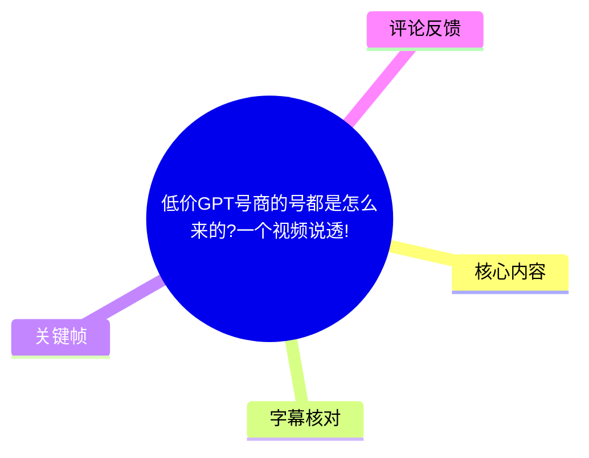
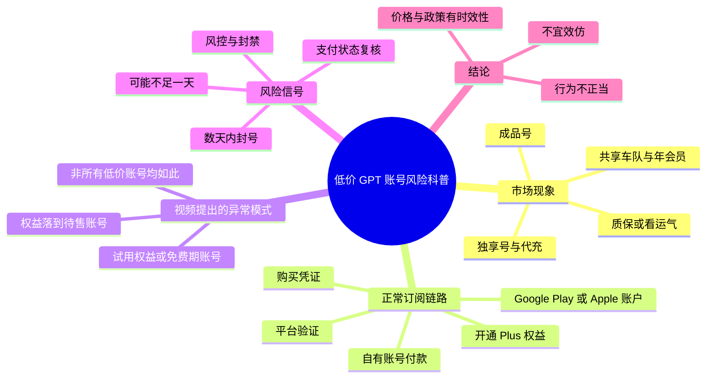
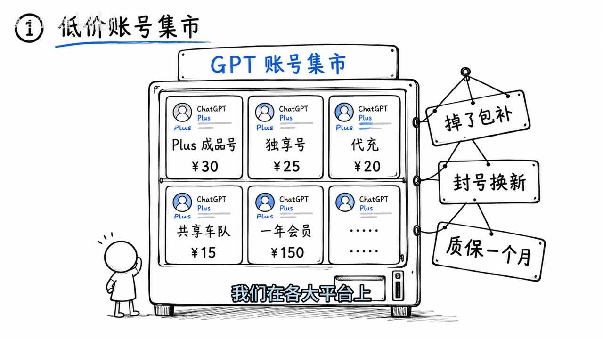
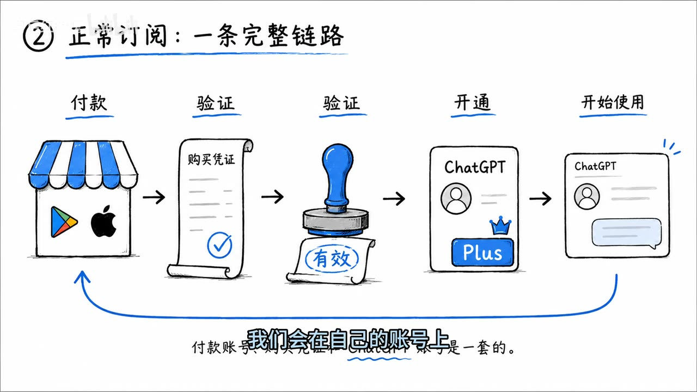

# 低价GPT号商的号都是怎么来的?一个视频说透!

> 来源：[Bilibili 视频](https://www.bilibili.com/video/BV1fUKA6ZErK) 
> UP 主：身后红玫瑰｜发布时间：2026-07-18｜视频时长：02:07｜分辨率：2560×1440  
> 标签：科普、AI、吐槽、GPT

## 小结

视频讨论的是各平台上低价出售的 ChatGPT Plus／GPT 账号、代充、共享车队和年费会员可能来自哪里。UP 主将其定位为**风险科普**，明确表示不分享绕过正常支付流程的方法，也提醒观众不要模仿。

视频先用正常订阅链路解释权益的来源：用户以自己的账号，通过 Google Play 或 Apple 账户付款；支付后形成购买凭证，平台验证凭证有效后才为对应账号开通 Plus 权益。UP 主的核心判断是，正常情况下，付款账户、购买凭证与实际使用账户应处于同一完整链路中。

对于没有质保或“日抛”的低价账号，视频提出一种可能的解释：号商可能利用带有试用权益或免费期的账户，通过异常手段使权益落到另一个待售账户上。该说法是视频作者的概括性描述，素材未展示实际交易证据、技术细节或平台规则原文，因此不应将其视为对所有低价账号来源的事实认定。

视频给出的风险信号包括：账号数天内被封、甚至存活不足一天；平台重新核验支付状态后可能触发封禁或风控。视频认为，这类低价账号即使短期可用，也存在明显的不稳定性；“质保”“封号换新”等售后承诺并不等于权益来源合规。

涉及价格的内容具有时效性：画面示例列出 Plus 成品号 ¥30、独享号 ¥25、代充 ¥20、共享车队 ¥15、年会员 ¥150；口播还称官方月费“二十多美元”、部分低价 Plus 号约“一块一块左右”。这些均是视频发布时的表述或示意，不能作为当前官方价格、市场价格或产品政策依据。

适合希望识别低价订阅账号风险、理解“支付—凭证验证—权益开通”关系的观众阅读。本文仅整理原视频的风险说明，不提供抓包、转移权益、批量注册、规避支付核验或规避风控的操作方法。

## 思维导图

## 目录

- [市场现象：低价账号与售后话术](#市场现象低价账号与售后话术)
- [正常订阅链路：付款、凭证与权益](#正常订阅链路付款凭证与权益)
- [视频提出的低价账号来源逻辑](#视频提出的低价账号来源逻辑)
- [风险判断：封号、复核与不稳定性](#风险判断封号复核与不稳定性)
- [结论、限制与时效性](#结论限制与时效性)
- [字幕比对](#字幕比对)
- [评论分析](#评论分析)
- [处理记录](#处理记录)

## 市场现象：低价账号与售后话术 [00:00:00](https://www.bilibili.com/video/BV1fUKA6ZErK?t=0)

UP 主从常见销售页面切入，提到平台上可见“成品号”“独享号”“代充”“共享车队”“一年会员”等不同形式的低价 ChatGPT Plus 服务。视频特别提到，部分卖家会提供“掉了包补”“封号换新”或“质保一个月”，另一些则让买家自行承担可用性风险。

画面中的“GPT 账号集市”是对低价售卖形式的示意，不是对真实店铺、真实成交价格或真实服务条款的取证。画面价格包括：

| 画面示例项目 | 画面标价 |
| --- | ---: |
| Plus 成品号 | ¥30 |
| 独享号 | ¥25 |
| 代充 | ¥20 |
| 共享车队 | ¥15 |
| 一年会员 | ¥150 |

口播称官方订阅“一个月多二十美元”，并称若找到“好一点的号商”，大部分 Plus 号可能“一块一块左右”。这些价格表述前后口径和计价单位并未在视频中展开，且市场价格、汇率、地区定价及官方产品政策随时可能变化，不能据此进行价格换算或购买决策。

> 图：画面将成品号、独享号、代充、共享车队及年会员放入同一“账号集市”，并列出掉包补、封号换新、质保一个月等标签。它直观呈现了视频所讨论的销售话术与产品形态，但不构成对任何商家的事实指认。

## 正常订阅链路：付款、凭证与权益 [00:00:31](https://www.bilibili.com/video/BV1fUKA6ZErK?t=31)

视频将正常订阅描述为一条完整链路：

1. 用户在自己的账号上发起订阅。
2. 使用 Google Play 或 Apple 账户付款。
3. 付款完成后获得购买凭证。
4. 平台验证该购买凭证。
5. 验证通过后，为对应 ChatGPT 账号开通 Plus 权益。
6. 用户开始在该账号上使用服务。

UP 主将购买凭证比作“小票”，强调平台会确认“小票”真实有效后才开通 Plus。其要点不是支付渠道本身，而是**付款、凭证、验证、权益归属之间的关联关系**：视频认为，在正常情形下，付款账户与实际使用账户属于同一套链路。

> 图：关键帧以“付款 → 购买凭证 → 验证 → 开通 → 开始使用”展示视频的基础模型，并在下方标注付款账号、购买凭证和 ChatGPT 账号是一套关系。这是理解后续风险分析的核心图示。

### 技术概念边界

视频中的“购买凭证”“验证”“支付状态核验”均为通俗化解释。素材没有给出平台 API、票据格式、服务器端校验规则、应用商店协议或官方公告，因此不能进一步推导具体实现机制。

此外，站内字幕多处将标题中的“GPT”识别为“GPP”，而 ASR 又出现“GP”“GPT”等混杂写法；结合视频标题、画面“GPT 账号集市”及 ChatGPT Plus 标识，本文统一使用“GPT／ChatGPT Plus”表述。

## 视频提出的低价账号来源逻辑 [00:00:56](https://www.bilibili.com/video/BV1fUKA6ZErK?t=56)

UP 主在此处作出明确限定：**并非所有低价账号都以同一方式获得**。视频讨论的是一类可能与“无质保”“日抛”特征相关的异常订阅情形，而不是对整个低价账号市场作一概而论的判断。

按照视频的描述，这类情形可能涉及以下链条：

- 号商寻找具有“7 天试用权益”的账号，或带有一个月免费期的 Business 账号；
- 视频还以“之前的……地区”存在一个月免费为例，但站内字幕将具体地区识别为“日子地区”，ASR 也未能可靠识别，素材不足以确认具体地区名称；
- 号商以“特殊手段抓包”为例，令原本的权益落到另一个拟出售账号上；
- 买家拿到的账号表面上已有会员权益，但视频推测其背后的购买凭证可能存在异常。

这是一种风险解释而非可验证的完整技术报告。视频没有展示抓包数据、账号后台、购买凭证、平台通知、样本量或第三方证据；同时，UP 主也没有给出任何可复现步骤。为避免将科普内容转化为违规操作，本文不展开其中可能被滥用的技术路径。

## 风险判断：封号、复核与不稳定性 [00:01:21](https://www.bilibili.com/video/BV1fUKA6ZErK?t=81)

视频给出的主要经验判断是：若购买的账号仅数天即被封，甚至活不到一天，可能与前述异常权益链路有关。UP 主进一步解释，批量注册或异常订阅形成的账号，一旦平台重新核验支付状态，可能被封禁或纳入风控。

视频对稳定性的表述包括：

- 低价账号可能仅稳定几天，也可能稳定数周；
- UP 主认为此类账号“绝对会被封”，这是作者的强判断；
- 账号上即便显示会员权益，也不代表权益来源或购买凭证经得起持续核验；
- “封号换新”“质保”只能描述卖方的售后承诺，无法消除账号丢失、数据访问中断、服务不可用等风险。

需要区分的是，视频没有提供各类账号的实际封禁率、平均存活时间、平台复核频率或质保兑现率。因此，“数天”“数周”“绝对会被封”等内容应视为作者经验性观点，而非统计结论。

## 结论、限制与时效性 [00:01:56](https://www.bilibili.com/video/BV1fUKA6ZErK?t=116)

UP 主在结尾重申：本期仅作“低价黑号”来源的简单科普，相关行为“不正当”，观众了解即可，不要效仿。

### 可迁移的判断框架

- **看链路而非只看账号状态**：账号显示 Plus 权益，不等于其付款、凭证和账号归属关系正常。
- **把异常低价与稳定性分开判断**：低价、无质保、日抛、封号换新等信息可以作为风险信号，但不能单独证明某一账号的具体来源。
- **不要把售后承诺等同于合规性**：卖家承诺补号，只是对交易风险的商业安排，不等于平台认可或权益长期有效。
- **保护个人数据与工作连续性**：若账号来源、控制权或订阅权益不稳定，将重要对话、文件和工作流放在其中会放大数据访问和业务中断风险。

### 内容限制

1. 视频没有提供可核验证据来证明某个具体号商、具体账号或全部低价账号采用同一来源。
2. 视频未提供官方规则、支付平台规则或 ChatGPT 服务条款的原文，不能据此做法律、合规或平台执法结论。
3. 站内字幕虽有逐句时间轴，但“GPP”“日子地区”等识别错误存在；具体术语需以标题、画面和上下文谨慎校正。
4. 视频所说的官方月费、免费权益、地区活动、账号市场价格以及产品形态均有明显时效性。应以查看当日官方订阅页面、账户状态与平台规则为准。
5. 本文不将评论区的个人经历当作已验证事实，也不提供任何绕过支付、转移权益或规避风控的执行信息。

## 字幕比对

| 字幕来源 | 完整性 | 专有名词 | 时间轴 | 主要问题 |
| --- | --- | --- | --- | --- |
| Bilibili 站内字幕 `p01-ai-zh.srt` | 高，覆盖 00:00:00.200—00:02:06.360 的完整口播 | 一般；将“GPT”多次写为“GPP”，具体地区名称识别不可靠 | 高；逐句、细粒度时间轴，可直接定位 | 个别错字、重复句与断句不自然，如“付款账号和你的账号是连” |
| 本次 ASR 字幕 | 内容大体覆盖口播，但首段从 00:00:25.600 才开始，诊断覆盖率为 79.19% | 较低；出现“GP”“赌奖号”“漏过”“购买账”“第一架号”等明显误识 | 较低；仅 6 个超长段，且与站内字幕起始时间明显错位 | 前 25.6 秒时间缺失、长段合并严重、术语与语义误识较多 |

### 最终字幕选择与校正

本文以**站内时间轴字幕**作为章节定位依据，因为其从 00:00:00.200 起连续覆盖全片，且提供了逐句起止时间；本次 ASR 已完成检查，但不作为时间轴主来源。

本次 ASR 诊断显示音频文件存在，语言识别为中文，置信度为 0.9814，使用 `medium` 模型、CUDA、`float16` 推理；`asr-result.json` **未标记** `noAudioStream=true`。因此，该视频并非无音轨素材。ASR 的主要问题是首段延迟至 25.6 秒、每段文本异常冗长，以及多处专有名词误识。

结合标题、站内字幕与关键帧画面，本文做了以下必要校正：

- “GPP 账号”／“GP 账号”统一按上下文校正为“GPT 账号”或“ChatGPT Plus 账号”；
- 站内字幕的“独享号”与 ASR 的“赌奖号”以站内字幕和画面文字“独享号”为准；
- 站内字幕“日子地区”、ASR 中相近的模糊词均无法确认具体地区，保留为“视频未能可靠识别的地区名称”，不擅自补全；
- 站内字幕“抓包”“购买凭证”“支付状态”等核心概念与 ASR 语义基本相符，采用站内字幕的较完整表述。

## 评论分析

以下仅分析本次可获取的热评前三条。评论是个人观点或使用经验，未获得独立验证。

1. **令人不可思议**（13 赞）  
   评论称购买此类账号的人可能用于接收验证码，并在一天内耗尽“七天额度”；其个人判断是“3 块 2 活个两天没额度了”，即便不封号也会被丢弃。该评论补充了“账号存活”和“额度耗尽”可能是两种不同的失效方式，但视频本身没有谈及验证码用途、额度规则或具体价格，故不能视为对视频观点的证实。

2. **没烦恼了呐**（0 赞）  
   评论认为“自用站，组几个人一起用还是没什么问题的”。这表达了对多人共用服务的可行性看法，但没有说明“自用站”的具体架构、账号来源、订阅授权范围、安全控制或服务条款适配性。它与视频对低价账号风险的讨论并不完全处在同一对象上，不能据此推导多人共享一定合规或稳定。

3. **一杰天下**（0 赞）  
   评论仅写“plus”，没有提供可分析的论据、使用经验或补充事实，信息量有限。

## 处理记录

- Worker ID：`worker-mrj0www4-e8d79408`
- 整理模型：`gpt-5.6-terra`
- 已用素材与工具结果：Bilibili 元数据、站内字幕 `p01-ai-zh.srt`、音频 ASR 结果与 SRT、关键帧目录、热评抓取结果。
- ASR 模型与运行信息：`medium`；语言自动识别为中文；CUDA；`float16`；音频时长 126.711 秒；未检测到 `noAudioStream=true`。
- 字幕选择：章节时间轴采用站内字幕的真实逐句起止时间；ASR 仅用于交叉检查，因其首段延后、分段过粗和术语误识较多，未作为主字幕。
- 关键帧选择依据：`frames/frame-001.jpg` 用于呈现低价账号市场、商品类型、示意价格和售后标签；`frames/frame-004.jpg` 用于呈现付款、购买凭证、验证与权益开通的完整逻辑链。两图均直接对应正文核心论点。
- 评论处理范围：仅使用可获取的热评前三条，未扩展到其他评论或将评论当作事实。
- 缓存清理：素材未提供缓存清理的执行记录，无法确认是否已清理；本文不虚构清理结果。
- 未解决问题：具体地区名称在两份字幕中均无法可靠确认；视频未提供异常订阅链路、封禁率、价格或具体平台规则的独立证据。
