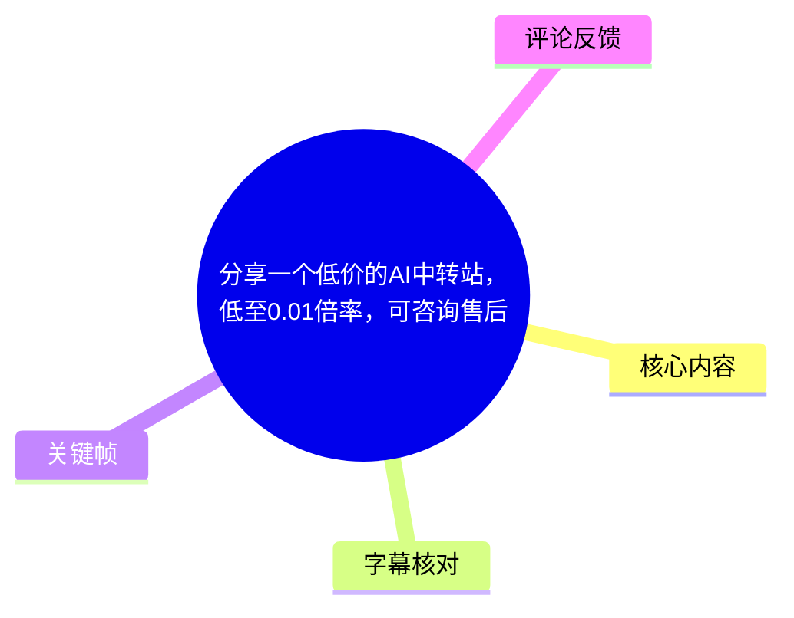
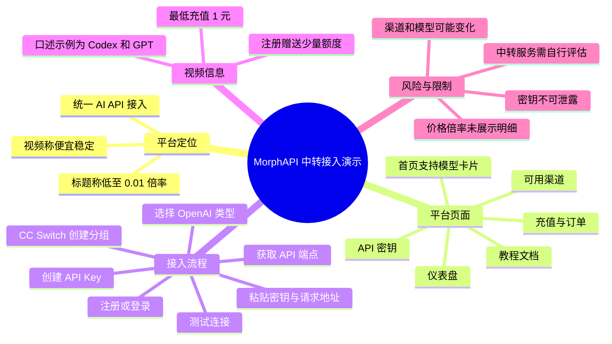
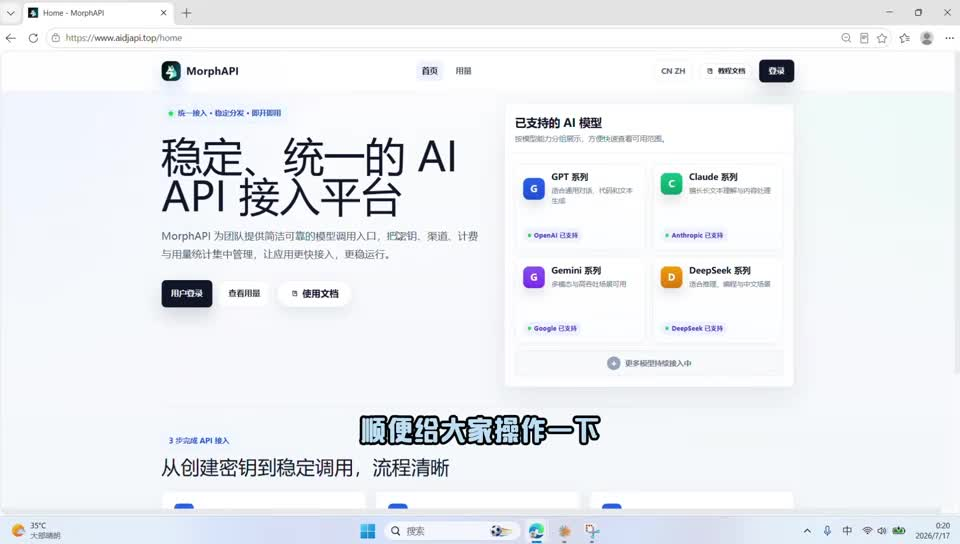
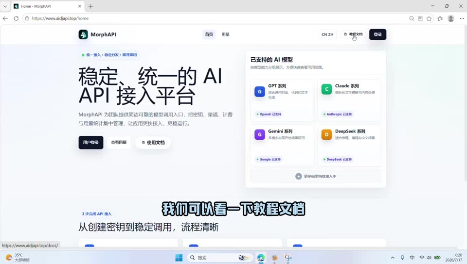
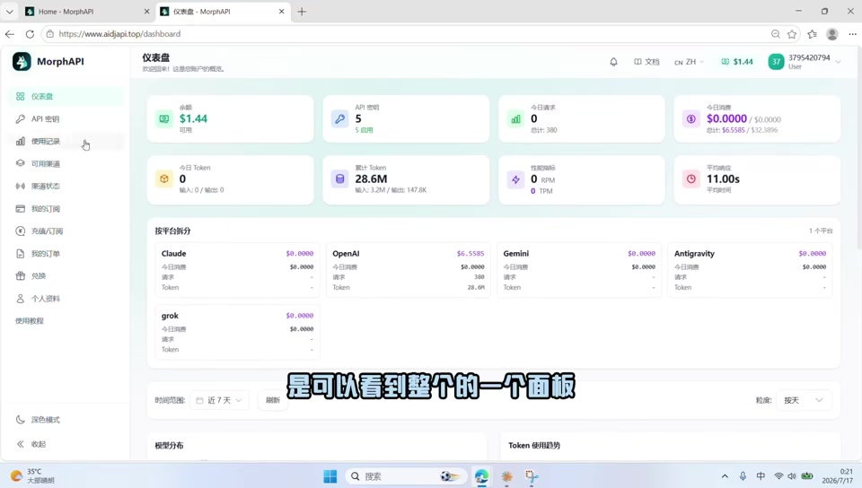

# 分享一个低价的AI中转站，低至0.01倍率，可咨询售后

> 来源：[Bilibili 视频](https://www.bilibili.com/video/BV19kKL6nELT)<br>
> UP 主：尝试走向美好的未来｜时长：2 分 27 秒｜合集：AIcode  
> 标签：人工智能、大数据、深度学习

## 小结

视频演示了一个名为 **MorphAPI** 的 AI API 中转平台，并以其网页控制台为例，说明如何注册、创建 API 密钥、查看渠道与充值记录，以及如何将 API 端点和密钥配置到 **CC Switch** 中。

UP 主的核心操作路径是：进入平台文档与登录页 → 注册并获得少量免费额度 → 在控制台创建 API Key → 复制 API 端点与密钥 → 在 CC Switch 中选用 OpenAI 类型配置、创建分组、粘贴参数并测试连接 → 再以 API Key 登录/使用 CC Switch。

视频口述称当前可使用 “Codex 和 GPT”，但画面首页的“已支持的 AI 模型”区域还展示了 GPT、Claude、Gemini、DeepSeek 等系列；这表明平台页面展示的能力范围与口述示例不完全相同。具体可调用模型、渠道可用性、模型名称与计费规则均应以实际账户中的“可用渠道”和官方文档为准。

标题中“低至 0.01 倍率”属于标题宣传语；本视频口述中**没有展示 0.01 倍率对应的具体模型、计费表、单位、适用条件或结算示例**。视频明确展示/说明的金额信息只有“注册赠送一点免费额度”和“最低可充值 1 元”。因此，不能据此推导任意模型均按 0.01 倍率计费。

这份内容适合需要为开发测试、接口调试或 AI 应用接入配置第三方 API 的用户参考。它是一次基础接入演示，而非对平台稳定性、隐私政策、模型真实性、可用地区、限流规则或长期价格的独立验证。

## 思维导图





## 目录

- [平台与演示范围](#平台与演示范围-000001)
- [首页、文档与账户控制台](#首页文档与账户控制台-000012)
- [密钥、渠道与充值信息](#密钥渠道与充值信息-000043)
- [接入 CC Switch 的实际步骤](#接入-cc-switch-的实际步骤-000108)
- [连接测试与使用方式](#连接测试与使用方式-000206)
- [参数、经验与限制](#参数经验与限制)
- [字幕比对](#字幕比对)
- [评论分析](#评论分析)
- [处理记录](#处理记录)

## 平台与演示范围 [00:00:01](https://www.bilibili.com/video/BV19kKL6nELT?t=1)

视频开场将 MorphAPI 介绍为“便宜稳定的中转站”，并说明会顺带演示“怎么用中转站来使用 Codex”。这里的“中转站”可理解为：用户不直接向模型厂商接口发起请求，而是使用第三方平台提供的统一 API 端点和密钥进行调用。

需要区分以下三类信息：

1. **视频作者的陈述**：平台“便宜稳定”、可用于 Codex，且后续提到 GPT。
2. **画面可见信息**：首页标题为“稳定、统一的 AI API 接入平台”；模型卡片列出 GPT、Claude、Gemini、DeepSeek 系列，并标注相应上游名称。
3. **尚未被视频验证的信息**：稳定性指标、具体价格倍率、模型调用质量、请求日志处理方式、隐私与数据保留政策、并发/速率限制、故障补偿等。



> 图：关键帧显示 MorphAPI 首页，左侧写有“稳定、统一的 AI API 接入平台”，右侧“已支持的 AI 模型”列出 GPT、Claude、Gemini、DeepSeek 系列。这张图用于核对视频所称平台定位与页面展示的模型范围，而非证明所有模型在任意账户中均可调用。

## 首页、文档与账户控制台 [00:00:12](https://www.bilibili.com/video/BV19kKL6nELT?t=12)

### 首页与教程文档 [00:00:12](https://www.bilibili.com/video/BV19kKL6nELT?t=12)

UP 主进入平台首页后，指出顶部可查看“教程文档”，并在约 00:19 展示接入文档页面入口，评价其“步骤还是很详细的”。

画面中首页提供了：

- “用户登录”入口；
- “查看用量”入口；
- “使用文档”入口；
- 顶部“文档”导航；
- 已支持模型的概览卡片。

视频没有逐页朗读文档内容，也没有展示具体 API 协议、请求体字段、模型 ID 或鉴权 Header。因此，接入时不能仅依赖本视频的口述，应以平台当时的接入文档为准。



> 图：关键帧突出鼠标所在的“教程文档/文档”入口，说明视频建议用户优先查阅平台文档。它的价值在于确认文档入口确实被展示，而不是替代文档正文。

### 注册、登录与仪表盘 [00:00:25](https://www.bilibili.com/video/BV19kKL6nELT?t=25)

视频说明：

1. 点击登录；
2. 没有账号可以注册；
3. 注册会赠送“一点免费的额度”；
4. 登录后进入仪表盘，可查看账户面板。

仪表盘左侧可见的菜单包括“仪表盘”“API 密钥”“使用记录”“可用渠道”“渠道状态”“我的订阅”“充值/订阅”“我的订单”“兑换”“个人资料”“使用教程”等。该菜单说明平台把密钥管理、用量记录、渠道查看、充值订单等功能集中在控制台中。

画面中的某个示例账户显示余额 `$1.44`、API 密钥数量 `5`、累计 Token `28.6M` 等数据。它是录屏账户当时的状态，**不能视为新注册用户默认余额、免费额度数量或普遍用量表现**。



> 图：关键帧展示加载完成的仪表盘及左侧菜单，面板包含余额、API 密钥、请求/Token 等概览项。它帮助理解后续“API 密钥”“使用记录”“可用渠道”等入口所处的位置；数值仅为录屏示例。

## 密钥、渠道与充值信息 [00:00:43](https://www.bilibili.com/video/BV19kKL6nELT?t=43)

### 创建 API Key 与查看渠道 [00:00:43](https://www.bilibili.com/video/BV19kKL6nELT?t=43)

UP 主说明，实际使用时应在“API 密钥”页面创建 API Key；同一控制台还可查看使用记录与可用渠道。约 00:54 的口述为“目前的话是有 Codex 和 GPT 的”。

这里有两项重要的字幕校正：

- 站内字幕写作“可录的和 GBT 的”，结合开场“使用 Codex”、ASR 的 “Codex 和 GBT”以及上下文，应整理为 **Codex 和 GPT**；
- “GBT”应为常见的 **GPT**，但视频并未给出具体模型版本。

平台首页画面所列模型比口述示例更广。两者可能分别是首页的总体支持范围与该账户当时的可用/演示选择，但视频没有明确解释差异，不能将其直接等同。

### 充值与订单 [00:00:59](https://www.bilibili.com/video/BV19kKL6nELT?t=59)

视频明确给出两项账户资金相关信息：

| 项目 | 视频信息 | 可确认范围 |
| --- | --- | --- |
| 注册额度 | 注册会送“一点免费的额度” | 未展示额度数额、有效期或领取条件 |
| 最低充值 | 最低可以充值 `1 元` | 未展示支付渠道、到账规则、退款规则或不同套餐限制 |
| 充值记录 | 可在“订单”中查看 | 未展示订单详情字段与结算方式 |

标题的“低至 0.01 倍率”没有在此处被展开。视频没有展示模型倍率表，也没有把“1 元最低充值”与“0.01 倍率”建立计算关系。进行付费前，应在当时可见的价格页面、模型计费说明及订单规则中核验价格与单位。

## 接入 CC Switch 的实际步骤 [00:01:08](https://www.bilibili.com/video/BV19kKL6nELT?t=68)

视频从约 01:08 开始进行接入演示。按站内字幕与 ASR 的共同语义，可整理为如下流程。

### 1. 在中转平台创建密钥 [00:01:08](https://www.bilibili.com/video/BV19kKL6nELT?t=68)

1. 进入 API 密钥创建页面。
2. 创建一个名称。
3. 视频称名称“随便填一个无所谓”，即它用于区分密钥用途；但视频未说明字符长度、是否可修改或命名规范。
4. 选择要使用的“模型”。  
   - 站内字幕与 ASR 均误识别为“分子”；
   - 从上下文“选择你要用的……”及首页模型卡片可判断，此处应是选择模型/模型相关项。
5. 点击“创建”。
6. 创建后保留两项配置：**API 端点（API Endpoint）** 与 **API Key**。

可抽象为：

```text
中转平台
  ├─ API Endpoint：请求地址 / Base URL
  └─ API Key：鉴权凭证
```

视频没有展示完整 API Key 或 API Endpoint 的明文，这一处理符合安全常识。使用时也不应把真实密钥发布到截图、代码仓库、聊天记录或前端页面中。

### 2. 在 CC Switch 中选择兼容类型 [00:01:31](https://www.bilibili.com/video/BV19kKL6nELT?t=91)

UP 主随后打开 **CC Switch**（站内字幕为“cc switch”，ASR 误识别为“CZSwitch”），并说明：

1. 根据自己使用的服务类型进行选择；
2. 本例使用 GPT；
3. 因而选择 **OpenAI** 类型；
4. 创建一个分组。

这意味着该示例将该中转接口按 OpenAI 类型接入 CC Switch。视频未说明 CC Switch 的版本、下载来源、支持平台，也未展示 OpenAI 兼容接口的协议检测结果；如果实际平台协议不同，应以平台文档和 CC Switch 的对应类型为准。

视频在约 01:45 有一句站内字幕为“听歌的话天生”、ASR 为“名字的话天生”，语义不清且无足够画面/上下文支撑，不能可靠还原。可确定的是：此处仍处于创建分组及命名配置阶段。

### 3. 粘贴 Key 与请求地址 [00:01:49](https://www.bilibili.com/video/BV19kKL6nELT?t=109)

UP 主给出的字段对应关系如下：

| CC Switch 配置项 | 应填内容 | 视频依据 |
| --- | --- | --- |
| API Key | 从中转平台创建的 API Key 复制粘贴 | 01:49—01:56 |
| 请求地址 | 从中转平台复制的 API Endpoint | 01:57—02:02 |
| 服务类型 | 本例选择 OpenAI | 01:40—01:42 |
| 分组 | 新建分组后填入上述配置 | 01:42 起 |

配置逻辑可写为：

```text
CC Switch 分组
  服务类型 = OpenAI（本视频示例）
  API Key = 中转平台创建的 API Key
  请求地址 = 中转平台提供的 API Endpoint
```

视频没有给出实际 URL、完整密钥、模型名或额外参数。因此不应自行补填 `/v1`、模型别名、组织 ID、代理地址等字段；这些信息需以当时的平台文档与客户端字段说明为准。

## 连接测试与使用方式 [00:02:06](https://www.bilibili.com/video/BV19kKL6nELT?t=126)

UP 主完成粘贴后，说明依次：

1. 点击“添加”；
2. 切换到刚创建的分组；
3. 测试连接；
4. 测试结果“正常”；
5. 重新打开 CC Switch；
6. 使用复制的 API Key 登录/使用即可。

视频只展示了作者环境中的一次“测试连接正常”，没有展示请求响应正文、HTTP 状态码、模型实际输出、失败重试、流式响应、余额扣除或长时间稳定性测试。因此该测试仅能证明：录屏时该配置在作者环境中可通过客户端的连接测试，不能外推为所有账号、所有模型、所有地区持续可用。

## 参数、经验与限制

### 可复用的接入经验

- **先读文档，再复制参数**：视频虽快速演示配置，但 API 端点、兼容协议与模型列表都可能变化；应先核对当前文档。
- **密钥和请求地址成对配置**：仅有 API Key 不足以完成第三方中转接入，客户端通常还需要指定对应的 API Endpoint。
- **按协议选择客户端类型**：视频中的 GPT 示例选择 OpenAI 类型；不要将这一选择机械套用到所有模型或所有服务。
- **先做连接测试**：添加配置后切换到目标分组并测试连接，是发现端点、密钥或协议错误的低成本步骤。
- **单独分组便于隔离**：为不同平台、模型用途或测试环境创建独立分组，便于切换与排查；这是对视频“创建一个分组”操作的通用化整理。

### 关键限制与风险

1. **价格不可由标题直接验证**：视频未展示“0.01 倍率”的模型、计费单位、上下文长度、输入/输出差异、缓存计费或活动期限。
2. **“稳定”未经压测证明**：没有展示 SLA、连续调用成功率、延迟分布、限流阈值或故障处理机制。
3. **模型与渠道是动态信息**：视频录制时口述的 Codex/GPT、首页展示的 GPT/Claude/Gemini/DeepSeek，以及账户内实际“可用渠道”可能不同，且会随时间调整。
4. **第三方中转涉及数据与密钥风险**：调用内容可能经由第三方服务转发。对于源代码、商业数据、个人数据和生产密钥，应在使用前审阅服务条款、隐私/日志策略和团队安全要求。
5. **视频未覆盖生产级配置**：没有涉及环境变量管理、密钥轮换、配额告警、请求重试、错误码处理、权限隔离或审计日志。
6. **时效性**：视频元数据抓取时间为 2026-07-21；页面布局、余额、支持模型、最低充值和接入方式均可能在此后变化。应以实时控制台、订单页和官方文档为最终依据。

## 字幕比对

| 字幕来源 | 完整性 | 专有名词 | 时间轴 | 主要问题 |
| --- | --- | --- | --- | --- |
| Bilibili 站内字幕 | 较完整，分段细，覆盖约 00:01—02:24 | “Codex”在部分位置误为“可录”；“GPT”误为“GBT”；“模型”误为“分子” | 精细，可直接用于章节定位 | 个别口语句不清，如约 01:45 的命名描述 |
| 本次 ASR 字幕 | 覆盖 126.92 秒语音，语音覆盖率 86.71%，覆盖约 00:01.07—02:24.30 | “中转站”误为“中轢站”，“文档”误为“文竅”，“Endpoint”误为“钻点”，“CC Switch”误为“CZSwitch” | 有时间戳，但每段较长 | 识别段落粒度较粗，专有名词和同音词错误较多 |

### 最终字幕选择与校正

本次已检查 ASR 结果：识别语言为中文，模型为 `medium`，`languageProbability` 为 `0.99560546875`，ASR 诊断未标记 `noAudioStream=true`，且音频语音覆盖诊断正常。因此，本视频**存在可识别音轨**，不属于“源视频没有音轨”的情形。

正文以**站内 SRT 的细粒度时间轴**作为主要定位依据，并以本次 ASR 对照确认语义连续性；以下词语结合两份字幕、画面与上下文进行了谨慎校正：

- “GBT” → **GPT**；
- “可录的” → **Codex**；
- “分子” → **模型**；
- “API 钻点” → **API 端点（API Endpoint）**；
- “CZSwitch” → **CC Switch**；
- “教程文章/接入文竅” → **教程文档/接入文档**。

约 01:45—01:48 的分组命名相关语句，两种字幕均无法提供可靠文本，正文保留为“创建分组及命名阶段”，不强行补写。

## 评论分析

仅处理可获取的热评前三条；评论均为用户或作者个人表述，不能替代对平台能力、价格、安全性或售后服务的验证。

1. **敲碎每一块砖**  
   - 观点：认可“中转不是不可用”，认为需要筛选适合自己的服务；其个人测试感觉部分中转与官网差异不大、价格较低。  
   - 价值：补充了用户选择中转服务时应关注筛选与实际测试的经验。  
   - 限制：未提供测试模型、提示词、延迟、成功率、价格样本或测试时间，因此“所差无几”和“价格很香”不可泛化。

2. **QT008**  
   - 观点：提及一名盲人开发者借助读屏软件写代码，并附带一个 QQ 群的无障碍支持信息。  
   - 价值：反映 API 调试工具和开发社区中的无障碍需求。  
   - 限制：该评论没有提供与本视频平台接入、模型价格或服务稳定性直接相关的可验证证据；群信息亦未在视频中演示。

3. **尝试走向美好的未来（UP 主）**  
   - 观点：称站点地址可从视频中找到，也可进群获取；将 Morph API 描述为适用于开发测试、接口调试和 AI 应用接入的中转服务，并提供 QQ 群 `626746626` 用于接入、调用、账户配置和售后咨询。  
   - 价值：补充了作者声称的咨询与反馈渠道，也与标题“可咨询售后”相呼应。  
   - 限制：这是发布者自身的宣传/指引，不构成第三方对服务稳定性、模型“未掺水”、售后响应速度或长期可用性的独立背书。

## 处理记录

- Worker ID：`worker-mrj0www4-e8d79408`
- 整理模型：`gpt-5.6-terra`
- 已检查的素材与工具产物：视频元数据、站内字幕 `p01-ai-zh.srt`、本次 ASR 结果 `asr/asr-result.json`、ASR SRT `asr/transcript.srt`、热评数据 `comments/comments.json`、关键帧目录 `frames/`。
- ASR 模型：`medium`；设备 `cuda`；计算类型 `float16`；已确认存在音频识别结果，未出现 `noAudioStream=true`。
- 字幕选择：以站内 SRT 的细分时间戳作为章节链接依据；结合 ASR 复核语义，对 Codex、GPT、API Endpoint、CC Switch、模型等识别错误进行校正；无法可靠还原的 01:45 附近语句不补写。
- 关键帧选择依据：选用 `frame-001.jpg` 核对平台定位及首页模型卡片，`frame-002.jpg` 核对文档入口，`frame-004.jpg` 核对仪表盘和功能菜单；未将画面中示例账户余额、密钥数量或 Token 数量泛化为平台承诺。
- 缓存清理：提供的素材未包含缓存清理执行日志；无法确认是否已清理，故不声称已完成清理。
- 未解决问题：未提供平台完整价格表、倍率规则、完整 API 文档、CC Switch 版本信息、实际请求响应、隐私条款、服务等级协议及长期可用性测试数据。
