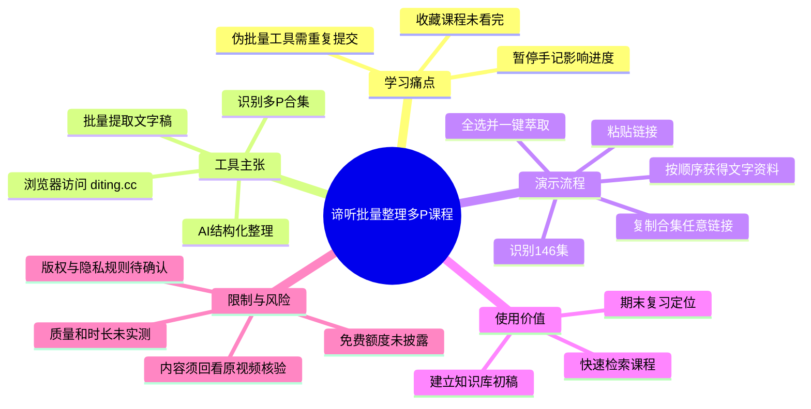

# 【谛听工具直达】➜ diting.cc：一键整理 B 站多 P 合集文案

> 来源：[Bilibili 视频](https://www.bilibili.com/video/BV1qmouBhEyY) 
> UP 主：谛听安途｜发布时间：2026-04-23｜视频时长：01:18｜分区合集：AIcode  
> 视频描述提供的入口：`diting.cc`（UP 主称电脑、手机浏览器可直接使用，且有免费额度）

## 小结

这是一条推广并演示「谛听（Diting）」网页工具的短视频。视频针对“收藏了大量多 P 课程却没有逐集看完”的学习场景，提出以批量提取视频文字稿、再由 AI 整理为结构化资料的方式，替代边看边暂停手记的流程。

视频展示的核心操作可概括为三步：从一个 B 站多 P 合集复制任意视频链接；粘贴到谛听；由工具识别合集分 P、进行批量选择并执行“一键萃取”。演示口播以一个包含 **146 集**的机器学习课程合集为例，称处理完成后可得到按原顺序打包的全部文字稿。

UP 主在视频说明与简介中宣称，工具可把多 P 或几十集连播内容整理成 Markdown 文字笔记和思维导图，并支持导出；还宣称网页端可免费使用。不过，这些均属于视频作者的产品陈述：素材没有提供真实导出文件、处理耗时对照、额度规则、支持格式清单或准确率测试，因此不能将其视为已经独立验证的性能结论。

适合的读者是需要回顾长课程、检索课程内容、建立资料索引的学习者。更合理的使用方式是将提取结果作为“定位与初稿工具”，再回到原视频核对公式、代码、图表、语气和上下文；不能把文字稿直接等同于完成学习，更不应把它当作课程原始内容的无误替代品。

时效性方面，视频发布于 2026-04-23，页面入口、免费额度、批量数量上限、导出格式、B 站页面兼容性及处理速度均可能随服务更新而变化。实际使用前应以 `diting.cc` 当时展示的规则、隐私说明和版权提示为准。

## 思维导图

## 目录

- [背景：长合集学习的效率问题](#背景长合集学习的效率问题)
- [工具定位与演示场景](#工具定位与演示场景)
- [三步操作：从链接到批量文字稿](#三步操作从链接到批量文字稿)
- [产物、学习价值与可迁移经验](#产物学习价值与可迁移经验)
- [限制、时效性与使用边界](#限制时效性与使用边界)
- [字幕比对](#字幕比对)
- [评论分析](#评论分析)
- [处理记录](#处理记录)

## 背景：长合集学习的效率问题 [00:00](https://www.bilibili.com/video/BV1qmouBhEyY?t=0)

视频开场以 B 站收藏页和课程播放场景建立问题：用户可能收藏了大量课程，却难以持续逐集观看。画面字幕与后续口播将问题归因于低效学习流程，包括倍速观看时需要频繁暂停、手写或手打笔记打断观看节奏，以及所谓“伪批量”工具需要对每一集重复提交。

需要注意：**00:00—00:37 没有可用的 ASR 语音分段**，本节的时间点依据视频总时长与关键帧画面，而不是猜测出的字幕时间。该段画面能确认视频在呈现上述学习情境，但不能据此补写未被语音或画面明确表达的功能细节。

> 图：关键帧展示 B 站收藏/视频缩略图列表，并在画面下方强调“收藏的 B 站课程 99% 都没看完”。它说明该视频瞄准的是课程收藏积压与复习效率问题，而非普通单视频下载需求。

> 图：画面以课程播放页面配合“暂停记，永远追不上进度条”的字幕，直观呈现作者批评的边看边记笔记流程。该图的价值在于界定工具试图替代的是“文本整理”环节，不是替代课程本身。

> 图：画面字幕称一些“伪批量”工具需要重复提交 50 次。这里应理解为作者的痛点描述和营销性对比，并非对其他工具进行过可复现的统一测评。

## 工具定位与演示场景 [00:37](https://www.bilibili.com/video/BV1qmouBhEyY?t=37)

从本次 ASR 在 **00:37.060** 开始的口播可整理出视频的明确主张：

- 该工具名为“谛听”；ASR 将其误识别为“地听”，但视频标题、右上角水印和简介均写作“谛听 / Diting”。
- 演示对象是一个机器学习/深度学习相关的 B 站多 P 课程合集。
- 口播称工具可自动识别该合集的 **146 个分 P**，再进行分批或批量选择。
- 口播将最终结果描述为：用户可以离开页面，回来时获得 **146 集视频的全部文字稿**，并且内容已经按顺序打包。
- 视频简介额外宣称可在数秒内将内容整理为 Markdown 文字笔记和思维导图；这一点没有在可读的 ASR 口播中获得完整重复确认，应标记为简介中的产品描述。

“146 集”是演示中的个案规模，不等于平台已公开承诺的通用上限。素材也没有说明识别失败时的处理机制、是否支持失效链接、付费视频、分区限制、字幕缺失视频、直播回放、互动视频或地区限制内容。

## 三步操作：从链接到批量文字稿 [00:37](https://www.bilibili.com/video/BV1qmouBhEyY?t=37)

视频在 **00:37.060—00:37.960** 的 ASR 段中连续给出操作流程。由于该段被 ASR 压缩为约 0.9 秒且断句质量较差，以下步骤结合画面与能确认的口播含义整理，不添加素材外的网页操作细节。

### 1. 复制多 P 合集中的任意链接

在 B 站打开目标课程合集，复制其中任意一个视频页面链接。演示画面是一个“Introduction to Deep Learning”课程页，右侧可以看到分 P 列表。

> 图：关键帧展示 B 站深度学习课程播放页与右侧分集栏，底部字幕明确写有“复制你的【机器学习课程】合集中的任意链接”。它为“从合集内任意分 P 链接开始”的操作提供了直接画面依据。

### 2. 将链接粘贴到谛听网页

根据口播，将复制的链接粘贴至谛听。视频标题和简介均称访问方式为在电脑或手机浏览器中打开 `diting.cc`。

这里能确认的是“粘贴链接”这一动作；素材没有展示可辨识的输入框字段名、登录要求、验证码、链接解析等待状态或移动端界面布局。因此，这些具体交互不能从本视频推出。

### 3. 确认识别结果，批量选择并“一键萃取”

口播称工具“自动识别 146 个”，之后“分批一键全选”，再点击“一键萃取”。可按如下顺序理解：

1. 等待工具从链接对应页面识别合集及其分 P；
2. 检查识别出的数量和分集范围是否符合预期；
3. 选择需要处理的分集；视频提及全选，也提及“分批”，但未说明二者在界面上的确切关系；
4. 点击“一键萃取”，等待后台处理；
5. 处理完成后查看按原顺序汇集的文字稿。

视频没有提供实际按钮截图的清晰特写，也未给出任务队列、重试、取消、批量上限、文件命名、导出路径或错误提示。因此，上述流程应作为演示级操作说明，而非完整的产品使用手册。

## 产物、学习价值与可迁移经验 [00:37](https://www.bilibili.com/video/BV1qmouBhEyY?t=37)

口播把结果定位为“把 B 站变成私人知识库”，并将应用场景指向期末冲刺和快速复习。结合视频描述，可将作者意图拆解为三个层次：

| 层次 | 视频中可确认的内容 | 合理用途 |
| --- | --- | --- |
| 原始文本层 | 多集视频的文字稿按顺序打包 | 全文搜索、查找某个概念出现的位置 |
| 结构化整理层 | 简介称可生成 Markdown 笔记、思维导图 | 快速浏览课程模块、建立复习提纲 |
| 学习回路层 | 作者主张节省逐集处理的时间 | 先读结构与检索结果，再回到关键视频段精学 |

可迁移的经验不是“彻底不看视频”，而是把长视频学习分为不同任务：

- **定位阶段**：通过目录、文本和关键词缩小范围；
- **理解阶段**：回看原始视频中涉及推导、演示、代码运行、语气强调与屏幕细节的部分；
- **复盘阶段**：把确认过的观点重组为自己的问题清单、笔记或练习。

视频中“真的关掉页面”“一次赎回几十小时”等表达属于宣传性措辞。文字提取可以降低检索与整理成本，但能否节约相应时间，取决于视频长度、语言清晰度、课程复杂度、工具排队时间、用户校对深度及是否需要观看视觉内容。

## 限制、时效性与使用边界 [01:02](https://www.bilibili.com/video/BV1qmouBhEyY?t=62)

在 **01:02.020—01:17.800** 的结尾口播中，作者引导用户前往置顶评论链接体验，并称有“免费额度”。结合标题、简介和可用素材，使用时应注意以下边界。

### 功能与参数：已知与未知

| 项目 | 素材可支持的说法 | 未提供或未验证的信息 |
| --- | --- | --- |
| 入口 | `diting.cc`；作者称电脑/手机浏览器可打开 | 服务可用地区、系统版本与浏览器兼容列表 |
| 输入 | B 站多 P 合集内的任意链接 | 是否支持单 P、播放列表、直播、失效链接及受限内容 |
| 识别规模 | 演示个案识别 146 集 | 最大集数、最大总时长、并发任务数 |
| 操作 | 识别分集、选择、点击“一键萃取” | 选择规则、失败重试与任务管理机制 |
| 输出 | 口播称按顺序打包的文字稿；简介称 Markdown、思维导图和导出 | 实际文件格式、导出渠道、保存期限和版本控制 |
| 费用 | 作者称免费、置顶链接有免费额度 | 免费额度数量、刷新周期、超额价格及商业条款 |
| 时效 | 发布日为 2026-04-23 | 当前服务状态与功能是否仍保持一致 |

### 内容质量、版权与隐私

1. **转写并非原始事实本身**：专业术语、人名、英文、公式、代码、屏幕文字和同音词都可能出现误识别。本视频自身 ASR 对“谛听”等词已有明显误识别，正说明转写结果需要复核。
2. **视觉信息不能只靠文稿替代**：编程演示、PPT 图表、公式推导、时间轴操作和讲师板书，常有关键内容并未被语音覆盖。
3. **链接与学习记录可能涉及隐私**：在第三方网页提交视频链接前，应自行阅读该服务的隐私政策、数据保留和删除规则；素材未提供这些规则，不能假定其处理方式。
4. **应尊重内容版权和平台规则**：批量整理适合个人学习与检索，不应据此绕开授权、重新发布他人课程内容，或将提取文本用于未经许可的商业分发。
5. **“免费”不是永久保证**：视频仅称“免费”及“有免费额度”，没有给出服务承诺期限。应以使用时的页面信息为准。

## 字幕比对

站内未提供可用字幕，但仍已检查本次 ASR。ASR 诊断显示：音频存在，语言识别为中文，时长约 **77.83 秒**；语音覆盖约 **40.74 秒（52.34%）**，首段语音从 **00:37.060** 开始，未标记 `noAudioStream=true`。因此，不能将前半段缺少 ASR 文本归因为“无音轨”；更准确的说法是：本次 ASR 未在前半段输出可用语音分段。

| 字幕来源 | 完整性 | 专有名词 | 时间轴 | 主要问题 |
| --- | --- | --- | --- | --- |
| Bilibili 站内字幕 | 未提供可用站内字幕 | 无法评估 | 无法评估 | 素材目录明确标注未提供，不能用于正文转写 |
| 本次 ASR 字幕 | 覆盖视频后约 40.74 秒；前 37 秒无文本 | 较差，存在明显同音/断词错误 | 有真实 SRT 时间段：00:37.060—00:37.960、00:37.960—01:02.020、01:02.020—01:17.800 | 第 1 段时长异常短却包含大量内容；断句混乱，且“谛听”“批量”“学习焦虑”等词有误识别 |

最终采用策略：

- **时间轴**：对有语音的三个主题节点，使用本次 ASR SRT 的真实起始时间；开场画面章节使用 `t=0`，并明确其没有 ASR 分段支撑。
- **文字内容**：以 ASR 可辨识语义为基础，结合标题、简介和关键帧交叉校正，不将 ASR 的错误字面直接照录。
- **关键术语校正**：  
  - ASR“地听”校正为 **谛听 / Diting**，依据标题、UP 主账号及画面水印；  
  - ASR“多批视频”“尾批量”等混乱表述，按画面字幕和标题理解为 **多 P 合集、批量提取**；  
  - ASR“学乡焦虑”按语义理解为“学习焦虑”，但该表达仅用于结尾宣传语，不影响功能流程事实。

## 评论分析

素材实际仅获取到 **2 条**热评，未达到“热评前三条”的数量；以下仅分析可获取内容，不将评论当作功能验证。

1. **花生补眠中（4 赞）**：“质量好高～已三连啦，回关一下呀up[星星眼]”  
   - 观点：表达对视频制作质量的正向评价，并称已完成点赞、投币、收藏等互动。  
   - 补充信息：没有涉及工具成功率、价格、速度或导出质量。  
   - 可信度边界：属于主观支持与互动请求，不能证明产品能力。

2. **Kateni_Channel（3 赞）**：“已体验”  
   - 观点：声称已经使用过该服务。  
   - 补充信息：未说明输入的视频类型、处理集数、耗时、输出质量、是否付费或是否遇到错误。  
   - 可信度边界：可作为存在用户尝试的弱信号，但没有可复核细节，不能据此确认工具效果或免费政策。

3. **第三条热评**  
   - 未获取到。评论素材返回的 `items` 仅含上述两条，故不补造第三条评论或观点。

## 处理记录

- Worker ID：`worker-mrj0wjed-b0c290ad`
- 模型：`gpt-5.6-terra`
- 可用素材与工具产物：视频元数据、关键帧目录 `frames/`、音频 `audio/audio.wav`、本次 ASR 结果 `asr/asr-result.json`、ASR SRT `asr/transcript.srt`、热评数据 `comments/comments.json`。
- ASR 配置与结果：Whisper `medium`，语言自动识别为中文（概率 `1`），CUDA / `float16`；存在音频流，未出现 `noAudioStream=true`。
- 字幕选择：站内字幕未提供可用文件；检查并使用本次 ASR 的真实时间分段作为后半段时间轴依据。对低置信的错词，使用视频标题、简介、画面水印和关键帧进行有限校正。
- 关键帧选择依据：  
  - `frame-001.jpg`：呈现收藏课程未完成的核心痛点；  
  - `frame-002.jpg`：呈现暂停记笔记导致追不上进度的学习摩擦；  
  - `frame-003.jpg`：呈现作者对重复提交式“伪批量”流程的对比；  
  - `frame-004.jpg`：直接展示 B 站课程合集页及“复制任意链接”的第一步。  
  关键帧文件未附逐帧时间戳，因此未把它们的文件序号伪造为精确视频时间。
- 缓存清理：本任务提供的素材清单未包含缓存清理日志；未据此虚构已清理的文件或目录。
- 未解决问题：无法从现有素材验证当前网站可访问性、免费额度具体规则、支持范围、146 集之外的上限、真实导出格式、转写准确率、数据处理政策及批量任务失败后的行为。
