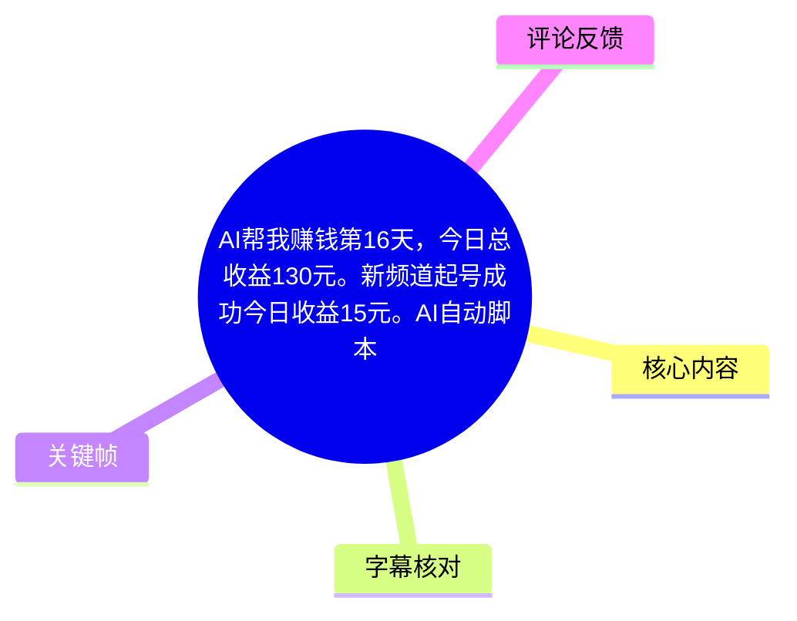
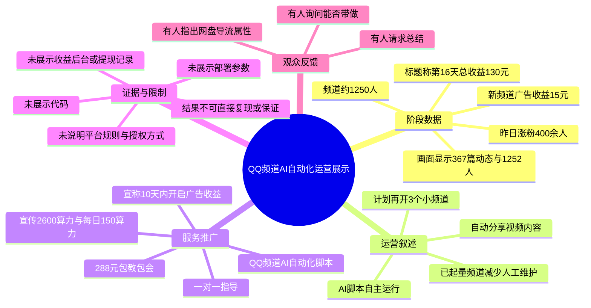
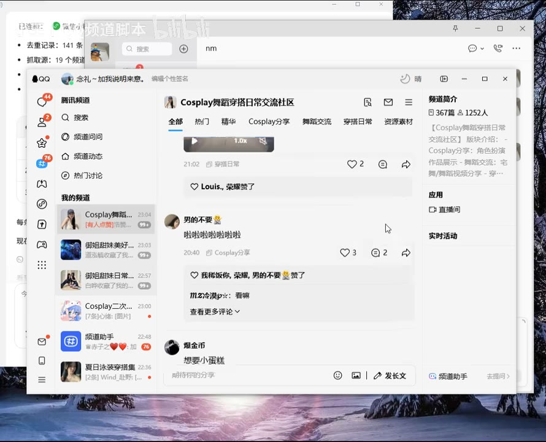

# AI帮我赚钱第16天，今日总收益130元。新频道起号成功今日收益15元。AI自动脚本教程

> 来源：[Bilibili 视频](https://www.bilibili.com/video/BV1yB7T63EBq)  
> UP 主：小王丨QQ频道脚本｜时长：2 分 36 秒｜合集：AIcode  
> 标签：AI、教程、AI全自动脚本、脚本、频道、赚钱、收益、新项目  
> 说明：视频中的收益、涨粉、成本、服务效果及“包教包会”等均为 UP 主口播或录屏中的营销表述；给定素材未包含平台官方规则、完整后台账单、提现记录或脚本源码，不能据此视为可独立验证的收益承诺。

## 小结

这是一则围绕 **QQ 频道内容自动化运营** 的阶段展示和脚本服务推广视频。UP 主称其“AI 脚本”正在自主运行，并以一个 Cosplay、舞蹈、穿搭主题的新频道为例，展示频道内容流、成员规模及其所谓的广告收益。

视频标题称“AI 帮我赚钱第 16 天”“今日总收益 130 元”；口播中重点提到另一小号“起号成功”，其“昨日涨粉 400 多人”“广告收益 15 块钱”，频道当前约有 1,250 人。关键帧中的频道侧栏显示“367 篇动态，1252 人”，可作为频道当时页面规模的画面佐证，但无法证明收益来源、结算状态或涨粉归因。

UP 主对方法的实际展示有限：其核心叙述是让脚本自主分享内容，在一个频道有一定规模后减少人工维护，再重新开设 3 个小频道同步运行。视频未展示代码、安装流程、运行环境、平台接口、素材来源、审核机制、发布频率、广告资格规则或故障处理，因此它不是可直接复现的技术教程。

后半段为服务转化。画面中出现“QQ频道AI自动化脚本，288 包教包会”“10 天内开启广告收益”“2600 算力”“新用户每天还能领 150 算力”“全程一比一指导”等宣传文字；这些属于卖方宣传，适用条件、有效期、收费边界和平台合规性均未在素材中得到充分说明。

视频记录的是 2026 年 6 月附近的单次展示。QQ 频道的推荐、广告资格、内容审核、账号风控、第三方自动化工具政策及算力活动都可能随时间变化；“昨日涨粉”“今日收益”“10 天内开启广告收益”等尤其不能直接外推为稳定结果。

## 思维导图

## 目录

- [背景、定位与时效性](#背景定位与时效性)
- [新频道的增长、收益与页面规模](#新频道的增长收益与页面规模)
- [脚本自主运行与内容发布说法](#脚本自主运行与内容发布说法)
- [多频道复制计划](#多频道复制计划)
- [脚本服务宣传、价格与参数](#脚本服务宣传价格与参数)
- [可迁移经验、限制与风险](#可迁移经验限制与风险)
- [字幕比对](#字幕比对)
- [评论分析](#评论分析)
- [处理记录](#处理记录)

## 背景、定位与时效性 [00:00](https://www.bilibili.com/video/BV1yB7T63EBq?t=0)

UP 主以“AI 帮我赚钱第 16 天”的进度汇报形式开场，内容对象是 QQ 频道运营及其自动化脚本。根据口播，视频主要承担两项作用：

1. **展示阶段性结果**：介绍脚本“自主运行”、新频道增长、频道成员规模和广告收益。
2. **推广脚本服务**：引导有学习需求的观众联系其微信、查看主页链接或获取标题中的夸克网盘链接。

理解视频内容时，需要把信息按证据强度区分：

| 信息层级 | 可确认内容 | 证据范围 |
| --- | --- | --- |
| 标题信息 | “第 16 天”“今日总收益 130 元”“新频道今日收益 15 元” | 来自视频标题；正文未展示 130 元构成 |
| UP 主口播 | 昨日涨粉 400 多人、广告收益 15 元、计划再起 3 个小频道 | 来自站内字幕与本次 ASR 的共同语义 |
| 画面可见信息 | 频道名称、内容分区、367 篇动态、1252 人、脚本服务宣传文字 | 可由给定关键帧核对 |
| 未提供的信息 | 收益后台、结算状态、提现记录、脚本代码、合规证明 | 给定素材中未见，不能补充推断 |

元数据快照显示：该视频抓取时有 3,104 播放、97 收藏、31 点赞、8 回复、7 分享、0 投币。这是抓取时的静态数据，不代表当前实时互动量。

## 新频道的增长、收益与页面规模 [00:13](https://www.bilibili.com/video/BV1yB7T63EBq?t=13)

### UP 主公布的阶段数据

UP 主称另一个“小号”也已“起号成功”，并围绕新频道给出下列数据：

| 指标 | 视频表述或画面 | 应如何理解 |
| --- | --- | --- |
| 总收益 | 标题称“今日总收益 130 元” | 标题口径；视频未拆分收入来源，也未展示后台明细 |
| 新频道广告收益 | “广告收益的话是 15 块钱” | 口播陈述；未显示结算页、提现状态或计费周期 |
| 昨日涨粉 | “昨日就是涨粉 400 多人” | 口播陈述；未提供增长曲线、来源分析或留存数据 |
| 当前成员数 | 口播称“1250 人” | 关键帧显示 1252 人；正文采用“约 1,250 人” |
| 已发布动态 | 频道侧栏显示“367 篇动态” | 可由频道页面画面直接核对 |

> 图：该帧展示名为“Cosplay舞蹈穿搭日常交流社区”的 QQ 频道页面。右侧栏可读到“367 篇动态，1252 人”，中部可见视频/动态内容及互动入口。其价值在于核对频道规模和内容形态；但页面本身不能证明 15 元广告收益已结算，也不能证明涨粉完全由 AI 脚本带来。

### 频道内容与定位

从关键帧可见，该频道至少在录制时围绕 Cosplay、舞蹈、穿搭等方向组织内容，并出现以下栏目或筛选项：

- 全部；
- 热门；
- 精华；
- Cosplay 分享；
- 舞蹈交流；
- 穿搭日常；
- 资源素材。

这说明频道并非完全空白的新建页面，而已有一定内容存量与栏目结构。不过，视频没有给出该频道创建日期、内容由谁生产、素材是否授权、每条内容的来源、人工审核比例或引流渠道。

### 画面中的频道交易讨论

> 图：该帧中的聊天内容涉及“4000 多人的频道”价值讨论，画面回复提到市场价、频道活跃度及单人价格等。它能说明录屏内存在与频道账号/成员规模估值相关的交流，但不构成任何频道交易已完成、价格真实有效或平台允许交易的证明。

画面文字显示有人询问“4000 多人的频道值大概多少钱”，回复中讨论“市场价差不多 400 多块钱”“一个人一毛钱这样子”等估值口径。由于聊天对象身份、交易是否发生、频道活跃标准、平台规则与价格真实性均无法从素材确认，不能把这些文字视为通行市场价格或可执行交易建议。

## 脚本自主运行与内容发布说法 [00:35](https://www.bilibili.com/video/BV1yB7T63EBq?t=35)

UP 主称“这个是今天脚本自主运行的”，并表示频道分享的视频内容“也都是高质量的”。其在视频中呈现的自动化逻辑可以概括为：

1. 使用所谓 AI 自动化脚本运行频道；
2. 持续向频道分享视频或动态；
3. 通过内容更新维持频道活跃；
4. 当频道被其认定为已经起量后，减少人工维护；
5. 再复制到其他小频道。

视频中没有展示脚本的实际技术实现，以下关键参数均缺失：

| 缺失项 | 对评估的重要性 |
| --- | --- |
| 编程语言、源码或交付形态 | 无法判断脚本是否可审计、可维护或是否包含风险代码 |
| 运行环境 | 不清楚需要本地电脑、服务器、云函数还是远程桌面 |
| QQ 登录与授权方式 | 无法评估账号密码、Cookie、扫码登录或机器人权限的安全风险 |
| AI 模型与提示词 | 无法判断“AI”在选题、生成、改写、审核或发布中具体承担什么工作 |
| 素材来源与版权 | 无法确认频道视频是否原创、获得授权或可能涉及搬运风险 |
| 发布频率与定时机制 | 无法复现内容更新节奏，也无法评估触发风控的概率 |
| 异常处理与人工审核 | 无法确认发布失败、违规内容、重复素材或投诉如何处理 |
| 广告资格条件 | 无法判断广告收益与频道规模、内容质量、账号资质之间的关系 |

因此，视频可被理解为一个自动化运营案例展示，但不应被当作完整的脚本部署教程。UP 主提到“今天七点”“今天五点”及界面中的“99+”等信息，但两份字幕在该处语义均不稳定，给定画面也不足以确定其对应具体发布时刻或数据指标，故不将其写成确定运行参数。

## 多频道复制计划 [00:55](https://www.bilibili.com/video/BV1yB7T63EBq?t=55)

UP 主表示当前频道已经“可以不用管它了”，每天有“稳定收益”，并准备“重新再开三个小频道，然后重新起”。这构成其视频中的矩阵化运营思路：

1. 先尝试运营单个主题频道；
2. 让脚本持续发布内容；
3. 在观察到成员增长或收入后，将该频道认定为“起号成功”；
4. 减少对已有频道的日常人工操作；
5. 重新开设 3 个小频道并同步运行。

这是一种“先单点验证、后规模复制”的运营叙事，但视频没有展示后续 3 个频道的创建结果，也未说明：

- 三个频道是否使用不同主题、不同内容素材或不同账号；
- 是否存在重复内容、同质化竞争或账号关联风险；
- 新频道广告资格的开通门槛；
- 多频道运行后的人工审核工作量；
- 收益、账号稳定性、留存率和违规率如何衡量；
- 频道“可以不用管”的具体条件和观察周期。

因此，“稳定收益”“不用管”“同步运行”均应视为 UP 主的主观运营判断，而非已经由视频材料证明的普遍规律。

## 脚本服务宣传、价格与参数 [01:12](https://www.bilibili.com/video/BV1yB7T63EBq?t=72)

### 服务获取方式

UP 主表示，想学习的观众可以联系其微信；结尾又称可查看主页，主页放有链接，用户可自行获取。视频标题还附有夸克网盘链接：

<https://pan.quark.cn/s/98b978279601>

给定素材未提供该链接内文件列表、文件内容、有效性、收费方式或安全扫描结果，因此不能对网盘内容作进一步判断。

### 可从画面识别的宣传参数

> 图：该帧展示微信聊天窗口中的绿色营销消息。可读到“QQ频道AI自动化脚本”“288包教包会”“10天内开启广告收益”“2600算力”“新用户每天还能领150算力”“全程一比一指导”等文字。它的价值是直接核验视频中出现的价格与宣传语，同时也表明这些内容来自卖方推广文案，而非平台官方规则页。

| 项目 | 视频宣传口径 | 核验边界 |
| --- | --- | --- |
| 服务名称 | QQ 频道 AI 自动化脚本 | 口播与聊天画面均出现 |
| 价格 | 288 元，“包教包会” | 可识别为宣传价格；未说明退款、售后、合同或附加收费 |
| 指导方式 | 全程一比一指导 | 画面与站内字幕均提及；未定义服务时长和具体范围 |
| 广告收益 | “10 天内开启广告收益” | 营销表述；未展示平台资格规则、适用账号条件或失败案例 |
| 算力 | “2600 算力” | 画面可确认该数字与“算力”出现；其完整前置条件存在识别不清 |
| 新用户权益 | 每天还能领 150 算力 | 画面与两份字幕均大致支持；未给出活动来源和有效期 |
| 成本 | “除了收徒费，其他全部 0 成本” | “收徒费”的定义、金额和是否必需均未说明 |

### 画面文字中的不确定部分

“2600 算力”前后的完整表述存在转写歧义：

- 站内字幕识别为“焦矩阵运行上2600算例”；
- 本次 ASR 识别为“较具正运行上路2600双例”；
- 关键帧可较明确读到“2600 算力”，但前置修饰词难以完全确认。

因此，本文仅记录可稳定识别的“2600 算力”与“每日 150 算力”，不将其推断为永久赠送、特定平台的官方活动、脚本运行硬性门槛或收益保证。

## 可迁移经验、限制与风险 [01:35](https://www.bilibili.com/video/BV1yB7T63EBq?t=95)

### 可有限参考的运营经验

视频没有提供可执行代码或步骤，但仍能提炼出有限的观察：

1. **先做内容定位，再考虑自动化。**  
   画面中的频道围绕 Cosplay、舞蹈、穿搭进行栏目组织。对于内容频道而言，明确主题、栏目和目标受众通常是自动化前的必要基础。

2. **自动化更适合重复性任务。**  
   在平台规则允许的前提下，定时发布、素材归档、基础数据整理等重复工作可以成为自动化对象；但自动化不等于无需人工审核，也不能天然保证内容质量。

3. **复制前应建立完整指标体系。**  
   成员数、动态数量、互动率、留存率、违规率、内容成本、广告预估收益、实际结算与提现金额并不是同一指标。仅凭“涨粉 400 多人”或“收益 15 元”不足以验证长期可持续性。

4. **营销文案与技术能力需要分开验证。**  
   “10 天内开启广告收益”“稳定收益”“零成本”“包教包会”等是服务宣传语。购买前应要求明确功能边界、费用构成、平台规则依据和交付标准。

### 建议补齐的核验步骤

以下步骤是基于视频的信息缺口提出的审慎核验建议，不是视频中演示的操作流程：

1. 查询 QQ 频道及广告业务的当前官方规则，确认自动发布、批量账号、第三方工具和素材搬运是否被允许。
2. 明确脚本所需权限：是否需要扫码、账号密码、Cookie、机器人 Token、远程控制或管理员权限。
3. 索取功能清单：脚本是否负责选题、生成、下载、审核、发布、定时、互动回复、数据统计，分别如何实现。
4. 问清全部成本：288 元以外是否存在“收徒费”、模型调用费、服务器费、算力费、素材费、账号费、维护费或升级费。
5. 区分“获得广告资格”“出现预估收益”“收益结算”“实际可提现”四个阶段，避免把宣传中的开启资格理解为到账收入。
6. 核实内容版权和审核责任，尤其是视频、图片、音乐、人物肖像及搬运素材可能产生的侵权或违规风险。
7. 不向陌生服务方交付主账号长期凭据，不在未确认安全性的情况下运行来源不明的软件或脚本。

### 未被视频解决的关键问题

| 问题 | 当前素材状态 |
| --- | --- |
| 标题所称 130 元总收益的构成 | 未展示 |
| 15 元广告收益是否已结算或可提现 | 未展示 |
| 增长是否由脚本独立带来 | 未提供归因分析 |
| 脚本部署方式、代码和稳定性 | 未展示 |
| 平台是否允许该自动化方式 | 未提供官方依据 |
| 内容素材是否具有合法授权 | 未说明 |
| 10 天广告收益宣传的适用条件 | 未说明 |
| “零成本”是否排除算力、设备、模型、账号和人工成本 | 未说明 |

结论上，本视频适合用于识别一个 QQ 频道自动化运营案例及其商业推广参数；不适合作为脚本技术文档、收入预测、账号交易依据或购买服务的唯一决策材料。

## 字幕比对 [02:18](https://www.bilibili.com/video/BV1yB7T63EBq?t=138)

本次任务中可获取站内字幕，且**本次 ASR 已执行**。两份字幕均为无逐句时间戳的文本材料，因此不能据其精确定位每一行口播。

| 字幕来源 | 完整性 | 专有名词与数字 | 时间轴 | 主要问题 |
| --- | --- | --- | --- | --- |
| Bilibili 站内字幕 | 较完整，覆盖开场、频道数据、服务宣传和结尾 | 对“QQ频道AI自动化脚本”“288”“10天”“150”等识别较好 | 未提供句级时间戳 | 口语停顿较多；“收徒费”被识别为“收图费”；“2600算力”周边语句失真 |
| 本次 ASR 字幕 | 基本覆盖完整口播 | 能识别“288”“10天”“150”等主要数字，但繁简混杂 | 未提供句级时间戳 | “起号”误识别为“7号”；“收益”误识别为“手艺”；“微信号”误识别为“周围信号”；算力相关语句错误较多 |
| 关键帧画面文字 | 仅覆盖部分画面 | 对“1252人”“367篇动态”“288”“10天”“2600算力”“150算力”等有校正价值 | 仅能按关键帧所在片段粗定位 | 无法补全口播中的所有上下文，也不能证明画面文字对应平台官方规则 |

### 最终字幕选择

正文采用以下合并策略：

- 以**站内字幕为主要文本依据**，因为其整体语义更连贯；
- 以**本次 ASR**交叉检查是否遗漏信息，但不直接采用其明显的同音错字；
- 对频道人数、动态数量、价格和算力数字等可视信息，优先以**关键帧画面**校正；
- 对无法可靠辨认的片段保留不确定性，不擅自补全。

重点校正如下：

| 内容 | 处理方式 |
| --- | --- |
| 频道人数 | 口播为“1250 人”，画面为“1252 人”；正文写作“约 1,250 人”，并保留画面数值 |
| 频道动态数 | 关键帧可见“367 篇动态”，作为画面事实记录 |
| 服务价格 | 站内字幕和画面均支持“288”，记录为宣传价格 |
| 算力 | 确认“2600 算力”“每日 150 算力”出现；不解释其完整活动规则 |
| 成本表述 | 站内字幕作“收图费”，画面更接近“收徒费”；因含义未解释，正文仅原样说明其不确定性 |
| “起号成功” | 站内字幕语义正确；ASR 中的“7号”属于误识别，不采纳 |

## 评论分析 [02:27](https://www.bilibili.com/video/BV1yB7T63EBq?t=147)

仅分析当前可获取的热评前三条。评论反映评论者的态度和需求，不应被当作视频中收益或脚本效果真实有效的证据。

1. **韦瑶桐（1 赞）：“这是啥？能带吗？哥”**  
   - 观点：评论者不清楚项目的具体性质，但希望被带领参与。  
   - 补充信息：没有提供脚本能力、平台规则、收益或服务质量的额外证据。  
   - 分析：该评论说明视频的“自动化赚钱”叙述引起了入门兴趣，也反映项目机制对部分观众并不清晰。它不构成对服务的可信背书。

2. **努火虎王（0 赞）：“@MioriaAI 帮我总结一下视频内容私信”**  
   - 观点：评论者希望获得视频内容摘要。  
   - 补充信息：没有评价频道增长、广告收益或脚本效果。  
   - 分析：这仅体现信息整理需求，不能用于判断视频中宣传参数是否成立。

3. **1特殊时期（0 赞）：“还打网盘拉新[doge]”**  
   - 观点：以调侃语气指出视频仍通过网盘链接进行导流或拉新。  
   - 补充信息：与标题中附带夸克网盘链接这一事实相呼应。  
   - 分析：该评论提示视频具有明显获客与导流属性；但评论没有提供返佣、活动机制或平台规则证据，不能据此认定存在特定拉新项目或收益模式。

## 处理记录 [02:33](https://www.bilibili.com/video/BV1yB7T63EBq?t=153)

- **Worker ID**：worker-mrj0www4-e8d79408
- **模型**：gpt-5.6-terra
- **调用工具与素材来源**：依据任务提供的视频元数据、素材清单、站内字幕、本次 ASR 字幕、关键帧和热评 JSON 整理；未提供外部网页核验、命令行日志或脚本源码。
- **本次 ASR 状态**：已执行，并已与可获取的 Bilibili 站内字幕进行比较。
- **字幕选择**：采用“站内字幕为主、ASR 交叉参照、关键帧校正数字与界面文字”的策略；对算力相关不清晰语句不作超出素材的补全。
- **关键帧选择依据**：
  - `frames/frame-001.jpg`：展示关于 4,000 多人成员频道估值的聊天内容，用于说明视频画面中存在频道价值讨论，但不将其当作可靠市场报价。
  - `frames/frame-003.jpg`：展示频道名称、栏目结构、“367 篇动态、1252 人”，用于核对频道规模及内容形态。
  - `frames/frame-004.jpg`：展示 288 元、10 天、2600 算力、每日 150 算力、一比一指导等服务宣传文字，用于核对营销参数。
  - `frames/frame-002.jpg`：主要展示频道名片发送界面，与频道详情帧的信息相比重复，未单独插图。
  - `frames/frame-005.jpg`：未在给定材料中提供足以支持独立事实的额外文字信息，未强行解读。
- **缓存清理**：素材清单显示已生成视频、音频、关键帧、字幕、ASR 与评论文件；未提供缓存清理日志，无法确认是否完成缓存清理。
- **未解决问题**：
  - 未提供 130 元总收益的拆分与结算凭证；
  - 未提供 15 元广告收益的后台、提现或结算记录；
  - 未提供脚本代码、安装流程、权限范围、素材来源和平台合规依据；
  - 未提供“10 天内开启广告收益”“其他全部 0 成本”等表述的适用条件；
  - 标题中的夸克网盘链接内容未在给定素材中展开，未验证其文件内容、收费方式及安全性。

## 评论分析

本次流程未获取到可用热评，因此不推断观众态度或额外结论。
