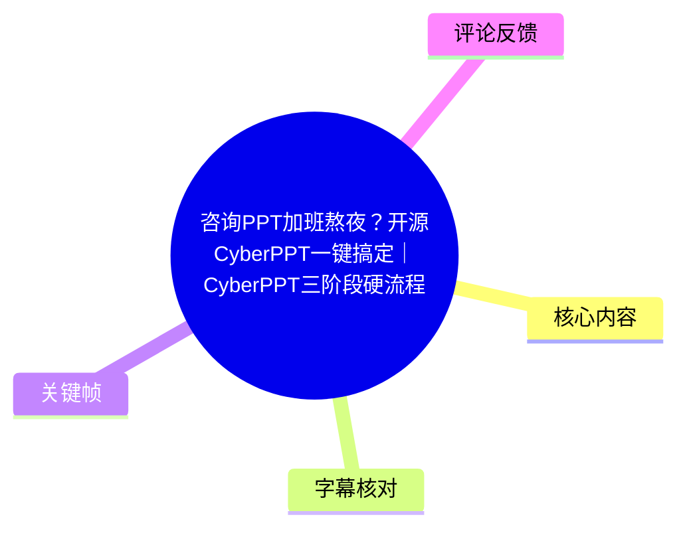
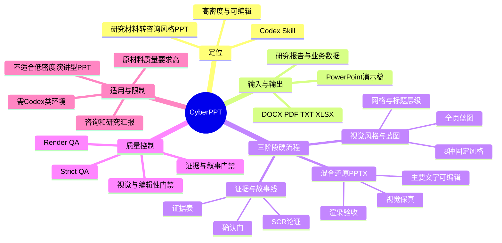
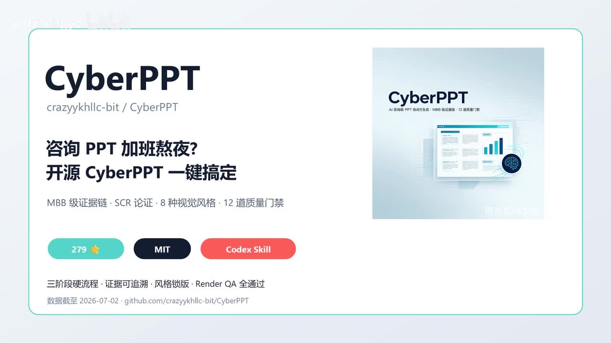
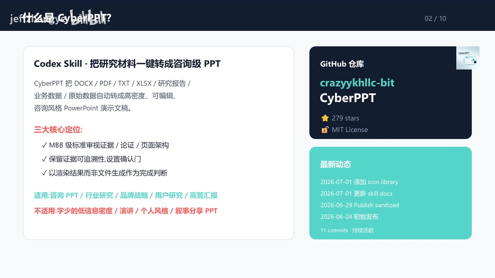
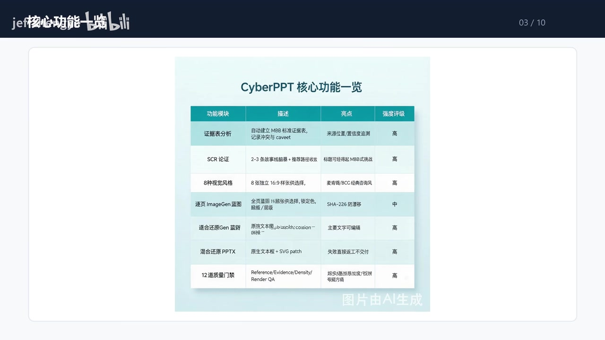

# 咨询PPT加班熬夜？开源CyberPPT一键搞定｜CyberPPT三阶段硬流程

> 来源：[Bilibili 视频](https://www.bilibili.com/video/BV1J4Tk6gEL8)<br>
> UP 主：jeffzhengye｜时长：09:35｜分区/合集：AIcode<br>
> 视频内信息统计口径：截至 **2026-07-02**；项目后续状态应以 GitHub 仓库为准。

## 小结

视频介绍了开源项目 **CyberPPT**：它被定位为运行于 Codex 类环境中的 Skill，用于把 DOCX、PDF、TXT、XLSX、研究报告、业务材料及原始数据，转化为高信息密度、可编辑、咨询风格的 PowerPoint 演示文稿。视频强调，它并非单纯的 PPT 模板或“一键美化”工具，而是一套带有论证、设计与质量验收步骤的生产流程。

作者认为，CyberPPT 面向咨询型 PPT 的三个典型痛点：反复调整页面信息密度和字号、图表样式不统一、文字被烘焙进图片后无法编辑。其对应机制包括证据表分析、SCR 论证、固定视觉风格、混合还原 PPTX，以及质量门禁。这里的“咨询级”是视频对项目目标与效果的表述，不等同于对任何输入材料都能稳定产出专业咨询交付物的独立验证。

核心方法论是“**三阶段硬流程**”：先形成证据与故事线，再选择视觉风格并生成全页蓝图，最后以“视觉保真 + 主要文字可编辑”为目标生成 PPTX。每一阶段设置确认门；没有获得确认不能推进，若用户要求修改则回到相应阶段修订。视频特别强调以渲染结果和蓝图对照作为验收依据，而不是只看文件是否生成成功。

截至视频口径，项目采用 **MIT License**，显示约 **279 stars**、**11 commits**；视频称其在 2026 年 7 月 1 日更新了 icon library 和 Skill 文档。以上数值均具有时效性，不能视为当前仓库的实时数据。视频给出的仓库路径为 `crazyykhllc-bit/CyberPPT`。

适合的使用者包括高校教师、咨询顾问、行业分析师、品牌策略人员、电商分析师和产品经理等，尤其是已有研究材料、业务数据，需要形成结构化汇报的人。限制也很明确：需要 Codex、Claude Code 或 Cursor 一类代码/Agent 环境，且输入原材料质量会直接影响输出；它不适合低信息密度、偏演讲表达、强个人风格或叙事分享型 PPT。作者给出四星推荐，扣分原因正是环境门槛和对原始材料质量的依赖。

## 思维导图





## 目录

- [项目定位、时效信息与适用边界](#项目定位时效信息与适用边界)
- [六项核心能力与输出目标](#六项核心能力与输出目标)
- [视觉风格：已披露的四种配色与场景](#视觉风格已披露的四种配色与场景)
- [三阶段硬流程：从论证到可编辑 PPTX](#三阶段硬流程从论证到可编辑-pptx)
- [质量门禁、禁止项与验收标准](#质量门禁禁止项与验收标准)
- [落地步骤与使用条件](#落地步骤与使用条件)
- [结论、限制与时效性](#结论限制与时效性)
- [字幕比对](#字幕比对)
- [评论分析](#评论分析)
- [处理记录](#处理记录)

## 项目定位、时效信息与适用边界 [00:00](https://www.bilibili.com/video/BV1J4Tk6gEL8?t=0)

视频开篇将 CyberPPT 描述为一个“Codex Skill”，目标是解决咨询风格 PPT 制作中的三类问题：

1. **页面密度与字号反复调整**：信息多时，人工通常要在内容完整性、字号和可读性之间反复取舍。
2. **图表与页面风格不一致**：不同页面、不同图表可能出现颜色、字体、布局语言不统一的问题。
3. **文字图片化导致不可编辑**：若将整页或主要文字做成图片铺入 PPT，虽然视觉效果可能保留，但后续难以修改、复制或复用内容。

视频的核心主张是通过固定流程、风格约束与质量门禁，将上述问题前置处理，而不是在 PPT 成品生成后再逐页返工。



> 图：封面集中呈现项目名、MIT、Codex Skill、约 279 stars，以及“MBB 级证据链、SCR 论证、8 种视觉风格、12 道质量门禁”等卖点。它适合用来理解视频所宣称的能力边界和数据口径；其中 star 数属于录制时快照。

### 输入、输出与三项定位 [00:42](https://www.bilibili.com/video/BV1J4Tk6gEL8?t=42)

视频列出的输入材料包括：

| 类别 | 视频列举内容 |
| --- | --- |
| 文档 | DOCX、PDF、TXT |
| 表格/数据 | XLSX、业务数据、原始数据 |
| 研究材料 | 研究报告及手头已有的研究素材 |

输出目标为：**高密度、可编辑、咨询风格的 PowerPoint 演示文稿**。

视频将其定位概括为三点：

- **以 MBB 标准审视证据、论证与页面架构**：这里的“MBB 标准”是作者借用咨询行业表达的目标导向，视频并未提供具体机构的认证、测试样本或对标报告。
- **保留证据可追溯性，并设置确认门**：即在从原始材料到页面结论的链路中，保留来源、冲突与限定条件，并在流程中要求用户确认。
- **以渲染结果而不是文件生成作为完成判断**：生成 `.pptx` 文件不自动等于成品合格，仍要检查渲染后的页面是否符合蓝图与视觉要求。



> 图：该页给出了“Codex Skill：把研究材料一键转成咨询级 PPT”的定义、输入格式、三大定位、仓库作者名及项目动态。页面下方还列出适用与不适用场景，是判断工具匹配度的重要依据。

### 适用与不适用范围 [00:42](https://www.bilibili.com/video/BV1J4Tk6gEL8?t=42)

关键帧展示的适用方向为：

- 咨询 PPT；
- 行业研究；
- 品牌战略；
- 用户研究；
- 高管汇报。

明确不适合的内容包括：

- 字少、低信息密度的 PPT；
- 演讲型 PPT；
- 强个人风格 PPT；
- 叙事分享型 PPT。

这意味着 CyberPPT 的设计取向是“结论—证据—结构化页面”，而非追求极简演讲节奏或个人审美表达。输入材料中如果缺乏可靠数据、来源、结论边界或可供组织的逻辑，工具也无法替代研究和判断本身。

## 六项核心能力与输出目标 [01:25](https://www.bilibili.com/video/BV1J4Tk6gEL8?t=85)

视频在核心功能页中展示了 CyberPPT 的能力模块。画面表格与口播共同指向以下内容：

| 能力模块 | 视频说明 | 作用或亮点 |
| --- | --- | --- |
| 证据表分析 | 自动建立 MBB 标准证据表，记录冲突与 caveat（限制条件/注意事项） | 使来源位置和证据链可追溯 |
| SCR 论证 | 生成 2–3 条故事线草稿，并收敛到推荐路径 | 使标题和结论接受更严格的逻辑审视 |
| 8 种视觉风格 | 提供固定的 16:9 样张供选择 | 避免用户自行拼凑配色和样式 |
| 逐页 ImageGen 增强 | 对复杂视觉作逐页处理，锁定色、图标、层级等 | 视频标为“中”等级能力 |
| 适合还原 Gen 增强 | 以原生文本层配合 SVG patch / erosion 等方式处理 | 目标是主要文字可编辑 |
| 混合还原 PPTX | 原生文本层与 SVG patch 组合 | 避免失败时仍直接交付 |
| 质量门禁 | 表中列出 Reference、Evidence、Density、Render QA 等 | 通过多轮检查把问题拦在交付前 |

> 注：视频口播称“六项能力”，但关键帧表格实际可辨识出七行功能模块。这里按画面可见条目完整记录，不擅自删并为六项。



> 图：功能总览以“功能模块—描述—亮点—强度评级”组织信息，能帮助区分项目的内容层能力（证据、SCR）与实现层能力（图像增强、混合还原、质量门禁）。

### 证据表与 SCR 的关系

视频将“证据表分析”视为基础、“SCR 论证”视为核心方法论：

- **证据表**负责记录来源、位置、冲突与 caveat，使页面主张能回溯到材料；
- **SCR**用于组织故事线。SCR 通常指 Situation（情境）、Complication（冲突）、Resolution（解决方案）的论证结构；视频没有展开每一步的具体提示词或模板；
- 工具会形成 **2–3 条故事线草稿**，并收敛出推荐故事线；
- 最终按页规划论点、信息密度和组件清单。

因此，视频呈现的流程不是先画页面再补逻辑，而是先建立证据与论证，再进入页面设计。

## 视觉风格：已披露的四种配色与场景 [02:10](https://www.bilibili.com/video/BV1J4Tk6gEL8?t=130)

视频称 CyberPPT 提供 **8 种固定视觉风格**，用以减少自行配色、统一页面语言。ASR 可较清晰识别并有视频讲解的只有前四种；其余四种的名称、颜色和适用场景未在现有可用素材中可靠获得，因此不补写。

### 1. 经典深红—黑—米白 [02:10](https://www.bilibili.com/video/BV1J4Tk6gEL8?t=130)

视频描述的主色包括：

- 深红：`#971818`；
- 黑色：`#111111`；
- 米白：`#F5F5F0`。

视频将其归为经典咨询汇报视觉语言：深红、黑色和米白配合高信息密度排版，适合：

- 战略咨询；
- 行业研究；
- 高管汇报；
- 董事会材料；
- 客户提案；
- 项目复盘。

### 2. 象牙白—深蓝—中蓝 [02:45](https://www.bilibili.com/video/BV1J4Tk6gEL8?t=165)

视频列出的配色为：

- 象牙白：`#F1F1F6`；
- 深蓝：`#1E3A5F`；
- 中蓝：`#2F5F8F`。

作者认为深蓝能传达信任感与权威感，象牙白有助于更柔和的阅读体验。建议用于：

- 金融分析；
- 投资研究；
- 董事会材料；
- IPO 路演；
- 政策研究；
- 高校学术汇报。

### 3. 纸张米色—铜棕—深棕 [03:15](https://www.bilibili.com/video/BV1J4Tk6gEL8?t=195)

视频列举：

- 纸张米色：`#EFE3D0`；
- 铜棕：`#8B5A3C`；
- 深棕：`#5C3826`。

该风格被形容为有“古典出版社”气质，视频建议的方向包括出版、书籍、研究报告、传统行业和制造业。适合需要强调文化感、纸张感或传统产业调性的内容。

### 4. 冷白灰—深紫—近黑 [03:45](https://www.bilibili.com/video/BV1J4Tk6gEL8?t=225)

ASR 对该页色号识别不稳定，但能结合口播可靠确认其结构为：

- 冷白灰底色；
- 深紫色强调；
- 近黑色文字或辅助色。

视频将其定义为科技、现代感更强的风格，适用场景包括：

- 科技；
- AI；
- 数字化转型；
- 生命科学；
- 医药研究；
- 半导体相关主题。

> 色号方面，ASR 对第四种风格出现了明显误识别，且现有关键帧素材未提供该风格页的清晰画面；因此不将不可靠识别结果写作确定参数。

## 三阶段硬流程：从论证到可编辑 PPTX [05:10](https://www.bilibili.com/video/BV1J4Tk6gEL8?t=310)

视频将“三阶段硬流程”称为 CyberPPT 的方法论基石。其关键不是线性地“输入—生成—下载”，而是每一阶段都必须确认，修改时必须返回对应环节。

### 阶段一：证据与故事线 [05:10](https://www.bilibili.com/video/BV1J4Tk6gEL8?t=310)

第一阶段完成的工作包括：

1. 从材料中建立或整理证据；
2. 形成 2–3 条故事线草稿；
3. 选择/确认推荐故事线；
4. 为每一页规划论点；
5. 明确页面信息密度和组件清单。

关键标准是：推荐故事线应能承受视频所说的“MBB 式挑战”，即结论、论据、页面结构之间不应彼此脱节。

### 阶段二：视觉风格与页面蓝图 [05:55](https://www.bilibili.com/video/BV1J4Tk6gEL8?t=355)

第二阶段先由用户在固定视觉样张中选择，并“锁定”视觉方案；随后定义：

- 设计设定；
- 页面网格；
- 标题层级；
- 图表语言；
- 全部页面的蓝图。

这里的“蓝图”可以理解为生成前的页面规格：每一页要表达什么、采用何种版式、放置何种图表或组件、层级如何呈现。视频的目的在于先确定版式与视觉规则，再制作可交付文件。

### 阶段三：混合还原 PPTX [06:35](https://www.bilibili.com/video/BV1J4Tk6gEL8?t=395)

最后阶段生成 PPTX，采用视频称为“混合还原”的策略，并设置两个硬门槛：

1. **复杂视觉保真**；
2. **主要文字可编辑**。

这意味着它并不以“整页截图作为 PPT 背景”的方式换取视觉一致性，而要尽量将主要文字保留为可编辑对象。视频提到逐页执行流程，并设置第三次确认门：用户必须批准才交付可编辑 PPT。

### 确认门与返工规则

视频明确给出两项流程约束：

- 任意阶段未确认，**不得跨过确认门**；
- 用户提出修改时，**必须回到对应阶段修订**，不能直接在最终文件上绕过前序逻辑或蓝图。

这种设计把返工定位到“问题产生的层级”：证据问题回到证据与故事线阶段，版式问题回到蓝图阶段，渲染或编辑性问题回到生成与质检阶段。

## 质量门禁、禁止项与验收标准 [07:10](https://www.bilibili.com/video/BV1J4Tk6gEL8?t=430)

视频反复强调“12 道质量门禁”，但口播在分类列举时出现数量不一致：先说证据与叙事有 4 道，又列举视觉与编辑性相关 11 道，合计为 15 项。结尾同时提及“15 层 Typography Scale”。现有素材无法确认这是口播计数错误、不同版本规则，还是部分项目存在重叠。因此，应以仓库文档为准，不能仅凭视频将 12、15 或 15 层字体层级混作同一个参数。

### 视频列举的证据与叙事门禁

| 门禁 | 视频所述用途 |
| --- | --- |
| Reference Gate | 检查引用或来源基础 |
| Evidence Gate | 检查证据是否可追溯、可支撑主张 |
| Storyline Gate | 检查论证和故事线完整性 |
| Density Gate | 检查信息密度是否合格 |

### 视频列举的视觉与编辑性相关门禁

视频口播列举的英文名称如下，部分术语受 ASR 影响，保留原始可辨识拼写并标注不确定性：

| 门禁 | 侧重点 |
| --- | --- |
| Style Gate | 视觉风格锁定 |
| Blueprint Gate | 蓝图是否能被还原 |
| Asset Admission Gate | 素材准入 |
| Editable Layer Gate | 可编辑层检查 |
| Visual Sem… Gate | ASR 截断，具体名称无法可靠确认 |
| Curve Trace Gate | 曲线/图表路径等视觉对象处理 |
| Spatial Registration Gate | 空间位置、对齐或套准 |
| Container Overflow Gate | 容器溢出检查 |
| Typography Gate | 字体与文字排版检查 |
| Render QA Gate | 渲染质量检查 |
| Strict QA Gate | 严格质量检查 |

### 明确禁止项 [07:55](https://www.bilibili.com/video/BV1J4Tk6gEL8?t=475)

视频提出若干不能用来“蒙混过关”的做法：

- 不得用整页截图作为背景；
- 不得把主要文字烘焙进图片；
- 不得只靠缩小字号解决信息密度问题；
- 不得为了图形/图片数量归零而过度简化曲线；
- 文件生成成功不等于视觉质量合格；
- 通过普通检查不等于渲染结果合格。

最终验收的硬要求是：进行 **Render QA**，并把渲染图与页面蓝图进行对照；只有两者一致、页面视觉满足要求，才算通过。视频在此处表达的是项目设计原则，未提供具体的渲染工具、差异阈值、自动评分公式或失败案例。

## 落地步骤与使用条件 [08:25](https://www.bilibili.com/video/BV1J4Tk6gEL8?t=505)

根据视频流程，实际使用可整理为以下操作顺序：

1. **准备源材料**  
   汇集 DOCX、PDF、TXT、XLSX、研究报告与业务数据等输入。优先确保数据、结论、来源和限制条件清晰，因为后续证据链与故事线都依赖原料质量。

2. **在兼容的 Agent/代码环境中安装和调用**  
   视频推荐在 Codex、Claude Code 或 Cursor 环境中尝试。视频称 Windows 安装命令会显示在屏幕上，但本次可用素材未保留该命令的可验证文本，故不转录或猜测命令。

3. **先处理证据和故事线**  
   建立证据表，识别冲突与 caveat；产出 2–3 条故事线草稿；选择推荐路径；拆解到逐页论点、密度和组件。

4. **选择并锁定视觉方案**  
   从 8 种固定样张中选择，明确配色、网格、标题层级和图表语言，完成全页蓝图。

5. **生成混合还原 PPTX**  
   目标不是整页图片化，而是在复杂视觉表现与主要文字可编辑之间取得平衡。

6. **逐页渲染与蓝图对照**  
   检查素材准入、层级、文字、溢出、对齐、图表及渲染质量。发现问题时回到问题所属阶段修订。

7. **经过确认门后再交付**  
   任一阶段未确认不能跳转；最终应在可编辑性与视觉检查均完成后交付。

### 视频提供的安装线索

视频画面与口播给出仓库地址：

```text
github.com/crazyykhllc-bit/CyberPPT
```

视频仅称“Windows 安装命令在屏幕上”，但本任务提供的关键帧中没有可辨识的命令文本，也没有仓库 README 原文。因此，不能基于该素材补写 `git clone`、包管理器或特定 Skill 安装指令。实际安装应直接查阅仓库当前文档。

## 结论、限制与时效性 [09:00](https://www.bilibili.com/video/BV1J4Tk6gEL8?t=540)

CyberPPT 的可迁移经验不在于某一种配色，而在于把 PPT 自动生成拆为可检查的工程链条：

- 先有来源、证据和限定条件；
- 再有结构化故事线与逐页主张；
- 再锁定视觉语言和蓝图；
- 最后以“可编辑性 + 渲染结果”验收，而非仅以文件存在作为成功标准。

对需要将大量研究材料和业务数据压缩为高密度汇报的人，这种流程可以减少“结构未定就开始排版”带来的反复返工。但视频本身没有展示真实输入材料、完整输出 PPT、人工修改耗时、质量对照样本或与其他工具的实验比较，因此无法仅凭本视频量化其效率、准确性或普适性。

主要限制如下：

| 限制 | 影响 |
| --- | --- |
| 依赖 Codex、Claude Code、Cursor 等环境 | 非技术用户需要额外学习、配置与调用成本 |
| 原材料质量要求高 | 数据、来源、结论不足时，证据表和故事线质量都会受限 |
| 风格是固定模板化约束 | 有利于统一性，但未必适合强个人审美或品牌高度定制内容 |
| 适用内容类型有限 | 不适合低信息密度、演讲型、个人风格或叙事分享型 PPT |
| 项目快速变化 | stars、commit、更新记录及安装方式均可能已经变化 |
| 视频中门禁数量存在表述不一致 | 应以仓库的最新版 Skill 文档或 README 核验规则 |

视频给出的数据截至 **2026-07-02**：约 279 stars、11 commits，并称 2026-07-01 更新 icon library 与 Skill 文档。该信息仅反映录制/整理时的项目快照；视频也明确提示“最新信息请以 GitHub 仓库为准”。

## 字幕比对 [00:00](https://www.bilibili.com/video/BV1J4Tk6gEL8?t=0)

本次任务已执行 ASR。站内字幕抓取失败，素材警告为 `Missing JSON resource URL.`，因此没有可用的 Bilibili 站内字幕可以逐句比对。

| 字幕来源 | 完整性 | 专有名词 | 时间轴 | 主要问题 |
| --- | --- | --- | --- | --- |
| Bilibili 站内字幕 | 不可用 | 无法评估 | 无法评估 | 字幕工具获取失败，未提供可用字幕资源 |
| 本次 ASR 字幕 | 覆盖了主要讲述内容，但存在重复尾段 | 中等偏低，英文术语、色号与项目术语误识别较多 | 未提供逐句时间戳，仅能按内容估算章节时间 | 将 MBB、CyberPPT、Codex、色号、Gate 名称等识别错误或截断；末段内容重复 |

### 最终字幕选择与校正原则

最终以**本次 ASR 字幕为主体**，结合视频标题、描述、元数据、关键帧中可见文字进行校正；没有使用站内字幕。

已通过画面或上下文校正的关键内容包括：

| ASR 中的疑似错误/不稳表达 | 采用写法 | 校正依据 |
| --- | --- | --- |
| “NBB 标准” | MBB 标准 | 视频封面和关键帧明确显示“MBB 级证据链” |
| “SyberPTT / CyberPTT” | CyberPPT | 视频标题、封面与功能页一致 |
| “codef 环境” | Codex 类环境 | 视频开头及结尾均称 Codex Skill，并提及 Codex、Claude Code、Cursor |
| “12道质量文件” | 12 道质量门禁 | 标题、描述、封面文字一致 |
| “混合还原 PPT-X” | 混合还原 PPTX | PowerPoint 文件格式及功能页文字 |
| “参考门、证据门”等 | Reference Gate、Evidence Gate 等 | 功能页与口播英文术语 |
| 第四套风格的具体色号 | 不写为确定值 | ASR 误识别严重，当前素材中没有可核对的清晰画面 |
| “Visual Sem… Gate” | 保留截断状态 | ASR 未完整识别，不能编造全称 |

## 评论分析 [00:00](https://www.bilibili.com/video/BV1J4Tk6gEL8?t=0)

按任务要求，仅处理可获取的热评前三条。本次素材最多返回两条热评，未获取到第三条，因此不补充或推测。

1. **小辉辉咋： “优秀啊”**  
   - 观点：对视频或项目表达正面认可。  
   - 补充信息：无。  
   - 可信度与局限：这是简短主观评价，未涉及安装体验、输出质量、性能或项目真实性，不能作为技术验证依据。

2. **往幸福出发吧： “支持 早日火！！”**  
   - 观点：表达支持并期待项目获得更多关注。  
   - 补充信息：无。  
   - 可信度与局限：同样属于态度型评论，未提供实际使用细节、问题反馈或可复现信息。

3. **第三条热评**  
   - 获取情况：未在所提供的评论数据中返回。  
   - 处理方式：不将普通评论、推测内容或未抓取数据补充为第三条。

总体而言，可获取评论均为正向鼓励，尚未形成对功能可用性、安装门槛、生成质量或实际使用问题的有效技术反馈。

## 处理记录 [00:00](https://www.bilibili.com/video/BV1J4Tk6gEL8?t=0)

- **Worker ID**：`worker-mrj0wjed-b0c290ad`
- **模型**：`gpt-5.6-terra`
- **调用工具与素材**：视频元数据、ASR 字幕、关键帧目录、热评 JSON、视频抓取产物清单。
- **使用的应用工具**：素材处理流程已产出 `merged.mp4`、`audio/audio.wav`、`frames/`、`comments/comments.json` 和 `asr/`；站内字幕获取工具执行失败。
- **字幕选择**：站内字幕不可用；本次 ASR 已执行并作为主体，依据关键帧、标题、描述和元数据对项目名、MBB、PPTX、GitHub 路径等进行有限校正。对无法可靠确认的第四套色号、某个截断 Gate 名称和 Windows 安装命令不作补写。
- **关键帧选择依据**：
  - `frames/frame-001.jpg`：封面，验证项目名称、MIT、Codex Skill、279 stars、三阶段流程、证据链、SCR、8 种风格与 12 道门禁等总览信息；
  - `frames/frame-003.jpg`：定位页，验证输入格式、三项定位、仓库路径、项目动态与适用/不适用边界；
  - `frames/frame-004.jpg`：功能总览页，验证证据表、SCR、8 种视觉、ImageGen、混合还原与质量门禁的模块关系。
- **未选用其他关键帧的原因**：当前提供的可见关键帧素材中，以上三张与正文的可核验信息关联最直接；其余帧虽在路径清单中存在，但未提供可读取画面内容，故不对其内容作推断。
- **缓存清理**：未提供缓存清理执行日志；仅记录素材产物已生成。无法据此确认临时缓存是否已删除。
- **未解决问题**：
  - Bilibili 站内字幕资源缺失，无法进行逐句双字幕校验；
  - ASR 没有逐句时间戳，章节时间轴为依据内容进度作出的近似定位；
  - 视频口播中的“12 道门禁”与列举数量不一致；
  - Windows 安装命令及部分视觉风格参数未能从现有可验证素材中完整恢复；
  - 仓库当前 stars、commits、版本、安装方式及文档内容需要以 GitHub 实时页面核验。

## 评论分析

本次流程未获取到可用热评，因此不推断观众态度或额外结论。
