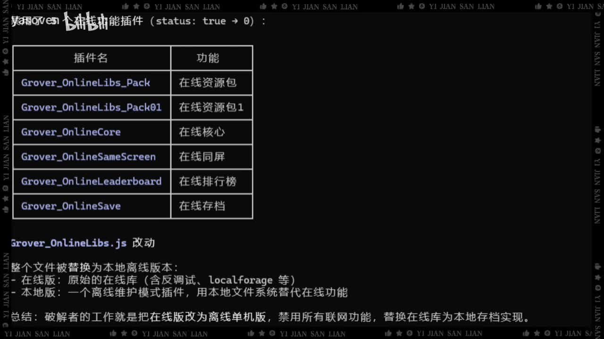

# 重装机兵战火的硝烟本地化版本行为分析

> 来源：[Bilibili 视频](https://www.bilibili.com/video/BV128Lf6DEqg)  
> UP 主：yasoven｜发布时间：2026-06-18｜视频时长：12 秒  
> 标签：重装机兵、RPG、怀旧

## 小结

视频时长仅 12 秒，画面主体是一页技术说明截图，音频则为歌曲片段，**没有与画面技术内容对应的口播讲解**。因此，视频所表达的技术信息主要来自画面文字，而非字幕或 ASR。

画面将若干 `Grover_Online*` 插件标为在线功能，包括在线资源包、在线核心、在线同屏、在线排行榜和在线存档；并指出 `Grover_OnlineLibs.js` 被整体替换为“本地离线版本”。该离线版本据画面描述以本地文件系统代替在线功能，原在线库则包含反调试、`localforage` 等内容。

画面最后给出其自身结论：所谓修改行为是把在线版改为离线单机版，禁用联网功能，并以本地存档实现替代在线库。这里应严格视为**视频画面中的陈述**：素材未提供代码、文件差异、运行日志、网络抓包或可复现步骤，不能据此独立验证具体实现、修改范围及其合法性。

适合希望快速了解该视频所展示的“在线模块转本地离线模块”思路的读者。若要实际判断某个版本是否确实如此修改，仍需要取得对应文件并进行版本比对、功能测试和网络行为验证。

时效性方面，视频发布于 2026-06-18；画面涉及的文件名、模块状态与版本实现均可能随游戏版本、补丁或发布渠道变化而变化。视频未注明适用版本号、平台或文件哈希。

## 思维导图

## 目录

- [素材背景与证据边界](#素材背景与证据边界-0000)
- [画面中的在线功能插件清单](#画面中的在线功能插件清单-0000)
- [Grover_OnlineLibsjs 的替换说明](#grover_onlinelibsjs-的替换说明-0000)
- [可复核的分析流程与缺失步骤](#可复核的分析流程与缺失步骤-0000)
- [结论、限制与时效性](#结论限制与时效性-0000)
- [字幕比对](#字幕比对)
- [评论分析](#评论分析)
- [处理记录](#处理记录)

## 素材背景与证据边界 [00:00]([https://www.bilibili.com/video/BV128Lf6DEqg?t=0](https://www.bilibili.com/video/BV128Lf6DEqg?t=0))

视频标题为“重装机兵战火的硝烟本地化版本行为分析”，但素材中未出现人物讲解、实机操作、代码编辑过程或文件下载过程。已提供的站内字幕从 00:00:00.320 开始，内容为歌曲歌词；本次 ASR 同样识别到歌曲人声。因此，技术整理必须以画面内可辨识的文字为主要依据。

需要区分三类信息：

1. **可直接观察到的画面信息**：插件名、功能对照表、`Grover_OnlineLibs.js` 的改动说明，以及“在线版”与“本地版”的文字定义。
2. **视频画面作者的结论**：将在线版改为离线单机版、禁用联网功能、以本地存档替代在线存档。
3. **无法由现有素材验证的事项**：实际二进制或脚本是否被替换、各模块是否真的不可联网、反调试的具体形式、`localforage` 的具体使用位置，以及修改是否由何人完成。

视频没有新闻事件、版本发布公告、漏洞公告或官方声明；其技术信息属于一张静态分析说明图，不应扩展为对游戏全部版本的普遍结论。

## 画面中的在线功能插件清单 [00:00]([https://www.bilibili.com/video/BV128Lf6DEqg?t=0))

画面表格以“插件名 / 功能”为列名，列出以下项目：

| 画面中的插件名 | 画面标注的功能 | 可谨慎得出的含义 |
| --- | --- | --- |
| `Grover_OnlineLibs_Pack` | 在线资源包 | 名称与标注指向在线资源相关模块。 |
| `Grover_OnlineLibs_Pack01` | 在线资源包 1 | 可能是另一组资源包或资源包分片；画面未说明与前项的差异。 |
| `Grover_OnlineCore` | 在线核心 | 被标为在线核心模块，但未给出接口或调用关系。 |
| `Grover_OnlineSameScreen` | 在线同屏 | 被标为在线同屏功能；无法仅据名称确认具体同步机制。 |
| `Grover_OnlineLeaderboard` | 在线排行榜 | 被标为在线排行榜功能。 |
| `Grover_OnlineSave` | 在线存档 | 被标为在线存档功能。 |

> 图：关键帧展示了插件名与功能的对照表，并在下方开始说明 `Grover_OnlineLibs.js` 的改动。这是理解视频技术主张的核心证据：它明确把多个模块归类为在线能力，但并未展示模块源码或调用证据。

画面顶部还可见“`status: true → 0`”字样，但前部标题文字受到覆盖和分辨率限制，无法可靠还原完整语句。可以确认的是，画面在表达某个状态值被由真值状态改为 `0`；**不能据此断言该状态属于哪个具体插件或它在运行时的精确含义**。

## Grover_OnlineLibs.js 的替换说明 [00:00]([https://www.bilibili.com/video/BV128Lf6DEqg?t=0))

画面在 `Grover_OnlineLibs.js 改动` 标题下给出的文字要点为：

- 整个文件被替换为本地离线版本；
- 在线版是“原始的在线库”，并括注“含反调试、`localforage` 等”；
- 本地版是“一个离线维护模式插件”，以本地文件系统替代在线功能；
- 画面总结称：修改工作是把在线版改为离线单机版，禁用所有联网功能，并以本地存档实现替换在线库。

从技术概念上看，这种表述描述的是一次**依赖与能力替换**：

| 层面 | 画面所述在线版 | 画面所述本地版 |
| --- | --- | --- |
| 核心定位 | 原始在线库 | 离线维护模式插件 |
| 功能来源 | 在线功能与在线库 | 本地文件系统 |
| 存档处理 | 在线存档模块 | 本地存档实现 |
| 联网能力 | 存在在线功能模块 | 画面称将被禁用 |
| 附带机制 | 画面称含反调试、`localforage` 等 | 画面未列出等价机制 |

这里的 `localforage` 是一个常用于浏览器端异步本地存储封装的库名；但视频只是在括号中提到它，**没有提供版本、配置、调用代码或存储键名**。因此，不能进一步推断该游戏使用了何种持久化结构，亦不能断言所有数据均由 `localforage` 管理。

## 可复核的分析流程与缺失步骤 [00:00]([https://www.bilibili.com/video/BV128Lf6DEqg?t=0))

视频未展示实际操作步骤、命令、代码片段、配置文件或测试结果，因而不存在可从素材中逐条复现的“替换教程”。若要审查画面结论，合理的验证路径应是分析者后续执行的核验工作，而不是把它误写成视频已展示的步骤：

1. **确认样本与版本**
   - 记录游戏版本、平台、获取渠道、文件大小与哈希。
   - 视频未提供这些参数，现有结论无法绑定到特定构建版本。

2. **定位并比对文件**
   - 取得画面所指的 `Grover_OnlineLibs.js`，与被称作“原始在线库”的对应文件进行差异比对。
   - 重点核验文件是否确实整体替换，而不是仅改动少量函数或加载入口。

3. **检索在线模块引用**
   - 检查 `Grover_OnlineCore`、`Grover_OnlineSameScreen`、`Grover_OnlineLeaderboard`、`Grover_OnlineSave` 等名称是否仍被调用。
   - 仅出现文件名不等于功能可用；还需要结合导入、事件绑定和运行路径判断。

4. **验证网络行为**
   - 在隔离环境中观察启动、登录、排行榜、同屏和存档等行为是否产生网络请求。
   - “禁用所有联网功能”是画面结论，需以网络日志、请求拦截或运行时调试验证。

5. **验证本地存档**
   - 进行新建存档、读取、覆盖、删除和断网重启测试。
   - 需要确认本地文件实际生成位置、数据格式、权限问题与损坏恢复行为；视频均未展示。

6. **记录风险与边界**
   - 修改或分发游戏文件可能受平台规则、软件许可和著作权限制约束。
   - 对疑似反调试或联网功能的绕过、禁用，除技术可行性外还应评估合法性与账号、存档安全风险。

## 结论、限制与时效性 [00:00]([https://www.bilibili.com/video/BV128Lf6DEqg?t=0))

视频画面建立的核心论点是：将名为 `Grover_OnlineLibs.js` 的在线库替换为离线维护模块，用本地文件系统和本地存档承接原本的在线功能，并禁用相关联网能力。画面同时列出了资源包、核心、同屏、排行榜、存档等在线模块名称，为该论点提供了模块层面的说明。

但当前证据仅限静态画面文字，无法确认：

- 被替换文件的来源、完整内容和文件哈希；
- `status: true → 0` 对应的实际变量与行为；
- 所有列出的在线模块是否已被移除、短路、重定向或仅仅不可达；
- 本地文件系统存储的具体路径、格式、兼容性和安全性；
- “反调试”与 `localforage` 是否仍存在于其他文件；
- 该分析对应的游戏版本、平台和发布时间范围。

因此，这份视频更适合作为**待验证的模块改造说明**，而非已完成证据链的逆向分析报告。后续版本更新、资源替换或服务端策略调整都可能使画面中的结论失效。

## 字幕比对

| 字幕来源 | 完整性 | 专有名词 | 时间轴 | 主要问题 |
| --- | --- | --- | --- | --- |
| Bilibili 站内字幕 | 对歌曲歌词覆盖较完整，共 6 段，至 00:00:11.960 | 无技术专有名词 | 精细，提供 00:00:00.320—00:00:11.960 的真实分段 | 内容为歌曲歌词，不描述画面中的插件、文件名或技术结论。 |
| 本次 ASR 字幕 | 仅 1 段，覆盖 00:00:00.110—00:00:10.530 | 未识别技术专有名词 | 有时间戳，但单段跨度过长 | 存在明显歌词识别误差，如“云朵朵不过风”“变了如此”“阴天流”；遗漏站内字幕末句“怎么越洋”。 |

本次 ASR 使用 `medium` 模型、中文识别，语言置信度为 `0.9761`，检测到约 `10.42` 秒语音，音频覆盖率约 `86.97%`。ASR 结果中**未标记** `noAudioStream=true`，且确实识别到人声，因此不能将本视频视为无音轨素材。

最终字幕选择如下：

- **歌词与时间定位**：优先采用站内 SRT。其分段更细，且在歌词文本上明显优于本次 ASR。
- **技术正文**：不采用任一字幕作为技术事实来源，改以关键帧画面文字整理。
- **画面校正的关键术语**：`Grover_OnlineLibs.js`、`Grover_OnlineCore`、`Grover_OnlineSameScreen`、`Grover_OnlineLeaderboard`、`Grover_OnlineSave`、`localforage`。这些术语均未被音频字幕覆盖，而来自画面可见文本。

## 评论分析

以下仅处理可获取的热评前三条；评论属于观众观点，不构成对视频技术结论的验证。

1. **呆呆兽的一步哲思（5 赞）**
   - 观点：认为“解密”过程比预想简单，并将成果归因于 AI。
   - 可提供的信息：反映该观众将视频内容理解为某种分析、解密或处理工作。
   - 可信度与限制：视频画面本身未出现“解密”步骤，也未展示 AI 工具调用、模型输出或完整分析过程；因此该评论不能证明技术流程由 AI 完成。

2. **倪雨今天漏尿了吗（3 赞）**
   - 观点：断言逆向结果由“倪雨”完成，而非 AI。
   - 可提供的信息：提出了成果归属的相反说法。
   - 可信度与限制：该说法没有附带文件、仓库、截图或作者说明，且视频元数据仅显示 UP 主为 yasoven；不能据此确认实际分析者身份。

3. **我的简历1018（3 赞）**
   - 观点：讨论“蓝卡”“倪雨”“卡子”等人在社群中的互动、评价及技术能力，并认为其中存在捧杀或言论争议。
   - 可提供的信息：反映评论区可能存在围绕作者、技术归属或社群关系的讨论。
   - 可信度与限制：评论内容主要是社群评价，和视频展示的插件替换、离线化行为没有直接证据关系；其中关于个人技术水平的判断不可视为已验证事实。

## 处理记录

- Worker ID：`worker-mrj0wbly-5dc4e50c`
- 模型：`gpt-5.6-terra`
- ASR 模型与参数：`medium`；语言 `zh`；设备 `cuda`；计算类型 `float16`；音频时长 `11.9815` 秒。
- 使用的素材与工具产物：视频元数据、站内字幕 `p01-ai-zh.srt`、本次 ASR 结果 `asr/asr-result.json` 与 `asr/transcript.srt`、关键帧目录 `frames/`、热评数据 `comments/comments.json`。
- 字幕选择：检查了站内 SRT 与本次 ASR。站内字幕用于歌词时间轴；由于两者均未包含画面中的技术文字，技术部分以关键帧可读文本为准。
- 关键帧选择依据：采用 `frames/frame-001.jpg`，其清晰展示在线插件—功能对照表、`Grover_OnlineLibs.js` 改动标题及离线替换说明，是支撑正文技术信息最完整的画面。其余提供的关键帧预览与该技术说明画面高度重复，未额外引入可确认的新信息。
- 缓存清理：素材未提供缓存清理日志或清理状态，无法确认是否已清理；本记录不将其臆写为已完成。
- 未解决问题：未提供原始 `Grover_OnlineLibs.js`、替换后文件、版本号、哈希、运行日志、网络抓包和存档测试结果；无法独立验证画面所称的完整替换、联网禁用及本地存档实现。
