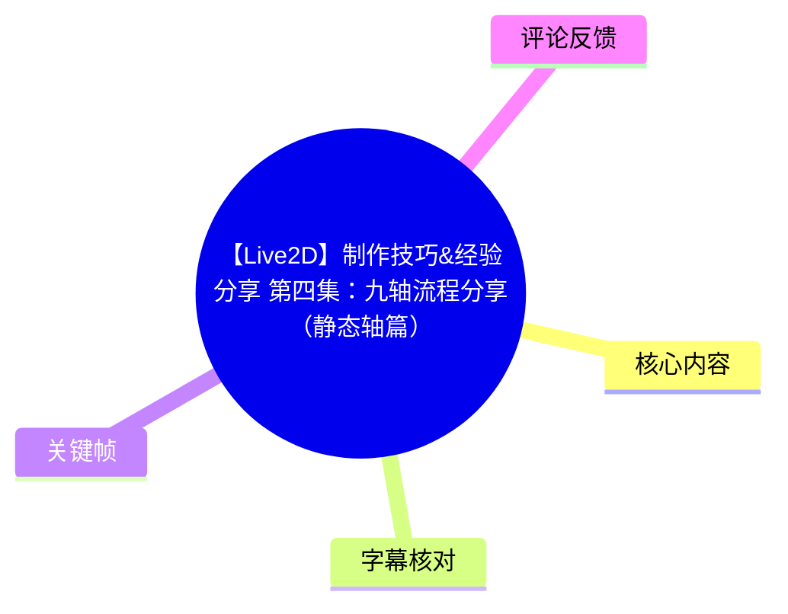
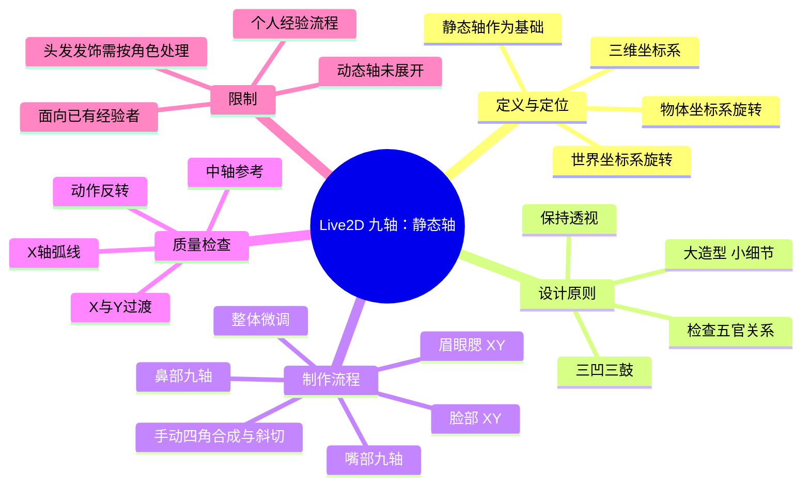
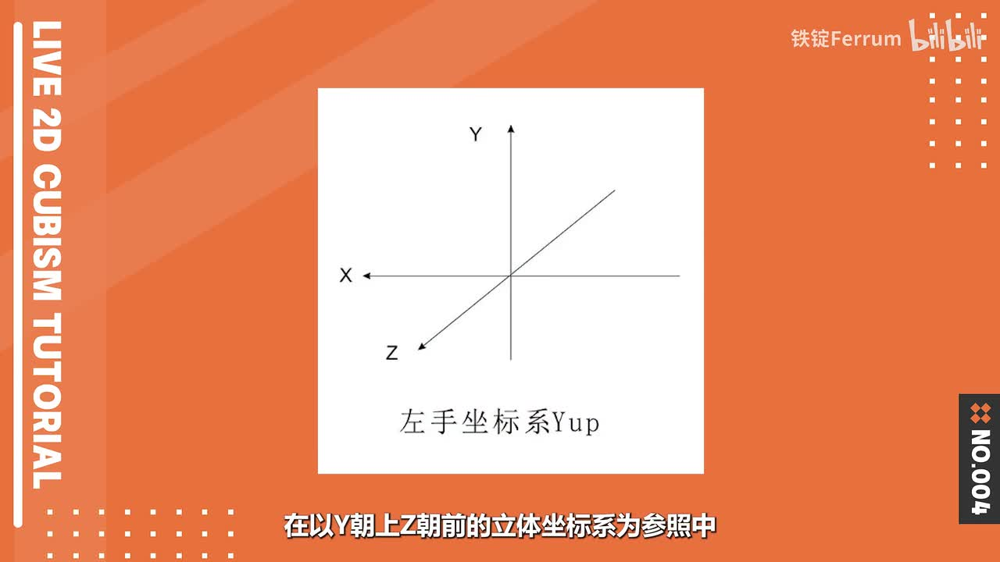
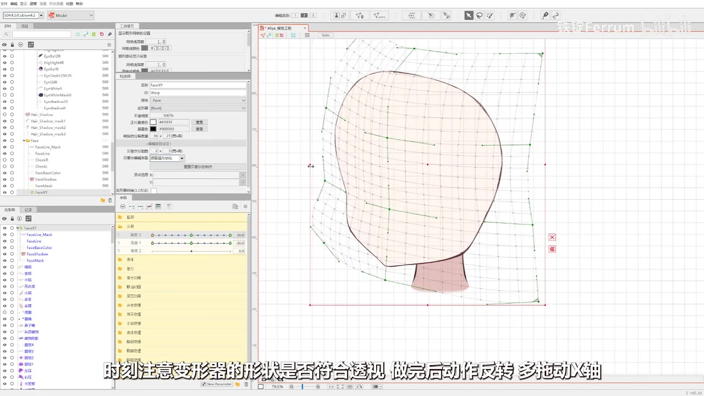
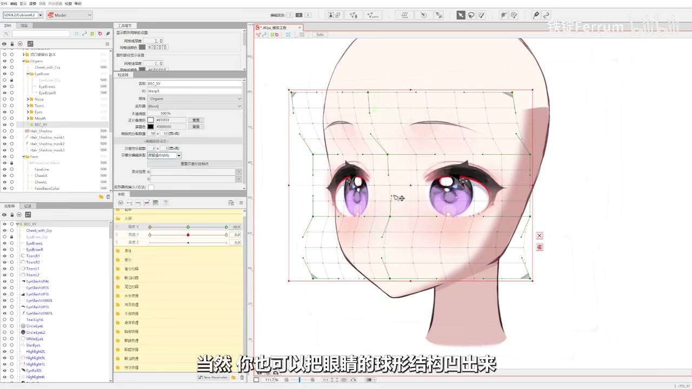

# 【Live2D】制作技巧&经验分享 第四集：九轴流程分享（静态轴篇）

> 来源：[Bilibili 视频](https://www.bilibili.com/video/BV1ou411V767) 
> UP 主：铁锭Ferrum｜发布时间：2023-07-23｜视频时长：24 分 56 秒｜分辨率：2560×1440  
> 定位：面向已有一定 Live2D 制作经验的 V 模制作者，分享头部“九轴”的**静态轴**制作思路与个人流程。

## 小结

本视频是铁锭Ferrum的 Live2D 制作经验分享第四集，主题为 V 模头部九轴中的“静态轴”。作者明确表示，这不是覆盖所有情形的标准教程，而是其约三年实践中形成、用于稳定产出模型的一套个人流程；为追求效果，会较积极地使用扩展插值，对变形器管理也不追求严格节省资源。

视频先以三维坐标系解释静态轴与动态轴：在作者的工作定义中，头部横向转动对应 Live2D 的参数 Y；若其按世界坐标系旋转，属于静态轴，若按物体坐标系旋转，属于动态轴。落到 Live2D 参数运动上，静态轴表现为参数 Y 走直线、参数 X 走弧线；动态轴则相反。作者也指出，这一分类并不严格，且并非只有这两种做法。

作者认为动态轴更符合真实头部转动，但制作更费时费力；静态轴相对简单，配合自身轴效果也可接受，尤其适合当作其他轴法的基础。因此，本集从静态轴入手，并按“脸部 → 眉眼腮 → 嘴 → 鼻 → 整体微调”的顺序构建头部九轴。

最核心的经验有三项：其一，以“大造型、小细节”分层，外层大变形器承担位置、轮廓和透视，内层细变形器补充大变形器难以处理的细节；其二，斜向四角合成应尽量手动调整，不建议直接依赖 Cubism Library 的自动斜切功能；其三，九轴的质量不只取决于单个五官，必须持续检查脸型、眉眼、嘴、鼻之间的位置关系，以及 X/Y 轴和反转时的过渡是否圆滑。

视频的口播教学在约 13:30 结束，作者邀请观众继续观看后续完整头部九轴制作过程。给定 ASR 在此之后未检测到语音；因此本文不会把后续静音演示中未被字幕明确说明的操作细节当作事实补写。

## 思维导图

## 目录

- [背景、前置与方法边界](#背景前置与方法边界)
- [静态轴与动态轴的定义](#静态轴与动态轴的定义)
- [整体制作原则与脸部 XY](#整体制作原则与脸部-xy)
- [眉眼腮：流程核心](#眉眼腮流程核心)
- [手动四角合成与斜切](#手动四角合成与斜切)
- [嘴部与鼻部九轴](#嘴部与鼻部九轴)
- [最终校正、头部附件与静音演示](#最终校正头部附件与静音演示)
- [可执行流程清单](#可执行流程清单)
- [限制、适用性与时效性](#限制适用性与时效性)
- [字幕比对](#字幕比对)
- [评论分析](#评论分析)
- [处理记录](#处理记录)

## 背景、前置与方法边界 [00:00:00](https://www.bilibili.com/video/BV1ou411V767?t=0)

作者在开场说明，本集距上一集约两年，目标是分享其用于“稳定产出模型”的九轴方法。该方法面向 V 模，即主要服务于面部捕捉驱动的 Live2D 模型。

### 作者主动说明的边界

- 本视频反映的是作者累计约三年的个人经验，不应视为唯一正确的行业规范。
- 为达到视觉效果，作者会“积极浪费资源”、大量使用扩展插值；这意味着该流程未以最少参数点、最轻量级模型或最严谨的变形器管理为首要目标。
- 作者欢迎观众在评论区指出问题，并表示会及时修改错误。
- 视频目的主要是为“不太会做九轴”的制作者提供方向和思路，而非保证照做即可适配所有角色。
- 原视频简介进一步指出，观众应具备一定 Live2D 制作经验；内容本质上是案例式思路分享，学习关键在于自行思考与上手。
- 标题中的“静态轴篇”意味着作者计划存在“动态轴篇”的可能，但简介中也坦言作者自己尚未完全做明白动态轴，因此该后续并非已完成、已验证的承诺。

## 静态轴与动态轴的定义 [00:00:53](https://www.bilibili.com/video/BV1ou411V767?t=53)

作者用一个“Y 朝上、Z 朝前”的左手三维坐标系作为参照，讨论头部旋转时横向轴采用什么坐标系旋转。这里的“头部 X 轴”是三维概念，**不是** Live2D 参数面板中的参数 X；按作者表述，它在 Live2D 中对应的是参数 Y 的运动。

> 图：画面用 Y 向上、Z 向前的坐标轴说明后续“沿世界坐标系/物体坐标系旋转”的讨论基础。它的价值在于避免把三维 X 轴与 Live2D 的参数 X 混为一谈。

### 工作定义

| 类别 | 三维旋转参照 | 在作者 Live2D 表述中的运动特征 | 作者评价 |
| --- | --- | --- | --- |
| 静态轴 | 头部 X 轴沿**世界坐标系**旋转 | 参数 Y 为直线运动；参数 X 为弧线运动 | 制作较简单，可作为其他轴法基础 |
| 动态轴 | 头部 X 轴沿**物体坐标系**旋转 | 参数 Y 为弧线运动；参数 X 为直线运动 | 更符合人头转动，但更费时费力 |

### 概念严谨性限制

作者特别补充：若按更严格的三维定义，动态轴的 Z 轴也应随物体坐标系旋转；但这样在 Live2D 中制作会过于繁琐，效果也未必特别优秀。因此本视频中的“动态轴”是一个实用化定义：**仅头部 X 轴沿物体坐标系旋转**。

作者不认为静态轴与动态轴穷尽了所有九轴方法；它们只是较常见的两类制作方式。

## 整体制作原则与脸部 XY [00:03:14](https://www.bilibili.com/video/BV1ou411V767?t=194)

静态轴被作者选作起点，是因为它在其经验中最简单，且能作为其他轴的基础。作者本人做动态轴时，通常也会先做好静态轴；直接从动态轴开始也可以，但他认为先静态后动态的规范性更高。

### 1. 建立脸部 XY 变形器

作者首先新建脸部用的 XY 变形器。若采用其前几集的脸部阴影制作方式，创建脸部 XY 变形器时可以：

1. 仅选择脸的底色和线稿；
2. 创建变形器；
3. 再将其他脸部部件放入该结构。

这样做的目的，是让脸部基础形状先成为可独立控制的父级结构。

### 2. 脸部 X 轴：抓住“三凹三鼓”

制作脸部 X 轴时，作者强调转面一侧的轮廓。其总结为许多二次元角色脸型存在“三凹三鼓”的节奏，即局部有三个向外凸、三个向内凹的区域。角色脸型可不同，但理解这种轮廓节奏，有助于塑造更自然的脸部转面。

完成一侧后，作者使用动作反转，并将参数改为椭圆插值。这里的“椭圆插值”为作者在其流程中使用的插值选择，目的在于形成更符合预期的转动轨迹。

### 3. 脸部 Y 轴：低头与抬头的下巴变化

作者描述的脸部上下转动规律如下：

- **低头**：脸会显得较扁，下巴相对更尖。
- **抬头**：脸仍偏扁，但下巴会相应更圆润。
- 脸部 Y 轴可以不改为椭圆插值，作者没有将其设为必须条件。

### 4. XY 四角合成后的检查

完成 XY 后，进行四角合成与斜向调整。作者建议手动斜切，并持续检查变形器外形是否符合透视。之后反转动作、多次拖动 X 轴，观察变形器是否沿 X 轴呈现出“好看的弧线”；抬头方向也采用同样思路。

> 图：关键帧展示 Cubism 编辑界面中的脸部大范围网格和变形器框。它直观呈现了本阶段的工作对象：先用较大的结构控制脸型、转面和整体透视，而不是马上逐个细调五官。

作者提醒：这一阶段不必过度微调脸型，因为制作五官九轴后，仍需根据五官关系回过头调整脸部。

## 眉眼腮：流程核心 [00:06:01](https://www.bilibili.com/video/BV1ou411V767?t=361)

在进入五官前，作者提出贯穿后续操作的原则：

> **大造型，小细节。**

含义是：

- 最大的父级变形器负责九轴的位置、整体造型和透视；
- 内部细小变形器负责父级难以完成的局部细节。

### 1. 分组范围与效率考虑

作者先关闭鼻子和嘴巴，选中眉、眼、腮红三组部件，为它们创建一个变形器并同时制作九轴。与将整张脸所有元素一起拉动相比，此法在作者看来能在不明显损失效果的前提下提高制作效率。

### 2. 眉眼腮 X 轴：结构与透视

X 轴阶段的重点是“结构与透视”。

#### 结构：对应脸部“三凹三鼓”

作者将眉毛和腮红视为位于“凹”的区域，眼睛视为位于“鼓”的区域，因此处理方向是：

- 眉头、腮红：向外凸；
- 眼睫：向内凹；
- 不能把眼睛轮廓凹没；
- 眼瞳位置的分割点尽量保持横平竖直；
- 也可以额外塑造眼球的球形结构。

#### 透视：有，但不要过量

作者的处理倾向是：

- 上半部分透视更明显；
- 下半部分透视几乎不明显。

他认为这更符合头部球形透视，也更容易获得较好视觉效果。完成后应反转动作，反复确认 X/Y 轴衔接是否流畅；**X 与 Y 之间是否平顺过渡**是判断九轴精度的重要标准。

> 图：关键帧展示眉眼腮区域被单独置于变形器框内，眼部、眉毛、腮红均保留可见网格。其价值在于说明作者并非只拉脸部大网格，而是对五官组合建立独立层级控制。

### 3. 眉眼腮 Y 轴：距离关系优先

Y 轴的重点不在透视，而在眉毛与眼睛的距离关系。作者依据三维模型观察给出以下规律：

| 头部状态 | 眉头与眼睛的距离 |
| --- | --- |
| 低头 | 缩小 |
| 抬头 | 增大 |

因此，Y 轴应在基础透视之上做出这种相对距离变化。完成后，若发现脸型仍可优化，应回调脸部；这也解释了作者为何在早期脸部阶段不追求一步到位。

## 手动四角合成与斜切 [00:08:07](https://www.bilibili.com/video/BV1ou411V767?t=487)

眉眼腮的 XY 完成后，作者进行四角合成和斜向调整。作者认为，“斜”的制作很考验空间感与审美；若九轴整体不好看，问题往往可能出在斜向状态，应作为重点练习项。

### 作者建议的制作方式

- 不理解理想形状时，可寻找 X 图或三维模型作为参考。
- 对脸部和五官，作者**不建议使用 Cubism Library 自带的斜切功能**。
- 原因包括：
  1. 自动功能会丢失用于参考的中轴高度；
  2. 会损失本可手动控制的细节。
- 对有能力的制作者，建议尽量手动拉斜切。

### 静态轴的斜向透视特征

静态轴中的头部始终保持以画布中心为准的透视。无论头部向左或向右转，都要持续留意：

- 脸部结构；
- 眉毛位置；
- 眼睛形状；
- 腮红形状；
- 变形器整体形状是否仍能支持统一透视。

作者强调这一步耗时较长。视频中演示速度较快，不应据此认为实作也应快速完成；实际应先拉出大致形状，再逐步微调，最后进行动作反转检查。

### 手动斜切的中轴技巧

手动拉斜切时，不触碰中间手柄，便可保留中轴作为参照。作者提供的操作技巧是：

- 低头状态的斜切完成后，可将整体略向上移动；
- 抬头状态的斜切完成后，可将整体略向下移动；
- 再反转查看时，过渡大概率会更圆滑。

这是一种提高两端状态之间插值观感的经验性调整，并非视频中给出的通用数学规则。

## 嘴部与鼻部九轴 [00:10:03](https://www.bilibili.com/video/BV1ou411V767?t=603)

### 1. 先做嘴，再定位鼻子

作者偏好先完成嘴部九轴，因为嘴部完成后，鼻子更容易定位。步骤为：

1. 为嘴创建变形器；
2. 将变形器稍微拉大；
3. 制作嘴的 X、Y 和斜向状态；
4. 基于嘴的位置再处理鼻子。

### 2. 嘴部透视与眉眼相反

作者指出，嘴部和眉眼腮的透视重点相反：

| 部位 | 更明显的透视区域 |
| --- | --- |
| 眉眼腮 | 上半部分 |
| 嘴部 | 下半部分 |

嘴部 X 轴做成相应形状，目的有二：

- 让张开的嘴更贴合脸部结构；
- 更符合二次元风格。

嘴部 Y 轴主要体现上下转动的透视：

- 低头时嘴会更扁；
- 抬头时嘴会更高。

### 3. 单独观察眉眼与嘴的关系

制作嘴时，作者建议关闭除“已完成的眉眼腮”和“嘴”以外的所有头部图层，只对比这两者的关系。原因是早期制作的脸型可能仍不准确，若全图层同时显示，反而会干扰对五官正确透视关系的判断。

嘴部斜切同样应使变形器维持良好形状。作者的经验判断是：**变形器形状正确，最终视觉形状通常不会差得太远**；但这不是绝对保证，仍须通过反转和实际运动检查。

### 4. 鼻部：位置、对线与特殊斜切

鼻子的 X 轴主要关注位置偏移和凹形处理。作者建议让鼻子、嘴、下巴尽量形成一条线，以获得更好看的关系。

鼻子的 Y 轴关系为：

- 低头时，鼻子更接近嘴；
- 抬头时，鼻子跟随嘴一起运动；
- 若鼻子具有高光或画得较精细，还需考虑鼻部整体结构的透视变化。

鼻部斜切较特殊，因为其转面较复杂。作者建议不要只用垂直、平行方式拉伸，而应手动校正四角形状；在保持静态轴特征的前提下，优先让形状合理。

## 最终校正、头部附件与静音演示 [00:12:40](https://www.bilibili.com/video/BV1ou411V767?t=760)

完成主要五官后，作者会对除耳朵外的五官与脸型做细节微调。

### 扩展插值导致的不匹配

若 X 轴使用了扩展插值，脸部在过渡过程中可能与眼睛不匹配。作者给出的修正方式是：在中间增加点位进行调整。该问题也反映出作者前述取向：扩展插值可换取目标效果，但会增加中间状态校正的工作量。

### 头发、发饰与兽耳

作者认为头发、发饰、兽耳等头部部件的九轴思路与脸部五官大同小异，但每个角色的发型差异很大，无法用单一方案覆盖。因此本集不展开具体做法；对于有技术含量的部分，作者表示可另行制作视频讲解。

### 口播结束与后续内容

约 [00:13:00](https://www.bilibili.com/video/BV1ou411V767?t=780) 起，作者总结该套流程并表示剩余部分不再说话，邀请观众听音乐观看完整头部九轴制作；口播在约 [00:13:30](https://www.bilibili.com/video/BV1ou411V767?t=810) 结束。

视频总长为 1496 秒，而 ASR 最后语音时间为约 810.9 秒。给定素材未提供后续静音演示的逐帧操作标注，故只能确认其被作者定位为完整头部九轴制作展示，不能据此补充未被语音、站内字幕或所给关键帧证实的具体操作。

## 可执行流程清单 [00:03:14](https://www.bilibili.com/video/BV1ou411V767?t=194)

以下按视频实际讲述顺序整理，保留作者的适用条件与检查点。

1. **确认使用场景**
   - 目标是面向面捕的 V 模头部九轴。
   - 理解静态轴是相对简单、可作为后续动态轴基础的做法。
   - 接受该流程可能大量使用扩展插值、资源利用不保守的特点。

2. **建立脸部 XY 父级变形器**
   - 若沿用作者先前的阴影思路，可先选脸底色与线稿创建，再放入其他部件。
   - 脸部 X 轴按“三凹三鼓”塑造轮廓节奏。
   - 脸部 Y 轴区分低头时下巴偏尖、抬头时下巴偏圆润的变化。
   - 完成一侧后进行反转；作者在脸部 X 轴使用椭圆插值。

3. **完成脸部四角合成**
   - 尽量手动斜切。
   - 检查变形器是否满足透视。
   - 拖动 X 轴，观察运动是否形成自然弧线。
   - 暂不对脸型做过度细调，预留给五官完成后的整体校正。

4. **建立眉眼腮独立变形器**
   - 暂时关闭鼻和嘴。
   - 选中眉、眼、腮红，一起制作九轴。
   - 让大变形器管位置、造型和透视，局部变形器再补细节。

5. **制作眉眼腮 X/Y**
   - X 轴：眉头和腮红偏外凸，眼睫偏内凹；保住眼睛轮廓，眼瞳分割点尽量横平竖直。
   - X 轴透视：上半部明显、下半部弱。
   - Y 轴：低头缩短眉眼距离，抬头拉大眉眼距离。
   - 不断反转检查 X/Y 过渡。

6. **手动完成斜向状态**
   - 参考 X 图或三维模型。
   - 尽量保留中轴手柄作为参考，不直接依赖自动斜切。
   - 低头斜向完成后可整体略上移；抬头斜向完成后可整体略下移。
   - 反转检查是否圆滑。

7. **制作嘴部九轴**
   - 创建略大的嘴部变形器。
   - 嘴部的下半部分透视更明显。
   - 低头嘴更扁，抬头嘴更高。
   - 关闭其他头部图层，仅比较眉眼腮与嘴的位置和透视关系。

8. **制作鼻部九轴**
   - X 轴以位置偏移、凹形处理为主。
   - 让鼻、嘴、下巴的关系尽量呈一条线。
   - Y 轴中，低头让鼻更接近嘴；抬头使其随嘴移动。
   - 复杂鼻部不要只做平行拉伸，手动校正斜向四角。

9. **整体回调与验收**
   - 逐一检查五官之间的关系，不好看时不要只改当前五官，也应调整相关部件。
   - 若扩展插值使脸部与眼睛的中间过程不匹配，在中间增加点位。
   - 最后微调脸型与除耳朵外的五官，再分别检查 X、Y、斜向和动作反转的连续性。

## 限制、适用性与时效性 [00:00:00](https://www.bilibili.com/video/BV1ou411V767?t=0)

### 适用范围

- 适合已有 Live2D 基础、需要改善 V 模头部转面与面捕观感的制作者。
- 尤其适合希望从静态轴建立规范，再学习动态轴或其他九轴方案的学习者。
- 可迁移的方法主要是分层控制、透视关系管理、手动斜切和反转验收，而不是某个角色的固定网格形状。

### 明确限制

- 这是作者个人经验流程，不等于 Cubism 官方标准，也不代表唯一最优解。
- 作者明确承认会为效果增加资源消耗、使用扩展插值，因此低资源、低复杂度项目需自行权衡。
- 动态轴仅被定义和对比，未在本集展开完整制作。
- 发型、发饰、兽耳的结构依角色而异，视频未给出可直接套用的统一参数。
- 自动斜切功能被作者基于其个人工作方式评价为不推荐；这不等同于该功能在所有项目中无效。
- 本视频发布于 2023 年 7 月，文中涉及的是作者当时的 Cubism 工作习惯与个人流程。软件版本、工作流和后续教程状态可能已变化，使用前应结合当前 Cubism 版本与自己的模型结构验证。

## 字幕比对

| 字幕来源 | 完整性 | 专有名词与内容匹配 | 时间轴 | 主要问题 |
| --- | --- | --- | --- | --- |
| Bilibili 站内字幕 `p01-ai-zh.srt` | 覆盖约 00:00–13:43 | 与本视频严重不匹配 | 有精确 SRT 时间段，但对应另一段内容 | 字幕内容为《死侍与金刚狼》、漫威、网易《漫威争锋》相关解说与访谈，和本视频的 Live2D 九轴教学完全不符 |
| 本次 ASR 字幕 | 覆盖约 00:00:00.850–00:13:30.900；语音覆盖约 645.62 秒 | 内容与视频标题、关键帧和作者讲述一致；部分术语存在识别错字 | 具有可用的逐段起止时间 | 有同音/形近错字，如“九轍/九轸”“静太轴”“动怀轴”“叉质”等；约 13:30 后无语音内容 |

### 最终字幕选择

本文以**本次 ASR 的时间轴与内容**作为主要依据，因为它与视频主题、开场口播和关键帧中的 Cubism 操作界面一致。站内字幕虽具有时间码，但内容显然来自不相关视频，未被采用。

本次 ASR 诊断未标记 `noAudioStream=true`，且检测到中文语音，语言置信度为 `0.99853515625`；因此可以确认源视频存在可识别音轨，不能将站内字幕错误归因于无音轨。

### 结合上下文校正的关键术语

| ASR 常见识别 | 本文采用写法 | 校正依据 |
| --- | --- | --- |
| 九轍、九轸、九軸 | 九轴 | 视频标题、上下文均为 Live2D 头部九轴 |
| 静太轴、静带轴 | 静态轴 | 视频标题与定义段语义 |
| 动怀轴、动怕轴 | 动态轴 | 与“静态轴”成对讨论，且语义为物体坐标系旋转 |
| 拓展差值、拓展叉质 | 扩展插值 | Live2D 工作流上下文及作者对插值的描述 |
| 斜写、斜这 | 斜切 / 斜向状态 | 语境为四角合成后的手动变形调整 |
| 脸布 | 脸部 | 前后均在讨论脸部变形器 |
| 眉眼筛 | 眉眼腮 | 后文明确同时选择眉、眼、腮红三组部件 |

## 评论分析

仅处理当前可获取的热评前三条；评论反映的是观众体验，不应替代对教程技术正确性的验证。

1. **赤色槐_｜57 赞**
   - 观点：认为视频“讲得特别特别清楚”，表达对作者教学的感谢。
   - 补充信息：无具体技术细节或复现结果。
   - 可信度与局限：可说明该教程在部分观众中具有较好的可理解性，但无法单独证明流程适用于所有模型。

2. **少年霜｜32 赞**
   - 观点：表示跟随教程首次做出了“九轴不崩、透视还比较大”的头部，并特别认可结合 3D 参考的讲解。
   - 补充信息：这是一个具体的个人复现反馈，和视频中“参考 3D 模型”“关注透视与反转过渡”的方法相呼应。
   - 可信度与局限：该反馈支持教程对至少一位学习者有实操帮助；但未展示模型、参数设置或测试环境，不能推导为普遍成功率。

3. **黑無象｜19 赞**
   - 观点：表达对作品或角色“可爱”的情感评价。
   - 补充信息：无。
   - 可信度与局限：属于审美互动，不提供可用于验证九轴流程的技术信息。

## 处理记录

- Worker ID：`worker-mrj0www4-e8d79408`
- 模型：`gpt-5.6-terra`
- 调用工具与素材：视频元数据、站内 SRT、ASR 结果与 ASR SRT、关键帧清单、热评数据。
- 字幕选择：检查后弃用站内字幕 `p01-ai-zh.srt`，原因是其内容与 Live2D 视频完全无关；采用本次 ASR 时间轴，并结合标题、语境和关键帧校正术语错识别。
- ASR 音轨判断：ASR 语言为中文，语言置信度 `0.99853515625`，检测到约 `645.62` 秒语音；未见 `noAudioStream=true` 标记，故源视频并非无音轨。
- 关键帧选择依据：
  - `frames/frame-001.jpg`：展示左手三维坐标系，用于说明静态轴/动态轴的坐标参照；
  - `frames/frame-003.jpg`：展示脸部大范围网格和父级变形器，用于解释脸部 XY 与“大造型”；
  - `frames/frame-004.jpg`：展示眉眼腮局部变形器，用于说明独立分组与局部透视控制。
- 热评处理范围：仅使用可获取热评前三条，未扩展至其他评论。
- 缓存清理：未提供可执行的缓存清理日志或结果；本文不虚构清理状态。
- 未解决问题：
  - 所给关键帧素材未覆盖后半段静音演示的所有具体步骤，未对其进行逐帧推断；
  - ASR 在约 13:30 后无语音转写，后续内容仅能确认是作者说明的无口播制作展示；
  - 站内字幕来源错配的具体原因未在提供素材中说明。
