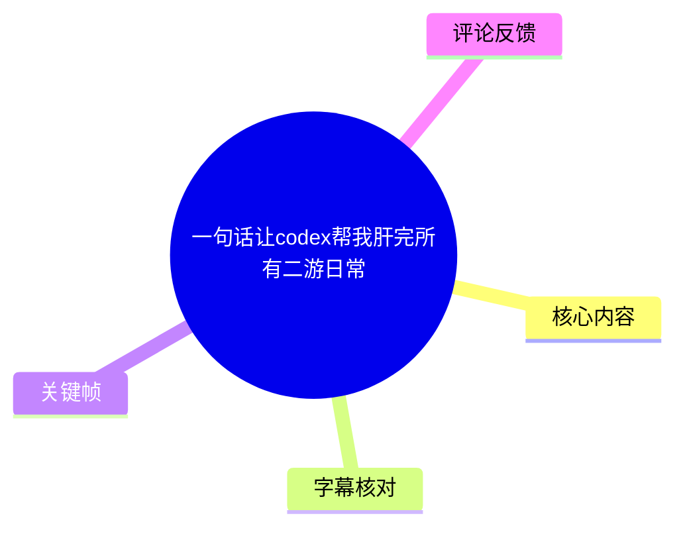
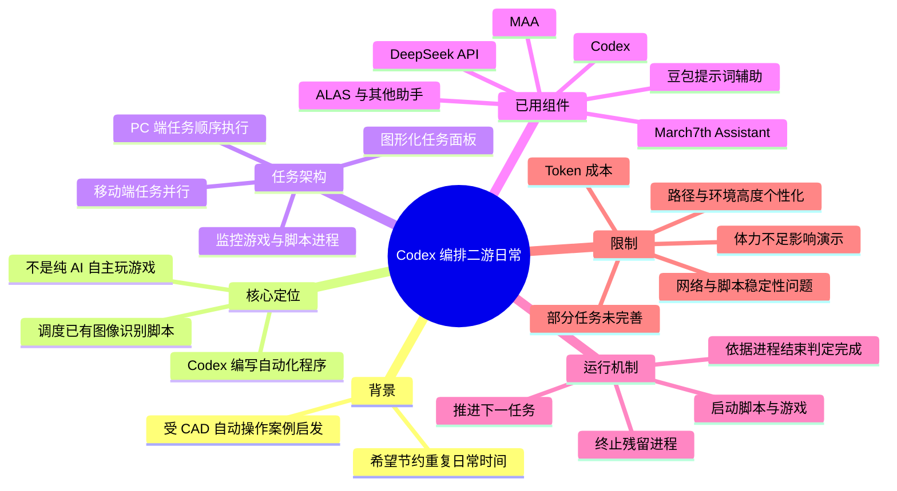
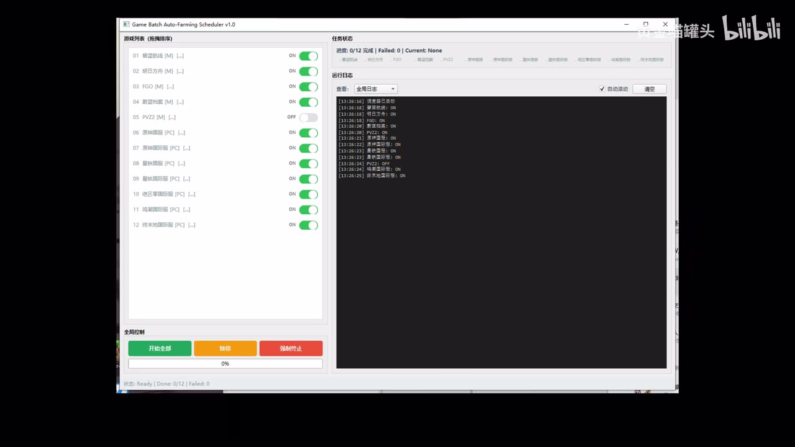
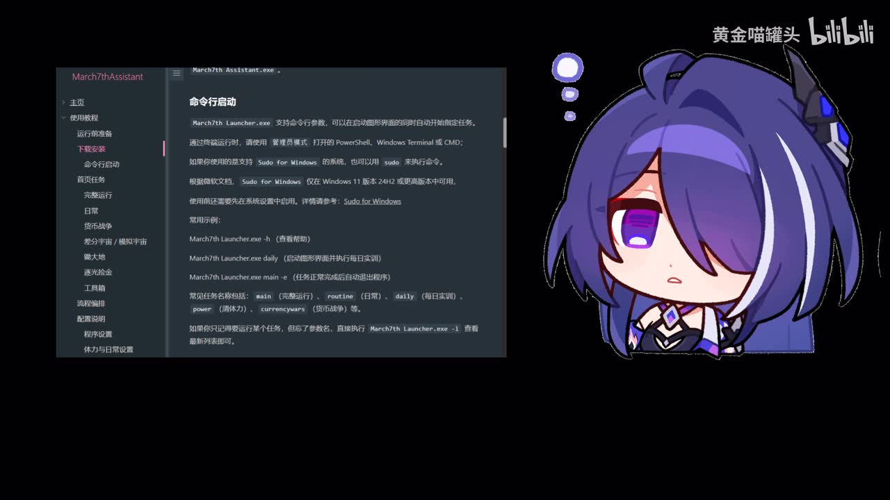

# 一句话让codex帮我肝完所有二游日常

> 来源：[Bilibili 视频](https://www.bilibili.com/video/BV1ckTT6VEf5)<br>
> UP 主：黄金喵罐头｜合集：AIcode｜时长：17:02｜分辨率：1920×1080

## 小结

视频展示的不是让 Codex 从零“学会玩游戏”，而是让 Codex 编写并调度一个本地自动化程序，再由该程序按顺序启动已有的游戏图像识别脚本、模拟器与游戏客户端，从而批量完成多个二次元游戏的日常操作。

UP 主的核心方法是：把各游戏现有脚本封装成任务，将任务启停、游戏进程监控、失败后终止、任务推进等逻辑交给 Codex 辅助编写；又使用豆包协助组织提示词，并做出一个名为 **Game Batch Auto-Farming Scheduler v1.0** 的图形化任务面板。运行时，移动端任务可并行执行，PC 端游戏则按顺序执行，以减少窗口、资源与输入控制互相冲突的概率。

该方案依赖现成自动化项目而非纯大模型视觉决策。视频中可辨识的工具/脚本包括 MAA（明日方舟自动化）与 March7th Assistant（《崩坏：星穹铁道》相关助手）；UP 主还提到 ALAS、绝区零小助手等。Codex 在其中更接近“编排器与代码生成助手”，而底层脚本才承担具体的图像识别、点击与战斗流程。

实际演示证明流程“已经能跑”，但并非稳定成品：存在网络导致任务未成功运行、脚本重复启动、体力未满导致无法完成全部日常、体力清理不彻底、中途报错，以及部分游戏脚本尚未研究完成等情况。UP 主明确称自己的程序较粗糙、代码对其而言近似黑箱，也不建议观众直接复制其程序。

适合有多个游戏、已掌握或愿意试错本地脚本自动化的用户参考其架构。对于希望“一句话安装后永久无维护”的用户，视频并未提供可直接复用的一键方案；不同电脑、路径、模拟器、账号与网络环境都需要自行修改和调试。

时效上，视频所述 Codex、DeepSeek API、游戏助手及各脚本的安装方式、兼容性和游戏机制均可能随版本更新而变化。UP 主录制时也说明不少游戏体力尚未满，因此演示不等于当日所有游戏均被完整清理。

## 思维导图





## 目录

- [背景：从 CAD 操作联想到游戏日常](#背景从-cad-操作联想到游戏日常)
- [方案定位：Codex 编排现有脚本，而非直接代玩](#方案定位codex-编排现有脚本而非直接代玩)
- [任务调度器与进程监控机制](#任务调度器与进程监控机制)
- [演示：一句话启动批量日常](#演示一句话启动批量日常)
- [任务顺序、脚本差异与异常处理](#任务顺序脚本差异与异常处理)
- [实践步骤：复现应如何拆解](#实践步骤复现应如何拆解)
- [参数、已知限制与时效性](#参数已知限制与时效性)
- [关键帧索引](#关键帧索引)
- [字幕比对](#字幕比对)
- [评论分析](#评论分析)
- [处理记录](#处理记录)

## 背景：从 CAD 操作联想到游戏日常

### 受自动操作 CAD 案例启发 [00:00](https://www.bilibili.com/video/BV1ckTT6VEf5?t=0)

UP 主先提到，朋友曾分享一个“让 Codex 操作 CAD 绘图”的视频；该视频评论区对设计行业受到 AI 冲击感到悲观。UP 主没有沿着职业替代的话题展开，而是转向一个个人效率问题：既然 Codex 能操作 CAD，能否进一步操作二游自动化脚本，例如 MAA 或绝区零相关助手，从而处理每天重复的日常内容。

其目标不是提升单个游戏的操作水平，而是将多个游戏的例行任务聚合到一次启动中，节省人工逐个打开客户端、模拟器和脚本的时间。


> 图：关键帧以命令行/AI 图标与 CAD 图标并置，直观呈现视频的起点——由“Codex 可操作 CAD”联想到“能否操作其他软件”。它有助于理解视频讨论的是桌面软件自动化，而不只是游戏脚本本身。

### 配置 Codex 与 API 的尝试 [00:42](https://www.bilibili.com/video/BV1ckTT6VEf5?t=42)

UP 主称自己“火速”安装 Codex，并接入 DeepSeek API；经过约半天的试错、修改和 Token 消耗后，确认这一思路可行。其自述并非计算机专业，对代码“完全一窍不通”，但借助模型生成与迭代，最终让程序运行起来。

视频提供的关键事实包括：

1. Codex 被用于编写和修改调度程序。
2. DeepSeek API 被接入 Codex 工作流，但视频未展示具体 API 地址、模型名、密钥配置、费用单价或完整命令。
3. 豆包被用于协助撰写提示词。
4. 若把相关自动化脚本的官网/资料一并提供给模型，模型有时可以通过生成代码完成启动和衔接。
5. 试错会产生 Token 成本；UP 主以“花了好几块 Token”描述初期成本，但未给出精确金额、调用次数或总 Token 数。

因此，视频可确认的是“模型辅助搭建本地调度流程”的可行性，而不能据此推导为“任何游戏、任何脚本都可零配置自动接入”。

## 方案定位：Codex 编排现有脚本，而非直接代玩

### 底层执行仍由成熟自动化脚本负责 [01:35](https://www.bilibili.com/video/BV1ckTT6VEf5?t=95)

UP 主强调，许多二游自动化脚本已经做得较完善：很多情况下，Codex 只需负责启动脚本，脚本自身即可继续完成图像识别和游戏内流程。换言之，系统可分为三层：

| 层级 | 在视频中的职责 | 代表对象 |
| --- | --- | --- |
| 交互层 | 用户输入一句指令，查看进度与日志 | Codex、图形化调度器 |
| 调度层 | 决定任务顺序、启动程序、监控进程、异常后推进下一项 | Codex 辅助生成的本地自动化程序 |
| 执行层 | 识别游戏画面、点击、战斗、领取等具体操作 | MAA、ALAS、March7th Assistant、其他游戏助手 |

这也是理解视频标题的关键：“一句话”触发的是预先搭好的任务编排，不代表一句自然语言就让模型即时掌握所有游戏玩法。

### 为什么不让 AI 全程视觉决策 [02:15](https://www.bilibili.com/video/BV1ckTT6VEf5?t=135)

UP 主表示，理论上也可以让 Codex 自行进行图像识别，并思考如何操作游戏；但其认为这种方式 Token 消耗太大，且可能引入高风险误操作。视频举例称，若发生类似“把原石换成体力”的错误，结果得不偿失。

因此，UP 主选择将高频、确定性较强的操作交给既有专用脚本，让大模型主要承担以下有限职责：

- 根据既定配置启动相应工具；
- 处理不同任务的启动顺序；
- 对游戏和脚本进程进行状态判断；
- 在预期任务结束后关闭残留程序；
- 按需求继续修改本地调度逻辑。

这一取舍的经验是：对稳定、重复且已有专用工具的流程，优先复用专用自动化脚本；大模型更适合作为胶水层、配置层和代码协作层，而不宜默认作为实时游戏操作器。

## 任务调度器与进程监控机制

### 图形化面板与可选任务 [02:50](https://www.bilibili.com/video/BV1ckTT6VEf5?t=170)

UP 主称自己借助模型做出了任务进度的图形化界面，并坦言可能存在更好的实现方式，但自己尚不会。关键帧中可见窗口标题为 **Game Batch Auto-Farming Scheduler v1.0**，左侧是可开关的游戏任务列表，右侧包含任务状态、运行日志及进度信息，底部提供“开始全部”“暂停”“强制终止”等全局控制。



> 图：该帧是理解系统架构的核心证据。左侧展示多项任务的启用状态，右侧展示运行日志，底部展示批量开始、暂停和强制终止能力，表明 UP 主并非仅在命令行里逐个启动脚本，而是实现了批处理调度界面。

从画面可辨识的界面信息包括：

- 任务以序号排列，可单独开关；
- 任务名称区分模拟器/PC 等运行环境；
- 顶部展示总进度、失败数和当前任务；
- 日志区可以查看运行事件；
- 底部存在全局开始、暂停、强制终止和进度条；
- 画面中任务总数显示为 **12**，初始进度为 **0/12**。

视频未展示该调度器源码、配置文件字段、操作系统版本、进程检测 API 或打包方式，故无法从素材还原可直接运行的项目。

### 以游戏和脚本进程状态驱动任务推进 [03:25](https://www.bilibili.com/video/BV1ckTT6VEf5?t=205)

UP 主说明，每个任务运行时都会监控“游戏”和“脚本/软件”两个后台进程。不同脚本对结束行为的处理不一致，调度器需要针对差异处理：

1. **脚本完成后会同时关闭脚本和游戏进程的情况**  
   UP 主以 MAA 为例，称任务完成后，MAA 会同时结束软件与游戏进程。此时调度器能较直接地认为任务结束，并推进下一项。

2. **脚本完成后仅关闭游戏进程的情况**  
   UP 主以绝区零小助手为例，称其只会终止游戏进程。因此，调度器需要先监控到游戏结束，再主动让 Codex/调度程序终止仍可能残留的脚本进程，随后再运行下一任务。

可将视频口述的状态逻辑抽象如下。以下是流程说明，并非视频公开的原始代码：

```text
启动任务
  ├─ 启动脚本 / 启动游戏或模拟器
  ├─ 周期性检查：游戏进程、脚本进程
  ├─ 若任务约定“二者均结束”：
  │    └─ 标记任务完成，启动下一任务
  ├─ 若检测到“游戏结束、脚本仍在运行”：
  │    └─ 结束脚本进程，标记任务完成，启动下一任务
  └─ 若异常、超时或启动失败：
       └─ 记录失败；视频未说明是否自动重试
```

这里的关键不是特定工具名称，而是要为每个任务定义明确的“完成条件”。仅以某一个进程是否存在作为完成判定，容易在脚本残留、客户端崩溃、启动失败或网络中断时错误推进。

### 参考 March7th Assistant 的命令行启动能力 [03:55](https://www.bilibili.com/video/BV1ckTT6VEf5?t=235)



> 图：该帧展示 March7th Assistant 的“命令行启动”文档页，能看见 `March7th Launcher.exe` 及任务名称相关说明。它说明视频方案的可行前提之一：被调度的脚本本身需要支持命令行或其他可被程序调用的启动入口。

画面中的文档内容表明 March7th Assistant 提供命令行启动方式，示例格式为：

```text
March7th Launcher.exe <任务名称>
```

画面还列出若干任务名称示例，如 `main`、`routine`、`daily`、`power`、`rewards` 等；由于关键帧文字较小且 ASR 对专名识别不稳定，本文不将其扩展解释为完整、通用的参数清单。可以确认的是：UP 主利用了脚本项目已提供的启动参数/命令入口，才有条件将其纳入统一调度。

## 演示：一句话启动批量日常

### 触发语句与预编排流程 [04:20](https://www.bilibili.com/video/BV1ckTT6VEf5?t=260)

UP 主向 Codex 表达“帮我清理游戏日常”后，系统运行此前让 Codex 编写好的程序，并依次处理多个

## 评论分析

本次流程未获取到可用热评，因此不推断观众态度或额外结论。
