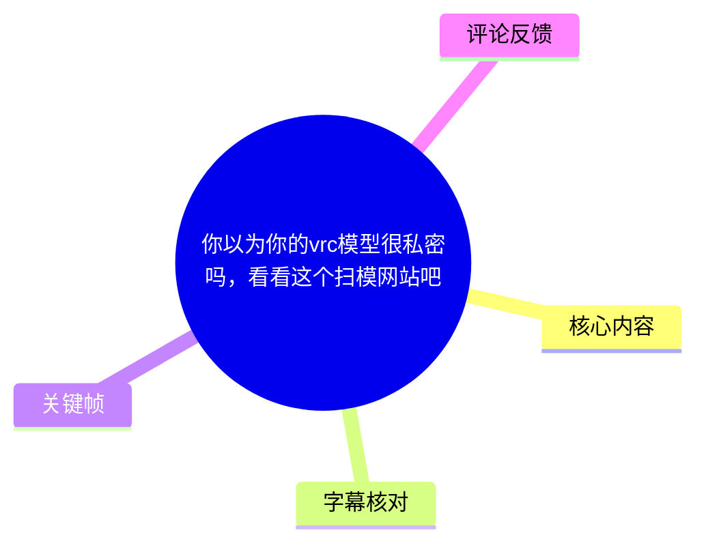
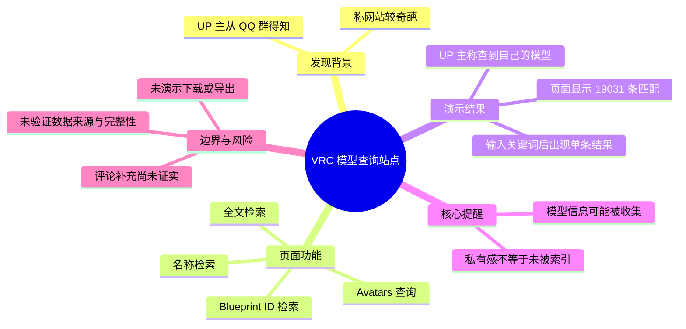
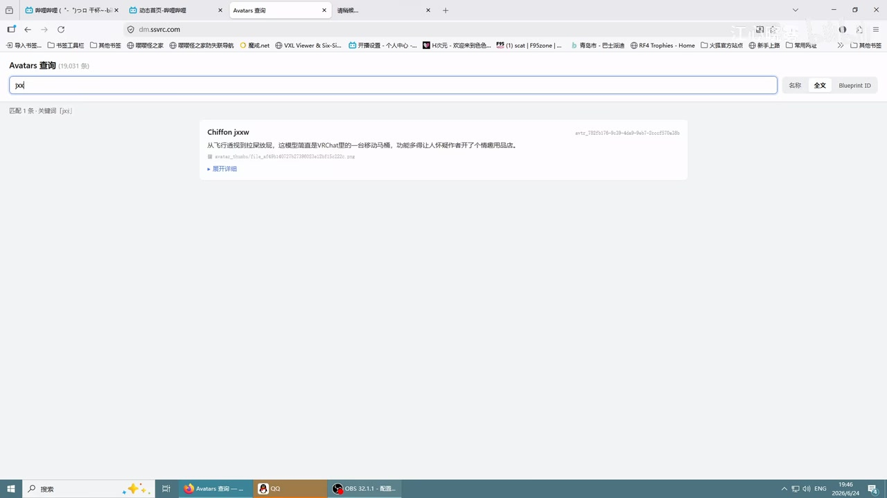
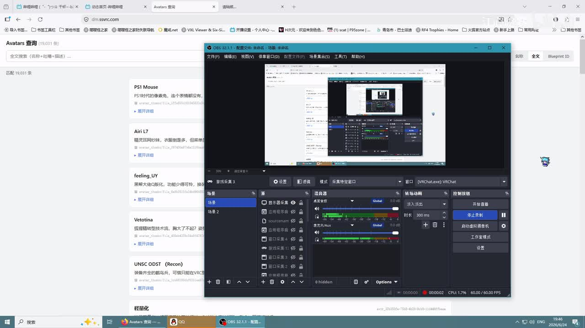
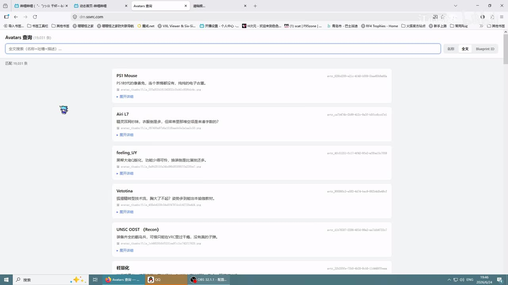

# 你以为你的vrc模型很私密吗，看看这个扫模网站吧

> 来源：[Bilibili 视频](https://www.bilibili.com/video/BV1JujZ6gEqM)<br>
> UP 主：江心晓雾｜发布时间：2026-06-24｜视频时长：75 秒｜分辨率：1920 × 1080

## 小结

视频记录了 UP 主从 QQ 群得知一个可查询 VRChat（VRC）Avatar 信息的网站后的试用过程。画面显示该网站为 `dm.svrc.com`，页面标题为“Avatars 查询”，并提供按**名称、全文、Blueprint ID**检索的入口；视频录制时页面显示可匹配的条目数量为 **19,031 条**。

UP 主的核心观点是：VRC 模型即便被使用者视为“独一无二、保密、私有”，也可能已经被他人收集并建立索引，因此可以尝试用模型名称等线索检索自己模型是否出现在该站的结果中。UP 主检索自己的模型后称“还真有”，但认为这对自己的攻击性“不太大”。

视频实际演示的步骤较少：进入查询页、观察默认结果、在搜索框内输入关键词、查看命中模型卡片。它没有展示模型下载、导出、登录、举报、删除记录、权属申诉或站点数据来源的具体操作；因此，不能仅依据本视频推断该站是否保存完整模型文件、是否具备下载能力，或某一条目是否等同于侵权事实。

值得注意的是，热评中有人将该站解释为“好心人爬资料下来让用户查询模型是否被盗”的工具，并称被提及的“盗模网站”强制登录；这是评论者提供的背景说法，**并未由视频本身证实**。视频的有效信息主要是：该查询页面在录制时可见、可检索到模型相关条目，以及 UP 主本人称检索到了自己的模型。

本条内容适合 VRC Avatar 创作者、模型购买者、世界制作者及关注虚拟形象资产隐私的人阅读。由于站点数据、索引数量、检索规则和可访问性均可能随时间变化，视频反映的是录制时的界面与现象，不应视为对当前站点功能的永久描述。

## 思维导图





## 目录

- [发现网站与问题背景](#发现网站与问题背景)
- [查询页面与可见技术信息](#查询页面与可见技术信息)
- [检索模型的演示步骤](#检索模型的演示步骤)
- [UP 主的隐私判断与适用范围](#up-主的隐私判断与适用范围)
- [关键帧解读](#关键帧解读)
- [结论、限制与时效性](#结论限制与时效性)
- [字幕比对](#字幕比对)
- [评论分析](#评论分析)
- [处理记录](#处理记录)

## [发现网站与问题背景](https://www.bilibili.com/video/BV1JujZ6gEqM?t=1)

### [从 QQ 群得知查询网站（00:01）](https://www.bilibili.com/video/BV1JujZ6gEqM?t=1)

UP 主开场自称“真人小悟”，称自己逛到了一个“比较奇葩的网站”，并说明消息来源是 QQ 群。这里的“奇葩”是 UP 主的主观评价，不构成对网站合法性、技术实现或运营目的的事实判定。

视频标题将其称作“扫模网站”，但正文画面实际展示的是一个模型信息查询界面。基于画面和口播，较稳妥的表述是：这是一个提供 VRC Avatar 条目检索的站点；至于它是否“扫取”模型、扫取何种数据、是否保存资源本体，视频没有给出可验证的技术证据。

### [网站入口被带过，名称未被清晰口播（00:09）](https://www.bilibili.com/video/BV1JujZ6gEqM?t=9)

ASR 在此处识别为“这个网络叫这个”，语义不完整，未能可靠识别 UP 主是否说出了站点名称。结合关键帧可直接读取的信息，浏览器地址栏显示为：

```text
dm.svrc.com
```

页面左上角标题为“Avatars 查询”。此域名和页面标题来自画面可见文字，而不是对 ASR 模糊词语的臆测。

## [查询页面与可见技术信息](https://www.bilibili.com/video/BV1JujZ6gEqM?t=13)

### [可检索目标：自己的模型是否出现（00:13）](https://www.bilibili.com/video/BV1JujZ6gEqM?t=13)

UP 主说明，可以在该网站上搜索“有没有自己的模型”。从页面设计看，查询对象是 Avatar 条目而非普通网页内容。画面中可见的检索选项包括：

| 页面可见字段/选项 | 可据画面确认的含义 |
| --- | --- |
| 名称 | 按 Avatar 名称检索 |
| 全文 | 按全文范围检索 |
| Blueprint ID | 按 Blueprint ID 检索 |
| 全文搜索输入框 | 占位提示为“名称+描述+标签” |
| 展开详细 | 单个结果卡片可展开查看更多信息 |

页面默认状态显示“匹配 19,031 条”。该数值是视频录制时界面显示的查询结果数量或索引条目数量；视频未解释其统计口径，不能进一步断言它代表唯一模型总数、文件总数或可下载资源总数。


> 图：该关键帧展示 `dm.svrc.com` 的“Avatars 查询”页面。页面顶部有搜索框及“名称 / 全文 / Blueprint ID”选项，列表区域展示多个 Avatar 条目和“展开详细”入口；它是确认视频讨论对象为“可检索条目库”的直接画面依据。

### [UP 主自己的检索结果与主观感受（00:18）](https://www.bilibili.com/video/BV1JujZ6gEqM?t=18)

UP 主称自己搜索后“还真有”，并表示“还真有一点攻击性”；随后补充说，对自己而言攻击性“不太大”。这段话可拆分为两层：

1. **可记录的个人经历**：UP 主声称在站内查到了自己的模型。
2. **主观风险判断**：UP 主认为该结果对自己的实际影响有限。

视频没有展示该模型的完整详情页、创建者信息、来源链接、文件哈希、上传时间、许可协议、下载入口或模型文件本体。因此，无法从视频判断该条目是否为同名模型、复刻模型、描述信息、缓存记录，还是完整资源的索引。

## [检索模型的演示步骤](https://www.bilibili.com/video/BV1JujZ6gEqM?t=13)

### [按画面可复现的查询流程（00:13）](https://www.bilibili.com/video/BV1JujZ6gEqM?t=13)

视频可观察到的操作顺序如下：

1. 打开 `dm.svrc.com` 的“Avatars 查询”页面。
2. 观察页面顶部搜索输入框及检索范围选项。
3. 根据查询目标选择页面提供的范围：**名称、全文或 Blueprint ID**。
4. 在输入框中填入关键词；画面中曾输入类似 `jxx` 的短关键词。
5. 查看页面返回的匹配结果及每个卡片的“展开详细”入口。
6. 如需核实某个条目，应继续查看详情并自行比对名称、描述、标识符及其他可见信息；但这一步并未在视频中实际展示。



> 图：该关键帧显示搜索框内输入了短关键词，页面提示“匹配 1 条”，并返回名为“Chiffon jxx”的条目。它说明页面会随关键词收窄结果；但仅凭该画面不能确认该条目与任何特定创作者或模型文件之间的权属关系。

### [视频未展示的关键步骤与限制](https://www.bilibili.com/video/BV1JujZ6gEqM?t=57)

以下事项没有在视频中演示，不能补写为既定功能：

- 没有展示账号注册、登录或权限控制；
- 没有展示下载模型、导出资源或获取 Unity 工程；
- 没有展示 Blueprint ID 的具体输入示例；
- 没有展示“展开详细”后的字段内容；
- 没有展示数据更新频率、爬取范围、数据来源或站点维护者；
- 没有展示条目删除、申诉、版权投诉或隐私处理渠道；
- 没有展示如何确认“同名条目”就是自己的原始模型。

因此，实际使用时，“检索到名称”最多可作为进一步核对的线索，不能单独作为模型被盗、模型可被下载或平台存在违规行为的结论。

## [UP 主的隐私判断与适用范围](https://www.bilibili.com/video/BV1JujZ6gEqM?t=34)

### [“私有”模型可能已被外部索引（00:34）](https://www.bilibili.com/video/BV1JujZ6gEqM?t=34)

UP 主指出，用户可能认为 VRC 模型“很独一无二、很保密、很私有”，但实际上可能已经被他人“直接扒开了”。这是一种风险提醒：模型的可见性、使用环境、名称、描述或标识信息，可能使其被外部收集并纳入检索库。

需要区分以下概念：

| 概念 | 视频能够支持的程度 |
| --- | --- |
| 模型相关条目可能被检索 | 画面与 UP 主个人搜索经历支持 |
| 模型完整文件已被公开 | 视频未展示，无法确认 |
| 模型可被任意下载 | 视频未展示，无法确认 |
| 某一索引条目必然侵权 | 视频未给出来源和权属证据，无法确认 |
| 用户对模型私密性的预期存在风险 | 属于 UP 主的核心提醒，具有情境参考价值 |

### [查询建议与安全经验（00:57）](https://www.bilibili.com/video/BV1JujZ6gEqM?t=57)

UP 主建议用户“去查一下自己的模型”，认为“有点意思”。若将这条建议用于风险自查，可遵循较审慎的做法：

1. 先使用模型名称、公开描述或自己已知的 Blueprint ID 等信息查询。
2. 不要因为“同名”就直接认定结果一定是自己的模型，应进一步核对可见详情。
3. 不要在未知站点输入账号密码、私密文件、支付信息或不必要的身份资料。
4. 若发现疑似关联条目，应保留页面截图、查询时间、URL 和可见字段，用于后续自行核验。
5. 涉及版权、隐私或平台规则的问题，应以实际资源来源、授权记录和平台申诉渠道为准，而非仅以检索结果为依据。

其中第 3 至第 5 点属于基于视频情境给出的通用安全建议，不是 UP 主在视频中逐项讲解的操作。

## [关键帧解读](https://www.bilibili.com/video/BV1JujZ6gEqM?t=13)

### [查询站的页面结构](https://www.bilibili.com/video/BV1JujZ6gEqM?t=13)



> 图：关键帧同时呈现浏览器中的 Avatar 查询页与 OBS 录制窗口。浏览器页面显示多个模型结果卡片，验证了视频是对实际网页操作的录屏，而非仅口头描述；OBS 的递归预览属于录制环境，不是网站功能的一部分。

### [默认数据量与模型卡片信息](https://www.bilibili.com/video/BV1JujZ6gEqM?t=13)



> 图：页面显示“匹配 19,031 条”，并列出如“PS1 Mouse”“Airi L7”“feeling_UY”等条目。卡片还带有描述片段、疑似标识字符串及“展开详细”链接，说明站点至少索引了名称与部分文本信息；画面未显示资源文件本体。

## [结论、限制与时效性](https://www.bilibili.com/video/BV1JujZ6gEqM?t=64)

UP 主最后重申：用户以为模型“私有、保密”，但 VRC 圈内可能存在能够收集、索引相关信息的人。视频最有价值的部分不是提供了完整的维权或防盗方案，而是提醒创作者：不要把“自己认为私有”直接等同于“未被外部观察、记录或检索”。

本视频的限制同样明确：

- 只有约 75 秒，演示深度有限；
- 网站名称的口播在 ASR 中不清晰，本文以画面中的地址栏信息为准；
- UP 主只展示了搜索结果，没有展示资源下载或详细数据结构；
- 站点性质、运营者、数据来源、收录规则与合规性均未被视频验证；
- 热评关于“绕过强制登录盗模网站”的说法是用户评论，不能当作已核实事实；
- 站点页面、条目数量和功能可能在视频发布后调整、关闭或改变访问条件。

因此，正确的阅读方式是：将视频看作一次针对“VRC 模型信息可能被公开索引”的个人发现与风险提醒，而非对某个站点能力、侵权状态或模型泄露范围的最终调查结论。

## 字幕比对

| 字幕来源 | 完整性 | 专有名词 | 时间轴 | 主要问题 |
| --- | --- | --- | --- | --- |
| Bilibili 站内字幕 | 未提供可用字幕，无法比对 | 无法评估 | 无法评估 | 素材清单明确标注“未提供可用站内字幕” |
| 本次 ASR 字幕 | 较完整，共 9 段，语音覆盖约 63.92 秒 / 74.33 秒 | “VRC”识别正确；站点名称相关表述不清 | 有分段时间戳，首段 00:01.420，末段结束 01:12.660 | “这个网络叫这个”“这个罗网”等存在明显听写或语义不完整问题 |

本次 ASR 使用 `medium` 模型，识别语言为中文，语言置信度为 `0.99609375`；诊断显示语音覆盖率约为 `0.86`，且未报告大段语音缺口。素材提供了正常的音频文件和 ASR 结果，诊断中**没有**标记 `noAudioStream=true`，故不属于“源视频没有音轨”的情形。

最终采用策略为：以本次 ASR 的时间戳作为章节定位依据，以关键帧中的页面文字校正 ASR 无法可靠识别的内容。重要校正如下：

| 项目 | ASR 表述 | 采用的谨慎表述 | 依据 |
| --- | --- | --- | --- |
| 站点名称 | “这个网络叫这个” | 不据此确定名称 | ASR 语义不完整 |
| 网站地址 | 未可靠识别 | `dm.svrc.com` | 浏览器地址栏画面 |
| 页面功能 | “搜一下有没有自己的模型” | 检索 Avatar 条目是否出现 | 口播与“Avatars 查询”页面共同支持 |
| VRC | “VRC模型” | VRChat（VRC）Avatar / 模型 | 标题、标签及 ASR 一致 |

## 评论分析

仅处理素材中可获取的热评前三条。评论反映的是观众观点或个人理解，不构成已验证事实。

1. **夏羽綾理（22 赞）**  
   评论称，该站是“好心人爬资料下来”供用户查询模型是否被盗的站点，并称另一个“盗模网站”强制登录，此站可帮助用户绕过该限制。  
   - **补充价值**：提出了可能的数据来源、用途以及与其他站点的关系。  
   - **可信度边界**：视频没有展示被指称的网站、强制登录机制、爬取过程或绕过方式；因此这只能记录为评论者说法，不能据此确认网站目的或技术能力。

2. **Cjun菌菌菌（2 赞）**  
   评论提出疑问：“我随机密码他不炸了吗”。  
   - **观点指向**：可能在质疑登录或密码相关机制的安全性、稳定性，原句上下文不足。  
   - **可信度边界**：视频没有演示登录、密码输入或接口行为，无法据此判断站点是否存在密码校验问题、爆破风险或漏洞。

3. **红丯cbab（14 赞）**  
   评论询问：“扫走试用模型是何意味”。  
   - **观点指向**：观众对“扫模”与“试用模型”之间的具体含义存在疑问。  
   - **补充价值**：反映视频没有解释“扫模”的技术流程和资源范围。  
   - **可信度边界**：该评论是提问，不提供可验证结论；视频也没有展示扫描或抓取行为的细节。

## 处理记录

- Worker ID：`worker-mrj0wjed-b0c290ad`
- 生成模型：`gpt-5.6-terra`
- 素材处理模型：ASR `medium`，中文识别，CUDA / `float16`
- 使用素材与工具产物：`merged.mp4`、`audio/audio.wav`、`asr/transcript.srt`、`asr/asr-result.json`、`comments/comments.json`、关键帧目录 `frames/`
- 字幕选择：站内字幕未提供可用版本；已检查本次 ASR，采用其真实分段时间戳定位章节，并以关键帧可见文字校正站点地址、页面标题和搜索字段。
- 时间轴依据：主要使用 ASR SRT / 分段结果中的起始时间，链接秒数分别对应 1、9、13、18、34、49、57、64 秒；未按文字顺序臆测未提供时间的位置。
- 关键帧选择依据：`frame-001.jpg` 用于确认录屏环境与查询页同时出现；`frame-002.jpg`、`frame-003.jpg` 用于确认页面标题、搜索选项、19,031 条匹配数及结果卡片；`frame-004.jpg` 用于确认输入关键词后可收窄至单条结果。未将关键帧中不可辨认的小字扩展为事实。
- 评论处理：仅纳入可获取热评前三条，且明确区分评论观点与视频可验证内容。
- 缓存清理：未提供缓存清理执行日志；本记录不声称已执行缓存删除。
- 未解决问题：无法从现有素材确认站点运营者、数据来源、收录机制、是否保存完整模型文件、是否支持下载、当前可访问状态，以及条目与原始模型之间的权属关系。
