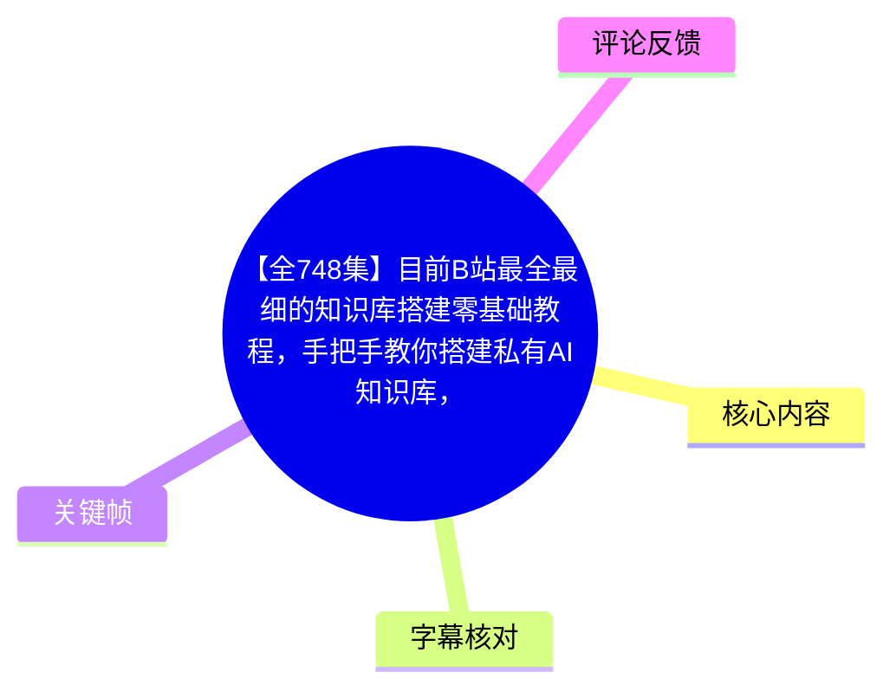
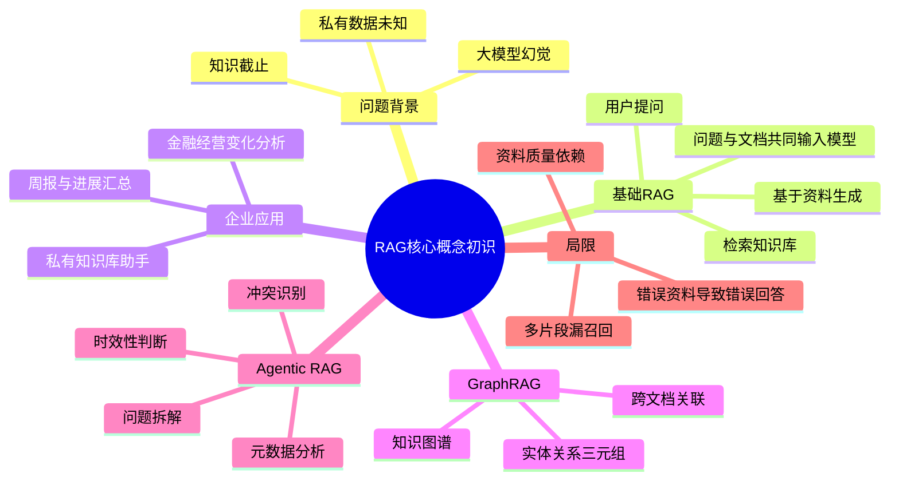

# 【全748集】目前B站最全最细的知识库搭建零基础教程，手把手教你搭建私有AI知识库，从RAG原理到项目落地全教学，全程干货无废话，让你少走99%弯路！

> 来源：[Bilibili 视频](https://www.bilibili.com/video/BV143Vm67EhL)  
> UP 主：AI产品实战｜合集：AIcode｜视频元数据总时长：12:42:29  
> 本文实际可核验内容范围：**P1《RAG核心概念初识》**，站内字幕时长约 13:50；其余分P仅依据页面标题做目录性记录，未获得对应字幕/ASR，不将其标题扩写为具体教学内容。

## 小结

本节以企业私有知识库为切入点，介绍了 RAG（Retrieval-Augmented Generation，检索增强生成）为什么出现、基本运行方式、典型企业应用，以及 GraphRAG、Agentic RAG 两个扩展方向。核心思路是：在模型回答前，先从外部知识库检索相关资料，再把“问题 + 资料”交给大模型生成答案；视频将其类比为“开卷考试”。

视频认为，通用大模型有三类关键限制：会产生幻觉、知识存在截止日期、不了解企业私有数据。RAG 的价值不是让模型天然“知道”企业数据，而是在每次问答时按需取回可用资料，以此为生成提供上下文依据。

在企业场景中，视频展示了周报汇总、团队进展报告、金融/经营信息关联分析等方向，并提出图数据库或知识图谱可作为知识库的一种载体。对于跨文档关系问题，GraphRAG 通过“实体—关系—实体”的三元组建模，增强跨文档关联理解。

对于政策时效、数据冲突与抽象问题，视频将 Agentic RAG 描述为在 RAG 流程中引入智能体：分析文档元数据、识别较新的权威资料、发现矛盾、拆解复杂问题并分步检索。它强调的重点是检索和决策过程的增强，而非单次向量召回。

需要注意，视频中“90%以上企业 AI 应用使用 RAG”“将幻觉概率降至 5% 以下”“某模型错误率 26%”等均为讲述者在视频中的陈述或引用，素材未提供原始报告、实验条件、评测集、模型配置或可复现实验，不能直接视为通用结论。RAG 同样会因漏召回、资料过期、资料质量低或冲突而产生不完整甚至错误的答案。

## 思维导图





## 目录

- [阅读范围、课程元数据与时效性](#阅读范围课程元数据与时效性)
- [大模型为何需要 RAG](#大模型为何需要-rag-0000)
- [RAG 的定义与基础工作流](#rag-的定义与基础工作流-0321)
- [企业知识库与图谱应用场景](#企业知识库与图谱应用场景-0449)
- [GraphRAG：用三元组连接跨文档知识](#graphrag用三元组连接跨文档知识-0710)
- [Agentic RAG：处理时效、冲突与复杂问题](#agentic-rag处理时效冲突与复杂问题-0935)
- [RAG 的局限、实践检查清单与结论](#rag-的局限实践检查清单与结论-1215)
- [其余分P课程目录（仅元数据）](#其余分p课程目录仅元数据)
- [关键帧说明](#关键帧说明)
- [字幕比对](#字幕比对)
- [评论分析](#评论分析)
- [处理记录](#处理记录)

## 阅读范围、课程元数据与时效性

本视频页面元数据包含 **65 个分P**，总时长为 45,749 秒；标题宣称“全748集”，但当前可获取的页面分P元数据是 65 个，二者口径不一致，本文不对“748集”的具体构成作推断。

本次提供的站内字幕文件为 `p01-ai-zh.srt`，本次 ASR 音频时长为 830.37 秒，均对应 **P1《RAG核心概念初识》**。因此，以下带时间轴的正文均基于 P1 的实际字幕时间；无法用 P1 的时间戳代表整个 12 小时合集。

视频内容中出现了“2026 年”“2025 年 12 月”“2024 年 10 月”等时间说法，属于讲述时的案例背景。尤其模型版本、知识截止日期、产品能力、企业政策与框架生态变化很快，阅读时应把这些信息视为**有明确时点的课程陈述**，而非长期有效的产品规格。

## 大模型为何需要 RAG [00:00](https://www.bilibili.com/video/BV143Vm67EhL?t=0)

### 1. 幻觉是生产环境风险

视频开场指出，大模型可能会编造内容或生成错误答案；当模型表达更流畅、更像正确答案时，人工更难识别错误，因而风险更高。

讲述者提出两个数值性判断：

- “90%以上的企业 AI 应用”使用 RAG；
- 引入 RAG 后，可以把大模型产生幻觉的概率降到 5% 以下。

这两个数字没有在素材中给出统计样本、行业范围、RAG 实现方案、评测口径或对照实验。更稳妥的理解是：**RAG 可以通过提供外部依据降低无依据生成的风险，但不保证消除幻觉。**

### 2. 视频引用的模型错误率案例

在约 01:49 处，讲述者称其从 OpenAI 官网获得数据，并提到：

- `GPT-5 Thinking Mini`；
- 该模型于“2025 年 12 月发布”；
- 官方给出的错误率“仍高达 26%”。

这段内容是视频的引用性陈述。当前素材没有附上对应网页链接、指标名称或指标上下文，因此不能确认“26%”具体是何种错误率，也不能据此横向比较所有模型。它在课程中的作用是说明：即使模型能力提升，错误输出风险仍需通过外部知识、检索、约束和验证机制来管理。

### 3. 知识更新与私有数据限制

视频进一步说明，基础模型依赖训练过程学习公开信息，但训练不可能每天进行，原因是成本高昂。因此：

1. **知识可能过期**：模型难以可靠回答当天新闻、即时推荐等实时问题。
2. **私有数据不可见**：企业内部制度、周报、客户资料、产品数据等不属于公开训练集，模型默认并不掌握。
3. **没有依据的企业内部回答不可信**：视频的表述较绝对，实践中应理解为：若系统没有接入企业数据或工具，就不应把模型对内部事实的回答视为可靠来源。

视频举例称，在 2026 年询问某模型知识截止时间时，模型回答其知识截至 2024 年 10 月。该案例意在强调“训练知识”和“实时/企业知识”之间存在缺口。

## RAG 的定义与基础工作流 [03:21](https://www.bilibili.com/video/BV143Vm67EhL?t=201)

### 1. 定义：检索与生成结合

视频将 RAG 定义为“检索增强生成”，即将**信息检索**与**文本生成**结合：

> 模型回答前先从外部知识库获取相关信息，再根据这些信息生成相对准确、可靠的回答。

讲述者使用“开卷考试”作类比：模型不直接凭参数记忆作答，而是先阅读系统提供的资料。

### 2. 视频描述的最小闭环

```text
用户问题
  ↓
到知识库中查找相关文档片段
  ↓
将「用户问题 + 检索出的文档」共同交给大模型
  ↓
模型参考资料生成答案
```

这里隐含两套不同的职责：

| 环节 | 作用 | 关键风险 |
| --- | --- | --- |
| 知识库 | 保存企业/外部可用资料 | 文档过期、缺失、错误、权限不当 |
| 检索 | 找到与问题相关的片段 | 漏召回、召回噪声、相关性不足 |
| 上下文组装 | 将问题和资料放入模型输入 | 超出上下文窗口、资料顺序影响、引用混乱 |
| 大模型生成 | 基于资料组织语言并回答 | 忽略资料、错误推理、补充未被支持的内容 |

视频未讲解具体向量模型、向量数据库、召回数量、相似度阈值、提示词模板或引用溯源格式；这些属于后续分P可能涉及的内容，不应从本节推定具体参数。

### 3. RAG 解决什么、不解决什么

**适合解决：**

- 将企业内部资料临时提供给模型；
- 使回答可受已检索资料约束；
- 降低模型仅凭预训练知识回答私有问题的概率；
- 用可更新知识库替代频繁重新训练模型。

**不能天然解决：**

- 检索根本没有找到答案；
- 知识库中的资料本身错误；
- 多份资料相互矛盾；
- 旧政策和新政策混在一起；
- 模型无视上下文或错误整合上下文；
- 没有权限控制时的敏感信息泄露问题。

## 企业知识库与图谱应用场景 [04:49](https://www.bilibili.com/video/BV143Vm67EhL?t=289)

### 1. 企业周报/团队进展汇总

视频以“总结公司周报”为例，说明传统通用模型缺少企业资料时难以完成内部总结。若系统接入企业知识库，可让模型根据已有资料回答：

- 团队本周发生了哪些变化；
- 任务进展如何；
- AI 相关指标或数据量有何提升；
- 形成小组工作进展汇报。

这里的关键前提并不是模型“知道公司”，而是周报、指标、项目记录等信息已被纳入可检索知识源，并能够被正确检索出来。

### 2. 图数据库与知识图谱

视频将图数据库描述为知识库的一种载体，其特点是基于知识图谱组织信息。该部分暂未深入图数据库技术细节，仅强调它可与大模型结合，用于组织实体、关系和经营信息。

视频给出的金融/经营分析场景包括：

- 为企业或用户经营数据构建知识图谱；
- 跟踪合作企业的经营变化；
- 分析客户需求；
- 挖掘潜在的合作需求和商业机会。

此类能力依赖数据来源质量、实体消歧、关系抽取准确性及权限/合规边界。视频没有提供金融数据接入方式、图数据库产品、实体 schema 或效果评估，因此不能将其视为已验证的落地方案。

### 3. 对企业落地的可迁移经验

从视频案例可归纳出一个较稳妥的实施顺序：

1. 明确问题：如周报总结、政策问答、经营变化分析。
2. 确定资料来源：周报、制度、产品资料、数据报表等。
3. 处理资料更新：保留创建时间、最后修改时间、来源、有效期等元数据。
4. 设计检索和答案约束：只基于证据回答，必要时显示出处。
5. 用真实业务问题测试：不仅测试“能否回答”，还要测试是否遗漏、是否采用过期信息、是否混淆冲突资料。

## GraphRAG：用三元组连接跨文档知识 [07:10](https://www.bilibili.com/video/BV143Vm67EhL?t=430)

### 1. 视频中的定义

视频将 GraphRAG 描述为：把**知识图谱过程**融入传统 RAG。相较于仅按文本片段相似度检索，它试图通过实体与关系来理解不同文档间的内部关联。

### 2. 三元组：实体、关系、实体

视频用影视文本举例解释知识图谱三元组：

```text
实体 1：电影《肖申克的救赎》
关系：主演
实体 2：摩根·弗里曼
```

即：

```text
《肖申克的救赎》 — 主演 — 摩根·弗里曼
```

视频将“电影”“演员”等可被识别的对象称为实体，将“主演”等连接两个实体的语义称为关系。两个实体和一个关系共同构成三元组。

### 3. 跨文档关联的案例逻辑

讲述者称，将《肖申克的救赎》与《复仇者联盟》相关介绍交给 AI，以三元组路径形式推理关系。其想表达的能力是：

1. 从不同文档中识别相同实体；
2. 提取该实体与各文档对象间的关系；
3. 通过共享实体建立跨文档连接；
4. 支持更复杂的关联查询。

视频中提及摩根·弗里曼与《肖申克的救赎》、以及“尼克·弗瑞”等关系作为示例。但这类示例涉及具体影视人物/演员事实，素材仅提供口述内容，且 ASR 对专有名词识别存在误差；本文仅记录其作为课程中的知识图谱演示逻辑，不将其用作影视事实核验依据。

### 4. GraphRAG 的适用边界

视频的结论是 GraphRAG 有助于“一句话搜遍企业所有知识库”。更严谨地说，GraphRAG 更适用于以下类型的问题：

- 答案分布在多份文档，且需要拼接关系链；
- 需要回答“谁与谁有什么关系”“某事件影响了哪些对象”等关联问题；
- 文档中实体复用多、关系结构重要；
- 仅靠局部文本相似度难以覆盖全局关系。

它并不自动保证正确性。实体抽取错误、同名实体混淆、关系定义不统一、图谱未更新，都会将错误结构传递到后续检索和生成中。

## Agentic RAG：处理时效、冲突与复杂问题 [09:35](https://www.bilibili.com/video/BV143Vm67EhL?t=575)

### 1. 视频中的定位

视频将 Agentic RAG 定义为：在 RAG 过程中引入 Agent（智能体）。讲述者将智能体概括为能够自主决策、规划并完成任务的机制。

与基础 RAG 相比，视频强调 Agentic RAG 不只做一次静态检索，而是可根据问题和资料状态进行判断、选择、拆解与多步查询。

### 2. 场景一：根据文档元数据处理政策时效

问题示例：**“公司远程办公政策是什么？”**

视频指出，传统 RAG 可能同时检索到 2020—2026 年的多个版本，其中旧政策已经失效。Agentic RAG 可以分析文档元数据，例如：

- 文档编辑年份；
- 最后修改时间；
- 与“当前政策”相关的时效信息。

随后选择视频所称“2026 年最新、最权威”的政策，并丢弃过时内容。

这一做法的真正前提是：文档的日期、状态、发布主体、有效期等元数据真实且可用。仅凭“最后修改时间较晚”未必能证明内容更权威，因此实际系统还应定义来源等级和政策生效状态。

### 3. 场景二：识别数据冲突

问题示例：**“Q1 季度预算是多少？”**

视频指出，多份文档可能包含不同预算数字。Agentic RAG 可以识别矛盾，再采用相对权威、准确的答案。

可将其拆解为以下实际决策链：

```text
查询预算问题
  ↓
召回候选预算资料
  ↓
抽取预算数值、币种、统计口径、季度、版本、审批状态
  ↓
发现数字或口径冲突
  ↓
按权威来源、审批状态、时间有效性进行排序
  ↓
输出结论，并应说明依据或提示存在冲突
```

视频没有给出冲突检测算法、权威度评分规则或自动裁决标准。高风险财务问题中，不应仅由模型静默选择一个数字；更稳妥的做法是展示证据、标注版本，并把无法消解的矛盾交给人工确认。

### 4. 场景三：将抽象问题拆成可检索子问题

问题示例：**“我司产品定价与某竞争对手有什么区别？”**

视频认为，这类问题通常没有一份文档能直接给出答案。Agentic RAG 可将其拆解为：

1. 我司产品功能是什么；
2. 我司产品定价是什么；
3. 竞争对手是谁；
4. 竞争对手产品功能是什么；
5. 竞争对手产品定价是什么；
6. 汇总信息后生成比较结论。

这体现了复杂问答从“一次召回”改为“计划—检索—整合—回答”的过程。但比较类结论还需满足资料同一性：价格地区、套餐、币种、时间点、功能版本与适用对象必须可比，否则模型可能产生表面完整、实际失真的对比。

## RAG 的局限、实践检查清单与结论 [12:15](https://www.bilibili.com/video/BV143Vm67EhL?t=735)

### 1. 局限一：答案分散导致漏召回

视频指出，一个问题的答案可能散落于多个文档或文本片段。如果系统只找到部分片段，或者遗漏关键片段，生成内容就可能不完整，甚至错误。

这说明“检索到一些相关资料”不等于“检索到了完整证据”。尤其涉及流程、制度例外、跨部门协作、时间序列事件时，需要考虑多跳检索、父文档回溯、关系检索或人工复核。

### 2. 局限二：高度依赖检索资料质量

视频以“企业有 10 万份文档、搜索到 100 份、其中只有两份有用”为例，强调噪声资料和错误资料会污染最终答案。原字幕中关于“剩余文档/垃圾文档”的数量表述存在口误与前后不一致，核心意思是：**大量低质、错误或误导性资料会使模型生成虚假或矛盾答案。**

可将风险拆为三层：

| 风险层 | 具体问题 | 结果 |
| --- | --- | --- |
| 知识层 | 文档过期、错误、重复、无来源 | 检索到的证据不可信 |
| 检索层 | 相关内容漏召回，无关内容排在前面 | 上下文不完整或噪声过多 |
| 生成层 | 模型错误整合、忽略证据、自行补充 | 答案表面流畅但事实不稳 |

### 3. 面向落地的检查清单

根据本节的限制，可在上线前至少检查：

- [ ] 知识库是否标记来源、创建时间、最后修改时间、有效期和权限？
- [ ] 旧政策是否已下架、失效或明确标记为历史版本？
- [ ] 同一问题的答案是否可能散落在多份文档中？
- [ ] 是否存在大量重复、低质量、OCR 错误或相互冲突的文档？
- [ ] 是否可以展示回答引用了哪些文档片段？
- [ ] 当没有足够证据时，系统是否会明确回答“不确定/未检索到”？
- [ ] 涉及预算、政策、定价等高风险信息时，是否设置人工审核或权威来源优先规则？
- [ ] 是否用真实业务问题持续评估召回完整性、答案准确性和时效性？

### 4. 本节结论

RAG 的核心价值在于把可更新、可管理的外部知识引入回答过程，以缓解通用模型的知识截止和私有知识缺失问题。GraphRAG 侧重关系结构与跨文档连接；Agentic RAG 侧重多步检索、时效判断、冲突处理和问题拆解。

但 RAG 不是“接入文档即可可靠回答”的万能方案。知识质量、版本治理、检索质量、上下文组织、冲突处理与答案验证，共同决定了系统是否可信。

## 其余分P课程目录（仅元数据）

以下仅依据视频页面 `pages` 字段记录，不代表本文已取得或核验这些分P的具体教学内容：

| 范围 | 分P主题 |
| --- | --- |
| P2—P9 | RAG 向量索引全流程构建、检索结果重排序、文档智能分块、文本向量化、GraphRAG 底层原理、LangChain 开发 RAG、多路由动态知识库、LLM 重排序 |
| P10—P29 | 基础 RAG 流程、解析、Docling、表格序列化、分块、向量化、检索、父页面检索、增强、生成、CoT、提示词、调参、总结、RAG Challenge、RAG 系统实操 |
| P30—P43 | LangChain V1.2 特性、Windows/Mac API 配置、Hello LangChain、模型调用、提示词、Messages、System Prompt、OutputParser、Chain/LCEL、RunnableLambda、JSON、工具调用、中间件 |
| P44—P51 | RAG 入门、Document Loader、文档切分、Embedding 选择、L2/余弦/内积、ChromaDB、建筑行业知识问答、LangChain V1.2 Agent |
| P52—P61 | AI Agent、AutoGen、多 Agent 协作、销售数据分析、行业落地、Agent 应用开发、典型范式、核心能力与框架、Agent 开发方法论 |
| P62—P65 | 章节介绍、IM 多平台智能客服、企业微信雪茄通智能客服、飞书高考志愿填报智能客服 |

> 这些分P没有随本任务提供独立字幕、ASR 或关键帧，故不补写其步骤、参数、代码或结论。

## 关键帧说明

本次素材明确标注“关键帧路径：无”，且处理日志提示：

- `frames failed: ffmpeg 执行失败，退出码 -22`。

因此本文**没有插入任何 `frames/xxx.jpg` 图片**，也不存在可供选择或解释价值的关键帧。正文中的流程与概念均依据站内字幕和本次 ASR 的文本内容整理；未将缺失画面信息补写为事实。

## 字幕比对

| 字幕来源 | 完整性 | 专有名词 | 时间轴 | 主要问题 |
| --- | --- | --- | --- | --- |
| Bilibili 站内字幕 `p01-ai-zh.srt` | 覆盖 P1 约 00:00—13:50，分句细 | 整体较好，但有 `red g`、`rap`、`rig` 等 RAG 误写；个别英文名词转写不稳 | 细粒度，适合作为正文时间轴依据 | 部分术语、数字和人名存在转写错误；仅有 P1 |
| 本次 ASR `medium` | 音频时长 830.37 秒，语音覆盖约 95.39%，35 段 | 误识别较多，如 `Rag技朱`、`RAG计数`、`知证图谱`、`智慧体`、`QE季度` | 有时间戳，但首段从 00:30.960 开始，且每段约 24 秒，粒度较粗 | 与站内字幕的内容对应，但整体时间轴相对站内字幕约后移 31 秒；大量同音/形近字错误 |

### 最终字幕选择与校正原则

- **正文时间轴采用站内 P1 SRT**：其时间分段更细，且从 00:00 起与该分P时长相符。
- **本次 ASR 已检查**：ASR 语言判定为中文，置信度 `0.99853515625`；未出现 `noAudioStream=true`，说明源视频存在音轨，不能将关键帧缺失归因为无音轨。
- **ASR 用于交叉确认连续语义**：ASR 与站内字幕总体讲述顺序一致，但文本识别质量明显较低。
- **术语按上下文统一校正**：`RAG`、`GraphRAG`、`Agentic RAG`、`LLM`、`GPT-5 Thinking Mini`、`CoT` 等均以站内字幕语义和上下文为准。
- **不对无法核验的专有名词强行订正**：影视例子中的部分人名、角色名受到 ASR 误识别影响，本文只保留其用于解释图谱关系的课程作用。

## 评论分析

仅获取到热评前三条，三条内容完全相同，均为“111”，每条点赞数为 1：

| 评论者 | 内容 | 点赞 | 可分析信息 |
| --- | --- | ---: | --- |
| 鹏来刘这 | `111` | 1 | 无实质观点、经验补充或争议信息 |
| bili_68922855318 | `111` | 1 | 无实质观点、经验补充或争议信息 |
| 正义联盟R | `111` | 1 | 无实质观点、经验补充或争议信息 |

这些评论可能只是占位、打卡或无语义互动，无法据此判断课程质量、技术正确性、资料获取方式或观众反馈。未获取到可供验证的技术讨论型热评。

## 处理记录

- Worker ID：`worker-mrj0wjed-b0c290ad`
- 模型：`gpt-5.6-terra`
- ASR 模型与运行信息：`medium`，CUDA，`float16`；识别语言为中文，语言概率 `0.99853515625`
- 使用素材：视频元数据、P1 站内字幕 `p01-ai-zh.srt`、本次 ASR 结果 `asr/asr-result.json` 与 `asr/transcript.srt`、热评前三条
- 字幕选择：以站内 P1 字幕作为正文时间轴主来源；本次 ASR 已逐段检查，用于语义交叉验证与字幕质量对比
- 时间轴依据：站内 SRT 的真实 `HH:MM:SS,mmm --> HH:MM:SS,mmm` 分段换算秒数；未按文字顺序猜测时间
- 关键帧依据：未提供可用关键帧；`ffmpeg` 抽帧失败，故未插图，也未虚构 `frames/` 文件
- 工具异常：素材记录显示字幕工具曾因 `Invalid URL` 退出，但任务中已直接提供 P1 站内字幕文本；抽帧工具执行失败，退出码 `-22`
- 缓存清理：提供的素材未包含缓存清理执行日志；本文不虚构已清理结果
- 未解决问题：
  - 仅有 P1 的字幕与 ASR，无法对其余 64 个分P生成基于真实内容的知识整理；
  - 视频标题的“748集”与当前页面提供的 65 个分P元数据存在口径差异；
  - 视频内引用的模型版本、发布日期、错误率和 RAG 降低幻觉比例缺少原始来源与实验条件，未作外部事实确认。
