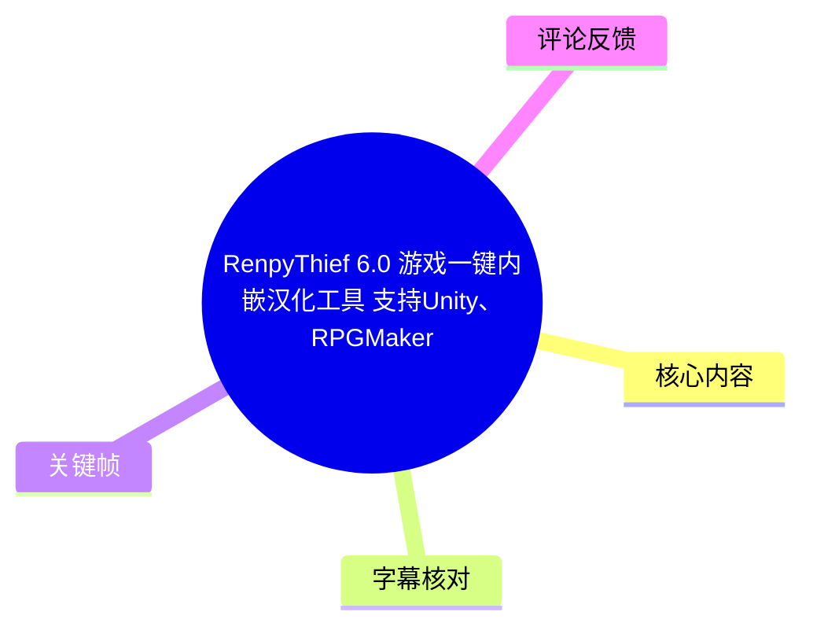
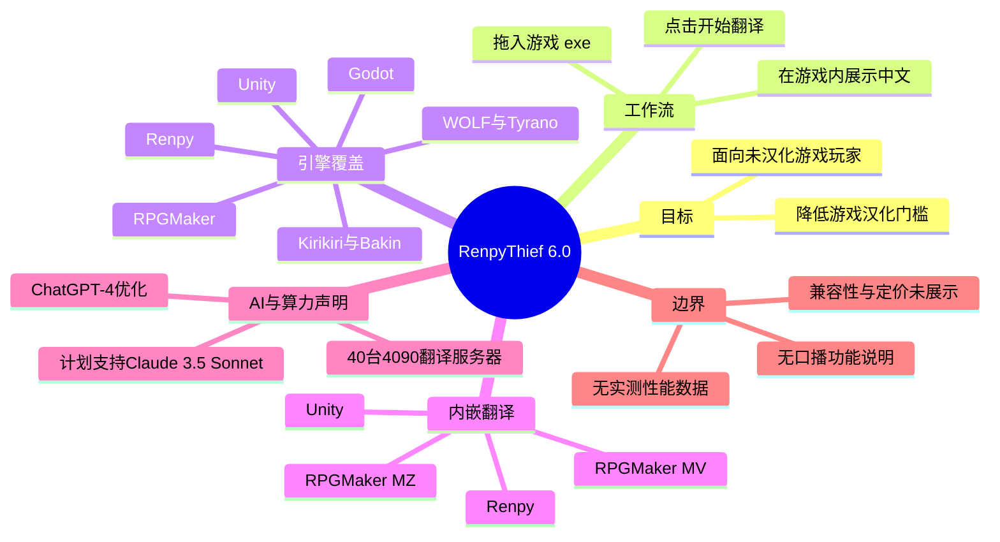
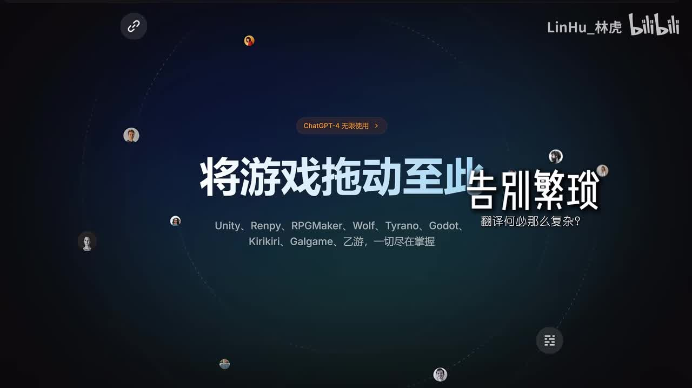
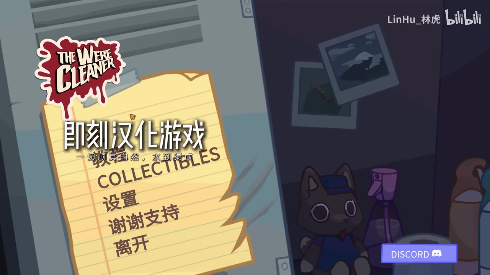
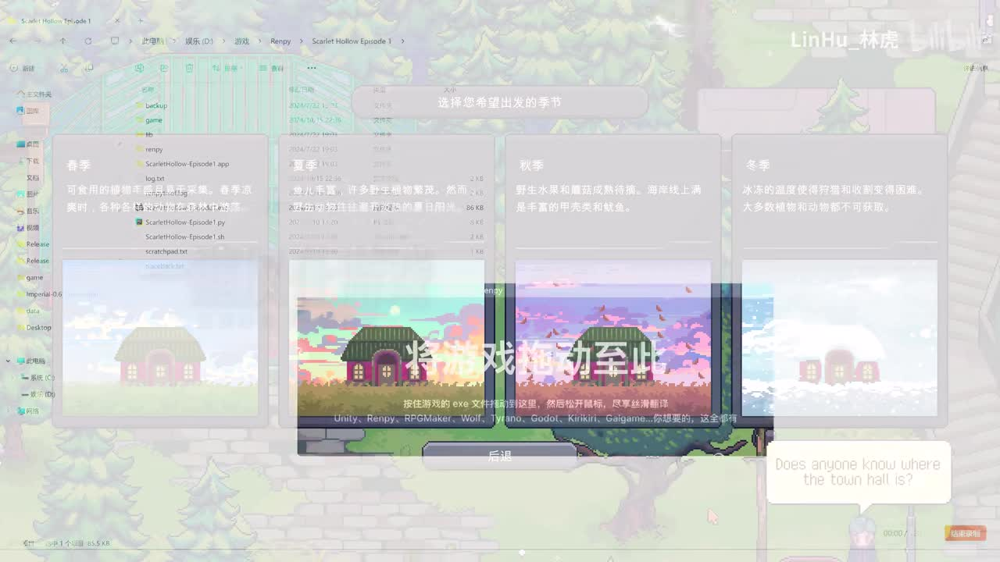
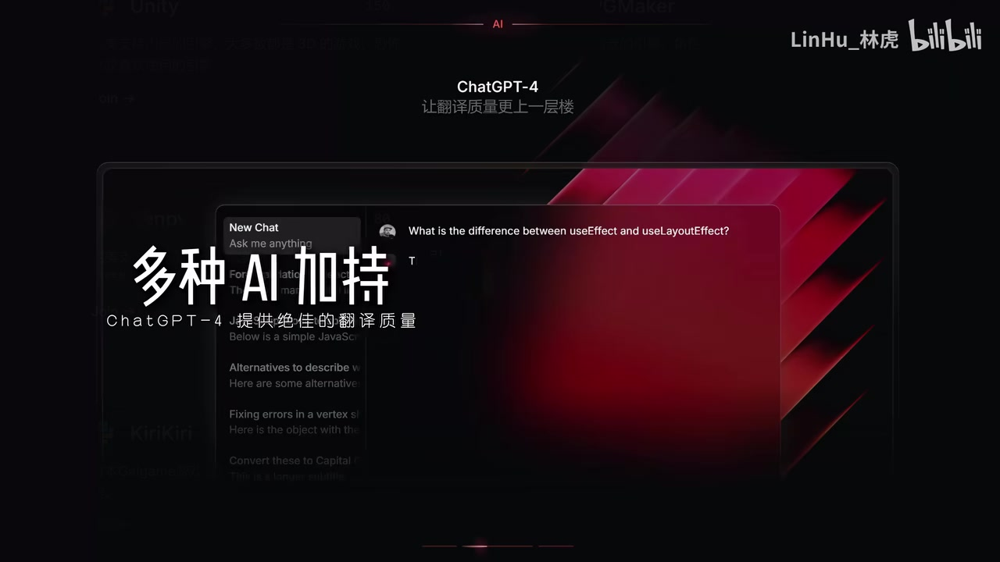

# RenpyThief 6.0 游戏一键内嵌汉化工具 支持Unity、RPGMaker、Renpy等引擎的一键翻译

> 来源：[Bilibili 视频](https://www.bilibili.com/video/BV1N3yGYcEpS)  
> UP 主：LinHu_林虎｜发布时间：2024-10-18｜时长：01:18｜分辨率：3840×2160

## 小结

这是一支以画面演示和宣传文案为主、配有英文背景音乐的 RenpyThief 6.0 版本介绍视频。视频与简介共同宣称：该工具面向未汉化或汉化不便的游戏，提供“将游戏拖动至此处”“开始翻译”式的简化工作流，并展示了游戏界面被替换为中文后的效果。

版本 6.0 的核心信息包括引擎覆盖范围与“内嵌翻译”范围。简介列出支持 Unity、Renpy、RPGMaker、WOLF、Tyrano、Kirikiri、Bakin、Godot，以及绝大部分乙游、Galgame 引擎；其中明确声称 **Unity、Renpy、RPGMaker MV、RPGMaker MZ** 已支持内嵌翻译。应注意，“支持某引擎”和“支持内嵌翻译”并非同一层级：简介只明确把后者限定在上述四类目标。

质量路线是机器翻译结合 AI 优化。发布者在简介中称其配合 **40 台 4090 翻译服务器**，并“独家提供不限量的 ChatGPT-4 翻译优化”；画面也强调“多种 AI 加持”与 ChatGPT-4。视频未展示模型提示词、翻译速度、并发量、价格、离线能力、文本保护规则或实测对比，因此这些宣传不应被延伸解读为可量化的性能承诺。

从画面可直接确认的操作只有：将游戏的 `.exe` 文件拖入工具指定区域、松开鼠标、点击“开始翻译”，随后在示例游戏中看到中文化菜单与文本。实际是否对每个游戏都能成功、是否会改动游戏目录、是否兼容 DRM/反作弊、能否回滚，以及 macOS/Linux 或非 `.exe` 游戏如何处理，均未在素材中说明。

该视频发布于 2024 年 10 月，且简介中以“将在后续支持 Claude 3.5 Sonnet”“后续支持更多引擎内嵌翻译”描述未来计划。工具支持列表、模型供应、服务器规模、免费或付费策略都具有时效性；本文仅记录发布素材及本次抓取到的评论，不能代表 2026 年当前状态。

## 思维导图

## 目录

- [视频定位与信息时效](#视频定位与信息时效)
- [宣传主张与演示入口](#宣传主张与演示入口)
- [引擎支持与内嵌翻译范围](#引擎支持与内嵌翻译范围)
- [画面可见的操作流程](#画面可见的操作流程)
- [AI 优化与服务器声明](#ai-优化与服务器声明)
- [限制、风险与适用建议](#限制风险与适用建议)
- [关键帧索引](#关键帧索引)
- [字幕比对](#字幕比对)
- [评论分析](#评论分析)
- [处理记录](#处理记录)

## 视频定位与信息时效 [00:00:03](https://www.bilibili.com/video/BV1N3yGYcEpS?t=3)

视频标题将 RenpyThief 6.0 定义为“游戏一键内嵌汉化工具”，强调其对 Unity、RPGMaker、Renpy 等引擎的支持。视频本体没有可用于解释产品机制的中文口播；本次 ASR 识别出的内容为背景歌曲英文歌词。因此，功能信息主要来自以下可验证来源：

1. **视频标题与简介**：用于确认版本号、引擎列表、内嵌翻译范围及 AI 相关声明。
2. **关键帧中的产品 UI 与游戏画面**：用于确认界面上实际呈现的拖拽入口、开始翻译按钮和中文化后的示例效果。
3. **热评前三条**：用于了解部分用户对小众游戏汉化、学习成本及付费价值的态度，但不作为功能事实证据。

视频元数据记录的时长为 78 秒；本次音频分析时长为 77.786875 秒。ASR 在 00:03.540—00:28.660 识别到约 18.82 秒英文人声，覆盖率约 24.19%，与“音乐宣传片而非讲解型教程”的形态一致。

## 宣传主张与演示入口 [00:00:15](https://www.bilibili.com/video/BV1N3yGYcEpS?t=15)

画面以“将游戏拖动至此 即刻解锁”“翻译何必那么复杂？”作为主视觉文案，并罗列 Unity、Renpy、RPGMaker、Wolf、Tyrano、Godot、Kirikiri、Galgame、乙游等对象。这里的“即刻解锁”与“一键”属于发布者的产品定位和营销表达，不能据此推导为所有游戏均无需人工处理。

视频的实际演示画面进一步给出简化入口：把游戏的可执行文件拖到软件区域后启动翻译。它所展示的是将翻译能力嵌入或作用于游戏运行过程的体验，而不是传统的手工提取文本、逐段翻译、回填资源、修复字体与重新打包的完整流程。

> 图：该帧展示“将游戏拖动至此 即刻解锁”的宣传语，以及 Unity、Renpy、RPGMaker、Wolf、Tyrano、Godot、Kirikiri 等名称。它是梳理工具目标范围与“一键”产品定位的直接画面依据；但画面中的列举不等同于逐游戏兼容性证明。

## 引擎支持与内嵌翻译范围 [00:00:20](https://www.bilibili.com/video/BV1N3yGYcEpS?t=20)

根据视频简介，RenpyThief 6.0 声称支持的范围如下：

| 分类 | 发布素材中的表述 | 可谨慎得出的结论 |
| --- | --- | --- |
| 通用支持引擎 | Unity、Renpy、RPGMaker、WOLF、Tyrano、Kirikiri、Bakin、Godot | 发布者将这些引擎列入支持范围；未提供每个引擎的版本条件、游戏样本或失败边界。 |
| 游戏类型/集合 | 绝大部分乙游、Galgame 引擎 | 这是覆盖面声明，不是可枚举的兼容清单。不同厂商的自定义引擎、加密资源或动态文本仍可能影响结果。 |
| 明确内嵌翻译 | Unity、Renpy、RPGMaker MV、RPGMaker MZ | 只有这四类被简介明确称为“内嵌翻译”。其余支持引擎采用何种翻译接入方式，素材未说明。 |
| 后续计划 | 支持更多引擎的内嵌翻译 | 是发布时的未来规划，不能当作已经交付的能力。 |

“内嵌翻译”在本视频语境中可从中文化后的游戏界面理解为：翻译结果直接在游戏运行界面中呈现。素材没有公开其注入方式、Hook 点、文本抓取机制、缓存结构或是否生成补丁文件，因此不能进一步断言其技术实现是内存注入、文件替换、OCR 还是其他路径。

> 图：该帧可见示例游戏标题画面与中文菜单“即刻汉化游戏”“设置”“谢谢支持”“离开”。它的价值在于展示输出端确实以中文游戏 UI 形式呈现；但单一示例不能证明所有引擎、所有语言或所有文本类型的翻译质量。

## 画面可见的操作流程 [00:00:20](https://www.bilibili.com/video/BV1N3yGYcEpS?t=20)

以下流程仅整理视频画面明确展示或写出的动作，不补充未经展示的安装、授权、账号登录、备份或导出步骤。

1. **定位游戏可执行文件**  
   演示画面中出现文件管理器与游戏目录，并在工具说明中指向游戏的 `.exe` 文件。对于 Windows 游戏，这意味着用户需要找到游戏启动程序；素材未说明多个 `.exe`、启动器、64 位程序或受保护程序应如何选择。

2. **拖放到翻译工具区域**  
   画面文字为“按住游戏的 exe 文件拖动至这里，然后松开鼠标”。这表明产品 UI 接受拖拽输入。

3. **点击“开始翻译”**  
   拖放说明后紧接“点击开始翻译”。视频没有展示进度条、预计耗时、网络状态、失败重试、模型选择或翻译任务队列。

4. **在游戏内查看中文结果**  
   演示的游戏画面包含中文季节说明卡片和中文菜单，说明作者希望呈现的是直接可玩的中文化效果。素材未展示长文本溢出、姓名变量、富文本、图片文字、选项分支、存档、字体回退等常见兼容性场景。

> 图：该帧叠加显示“按住游戏的 exe 文件拖动至这里，然后松开鼠标，点击开始翻译”的操作提示，背景同时可见文件管理器、游戏画面和多张翻译卡片。它是本文还原三步操作的主要证据。

### 操作前的审慎建议

这些建议并非视频原话，而是针对“向游戏目录或运行过程施加翻译能力”的通用风险控制：

- 对游戏安装目录、存档和配置文件做独立备份；
- 优先在单机、无反作弊要求的游戏上测试；
- 核对游戏发行平台、使用条款和所在地区法律对修改、注入或第三方工具的限制；
- 首次运行后检查字体、换行、选项文本与存档是否正常；
- 若遇到失败，不要假设视频承诺的“一键”一定适用于该特定游戏，应保留原文件并通过官方渠道确认兼容性。

## AI 优化与服务器声明 [00:00:20](https://www.bilibili.com/video/BV1N3yGYcEpS?t=20)

发布简介称，软件“配合 40 台 4090 翻译服务器”，并提供“不限量的 ChatGPT-4 翻译优化”；画面中也出现“多种 AI 加持”“ChatGPT-4 提供绝佳的翻译质量”等文字。可将其拆分理解：

- **服务器声明**：40 台 4090 是发布者的基础设施表述。视频没有给出服务器归属、显存配置、可用时间、峰值吞吐、排队时间或地区可用性，因此无法据此估算翻译速度。
- **模型优化声明**：ChatGPT-4 在素材中被定位为提升译文质量的优化能力。素材未交代调用条件、上下文窗口、术语表、敏感内容处理、失败降级方案或是否对全部用户开放。
- **未来模型计划**：简介称“将在后续支持 Claude3.5 Sonnet 模型”。这是当时的计划，不应写成当前已支持。
- **质量结论边界**：视频只展示了少量中文 UI/文本效果，未提供原文—译文对照、人工评测、错误率或多语种测试，因而“接近原生”等描述应视为发布方主张，而非独立验证结论。

> 图：该帧文字写有“多种 AI 加持”“ChatGPT-4 提供绝佳的翻译质量”，并出现“让翻译质量更上一层楼”。它用于证明视频对 AI 优化的宣传重点，而非证明具体模型调用参数或实际质量指标。

## 限制、风险与适用建议 [00:00:28](https://www.bilibili.com/video/BV1N3yGYcEpS?t=28)

### 素材未给出的关键参数

下列项目对实际使用影响很大，但本视频、简介及可用字幕均未提供：

| 未披露项 | 为什么重要 |
| --- | --- |
| 软件获取地址、版本下载与安装方式 | 无法据此复现实操。 |
| 许可与收费规则 | 热评涉及“付费问题”，但视频素材未给出正式价格、额度或退款条款。 |
| 支持的源语言与目标语言 | 视频聚焦汉化效果，未列明语种矩阵。 |
| 翻译速度与文本额度 | 无法验证 40 台 GPU 对单用户的实际等待时间。 |
| 网络、隐私和数据上传策略 | 若文本需云端翻译，可能涉及游戏文本、个人路径或日志的处理边界。 |
| 兼容与回滚机制 | 未说明是否修改文件、如何卸载、是否影响更新、存档与成就。 |
| 反作弊与联机限制 | 视频没有针对联网游戏、反作弊系统或 DRM 给出安全结论。 |

### 适合与不适合的使用场景

较适合将其视为一种降低门槛的候选工具：希望快速理解小众单机作品、愿意自行测试兼容性、接受机器翻译可能存在不自然或误译的玩家。对于需要严格术语一致性、文学化本地化质量、官方授权发行、多人联机安全性或隐私合规保证的场景，则不能只依据该宣传视频决定使用。

尤其需要区分两个目标：

- **“能读懂”**：机器翻译与内嵌显示可以显著降低语言门槛；
- **“正式汉化”**：还需要术语统一、上下文校对、文化适配、字体与 UI 测试、质量审核以及权利授权。

视频主要展示前者的便利性，未展示后者的完整制作链路。

## 关键帧索引

| 关键帧 | 正文用途 | 画面价值 |
| --- | --- | --- |
| `frames/frame-001.jpg` | 宣传定位与引擎覆盖 | 直接呈现“一键”定位和多个目标引擎名称。 |
| `frames/frame-002.jpg` | 操作流程 | 直接显示拖入 `.exe`、松开鼠标、点击开始翻译的顺序。 |
| `frames/frame-003.jpg` | 翻译结果 | 展示示例游戏菜单已显示为中文，支撑“游戏内呈现”的描述。 |
| `frames/frame-004.jpg` | AI 能力声明 | 显示 ChatGPT-4 与“多种 AI 加持”的宣传文案。 |

> 关键帧素材未附逐帧精确时间戳。因此本文只将它们用于识别画面内容，不把帧的出现时刻伪造为精确视频时间；章节时间轴仅使用本次 ASR SRT 中真实存在的时间段起点。

## 字幕比对

| 字幕来源 | 完整性 | 专有名词 | 时间轴 | 主要问题 |
| --- | --- | --- | --- | --- |
| Bilibili 站内字幕 | 未提供可用站内字幕 | 无法核验 | 无法使用 | 没有可供比对或引用的站内字幕文件。 |
| 本次 ASR 字幕 | 较低：仅识别 3 段、约 18.82 秒人声，覆盖约 24.19% 音频 | 未识别 RenpyThief、Unity、RPGMaker 等产品术语 | 可用：含 00:03.540—00:13.460、00:15.150—00:16.170、00:20.780—00:28.660 三段真实时间 | 识别内容为英文背景歌曲歌词，未覆盖产品功能说明。 |

本次 ASR 使用 `medium` 模型，自动检测语言为英语，语言概率为 0.86767578125；音频源正常存在，诊断数据中**未标记** `noAudioStream=true`，因此不能将视频描述为“没有音轨”。相反，视频有音轨，但可识别的人声主要是背景音乐歌词，而非工具讲解。

最终未采用 ASR 歌词作为产品知识来源，仅将其时间戳用于满足可验证的时间轴定位；功能名称与技术范围以视频标题、简介和关键帧画面为依据。通过多模态画面及元数据校正并确认的关键名称包括：**RenpyThief 6.0、Unity、Renpy、RPGMaker、WOLF、Tyrano、Kirikiri、Bakin、Godot、ChatGPT-4、Claude 3.5 Sonnet**。

## 评论分析

以下仅分析本次可获取的热评前三条。评论反映用户体验与态度，不构成对软件功能、价格或服务质量的独立验证。

1. **-凤尾鱼-（7060 赞）**  
   评论认为小众游戏缺少汉化是实际痛点，并将完善易用的 AI 翻译视为玩家利好。其补充价值在于指出目标用户需求：并非所有玩家追求正式汉化，许多人首先需要可读性。该观点属于正向期待，没有提供具体游戏、版本或翻译质量证据。

2. **小呆呆流鼻血（16313 赞）**  
   “为啥我汉化之后变成中文了”是围绕“汉化”结果的玩笑式评论。它体现评论区对“一键汉化”卖点的轻松接受，未包含可用于验证的使用信息，也不存在实质性的技术争议。

3. **BeIIdandy（6115 赞）**  
   评论者回顾了自行配置在线翻译、遭遇 IP 限制、提取文本、使用 DeepL、处理字体报错的经历，并认为自建流程的时间成本高；其愿意付费支持的前提是工具减少这些工作。该评论有助于解释“一键”工具的潜在价值：把多步骤本地化流程封装起来。  
   但其中“锁 IP”“花费一个月”等均是个人经历，不能推广为所有翻译服务、所有游戏或 RenpyThief 的普遍表现；“付费支持”也不等于视频已公开了价格或收费模式。

## 处理记录

- Worker ID：`worker-mrj0www4-e8d79408`
- 模型：`gpt-5.6-terra`
- 调用工具与素材：视频元数据、视频简介、关键帧清单与画面、`asr/asr-result.json`、`asr/transcript.srt`、热评 `comments/comments.json`。
- ASR 工具信息：`medium` 模型，CUDA，`float16`，自动语言识别为英语。
- 字幕选择：站内字幕未提供可用文件；已检查本次 ASR。由于 ASR 内容为背景音乐歌词且未包含产品讲解，产品事实以元数据、简介和关键帧为主，ASR 仅用于真实时间轴定位。
- 关键帧选择依据：选取能分别证明宣传范围、拖拽操作、中文化结果和 ChatGPT-4 宣传的 `frame-001` 至 `frame-004`；未对未附时间戳的帧强行标注精确出现秒数。
- 评论处理范围：严格限于可获取的热评前三条。
- 缓存清理：素材未提供缓存清理执行记录，无法确认是否已清理；不作已清理声明。
- 未解决问题：未提供官方下载与版本号细节、定价/额度、模型调用规则、隐私策略、引擎版本兼容表、失败处理、回滚机制、实际速度与翻译质量测试数据。
