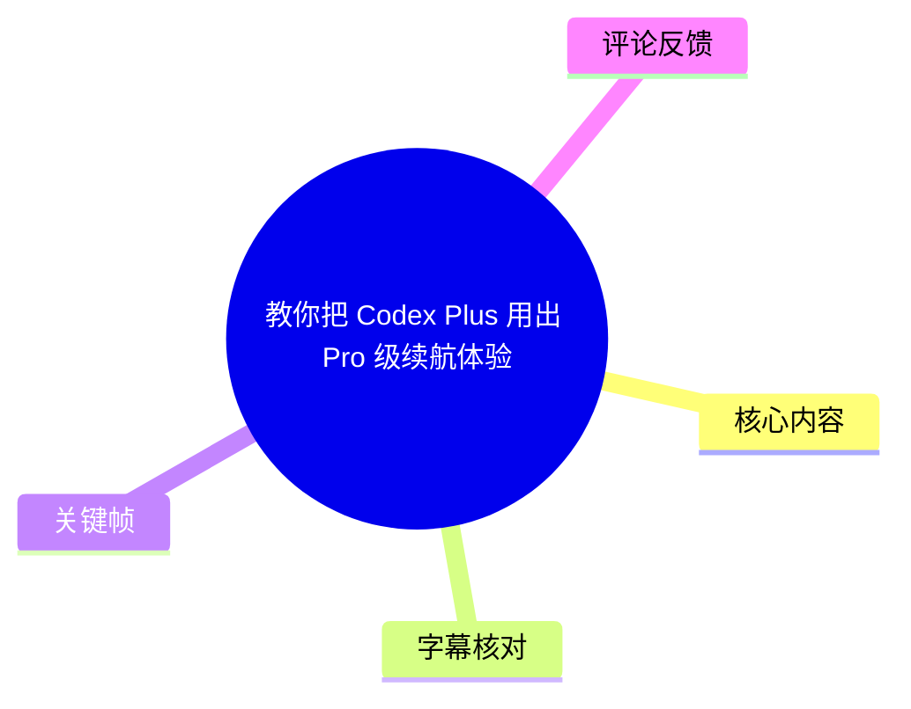
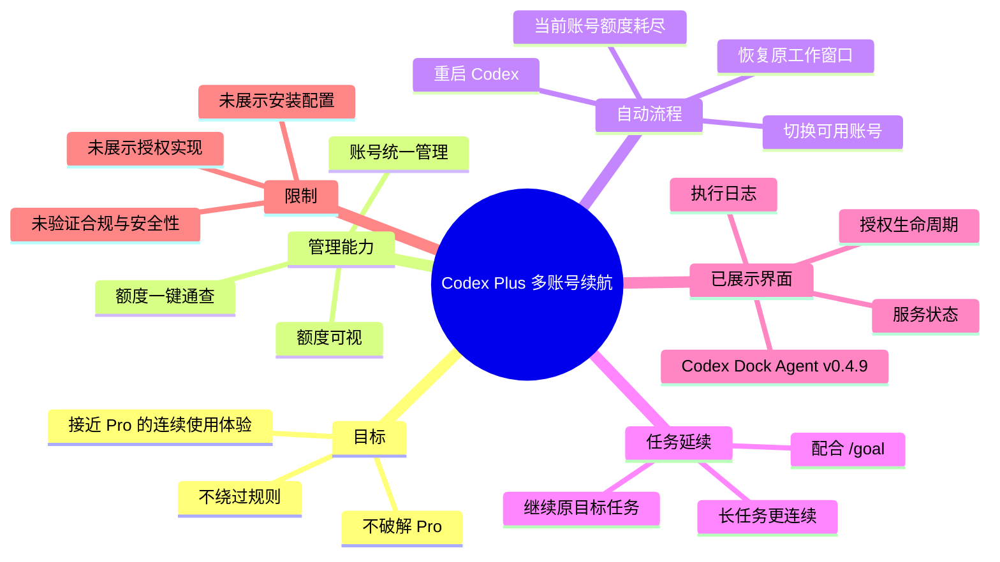
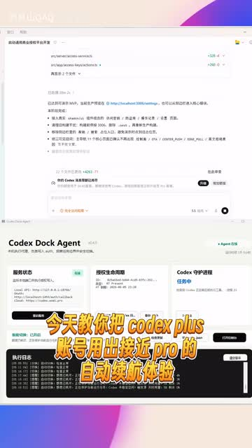
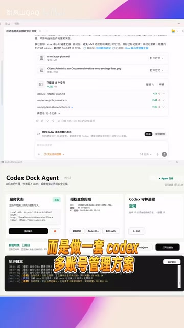
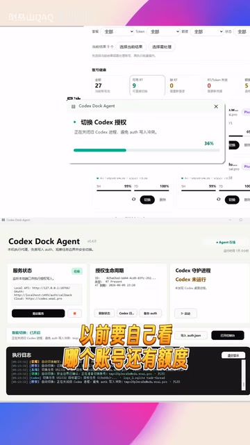

# 教你把 Codex Plus 用出 Pro 级续航体验

> 来源：[Bilibili 视频](https://www.bilibili.com/video/BV1i3GS6wExe)<br>
> UP 主：倒悬山QAQ ｜ 发布时间：2026-05-28 ｜ 视频时长：60 秒<br>
> 视频描述提及项目地址：[atuizz/codex-dock](https://github.com/atuizz/codex-dock)

## 小结

视频介绍了一套面向 Codex Plus 账号的多账号管理方案，目标不是“破解 Pro”或绕过平台规则，而是在多个可用账号之间统一查看额度、自动切换，并尽量恢复原有工作窗口，从而让长任务运行得更连续。

作者给出的核心链路是：先集中管理账号并一键查询额度；当前账号额度耗尽后，系统自动切至仍可使用的账号；随后自动重启 Codex，并恢复到原先的工作窗口。若再配合 `/goal` 命令，原来的目标任务可以继续执行。

视频中将这种体验概括为“额度可视、自动换号、窗口恢复、任务续跑”，并以“接近 Pro 的自动续航体验”描述其效果。这里的“接近 Pro”是作者的体验性表述，并不代表获得 Pro 权益，也不等同于绕过任何账号、订阅或服务规则。

从关键帧可见，作者展示的界面名为 **Codex Dock Agent**，版本标识为 **v0.4.9**；界面包含“服务状态”“授权生命周期”“Codex 等待进程”“执行日志”等区域，并出现账号切换及额度进度条画面。视频和描述未展示安装命令、配置文件格式、账号授权细节、具体错误处理机制或平台合规条款，因此这些部分不能据此补全或推断。

该内容适合已经在使用 Codex、并会因单账号额度耗尽而中断长任务的用户参考。实际可用性仍取决于账号状态、服务端规则、工具版本、授权方式及项目本身的安全性；视频发布后相关产品和接口也可能变化。

## 思维导图





## 目录

- [问题定位：不是破解，而是多账号管理](#问题定位不是破解而是多账号管理)
- [功能链路：额度查询、自动切换与窗口恢复](#功能链路额度查询自动切换与窗口恢复)
- [任务续跑：配合 `/goal` 的使用边界](#任务续跑配合-goal-的使用边界)
- [界面与关键帧解读](#界面与关键帧解读)
- [实践步骤与参数清单](#实践步骤与参数清单)
- [限制、风险与时效性](#限制风险与时效性)
- [字幕比对](#字幕比对)
- [评论分析](#评论分析)
- [处理记录](#处理记录)

## [问题定位：不是破解，而是多账号管理](https://www.bilibili.com/video/BV1i3GS6wExe?t=0)

视频开头明确界定方案性质：作者称其目的是将 Codex Plus 账号用出“接近 Pro”的自动续航体验，但同时强调：

1. **不是破解 Pro**；
2. **不是绕过规则**；
3. 实际做法是一套 **Codex 多账号管理方案**。

作者提出的原始痛点是人工管理多个账号的成本：用户需要自行判断“哪个账号还有额度”，然后手动登录、手动切换，并手动重启 Codex。对于需要长时间执行的任务，这种人工介入会造成工作流中断。

从素材可确认的方案能力包括：

- 多账号统一管理；
- 额度一键查询；
- 当前账号不可用或额度耗尽后的自动处理；
- 自动切换可用账号；
- 自动重启 Codex；
- 恢复原工作窗口。



> 图：该关键帧同时呈现视频标题文案与 **Codex Dock Agent v0.4.9** 的管理面板。面板中可见“服务状态”“授权生命周期”“Codex 等待进程”“执行日志”等模块，说明视频讨论的不是单纯手动换号技巧，而是带状态监控和日志区域的管理工具界面。该图可用于辨识作者实际展示的软件名称与界面构成。

## [功能链路：额度查询、自动切换与窗口恢复](https://www.bilibili.com/video/BV1i3GS6wExe?t=24)

根据 ASR 在 `00:00:24,260—00:00:47,120` 的内容，作者描述的自动化流程如下：

1. **检测当前账号额度状态**：前提是账号额度已经被集中查看或可视化。
2. **当前账号额度耗尽**：这是触发后续动作的条件。
3. **自动切换到可用账号**：工具从管理的账号中切换至仍可使用的账号。
4. **自动重启 Codex**：切换完成后重启 Codex。
5. **恢复到原来的工作窗口**：作者称会恢复此前正在使用的窗口。
6. **继续原任务**：在额外配合 `/goal` 命令时，原目标任务可以继续执行。

可将作者的描述整理为以下工作流：

```text
统一管理多个账号
        ↓
查询或展示各账号额度
        ↓
当前账号额度耗尽
        ↓
自动切换至可用账号
        ↓
自动重启 Codex
        ↓
恢复原工作窗口
        ↓
配合 /goal 后继续原目标任务
```

其中，“自动切换”“自动重启”“窗口恢复”均为视频中的功能宣称；素材没有给出触发阈值、账号选择优先级、切换失败后的回退策略、窗口状态保存机制或重启耗时，不能将上述流程视为已完整公开的实现规范。


> 图：画面字幕强调“不是破解 pro”，下方仍为 Codex Dock Agent 面板与执行日志。这张图对应作者对方案边界的直接说明，有助于避免将多账号管理误解为权限破解或服务规则规避。



> 图：画面字幕写明“而是做一套 codex 多账号管理方案”。界面中可见账号相关操作区域、服务状态与日志区域，支持正文中“统一管理、自动化处理”的功能定位；但截图没有展示具体账号数据，不应据此推测支持的账号数量或认证方式。



> 图：画面上半部分出现“切换 Codex 授权”窗口及多个额度进度条，下半部分的字幕强调“以前要自己看哪个账号还有额度”。该图直观说明该方案所要替代的人工步骤是账号额度判断与授权切换。

## [任务续跑：配合 `/goal` 的使用边界](https://www.bilibili.com/video/BV1i3GS6wExe?t=24)

作者指出：**如果配合 `/goal` 命令，原来的目标任务也能继续执行。** 视频最后将整体体验概括为：

- 额度可视；
- 自动换号；
- 窗口恢复；
- 任务续跑；
- 让 Codex 长任务运行得更稳、更连续；
- 实现“无感换号”。

这里需要区分两个层次：

| 层次 | 视频已陈述的内容 | 素材未说明的内容 |
| --- | --- | --- |
| 账号切换 | 当前账号耗尽后自动切换至可用账号 | 可用账号的筛选规则、认证刷新方式、切换失败处理 |
| 会话恢复 | 自动重启 Codex，并恢复原工作窗口 | 是否恢复全部上下文、文件状态、终端状态或未提交修改 |
| 任务续跑 | 配合 `/goal` 可继续原目标任务 | `/goal` 的准确语法、所属客户端、任务持久化原理、适用任务类型 |
| 稳定性 | 作者认为长任务会更稳、更连续 | 实测成功率、连续运行时长、不同系统环境表现 |

因此，`/goal` 在该视频中是任务延续的一个前置配合项，而非已被完整讲解的命令教程。素材仅提供了命令名称，未提供参数、示例输入、执行结果或安装位置；实际使用时应以相关工具的正式文档或项目说明为准。

## [界面与关键帧解读](https://www.bilibili.com/video/BV1i3GS6wExe?t=0)

视频为竖屏录制画面，主要由上部的网页/项目页面和下部的 Codex Dock Agent 控制面板构成。依据可见关键帧，可识别出以下界面信息：

| 可见元素 | 画面依据 | 可确认的价值 |
| --- | --- | --- |
| Codex Dock Agent | `frame-001.jpg` 至 `frame-004.jpg` | 工具名称在画面中可见。 |
| 版本标识 v0.4.9 | `frame-001.jpg` | 该版本仅代表录制画面中的展示版本，不代表当前最新版本。 |
| 服务状态 | `frame-001.jpg` | 说明工具有状态展示区域。 |
| 授权生命周期 | `frame-001.jpg` | 说明界面包含与授权相关的状态区域。 |
| Codex 等待进程 | `frame-001.jpg` | 说明界面关注 Codex 进程或等待状态。 |
| 执行日志 | `frame-001.jpg` 至 `frame-004.jpg` | 支持对自动切换、重启等动作进行可视化记录。 |
| 切换 Codex 授权 | `frame-004.jpg` | 画面直接出现授权切换提示及额度进度条。 |

视频描述中还给出 GitHub 地址 `https://github.com/atuizz/codex-dock`。这可以作为进一步核实安装方式、开源状态、代码内容及安全性的信息入口；但仅根据本视频素材，不能确认仓库在当前时点是否可访问、是否开源、许可证类型、发布版本、依赖范围或安全审计情况。

## [实践步骤与参数清单](https://www.bilibili.com/video/BV1i3GS6wExe?t=24)

视频没有演示完整安装和配置过程，因此以下仅按作者明确说明整理为**使用流程**，不是可直接复现的部署教程。

### 可从视频确认的操作逻辑

1. 准备由该管理方案统一管理的 Codex 账号。
2. 通过管理界面查看账号额度，避免人工逐个判断余额。
3. 正常在 Codex 中执行任务。
4. 当当前账号额度耗尽时，等待工具自动切换至可用账号。
5. 由工具自动重启 Codex。
6. 让工具恢复到原来的工作窗口。
7. 对需要延续的目标任务，按作者说法配合 `/goal` 命令继续执行。

### 视频明确提到的命令与版本

| 项目 | 值 | 说明 |
| --- | --- | --- |
| 任务相关命令 | `/goal` | 仅在 ASR 中提及名称；未提供命令参数、输入格式或示例。 |
| 展示工具名 | Codex Dock Agent | 来自关键帧画面。 |
| 展示版本 | v0.4.9 | 来自关键帧画面，具有录制时效性。 |
| 视频时长 | 60 秒 | 元数据提供。 |
| ASR 有效语音范围 | 00:00:00.080—00:00:47.120 | 后续约 13 秒未识别到语音内容。 |

### 未展示、不能擅自补写的部署信息

以下关键实施项并未在视频或所给字幕中出现：

- 安装命令；
- 操作系统要求；
- Node.js、Python 或其他运行时依赖；
- 账号添加方式；
- Cookie、Token、OAuth 或其他授权材料的保存方式；
- 自动切换的检测周期与额度阈值；
- 多账号的数量上限；
- `/goal` 的命令格式；
- 异常恢复、日志导出与卸载方法。

在未核实项目文档和代码前，不应将账号凭据交给来源不明的软件，也不应假定该方案符合任何服务的使用条款。

## [限制、风险与时效性](https://www.bilibili.com/video/BV1i3GS6wExe?t=47)

### 视频内容的边界

作者在视频中主动强调“不是破解 Pro，也不是绕过规则”。不过，是否符合 Codex、OpenAI 或相关服务的实际条款，不能仅由作者的口头表述决定，仍需以平台在使用时点生效的规则为准。

视频展示的是功能概览，而非严格测试报告。以下指标均未提供：

- 自动切换成功率；
- 从额度耗尽到恢复工作的耗时；
- 长任务的实际连续运行时长；
- 任务上下文、终端状态和文件修改的恢复完整度；
- 多账号同时失效时的行为；
- 账号风控、封禁或授权失效风险；
- 工具对本地凭据和日志的安全处理方式。

### 使用风险

1. **账号与凭据安全**：多账号管理通常涉及授权状态或凭据。热评也直接提出“怕不安全”的疑虑。应先阅读代码、文档、权限说明和本地存储策略。
2. **服务规则风险**：评论中有人询问是否属于反代 API、是否可能导致封号；视频没有回答这些问题，也没有展示其底层实现，因此不能得出“不会封号”或“属于反代”的结论。
3. **任务一致性风险**：自动重启与窗口恢复不必然等于完整恢复任务上下文。重要任务应保留版本控制、文件备份和可重复执行的任务说明。
4. **版本变化风险**：关键帧中的 v0.4.9 仅对应视频录制时的界面。项目、Codex 产品、额度政策和账号规则均可能在发布后变化。

### 时效性说明

元数据显示视频发布于 2026-05-28，处理素材获取于 2026-07-16。本文记录的是该视频及当次素材所呈现的信息，不将其视为当前项目版本、平台政策或服务能力的保证。

## [字幕比对](https://www.bilibili.com/video/BV1i3GS6wExe?t=0)

| 字幕来源 | 完整性 | 专有名词 | 时间轴 | 主要问题 |
| --- | --- | --- | --- | --- |
| Bilibili 站内字幕 | 未提供可用站内字幕，无法比对正文 | 无法核验 | 无可用时间轴 | 素材明确标注“未提供可用站内字幕”。 |
| 本次 ASR 字幕 | 覆盖约 47.04 秒语音，语音覆盖率约 78.41% | 可识别 Codex、Plus、Pro、Goal，但存在大小写与错字 | 有 2 个真实 SRT 分段：0.080—24.260 秒、24.260—47.120 秒 | 标点缺失；“账号/账號”“窗口/窗户”“任务/任劣”等存在识别或转写噪声；未覆盖视频末段非语音部分。 |

本次 ASR 使用 `medium` 模型，识别语言为中文（语言概率 `0.99951171875`），音频时长为 `59.9893125` 秒。诊断中**没有** `noAudioStream=true` 标记，且提供了正常的音频文件与带时间戳的语音分段，因此可确认源视频存在音轨；这里不存在“无音轨而改用画面理解”的情况。

最终字幕选择为：**以本次 ASR 的真实时间分段作为时间轴依据，以关键帧和视频描述辅助校正术语与界面信息。**

主要校正原则如下：

- 将 ASR 中的 `CodeX` 统一记为 **Codex**，与标题、标签、项目描述和界面名称保持一致。
- 将“账號”“账”按语义统一表述为“账号”，但不额外扩展其具体认证形式。
- 将“窗户恢复”校正为“窗口恢复”，因上下文和 ASR 前后句均指向工作窗口。
- 将“任劣”“长任势”等明显噪声按上下文整理为“任务”“长任务”。
- ASR 中的 “Goal命令”在正文记为 `/goal`，因为用户提供的素材描述和任务要求均以带斜杠的形式指向该命令；但未据此推断其参数或语义细节。

## [评论分析](https://www.bilibili.com/video/BV1i3GS6wExe?t=47)

本次仅获取到 2 条热评，少于“热评前三条”的上限；以下仅分析可获取内容，不将评论视作已验证事实。

| 评论者 | 获赞 | 评论观点 | 分析 |
| --- | ---: | --- | --- |
| ZnFooe | 1 | “开源的吗[doge]我怕不安全” | 评论聚焦项目是否开源及凭据安全。视频描述虽给出 GitHub 链接，但所给素材未明确写出“开源”状态，也未展示安全设计、许可证或审计信息，因此该疑虑合理但尚未被视频材料解答。 |
| 遥哥么么哒 | 1 | “是反代的api么 这种会不会封号啊” | 评论关注底层实现与账号风险。视频只说明多账号管理、自动切换与恢复，未说明是否使用反向代理 API，也未提供封号风险结论；因此不能据此确认技术路径或合规结果。 |

评论区没有提供可验证的补充配置、测试数据或官方回应。两条评论共同反映出此类工具的核心关注点：**授权安全、实现路径与平台规则风险**。

## [处理记录](https://www.bilibili.com/video/BV1i3GS6wExe?t=0)

- Worker ID：`worker-mrj0wbly-5dc4e50c`
- 生成模型：`gpt-5.6-terra`
- ASR 模型：`medium`（CUDA / `float16`，自动语言识别为中文）
- 使用的素材与工具产物：视频元数据、音频 `audio/audio.wav`、ASR 结果 `asr/asr-result.json`、ASR SRT `asr/transcript.srt`、关键帧目录 `frames/`、评论文件 `comments/comments.json`。
- 字幕选择：站内字幕未提供可用文件；已检查本次 ASR，采用其两段带真实起止时间的 SRT 作为时间轴来源，并依据关键帧与视频描述校正明显术语噪声。
- 时间轴依据：`00:00:00.080—00:00:24.260` 对应方案定位、统一管理和额度查询；`00:00:24.260—00:00:47.120` 对应自动切换、重启、窗口恢复与 `/goal` 续跑。正文时间链接仅使用这些 ASR 可直接验证的时间点及语音结束点。
- 关键帧选择依据：选用 `frame-001.jpg` 识别工具名称、版本和面板模块；选用 `frame-002.jpg` 佐证“非破解 Pro”的定位；选用 `frame-003.jpg` 佐证多账号管理方案定位；选用 `frame-004.jpg` 展示授权切换与额度进度条。未将未提供可见内容的其他帧用于事实补充。
- 评论处理：请求上限为 3 条，实际仅获取 2 条，已逐条分析；未虚构第 3 条评论。
- 缓存清理：所给素材未提供缓存清理执行记录，无法确认是否已清理；本文未将“缓存已清理”作为既成事实。
- 未解决问题：项目是否开源、安装与配置步骤、账号授权存储方式、是否使用反代 API、服务条款兼容性、封号风险、`/goal` 的准确用法及任务恢复完整度，均未能从本视频素材中验证。

## 评论分析

- 热评 1：开源的吗[doge]我怕不安全
- 热评 2：是反代的api么 这种会不会封号啊

以上内容是观众反馈摘录，只用于补充理解视频反响，不作为正文事实依据。
