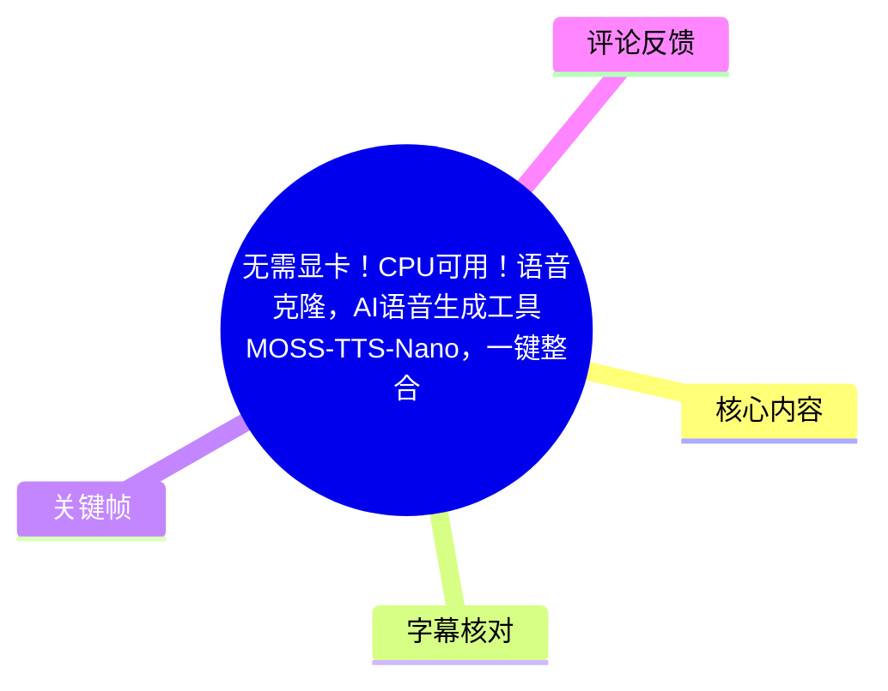
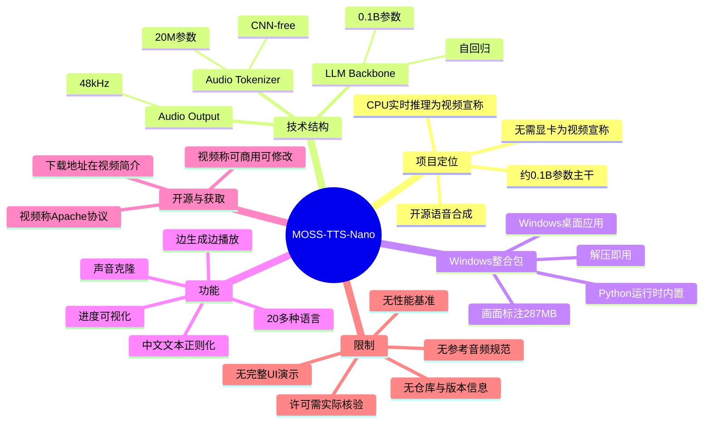
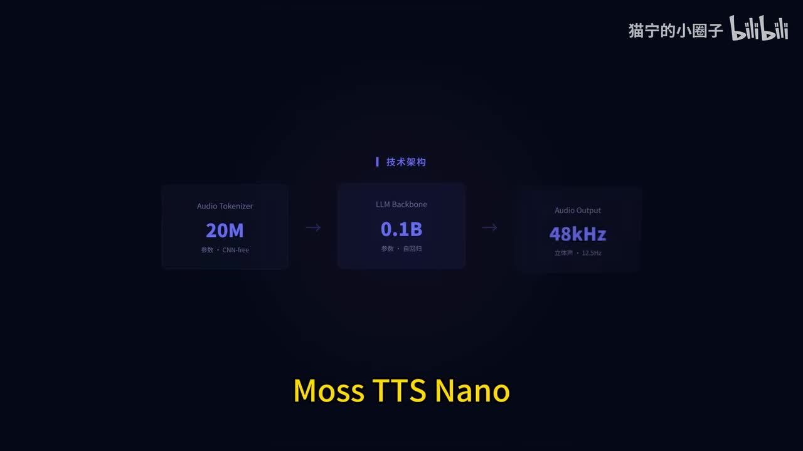
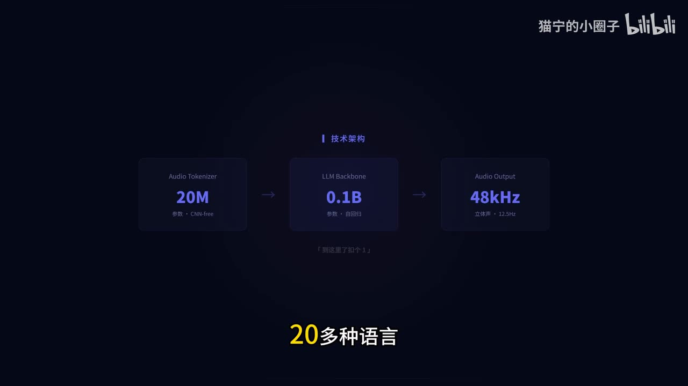
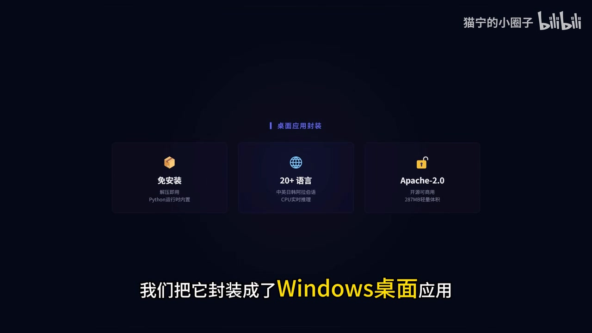

## 小结

视频介绍开源语音合成项目 **MOSS-TTS-Nano**，重点是其约 **0.1B 参数的自回归 LLM 主干**可用于多语言语音合成。视频宣称该方案支持 **20 多种语言**，能在 **CPU 上实时推理**，因此不以显卡为前提；不过没有提供 CPU 型号、实时率（RTF）、首包延迟或音质测试数据，这些宣传能力仍需实际验证。

从画面可见的技术结构包括：`Audio Tokenizer` 为 **20M 参数、CNN-free**，接入 **0.1B、自回归**的 `LLM Backbone`，音频输出标为 **48kHz**。视频没有进一步说明训练数据、推理框架、显存/内存占用、量化方案或具体支持的语种清单。

UP 主还称已将项目封装为 **Windows 桌面应用**，内置 Python 运行时，定位为“解压即用”。画面展示的整合包卖点包括“免安装”“20+ 语言”“Apache-2.0”“287MB 轻量体积”；但视频没有展示软件界面、启动文件、模型下载过程、导出格式和故障处理流程。

功能方面，视频明确提到：上传参考音频进行声音克隆、中文数字与日期的文本正则化、边生成边播放，以及进度可视化。中段有中文语音播放示例，但其是否为实时生成、参考音频条件、是否经过后期处理均未说明，不能据此作为克隆质量或性能的严格结论。

视频简介给出一键整合包链接：<https://pan.quark.cn/s/6356dca8c388>。视频称项目为 Apache 协议、可商用可修改，但未给出可核验的源码仓库 URL、版本号、模型权重条款或第三方依赖许可证；下载、商用或部署前应以实际发布文件为准。该视频的元数据抓取时间为 2026-07-16，下载链接、项目状态和许可信息均具有时效性。

## 思维导图

## 目录

- [项目定位与技术架构](#项目定位与技术架构-0000)
- [Windows 整合包与最低使用路径](#windows-整合包与最低使用路径-0019)
- [语音样例与功能说明](#语音样例与功能说明-0028)
- [开源、下载与合规核验](#开源下载与合规核验-0100)
- [时间轴速览](#时间轴速览-0000)
- [结论、限制与时效性](#结论限制与时效性-0110)
- [字幕比对](#字幕比对-0000)
- [评论分析](#评论分析-0000)
- [处理记录](#处理记录-0000)

## 项目定位与技术架构 [00:00](https://www.bilibili.com/video/BV1yC7C6yE1u?t=0)

视频开头提出的问题是：一个 **0.1B 参数**的模型能否完成多语言语音合成。随后口播将项目称为“MOS-TTS Nano”，而标题及关键帧画面中可见名称为 **MOSS-TTS-Nano / Moss TTS Nano**。本文采用画面和标题中的 **MOSS-TTS-Nano** 作为项目名称；“MOS-TTS Nano”视为本次 ASR 对名称的简化识别。

在 [00:10–00:18](https://www.bilibili.com/video/BV1yC7C6yE1u?t=10)，视频对项目作出以下陈述：

1. 使用“纯自回归的 Audio Tokenizer 加 LLM 架构”；
2. 支持 20 多种语言；
3. CPU 可以实时推理；
4. 不需要显卡。

关键帧进一步提供了架构参数：

| 模块 | 关键帧可见标注 | 可确认内容 |
| --- | --- | --- |
| Audio Tokenizer | `20M`、`CNN-free` | Tokenizer 标为 20M 参数，且标注 CNN-free。 |
| LLM Backbone | `0.1B`、`自回归` | LLM 主干标为约 0.1B 参数，并采用自回归方式。 |
| Audio Output | `48kHz` | 输出侧明确标为 48kHz。 |
| 多语言能力 | `20多种语言` | 画面与口播均提到 20 多种语言，但没有展示完整语言列表。 |

> 图：该帧直接展示 Audio Tokenizer、LLM Backbone、Audio Output 三段结构，以及 `20M`、`0.1B`、`48kHz` 三项核心标注，是确认技术参数关系的主要画面依据。

> 图：该帧保留技术架构的同时突出“20多种语言”，可用于说明视频将多语言能力作为项目卖点；但画面未列举具体支持语种，不能据此补全语言清单。

### 参数解读与证据边界

视频中的 **CPU 实时推理** 和 **无需显卡** 是明确的项目宣传信息，但本素材未提供以下决定性能结论的条件：

- CPU 型号、核心数、内存容量与操作系统版本；
- 使用的模型版本、量化方式或推理后端；
- 文本长度、语言种类、批处理数量与并发数；
- 首段音频延迟、整体生成耗时和实时率；
- 音频质量、稳定性、长文本表现与错误率。

因此，“CPU 可实时推理”可作为视频所传达的目标能力或作者陈述，不宜延伸为所有 CPU 环境下均能实时运行的已验证结论。

## Windows 整合包与最低使用路径 [00:19](https://www.bilibili.com/video/BV1yC7C6yE1u?t=19)

在 [00:19–00:26](https://www.bilibili.com/video/BV1yC7C6yE1u?t=19)，UP 主说明已将项目封装为 **Windows 桌面应用**，且 **Python 运行时全部内置**，用户可“解压就能用，不用折腾环境”。

画面中列出的整合包特征为：

| 画面标注 | 视频可确认的说明 | 未说明的部分 |
| --- | --- | --- |
| 免安装 | “解压即用，Python 运行时内置”。 | 可执行文件名称、目录结构、是否仍需管理员权限。 |
| 20+ 语言 | 画面表示支持 20 多种语言。 | 完整语言清单、每种语言的音色与效果差异。 |
| Apache-2.0 | 画面标为 Apache-2.0。 | 代码、模型权重、打包依赖是否适用同一许可证。 |
| 287MB 轻量体积 | 画面列出 287MB。 | 是否包含全部权重、缓存、示例素材及解压后占用。 |

> 图：该帧可见“免安装”“20+语言”“Apache-2.0”及“287MB轻量体积”，并配合“我们把它封装成了 Windows 桌面应用”的字幕，是判断视频介绍对象为 Windows 整合包的关键依据。

### 依视频信息可整理出的最低使用路径

视频没有展示实际 UI、按键或命令，以下步骤仅是对其已说明内容的整理：

1. 从视频简介中的链接下载一键整合包。
2. 在 Windows 环境中解压压缩包。
3. 使用整合包内置的 Python 运行时启动桌面应用。
4. 输入待合成文本，使用工具提供的语音合成功能。
5. 若需要声音克隆，准备参考音频并上传。

视频没有说明参考音频的格式、时长、采样率、信噪比、说话人数量限制、上传位置或模型加载方式。也没有明确整合包是否需要联网下载额外模型。因此上述路径不是可复现的完整安装教程，而是该短视频所能支持的最小流程概括。

## 语音样例与功能说明 [00:28](https://www.bilibili.com/video/BV1yC7C6yE1u?t=28)

### 中段语音内容的范围 [00:28](https://www.bilibili.com/video/BV1yC7C6yE1u?t=28)

[00:28–00:36](https://www.bilibili.com/video/BV1yC7C6yE1u?t=28) 的 ASR 内容为：

> “不管怎么样，我和汤姆还是要感谢贝尔卡金的援手，不然以后再见，我们也成了丧尸了。”

[00:38–00:45](https://www.bilibili.com/video/BV1yC7C6yE1u?t=38) 的 ASR 内容为：

> “欢迎关注MOS智能上海创制学院与复旦大学自然语言处理实验室。”

这两段确实出现在视频音轨中，但视频没有明确标注其生成过程：没有显示输入文本、参考音频、目标音色、生成时长、模型参数，也没有确认是否为现场实时生成。特别是第二段中的机构或专有名称仅来自 ASR，缺少站内字幕和可核验画面文字，不能据此确认正式名称。

因此，这些语音片段可以作为视频中的演示音频记录，但不能单独证明：

- 声音克隆的相似度；
- CPU 上的实时性能；
- 48kHz 输出的实际听感；
- 中文发音或多语言能力的稳定性；
- 语音是否未经后期编辑。

### 视频列出的功能 [00:47](https://www.bilibili.com/video/BV1yC7C6yE1u?t=47)

| 时间 | 视频陈述 | 可据素材确认的功能定位 | 素材未披露内容 |
| --- | --- | --- | --- |
| [00:47](https://www.bilibili.com/video/BV1yC7C6yE1u?t=47) | 上传参考音频即可复刻音色。 | 支持以参考音频驱动的声音克隆。 | 参考音频规范、克隆时长、跨语言效果、相似度指标。 |
| [00:51](https://www.bilibili.com/video/BV1yC7C6yE1u?t=51) | 集成中文文本正则化引擎，数字、日期自动处理。 | 面向中文文本，具备数字与日期的自动朗读处理能力。 | 金额、单位、电话号码、歧义日期和混合语言文本的具体规则。 |
| [00:55](https://www.bilibili.com/video/BV1yC7C6yE1u?t=55) | ASR 识别为“流逝音频声成，边说边播，还带了进度可视化”。 | 根据“边说边播”和“进度可视化”，可谨慎理解为有流式生成/播放的功能意图。 | 首包延迟、缓冲策略、流式接口与进度指标含义。 |

“流逝音频声成”不是通顺或可直接确认的技术术语，属于 ASR 识别不稳定处。正文不将其作为术语采纳，仅保留视频明确表达的“边说边播、进度可视化”能力描述。

声音克隆应建立在参考音频说话人授权的基础上。视频未讨论声音权、隐私、深度伪造标识或平台政策，但这些是实际使用语音复刻功能时不可忽略的合规边界。

## 开源、下载与合规核验 [01:00](https://www.bilibili.com/video/BV1yC7C6yE1u?t=60)

在 [01:00–01:05](https://www.bilibili.com/video/BV1yC7C6yE1u?t=60)，UP 主称：

> “整个项目开源在 GigHub、Apache 协议，可商用可修改。”

其中 “GigHub” 是本次 ASR 的转写结果。由于素材没有提供明确仓库地址或清晰的相关画面文字，不能仅依据语义把它确定为某一具体代码托管网站或仓库。

在 [01:10–01:16](https://www.bilibili.com/video/BV1yC7C6yE1u?t=70)，视频说明一键整合包下载地址位于简介。视频元数据中的简介包含：

- 一键整合包：<https://pan.quark.cn/s/6356dca8c388>

### 下载与商用前的核验清单

视频所称“Apache 协议、可商用可修改”可以作为进一步核验线索，但不等于完成许可证审查。建议在下载或商用前核对：

1. 压缩包、项目页或仓库中是否有 `LICENSE`、`NOTICE` 与第三方依赖清单；
2. 代码与模型权重是否适用相同许可证；
3. 整合包版本是否与视频所介绍的项目版本一致；
4. 是否存在模型权重、语料或语音相关的附加使用限制；
5. 是否有文件哈希、发布者身份和下载来源可供验证；
6. 参考音频是否取得说话人授权，并符合所在地区的法律与平台规则。

视频没有提供命令行、API、配置文件、模型参数、仓库 Release 或校验和，因此无法仅凭本素材复现开发部署或验证商用范围。

## 时间轴速览 [00:00](https://www.bilibili.com/video/BV1yC7C6yE1u?t=0)

| 时间段 | 内容 |
| --- | --- |
| [00:00–00:05](https://www.bilibili.com/video/BV1yC7C6yE1u?t=0) | 提出“0.1B 参数模型能否实现多语言语音合成”的主题。 |
| [00:06–00:09](https://www.bilibili.com/video/BV1yC7C6yE1u?t=6) | 引出开源项目，ASR 识别为 MOS-TTS Nano。 |
| [00:10–00:18](https://www.bilibili.com/video/BV1yC7C6yE1u?t=10) | 介绍纯自回归 Audio Tokenizer + LLM、20 多种语言、CPU 实时推理和无需显卡。 |
| [00:19–00:26](https://www.bilibili.com/video/BV1yC7C6yE1u?t=19) | 介绍 Windows 桌面应用封装、Python 运行时内置与解压即用。 |
| [00:28–00:36](https://www.bilibili.com/video/BV1yC7C6yE1u?t=28) | 播放中文语音内容；未交代生成条件。 |
| [00:38–00:45](https://www.bilibili.com/video/BV1yC7C6yE1u?t=38) | 播放另一段含机构/项目相关称谓的语音，专名转写待核。 |
| [00:47–00:51](https://www.bilibili.com/video/BV1yC7C6yE1u?t=47) | 说明声音克隆：上传参考音频复刻音色。 |
| [00:51–00:55](https://www.bilibili.com/video/BV1yC7C6yE1u?t=51) | 说明中文文本正则化，可自动处理数字与日期。 |
| [00:55–01:00](https://www.bilibili.com/video/BV1yC7C6yE1u?t=55) | 提到边生成边播放与进度可视化；首句 ASR 词形不可靠。 |
| [01:00–01:05](https://www.bilibili.com/video/BV1yC7C6yE1u?t=60) | 宣称项目开源、采用 Apache 协议、可商用可修改。 |
| [01:05–01:09](https://www.bilibili.com/video/BV1yC7C6yE1u?t=65) | 向从事 TTS 相关工作的观众推荐该项目。 |
| [01:10–01:16](https://www.bilibili.com/video/BV1yC7C6yE1u?t=70) | 提示一键整合包下载地址在视频简介。 |
| [01:17–01:17](https://www.bilibili.com/video/BV1yC7C6yE1u?t=77) | 结束致谢。 |

## 结论、限制与时效性 [01:10](https://www.bilibili.com/video/BV1yC7C6yE1u?t=70)

这是一条面向普通 Windows 用户与 TTS 开发者的项目发现型短视频。它的核心价值是快速传达：MOSS-TTS-Nano 被宣传为一个轻量的多语言 TTS 方案，并提供内置 Python 环境的 Windows 整合包，降低了初次使用者的环境配置门槛。

视频明确展示或提到的主要信息包括：

- Audio Tokenizer：20M 参数、CNN-free；
- LLM Backbone：0.1B 参数、自回归；
- 音频输出：48kHz；
- 多语言：20 多种语言；
- CPU 推理和无需显卡：视频宣传；
- 声音克隆、中文文本正则化、边生成边播放、进度可视化；
- Windows 桌面封装、解压即用；
- 画面标注 Apache-2.0 和 287MB。

同时，以下问题仍未在视频中得到验证：

- **性能**：没有硬件、耗时、实时率、内存占用和并发表现；
- **音质**：没有对照听感、客观评价或不同语言的效果比较；
- **克隆效果**：没有参考音频条件、授权信息或相似度测试；
- **操作步骤**：没有 UI、输入方式、输出格式、设置项或排错指南；
- **开源状态**：没有可核验的仓库地址、版本号和模型权重条款；
- **平台范围**：只明确提及 Windows 桌面应用，未说明 Linux、macOS、移动端支持；
- **许可范围**：Apache-2.0 画面标注不能自动覆盖模型权重及全部依赖。

将该视频作为下载入口或项目线索是合适的；将其作为性能承诺、商用许可结论或生产部署依据则不充分。视频元数据于 2026-07-16 获取，链接有效性、整合包内容、项目维护状态和许可内容应在实际使用当天重新核验。

## 字幕比对 [00:00](https://www.bilibili.com/video/BV1yC7C6yE1u?t=0)

| 字幕来源 | 完整性 | 专有名词 | 时间轴 | 主要问题 |
| --- | --- | --- | --- | --- |
| Bilibili 站内字幕 | 未提供可用站内字幕。 | 无法核验。 | 无可用分段。 | 素材明确说明站内字幕不可用。 |
| 本次 ASR 字幕 | 共 13 段，识别语音约 69.16 秒，覆盖 78.27 秒音频约 88.36%。 | 项目名识别为“MOS-TTS Nano”；“GigHub”“项母”“一锵三连”等存在误识或不规范转写。 | 提供 SRT 起止时间；首段 00:00:00,000，末段至 00:01:17,870。 | 中英文术语、机构名称及“流逝音频声成”等词存在识别不确定性。 |

本次 ASR 使用 `medium` 模型，语言识别为中文，语言概率为 `0.99853515625`。ASR 结果带有真实分段时间戳，正文时间轴均以其 SRT 起止时间换算为秒数。

ASR 诊断未标记 `noAudioStream=true`；素材中也存在 `audio/audio.wav`、SRT 和分段 JSON，因此源视频有可识别音轨。这不是无音轨视频，也不存在因无音轨而改用纯画面理解的情况。

由于没有站内字幕，本文以本次 ASR 时间轴为主，并依据关键帧作有限校正：

- 项目名称使用标题和画面可见的 **MOSS-TTS-Nano / Moss TTS Nano**，而非 ASR 的“MOS-TTS Nano”；
- `20M`、`0.1B`、`48kHz`、`CNN-free` 来自关键帧可见文字，补充了口播中未完整表达的参数关系；
- ASR 中“20 多种语文”按中文语境整理为“20 多种语言”，不补写语种列表；
- “流逝音频声成”不作为确定技术名词使用，仅保留“边说边播、进度可视化”的明确内容；
- “GigHub”缺乏画面或链接佐证，不擅自改写为具体平台或仓库地址。

## 评论分析 [00:00](https://www.bilibili.com/video/BV1yC7C6yE1u?t=0)

本次仅获取到 2 条热评，少于“热评前三条”的上限；以下仅分析可获取评论，且不将评论内容视为已验证事实。

1. **阳明思想影响了我**（1 赞）：  
   > “文本复制后粘贴不了。”

   - 这是一条具体的可用性反馈，可能涉及应用输入框、剪贴板兼容性、复制来源或用户操作方式。
   - 评论未提供系统版本、软件版本、复现步骤、报错截图和输入来源，不能据此确认是整合包的普遍缺陷。
   - 该反馈与视频未演示文本输入、粘贴行为和 UI 交互的限制相呼应：实际使用时需要自行验证文本输入流程。

2. **神奇lele**（0 赞）：  
   > “感谢感谢，第一次接触这个就刷到你的视频了，刚刚下载，给你投币了，我在研究怎么用”

   - 评论显示视频对刚接触 TTS 的用户具有发现和引导作用，且该用户表示已尝试下载。
   - “在研究怎么用”不代表已成功安装、生成或完成声音克隆，不能作为整合包可用性的验证。
   - 这也侧面反映视频的操作说明较为简略：观众仍需要自行探索具体使用方法。

## 处理记录 [00:00](https://www.bilibili.com/video/BV1yC7C6yE1u?t=0)

- **Worker ID**：`worker-mrj0www4-e8d79408`
- **生成模型**：`gpt-5.6-terra`
- **ASR 模型**：`medium`
- **ASR 运行记录**：语言为 `zh`，语言概率 `0.99853515625`，设备记录为 `cuda`，计算类型为 `float16`。
- **使用的素材与工具结果**：视频元数据、简介、关键帧路径、本次 ASR JSON 分段、ASR SRT、ASR 覆盖诊断、已获取热评。
- **字幕选择**：站内字幕未提供可用版本；已检查本次 ASR，确认存在音轨且 ASR 具备时间戳，因此以 ASR SRT 为正文时间轴来源，并使用关键帧对项目名和架构参数作谨慎校正。
- **关键帧选择依据**：`frames/frame-002.jpg` 展示 20M Tokenizer、0.1B 自回归 LLM 与 48kHz 输出；`frames/frame-003.jpg` 展示“20多种语言”；`frames/frame-004.jpg` 展示 Windows 桌面封装、免安装、20+语言、Apache-2.0 和 287MB。选择这些帧是因为其可见文字直接支持正文事实。
- **评论处理范围**：仅处理可获取的 2 条热评，未扩展分析普通评论或未获取评论。
- **缓存清理**：素材未提供缓存清理动作或清理结果；未虚构已执行缓存清理。
- **未解决问题**：缺少站内字幕、可核验源码仓库、整合包版本与校验信息、完整操作界面、性能测试、参考音频规范、模型权重条款及完整许可证文件。

## 评论分析

- 热评 1：文本复制后粘贴不了。
- 热评 2：感谢感谢，第一次接触这个就刷到你的视频了，刚刚下载，给你投币了，我在研究怎么用

以上内容是观众反馈摘录，只用于补充理解视频反响，不作为正文事实依据。
