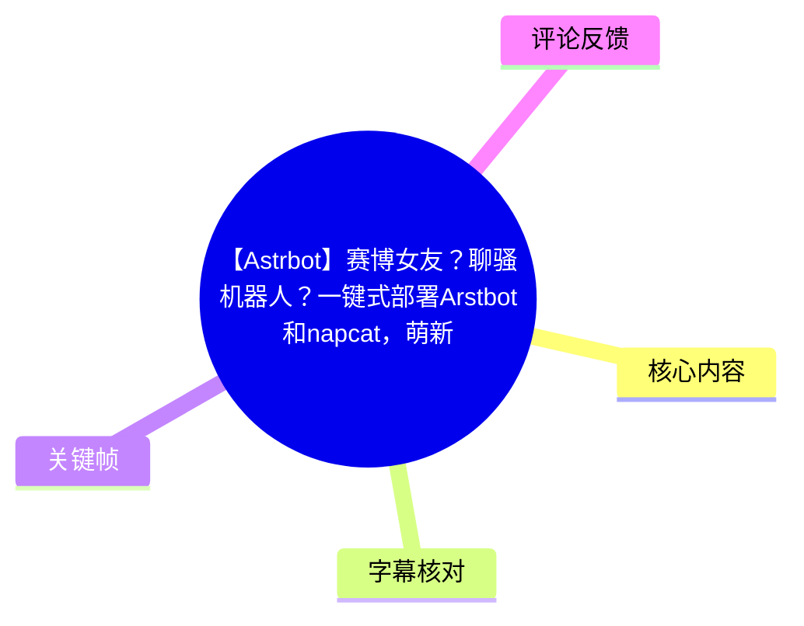
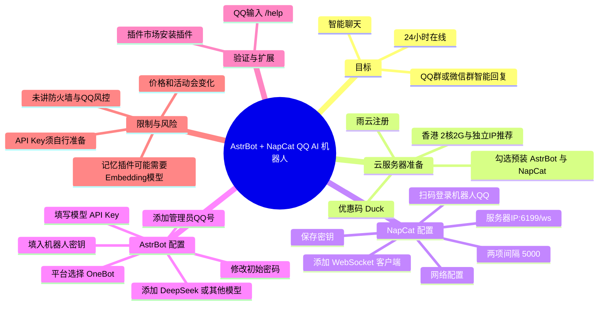
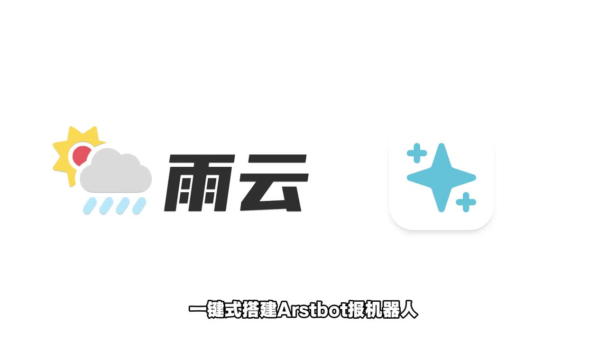
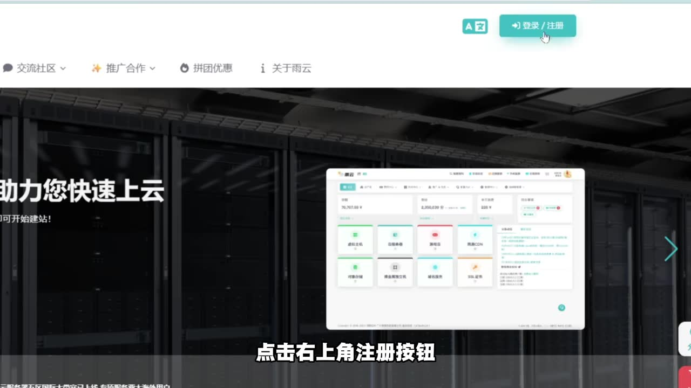
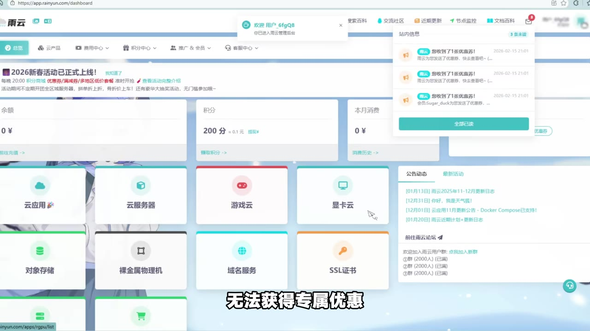
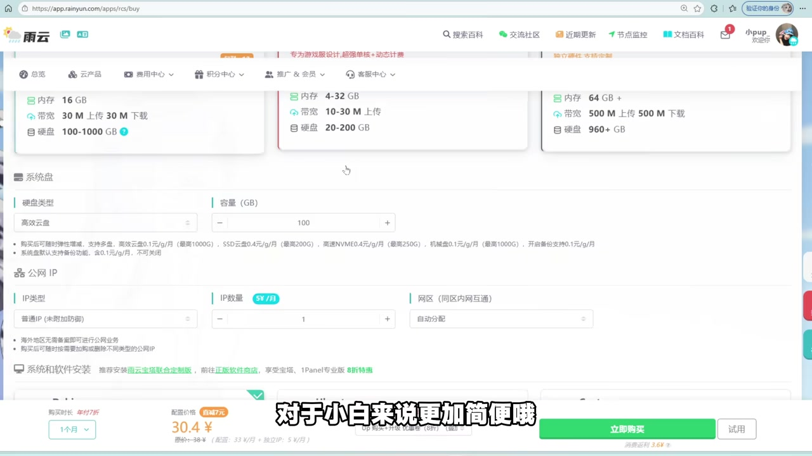

# 【Astrbot】赛博女友？聊骚机器人？一键式部署Arstbot和napcat，萌新也学得会，不用敲命令行，零基础教学！

> 来源：[Bilibili 视频](https://www.bilibili.com/video/BV14tEn6JEcN)  
> UP 主：Add-Honey｜视频时长：4 分 27 秒｜分辨率：2560×1440  
> 标签：人工智能、教程、赛博女友、NapCat、AstrBot、QQ 机器人、电脑技巧  
> 视频简介含雨云推广链接及优惠码信息；该商业优惠内容应以购买页面实时显示为准。

## 小结

这是一份面向零基础用户的云端 QQ AI 机器人部署演示。视频选择在雨云购买并预装 **AstrBot** 与 **NapCat** 的服务器，目的是避免手动安装和命令行操作；随后通过 NapCat 登录机器人 QQ、配置 WebSocket 客户端，再在 AstrBot 中接入 OneBot 平台和大模型 API。

核心链路是：**服务器预装 AstrBot / NapCat → NapCat 登录 QQ → NapCat 以 WebSocket 连接 AstrBot → AstrBot 配置模型与管理员 → 在 QQ 中用 `/help` 验证**。其中最关键的连接参数为服务器 IP、`6199` 端口、`/ws` 路径、NapCat 生成的密钥，以及用户自备的模型 API Key。

视频推荐中国香港 2 核 2GB、独立 IP 的服务器，称其对新手更方便；在其录制时的示例价格为原价 38 元、使用优惠券后约 30.4 元，并提到新用户五折后约 19 元、支持 1 元试用及“7 天无理由退货”。这些均属于视频中的推广/价格陈述，不应视为当前价格、库存、地区可用性或售后政策的保证。

教程并未展示模型 API 的获取过程、AstrBot 的具体访问端口、服务器安全组/防火墙设置、QQ 风控处理、群权限设置及长期运维策略。因此它适合作为“预装应用一键部署”的入门路线，而不是完整的生产环境部署规范。

评论区出现了两类重要补充：其一是用户认为旧手机加容器可能比云服务器更省钱；其二是实际使用 AstrBot 记忆插件时，可能还需要额外配置 **Embedding（嵌入）模型 Provider**。后者来自评论者的报错描述，视频本身没有讲解，应作为待验证的排障线索。

## 思维导图





## 目录

- [目标、前提与时效性](#目标前提与时效性)
- [购买预装服务器](#购买预装服务器)
- [配置 NapCat 并登录机器人 QQ](#配置-napcat-并登录机器人-qq)
- [连接 AstrBot 与 NapCat](#连接-astrbot-与-napcat)
- [接入 AI 模型、管理员与验证](#接入-ai-模型管理员与验证)
- [完整操作清单与参数表](#完整操作清单与参数表)
- [限制、风险与可迁移经验](#限制风险与可迁移经验)
- [字幕比对](#字幕比对)
- [评论分析](#评论分析)
- [处理记录](#处理记录)

## [目标、前提与时效性](https://www.bilibili.com/video/BV14tEn6JEcN?t=34)

视频在 [00:34](https://www.bilibili.com/video/BV14tEn6JEcN?t=34) 开始说明目标：为 QQ 群或微信群配备可以自动回复、智能聊天、并保持 24 小时在线的 AI 机器人。实际演示以 QQ、NapCat 与 AstrBot 为主；“微信群”仅出现在开场应用描述中，视频没有展示微信侧接入步骤，因此不能据此推断本教程已完成微信群部署。

UP 主把方案定位为“一键式搭建”，具体含义是购买服务器时选装应用，让服务商自动部署 AstrBot 和 NapCat；这并不意味着完全不需要配置。用户仍需要完成：

1. 注册并购买云服务器；
2. 准备一个用于机器人的 QQ 账号并扫码登录；
3. 保存 NapCat 的连接密钥；
4. 在 AstrBot 中填写模型 API Key；
5. 填写管理员 QQ 号；
6. 以 `/help` 进行最终连通性验证。



> 图：片头直接给出“雨云”和“一键式搭建 Arstbot 机器人”的主题。标题、画面和后续字幕中的产品拼写存在差异；结合视频标题标签及教程上下文，正文统一按 **AstrBot** 记录，NapCat 按其常用产品名记录。

### 前置条件

- 可访问浏览器及服务器管理页面的设备。视频称“理论上任何设备均可操作”，但实际录屏使用桌面浏览器。
- 一个用于充当机器人的 QQ 账号。
- 可用的模型 API Key。视频以 DeepSeek 为例，但没有提供 Key 的申请路径、计费规则或额度说明。
- 一台具备公网 IP、且可部署/访问相关服务的服务器。视频推荐香港 2 核 2GB 独立 IP 配置，但未说明所有地区、套餐都可安装对应应用。
- 能够承担云服务器和模型 API 的可能费用。

### 时效性说明

视频元数据显示发布时间为 2026-06-06，素材抓取于 2026-07-16。服务器套餐、应用镜像、控制台布局、优惠券、端口、AstrBot/NapCat 版本和 QQ 登录策略都可能在之后变化。尤其视频简介中的雨云链接、优惠码 `duck`、折扣及售后承诺应在官方页面重新核验。

## [购买预装服务器](https://www.bilibili.com/video/BV14tEn6JEcN?t=35)

### [注册、优惠码与优惠券](https://www.bilibili.com/video/BV14tEn6JEcN?t=35)

UP 主建议通过视频简介链接，或在浏览器搜索并进入雨云官网，点击右上角注册。视频称填写优惠码 `Duck` 可获取专属优惠与技术支持；如果从视频下方链接进入，优惠码可能自动带入。视频还提到可用微信或 QQ 登录，扫码后会出现优惠码填写框。



> 图：画面定位了雨云页面右上角的“登录/注册”按钮，帮助确认教程的起始操作位置。

视频特别强调：若优惠码填错或未填，将无法获得其所称“专属优惠”。随后可进入“积分中心—积分商城”寻找面向 APP 的优惠券，以争取更低购买价格。



> 图：该帧显示雨云控制台、积分相关入口及“无法获得专属优惠”的字幕，说明优惠码填写被视频视为下单前步骤，而非部署技术配置。

### [服务器规格、预装软件与价格说法](https://www.bilibili.com/video/BV14tEn6JEcN?t=61)

在“云服务器”板块购买用于部署机器人的服务器。UP 主推荐：

| 项目 | 视频中的建议/陈述 | 说明 |
| --- | --- | --- |
| 地域 | 中国香港 | 视频推荐项，不代表唯一可用区域。 |
| 规格 | 2 核 2GB | 面向新手的推荐；未展示实际资源占用、并发上限或模型本地推理能力。 |
| IP | 独立 IP | UP 主认为这样对小白更方便。 |
| 软件 | AstrBot、NapCat | 下单时勾选，以免自行安装；若忘记勾选，视频称可在服务器管理界面安装。 |
| 示例原价 | 38 元 | 录制时的价格信息。 |
| 使用优惠券后示例价 | 约 30.4 元/30 元 | ASR 出现“30 元”，关键帧画面价格为 30.4 元；以画面显示的 30.4 元保留为更具体的录制时示例。 |
| 新用户价格 | 约 19 元 | 视频称有五折券，仅为当时陈述。 |
| 试用/售后 | 1 元试用、7 天无理由退货 | 视频陈述，须以服务商当期规则为准。 |



> 图：该帧可见购买页面的公网 IP 区域、底部“系统和软件安装”区域与约 30.4 元配置价格，能佐证视频是在购买页选择预装方案；画面本身不足以确认所有隐藏配置项或当前售价。

购买后进入订单/服务器页面，点击“管理”进入服务器管理界面。视频要求等待 AstrBot 与 NapCat 安装完成，之后点击相应位置查看软件信息，并记录服务器 IP。

## [配置 NapCat 并登录机器人 QQ](https://www.bilibili.com/video/BV14tEn6JEcN?t=108)

### [进入 NapCat 并扫码登录](https://www.bilibili.com/video/BV14tEn6JEcN?t=108)

安装完成后，视频要求新开浏览器窗口，输入 NapCat 登录地址。ASR 的原话是“NapCat 的登录 IP，服务器 IP 这里替换成刚才复制的”；该句没有识别出完整协议、端口或路径，所以不能补写为某个固定 URL。应以服务器管理页实际显示的 NapCat 访问地址为准。

首次进入 NapCat 后：

1. 点击右侧的“扫码登录”；
2. 用准备作为机器人的 QQ 账号扫码；
3. 登录完成后进入“网络配置”；
4. 添加 WebSocket 客户端。

> 安全提示：机器人 QQ 是实际账号登录行为。视频未讨论 QQ 的异地登录验证、风控、账号封禁风险、账号实名状态或群管理权限。部署前应了解 QQ 平台规则，避免把重要个人主账号直接作为机器人账号使用。

### [WebSocket 客户端参数](https://www.bilibili.com/video/BV14tEn6JEcN?t=143)

视频将 NapCat 配置为向 AstrBot 提供 WebSocket 连接。根据 [02:23—02:52](https://www.bilibili.com/video/BV14tEn6JEcN?t=143) 的 ASR 时间段，可整理为：

1. 在“网络配置”中添加 WebSocket 客户端。
2. 启用该客户端。
3. 名称可任意填写。
4. 把原本的 `localhost` 改为服务器 IP。
5. 将端口改为 `6199`。
6. 在地址后追加 `/ws`。
7. 将下方两个时间间隔均改为 `5000`。
8. 记录页面上方的密钥。
9. 保存并退出。

可将视频明确给出的地址结构记为：

```text
服务器IP:6199/ws
```

| 参数 | 视频给出的值/动作 | 用途与注意事项 |
| --- | --- | --- |
| 客户端类型 | WebSocket 客户端 | ASR 将其误识别为“website 给客户端”；结合 NapCat、OneBot 和 `/ws` 上下文校正为 WebSocket。 |
| 启用状态 | 启用 | 视频要求先开启。 |
| 名称 | 任意 | 仅作为配置标识。 |
| 主机 | 服务器 IP | 替换默认 `localhost`。 |
| 端口 | `6199` | 视频指定值。若实际镜像版本不同，优先以控制台信息为准。 |
| 路径 | `/ws` | 紧跟端口设置。 |
| 两个时间间隔 | 均为 `5000` | ASR 没有识别字段名称和单位；只可确认数值，不应擅自断言其单位或语义。 |
| 密钥 | 保存前记录 | 后续填入 AstrBot 的机器人 Token/密钥字段。不得公开到截图、日志或群聊。 |

## [连接 AstrBot 与 NapCat](https://www.bilibili.com/video/BV14tEn6JEcN?t=174)

视频接着要求新开网页，填写 AstrBot 机器人的访问地址，并将其中服务器 IP 替换为前面记录的 IP。首次登录需要修改密码。

> 视频未在可用字幕中给出 AstrBot 的具体端口、默认账户、密码规则或 URL 完整格式。因此这部分应从服务商管理页的应用信息中复制，而非套用网络上其他教程的端口。

登录 AstrBot 后，进入“配置机器人”：

1. 平台选择 **OneBot**；
2. 机器人名称可任意填写；
3. 在机器人 Token/密钥字段中填入此前从 NapCat 记录的密钥；
4. 保存退出。

这里的关键是密钥两端一致：NapCat 端生成/显示的密钥必须与 AstrBot 端配置的密钥相匹配，否则二者无法建立预期连接。ASR 在这一段把“OneBot”识别为“onebar”，把“Token”识别为“头坑”；根据产品上下文将其校正，但没有扩展出视频未展示的认证方式。

## [接入 AI 模型、管理员与验证](https://www.bilibili.com/video/BV14tEn6JEcN?t=204)

### [新建模型并添加到机器人](https://www.bilibili.com/video/BV14tEn6JEcN?t=204)

UP 主在 AstrBot 的模型页面新建模型，并以 **DeepSeek** 作为演示。视频明确表示也可以接入其他平台模型。用户需要在 API Key 字段填写自己的密钥，之后刷新模型列表，并在页面下方把新模型添加上去。

这一步包含两个不同概念：

- **模型 Provider/平台**：视频示例为 DeepSeek，也可换成其他平台；
- **API Key**：由用户自行准备的访问凭据，视频没有提供申请、充值或权限配置步骤。

视频没有说明模型名称、API Base URL、模型能力、上下文长度、计费、限流、是否需要兼容 OpenAI 格式等参数。因此只能按照实际 AstrBot 版本的模型配置表单及模型服务商文档补齐。

### [管理员与运行验证](https://www.bilibili.com/video/BV14tEn6JEcN?t=228)

之后打开配置文件，在平台配置中的管理员区域添加自己的 QQ 号，保存退出。视频没有说明管理员的具体权限范围，但该设置显然用于识别可管理机器人或执行管理命令的账号。

最后，打开机器人 QQ 的聊天窗口，输入：

```text
/help
```

若机器人正常返回，UP 主将其视作搭建完成。然后可前往插件市场，为机器人安装所需插件。

```text
验证顺序：
NapCat 已登录机器人 QQ
        ↓
NapCat WebSocket 已启用，地址与密钥已填写
        ↓
AstrBot OneBot 机器人已保存
        ↓
AI 模型及 API Key 已配置并添加
        ↓
管理员 QQ 号已添加
        ↓
向机器人发送 /help，观察是否返回
```

`/help` 仅能初步验证机器人服务是否响应；视频没有展示真实 AI 对话测试、群消息响应、私聊权限、模型调用失败时的日志检查，或服务器重启后的自恢复测试。

## [完整操作清单与参数表](https://www.bilibili.com/video/BV14tEn6JEcN?t=34)

以下清单严格按视频顺序整理，适合作为实际操作时的核对表。

### 部署步骤

- [ ] 注册雨云账号；如决定使用视频推广方案，在注册时检查优惠码 `Duck` 是否正确填入。
- [ ] 在积分中心/积分商城检查是否有视频提到的优惠券。
- [ ] 购买云服务器；视频推荐香港 2 核 2GB、独立 IP。
- [ ] 在软件安装区域勾选 AstrBot 和 NapCat；若未勾选，尝试在服务器管理页安装。
- [ ] 等待两个应用安装完成，进入服务器管理界面，记录服务器 IP 与应用访问说明。
- [ ] 打开 NapCat 管理页面，用机器人 QQ 扫码登录。
- [ ] 在 NapCat 网络配置中创建并启用 WebSocket 客户端。
- [ ] 将主机设为服务器 IP、端口设为 `6199`、路径设为 `/ws`，两个时间间隔均填写 `5000`。
- [ ] 记录 NapCat 密钥并保存配置。
- [ ] 打开 AstrBot 管理页面，首次登录修改密码。
- [ ] 在 AstrBot 配置机器人中选择 OneBot，填写任意名称和 NapCat 密钥，保存。
- [ ] 在模型页新建模型；示例为 DeepSeek，填写自己的 API Key。
- [ ] 刷新模型列表，将模型添加给机器人。
- [ ] 在平台配置中加入自己的 QQ 号作为管理员，保存。
- [ ] 在机器人 QQ 中发送 `/help`，确认有正常返回。
- [ ] 按需在插件市场安装插件，并独立验证每个插件的依赖和权限。

### 参数速查

| 配置位置 | 参数 | 视频值 | 不确定/限制 |
| --- | --- | --- | --- |
| 服务器 | 区域 | 中国香港 | 推荐项，非强制条件。 |
| 服务器 | 规格 | 2 核 2GB | 未给出性能测试与并发容量。 |
| 服务器 | IP | 独立 IP | 视频称对新手方便。 |
| 软件安装 | 应用 | AstrBot、NapCat | 依赖服务商镜像和管理页可用性。 |
| NapCat | 客户端 | WebSocket 客户端 | 字幕识别有误，依据上下文校正。 |
| NapCat | 主机 | 服务器 IP | 不再使用 `localhost`。 |
| NapCat | 端口 | `6199` | 录制版本参数，版本变化时需核验。 |
| NapCat | 路径 | `/ws` | 与端口拼接。 |
| NapCat | 两个时间间隔 | `5000`、`5000` | 字段名、单位未展示清楚。 |
| AstrBot | 平台 | OneBot | ASR 原文误识别为“onebar”。 |
| AstrBot | 机器人名称 | 任意填写 | 仅视频陈述。 |
| AstrBot | 机器人密钥 | NapCat 中记录的密钥 | 属于敏感凭据。 |
| AstrBot | 模型示例 | DeepSeek | 可使用其他平台，但兼容性未展开。 |
| AstrBot | API Key | 用户自己的 Key | 未公开、未展示申请方式。 |
| AstrBot | 管理员 | 用户自己的 QQ 号 | 未说明多管理员、权限细节。 |
| QQ 验证 | 命令 | `/help` | 只验证基础响应。 |

## [限制、风险与可迁移经验](https://www.bilibili.com/video/BV14tEn6JEcN?t=236)

### 视频覆盖范围之外的事项

1. **没有命令行，不等于没有运维成本。** 预装应用降低了安装门槛，但 IP、密钥、模型 Key、账号登录、异常恢复仍需人工处理。
2. **未展示网络安全配置。** 视频没有讲解防火墙、安全组、面板访问限制、HTTPS、默认密码强度、密钥轮换或公网暴露风险。
3. **未展示 QQ 平台风险处理。** 扫码登录、异地访问、频繁消息、群内权限和账号风控均可能影响实际可用性。
4. **未说明 AI 模型费用。** 云服务器费用与模型 API 调用费用是两条独立成本线；DeepSeek 或其他模型服务的价格、额度及限流均不在视频内。
5. **未说明长期运行与备份。** 例如重启后登录态是否保留、如何查看日志、如何升级、如何导出配置，都没有演示。
6. **插件并非装上即用。** 视频只提及插件市场。评论区的 Embedding 报错表明某些功能/插件可能额外要求模型 Provider 配置。

### 可迁移经验

- 将部署拆成“通信平台接入”“机器人编排”“模型接入”三层，有助于定位故障：QQ/NapCat、AstrBot/OneBot、模型 API 分别检查。
- 对接服务时应优先核对三类值：**地址、端口与密钥**。本视频对应的是服务器 IP、`6199/ws` 和 NapCat 密钥。
- 使用 GUI 一键部署时仍要从管理页记录实际服务信息，避免照搬其他版本教程中的端口或地址。
- 验证应逐层进行：先确认 QQ 登录，再确认 OneBot 连接，然后确认 `/help` 响应，最后再测试模型生成和群聊场景。

## 字幕比对

| 字幕来源 | 完整性 | 专有名词 | 时间轴 | 主要问题 |
| --- | --- | --- | --- | --- |
| Bilibili 站内字幕 | 未提供可用字幕 | 无法核验 | 无可用分段 | 素材明确标注“未提供可用站内字幕”。 |
| 本次 ASR 字幕 | 覆盖约 198.89 秒语音，覆盖率 74.67%；开场至 00:34 基本无识别文本 | 存在多处误识别 | 可用，含 21 个真实起止时间段 | AstrBot、NapCat、OneBot、WebSocket、Token、QQ 等被不同程度误识别；部分段落句子过长。 |

本次 ASR 使用 `medium` 模型识别，语言为中文，置信概率约 `0.9927`，音频时长约 `266.35` 秒，且结果未标记 `noAudioStream=true`。因此可确认本次任务存在可识别音轨；没有把缺少站内字幕误判为工具失败。

最终以 **本次 ASR 的 SRT 时间轴** 作为章节跳转依据，并结合标题、标签、关键帧画面和上下文对专有名词进行有限校正：

| ASR 识别文本 | 正文采用写法 | 校正依据 |
| --- | --- | --- |
| 语云 / 语言 | 雨云 | 视频画面品牌标识、视频简介链接 `rainyun.com`。 |
| ASDB / AsterBot / Arstbot | AstrBot | 视频标题、标签 `astrbot` 与教程上下文；标题中的“Arstbot”为原始标题拼写。 |
| NapCallion / Navcat | NapCat | 视频标题和标签 `napcat`。 |
| website 给客户端 | WebSocket 客户端 | 后续出现 `6199`、`/ws`、密钥以及 OneBot 对接上下文。 |
| onebar | OneBot | AstrBot 接入 NapCat 的常见平台名称，且语义与画面流程一致。 |
| 机器人头坑 | 机器人 Token/密钥字段 | 前文要求记录密钥、后文要求填入该字段。 |
| TQ 号 | QQ 号 | 视频在 QQ 机器人配置语境中说明管理员账号。 |
| tupi | QQ 聊天窗口 | 后续操作为输入 `/help`；ASR 未能可靠识别该词。 |

上述校正仅用于恢复视频明显指向的产品和字段含义；未从字幕中补造 AstrBot 完整访问 URL、端口、模型名或隐藏配置字段。

## 评论分析

仅处理本次可获取的热评前三条；评论是个人观点或个案，不作为已验证事实。

1. **库禾（20 赞）**  
   观点是“旧手机 + 容器”比云部署更有性价比。它补充了视频之外的本地/闲置设备部署路线，指出云服务器并非唯一选择。该评论没有提供设备规格、容器方案、功耗、网络穿透、稳定性或维护成本，因此只能作为替代方向，不能直接得出旧手机一定更便宜或更稳定的结论。

2. **东云秋花鱼（3 赞）**  
   评论贴出了 AstrBot 日志：`iris-memory:l2_memory.adapter` 的嵌入模型加载失败，导致 L2 记忆库不可用；日志建议在 AstrBot“模型”页面添加 Embedding 类型 Provider，或在插件配置中将“嵌入模型来源”切换为 Provider。该评论的重要价值是揭示：即使聊天模型使用 DeepSeek API，记忆类插件仍可能需要单独的嵌入模型配置。由于未提供完整版本、具体插件配置或后续解决结果，不能确认其适用于所有 AstrBot/DeepSeek 组合。

3. **雉ovo（2 赞）**  
   评论仅问“这种是什么情况”，没有附带可识别的报错、截图或上下文，无法判断指向登录、连接、模型还是插件问题。它反映出教程观众可能在实际操作中遇到未被视频覆盖的异常，但没有提供可执行的排障信息。

## 处理记录

- Worker ID：`worker-mrj0wjed-b0c290ad`
- 模型：`gpt-5.6-terra`
- ASR 模型与识别条件：`medium`，CUDA，`float16`，自动语言识别为中文；ASR 结果包含时间戳。
- 使用素材工具/产物：已使用任务提供的元数据、ASR 诊断、ASR SRT 时间轴、关键帧清单与热评 JSON；未提供可用 Bilibili 站内字幕。
- 字幕选择：站内字幕缺失，采用本次 ASR SRT 的真实分段时间作为时间轴；对明显错误的专有名词仅结合标题、标签、画面与上下文校正。
- 关键帧选择依据：选择 `frame-001` 说明主题与品牌，`frame-002` 定位注册入口，`frame-003` 说明优惠码/优惠券语境，`frame-004` 展示服务器购买页中的公网 IP、软件安装及价格信息；均为正文对应流程的可见画面证据。
- 评论范围：仅分析可获取热评前三条，未扩展处理其他评论。
- 缓存清理：提供的素材中未包含缓存清理执行记录，无法确认是否已清理；本文未据此编造清理结果。
- 未解决问题：AstrBot 实际访问端口、初始账户规则、服务器安全配置、模型 API 申请过程、插件依赖、QQ 风控规则及视频所称优惠政策的当前有效性均未在素材中完整提供。
