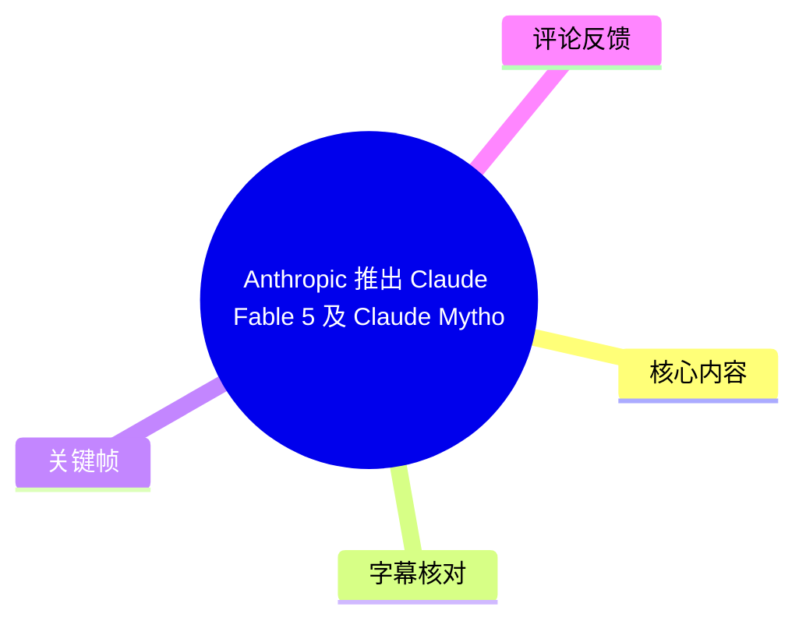
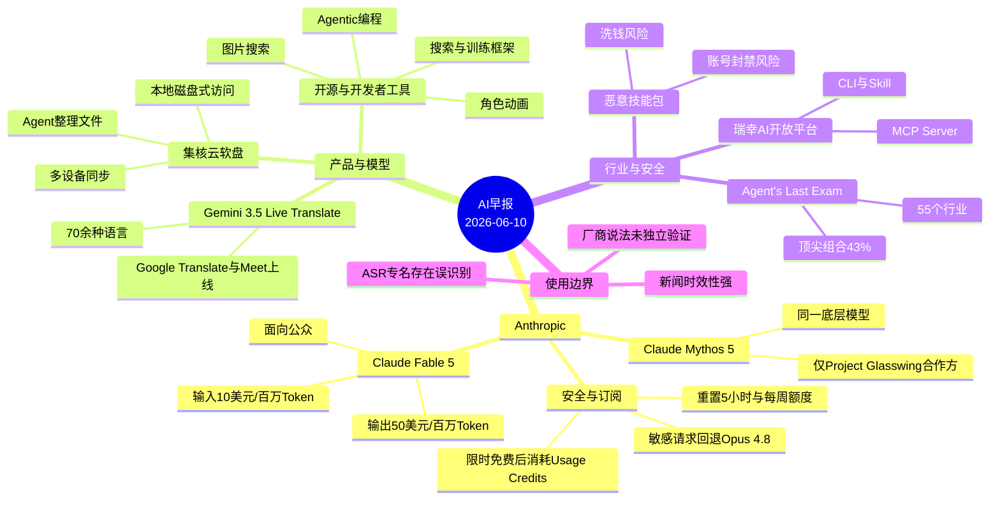
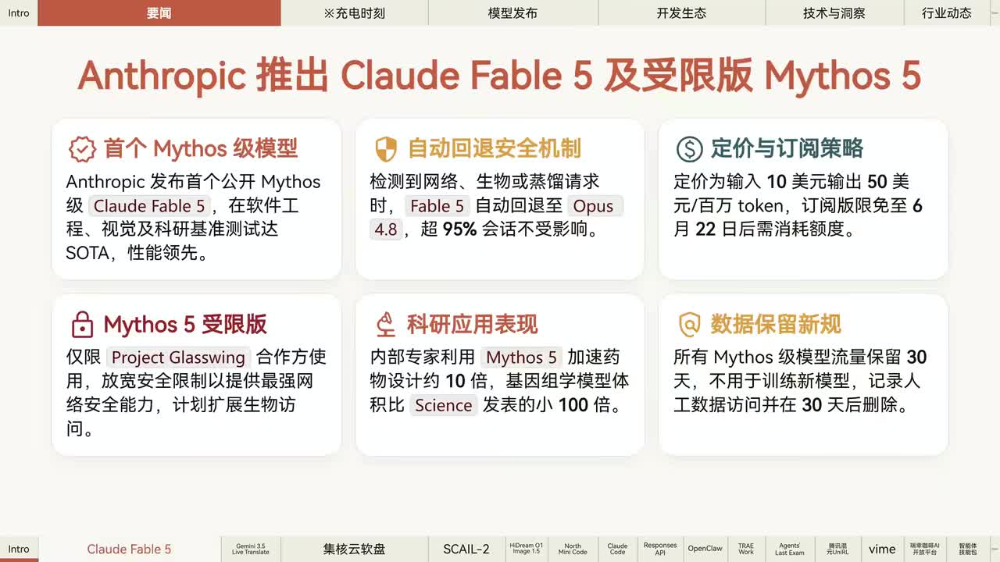
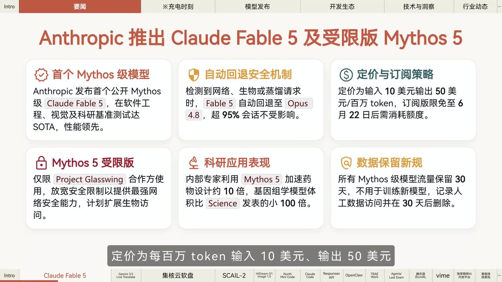
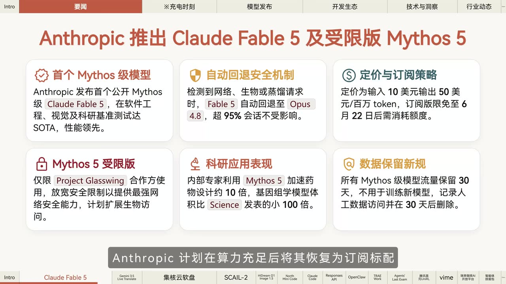
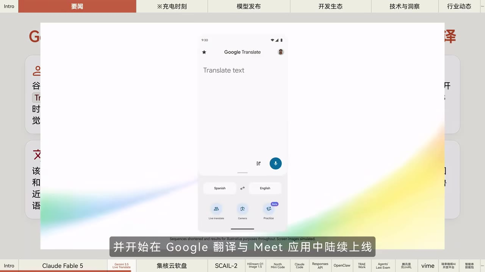

# Anthropic 推出 Claude Fable 5 及 Claude Mythos 5【AI 早报 2026-06-10】

> 来源：[Bilibili 视频](https://www.bilibili.com/video/BV1cQES64Euq) 
> UP 主：橘鸦Juya｜发布时间：2026-06-10｜视频时长：4 分 17 秒 
> 视频简介提供的延伸阅读链接：[相关链接及文字版](https://mp.weixin.qq.com/s/f8Y80SarzbUmbX5D9r9qzA)

## 小结

本期《AI 早报》以 Anthropic 发布 **Claude Fable 5** 与受限版本 **Claude Mythos 5** 为首条新闻。视频称二者基于同一底层模型：Fable 5 面向公众，Mythos 5 仅向 Project Glasswing 合作方开放；前者在软件工程、知识工作、视觉与科研基准上达到或领先 SOTA。画面还补充了受限版本涉及更强网络安全能力、未来可能拓展生物访问信息，以及数据保留规则等内容。

对开发者最直接的参数是价格与访问限制：Fable 5 API 定价为每百万 Token 输入 10 美元、输出 50 美元；检测到网络安全、生物化学或“蒸馏”相关请求时，会自动回退到 Opus 4.8。订阅用户在视频所述的限时窗口内可免费使用，之后需要消耗 Usage Credits；Claude 同时重置了用户的 5 小时及每周用量额度。上述均为 **2026 年 6 月 10 日视频播报时点** 的信息，不应视为当前仍有效的产品政策。

其余新闻覆盖实时语音翻译、云盘与 Agent 协作、开源角色动画、图像生成、Agentic 编程、Claude Code、OpenAI Responses API 图片搜索、搜索工具、通用办公 Agent、Agent 评测、多模态强化学习、训练/推理一体化框架、咖啡点单 MCP 接入，以及恶意技能包风险。节目形式为高密度新闻播报，不提供可复现实验、代码命令或独立测评。

视频中唯一具有明确“使用流程”性质的内容是“集核云软盘”推广：安装后可像本地磁盘一样直接打开和编辑网盘文件，并调用 AI Agent 对其中资料做总结、提炼、分类与知识库整理，再进行多设备同步。它描述的是产品能力与适用场景，未展示实际安装界面、权限设置、文件格式范围或 Agent 的具体配置。

对观众而言，最需要保留的判断是：这是资讯节目的转述，不等同于对厂商公告、基准、价格、免费资格或安全策略的独立验证。尤其是 ASR 对多个英文专名存在明显误识别，本文优先采用画面可读文字纠正 Claude、Fable、Mythos、Opus、Project Glasswing 等关键名称；无法由画面确认的冷门项目名称则保留 ASR 不确定性说明。

## 思维导图

## 目录

- [首条：Claude Fable 5 与 Claude Mythos 5](#首条claude-fable-5-与-claude-mythos-5)
- [Gemini 3.5 Live Translate 与集核云软盘](#gemini-35-live-translate-与集核云软盘)
- [模型、开源项目与开发者生态](#模型开源项目与开发者生态)
- [Agent 评测、强化学习与行业应用](#agent-评测强化学习与行业应用)
- [安全提醒、经验与限制](#安全提醒经验与限制)
- [关键帧索引](#关键帧索引)
- [字幕比对](#字幕比对)
- [评论分析](#评论分析)
- [处理记录](#处理记录)

## 首条：Claude Fable 5 与 Claude Mythos 5 [00:00:00](https://www.bilibili.com/video/BV1cQES64Euq?t=0)

视频开场即进入 Anthropic 新闻。依据 ASR 时间轴与首屏文字，视频陈述如下：

1. **产品关系与开放范围**
   - Anthropic 推出 Claude Fable 5 与 Claude Mythos 5。
   - 两者使用同一底层模型。
   - **Claude Fable 5** 面向公众。
   - **Claude Mythos 5** 为受限版本，仅限 **Project Glasswing** 合作方使用。
   - 画面将 Fable 5 描述为 Anthropic 首个公开的 Mythos 级 Claude 模型；这是视频画面的陈述，未在本视频中展示官方原始公告。

2. **能力与基准说法**
   - 视频称 Fable 5 在几乎所有 AI 能力基准中达到 SOTA。
   - 重点列出的领域包括：软件工程、知识工作、视觉、科研。
   - 画面称其在这些基准中“性能领先”，但没有给出具体 benchmark 名称、样本集、分数、测评配置或竞品对照，因此不能据此推导其在所有实际任务中的表现。

3. **科研与受限访问的画面补充**
   - 画面称，内部专家利用 Mythos 5 加速药物设计约 10 倍，且“基因组学模型体积比 Science 发表的小 100 倍”。
   - 画面还称 Mythos 5 受限版通过放宽安全限制提供更强网络安全能力，并“计划扩展生物访问”。
   - 这些内容只在展示页中出现；ASR 未完整、清晰地复述其中的科研数字，故应作为**画面展示的厂商/节目转述**理解，而不是本文独立验证结论。

> 图：该关键帧以六个信息卡片汇总首条新闻，能直接校正 ASR 中的关键名称，包括 “Claude Fable 5”“Mythos 5”“Project Glasswing” 与 “Opus 4.8”；同时展示了安全、定价、科研、数据保留四类信息，是理解视频核心内容的最佳总览画面。

### 价格、回退与订阅限制 [00:00:24](https://www.bilibili.com/video/BV1cQES64Euq?t=24)

视频给出以下参数与访问政策：

| 项目 | 视频陈述 |
| --- | --- |
| API 输入价格 | 10 美元 / 百万 Token |
| API 输出价格 | 50 美元 / 百万 Token |
| 自动安全回退 | 检测到网络安全、生物化学或蒸馏相关请求时，Fable 5 自动回退至 Opus 4.8 |
| 订阅限时权益 | 视频称部分订阅/企业版本即时包含 Fable 5，免费窗口截至 6 月 22 日 |
| 免费期结束后 | 需要消耗 Usage Credits |
| 后续计划 | 算力充足后，Anthropic 计划将其恢复为订阅标配 |
| 用量额度 | Claude 已为所有用户重置 5 小时与每周使用限额 |

需要特别注意两点：

- ASR 将产品名误识别为 “Cloud”“OPPA 4.8”，但关键帧中的英文清楚显示为 **Claude** 与 **Opus 4.8**，本文据画面校正。
- ASR 对“哪些订阅档位可免费包含 Fable 5”的档位名称识别不稳定；画面只稳定呈现“订阅版限免至 6 月 22 日后需消耗额度”，因此本文不强行补写未能可靠确认的具体套餐名。

> 图：画面字幕明确给出“每百万 token 输入 10 美元、输出 50 美元”，用于确认首条新闻最关键的计费参数；这也是热评集中讨论的焦点。

### 数据保留规则：仅限画面所示陈述 [00:00:48](https://www.bilibili.com/video/BV1cQES64Euq?t=48)

首条新闻页的“数据保留新规”卡片称：所有 Mythos 级模型流量保留 30 天、不用于训练新模型；记录人工数据访问，并在 30 天后删除。该段**未被 ASR 完整播报**，但在关键帧画面中可读。

这条信息涉及隐私、数据治理与企业采购合规，实际使用前应以 Anthropic 当时适用的隐私政策、数据处理协议和具体产品条款为准。视频未说明该规则适用于 API、网页端、企业版还是仅适用于特定受限项目，也未说明地域差异或例外情形。

> 图：画面底部字幕提到“Anthropic 计划在算力充足后将其恢复为订阅标配”，与上文的限时免费、Usage Credits 机制共同构成访问政策的时间性背景。

## Gemini 3.5 Live Translate 与集核云软盘 [00:00:48](https://www.bilibili.com/video/BV1cQES64Euq?t=48)

### Google 实时流式语音翻译 [00:00:48](https://www.bilibili.com/video/BV1cQES64Euq?t=48)

视频称 Google 发布 **Gemini 3.5 Live Translate**，特点包括：

- 支持 70 多种语言；
- 支持连续的实时语音翻译；
- 已面向开发者推出公开预览；
- 开始在 Google Translate 与 Google Meet 中陆续上线。

ASR 的“连续语音到语英互异”存在明显听写问题，但结合上下文及画面，可稳定提炼为“连续语音翻译”。视频没有展示 API 调用方式、支持语种列表、语音延迟、是否双向同传、地区开放范围或收费政策。

> 图：关键帧显示 Google Translate 手机界面及“Live translate”入口，且视频字幕写明正在 Google 翻译与 Meet 中陆续上线。这为“产品形态和上线渠道”提供了直接画面依据，但不能证明所有地区或账户已经可用。

### 集核云软盘：视频描述的工作流 [00:01:12](https://www.bilibili.com/video/BV1cQES64Euq?t=72)

从 1 分 12 秒起，视频进入集核云软盘的推广内容。其切入问题是：AI 时代文件量指数增长，本地硬盘容量可能不足。视频描述的能力与使用步骤可整理为：

1. **安装工具**：安装后，电脑会“像多了一块本地磁盘”。
2. **直接操作云端文件**：无需先从网盘下载，即可直接打开、编辑文件。
3. **调用 AI Agent 处理资料**：可让 Agent 对文件进行总结、提炼、分类。
4. **沉淀为知识库**：把零散资料组织成可检索、可复用的知识库。
5. **多设备同步**：适用于异地办公团队或个人多设备协同。

适用前提和缺失信息：

- 视频未说明支持的操作系统、云存储后端、挂载协议、离线策略、冲突处理机制、传输加密、文件权限模型和价格。
- 涉及企业资料时，必须先确认 Agent 是否读取原始文件、数据是否上传至第三方、日志保留多久、是否支持权限隔离。
- 视频称注册链接位于评论区并赠送免费试用；这是当时的推广信息，链接及试用资格均可能已经变动。

## 模型、开源项目与开发者生态 [00:01:50](https://www.bilibili.com/video/BV1cQES64Euq?t=110)

### 角色动画、图像生成与 Agentic 编程 [00:01:50](https://www.bilibili.com/video/BV1cQES64Euq?t=110)

视频在这一段连续播报三项模型新闻：

1. **CISO 二角色动画模型**
   - 视频称由“制谱与清华团体”开源。
   - 采用端到端架构，通过直接拼接驱动视频的 latent（ASR 转写为“Layton”）摆脱传统骨架图依赖。
   - 原生支持多角色交互与长视频生成。
   - 具备动物驱动的零样本能力。
   - 已开放下载，并支持 ComfyUI 工作流。  
   
   此处项目发布方、模型拼写与技术术语受 ASR 影响较大；除“二角色动画、端到端、骨架图依赖、多角色、长视频、ComfyUI”等可由上下文稳定理解的内容外，不宜据此补充仓库地址或模型结构细节。

2. **HiDream O1 Image 1.5**
   - 据 Artificial Analysis 公布的信息，视频称该模型支持最高 2K 分辨率。
   - 在该机构文生图排行榜中位列第三。
   - 排行榜名次会随测评版本、提示词集合和时间变化，视频没有给出对应的榜单快照或日期。

3. **Cohere North MiniCode**
   - 视频称 Cohere 正式发布首个开源 Agentic 编程模型 North MiniCode。
   - 模型为 MoE 架构：**总参数 300 亿、激活参数 30 亿**。
   - 视频以“同类模型中性能极具竞争力”转述官方说法，未提供编码 benchmark 和具体数值。

### Claude Code、Responses API 与 OpenClaw [00:02:38](https://www.bilibili.com/video/BV1cQES64Euq?t=158)

视频继续列举开发者相关更新：

| 项目 | 视频陈述 | 实际使用时需确认 |
| --- | --- | --- |
| Claude Code v2.1.170 | 引入 Mythos 级别模型能力；支持深度上限为 5 的嵌套能力 | ASR 中功能名被识别为 “Savage”，无法可靠确定英文功能正式名称 |
| OpenAI Responses API Web Search | Web Search 新增图片搜索；开发者可在文本结果基础上构建展示产品、地点和视觉参考的应用 | 图片来源、引用归属、结果格式、地区可用性与计费 |
| OpenClaw 2026-06-05 更新 | 增加 Parallel 搜索、零配置免费与付费 API 选项、自定义安全策略 | 产品名与更新项来自 ASR，需回到官方更新日志核验 |

这里的可迁移经验是：当搜索 API 从纯文本扩展到图片结果时，应用设计不再只是“回答问题”，还需要处理图片展示、来源归因、内容安全、加载性能和视觉检索失败的降级路径。视频只说明能力方向，并未给出调用示例或协议细节。

### TRAE Work 与 Agent's Last Exam [00:03:02](https://www.bilibili.com/video/BV1cQES64Euq?t=182)

- **TRAE Work**：视频称 TRAE Solo 正式升级为 TRAE Work，产品定位从专门服务开发者扩展至更广泛的日常工作场景。
- **Agent's Last Exam**：U.C. Berkeley 团队发布的 AI Agent 基准，覆盖 **55 个行业**，面向真实长周期任务；视频称官方排行榜中当前顶尖组合最高得分仅 **43%**。

“43%”说明在该基准和当时排行榜条件下，长周期、跨行业 Agent 任务仍有显著难度；但它不能被泛化为“所有 Agent 只有 43% 准确率”。不同任务定义、工具权限、提示词、成本预算和人工介入策略都会改变结果。

## Agent 评测、强化学习与行业应用 [00:03:26](https://www.bilibili.com/video/BV1cQES64Euq?t=206)

### UniRL 与训练/推理框架 [00:03:26](https://www.bilibili.com/video/BV1cQES64Euq?t=206)

视频称腾讯混元团队在 GitHub 开源 **UniRL** 多模态模型强化学习框架：

- 用单一后训练循环统一应用于扩散模型、LLM 与 VLM；
- 目标是统一多类型模型的后训练强化学习流程。

随后视频提及 VLLM 团体推出一个开源强化学习训练后框架，ASR 将其识别为 “WIME”，并称其将 SLIM 训练栈与 VLLM 推理整合，以保障训练与推理稳定对齐。由于该项目英文名、组件名和具体机制均存在 ASR 误识别，本文不将其扩写为确定的项目事实。

对技术团队而言，这两类消息的价值不在于立即替换现有训练系统，而在于关注以下工程问题：

1. 训练阶段与线上推理引擎是否采用一致的模型执行语义；
2. 多模态模型、扩散模型与语言模型能否复用奖励、采样、评估和日志基础设施；
3. 强化学习后训练中，吞吐、显存、模型版本和采样分布不一致会不会引发稳定性问题；
4. 开源框架是否具备可复现实验、故障恢复、资源隔离和安全审计能力。

### 瑞幸 AI 开放平台与技能包风险 [00:03:50](https://www.bilibili.com/video/BV1cQES64Euq?t=230)

视频最后播报两项行业与安全新闻：

1. **瑞幸咖啡 AI 开放平台**
   - 提供 MCP Server、CLI 与 Skill。
   - 支持 AI Agent 通过自然语言完成门店查询、选品与在线下单。
   - 这代表 Agent 可开始连接具体消费服务，但视频未说明身份验证、支付授权、订单确认、取消退款和地域可用范围。

2. **恶意智能体技能包警示**
   - 国家互联网应急中心发布公告，指出部分恶意智能体技能包以“模型越狱”或“挖矿”为名传播。
   - 视频提醒，这类包可能导致账号封禁，甚至让用户卷入洗钱风险。

面对第三方 Skill、插件、MCP Server 或自动化脚本，较稳妥的操作顺序是：

1. 仅从项目官方仓库、可信应用市场或可核验发布者处获取；
2. 阅读安装脚本、依赖包、网络请求与所需权限；
3. 不向未知 Skill 交付主账号 Cookie、API Key、支付信息、私钥或企业内部文件；
4. 在隔离环境、测试账号和最小权限下试运行；
5. 对自动下单、转账、删除文件等高风险动作保留人工确认；
6. 发现异常网络连接、挖矿占用、账户异地操作或权限变化时，立即停用并轮换密钥。

## 安全提醒、经验与限制 [00:04:14](https://www.bilibili.com/video/BV1cQES64Euq?t=254)

### 可迁移的阅读与采购经验

- **区分“能力发布”与“可用资格”**：Fable 5、Mythos 5、Gemini Live Translate 等新闻同时涉及模型能力、渠道、配额、价格和灰度上线；其中任一项变化都可能让“已发布”不等于“你当前可用”。
- **把安全回退纳入产品评估**：当系统会因请求类型自动回退模型时，实际质量、成本、上下文行为和日志合规可能随任务而变。企业评测应覆盖正常与敏感任务路径。
- **不要只看总参数或排名**：North MiniCode 的 300 亿总参数/30 亿激活参数，以及图像榜单第三、Agent 基准 43% 等信息，都应结合任务集、工具权限、版本和成本理解。
- **Agent 接入外部服务要设置动作边界**：自然语言可驱动查询、选品和下单提高便利性，也会扩大误操作与越权风险。敏感动作应配置显式确认和最小权限。
- **对“免费至某日”的消息立即标记有效期**：视频中的 6 月 22 日免费窗口、额度重置、公开预览与陆续上线，均是快速过期信息。

### 本视频的内容限制

1. 视频为 257 秒新闻汇总，绝大多数新闻仅有一句至数句概述。
2. 未提供站内字幕；本次 ASR 虽覆盖约 99.23% 的音频，但英文品牌、模型名、组织名与术语误识别较多。
3. 关键帧主要覆盖首条 Anthropic 新闻及 Google 翻译演示，无法据此验证后半段每个开源项目的拼写与官网信息。
4. 视频中的“达到 SOTA”“性能领先”“极具竞争力”等属于节目转述的官方/机构结论，缺少原始实验数据和独立复测。
5. 视频结束于“明天见”，没有对前述项目提供下载链接、代码、测试过程或后续答疑。

## 关键帧索引

| 关键帧 | 对应时间段 | 正文用途与价值 |
| --- | ---: | --- |
|  | 约 00:00–00:24 | 校正 Claude、Fable、Mythos、Project Glasswing、Opus 4.8 等关键专名；展示首条新闻六项要点。 |
|  | 约 00:24–00:48 | 直接呈现输入 10 美元、输出 50 美元 / 百万 Token 的定价字幕。 |
|  | 约 00:48 | 补充“算力充足后恢复订阅标配”的计划，支持分析访问政策的时效性。 |
|  | 约 00:48–01:12 | 展示 Google Translate 的 Live Translate 界面及上线 Google Translate、Meet 的视频字幕。 |

> 其余关键帧虽在素材目录中存在，但未提供可供可靠解读的画面内容说明；为避免将未核验画面信息写入正文，未强行引用。

## 字幕比对

| 字幕来源 | 完整性 | 专有名词 | 时间轴 | 主要问题 |
| --- | --- | --- | --- | --- |
| Bilibili 站内字幕 | 未提供可用字幕 | 无法评估 | 无法评估 | 素材明确标注“未提供可用站内字幕”。 |
| 本次 ASR 字幕 | 较完整：14 段，覆盖约 254.12 秒语音，占视频约 99.23% | 存在较多误识别 | 可用：含精确起止时间 | 英文模型、产品与术语常被音译或误写，后半段技术项目名称尤其不稳定。 |

最终采用策略：

- **时间轴**：采用本次 ASR SRT 的真实分段起止时间换算秒数，章节链接均据此生成。
- **文本主体**：以 ASR 为基础，结合关键帧中的可读文字校正。
- **已校正的重要专名**：
  - ASR “Cloud Fable 5” → **Claude Fable 5**
  - ASR “Mithos 5” → **Mythos 5**
  - ASR “OPPA 4.8” → **Opus 4.8**
  - ASR “Project Glasswing” → **Project Glasswing**（画面可读）
  - ASR “集合云软盘” → 保留为节目口播名称，未获得可验证英文产品名
  - ASR “Layton” → 仅说明为视频 latent 相关表述，未强行确定术语拼写
- **未作强行校正的名称**：CISO、HiDream O1 Image 1.5 之外的部分项目发布方、OpenClaw、WIME、SLIM 等，在没有站内字幕、官方材料或清晰关键帧交叉验证时，保留 ASR 来源与不确定性。
- ASR 诊断中**没有** `noAudioStream=true` 标记；音频流存在，且语音覆盖诊断正常，因此本次采用 ASR 时间轴，而非将无字幕归因于工具失败。

## 评论分析

以下仅分析可获取的热评前三条，评论内容代表用户观点，不构成对新闻事实的验证。

1. **butyr（257 赞）**  
   评论：“输入十刀，输出五十刀，就这价格我都能找个真专家一对一给我输出了[笑哭]”  
   - 观点：对 Fable 5 的高输出 Token 单价表达调侃和成本质疑。
   - 价值：指出了视频首条新闻中最容易影响实际采用的因素——输出密集型任务的成本。
   - 限制：这是修辞性比较，没有考虑专家服务的可用性、吞吐、任务类型、上下文长度和自动化规模，不能据此得出模型“不划算”的一般结论。

2. **冲神尼桑（183 赞）**  
   评论：“Tibo：我之前也想过叫这个……”  
   - 观点：将视频中的命名与 “Tibo” 作联想式玩笑。
   - 补充信息：未提供可核验的产品、技术或价格信息。
   - 可信度判断：属于社区梗和命名联想，不应用于判断 Anthropic 产品名称的来源或商业关系。

3. **Kirsche_sigma（128 赞）**  
   评论：“依旧”  
   - 观点：语义极简，缺少明确指代对象，可能是对栏目形式、资讯节奏或某项长期现象的感叹。
   - 补充信息：无。
   - 可信度判断：由于上下文不足，不能推导出任何关于模型能力、价格或行业趋势的结论。

## 处理记录

- Worker ID：`worker-mrj0wbly-5dc4e50c`
- 模型：`gpt-5.6-terra`
- 调用工具与素材：视频元数据、ASR 结果与 SRT 时间轴、关键帧素材、热评前三条；未提供可用 Bilibili 站内字幕。
- 字幕选择：以本次 ASR SRT 作为时间轴主来源；结合 `frames/frame-001.jpg` 至 `frames/frame-004.jpg` 的可读画面，校正 Claude、Fable、Mythos、Opus 4.8、Project Glasswing 等首条新闻专名。未对缺乏画面或官方材料支撑的 ASR 冷门项目名进行臆测修正。
- 关键帧选择依据：优先选取包含清晰文字、能与 ASR 相互校验、且直接服务正文事实说明的首条新闻总览、价格/订阅页与 Google Translate 演示页；未使用无法可靠辨识内容的其余帧。
- 评论范围：仅使用可获取热评前三条，未扩展到其他评论或将评论当作事实来源。
- 缓存清理：未获得具体缓存清理执行日志；本记录不虚构清理结果。
- 未解决问题：
  1. 站内字幕缺失，后半段多个英文项目名只能保留 ASR 不确定性；
  2. 视频未提供各新闻的官方链接、benchmark 细节、代码仓库地址或完整产品条款；
  3. 价格、免费截止日、配额重置与灰度上线均具有强时效性，需以当前官方页面重新核验。
