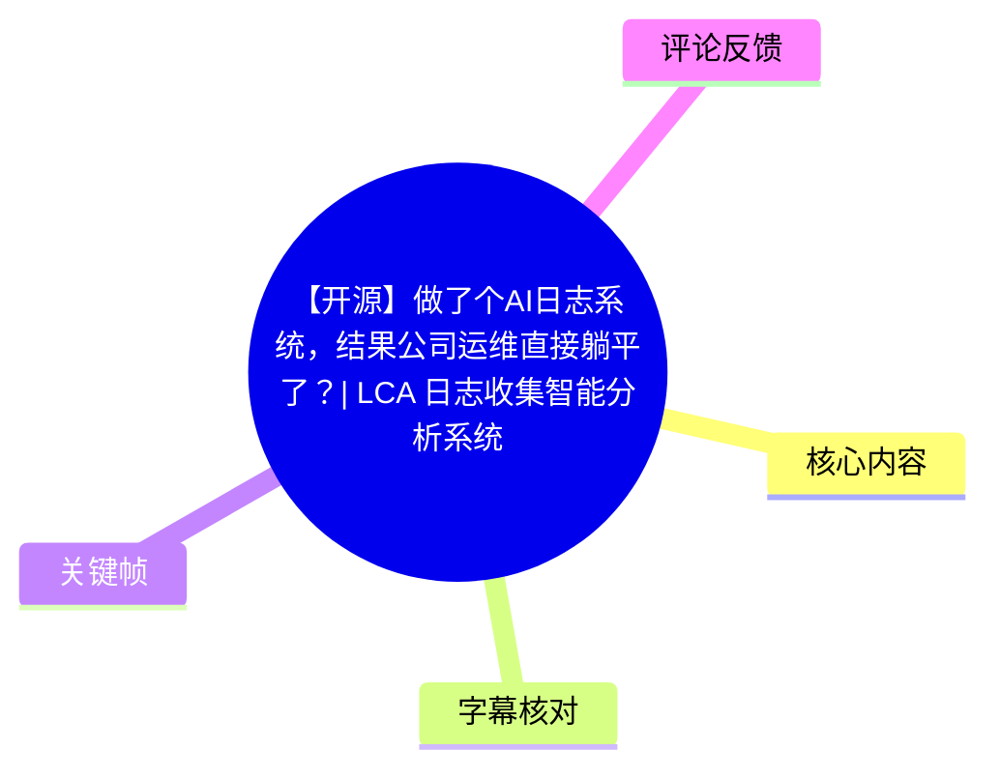
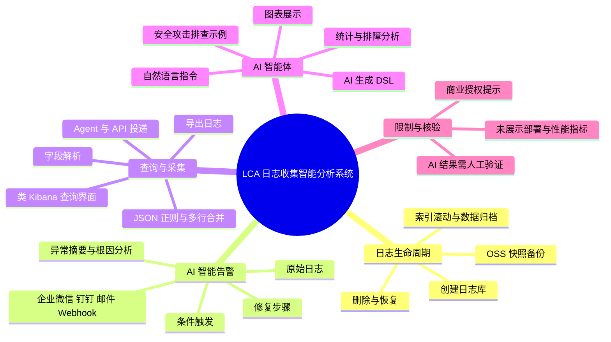
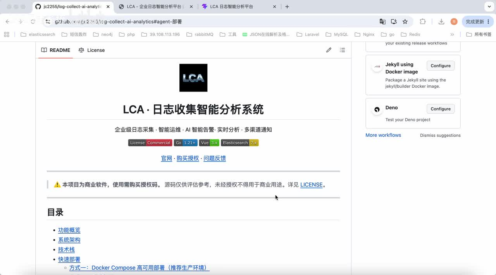
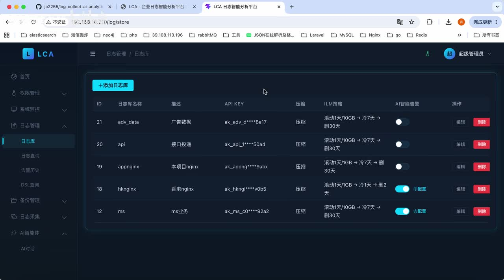
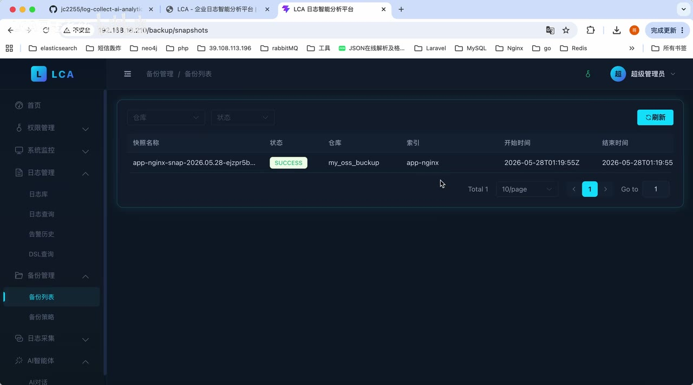

# 【开源】做了个AI日志系统，结果公司运维直接躺平了？| LCA 日志收集智能分析系统

> 来源：[Bilibili 视频](https://www.bilibili.com/video/BV13MV46fEGz)  
> UP 主：LCA智能运维平台｜视频时长：12 分 45 秒｜合集：AIcode  
> 项目地址（视频描述提供）：`github.com/jc2255/log-collect-ai-analytics`

## 小结

视频演示了 **LCA 日志收集智能分析系统**：一个面向企业日志采集、存储、告警、查询、备份与 AI 分析的管理平台。作者将其定位为可把日志从“事后查证”转为“实时洞察”的工具，重点解决日志长期保存导致的本地磁盘成本、异常告警后的人工研判，以及复杂日志查询门槛等问题。

其第一项核心能力是日志库的生命周期与备份管理：创建日志库时可配置索引滚动、数据归档及 OSS 相关配置；再通过备份策略将日志快照备份到云端 OSS。视频的明确主张是，此举可减少本地磁盘占用、降低硬件支出，并满足长期留存和审计需求。界面示例中可见快照记录，以及备份后的删除和恢复操作入口。

第二项重点是 AI 智能告警。系统在满足设定条件时针对诸如网关 500、业务错误激增等现象触发实时通知，支持企业微信、钉钉、邮件与 Webhook。告警详情会展示原始日志，并给出异常摘要、原因/根因分析及修复步骤；作者强调这减少了运维人员将日志手工复制到外部 AI 工具再分析的步骤。

第三项是日志查询与采集。查询界面被描述为接近 Kibana 的使用方式，支持导出；采集侧可将原始日志解析、拆分为字段，并处理 JSON、正则匹配和多行日志合并等场景。除 Agent 主动采集外，视频和简介均说明可通过 API 主动投递日志，适合程序或线上数据同步。

视频最强调的是 AI 智能体：用户以自然语言发送指令，让系统直接对日志库做统计、排障或安全分析，也可让 AI 生成 DSL 后执行并以饼图、柱状图、折线图等形式展示统计结果。这是演示中的效率主张，而非对分析准确率、执行耗时或误报率的量化承诺。

需要特别注意授权与时效性：标题带有“开源”，但提供的 GitHub 关键帧明确显示“本项目为商业软件，使用需购买授权；源码仅供评估参考，未经授权不得用于商业用途”。因此，不能仅依据标题将其理解为可自由商用的开源软件；实际许可证、版本支持范围、模型费用、OSS 成本和生产部署要求均应以仓库当前 LICENSE 与官方文档为准。

## 思维导图

## 目录

- [定位、界面与功能边界](#定位界面与功能边界)
- [日志库、生命周期与 OSS 备份](#日志库生命周期与-oss-备份)
- [AI 智能告警：从触发到诊断](#ai-智能告警从触发到诊断)
- [日志查询、导出与采集解析](#日志查询导出与采集解析)
- [AI 智能体、API 投递与 DSL 查询](#ai-智能体api-投递与-dsl-查询)
- [适用场景、经验与限制](#适用场景经验与限制)
- [字幕比对](#字幕比对)
- [评论分析](#评论分析)
- [处理记录](#处理记录)

## [定位、界面与功能边界](https://www.bilibili.com/video/BV13MV46fEGz?t=2)

视频开场将 LCA 称为“日志神器”，并概括其能力为企业级日志采集、智能运维、AI 智能告警、实时分析、多渠道通知和 OSS 云端备份。随后作者从已部署的系统首页/全局看板开始演示。

在 [00:59](https://www.bilibili.com/video/BV13MV46fEGz?t=59) 的介绍中，作者列出平台模块：权限管理、系统监控、日志管理、备份管理、采集管理及 AI 智能体等。视频并未具体讲解权限模型、角色粒度、审计日志、系统监控指标或安装过程，因此这些只能确认“界面中存在对应模块”，不能推断其具体实现能力。

> 图：关键帧显示 GitHub README 页面中的“LCA·日志收集智能分析系统”标题、企业级日志采集/智能运维/AI 智能告警等定位，并出现 Go、Vue、Elasticsearch 7.x 等标签。更重要的是页面明确提示“本项目为商业软件，使用需购买授权”，这是判断授权边界的直接画面依据。

### [标题“开源”与授权提示之间的边界](https://www.bilibili.com/video/BV13MV46fEGz?t=39)

视频标题使用“开源”，且作者引导观众前往 GitHub 查看详细介绍；但关键帧中的 README 提醒源码“仅供评估参考”，未经授权不得用于商业用途。基于现有素材，可以明确整理为：

- **可确认**：视频描述提供了 GitHub 项目地址；GitHub 画面展示源码仓库和 LICENSE 入口。
- **可确认**：画面中的授权提示要求商业使用购买授权。
- **不能确认**：具体授权价格、个人/企业使用范围、二次分发条件、是否存在不同版本的许可证，视频素材没有给出。
- **实践建议**：在 PoC、生产部署、修改源码或接入业务数据前，先阅读仓库当前 `LICENSE`、商业授权说明与隐私/数据处理条款。

## [日志库、生命周期与 OSS 备份](https://www.bilibili.com/video/BV13MV46fEGz?t=84)

作者从日志管理功能讲起：创建日志库时，可以设置索引滚动策略、数据归档以及 OSS 相关配置。根据视频描述，平台通过备份管理中的备份策略，将日志数据自动备份至云端 OSS。

视频给出的目标链条为：

1. 创建或管理日志库。
2. 配置索引滚动策略、归档与 OSS。
3. 在备份管理中设置备份策略。
4. 系统将日志备份为云端 OSS 中的快照。
5. 本地保留压力降低，同时可对历史备份做删除或恢复操作。

作者认为该方案的价值在于减少本地磁盘消耗、节约硬件成本，并支撑审计所需的较长日志保存周期。视频描述中进一步写到适合“日志保留 6 个月+”的合规审计场景，但这是一项产品说明，不代表所有部署默认具有六个月留存，也不代表 OSS、网络、快照与恢复费用为零。

> 图：日志库列表展示了日志库名称、描述、脱敏显示的 API KEY、压缩、ILM 策略、AI 智能告警开关和操作列。画面中可见类似“滚动 1 天/10GB → 冷 7 天 → 删 30 天”的策略示例，说明生命周期策略能够在日志库维度配置；该示例不应被误读为系统唯一或默认参数。

### [界面示例中的 ILM 参数](https://www.bilibili.com/video/BV13MV46fEGz?t=84)

关键帧里的策略文本提供了可见示例：

| 日志库示例 | 画面可见的 ILM 策略 |
| --- | --- |
| `adv_data` | 滚动 1 天 / 10GB → 冷 7 天 → 删 30 天 |
| `api` | 滚动 1 天 / 10GB → 冷 7 天 → 删 30 天 |
| `appnginx` | 滚动 1 天 / 1GB → 冷 1 天 → 删 30 天 |
| `hknginx` | 滚动 1 天 / 1GB → 冷 1 天 → 删 2 天 |
| `ms` | 滚动 1 天 / 10GB → 冷 1 天 → 删 30 天 |

这些参数是演示数据，能说明支持按时间、容量、冷热阶段和删除周期进行规划；视频没有说明 Elasticsearch 集群规模、分片数、副本数、压缩比、快照频率或实际恢复 RTO/RPO，不能从中估算生产成本或性能。

> 图：备份列表中展示一条状态为 `SUCCESS` 的快照记录，字段包括快照名称、仓库、索引、开始时间与结束时间。它为“系统存在快照备份记录展示”提供界面证据，但单条成功记录不能证明持续备份可靠性或跨地域容灾能力。

### [备份后的删除与恢复](https://www.bilibili.com/video/BV13MV46fEGz?t=144)

作者明确说明：完成备份后，可以删除，也可以恢复。这里应区分两个层面：

- **视频已经演示/陈述的能力**：备份列表可查看；备份后的历史数据支持删除与恢复。
- **生产使用仍需验证的事项**：删除的是本地索引、快照还是二者之一；恢复时是否覆盖现有索引；恢复权限、恢复耗时、冲突策略、OSS 凭据权限及失败重试机制，视频均未展示。

## [AI 智能告警：从触发到诊断](https://www.bilibili.com/video/BV13MV46fEGz?t=155)

AI 智能告警在日志库层面配置。作者表示，满足预设条件时可以触发告警并实时通知相关人员；举例包括网关出现 500 错误、业务日志中出现大量错误等。

视频描述给出“两级分析架构”：

1. **ES 规则初筛**：先快速过滤异常日志。
2. **大模型深度分析**：接入 OpenAI 兼容模型，输出异常摘要、根因分析和修复步骤。

视频口述重点在于告警触发后的结果消费：告警历史中保留原始数据，告警详情可显示异常原因、根因/原因分析、修复步骤和异常摘要。作者认为平台能够结合日志上下文，因此不需要运维人员手动复制错误文本到另一款 AI 工具中再进行一次分析。

### [通知渠道与告警历史](https://www.bilibili.com/video/BV13MV46fEGz?t=180)

视频明确列出的通知方式为：

- 企业微信
- 钉钉
- 邮箱
- Webhook

告警的操作流程可按视频内容整理为：

1. 在日志库中启用并配置 AI 智能告警。
2. 设置判定异常的条件或规则。
3. 当日志满足条件时，系统生成告警。
4. 按配置推送至企业微信、钉钉、邮件或 Webhook。
5. 在告警历史中查看原始数据与诊断结果。
6. 结合异常摘要、原因分析、修复步骤和具体错误日志进行处置。

### [告警诊断结果的正确使用方式](https://www.bilibili.com/video/BV13MV46fEGz?t=234)

视频称 AI 可及时诊断“发生了什么”和“怎么样修复”。这一类能力可减少检索和初步归纳时间，但不应把 AI 的“根因分析”直接视为已验证的根因。尤其在生产环境中，建议：

- 回到原始日志、调用链、指标和变更记录交叉核验。
- 对 AI 建议的命令、修复动作先在隔离环境或经过变更审批后执行。
- 为告警设置阈值、去重、抑制、值班路由与升级机制；视频只说明存在条件告警与推送，未说明这些治理细节。
- 若日志包含账号、Token、客户数据或内部地址，需在发送至模型前确认脱敏、模型部署位置及数据合规边界。

## [日志查询、导出与采集解析](https://www.bilibili.com/video/BV13MV46fEGz?t=292)

作者介绍日志查询时称，其界面与 Kibana“差不多”，以便用户快速上手；视频还演示了导出操作，表示导出完成后可下载使用。由于未展示具体查询字段、语法、导出格式或数据量，不能确认是否完全兼容 Kibana/KQL，也不能推断导出大数据量时的性能。

### [查询与导出的操作链](https://www.bilibili.com/video/BV13MV46fEGz?t=310)

按视频展示的顺序，查询侧可概括为：

1. 进入日志查询模块。
2. 选择或定位目标日志数据。
3. 在类似 Kibana 的界面中检索和查看。
4. 发起导出。
5. 等待导出完成后下载文件。

视频未提供 KQL、DSL、SQL 或其他检索语法示例；对于字段命名、时间范围、分页、权限隔离和导出文件格式，也应以实际文档为准。

### [采集与日志解析](https://www.bilibili.com/video/BV13MV46fEGz?t=344)

日志采集侧的核心逻辑是：接收数据后，按照所需规则解析日志；解析完成后自动拆分为字段，便于后续查询、统计、告警和 AI 分析。

视频口述和简介提到的能力包括：

- 对日志做结构化解析并拆分字段；
- 支持 JSON 解析；
- 支持正则相关的解析规则；
- 支持多行日志合并为一条数据；
- 简介还列出 `raw`、`json`、`regex`、`delimiter` 等解析模式；
- 简介称 Agent 跨 Linux/Windows，支持断点续传与“60 秒动态生效”。

其中，**视频口述直接演示的重点是字段解析、多行合并等能力**；“60 秒动态生效”、跨平台和断点续传来自视频描述文本，未在本次画面或口述中展开验证。配置格式、正则性能、异常行处理、字符编码、背压、日志轮转适配等技术细节均未展示。

## [AI 智能体、API 投递与 DSL 查询](https://www.bilibili.com/video/BV13MV46fEGz?t=389)

作者将 AI 智能体称为系统“最重要”的一点。用户只需要发送指令，智能体便可对日志库进行分析；作者以“泡杯咖啡等待结果”形容其自动化程度。这是对工作流体验的宣传性表达，实际响应时间取决于日志量、模型推理、网络、队列与查询复杂度，视频没有给出测量结果。

### [自然语言分析的使用场景](https://www.bilibili.com/video/BV13MV46fEGz?t=417)

视频中明确描述了两类用户收益：

- **运维人员**：快速得到想要的日志分析数据，用于异常研判和排障。
- **产品/业务人员**：对日志进行数据统计和分析。

在 [08:24](https://www.bilibili.com/video/BV13MV46fEGz?t=504) 后，作者用“最近有没有人在攻击我们”“攻击了什么”作为分析请求示例，并展示系统生成结果。该示例说明智能体可用于从业务日志或 Nginx 等日志中探索攻击迹象；但视频没有展示攻击检测规则、数据标签、模型置信度、漏报率或误报率，不能将其视为完整安全检测系统的效果证明。

### [API 主动投递与线上数据同步](https://www.bilibili.com/video/BV13MV46fEGz?t=452)

除主动采集外，作者说明系统提供 API 接口，程序可调用 API 主动投递消息，并可将线上数据同步至某个日志库后再进行分析。视频简介补充：该方式适合容器化环境及第三方应用，并提到 HTTP 批量推送、Kafka Topic 多租户隔离。

可整理出的接入思路为：

1. 通过 Agent 采集主机或文件日志，或由应用通过 API 主动投递。
2. 对接入日志进行解析与字段化。
3. 写入指定日志库。
4. 在日志库中进行检索、告警、智能体分析或备份。
5. 根据需要将统计/分析结果导出或展示为图表。

视频未提供 API 地址、鉴权头、请求体、批量大小、Kafka 配置、限流、重试和幂等约束，不能据此直接实施接口对接。

### [AI 生成 DSL 与图表结果](https://www.bilibili.com/video/BV13MV46fEGz?t=633)

当常规分析界面不能满足需求时，作者提出可以让 AI 生成 DSL 语句并直接执行；执行后以饼图、柱状图和折线图等方式展示统计结果。

这一功能的实用价值在于降低 Elasticsearch DSL 编写门槛，但风险也很明确：

- AI 生成的 DSL 仍可能字段错误、时间范围不当、聚合口径不符或产生高开销查询。
- “直接执行”应配合只读账号、索引级权限、查询超时、聚合桶限制与审计记录。
- 图表能展示统计结果，但不自动保证指标定义正确；例如“错误数”“攻击次数”“独立 IP 数”需要由业务口径明确。

## [适用场景、经验与限制](https://www.bilibili.com/video/BV13MV46fEGz?t=555)

作者在结尾总结平台适用三类需求：

1. **长期日志留存、降低本地存储成本**：将数据备份到云端，减少本地磁盘和硬件开支，同时服务审计要求。
2. **实时告警与 AI 分析**：当团队需要多渠道实时通知与智能诊断时使用。
3. **数据分析与统计**：从日志中生成业务统计、趋势或其他分析结果；复杂场景可让 AI 辅助生成 DSL。

作者以自己曾从开发、架构、技术管理、运维到测试等多角色经历为背景，强调系统设计目标是提升效率、让工作更加轻松顺利。这是作者的经验判断，不是独立的性能验证。

### 适合评估的团队

- 仍以 ELK/Elasticsearch 为日志基础，需要统一采集、查询、备份和告警入口的团队。
- 有日志留存、审计或历史恢复需求，并愿意配置 OSS 快照策略的团队。
- 希望降低 DSL/KQL 学习门槛，让运维、产品或业务人员通过自然语言获取初步分析结果的团队。
- 需要把主机日志、应用 API 投递日志与线上业务数据放入统一分析流程的团队。

### 视频未验证或需先行确认的限制

| 主题 | 已有素材能确认的内容 | 尚需在落地前确认的内容 |
| --- | --- | --- |
| 授权 | GitHub 画面有商业软件、购买授权提示 | LICENSE 全文、商业报价、使用限制、升级与支持条款 |
| 存储 | 可配置 ILM、OSS 备份、快照列表、删除/恢复 | OSS 费用、快照频率、恢复时间、跨区域容灾、数据加密 |
| AI | 告警诊断、自然语言分析、DSL 生成 | 模型供应商、模型费用、数据是否出网、提示注入防护、准确率 |
| 告警 | 条件触发与多渠道推送 | 阈值、静默、去重、升级、失败重试、值班系统集成 |
| 采集 | 解析、字段拆分、多行合并、Agent/API 方向 | 高吞吐压测、断网缓存、日志轮转、资源占用、兼容版本 |
| 安全 | 可分析“是否被攻击” | 检测规则质量、误报/漏报、告警闭环与人工复核机制 |

## 字幕比对

站内未提供可用字幕，因此本次必须检查并采用 ASR。ASR 诊断显示：音频时长约 764.672 秒，识别语言为中文，语言置信度约 0.994；共 62 个有时间戳片段，语音覆盖约 637.67 秒，占视频约 83.39%。诊断中**没有** `noAudioStream=true` 标记，说明源视频存在音轨，本次可正常使用 ASR 时间轴。

| 字幕来源 | 完整性 | 专有名词 | 时间轴 | 主要问题 |
| --- | --- | --- | --- | --- |
| Bilibili 站内字幕 | 未提供可用字幕 | 无从评估 | 无从评估 | 无站内 SRT 或可用字幕内容，不能作为正文依据 |
| 本次 ASR 字幕 | 较高；覆盖约 83.39% 视频时长 | 存在多处同音/识别错误 | 完整，62 段均有真实起止时间 | “日志”频繁误作“日治/日式”，“AI 智能告警”误作“AI 智商告警”等，少量语句不通顺 |

最终以 **本次 ASR 的时间戳** 作为章节链接依据，并以视频标题、描述、关键帧可读文字和上下文校正术语；不以未提供的站内字幕补写内容。主要校正包括：

| ASR 原文或近似识别 | 正文采用写法 | 校正依据 |
| --- | --- | --- |
| 日治、日式、任职 | 日志 | 标题、描述、界面菜单“日志管理/日志库” |
| LCA 日治收集智能分析系统 | LCA 日志收集智能分析系统 | 视频标题与 GitHub 页面标题 |
| AI 智商告警、AI 晴高警 | AI 智能告警 | 视频标题、描述与界面“AI智能告警”列 |
| 外包后 | Webhook | 视频描述中的通知渠道列表 |
| 池旁、瓷盘 | 磁盘 | 语境为本地存储与硬件成本 |
| 省计 | 审计 | 语境为日志留存合规要求 |
| 节省数捕 | JSON 解析 | 视频简介的解析模式与采集上下文 |
| 屏撞图、调性图 | 饼图、柱状图 | 视频描述的图表能力与语义校正 |

## 评论分析

仅处理本次可获取的热评前三条；评论反映的是用户态度或提问，不构成对产品能力的独立验证。

1. **星渊停滞孤航（4 赞）**：“公司还在用 ELK 的我默默转发了”  
   - 观点：评论者将 LCA 与既有 ELK 使用场景联系起来，并表现出关注或转发意愿。  
   - 可提供的补充：说明视频主题对仍在使用 ELK 的团队具有传播吸引力。  
   - 边界：这不代表 LCA 可替代全部 ELK 组件，也不能证明与现有 ELK 的迁移兼容性；视频仅展示了 Elasticsearch 相关的日志管理、备份和查询定位。

2. **努力学习818（1 赞）**：“已三连”  
   - 观点：表达对视频的支持。  
   - 可提供的补充：无产品功能、部署效果或技术参数信息。  
   - 边界：不能据此推断系统稳定性、成熟度或使用效果。

3. **只想平静的过每一天（1 赞）**：“仅仅是识别与检测吗？”  
   - 观点：提出能力边界问题，关注平台是否只有识别/检测。  
   - 结合视频可回应的范围：视频展示的不止识别与检测，还包括日志采集、字段解析、查询导出、OSS 备份、告警通知、诊断建议、API 投递、DSL 生成和图表统计。  
   - 边界：视频没有展示自动修复闭环、自动执行运维命令或 SOAR 编排；虽然诊断结果可能包含修复步骤，但是否能自动执行不能从素材中确认。

## 处理记录

- Worker ID：`worker-mrj0wbly-5dc4e50c`
- 模型：`gpt-5.6-terra`
- 使用素材与工具结果：视频元数据、视频描述、ASR 时间轴字幕（`asr/transcript.srt`）、ASR 分段诊断（`asr/asr-result.json`）、12 张关键帧目录、热评数据（限制为前三条）。
- 字幕选择：站内字幕未提供可用内容；已检查本次 ASR，确认存在音轨且 ASR 具有真实时间戳。正文采用 ASR 时间轴，并按标题、描述和关键帧校正明显专有名词误识别。
- 时间轴依据：所有带时间的章节链接均以 ASR SRT 中相应片段的实际开始秒数换算生成，未按文字顺序猜测。
- 关键帧选择依据：
  - `frames/frame-001.jpg`：GitHub README 与商业授权提示，用于核验“开源”标题之外的授权限制。
  - `frames/frame-002.jpg`：日志库列表、ILM 策略和 AI 告警开关，用于解释日志库级配置与示例参数。
  - `frames/frame-003.jpg`：备份快照记录及 `SUCCESS` 状态，用于说明备份列表的界面呈现。
- 缓存清理：本任务只使用已提供的结构化素材与关键帧路径，未生成或保留额外缓存文件；无可报告的缓存清理操作。
- 未解决问题：未提供站内字幕、完整 README/许可证文本、安装文档、API 文档、模型配置、性能压测与生产案例；这些信息无法从视频素材中补全，需以项目仓库和官方渠道当前资料为准。
