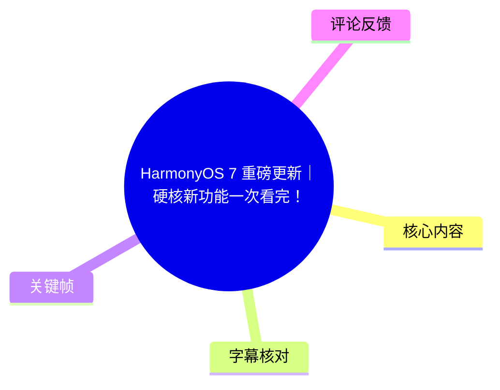
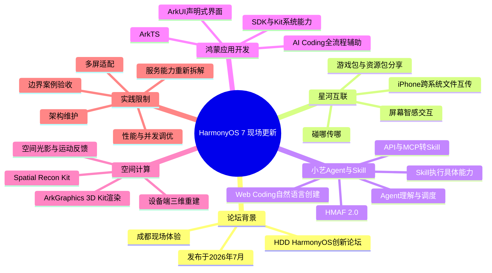
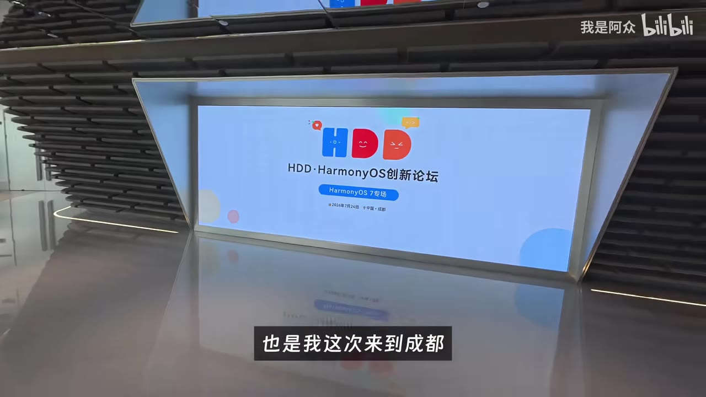
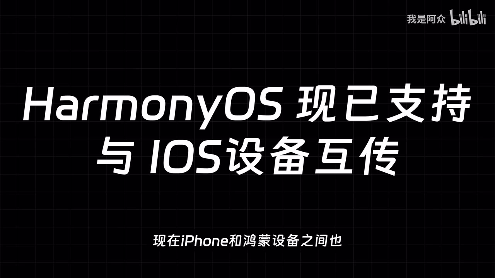
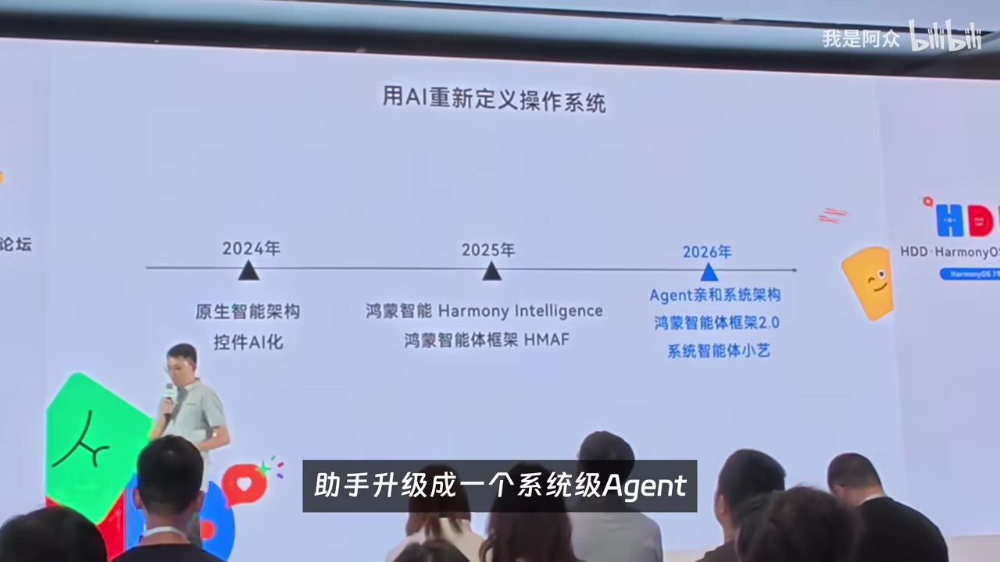

# HarmonyOS 7 重磅更新｜硬核新功能一次看完！

> 来源：[Bilibili 视频](https://www.bilibili.com/video/BV1z23p68EpM)<br>
> UP 主：我是阿众｜发布时间：2026-07-30｜视频时长：08:10｜分辨率：3840×2160  
> 视频场景：UP 主在成都 HDD·HarmonyOS 创新论坛现场体验并采访开发者。本文仅整理视频及所给素材中出现的内容，不将演示或评论延伸为已独立验证的产品承诺。

## 小结

视频围绕 HarmonyOS 7 在 HDD·HarmonyOS 创新论坛上展示的能力展开，重点不是单一系统界面的更新，而是设备互联、系统级智能体、AI 辅助开发与空间计算四条技术线如何共同服务于“设备—系统—应用”的联动。

首先，**鸿蒙星河互联**展示了“屏幕智感交互”：手机向平板传送照片等内容时，不只是完成文件传输，还可让发送端识别“传什么”、接收端识别“放哪里”，使内容落到平板文档中的目标位置。视频还称其支持碰一碰分享游戏安装包、资源包，以及 iPhone 与鸿蒙设备之间的跨系统文件互传。

其次，**小艺 Agent 与 Skill**采用“系统级 Agent + 可调用原子能力”的分层：小艺负责理解用户意图、拆解任务和寻找服务；Skill 则执行拍照、定位、搜索、创建备忘录等具体操作。开发者可把 API、MCP 或现有应用功能转换为 Skill，也可在小艺开放平台通过自然语言创建 Skill。

对开发者而言，视频给出的核心信息是：鸿蒙应用以 ArkTS、ArkUI、HarmonyOS SDK 和各类 Kit 为基础；AI Coding 则覆盖工程创建、代码生成、修改、编译、调试和设备运行等环节。它能显著降低原型起点，但不能取代业务建模、交互设计、边界条件验收、屏幕适配、性能调优和长期架构维护。

最后，视频介绍了空间计算方向：借助 Spatial Recon Kit，可围绕物体拍摄并在设备端三维重建；再通过 ArkGraphics 3D Kit 在应用内实时渲染和自由视角浏览。视频将其定位为向开发者开放空间理解、三维重建与渲染能力，而不只是视觉特效。

**时效与边界：**本片发布于 2026 年 7 月，内容是论坛现场演示和受访开发者经验，所提功能的实际可用地区、机型、系统版本、开发者资质、上架规则及跨系统互传条件，视频没有逐项给出。涉及“小艺”“Skill”“Spatial Recon Kit”“ArkGraphics 3D Kit”等名称，本文已依据上下文尽量校正 ASR 转写，但具体接口和正式命名仍应以鸿蒙开发者官方资料为准。

## 思维导图





## 目录

- [背景：论坛现场与视频范围](#背景论坛现场与视频范围)
- [星河互联：从文件传输到位置感知交互](#星河互联从文件传输到位置感知交互)
- [小艺 Agent 与 Skill：意图理解和服务执行的分层](#小艺-agent-与-skill意图理解和服务执行的分层)
- [从提示词创建 Skill 的现场流程](#从提示词创建-skill-的现场流程)
- [鸿蒙应用与 AI Coding 的开发栈](#鸿蒙应用与-ai-coding-的开发栈)
- [空间计算：设备端重建与三维渲染](#空间计算设备端重建与三维渲染)
- [开发者访谈：从应用功能到 Agent 服务](#开发者访谈从应用功能到-agent-服务)
- [实践经验、限制与时效性](#实践经验限制与时效性)
- [字幕比对](#字幕比对)
- [评论分析](#评论分析)
- [处理记录](#处理记录)

## [背景：论坛现场与视频范围](https://www.bilibili.com/video/BV1z23p68EpM?t=23)

视频前约 23 秒为音乐片段；本次 ASR 在 00:00:23.220 处开始识别到口播。UP 主以“把手机照片传到平板文档”为问题切入，随后说明自己在成都参加 **HDD·HarmonyOS 创新论坛**，并体验到了 HarmonyOS 7 的设备互联、智能体、AI Coding 和空间计算能力。



> 图：该关键帧展示“HDD·HarmonyOS 创新论坛”会场及“HarmonyOS 7 专场”信息，可用于确认视频内容来源于线下论坛，而非纯粹的后期概念演示。

视频的叙事顺序为：

1. 用“照片从手机放入平板文档”的多步骤操作说明传统跨设备流程的摩擦。
2. 展示星河互联的屏幕智感交互及跨设备、跨系统互传。
3. 介绍基于 HMAF 2.0 的小艺 Agent 与 Skill。
4. 以 CodeLabs 现场创建“探店达人”Skill 为例说明低代码/自然语言创建流程。
5. 介绍 ArkTS、ArkUI、AI Coding 和空间计算工具链。
6. 采访已有鸿蒙开发经验的开发者，补充真实开发中的工程限制。

## [星河互联：从文件传输到位置感知交互](https://www.bilibili.com/video/BV1z23p68EpM?t=25)

### [传统照片插入文档的步骤问题](https://www.bilibili.com/video/BV1z23p68EpM?t=23)

视频以一个具体场景说明传统操作的步骤数：

1. 在手机中找到照片；
2. 点击分享；
3. 选择平板；
4. 等待图片传输；
5. 在平板打开文档；
6. 找到插入位置；
7. 插入图片并重新排版。

UP 主概括为前后至少“六七步”。这个说法是视频中的体验性描述，不是对所有设备、应用或文档软件的通用测量。

### [屏幕智感交互：“碰哪传哪”](https://www.bilibili.com/video/BV1z23p68EpM?t=48)

HarmonyOS 7 在视频中展示的做法是：选中手机照片后，将手机轻触平板文档的目标位置，图片可精准落到相应位置。其与普通“碰一碰分享”的关键区别，据视频所述，在于两端都获取触碰位置：

- **手机端**知道需要传送的内容；
- **平板端**知道内容应进入的位置；
- 接入能力并结合触点坐标与业务逻辑后，可将照片、笔刷、图层等内容插入用户指定位置。


> 图：画面中的演示页直接写有“屏幕智感交互”，并显示手机与平板的协同操作；它是理解“不是仅传文件、而是携带落点语义”的关键视觉证据。

视频提到开发者可通过“CRK 的接入分享能力”结合触点坐标实现该交互。由于 ASR 对该缩写的识别不稳定，且给定素材未提供其全称、SDK 版本、接口名称或权限要求，不能据此推导具体接入代码。

### [互传范围与协同玩法](https://www.bilibili.com/video/BV1z23p68EpM?t=48)

除“碰哪传哪”外，视频还列举三项能力或场景：

| 视频陈述 | 可能解决的问题 | 素材未提供的条件 |
| --- | --- | --- |
| 碰一碰分享游戏安装包、资源包 | 减少线下共同游玩前的资源准备步骤 | 支持的游戏、包体格式、传输安全机制 |
| 两台设备建立协同，用于游戏组队、线下社交互动 | 将“发现/连接”纳入近场交互 | 发现范围、网络依赖、账号和隐私要求 |
| iPhone 与鸿蒙设备跨系统文件互传 | 降低不同生态设备间的文件交换障碍 | 支持的 iOS 版本、文件类型、文件大小和网络条件 |



> 图：关键帧以大字标出“HarmonyOS 现已支持与 iOS 设备互传”，对应视频约 01:00 的跨系统互传陈述，便于区分“文件互传”与前述“位置感知插入”的不同层次。

UP 主的总结是：星河互联的升级不只是让设备“连上”，而是让内容在不同设备与系统之间流动得更自然。这是作者对现场能力的概括性判断；其在不同应用中的实际连贯程度仍取决于系统和应用是否接入。

## [小艺 Agent 与 Skill：意图理解和服务执行的分层](https://www.bilibili.com/video/BV1z23p68EpM?t=73)

视频将星河互联的“内容流动”与小艺 Agent、Skill 的“需求—服务连接”并列介绍。

### [HMAF 2.0 下的角色分工](https://www.bilibili.com/video/BV1z23p68EpM?t=73)

据视频，HMAF 2.0 即“鸿蒙智能体框架”2.0，小艺从传统语音助手升级为系统级 Agent。视频给出的职责分层如下：

| 层级 | 视频中的职责 | 示例 |
| --- | --- | --- |
| 小艺 Agent | 理解用户意图、分解任务、调度合适服务 | 听懂用户要完成什么，再寻找可执行服务 |
| Skill | 被调用的具体能力、完成某一项任务 | 拍照、定位、联网搜索、创建备忘录 |



> 图：演示页以时间线展示 2024 年原生智能架构、2025 年鸿蒙智能与 HMAF、2026 年 Agent 和系统架构，并出现“系统智能体小艺”字样，有助于理解视频为何将小艺定位为系统级 Agent。

这里的关键不是“应用是否拥有一个完整聊天机器人”，而是应用能力是否能够被拆成被系统发现、理解和调用的服务单元。视频认为，这使应用能力不必等待用户主动打开 App 后才可使用。

### [三种接入或创建路径](https://www.bilibili.com/video/BV1z23p68EpM?t=97)

视频梳理了开发者把能力接入小艺生态的三条路径：

1. **已有完整智能体：**可通过语音侧或端侧 A2A 接入小艺。
2. **已有单项服务：**可将已有 API 或 MCP 转换为 Skill。
3. **只有初步想法：**可使用小艺开放平台的 Web Coding，通过自然语言从零生成一个 Skill。

其中，“A2A”“MCP”“Web Coding”均为视频口播出现的术语；素材未提供它们的协议细节、鉴权方式、平台入口 URL 或支持范围。因此，本文只记录其作为视频所称的接入方向，而不把它们等同于已经公开、无门槛的通用开发接口。

## [从提示词创建 Skill 的现场流程](https://www.bilibili.com/video/BV1z23p68EpM?t=121)

### [CodeLabs 案例：探店达人 Skill](https://www.bilibili.com/video/BV1z23p68EpM?t=121)

UP 主在 CodeLabs 环节创建了一个“探店达人”的 Skill。视频中的流程非常简化，适合理解从需求到可演示能力的路径：

1. 在平台中写入提示词；
2. 回车提交；
3. 等待一段时间，平台生成 Skill；
4. 在登录**同一华为账号**的手机上打开小艺 App；
5. 选择刚创建的 Skill；
6. 向其提供某个门店照片；
7. Skill 基于照片生成一篇“种草文案”。

视频明确说明，为了演示方便，该 Skill 功能较简单。因此，这一案例只能证明现场展示了“提示词创建 + 手机上调用”的链路，不能证明其对复杂生产需求已具备完整交付能力。

### [Skill 的能力来源、调试与发布](https://www.bilibili.com/video/BV1z23p68EpM?t=144)

根据视频介绍，完整的 Skill 可调用的系统或第三方服务包括：

- 相机；
- 定位；
- 日历；
- 支付；
- 通知；
- 以及其他系统和第三方服务。

视频同时给出从开发到分发的流程：

```text
已有 API / MCP / 应用内功能
            ↓
        转换为 Skill
            ↓
   小艺开放平台内调试
            ↓
         真机测试
            ↓
      质量与安全检测
            ↓
       发布至 Skill 广场
```

这里有两个不可忽略的前提：

- 视频确实提到了“质量和安全检测”，说明生成或接入后并非直接无审核发布；
- 但未说明审核标准、数据合规要求、上线周期、支付与通知等敏感能力的权限控制，不能据此假定任何开发者均可调用所有能力。

## [鸿蒙应用与 AI Coding 的开发栈](https://www.bilibili.com/video/BV1z23p68EpM?t=192)

### [ArkTS、ArkUI、SDK 与 Kit 的位置](https://www.bilibili.com/video/BV1z23p68EpM?t=192)

视频将鸿蒙应用的基础开发结构概括为：

- **ArkTS：**主要编程语言；语法与 TypeScript 接近，并强化静态类型检查，以便在编译阶段提前发现一类错误。
- **ArkUI：**以声明式语法构建应用界面，避免开发者手动控制每次页面更新。
- **HarmonyOS SDK 与各类 Kit：**提供标准库和系统能力入口，视频举例包括相机、设备互联等能力。

这一段可以理解为两层关系：

| 问题 | 视频给出的对应技术 |
| --- | --- |
| 鸿蒙应用“怎么开发” | ArkTS、ArkUI、SDK、Kit |
| 开发过程“如何变快、变连续、更易上手” | AI Coding |

视频未提供 ArkTS 的版本、具体类型规则，亦未展示 ArkUI 代码，因此不能据此输出可运行示例或断言特定 API 的名称。

### [AI Coding 覆盖的开发环节](https://www.bilibili.com/video/BV1z23p68EpM?t=216)

视频强调，AI Coding 不只是“补全几行代码”，还可延展到：

1. 工程创建；
2. 代码生成；
3. 工程修改；
4. 编译；
5. 调试；
6. 设备运行。

在工具选择上，视频称鸿蒙提供一站式开发环境，也支持插件和第三方开发工具，使开发者能够保留熟悉的编辑器和 AI 工作流。

这代表视频提倡的并非完全替换原有工具，而是让 AI 参与更长的开发链路。但“支持第三方工具”并不等于任何编辑器、插件或模型都能无条件完成完整链路；兼容范围在给定素材中没有展开。

## [空间计算：设备端重建与三维渲染](https://www.bilibili.com/video/BV1z23p68EpM?t=240)

视频将空间计算分成界面交互反馈和三维内容生产两部分。

### [空间感界面反馈](https://www.bilibili.com/video/BV1z23p68EpM?t=240)

在点击鼠标、晃动空间或拖动卡片时，界面可根据用户操作产生更具空间感的光影和运动反馈。视频将其作为空间计算的直观体验，但没有给出帧率、延迟、输入设备适配范围或性能开销数据。

### [从拍摄到三维浏览的链路](https://www.bilibili.com/video/BV1z23p68EpM?t=240)

视频描述的三维处理流程如下：

```text
围绕实体物体拍摄
        ↓
Spatial Recon Kit
        ↓
设备端完成三维重建
        ↓
ArkGraphics 3D Kit
        ↓
应用内实时渲染
        ↓
自由视角浏览
```

UP 主的判断是，这部分不只是增加“炫酷 3D 效果”，而是将空间理解、三维重建和渲染能力开放给开发者。需要注意的是，视频没有展示重建精度、拍摄张数、支持对象材质、模型格式、设备性能要求或导出能力；这些会直接影响它在电商、教育、文博、工业等具体领域的实际适用性。

## [开发者访谈：从应用功能到 Agent 服务](https://www.bilibili.com/video/BV1z23p68EpM?t=264)

### [“变了么”开发者：用多个 Skill 串起业务过程](https://www.bilibili.com/video/BV1z23p68EpM?t=299)

视频采访“变了么”App 开发者时，对方描述了一个围绕检测记录的设想：用户向小艺表达需求后，可通过不同 Skill 组合完成记录、调用相机、图像自动识别、分析报告读取等步骤。

受访者表达的关键点包括：

- 可把原来需要在 App 内手动完成的多步操作拆为多个 Skill；
- 小艺可作为入口，减少“先打开软件、再逐项操作”的流程；
- 开发者正在制作的相关能力被其称作 Agent。

在随后演示中，画面中出现“变了么”入口与接入小艺 Agent 的智能体。用户可询问近期相关情况，并继续追问原因，由智能体给出分析。

这一案例是受访者对其产品能力的说明，不构成对自动识别准确性、报告分析可靠性或医疗/检测结论有效性的独立背书。视频也未提供所涉业务的具体数据来源、隐私处理和免责声明。

### [灵犀单词开发者：AI 生成后的工程工作仍然存在](https://www.bilibili.com/video/BV1z23p68EpM?t=375)

灵犀单词 AI 开发者陈思在访谈中给出更具工程性的提醒：AI 能“干很多活”，但开发者仍要补齐和验收许多部分。

其列出的主要工作有：

| 工程事项 | 为什么仍需开发者处理 |
| --- | --- |
| 边界 Case 检测与验收 | 生成结果未必覆盖异常输入和业务分支 |
| 不同屏幕适配 | 界面在多种尺寸与设备状态下需要人工验证 |
| 架构调整 | AI 生成的结构可能与既有系统、代码架构不一致 |
| 长期维护 | 项目不是一次性原型，需要保留可演进性 |
| 性能和并发调优 | AI 不充分了解真实业务使用量、并发与数据特征 |
| 场景化测试 | 需根据实际业务数据调试、测试、修正 |

这是本片最重要的实践边界之一：AI Coding 可以缩短从想法到首个版本的距离，但不能自动保证产品稳定、可维护和适配真实业务。

### [CodeLabs 参与者：学习动机](https://www.bilibili.com/video/BV1z23p68EpM?t=450)

一位刚参加 CodeLabs 的开发者表示，自己认为鸿蒙是未来趋势，因此希望学习并成为鸿蒙开发者生态的一员。这是个人职业判断和学习动机，不应视为行业趋势的量化证据。

## [实践经验、限制与时效性](https://www.bilibili.com/video/BV1z23p68EpM?t=450)

### [可迁移的产品与开发方法](https://www.bilibili.com/video/BV1z23p68EpM?t=450)

从全片案例可以提炼出三条方法论：

1. **以用户最终动作而非 App 页面划分能力。**  
   星河互联中的“把图片放到文档某处”，以及 Skill 中的“完成一项服务”，都围绕用户任务而不是传统页面层级设计。

2. **将复杂应用拆为可理解、可调用、可组合的核心服务。**  
   视频结尾明确指出，把 App 变为 Skill 并不是把原有功能直接搬过去，而是要重新拆解其中最核心的服务，使 Agent 能理解并调用。

3. **把 AI 用于加速首版，而以工程流程保证交付。**  
   AI Coding 可覆盖建工程、生成、修改、编译和调试，但生产级服务仍依赖业务规则、交互设计、异常处理、测试、性能控制与持续维护。

### [视频未解决或未充分展开的问题](https://www.bilibili.com/video/BV1z23p68EpM?t=474)

以下事项对落地很重要，但给定视频素材没有提供答案：

- “屏幕智感交互”支持哪些设备组合、应用类别和内容格式；
- iPhone 与鸿蒙设备互传的系统版本、配对方式、文件限制和网络依赖；
- Skill 接入 API、MCP、A2A 时的身份认证、授权和数据隔离机制；
- Skill 广场的审核标准、发布门槛、地域开放范围与商业化规则；
- AI Coding 对既有工程的修改可控性、代码质量、测试覆盖与许可证风险；
- 设备端三维重建的精度、速度、设备要求、模型数据归属及隐私策略；
- 智能体在涉及相机、定位、日历、支付、通知时的最小权限与用户确认机制。

### [时效性说明](https://www.bilibili.com/video/BV1z23p68EpM?t=474)

视频发布日期为 **2026 年 7 月 30 日**，且核心信息来自论坛演示。系统版本、开放平台能力、名称、支持机型、审核机制和跨系统兼容性都可能后续调整。若要据此开发或采购，应以当时的 HarmonyOS 开发者官网、SDK 文档、设备支持列表和服务协议为最终依据。

## [字幕比对](https://www.bilibili.com/video/BV1z23p68EpM?t=23)

| 字幕来源 | 完整性 | 专有名词 | 时间轴 | 主要问题 |
| --- | --- | --- | --- | --- |
| Bilibili 站内字幕 `p01-ai-zh.srt` | 不适用于本视频口播内容 | 不含 HarmonyOS、Agent、Skill 等主题术语 | 覆盖约 00:00:02.920—00:04:35.180 | 内容为歌曲《如果你也听说》歌词，与视频实际科技口播不对应；且未覆盖后半段 |
| 本次 ASR `large-v3-turbo` | 较高：22 段、识别语音约 432.76 秒、覆盖率 88.42% | 存在较多同音/英文术语误识别，但上下文可校正 | 有真实时间戳，首段 00:00:23.220，末段 00:08:06.140；00:04:40.960—00:04:59.470 有 18.51 秒大间隔 | 分段过长且首段时间容纳文本过多；“HarmonyOS”“小艺”“Skill”“ArkTS”“ArkUI”等被多次误转写 |

### 字幕选择与校正原则

最终正文以**本次 ASR 时间戳**为章节定位依据，以视频元数据、关键帧画面和上下文对 ASR 专名作有限校正；不采用站内字幕的歌词文本作为正文事实来源。

本次 ASR 诊断未标记 `noAudioStream=true`，并确认音频时长约 489.45 秒、语言识别为中文（置信度 0.998）。因此，源视频有音轨；站内字幕失配并不代表视频无音频。

结合上下文与关键帧，正文中作出的主要校正包括：

| ASR 常见误识别 | 正文采用写法 | 校正依据 |
| --- | --- | --- |
| HarmoryOS7、鸪蒙、鸛蒙 | HarmonyOS 7 | 视频标题、元数据、会场画面 |
| 星沪互莲、星河互莲 | 鸿蒙星河互联 | 视频简介与连续上下文 |
| 小E、小异 | 小艺 | 视频简介中的“小艺 Agent 与 Skill” |
| Scale、Scales | Skill / Skills | 视频主题与“可被调用的具体能力”上下文 |
| HMAF 2.0 | HMAF 2.0 鸿蒙智能体框架 | ASR 连续口播与现场演进页 |
| ArcTS、Arc UI | ArkTS、ArkUI | 鸿蒙开发语境；仅作术语拼写校正 |
| Spacial Recon Kit | Spatial Recon Kit | 英文术语近音识别校正 |
| Arc Graphics 3D Kit | ArkGraphics 3D Kit | 英文术语近音识别校正 |

其中，最后两项 Kit 的精确官方大小写、是否存在空格或品牌化写法，给定素材无法完全验证；本文保留最接近视频语境的写法，并建议查阅官方文档复核。

## [评论分析](https://www.bilibili.com/video/BV1z23p68EpM?t=48)

仅处理可获取的热评前三条，评论代表个人观点，不作为已验证事实。

1. **SinoEthan｜228 赞**  
   > “b站触控很不灵敏 评论点赞不跟手”

   - 观点：评论者对 Bilibili 自身触控响应体验不满。
   - 与视频的关联：该评论从视频讨论的“触控/交互体验”延伸到 B 站客户端，不直接评价 HarmonyOS 7 功能。
   - 信息价值与可信度：反映单一用户感受，没有设备型号、系统版本、网络条件或复现步骤，无法判断是否为普遍问题。

2. **球哥解说｜15 赞**  
   > “多年果子用户，评论区还能吹Airdrop的？给爷整笑了[藏狐]”

   - 观点：评论者质疑或嘲讽围绕 AirDrop 的比较性讨论。
   - 与视频的关联：视频确实提到 iPhone 与鸿蒙设备文件互传，容易引出对 AirDrop 的横向比较。
   - 信息价值与可信度：该评论没有说明其比较的功能维度，例如速度、稳定性、跨平台性、安全性或支持范围；不能从中得出 HarmonyOS 互传优于或劣于 AirDrop 的结论。

3. **风落天涯｜50 赞**  
   > “自己有才是真的有！自己强才是真的强！为中国制造点赞！为华为点赞！”

   - 观点：表达对国产制造与华为的支持。
   - 与视频的关联：属于对鸿蒙生态和华为品牌的价值认同。
   - 信息价值与可信度：是情感支持，不提供对功能可用性、开发体验或性能的可核验补充信息。

## [处理记录](https://www.bilibili.com/video/BV1z23p68EpM?t=23)

- **Worker ID：**`worker-mrj0wjed-b0c290ad`
- **模型：**`gpt-5.6-terra`
- **依据素材与工具产物：**
  - 视频元数据 `info.json`；
  - 合并视频 `merged.mp4`；
  - 音频 `audio/audio.wav`；
  - 本次 ASR 结果 `asr/asr-result.json`、`asr/transcript.srt`、`asr/asr-transcript.txt`；
  - 站内字幕 `subtitles/p01-ai-zh.srt`；
  - 关键帧目录 `frames/`；
  - 热评数据 `comments/comments.json`。
- **字幕选择：**检查了站内字幕与本次 ASR。站内字幕为歌曲歌词且与实际科技口播失配，未作为正文转写来源；选用带时间戳的本次 ASR 进行定位，并依照视频标题、描述、上下文和关键帧校正明显术语误识别。
- **时间轴依据：**章节秒数优先取自 ASR SRT/ASR 分段的真实起止时间，如 23 秒、48 秒、73 秒、121 秒、192 秒、240 秒、299 秒、375 秒、450 秒、474 秒；未按文字顺序臆测位置。
- **关键帧选择依据：**
  - `frames/frame-001.jpg`：包含 HDD·HarmonyOS 创新论坛与 HarmonyOS 7 专场标识，用于确认现场背景；
  - `frames/frame-002.jpg`：展示“屏幕智感交互”会场演示，用于支撑位置感知交互说明；
  - `frames/frame-003.jpg`：画面明确出现 HarmonyOS 与 iOS 设备互传文字，用于对应跨系统互传陈述；
  - `frames/frame-004.jpg`：展示小艺系统级 Agent 的演进时间线，用于解释 Agent 定位。
- **缓存清理：**给定素材未提供缓存清理日志或清理执行结果；因此不声称已清理，仅记录为**无法从现有素材确认**。
- **未解决问题：**
  - ASR 对英文专有名词及部分业务访谈存在误识别，本文仅作上下文可支持的最小校正；
  - 站内字幕与视频口播完全不匹配，无法用于交叉核对；
  - 未提供关键帧的逐帧时间戳，图片仅按其画面主题用于正文说明，不作为精确秒级定位证据；
  - 具体 SDK/API、适配设备、权限、审核与性能参数未在素材中出现，未作补写。

## 评论分析

- 热评 1：b站触控很不灵敏 评论点赞不跟手
- 热评 2：多年果子用户，评论区还能吹Airdrop的？给爷整笑了[藏狐]
- 热评 3：自己有才是真的有！ 自己强才是真的强！ 为中国制造点赞！ 为华为点赞！

以上内容是观众反馈摘录，只用于补充理解视频反响，不作为正文事实依据。
