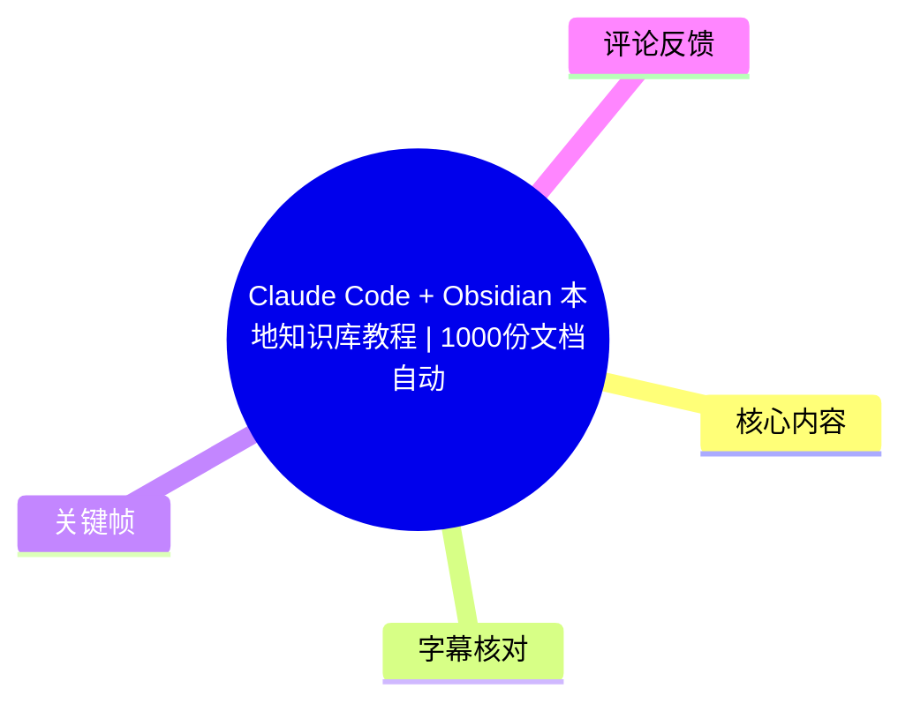
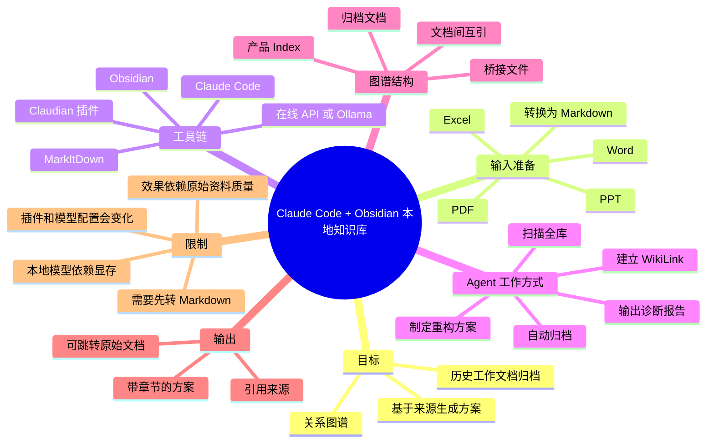
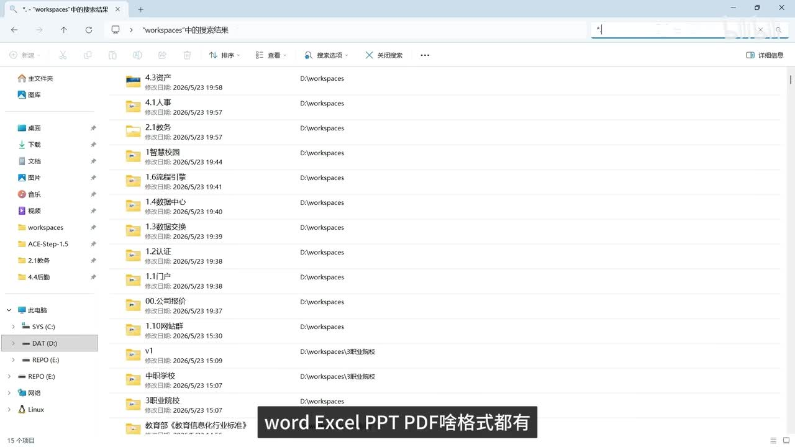
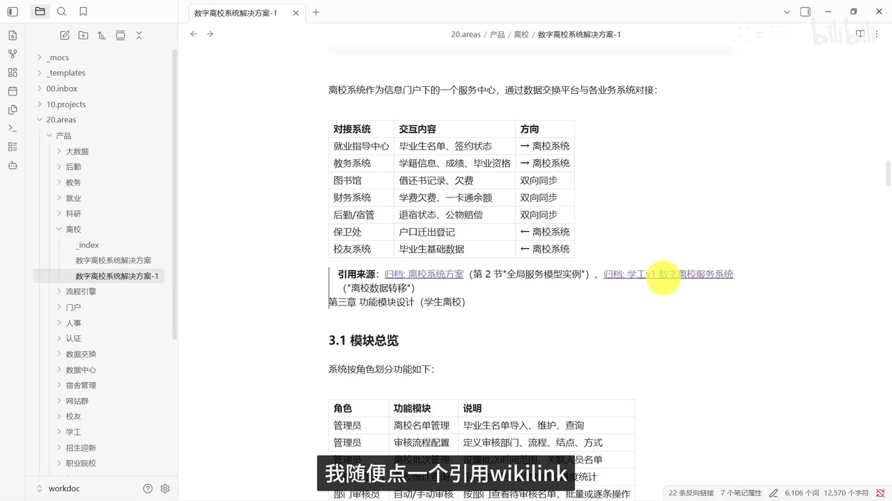
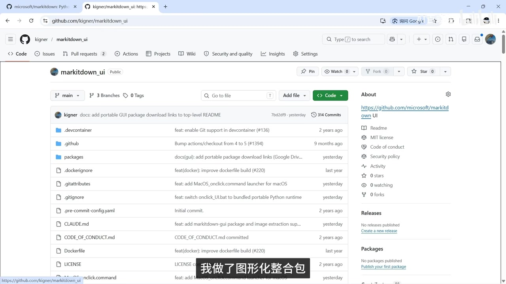
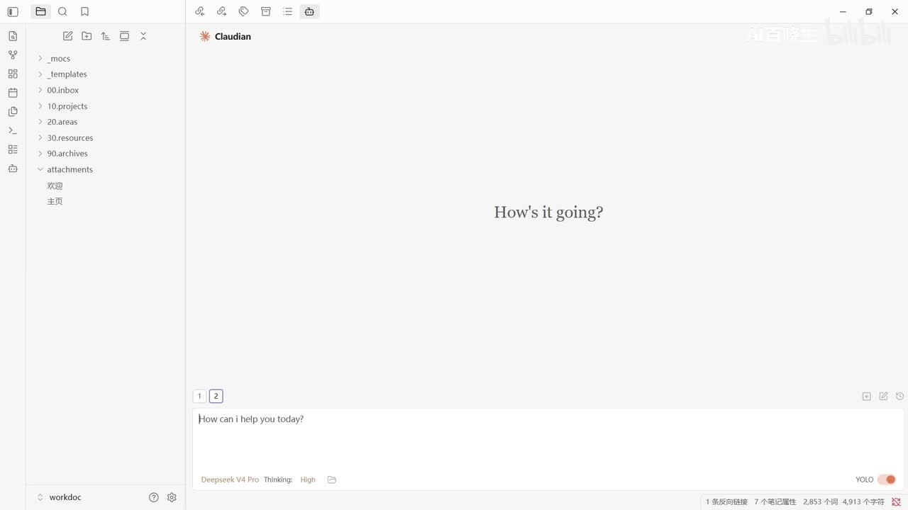

# Claude Code + Obsidian 本地知识库教程｜1000份文档自动归档，AI同事帮你写方案。

> 来源：[Bilibili 视频](https://www.bilibili.com/video/BV1c5G26YEf7)  
> UP 主：AI百晓生｜时长：8 分 06 秒｜合集：AIcode  
> 视频描述称：可将积累的 Word、Excel、PPT、PDF 等文档交给 Claude Code 与 Obsidian，完成 Markdown 转换、归档、关系图谱与基于来源的方案生成；相关笔记和整合包链接位于视频描述与置顶评论所指位置。

## 小结

视频演示的是一套面向**工作文档**的本地知识库工作流：先将 Word、Excel、PPT、PDF 等材料转换为 Markdown，再放入 Obsidian 仓库，通过 Claudian 插件接入 Claude Code 或兼容模型，使 Agent 能扫描、重构和关联文档。

它的核心价值不是“把文件放进 Obsidian”，而是让 Agent 在已有文档中检索相关材料、阅读核心文件、按预先建立的归档规则生成新方案，并在正文中保留可跳转回原始 Markdown 文件的 WikiLink 引用。视频案例中，Agent 从 12 份“离校系统”相关材料中识别并阅读了其中 8 份核心文档，约 3 分钟生成一份分为 7 个章节的方案。

知识图谱能否真正可用，关键在于**真实的链接结构**而非文件共存。视频展示了一个三层方案：产品 Index 索引文件 → 桥接文件 → 归档文档；同时让归档文档相互引用。演示中 Agent 创建了 25 个桥接文件，从而把此前在图谱中呈离散状态的文件连接起来。

流程包含五个逻辑环节：文档转 Markdown、安装 Claude Code、创建 Obsidian 仓库、安装并配置 Claudian、让 Agent 建立归档规则和关系网络。视频将前四项视为环境准备，强调每一步人工操作时间较短，但“30 多分钟跑完”“3 分钟出方案”等均是作者在其设备、文档规模与模型条件下的演示结果，不应理解为所有环境的保证时长。

隐私方面，视频给出将插件模型端从在线 API 切换为本地 Ollama 的路径，并称本地模型运行时文档数据不出本机；但这会转化为本地显存、模型下载、服务状态和配置正确性的要求。视频给出的示例是：**8GB 显存可运行量化 9B 参数模型**；这是演示者经验参数，不等同于对所有模型、量化格式或任务质量的通用结论。

适合对象是已有大量历史工作材料、需要按产品线或业务主题复用资料的人。学习笔记与科研论文管理也可借鉴，但视频没有完整展示元数据规范、版本控制、重复文档处理、权限隔离、备份恢复和大规模检索质量评估，因此在企业敏感数据场景中仍需先做小范围验证。

## 思维导图





## 目录

- [演示目标：从文档堆到可追溯方案](#演示目标从文档堆到可追溯方案)
- [案例结果：12 份候选材料与带引用方案](#案例结果12-份候选材料与带引用方案)
- [步骤一：将 Office 与 PDF 文件转换为 Markdown](#步骤一将-office-与-pdf-文件转换为-markdown)
- [步骤二至三：安装 Claude Code、建立 Obsidian 仓库](#步骤二至三安装-claude-code建立-obsidian-仓库)
- [步骤四：安装 Claudian 并接入模型](#步骤四安装-claudian-并接入模型)
- [步骤五：让 Agent 归档、诊断并创建成长型知识库](#步骤五让-agent-归档诊断并创建成长型知识库)
- [解决图谱离散问题：三层 WikiLink 架构](#解决图谱离散问题三层-wikilink-架构)
- [本地 Ollama 模型与隐私边界](#本地-ollama-模型与隐私边界)
- [适用范围、限制与时效性](#适用范围限制与时效性)
- [字幕比对](#字幕比对)
- [评论分析](#评论分析)
- [处理记录](#处理记录)

## [演示目标：从文档堆到可追溯方案](https://www.bilibili.com/video/BV1c5G26YEf7?t=29)

视频从作者积累的工作文档出发：资料规模超过 1,000 份，格式包括 Word、Excel、PPT、PDF；早期曾进行归类，随后逐渐变为随手存放，导致需要某一份文档时难以定位。

作者要解决的不是单纯文件搜索，而是三个连续问题：

1. **让异构办公文件可被知识库处理**：Obsidian 以 Markdown 为中心，原始 Office/PDF 文件需要先转换。
2. **让文件从“同处一库”变为“彼此关联”**：仅导入文件不会自动产生真实链接，图谱可能只是大量分散节点。
3. **让 Agent 基于库内内容产出新文档且可追溯**：生成方案中的章节应标记来源，点击引用可回到对应归档文档，避免将模型输出误当作无依据的内容。

作者将完整方案概括为“Claude Code + Obsidian”，并表示不需要编写 AI 代码；实际演示中还包括 MarkItDown、Claudian 插件以及在线或本地模型服务。标题与口播中的“30 分钟自动归档”应理解为该演示流程的作者经验，而不是软件的固定性能指标。



> 图：画面展示资源管理器中按业务名称排列的多个目录，是视频中“Word、Excel、PPT、PDF 等格式都有”的问题背景。它的价值在于说明输入不是统一格式、统一命名的笔记，而是积累型工作材料。

## [案例结果：12 份候选材料与带引用方案](https://www.bilibili.com/video/BV1c5G26YEf7?t=53)

作者先展示搭建完成后的效果，再解释具体搭建过程。现场输入的任务意图可整理为：

> 基于知识库中所有“离校系统”相关文档，编写一份完整的数字离校系统解决方案；每个章节标出引用来源。

根据视频口播，Agent 的处理结果包括：

- 在全库中找到 **12 份**与离校系统相关的文档；
- 逐份阅读后，选取其中 **8 份核心文档**作为方案依据；
- 按知识库已设定的归档规则写出新方案；
- 在不到 **3 分钟**内完成方案生成；
- 自动将新方案归档到对应产品目录；
- 同步更新该产品的索引页；
- 方案划分为 **7 个章节**；
- 每个章节标记内容来源，点击 WikiLink 可跳回对应原始归档文件。

视频特别强调“不是编的”，其可验证含义应限定为：演示界面中，新方案确实包含指向库内 Markdown 文件的链接，且点击链接可打开来源文件。链接存在不自动证明每一段内容都已被严格事实核验；实际使用时仍应检查引用是否真正支持该段论述、是否遗漏材料，以及生成的流程图和总结是否与来源一致。



> 图：画面展示 Obsidian 内的“数字离校系统解决方案”页面、目录树与“引用来源”链接。该画面直接对应视频的关键承诺：输出不是孤立文本，而应能回链到知识库内的归档材料。

## [步骤一：将 Office 与 PDF 文件转换为 Markdown](https://www.bilibili.com/video/BV1c5G26YEf7?t=102)

### 目的与工具

作者将第一步定义为把 Word、Excel、PPT、PDF 转为 Markdown，理由是 Obsidian 主要识别和组织 Markdown 内容。视频提到使用微软开源项目 **MarkItDown**，并称自己制作了图形化整合包；整合包下载入口被指向评论区置顶链接。

视频所示操作顺序：

1. 启动图形化工具；
2. 选择待转换文档所在目录；
3. 指定输出目录；
4. 点击开始转换；
5. 等待工具自动识别文件类型并转换。

作者口播称工具可识别文件类型，示例包括旧版 DOC 转 DOCX、PPT 转 PPTX；与目标无关的文件会跳过。这里应注意，视频未展示完整的转换日志、失败列表、图片/表格保真率或扫描版 PDF 的 OCR 结果，实际部署时应抽样核对转换结果。

### 转换后的检查建议

视频并未明确给出验收清单，但根据其后续依赖 Markdown、引用和关系图谱的流程，以下检查是必要的实践补充，而非视频中已展示的自动保证：

- 检查表格、标题层级、附件路径是否保留；
- 检查扫描 PDF 是否获得可检索正文；
- 排查同名文件生成后的冲突；
- 删除或隔离无关、过期、包含敏感信息的材料；
- 先保留原始文件备份，再将 Markdown 作为知识库处理副本；
- 对转换失败和内容为空的文件建立待处理清单。



> 图：画面展示名为 `markitdown_ui` 的代码仓库页面，右侧说明链接指向微软的 MarkItDown 项目。这有助于区分：视频提到的是 MarkItDown 及其图形化整合方式，而非 Obsidian 自带的 Office 文档转换功能。

## [步骤二至三：安装 Claude Code、建立 Obsidian 仓库](https://www.bilibili.com/video/BV1c5G26YEf7?t=151)

### 步骤二：安装 Claude Code

作者称，虽然名称是 Claude Code，但在本工作流中安装它的主要目的，是让 Obsidian 内的插件能够调用相关能力；完成安装后，不需要反复直接打开 Claude Code。视频称一条命令执行并回车即可，但素材没有提供该命令文本，因此不能在此补写具体安装命令。

这一点意味着 Claude Code 在此是插件背后的运行或接入环节，而用户的主要交互界面是 Obsidian 中的 Claudian。不同操作系统、Claude Code 版本、地区服务可用性和账户权限可能改变实际安装步骤。

### 步骤三：创建 Obsidian 仓库并导入转换结果

作者建议从 Obsidian 官网安装，采用默认安装即可。随后：

1. 打开 Obsidian；
2. 新建仓库，名称可自定；示例仓库名为 `WorkDOC`；
3. 选择本地磁盘路径保存仓库；
4. 将第一步转换完成的文件夹整体拖入仓库；
5. 等待 Obsidian 加载全部文档。

作者提醒，大量文件首次导入时 Obsidian 可能卡顿十几秒，不应在加载期间直接关闭程序。导入后，文件虽然存在于库中，但尚未建立关系；这正是下一步插件和 Agent 要解决的问题。



> 图：画面显示 Obsidian 的库目录和 Claudian 对话界面，底部可见模型选择区域。这说明后续操作以 Obsidian 仓库作为文件工作区、以插件面板作为 Agent 入口。

## [步骤四：安装 Claudian 并接入模型](https://www.bilibili.com/video/BV1c5G26YEf7?t=200)

视频中插件名在 ASR 中多次被误识别为“Cloudian”，但画面标题显示为 **Claudian**；本文统一按画面可辨识名称记为 Claudian。

### 插件安装路径

作者给出的 Obsidian 内操作为：

1. 进入设置；
2. 打开第三方插件相关设置；
3. 关闭安全模式；
4. 点击“浏览”；
5. 搜索 `Claudian`；
6. 安装并启用；
7. 将插件语言改为中文，便于后续使用。

关闭安全模式意味着允许加载社区插件，也意味着需要自行评估插件的代码安全、维护状态和权限范围。视频没有展示插件版本号、发布者身份、源码审计或权限清单。

### 在线模型配置

安装后，作者切换到插件中的 Claude Code/环境设置区域，在“接入模型”相关配置处填写模型连接方式。视频称其个人笔记列出了不同模型的接入写法，用户可复制粘贴；演示中使用了在线模型的 API Key，并提示需要替换成自己的已购买密钥。

素材中的 ASR 将具体名称错误识别为“DeepThick”等，关键帧能辨认出界面存在 DeepSeek 相关模型标签，但无法据此可靠确认具体型号、API 地址或参数。因此，不能将该视频当作某一特定在线模型的精确配置文档。

配置成功后，Obsidian 侧边栏会出现机器人图标，作者以此作为 Claude Code 已接入 Obsidian 的界面判断。

## [步骤五：让 Agent 归档、诊断并创建成长型知识库](https://www.bilibili.com/video/BV1c5G26YEf7?t=236)

环境完成后，作者向 Agent 提出建立关系索引和知识图谱的要求。可明确确认的任务意图是：

> 为仓库创建关系索引和知识图谱，并使其成为可持续增长的结构。

作者对“成长型”的解释是：以后新增文档时，系统能为其找到应放置的位置，减少手动归档。按照视频描述，Agent 的执行链路是：

1. 扫描整个仓库；
2. 遍历目录与文件；
3. 输出诊断报告；
4. 指出目录混乱、未归档文档等问题；
5. 自行提出重构方案；
6. 作者查看部分内容并确认；
7. Agent 执行命名、归档、索引建立等工作；
8. 在数分钟内完成重构。

这里体现的 Agent 能力是“读库—诊断—规划—执行”的连续工作流，而非仅根据单次提问返回文本。作者将其与普通文档问答工具区别开来：后者通常回答已有内容，前者在演示中还会执行文件组织与链接建设动作。

不过，自动重构本身会带来风险：移动文件、改名和批量写入链接可能破坏既有路径或误分类。视频未展示撤销策略、Git 版本管理、变更日志或人工审批规则。对于正式资料库，应在副本上试运行，并在批量写入前备份。

## [解决图谱离散问题：三层 WikiLink 架构](https://www.bilibili.com/video/BV1c5G26YEf7?t=284)

作者在初次查看图谱时发现，虽然数百份归档文档已经出现在图中，但大部分只是**离散节点**：它们被放进同一个仓库，却没有真实的双向或引用链接。这意味着可视化图谱存在，但关系信息不足，无法据此有效导航或推理。

作者将问题告知 Agent 后，视频描述 Agent 提出使用真实 WikiLink 的方案。由于数百条链接不适合手工逐条添加，Agent 建立了如下三级结构：

```text
产品 Index 索引文件
        ↓
归档桥接文件
        ↓
该产品线下的全部归档文档
        ↓
归档文档之间的相互引用
```

具体做法：

- 每个产品线创建一个桥接文件；
- 桥接文件放在归档桥接目录；
- 桥接文件内集中放入指向该产品线所有归档文件的 WikiLink；
- 产品线的 `Index` 索引文件只链接到桥接文件；
- 归档文档之间再建立相互引用；
- 视频演示中，Agent 一次创建了 **25 个桥接文件**。

作者认为这一三层链路打通后，整个知识库便连成一张网：从产品索引可进入桥接文件，再进入相关归档材料，并从任意节点跳转到关联文档。需要区分的是，这种结构提升的是**导航性和图谱连通性**；链接数量增加不必然等于语义关联完全正确。桥接文件若只把同目录文件全量链接，也可能产生“结构连接存在、业务关系不强”的边。

## [本地 Ollama 模型与隐私边界](https://www.bilibili.com/video/BV1c5G26YEf7?t=356)

对于不希望文档内容经 API 发送至外部服务的用户，作者给出将 Claudian 模型接入改为本地 **Ollama** 的方案。作者的表述是：模型在本机运行时，数据“不出本机”。

### 视频中的本地部署路径

1. 从 Ollama 官网下载安装程序；
2. 按默认方式安装；
3. 在 Ollama 的模型界面选择下载模型；
4. 作者提醒不要选择带“云”图标、需要订阅的项目，而选择带下载标识、可下载到本地的模型；
5. 如界面中没有目标模型，可在官网模型页面手动获取；
6. 作者以“千问 3.5”为例，依据显卡能力选取模型；
7. 示例硬件经验：**8GB 显存可跑量化 9B 参数模型**；
8. 复制模型页面提供的命令，在新的命令行窗口执行下载；
9. 下载后可关闭命令窗口和 Ollama 主窗口，但不要退出系统托盘中的 Ollama 服务；
10. 回到 Claudian 插件，填写本地 Ollama 的连接写法；
11. 将模型名称改为本机已下载的实际模型名；
12. 可在命令行执行 `ollama list` 查看已安装模型；
13. 若平时也使用 Claude Code，作者提示关闭“加载用户 Claude 设置”；
14. 通过对话测试正常响应，确认本地模型接通。

```bash
ollama list
```

> 视频明确展示和口播的命令只有 `ollama list`；模型下载命令被称为“复制它给的指令”，但素材未给出完整命令文本，因此本文不补写。

### 隐私与性能的真实边界

“本地 Ollama”可降低文档正文发送到第三方推理 API 的需要，但“数据一个字节都不出”是视频中的概括性说法，实际仍取决于以下配置：

- Claudian 是否完全指向本地端点；
- 是否仍启用了在线模型、云同步、遥测或外部插件；
- Obsidian 仓库是否位于同步盘；
- 模型文件下载阶段是否需要联网；
- 系统、杀毒、备份或网络代理是否读取或上传文件；
- 用户是否关闭了可能加载远端 Claude 配置的选项。

因此，涉及企业机密、个人隐私或受监管数据时，应自行验证网络连接、插件行为、日志位置和本地磁盘加密策略，而不能只依据演示口播判断。

## [适用范围、限制与时效性](https://www.bilibili.com/video/BV1c5G26YEf7?t=439)

### 可迁移的经验

- **先统一载体，再谈知识库**：不同办公格式先转 Markdown，才便于后续索引、链接和文本处理。
- **目录结构不能替代关系结构**：文件放进同一个仓库并不代表图谱已建立；WikiLink 或其他明确关系是可导航图谱的基础。
- **生成内容应尽量带来源**：对于方案、报告、制度等工作输出，引用可降低“看似合理却无法追溯”的风险。
- **让 Agent 参与信息架构，而非只写文本**：扫描、诊断、提出重构方案、批量执行，是视频强调的工作流差异。
- **本地推理与在线 API 是不同取舍**：前者强化可控性和私密性，后者可能降低本地硬件门槛；两者都需要正确配置。

### 视频未充分验证或需谨慎对待的部分

| 项目 | 视频已展示/声称 | 尚需自行验证 |
| --- | --- | --- |
| 处理规模 | 1,000+ 份工作文档 | 大文件、图片 PDF、表格和复杂 PPT 的转换质量 |
| 方案生成 | 12 份候选文档、8 份核心材料、约 3 分钟出方案 | 引用完整性、事实正确性、遗漏和幻觉率 |
| 图谱重构 | 25 个桥接文件、图谱由离散变连通 | 链接语义是否准确、是否产生过度连接 |
| 自动归档 | Agent 可诊断并执行归类 | 错分、重命名、覆盖文件后的恢复机制 |
| 本地模型 | 8GB 显存跑量化 9B 的作者示例 | 实际速度、上下文长度、中文质量和硬件兼容性 |
| 无代码 | 作者称纯点击可跑通 | 首次安装、API 密钥、插件兼容与排障仍有技术门槛 |

### 时效性

本视频的发布元数据对应 2026 年 5 月，素材抓取于 2026 年 7 月。Claude Code、Obsidian、Claudian、MarkItDown、Ollama 和模型市场均处于快速变化状态；插件名称、设置入口、安装方式、模型可用性、收费政策、API 接口和显存需求都可能在观看后发生变化。视频中的“唯一不用写代码、不配数据库、纯点击可跑通”的判断是作者个人使用结论，不是对行业方案的永久性或排他性结论。

## 字幕比对

| 字幕来源 | 完整性 | 专有名词 | 时间轴 | 主要问题 |
| --- | --- | --- | --- | --- |
| Bilibili 站内字幕 `p01-ai-zh.srt` | 严重不完整且内容不匹配，仅覆盖约 00:00–01:02 | 与视频主题完全无关 | 时间码本身连续，但仅对应错误内容 | 内容为关于“享受当下”“人生如棋”的文案，无法反映本视频教程 |
| 本次 ASR 字幕 | 覆盖 00:29.090–07:56.190，语音覆盖约 443.23 秒，占全片约 91.39% | 存在明显音近误识别 | 具备可用时间戳 | 将 Claude Code、Claudian、Obsidian、MarkItDown、Ollama、WikiLink、DeepSeek 等多处识别错误；首 29 秒无语音转写 |

本次 ASR 诊断显示：语言为中文，置信度约 `0.9990`，启用 CUDA 与 `float16`，有时间戳；未标记 `noAudioStream=true`，因此源视频**存在音轨**，并非无音轨视频。ASR 首次语音出现在 `00:29.090`，末次语音结束于 `07:56.190`，诊断未发现大段异常语音空隙。

最终采用策略如下：

- **以本次 ASR 的时间轴为主**，因为它覆盖了教程主体且时间戳与视频总时长相符；
- **不采用站内字幕的正文内容**，因为其语义与视频画面、标题和 ASR 都明显不一致；
- 通过视频标题、关键帧画面与上下文对关键专有名词做谨慎校正：
  - ASR 中的“claw code / Cloud Code”校正为 **Claude Code**；
  - ASR 中的“overseeding / Obsidan”等校正为 **Obsidian**；
  - ASR 中的“Cloudian”根据界面画面校正为 **Claudian**；
  - ASR 中的“Markit档”校正为 **MarkItDown**；
  - ASR 中的“欧拉玛”校正为 **Ollama**；
  - ASR 中的“铽接”等校正为 **链接 / WikiLink**。
- 无法由素材可靠核实的在线模型具体型号、API URL 与下载命令，不作补全或推断。

## 评论分析

仅获取到 2 条热评，少于“热评前三条”的上限；以下只分析可获取内容，不将评论中的个人环境描述视为已验证事实。

1. **吃货小筑｜7 赞**  
   评论认为视频“没有跳步骤”，每一步都有用、信息密度高，并期待更多内容。该反馈与视频确实按“转换—安装—建库—插件—图谱—本地模型”顺序展开的结构相符，但属于观看体验评价，不能证明所有用户均可按相同步骤复现。

2. **幽影shadow｜6 赞**  
   评论者称自己已基本完成实操，但本地模型连接失败：下载后 `ollama list` 提示“不是内部或外部命令”，同时其描述中包含“deepseek 的脱机版本”“deepCore”“框架显示 Ollama”等不完全清晰的工具名。该现象至少提示本地部署的实际门槛：Ollama 命令可能未正确安装、未写入系统 PATH、终端未刷新环境变量，或安装的并非可提供 `ollama` CLI 的组件。  
   
   由于视频只要求使用 `ollama list` 检查模型，未具体讲解 PATH、服务端口、Windows 终端重启或多套本地框架冲突，所以这条评论不是对视频结论的否定，但构成了一个重要的实操缺口提示。排障时应优先确认：Ollama 是否安装成功、安装后是否重开终端、系统托盘服务是否启动、命令行是否能定位到 `ollama` 可执行文件，以及插件配置的模型名称是否与 `ollama list` 输出一致。

## 处理记录

- Worker ID：`worker-mrj0www4-e8d79408`
- 生成模型：`gpt-5.6-terra`
- 视频元数据：BV1c5G26YEf7；时长 486 秒；UP 主 AI百晓生。
- 使用素材工具结果：已提供音频提取结果、关键帧目录、ASR 时间轴字幕、站内字幕、视频元数据与热评数据；ASR 识别模型为 `medium`，CUDA / `float16`。
- 字幕选择：检查了站内 SRT 与本次 ASR。站内字幕内容与视频不符，未用于事实正文；以本次 ASR 时间轴为主，并依据关键帧、视频标题与语境校正可辨识专有名词。
- 关键帧选择依据：  
  - `frames/frame-001.jpg`：展示大量工作目录，支撑异构历史文档堆积的输入问题；  
  - `frames/frame-002.jpg`：展示 Obsidian 与 Claudian 对话入口，支撑插件作为交互界面的说明；  
  - `frames/frame-003.jpg`：展示方案正文和引用来源，支撑“带来源、可跳转”输出；  
  - `frames/frame-004.jpg`：展示 MarkItDown 图形化整合相关页面，支撑 Markdown 转换工具说明。  
- 评论处理：仅获取到 2 条热评，已全部分析；未虚构第 3 条评论。
- 缓存清理：素材中未提供缓存清理执行记录；本文不将其表述为已完成。
- 未解决问题：未提供 Claudian 的确切版本、在线模型具体配置、MarkItDown 转换日志、实际提示词全文、桥接文件模板、模型下载命令及 Agent 批量改写前后的文件清单；这些内容无法据现有素材补写。
