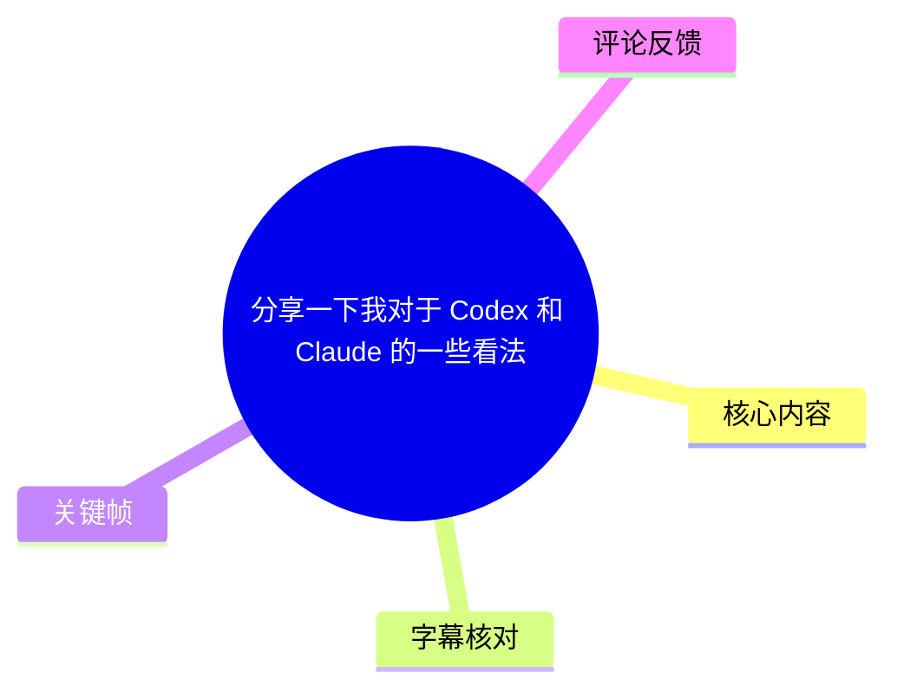
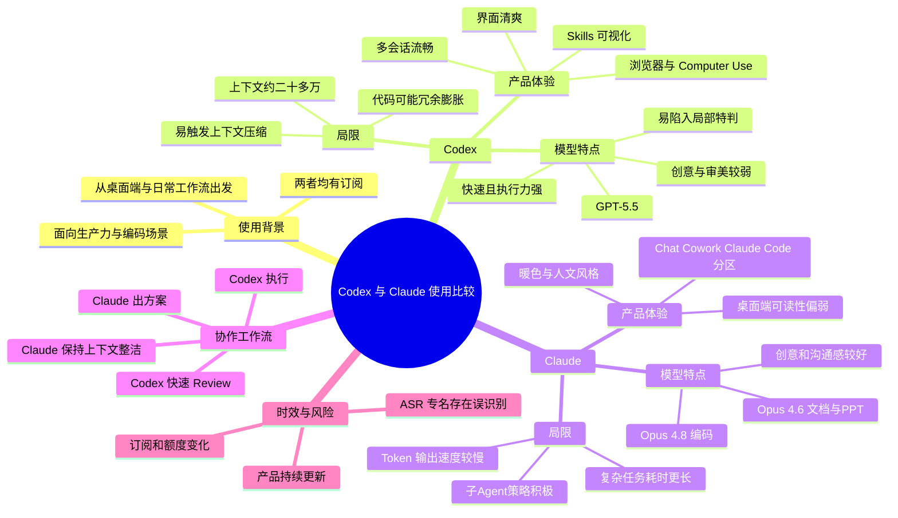
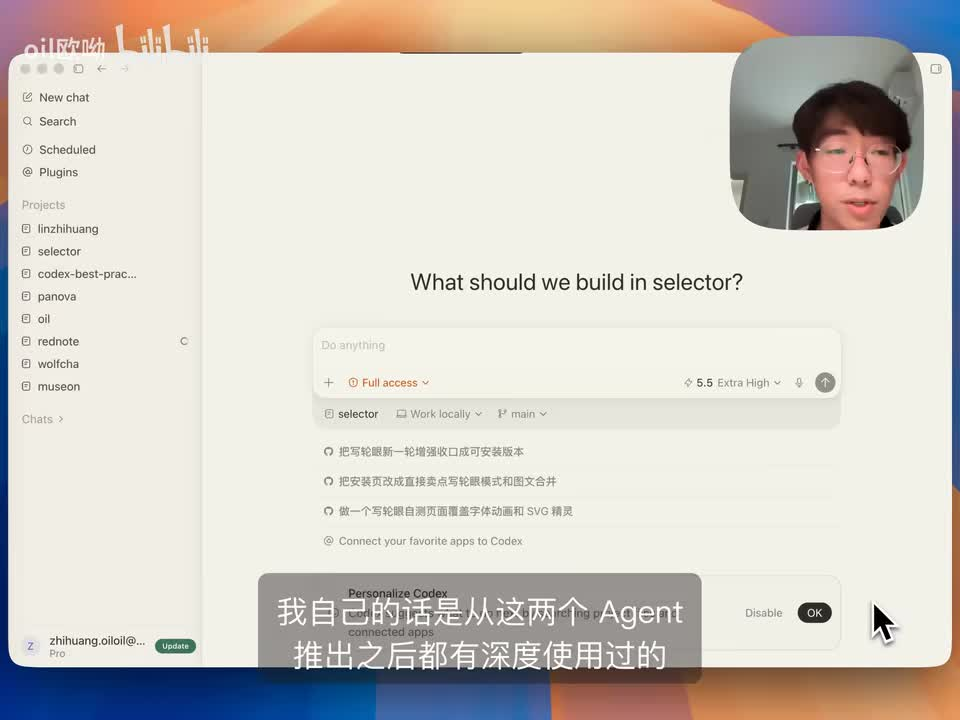
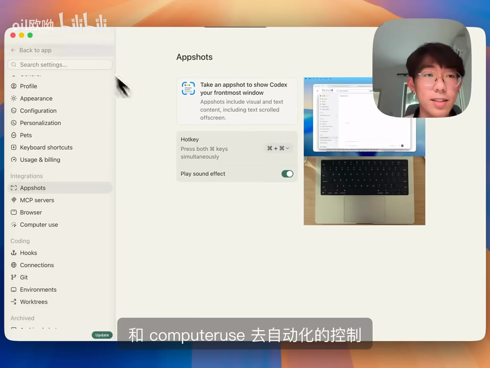
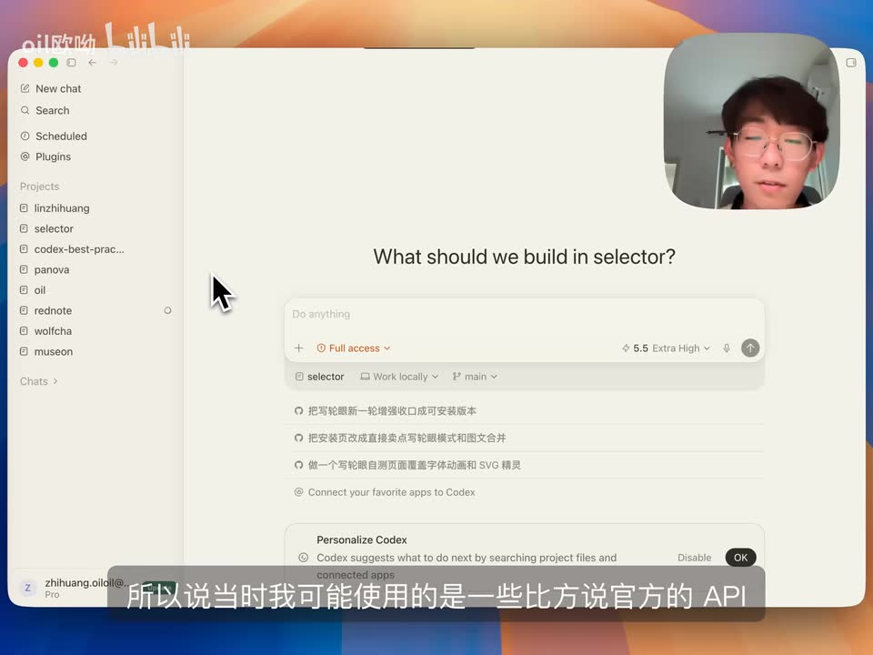

# 分享一下我对于 Codex 和 Claude 的一些看法

> 来源：[Bilibili 视频](https://www.bilibili.com/video/BV1677s6UErR)<br>
> UP 主：oil欧呦｜时长：16 分 21 秒｜标签：产品经理、交互设计、Agent、Codex、AI 工具、VibeCoding  
> 视频简介：UP 主基于对 Codex 与 Claude 的深度订阅和日常使用，比较两者的桌面端产品设计、模型体验及工作流。

## 小结

视频讨论的并非“Codex 和 Claude 哪个绝对更强”，而是两套 Agent 产品在**桌面端交互、模型性格、任务调度和日常协作方式**上的取向差异。UP 主的总判断是：若聚焦本地桌面 Agent 的流畅度、配置可视化、图像渲染和执行明确任务的效率，Codex 当前体验更完整；若聚焦创意、文档、沟通感、需求澄清及复杂任务的方案设计，Claude 更符合其偏好。

在产品层面，Codex 被评价为更清爽、更流畅、更接近“通用 Agent 入口”。视频特别提到其项目与 Skills 的可视化、内置插件、连接器、MCP、浏览器扩展、Computer Use、侧边栏继续当前上下文对话，以及图片可直接在对话中渲染等能力。UP 主也提及其桌面端早期性能很差，疑似存在严重内存泄漏；但在其当前使用中，多会话、切换和滚动已几乎无卡顿。

Claude 的桌面端则呈现另一种产品思路：视觉上偏暖色、人文和“艺术感”，功能上拆分为普通对话、面向非编程任务的 Cowork、以及 Claude Code。UP 主认可这种分区各有合理性，但认为 Claude 的桌面端可读性、上下文侧栏灵活性、Skills 可视化和配置丰富度仍不及 Codex；某些情况下，其终端体验甚至更好。

模型层面，UP 主将 Codex 中的 GPT-5.5 形容为“干活猛、快、指令执行准”，但也认为其容易针对局部问题堆叠特判、fallback 和兼容逻辑，可能形成大文件与冗余代码；创意、审美和文档表达则较弱。Claude 侧的 Opus 4.6 被用于文档和 PPT，Opus 4.8 更多用于编码；其优点是更有“沟通感”、创意与方案能力较好、会在重大决策处追问，但代价是输出速度较慢，并可能积极启动多轮、多子 Agent 的并行工作，导致复杂任务耗时一两个小时。

视频给出的可迁移工作流是：**Claude 出方案、Codex 执行**；Claude 负责文档、PPT、创意构思、较复杂任务的方案设计，Codex 负责明确的代码改动、快速执行、代码 Review，必要时由 Claude 通过自定义 Skill 调用 Codex。该流程本质上是让“更擅长澄清与规划”的一侧承担决策，让“更快、更直接”的一侧承担落地。

需要注意，视频中产品名称、模型名、额度、上下文窗口、订阅可用性、封控策略和第三方中转价格均属于强时效信息；并且部分术语来自 ASR 转写，存在同音或识别偏差。文中涉及“更好”“最强”“更流畅”等结论均是 UP 主个人深度使用后的主观体验，不等同于公开基准测试结论。

## 思维导图





## 目录

- [背景、范围与时效性](#背景范围与时效性)
- [Codex：桌面端产品体验](#codex桌面端产品体验)
- [Claude：产品分层与交互差异](#claude产品分层与交互差异)
- [Codex 模型体验：快、能执行，但需治理](#codex-模型体验快能执行但需治理)
- [Claude 模型体验：方案、沟通与并行子 Agent](#claude-模型体验方案沟通与并行子-agent)
- [组合工作流与操作步骤](#组合工作流与操作步骤)
- [结论、限制与时效性](#结论限制与时效性)
- [字幕比对](#字幕比对)
- [评论分析](#评论分析)
- [处理记录](#处理记录)

## 背景、范围与时效性 [00:00](https://www.bilibili.com/video/BV1677s6UErR?t=0)

UP 主说明，自己在 Codex 和 Claude 两个 Agent 推出后都进行了深度使用，且目前均处于订阅状态。因此，视频是基于个人真实工作流的经验型比较，主要涵盖三层：

1. **桌面端产品设计**：界面、导航、会话管理、能力入口与配置方式。
2. **背后模型体验**：速度、上下文、编码风格、创意、追问策略与任务执行特点。
3. **日常协作工作流**：如何将两者组合，而非二选一。

视频开头还交代了其早期使用背景：Claude 的官方订阅曾被认为较难获得，因此 UP 主当时更多通过官方 API 或第三方中转使用，无法完整使用桌面端应用；Codex 推出桌面端后，成为其开始深度使用 Codex 的契机。



> 图：该帧直观展示了视频比较的主要对象之一——Codex 桌面端。左侧栏集中呈现项目、搜索、计划任务和插件入口，支撑了 UP 主关于“可见的 Agent”“配置与项目更可视化”的评价。

### 时效性说明

- 视频元数据的发布时间戳对应 2026 年 6 月，素材获取时间为 2026-07-13。
- UP 主提到的 GPT-5.5、Opus 4.6、Opus 4.8、Fast、Ultra Code、Max、Computer Use、子 Agent 等名称与功能，应以视频录制时可见版本为准。
- “Codex 上下文只有二十多万”“Claude 比 GPT-5.5 慢”“中转站价格较便宜”“封控策略较宽松”等内容属于视频内的使用体验或听闻信息，不能视作长期不变的官方产品规格或政策。

## Codex：桌面端产品体验 [00:46](https://www.bilibili.com/video/BV1677s6UErR?t=46)

### 从性能问题到流畅会话管理

UP 主称，Codex 桌面端刚推出时性能“特别差”：同时打开两个项目、两个会话就会明显卡顿，其个人怀疑存在严重的内存泄漏问题。不过，即便早期性能存在问题，桌面端的可见性仍使其比终端更易使用：

- 左侧可直接查看已经配置的 Skills；
- 项目与会话入口明确；
- 与命令行中查找配置相比，图形化界面更直观。

在后续版本中，UP 主认为 Codex UI 一直维持清爽状态，且当前是各类本地 Agent 中使用最流畅的一类：即便打开很多会话，在应用切换、会话切换和滚动时也几乎没有遇到卡顿。视频中推测其可能使用 Rust 开发，因此性能表现较好；这是 UP 主的推测，视频没有给出技术文档证明。


> 图：该帧聚焦左侧导航与项目列表，可用于理解 UP 主所说的“查看已配置内容比终端方便”。它说明 Codex 将项目和插件纳入统一工作台，而非仅提供单一聊天窗口。

### 产品化能力：宠物、插件、浏览器与 Computer Use

UP 主认为 Codex 桌面端不断加入了 Agent 设计上的“巧思”，包括：

| 能力 | 视频中的描述 | 价值与适用场景 |
| --- | --- | --- |
| 宠物（Pets） | 可自行配置宠物 | 偏产品化和个性化体验，不是直接的模型能力指标。 |
| Skills 可视化 | 左侧能直观查看和管理 | 适合将固定 SOP、工具调用约束或工作规范沉淀为可复用能力。 |
| 第一方插件 | 官方提供内置插件 | 视频称其中包含 Skills、连接器和 MCP 等组合能力。 |
| 内置浏览器 | 在应用内提供浏览器相关能力 | 用于将任务执行与网页操作整合。 |
| Chrome 浏览器扩展 | 可开启 Google Chrome 扩展 | 让 Agent 更产品化地控制浏览器环境。 |
| Computer Use | 设置页中可见该项 | 用于自动化控制电脑执行操作。 |
| Appshots | 设置中可见“截取应用快照”能力 | 视频画面显示其可捕获前台窗口及滚动区域中的视觉与文本内容。 |



> 图：该帧是理解 Codex“从聊天工具走向通用 Agent 工作台”的关键证据。设置侧栏同时列出 MCP servers、Browser、Computer use、Git、Environments、Worktrees 等项目，说明其能力入口覆盖了浏览器、系统交互和开发环境集成。

### 通用 Agent 的产品方向

视频判断 Codex 的目标不只是编码，而是成为更通用的 Agent 入口。UP 主将其放在“若 Codex 能替代 GPT，对 OpenAI 有利”的产品战略语境下理解。该说法是个人判断，并非 OpenAI 的官方路线表述。

对于此前依赖手机端或消息应用接入的 Agent，UP 主的观点是：手机的即时性并不能替代电脑生产力。尤其在开发、验收 HTML、检查调试环境等任务中：

- 手机查看 HTML 不方便；
- 其他应用和本地调试环境难以完整查看；
- 即使需要随时工作，打开笔记本也往往比在手机中反复对话更高效。

因此，其在“桌面端 Agent 应用”这个限定范围内，将 Codex 评价为当前做得最好的一类。

## Claude：产品分层与交互差异 [05:03](https://www.bilibili.com/video/BV1677s6UErR?t=303)

### 视觉设计：人文感与可读性的取舍

UP 主初次使用 Claude 桌面端时，感受到其比 Codex 更具艺术气息。其归因包括：

- 官网与 UI 使用暖色调；
- 使用具有衬线感的文字风格；
- 整体传达更偏人文的气质。

与之相比，Codex 更现代、清爽。但 UP 主认为 Claude 的默认可读性较弱：左侧栏较小、文字也较小，并使用较多衬线字体。视频中的 Claude 界面文字尺寸已经是 UP 主主动调大后的结果，默认显示会更小。

这不是对视觉风格优劣的绝对判断，而是针对长时间阅读、频繁操作和开发工作流的可读性判断。

### 三类入口：Chat、Cowork 与 Claude Code

UP 主提到 Claude 将常用功能分为三个较大的标签页：

| 标签页 | 视频中的定位 | 典型内容 |
| --- | --- | ---|
| Chat | 普通对话 | 一般问答、日常沟通。 |
| Cowork | 面向非编程人群的产品化入口 | PPT、Excel、Word 等非代码文件的展示和功能集成。 |
| Claude Code | 代码与开发相关入口 | 包括分支工作树、代码 diff 等开发场景能力。 |

视频认为，“通用入口”的 Codex 路线与“按场景分区”的 Claude 路线都成立，各有好处，不能简单判定谁一定更好。但 UP 主认为 Claude 当前在普通对话内的产品化包装不如 Codex。

### 侧边栏、回滚与产物渲染

UP 主从实际任务过程比较了两者的交互细节：

| 对比点 | Codex | Claude | UP 主评价 |
| --- | --- | --- | --- |
| 侧边栏继续对话 | 可在当前上下文基础上开新对话，并在右侧查看文件及交付产物 | 可开侧边栏，但灵活性较低 | Codex 更适合在不丢失当前语境时展开分支。 |
| 回滚 | 只能重新编辑最后一条发送内容 | 可对既有对话进行回滚 | Claude 在回溯历史状态上有优势。 |
| 代码 Checkpoint | 视频称 Codex 缺少该机制 | 未将 Claude 的对应机制展开说明 | UP 主认为此点 Codex 不如 Cursor。 |
| 图片读取与生成的聊天内展示 | 可将读取或生成的图片直接在对话中渲染 | 视频称无法直接在对话内展示 | Codex 的多模态交互可见性更强。 |
| Skills 与自定义 | 配置更可视化、选项更丰富 | 可视化和自定义不如 Codex | UP 主更偏好 Codex 桌面端。 |

视频中特别提出：Claude 在桌面端使用时，有时与终端使用体验相差不大，甚至终端可能更好；这与 Codex 更明显的“桌面端产品化优势”形成对比。

## Codex 模型体验：快、能执行，但需治理 [08:03](https://www.bilibili.com/video/BV1677s6UErR?t=483)

### GPT-5.5 的使用参数与主观特点

视频称 Codex 当前使用 GPT-5.5，并可以打开 **Fast 模式**。UP 主认为该模式速度很快，但 GPT-5.5 相比 Claude 更难驾驭。

其归纳的模型性格如下：

| 维度 | 视频中的判断 |
| --- | --- |
| 执行力 | 很强；当需求已被描述清楚时，修改设计或代码的速度快、准确性高。 |
| 局部优化倾向 | 容易“钻牛角尖”，把一次特殊错误的处理写入应保持通用的 Skill 或 SOP。 |
| 兼容与降级逻辑 | 喜欢写 fallback 和兼容性逻辑，也不倾向删除旧内容。 |
| 代码结构 | 若用户不主动治理，可能出现单文件四五千行的情况。 |
| 创意与审美 | 被评价为相对较弱；用户只给一句较模糊的要求时，自主发挥可能不理想。 |
| 指令遵循 | UP 主认为在多次上下文压缩后仍表现较好。 |

### Skill 维护案例：不要把局部特判污染通用流程

视频举了发布视频 Skill 的例子：

1. Skill 本质上是一套通用 SOP。
2. 某次在特定平台发布失败。
3. 用户要求模型“优化这个 Skill”。
4. Codex 可能会加入许多仅针对该平台的 `if/else` 特判。
5. 这些局部逻辑可能影响其他平台的发布流程。

从该案例可提炼的实践原则是：当 Agent 修改可复用自动化流程时，应明确约束其区分：

- 通用协议或公共逻辑；
- 平台或环境专属逻辑；
- 可删除的遗留兼容代码；
- 应抽取为函数、组件或独立模块的重复逻辑。

视频没有提供具体 Skill 文件或代码，因此不能还原其实际实现；但其治理方向明确是让模型定期回看代码、充分组件化和函数化，并拆分过大的文件。

### 上下文窗口与压缩问题

UP 主称 Codex 内 GPT-5.5 可用上下文只有“二十多万”。其问题在复杂项目中表现为：

- 第一次让模型阅读代码、询问第一个问题后；
- 到第二个问题时，就可能已触发上下文压缩；
- 压缩即便质量较高，也可能带来细节偏移。

不过，UP 主也表示，自己曾连续触发十几到二十轮上下文压缩，仍继续在同一上下文中对话，因为其信任 Codex 的指令遵循能力。这里应区分：这是个人可接受程度，不代表压缩不会带来风险。

### Codex 的适用任务

基于视频经验，以下类型更适合交给 Codex：

- 目标已经想清楚、边界明确的代码实现；
- 页面中某个设计细节的精确微调；
- 快速代码 Review；
- 需要直接渲染图片、生成图片的任务；
- 需要浏览器或 Computer Use 自动化的桌面端流程。

不宜仅以一句模糊要求期待其完成高质量创意设计、文案或信息架构。对这类任务，视频建议先由 Claude 完成方案阶段。

## Claude 模型体验：方案、沟通与并行子 Agent [10:39](https://www.bilibili.com/video/BV1677s6UErR?t=639)

### Opus 4.6 与 Opus 4.8 的分工

视频将 Claude 侧常用模型分为两个：

| 模型名称（按视频/ASR校正） | UP 主主要用途 | 体验评价 |
| --- | --- | --- |
| Opus 4.6 | 写 PPT、写文档 | 被认为“最聪明”、人味浓、沟通感强，文档表达和创意较好。 |
| Opus 4.8 | 写代码 | 更多用于编程任务。 |

UP 主提到，使用 Opus 4.8 时会开启 **Ultra Code**，使用 Opus 4.6 时会开启 **Max 模式**；但视频未给出这些模式的官方具体参数、额度或底层调度区别，因此不能将其解释为固定性能规格。

在文档与 PPT 场景中，UP 主认为 Opus 4.6 能较准确把握自己的表达风格，产出足以作为此前参考材料的替代或参考。这一判断建立在个人写作偏好上。

### 速度代价：慢在 Token 输出

UP 主认为 Claude 相比 GPT-5.5 的主要问题是慢，即使开启 Fast 模式，Token 输出速度仍显著较慢。其强调这种慢不完全是“思考时间长”，而是可见的文本输出速度较慢。

这会造成实际工作流差异：

- 简单、明确的执行任务：Codex 可能十几分钟即可完成；
- Claude 面对稍复杂任务：可能自主工作一到两小时。

时间并不必然代表质量差异。视频的观点是，Claude 倾向于更多研究、规划和子 Agent 调度，因而有更高的执行开销。

### 追问策略：默认澄清与 Plan 模式的差异

UP 主将两者的“是否主动提问”视为 Agent 设计上的重要分野：

| 行为 | Claude | Codex |
| --- | --- | --- |
| 模糊任务的默认反应 | 更可能通过视频中称为 “AskUserQuestion” 的工具反问并收集信息 | 可能直接开始解决问题。 |
| 主动追问条件 | UP 主认为其通常在真正重大的决策处才提问，问题与选项较有意义 | 需要手动通过斜杠开启 Plan 模式后，才会向用户询问更多信息。 |
| 用户体验 | 对话更舒服，适合共同澄清目标 | 直接、快速，适合已有清晰方案的执行。 |

视频对 Claude 的正面评价不是“问得更多”，而是“在值得用户做决定时才问”，且给出的选项能构成真实的决策，而非机械走流程。

### 子 Agent 的积极调度

UP 主观察到，Claude 在 Ultra Code 与 Dynamic Workflow 情况下会积极使用子 Agent：

- 一轮可能并行开启五六个子 Agent；
- 后续还可能继续开启新的子 Agent；
- 可用于调研或编码工作；
- 对复杂任务，这种多轮并行会提高整体工作时长。

相对地，视频称 Codex 默认不会调用子 Agent。这里描述的是 UP 主所见的默认策略，并非所有版本、所有权限或所有任务下的必然行为。

### 文档表达问题：Codex 易把“过程”写进“交付物”

UP 主强调了 Codex 在网页设计和文档编辑上的一个问题：容易将无关的“元叙述”写入最终交付物。例如，用户要求“设计一个清爽的 HTML”时，模型可能把“这是一个设计清爽的 HTML”之类的过程性语言写进页面文案。

类似地，在修改面向同事的文档时，Codex 可能把文档迭代历史、对话过程或改动说明混入最终文档；而最终读者通常只需要稳定的交付版本，不需要看到编辑历史。UP 主认为 Claude 较少出现这一问题。

由此可得到一条通用要求：让 Agent 输出面向他人的页面或文档时，需明确要求：

- 最终稿不包含修改过程、聊天记录和历史注释；
- 内容面向最终读者，而非面向模型或操作者；
- 删除元话语、占位说明与内部推理痕迹；
- 交付前进行一次“以目标读者视角”的审稿。

## 组合工作流与操作步骤 [14:05](https://www.bilibili.com/video/BV1677s6UErR?t=845)

视频最终并未建议只保留其中一个，而是形成了分工工作流。

### 工作流总览

```text
模糊需求 / 创意任务 / 文档与 PPT
            ↓
      Claude：澄清、构思、出方案
            ↓
明确的任务边界、验收标准与实现计划
            ↓
      Codex：快速编码、执行、图像生成
            ↓
      Codex：快速代码 Review
            ↓
      Claude：保持方案对话干净，负责修复或下一轮决策
```

### 实际执行步骤

1. **先判断任务是否清晰**
   - 需求明确、只需快速实现或微调：可直接交给 Codex。
   - 需求模糊、涉及产品方案、文档结构、PPT 表达或复杂架构选择：先使用 Claude。

2. **用 Claude 产出方案**
   - 让 Claude 通过追问确认关键决策；
   - 产出功能范围、实施顺序、验收条件、文案或信息架构；
   - 对复杂任务，可接受其使用子 Agent 调研和分解任务，但要评估等待成本。

3. **把可执行任务交给 Codex**
   - 提供明确的输入、目标、约束和验收标准；
   - 对页面细节，尽量描述具体位置、视觉意图和预期结果；
   - 使用其桌面端的文件查看、侧边栏上下文分支、图像渲染、浏览器和 Computer Use 等能力。

4. **约束 Codex 的代码扩张倾向**
   - 明确禁止为单次异常污染通用 SOP；
   - 要求优先复用、抽取公共函数、拆分大文件；
   - 要求删除无用 fallback、过时兼容分支和过程性注释；
   - 要求修改后审查是否将内部历史信息写入交付物。

5. **使用 Codex 做快速 Review**
   - UP 主认为 Codex 的 Review 速度快；
   - 将 Review 上下文独立出来，可避免 Claude 主会话被大量代码细节污染；
   - Claude 可专注于后续修复决策和方案连续性。

6. **通过 Claude 调用 Codex 的方式分工**
   - UP 主提到自己曾编写名为 `codex` 的 Skill；
   - 在需要干活或生成图片时，会让 Claude 调用该 Skill，再由 Codex 执行；
   - 由于 Codex 有图片生成和图片对话内渲染优势，图片任务也是该分工的适用对象。



> 图：该帧展示 Codex 的任务输入区域与项目上下文选择。它对应视频中“将已经想清楚的事情交给 Codex 执行”的使用方式：在明确项目和工作位置后，给出具体任务并快速落地。

## 结论、限制与时效性 [15:22](https://www.bilibili.com/video/BV1677s6UErR?t=922)

### 视频结论

UP 主的核心结论可以压缩为以下对照：

| 选择倾向 | 更适合的工具 | 原因 |
| --- | --- | --- |
| 本地桌面 Agent 体验、流畅度、可视化配置 | Codex | UI 清爽、多会话流畅、Skills 与集成能力更集中。 |
| 明确任务的快速执行、代码 Review | Codex | 速度快、执行力强、对精确指令响应直接。 |
| 图片生成与聊天内图片渲染 | Codex | 视频称其可在对话中直接呈现图片。 |
| 文档、PPT、创意与表达 | Claude | 创意、沟通感、文档风格与方案能力更符合 UP 主偏好。 |
| 模糊问题和重大决策 | Claude | 倾向于先收集必要信息，而非直接行动。 |
| 长而复杂的任务分解 | Claude | 更积极使用子 Agent，但等待时间可能更长。 |
| 最终推荐 | 两者组合 | Claude 出方案，Codex 执行与 Review。 |

### 成本、门槛与可用性

视频也提醒，两者单独使用都已经很强，但：

- 使用门槛相对高；
- 开销相对高；
- 用户不必过度纠结“Claude 好还是 Codex 好”。

UP 主还提到，Codex 的封控策略可能没有 Claude 严格，且听说不少中转站价格较便宜；这部分没有给出来源或具体价格，属于未经验证的听闻信息。涉及账号、网络节点、第三方中转、支付与封控时，应遵循平台服务条款，并自行承担账号、隐私和数据安全风险。

视频最后强调 OpenAI 的多模态能力对生产力场景有价值：特别是在 PPT、前端和代码工作中，图片生成能力可能有帮助。视频 ASR 此处将具体图像模型识别为“GPT2”，语义明显不稳定，故不将该模型名称作为可靠事实保留。

### 未被视频验证的限制

1. 本视频没有提供统一的任务集、成功率、成本统计、Token 消耗和耗时测量，因此不能据此得出客观性能排名。
2. Codex 早期性能问题、当前桌面端流畅度、上下文窗口大小等，均可能随版本、硬件、账号权限和地区变化。
3. Claude 的模型名与模式名部分依赖 ASR，已结合标题与上下文校正，但仍建议以产品界面和官方文档复核。
4. 站内字幕缺失，无法使用人工校对字幕与 ASR 交叉验证全部专有名词。
5. 评论中的账号封禁、额度、网络与 Notion 产品使用经验均为个体陈述，不能外推为普遍规律。

## 字幕比对

| 字幕来源 | 完整性 | 专有名词 | 时间轴 | 主要问题 |
| --- | --- | --- | --- | --- |
| Bilibili 站内字幕 | 不可用 | 无法核验 | 无可用时间轴 | 字幕工具返回“Missing JSON resource URL”，素材中未提供可用站内字幕。 |
| 本次 ASR 字幕 | 覆盖了视频主要论点与顺序 | 存在较多同音、音译和英文术语误识别 | 提供的是连续文本，未提供逐句时间戳 | 如 “Cloud/Claude”“Claw Code/Claude Code”“OPER/Opus”“RAFT/Rust”“S-crash/AskUserQuestion”等需要结合语境校正。 |

### 字幕选择与校正原则

本次已执行 ASR。由于没有可用的 Bilibili 站内字幕，正文以本次 ASR 为唯一字幕基础，并遵循“不编造未出现信息”的原则：

- 将标题明确出现的 **Claude** 用于校正 ASR 中反复出现的 “Cloud”“Claw”“Klaok”等同音识别；
- 将上下文中用于文档、PPT 和编码的 “OPER 4.6 / OP4.8” 审慎写作 **Opus 4.6 / Opus 4.8**，并标注为按视频语境校正；
- 将 “RAFT” 记录为 UP 主对 Rust 的可能指称，但不将其开发语言归因当作已验证事实；
- 将 “S-crash” 保留为视频提及的、用于向用户反问的信息收集工具之不稳定 ASR 表达，同时以 “AskUserQuestion” 作为语境校正候选，不将其视为已核实的官方命名；
- 未能可靠识别的图像模型名称不强行补全，避免以推测替代素材。

## 评论分析

仅处理可获取的热评前三条。评论反映观众的使用体验与互动需求，不应被当作已经验证的产品事实。

### 1. flightzxc168｜195 赞

评论者同时使用 Codex Pro 和 Claude Code，整体赞同视频观点。其补充的主要信息包括：

- 若必须二选一，会选择 Codex；
- 认为 OpenAI 更懂市场营销与用户需求，且 Codex 的额度或刷新次数带来的 Token 负担感较低；
- 会让 Codex 利用插件通过鼠标模拟用户操作完成测试；
- 编码前可在 GUI 中用 GPT-5.5 Pro 讨论架构和设计，再交给 Codex 编码；
- 相比之下，认为 Claude Code 的普通对话也会计入总额度，成本压力更强；
- 自己使用 Notion 商业版中的 Opus 4.8 作为方案助手；
- 称因网络不稳定、频繁切换节点，自己长期使用且通过礼品卡充值的 Claude Code 账号被封。

**分析：**该评论与视频关于 Codex 产品化、执行自动化、Claude 成本压力的观点相呼应，也补充了“方案讨论—编码执行”的两阶段工作流。但额度规则、Claude Code 是否计入额度、封号原因与网络节点之间的关系均是个人经历，缺乏平台侧证据；尤其账号封禁问题不宜据此推断因果关系。

### 2. Y_余念安_｜2 赞

评论内容为“@MilkyAi 总结然后发我邮箱”。

**分析：**这是一条请求他人总结并发送邮件的互动评论，没有提供对 Codex、Claude 或视频观点的实质性补充，也没有可验证的技术信息。它反映了观众希望将视频内容转化为可消费文本摘要的需求。

### 3. blackzer0｜2 赞

评论内容为“@MilkyAi [笑哭]用 claude 总结一下，发我邮箱”。

**分析：**该评论以玩笑式方式指定用 Claude 完成总结，与视频主题形成呼应，但未说明为何选择 Claude，也没有补充实际使用案例、性能数据或争议点。其信息价值主要在于体现观众对“用模型处理视频内容”的轻量互动期待。

## 处理记录

- Worker ID：worker-mrj0wjed-b0c290ad
- 调用模型：gpt-5.6-terra
- 使用的应用工具：视频素材处理产物包括 `merged.mp4`、`audio/audio.wav`、`frames/`、`comments/comments.json` 与 `asr/`；站内字幕获取工具曾执行但失败。
- 字幕选择：本次 ASR 已执行；Bilibili 站内字幕未提供可用内容。正文以 ASR 为基础，并仅对标题、界面语境及高置信上下文能够支持的专有名词做审慎校正。
- 站内字幕异常：素材记录的警告为 `subtitles: Tool process exited with code 1`，具体信息为 `Missing JSON resource URL.`。
- 关键帧选择依据：
  - `frames/frame-001.jpg`：Codex 主界面、项目栏与任务输入区，适合说明桌面端工作台定位。
  - `frames/frame-002.jpg`：展示项目上下文和模型档位区域，适合说明明确任务的执行入口。
  - `frames/frame-003.jpg`：展示插件与项目导航，支撑 Skills/插件可视化的讨论。
  - `frames/frame-004.jpg`：展示 Appshots、MCP、Browser、Computer Use 等设置项，是说明集成能力最直接的画面证据。
- 评论处理范围：仅分析素材中可获取的热评前三条，未扩展至其他评论或回复。
- 缓存清理：素材未提供缓存清理命令或执行结果，无法确认是否已清理；不将其表述为已完成。
- 未解决问题：
  - ASR 未提供逐句时间戳，正文时间点依据语义段落和视频总时长整理，适合作为导航而非逐字级定位。
  - 若干模型、模式和工具名称存在 ASR 误识别风险。
  - 视频内关于订阅、额度、封控、中转价格与上下文窗口的陈述未附官方文档或实测数据。
