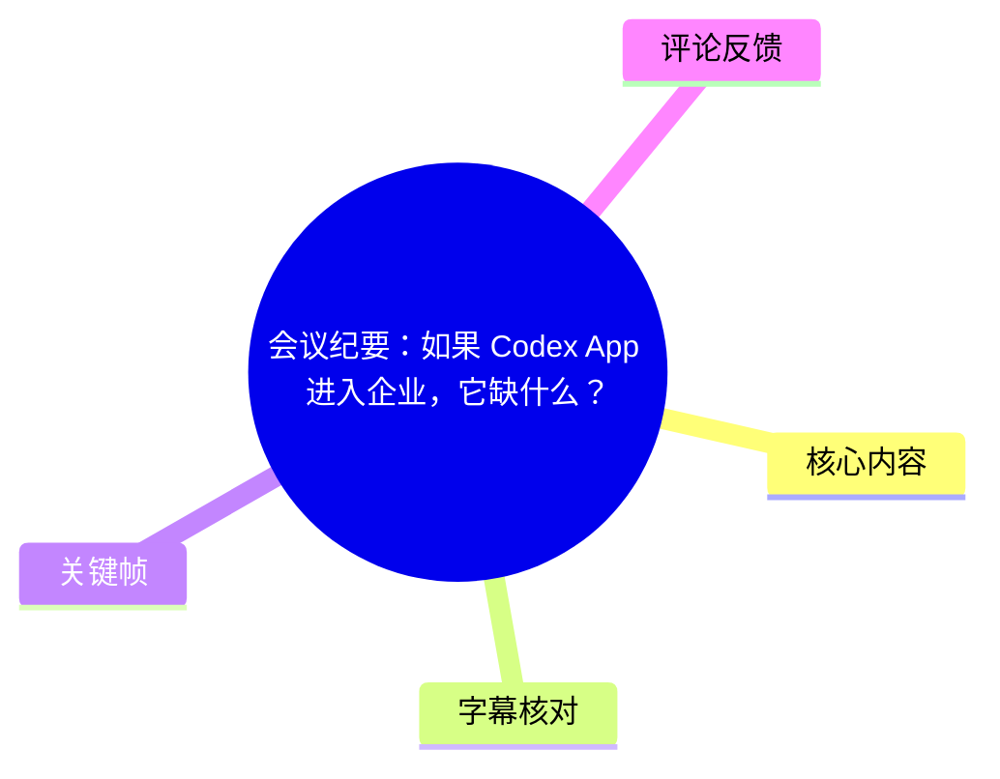
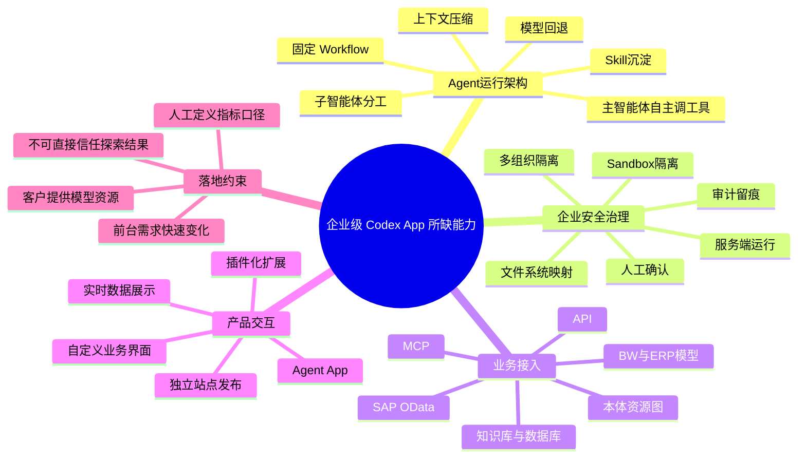
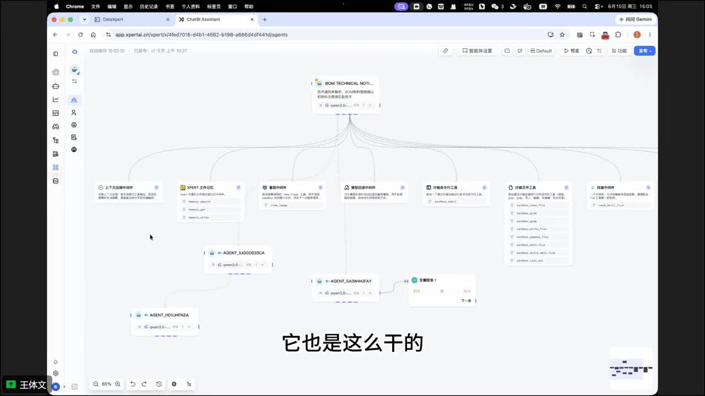
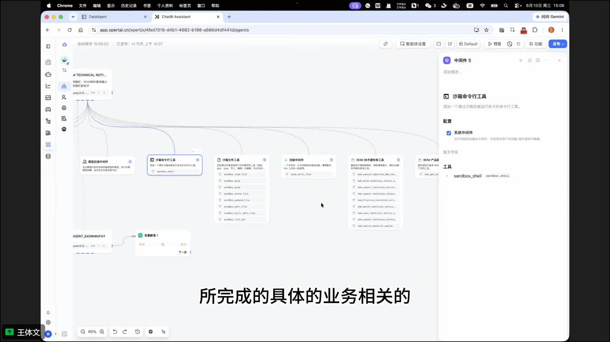
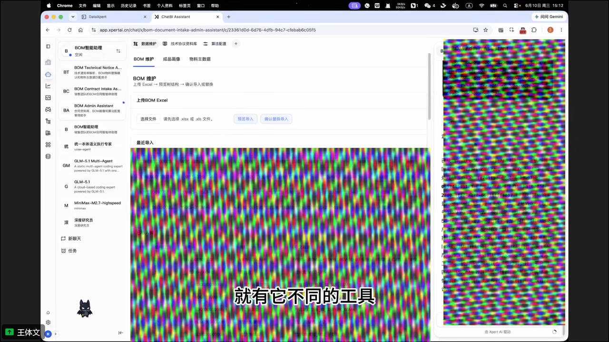
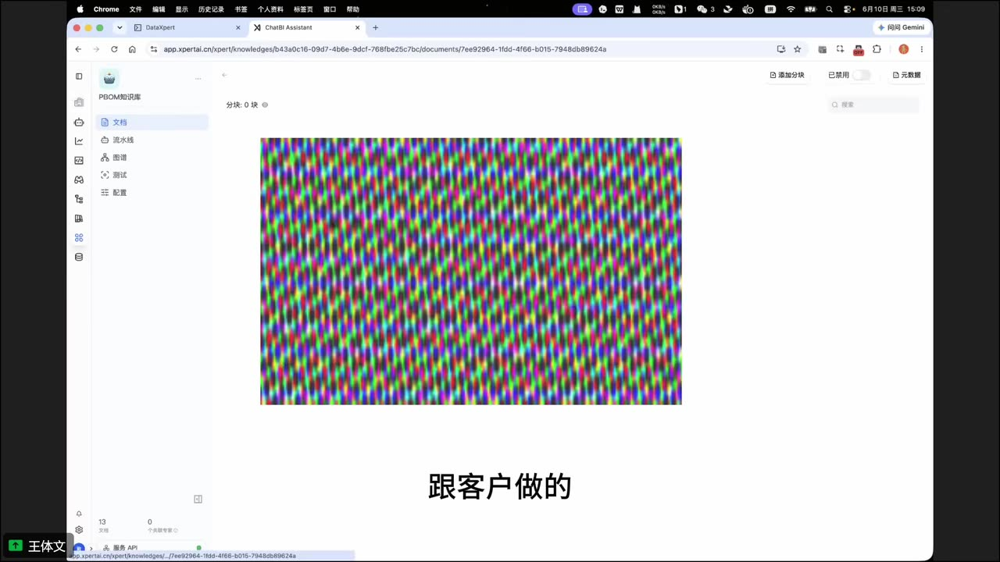

# 会议纪要：如果 Codex App 进入企业，它缺什么？

> 来源：[Bilibili 视频](https://www.bilibili.com/video/BV1XcEv6PEd5)  
> UP 主：XpertAI_元数信息技术｜合集：AIcode｜时长：31:53  
> 视频主题：以一套面向 SAP、ERP、数据分析等业务场景的企业智能体平台为例，讨论 Codex 类个人 Agent 产品若要进入企业，需要补齐的运行、安全、集成、治理与业务交互能力。

## 小结

视频的核心结论是：**Codex、Claude Code 等个人或桌面端 Agent 的“自主调用工具、探索环境、创建 Skill”模式，可以借鉴到企业；但企业落地不能直接复用个人电脑上的运行架构。** 企业平台需要把 Agent 放到受管理的服务端环境，补足 Sandbox 隔离、文件系统映射、权限、审计、数据访问策略和多组织隔离等能力。

演示的平台将“主智能体自主运行”与“固定 Workflow”结合：主智能体可按对话和上下文自主挑选工具、Skill、子智能体；对流程稳定、必须可控的环节则使用固定工作流。平台还提供上下文压缩、模型回退、文件记忆等工程化中间件，以弥补模型能力不足或降低长任务失控风险。

业务接入方面，视频将 MCP、API、知识库、数据库、SAP OData、BW/数据模型和 ERP API 纳入统一的“本体资源”体系。Agent 可以基于本体图探索实体、字段和操作，再调用对应接口；但发言者明确强调，指标口径、数据整理等规则性工作仍应由人先行确认和标准化，不能把 Agent 的探索结果直接等同于正确答案。

视频提出的产品形态是：**业务功能应面向 Agent 开发，并通过插件提供自定义 Agent App 界面。** 因此 Agent 不只是聊天或写代码，还可以在中间工作区展示报表、文件、审批按钮、合同解析结果、采购比价结构化数据等，并把需要确认的动作交给用户完成。

安全与治理是企业场景的关键约束。视频主张平台本地化部署到企业服务器；命令执行和文件编辑在虚拟 Sandbox 中完成；敏感删除、清单处理等操作应要求人工确认；全过程需保留执行人、工具、参数、成功/失败与失败原因等审计信息。平台本身不提供大模型，需接入客户已有或自建的模型平台，因此模型私有化能力是部署前提之一。

视频中的“未来一两个月 Codex App 可能出现右侧自定义应用界面”“AI 半小时做完页面、人工可能需半个月”等表述，均为演讲者在录制时的预测、经验或估计，**并非已在视频内获得外部验证的产品事实**。视频发布时间元数据为未来时间戳，且未提供可用站内字幕；本文以带时间戳的本次 ASR 为主，并对术语识别误差作了谨慎校正。

## 思维导图

## 目录

- [问题背景：个人 Agent 与企业平台的差异](#问题背景个人-agent-与企业平台的差异)
- [运行架构：自主 Agent、Workflow 与中间件](#运行架构自主-agentworkflow-与中间件)
- [安全设计：Sandbox、文件系统与服务端执行](#安全设计sandbox文件系统与服务端执行)
- [工作空间与业务能力接入](#工作空间与业务能力接入)
- [Agent App 与插件化业务前台](#agent-app-与插件化业务前台)
- [本体、SAP 与实时数据分析](#本体sap-与实时数据分析)
- [企业治理、审计与自动化任务](#企业治理审计与自动化任务)
- [问答：人工规则、Skill 固化与独立发布](#问答人工规则skill-固化与独立发布)
- [问答：私有化部署与信息安全](#问答私有化部署与信息安全)
- [落地判断、限制与时效性](#落地判断限制与时效性)
- [字幕比对](#字幕比对)
- [评论分析](#评论分析)
- [处理记录](#处理记录)

## 问题背景：个人 Agent 与企业平台的差异

### [从 Codex 式界面到企业智能体平台（00:00）](https://www.bilibili.com/video/BV1XcEv6PEd5?t=0)

演示者先说明，平台界面在形式上参考了 Codex 类 App，但本质不是传统固定节点的工作流编辑器：平台中的智能体节点可自主运行。后续演示围绕三件事展开：

1. 智能体自身的技术架构与使用方式；
2. 智能体如何与 MCP 等外部系统对接；
3. 如何将其落到具体业务场景，尤其是 SAP、BOM、数据分析等企业业务。

视频的对比对象是个人智能体助手、个人编程工具和常见开源 Agent 框架。发言者的观点是，个人产品通常运行在用户个人电脑上，而企业 B 端智能体主要在服务端运行，因而必须引入系统化的安全、运行隔离和管理设计。

> 注意：ASR 将部分产品、框架或概念识别为“iFi”“Hannes”“OpenClock”“LongChain”“LongGraph”等。结合上下文，能够较可靠地判断其在泛指 Codex 类界面、Harness/Agent 工程能力，以及 LangChain、LangGraph 等框架；但视频音频本身对专有名词识别不稳定，本文不将无法由画面或上下文确认的拼写当作精确产品名。

## 运行架构：自主 Agent、Workflow 与中间件

### [主智能体的工具调用与上下文治理（00:24）](https://www.bilibili.com/video/BV1XcEv6PEd5?t=24)

发言者将平台与传统工作流平台区分开来：

- **主智能体进入任务后**，可自主调用其下挂的工具、能力与规则；
- 工具和规则不只是业务 API，也包括上下文压缩、记忆记录和模型回退等运行中间件；
- 当上下文达到设定长度时，可触发压缩，将长对话缩为较短记忆，再基于压缩后记忆继续对话；
- Agent 可以在必要时调用“记录”类工具，保存后续任务需要的重要信息；
- 当一个模型处理不了某个场景时，可以根据规则切换到能力更强的模型，即“模型回退”。

发言者把这些能力归为 Agent/Harness 工程：当模型能力尚不稳定、会报错或输出不规范时，要在模型外层增加限制和补偿机制，而不应假设模型能自行可靠地完成所有工作。

### [多智能体与固定 Workflow 的混合（04:25）](https://www.bilibili.com/video/BV1XcEv6PEd5?t=265)

平台允许主智能体将独立性较强的子任务分配给子智能体。对子智能体可以配置：

- 名称与描述；
- 可执行的任务范围；
- 提示词；
- 中间件；
- 工具集合。

子智能体完成后，将结果返回主智能体，由主智能体继续执行后续步骤。除自主 Agent 外，平台还可以把后续节点按工作流方式串联。

视频用布局方向说明两类模式：

| 模式 | 视频中的描述 | 适用含义 |
| --- | --- | --- |
| 纵向节点 | 自主运行的智能体模式 | 由 Agent 基于上下文选择工具、路径与子任务 |
| 横向节点 | 固定模式的 Workflow | 以预先定义的顺序执行相对稳定的流程 |

这不是二选一架构。视频倡导的实际上是混合模式：需要探索、推理、调度时依靠 Agent；对稳定、强约束、需严格复现的流程用 Workflow 固化。

> 图：关键帧展示了以节点和连线表达的智能体配置画布，中心任务连接上下文压缩、文件、命令执行、技能与子智能体等能力。它有助于理解视频所说的“主智能体自主调工具”不是单纯聊天，而是有可配置运行依赖的图式结构。

## 安全设计：Sandbox、文件系统与服务端执行

### [为什么企业不能让 Agent 直接执行服务器命令（02:00）](https://www.bilibili.com/video/BV1XcEv6PEd5?t=120)

视频将命令行与文件操作视为企业 Agent 的高风险能力。个人编程工具往往在个人电脑上运行，发言者将个人电脑类比为一个较大的“个人 Sandbox”；但企业 B 端平台的 Agent 在服务器端运行，不能让它直接在生产服务器上执行命令。

风险包括但不限于：

- 删除服务器数据；
- 篡改文件或系统内容；
- 在无边界条件下执行不受控命令；
- 将敏感文件或结果暴露给不应访问的用户。

因此，平台设计为：

1. 为 Agent 提供 Sandbox 命令行工具和 Sandbox 文件工具；
2. 命令执行、文件编辑和文件变更都在安全隔离环境中完成；
3. Sandbox 内文件系统仍需映射到服务端实际的文件夹或持久化位置；
4. 文件映射、隔离边界和持久化之间的衔接，是平台需要解决的核心能力之一。

> 图：画面右侧为“沙箱命令行工具”的配置面板，工具被放入智能体能力图中。该帧直接对应“命令并非直接在企业服务器执行，而是在 Sandbox 中执行”的架构主张。

### [企业安全控制清单（18:58）](https://www.bilibili.com/video/BV1XcEv6PEd5?t=1138)

视频提出的安全与控制措施可整理为以下清单：

| 控制点 | 视频中的实现思路 | 目的 |
| --- | --- | --- |
| 命令与文件隔离 | 在虚拟 Sandbox 中运行 | 避免 Agent 直接影响服务端环境 |
| 人机确认 | 删除、清单处理等敏感动作须点击确认 | 防止高风险动作自动落地 |
| 访问规则 | 针对资源访问和结果输出设置策略 | 限制越权访问和不当输出 |
| 输出预览大小 | 配置可预览结果的最大数据量 | 避免一次性拉取整表、撑爆 Agent |
| 执行审计 | 记录人员、工具、参数、成功/失败及原因 | 支持追责、排障与事后检查 |
| 多组织能力 | 在不同组织间切换与隔离数据、知识库等资源 | 满足企业组织边界 |

这些措施只描述了视频中演示平台的设计方向。视频没有给出 Sandbox 的底层虚拟化技术、网络隔离策略、凭据托管方案、权限模型粒度或第三方安全测评结果，因此不能据此推断其已满足特定合规标准。

## 工作空间与业务能力接入

### [MCP、API、知识库、数据库与 Skill（05:41）](https://www.bilibili.com/video/BV1XcEv6PEd5?t=341)

演示者将“工作空间”称为平台核心，并列出 Agent 能访问的资源类型：

- 内置工具；
- MCP 工具：可对接其他系统提供的 MCP 工具及市面上的 MCP 工具；
- API 工具：直接访问 API；
- 知识库；
- 数据库或业务表；
- Skill（技能）；
- 环境变量与多环境配置；
- 子智能体及相关中间件。

视频认为，直接 API 调用属于较早的集成方式，当前更倾向 MCP 或借助本体方式查询系统资源；但这只是演示者的技术判断，不表示 API 已不适用。

在数据持久化方面，Agent 的中间结果可以写入新建的临时业务表，或读写预先提供的业务表。Skill 则可从仓库注册、上传或从私有仓库安装；Skill 内可包括文件列表、提示词和操作规则。

### [BOM 技术通知单：一个业务工具示例（03:37）](https://www.bilibili.com/video/BV1XcEv6PEd5?t=217)

视频以 BOM 技术通知单为例说明“通用 Agent 能力 + 业务工具”如何组合：

1. 用户上传 BOM 技术通知单；
2. Agent 调用业务工具，提取通知单中的 BOM 编码；
3. 提取物料由何种物料变更为另一种物料等变更信息；
4. 将结构化结果写入已开发好的业务表；
5. 前端读取并展示结果；
6. 后续可与 SAP 业务案例连接。

> 图：关键帧显示“BOM 智能助手”工作台，页面包含 BOM 维护、Excel 上传、预览导入和确认替换导入等区域，右侧为智能体对话区域。画面说明业务 Agent 不只是后台工具调用，还需要用户操作、结果确认和结构化页面协同。

### [环境配置与协同工作界面（06:54）](https://www.bilibili.com/video/BV1XcEv6PEd5?t=414)

企业场景中，视频特别提到开发、测试、生产环境要区分配置变量。平台可以建立不同环境并配置对应变量，避免所有 Agent 任务使用同一套不加区分的连接与参数。

协作界面则采用“Agent 在右、人机协同界面在左或中间”的形态。每个自定义智能体可以拥有自己的 App，App 内可切换不同视图，例如：

- Agent 操作的文件系统；
- 虚拟机/Sandbox 内文件；
- 终端；
- Agent 生成的网站；
- 业务表单、数据看板和确认操作。

用户在界面中点击按钮后，事件会发送给右侧 Agent；Agent 理解和处理后向系统回写数据，前台再实时刷新。视频将其描述为可完全自定义的应用界面模式。

## Agent App 与插件化业务前台

### [从平台插件到桌面端业务系统（11:19）](https://www.bilibili.com/video/BV1XcEv6PEd5?t=679)

视频描述的平台同时有网页端和面向业务的桌面端形态。桌面端借鉴 Codex App 的操作方式：用户可新建智能体、访问智能体、扩展自定义功能界面，并安装和管理业务插件。

一个业务插件的生命周期在演示中大致是：

1. 开发并安装业务插件；
2. 查看插件详情；
3. 执行初始化；
4. 初始化动作在工作空间中创建一个或多个智能体；
5. 智能体下再挂载对应业务功能、工具和界面；
6. 用户通过业务 App 与 Agent 交互。

发言者提出“面向智能体开发功能”的产品理念：考虑一个应用场景时，应将其包装为能完成业务工作的智能体；若中途产生数据、需要展示、需要用户确认，就弹出或打开相应的固定 App 页面。

### [业务端的人机协同操作（12:56）](https://www.bilibili.com/video/BV1XcEv6PEd5?t=776)

演示中列举的交互包括：

- 重新解析；
- 删除合同；
- 查看匹配结果；
- 采纳与确认；
- 将任务发给右侧智能体进行 AI 复核；
- 将复核结果实时回写到界面。

其关键不是让 Agent 完全替人决策，而是把 Agent 的推理与处理结果放在业务页面中，保留用户点击、确认和采纳的环节。视频认为，未来企业中的 Codex 类 App 若要处理业务事项，必须通过插件连接企业系统，并能展示自定义业务页面，而不应局限于通用代码与文件操作。

### [插件的扩展出口（10:07）](https://www.bilibili.com/video/BV1XcEv6PEd5?t=607)

视频以 SAP 开发作类比：SAP 中可以开发 Fiori、OData 或自定义前台入口；同样，平台为不同功能点预留“增强出口”，使插件能够扩展：

- 第三方大模型支持；
- 飞书等系统集成；
- App 与视图；
- 工具；
- 智能体模板；
- 操作能力。

插件完成后可打包、安装并投入使用。视频称该插件系统“非常强大”，但未展示插件 API 规范、版本兼容策略、安装签名、安全审核流程或故障隔离机制，这些仍是企业评估时需要补充验证的内容。

## 本体、SAP 与实时数据分析

### [把 OData、知识库和数据模型作为本体资源（14:09）](https://www.bilibili.com/video/BV1XcEv6PEd5?t=849)

平台将不同来源接入为“本体类型”或“本体资源”。视频举例：

- SAP OData API；
- 知识库；
- 数据库；
- PBOM；
- 通用本体；
- SAP 的 OData；
- 数据分析用语义模型；
- ERP API。

以 OData 为例，视频中的本体图结构包含：

1. 一个 OData 接口容器；
2. 连接到 Entity Type 或 Entity Set；
3. Entity Type 的属性、字段、字段类型、长度等属性节点；
4. 外层的操作节点，例如查询、读取、创建、删除等。

ASR 对具体 OData 操作名称有明显误识别，视频可确认的意思是：本体图不仅描述数据实体及字段，也描述可在实体上执行的操作。本文不保留 ASR 中无法验证的“Slide、Future、Autobot”等拼写。

### [从资源探索到实时 ChatBI（15:45）](https://www.bilibili.com/video/BV1XcEv6PEd5?t=945)

视频描述的 Agent 数据分析路径如下：

1. 将 API、语义模型、维度、指标等资源同步进来；
2. Agent 自主探索有哪些可访问资源、实体、接口和指标；
3. 根据用户问题确定应调用哪一个查询或模型；
4. 执行操作并取得结果；
5. 不只返回静态文字结果，还在中间界面实时展示数据；
6. 用户可刷新、切换维度、追加限定条件并继续分析。

视频举例：用户询问 SAP 中前十个未清订单，Agent 探索到特定 SAP OData 接口后执行查询，返回实时小型报表，并支持图形与维度切换。

视频还提到可连接 SAP BW、BPC 等系统，对现有数据模型和指标定义进行分析；演示者称中间“不存储、不重新建模”，而是同步并直接分析。该说法反映了演示平台的目标架构，具体是否真正无数据复制、同步周期如何、缓存如何处理，视频未提供实现细节。

> 图：关键帧展示 PBOM 知识库界面，但中心区域存在严重彩色噪声/显示异常。它仍可佐证视频展示了知识库资源入口；同时也提醒读者，画面无法可靠读取其中的具体文本和参数，因此本文未据此补充未被语音清晰说明的细节。

### [Skill：把探索经验变成可复用规则（16:09）](https://www.bilibili.com/video/BV1XcEv6PEd5?t=969)

发言者指出，面对大量本体资源、API 和路径时，Agent 可能因探索不当或经验不足而调用错误接口。解决方式不是每次都让 Agent从零探索，而是：

1. 先让 Agent 进行一次探索；
2. 对探索出的正确路径、规则和步骤进行总结；
3. 将其沉淀为 Skill；
4. 下次同类任务优先加载 Skill；
5. Agent 按 Skill 中的步骤或规则调用 API，从而缩短探索过程。

这也是后续问答中反复强调的闭环：**探索 → 人工确认 → Skill 固化 → 后续复用**。

## 企业治理、审计与自动化任务

### [策略、审计与结果规模限制（20:16）](https://www.bilibili.com/video/BV1XcEv6PEd5?t=1216)

视频将执行留痕视为企业端最重要的要求之一。每次 Agent 执行应记录：

- 执行时间；
- 成功或失败；
- 执行者；
- 使用的工具；
- 工具调用参数；
- 失败原因。

此外，平台需配置访问规则和输出预览上限。发言者举例，不能让 Agent 一次拉取整张大表，从而造成数据量过大或“把 Agent 撑爆”。这实际上对应两个治理目标：

- 减少资源消耗与任务失败；
- 控制数据暴露范围。

### [自动化任务：不能只靠自由生成（20:40）](https://www.bilibili.com/video/BV1XcEv6PEd5?t=1240)

视频以“为 CEO 生成每日经营分析报告”为例说明任务自动化。自动任务可以调用 BI 指标库或数据仓库生成报告，但发言者同时强调：随意让 Agent 生成结果未必准确，必须为任务提供经过验证的 Skill。

因此，一个更稳妥的自动化流程是：

1. 明确业务任务，如每日经营分析；
2. 预先探索能稳定获得正确结果的查询路径；
3. 将步骤、口径和规则沉淀为 Skill；
4. 创建带模板的自动化任务；
5. 由管理层或基层员工按权限使用；
6. 审计任务执行结果与异常。

## 问答：人工规则、Skill 固化与独立发布

### [数据探索不能替代人工定义指标（21:52）](https://www.bilibili.com/video/BV1XcEv6PEd5?t=1312)

提问者关心：数据探索能力是否能替代人工在数据探源、数据分析中的部分工作？若 Agent 有幻觉或做错，能否使用人工已确定的数据规则？

回答明确支持这种方式，并称其为目前推荐做法：

- 指标口径、数据整理等规则性工作，当前仍需要人做；
- 人工将规则制作成标准化语义模型；
- 通过指标管理系统建立并管理指标；
- 当指标定义正确且统一时，Agent 再基于指标拉取和探索数据，准确率更高；
- 人可先让 Agent 探索，再检查结果，并逐步固定规则或流程；
- 最终固化的是经人工确认的规范，而不是 Agent 自发输出的任意结论。

这是视频中最明确的经验边界：**Agent 可以提高数据探索与执行效率，但不能替代企业对指标、口径和数据治理的责任。**

### [从正确过程创建 Skill（23:53）](https://www.bilibili.com/video/BV1XcEv6PEd5?t=1433)

视频将 Codex 类桌面 Agent 的工作方式概括为：让它探索并完成一次任务，在得到正确结果后，要求它把过程总结为 Skill，之后直接通过 Skill 执行同类任务。

演示平台提供“技能创建”中间件，用户可要求 Agent 将此前过程创建为技能。视频中的一次演示似乎尚未成功运行，发言者解释可能是后台智能体较早开发、暂未启动。因此，这项能力在视频中是功能演示和设计说明，**不能据此确认该次现场创建已经完成或质量已被验证**。

### [内网无模型资源时：生成独立站点（25:30）](https://www.bilibili.com/video/BV1XcEv6PEd5?t=1530)

提问者提出另一类现实问题：一些客户在内网中没有大模型资源，也难以调用外部模型 Token。是否可以在有模型的开发环境完成 Skill 创建后，将其发布为“脚本 + 简单页面”的独立应用，从而脱离内网模型资源运行？

回答将这种需求理解为“站点生成”：

1. Agent 对任务或流程进行探索；
2. 生成站点、静态页面或小型系统；
3. 将代码和文件导出；
4. 导出后的产物可独立运行；
5. 可生成多个版本进行比较、管理和分享链接。

视频将此类生成的应用视为平台插件之一。这里需注意：视频没有说明导出的应用是否完全不依赖后端接口、认证、数据库或模型服务。因此“可独立运行”应理解为发言者对演示生成站点的描述，实际部署仍需核实运行依赖与企业网络条件。

### [前台变化快，插件应可替换（30:07）](https://www.bilibili.com/video/BV1XcEv6PEd5?t=1807)

会议后段讨论企业现有系统较重、定制开发成本高的问题。发言者的判断是：

- 不必将所有应用层都放进一个重型核心系统；
- 应复用其数据模型和系统逻辑，而非持续堆砌前端定制；
- 前台属于需求变化快的“敏态”部分，更适合由 AI 和 Agent 快速生成与调整；
- 若客户不再需要一个“智能维保平台”之类的功能，可卸载旧插件并安装新插件；
- 视频称某类功能“业务梳理一天、生成代码并调试一天”可达到展示效果，但这是经验性时间估算，受业务复杂度、接口、数据质量和审批流程影响很大。

## 问答：私有化部署与信息安全

### [本地化部署与私有模型前提（28:19）](https://www.bilibili.com/video/BV1XcEv6PEd5?t=1699)

针对“信息安全如何保证”的提问，发言者的回答包括：

- Codex 等开发工具若主要在个人电脑上运行，对企业未必是合理方式；
- 演示平台计划或支持在企业内部服务器本地化部署；
- 智能体运行在企业服务器，而不是运行在个人电脑；
- 用户打开的是浏览器界面，类似企业网页应用；
- Agent 的运行日志、消息记录和执行记录在服务端留存；
- 平台运行受管理、受监控，并有审计日志；
- 平台不提供基础大模型；
- 客户需要接入已经搭建好的模型平台，或自行提供模型资源；
- 因此，若要求整体私有化，基础模型也需要具备私有化或企业可控的部署条件。

这里的“私有化”至少包括两层：

| 层次 | 视频给出的含义 |
| --- | --- |
| Agent 平台私有化 | 企业内部服务器部署，服务端管理运行与日志 |
| 模型资源私有化/可控化 | 客户自行提供或接入已有模型平台，平台不直接提供模型 |

视频没有说明是否支持离线模型、模型网关、密钥轮换、租户级加密、数据脱敏、DLP、网络出站控制等细节；这些都不能因“本地化部署”而默认已解决。

## 落地判断、限制与时效性

### [企业引入 Codex 类 App 的最小能力框架（31:20）](https://www.bilibili.com/video/BV1XcEv6PEd5?t=1880)

根据视频演示，可将“企业版 Codex App”需要补齐的能力概括为五层：

| 层级 | 必要能力 | 视频依据 |
| --- | --- | --- |
| 运行层 | 主 Agent、子 Agent、Workflow、上下文压缩、模型回退、Skill | 前半段架构演示 |
| 执行层 | Sandbox 命令、Sandbox 文件、受控文件映射 | 服务端命令安全讨论 |
| 集成层 | MCP、API、知识库、数据库、SAP OData、语义模型、本体 | 工作空间与本体演示 |
| 交互层 | 可自定义 Agent App、文件/终端/报表/审批页面、实时回写 | Agent App 与业务工作台 |
| 治理层 | 权限、人工确认、审计、输出规模限制、多组织隔离、私有部署 | 治理与安全问答 |

### 适用对象

视频适合以下读者或团队：

- 正在建设企业 Agent 平台、企业 AI 中台或智能体工作空间的产品、架构和研发团队；
- 有 SAP、ERP、BW、BPC、OData、业务知识库等既有系统，需要接入 AI 的团队；
- 希望将“自然语言问答”扩展为“可执行业务操作”的组织；
- 关注 MCP、Skill、插件化 Agent App、多智能体和 Workflow 混合架构的从业者；
- 需要在内网、私有化和审计要求下评估 Agent 部署方式的企业 IT 团队。

### 关键限制

1. **演示不等于性能验证。** 视频展示了平台概念、界面与案例，但没有提供并发、延迟、准确率、成本、可用性、权限穿透或安全测试数据。
2. **ASR 专有名词误识别较多。** 例如框架名、产品名、部分 SAP 术语和 OData 操作词存在明显噪声，不能将 ASR 转写逐字视为技术文档。
3. **本体与 Skill 的质量依赖人工治理。** 视频明确承认指标口径和数据整理仍需人工完成；错误口径会使 Agent 高效地产生错误结果。
4. **独立发布不等于零依赖。** 视频称生成站点可独立运行，但未展示其对数据库、后端接口、账号体系、模型服务和部署环境的完整依赖。
5. **私有化不自动等于合规。** 本地部署、服务端运行和审计日志是基础措施，但不等同于满足行业监管、数据分级分类、等保或跨境数据要求。
6. **时间估计不可泛化。** “半小时做页面”“两天完成业务梳理和代码调试”等为会议中的经验性说法，不是项目承诺。
7. **产品预测具有时效性。** 关于 Codex App 未来界面能力的判断是录制时预测，后续产品演进可能与视频表述不同。

## 字幕比对

| 字幕来源 | 完整性 | 专有名词 | 时间轴 | 主要问题 |
| --- | --- | --- | --- | --- |
| Bilibili 站内字幕 | 未提供可用字幕 | 无从核验 | 无从核验 | 字幕抓取工具报错 `Invalid URL`，素材包中没有可用站内 SRT |
| 本次 ASR 字幕 | 高：82 段，语音覆盖约 99.45%，覆盖约 1901.98 秒 | 较弱：多个产品、框架、SAP/OData 术语被误识别 | 高：每段均有起止时间，首段 00:00:00.440，末段 00:31:51.110 | 同音词、英文术语和界面术语误识别；少数句子语义不完整 |

### 最终字幕选择

本文采用**本次 ASR 时间轴字幕**作为章节定位依据，因为：

- 未提供可用的 Bilibili 站内字幕；
- ASR 有完整时间戳，且诊断显示语音覆盖率约为 99.45%；
- `asr-result.json` 未标记 `noAudioStream=true`，说明源视频存在音轨，本次 ASR 为正常音频识别结果，而非无音轨时的替代方案。

### 校正与保留原则

- 将 ASR 中反复出现、上下文指向运行工程能力的“Hannes/Hanness”统一表述为“Agent/Harness 工程能力”，不强行认定具体产品名称。
- 将“LongChain、LongGraph”理解为可能指 LangChain、LangGraph，但因音频识别并不稳定，正文使用“LangChain、LangGraph 等开源 Agent 框架”时已注明为上下文校正。
- “ICP/ICB”等词在视频中与企业系统对接有关，但无法仅凭 ASR确认其准确缩写，正文避免将其扩展成未出现的具体系统。
- “本体图、OData、Entity Type、Entity Set、SAP、BW、BPC、MCP、Skill、Sandbox”等概念有语境及画面支持，保留为正文核心术语。
- 关键帧中部分知识库或对话区域存在明显彩色噪声，无法可靠读取具体字段、数值或 UI 文案；本文只采用可辨认的界面结构，不据此编造细节。

## 评论分析

仅处理素材中可获取的热评前三条；评论是用户感受，不构成对视频技术方案、产品能力或效果的验证。

| 热评 | 点赞 | 观点概括 | 可提供的补充信息与可信度 |
| --- | ---: | --- | --- |
| `gpt升级开会票元`：“今天也认真看完” | 3 | 表达完整观看与正向参与 | 仅能说明该用户观看后的态度，没有提出具体技术反馈或验证信息 |
| `jklsajd312131`：“AI让很多以前觉得难的事，突然能开始做了” | 2 | 认同 AI 降低复杂任务启动门槛 | 与视频“AI 辅助快速生成前台/插件”的方向一致，但属于泛化感受，不能证明项目交付效率或安全性 |
| `蜗牛果酱`：“妙[星星眼]” | 0 | 简短肯定 | 未提供可分析的业务、技术、风险或争议信息 |

评论区未出现针对 Sandbox 安全、私有化模型、本体建模质量、SAP 接入成本或 Agent 幻觉控制的实质性讨论，因此无法从热评中得出额外技术结论。

## 处理记录

- Worker ID：worker-mrj0www4-e8d79408
- 模型：gpt-5.6-terra
- 调用工具与素材：视频元数据、关键帧清单、`asr/transcript.srt`、`asr/asr-result.json`、热评 `comments/comments.json`
- 使用的应用工具：字幕获取工具曾执行，但返回 `Invalid URL`；本次整理改用素材包内 ASR SRT、ASR 诊断、关键帧与评论数据。
- 字幕选择：未提供可用站内字幕；已检查本次 ASR，采用其 82 个带时间戳分段定位章节。ASR 语言为中文，置信概率约 0.9985，时长诊断为 1912.51 秒，未发现无音轨标记。
- 关键帧依据：
  - `frames/frame-001.jpg`：展示智能体节点、工具和子节点编排，支撑自主 Agent 架构说明；
  - `frames/frame-002.jpg`：展示 Sandbox 命令行工具配置，支撑安全隔离说明；
  - `frames/frame-003.jpg`：展示 PBOM 知识库入口，同时记录画面噪声导致的可读性限制；
  - `frames/frame-004.jpg`：展示 BOM 智能助手的上传、导入与人机协同工作台。
- 缓存清理：未提供可执行的工作区清理结果；本次仅基于给定素材生成文档，未声明或保留新增缓存文件。
- 未解决问题：
  - 无法获得站内字幕以复核英文专有名词；
  - ASR 对部分框架、产品与 SAP/OData 操作名误识别，无法逐项完全校正；
  - 视频未提供平台版本号、部署文档、接口规范、性能测试、安全测评和合规证明；
  - 关键帧中部分画面存在彩色噪声，不能据此读取精细 UI 内容。
