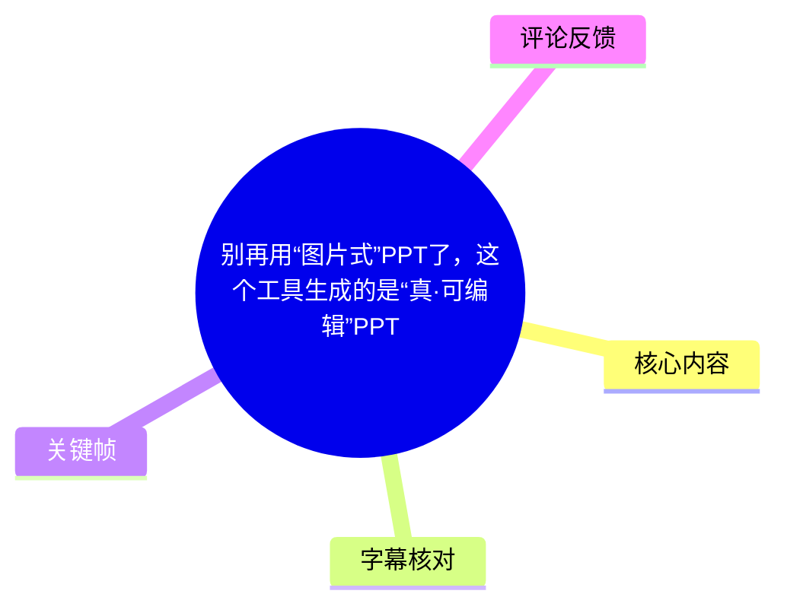
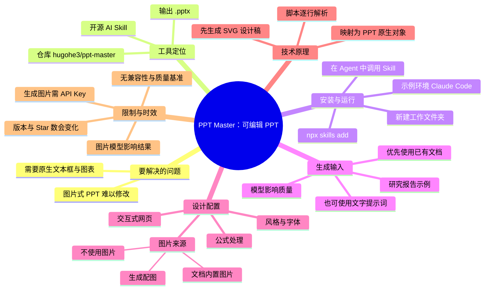
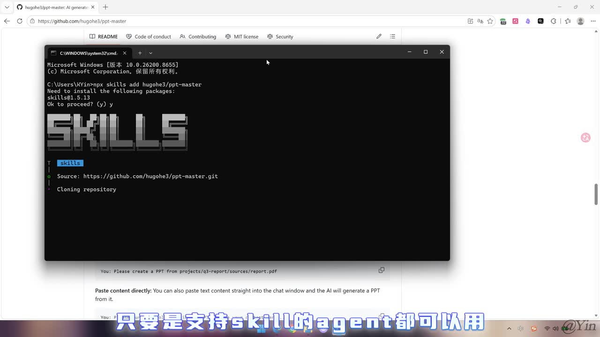
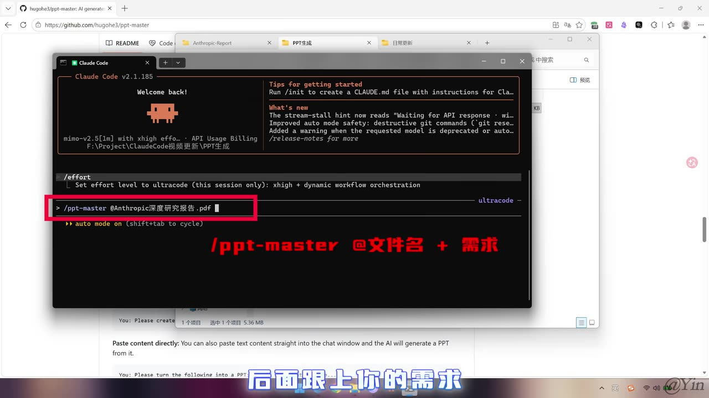

# 别再用“图片式”PPT了，这个工具生成的是“真·可编辑”PPT

> 来源：[Bilibili 视频](https://www.bilibili.com/video/BV1Yy7h6sENt)  
> UP 主：Yin_Code｜合集：AIcode｜时长：3 分 03 秒  
> 标签：AI、人工智能、教程、Claude Code、办公、工具、PPT、Skill、Agent

## 小结

视频介绍开源工具 **PPT Master**：它的目标不是生成一张张嵌入到 PPT 中的页面图片，而是将内容生成为 PowerPoint 中可选中、可移动和可修改的原生元素。视频称，文本框、图表、形状等会以 `.pptx` 内的对象形式交付，因此用户可以在 PowerPoint 中继续改文字、颜色、布局与内容。

作者展示的基本路径是：先把 `ppt-master` 作为 Skill 安装到支持 Skill 的 Agent 环境中；在新建项目文件夹内启动 Claude Code；通过 `/ppt-master` 命令引用文档并描述需求；随后在可能弹出的本地交互网页中选择整体风格、字体、公式处理方式和图片来源，确认后等待生成 `.pptx` 文件。

视频强调，**提供已有文档通常比只输入一句提示词效果更好**。工具可处理文档、研究报告和简单文字需求，但最终输出质量不仅取决于输入材料，也与所用的 Agent／模型，以及图片生成模型和图片 API 配置有关。视频中的示例使用了一份预先准备的研究报告。

其关键技术解释是：工具不让 AI 直接写复杂的 PowerPoint 文件，而是先产生 **SVG 设计图纸**；随后由 Skill 内置脚本逐行解析 SVG，并调用 PowerPoint 底层操作库，将设计稿中的元素映射为 PPT 原生形状、文本框和图表。这是“可编辑”能力的核心机制；不过视频没有展示源代码、转换库名称、兼容性测试或失败案例。

安装命令在视频描述中明确给出：

```bash
npx skills add hugohe3/ppt-master
```

适合需要快速做汇报、组会展示或课程作业，同时仍需后期精修 PPT 的用户。需要注意：视频所述 GitHub Star 数、支持环境、安装方式、模型可用性和图片后端均有时效性，应以仓库当前 README 与实际运行结果为准。

## 思维导图





## 目录

- [背景：图片式 PPT 与原生可编辑 PPT](#背景图片式-ppt-与原生可编辑-ppt)
- [工具定位与安装](#工具定位与安装)
- [从文档生成 PPT 的操作流程](#从文档生成-ppt-的操作流程)
- [风格、图片与模型配置](#风格图片与模型配置)
- [为什么生成结果可以编辑](#为什么生成结果可以编辑)
- [交付结果与适用经验](#交付结果与适用经验)
- [限制、待验证项与时效性](#限制待验证项与时效性)
- [关键帧索引](#关键帧索引)
- [字幕比对](#字幕比对)
- [评论分析](#评论分析)
- [处理记录](#处理记录)

## 背景：图片式 PPT 与原生可编辑 PPT [00:00](https://www.bilibili.com/video/BV1Yy7h6sENt?t=0)

视频开场区分了两类 AI PPT 结果：

1. **“图片式”PPT**：整页内容可能作为一张图片放进演示文稿。用户可以观看页面，但难以单独选中或修改其中的文字、图表和元素；一旦需要改字，往往只能重新生成或回到源图修改。
2. **“真·可编辑”PPT**：页面中的每一个文本框、图表、图形等作为独立对象存在。用户可在 PowerPoint 中直接点选并编辑。

视频把 PPT Master 定位为后者。其承诺的核心不是“自动排版”本身，而是将自动生成结果保留为原生、可继续编辑的 PowerPoint 对象。


> 图：关键帧展示了 `hugohe3/ppt-master` 的 GitHub 页面、多个样式示例缩略图，以及“直接可编辑、原生转场和动画”等仓库说明。它为视频所讲工具名称、仓库地址和“原生 PPT”定位提供了可视化上下文；其中页面文案属于仓库展示，不能单独替代实际生成效果测试。

视频和描述信息称，该项目在 GitHub 上已获得约 **30k Star**。这是视频发布时点附近的宣传性数据，Star 数会持续变化，不能视为当前实时数值。

## 工具定位与安装 [00:20](https://www.bilibili.com/video/BV1Yy7h6sENt?t=20)

### 工具与运行环境 [00:20](https://www.bilibili.com/video/BV1Yy7h6sENt?t=20)

视频称 PPT Master 是由 Bilibili 创作者 **@hehugo** 开发的开源 AI 工具，仓库标识为：

```text
hugohe3/ppt-master
```

作者以 **Claude Code** 演示 Skill 的调用方式，但特别说明：它并非只支持 Claude Code；只要 Agent 环境支持 Skill，理论上都可以使用。这里“可以使用”是视频对 Skill 接入能力的说明，不等于所有 Agent、操作系统、模型或版本都经过视频验证。

### 安装命令 [00:29](https://www.bilibili.com/video/BV1Yy7h6sENt?t=29)

视频演示的安装动作是在命令行中执行安装命令。视频描述区给出了完整可复制的命令：

```bash
npx skills add hugohe3/ppt-master
```

执行时需具备的基本条件包括：

- 本机可使用 `npx`／Node.js 环境；
- 当前网络、包管理器和 GitHub 仓库可访问；
- 使用的 Agent 产品或 IDE 支持 Skill；
- 用户具备在终端安装第三方工具的权限与基本判断能力。



> 图：关键帧中 Windows 命令提示符显示 `npx skills add hugohe3/ppt-master`，并出现下载 `skills@0.15.13`、克隆 `https://github.com/hugohe3/ppt-master.git` 的过程。该图对安装命令和视频所演示的 Windows 场景具有直接参考价值，但不代表其他系统上的输出完全相同。

视频也提醒，没有接触过类似安装流程的用户，可先学习相关安装教程。该视频本身没有展开 Node.js 安装、权限错误、网络错误、依赖冲突或卸载方法。

## 从文档生成 PPT 的操作流程 [00:43](https://www.bilibili.com/video/BV1Yy7h6sENt?t=43)

### 1. 新建工作文件夹并打开 Agent [00:43](https://www.bilibili.com/video/BV1Yy7h6sENt?t=43)

安装完成后，作者先新建一个文件夹，再在该文件夹中打开 Claude Code。这样做的作用是让输入文档、生成过程和输出文件集中在同一工作目录内，便于 Agent 引用文件和定位生成结果。

视频没有给出固定目录结构、文件命名规则或跨平台路径要求，因此这些部分应按当前 Agent 的实际文档执行。

### 2. 准备输入材料 [00:51](https://www.bilibili.com/video/BV1Yy7h6sENt?t=51)

作者给出的经验排序如下：

- **已有文档：效果最好。** 示例中准备了一份研究报告。
- **直接输入文字需求：也可以生成。** 即便手头没有文档，用户仍可通过提示词发起生成。
- **纯提示词结果可能打折扣。** 视频没有量化“打折扣”的程度，也未比较不同文档类型、页数或模型下的质量差异。

因此，若目标是产出可用于正式场合的 PPT，应优先准备结构清晰、事实准确、层级明确的源文档。工具可自动整理与排版，但视频并未表明它能自动校验研究结论、数据、引文或图表数值。

### 3. 调用 `/ppt-master` 并引用文档 [01:00](https://www.bilibili.com/video/BV1Yy7h6sENt?t=60)

在 Claude Code 对话框中，视频演示以斜杠命令调用 PPT Master，再补充具体需求。示例通过 `@` 符号选取刚上传的研究报告，然后发送。

可抽象为以下交互结构：

```text
/ppt-master @文件名 你的生成需求
```

关键帧中可辨识的演示命令包含研究报告文件名，画面下方也明确标注了“`/ppt-master @文件名 + 需求`”。但视频未提供可直接复用的完整自然语言需求文本，因此不应臆造具体页数、主题色、受众或大纲要求。



> 图：关键帧展示 Claude Code 的命令输入区域，红框标出 `/ppt-master @Anthropic深度研究报告.pdf` 一类的调用方式，并以醒目文字说明“@文件名 + 需求”。它直观说明了 Skill 的触发方式和文件引用动作，是复现实操流程的关键画面。

### 4. 等待交互式设计确认 [01:19](https://www.bilibili.com/video/BV1Yy7h6sENt?t=79)

发送任务后，视频称系统可能会弹出一个交互式网页，让用户选择 PPT 风格。若 Agent 只在对话里以文本询问，用户也可以主动要求它“通过交互式网页询问”。

这里的“可能”意味着网页并非视频保证的每次必然步骤，具体是否出现会受所用 Agent、Skill 版本和运行状态影响。

## 风格、图片与模型配置 [01:29](https://www.bilibili.com/video/BV1Yy7h6sENt?t=89)

交互页面中的选项可按个人偏好或实际使用场景填写。视频画面显示了“确认设计方案”页面，其中可见以下类型的配置：

- 整体形象：配色、字体等；
- 正文字号：画面示例为 **20**，并提示正文建议范围为 **18–24 px**；
- 公式渲染策略：混合、全部渲染、仅文本等选项；
- 图片使用方式：生成配图、网络来源、用户提供、占位符、不使用图片、自定义等；
- 确认按钮：提交选项后进入生成。


> 图：关键帧显示浏览器中的 `localhost:5050` 设计确认页面。页面可见字体、正文字号、公式渲染及“图片使用”区域，并在右下角提供“确认”按钮。它表明风格不是只能通过一句提示词指定，也可通过表单配置；页面字段会随工具版本变化。

### 图片生成的前提 [01:38](https://www.bilibili.com/video/BV1Yy7h6sENt?t=98)

视频特别指出，若选择“生成配图”，用户需要自行接入图片生成 API Key。对于没有 API Key 的情况，作者给出两种替代策略：

1. 使用源文档中已有的内置图片；
2. 不使用图片。

视频还说明，图片生成模型会影响最终视觉效果。作者在口播中提到自己使用的是 **Owen_Image**；不过本次 ASR 将该名称识别为“Q1 image”，站内字幕写作“Owen_Image”。由于缺少模型链接、准确拼写说明或配置截图，本文保留站内字幕的写法，并将其视为待核验的专有名词，而不进一步推断具体模型服务。

### 风格选择经验 [01:49](https://www.bilibili.com/video/BV1Yy7h6sENt?t=109)

若用户不知道应选何种风格，视频建议直接告诉 AI 自己的需求，让 AI 协助决定。这个建议适合缺少设计经验、但能说清汇报场景和受众的人；例如，用户应尽可能明确正式程度、使用场合、是否需要数据图表、是否沿用既有品牌模板等。

视频未展示“让 AI 自选风格”与“人工填写配置”之间的质量对比，也未证明 AI 自动选择一定符合组织视觉规范。用于企业、学校或品牌场景时，仍应人工检查字体授权、颜色规范、图像来源和内容准确性。

## 为什么生成结果可以编辑 [02:03](https://www.bilibili.com/video/BV1Yy7h6sENt?t=123)

视频给出的技术链路可概括为：

```text
源文档／文字需求
        ↓
AI 生成 SVG 格式设计图纸
        ↓
Skill 内置脚本逐行解析 SVG
        ↓
调用 PowerPoint 底层操作库
        ↓
将图形、圆形、文本框、图表等映射为 PPT 原生对象
        ↓
交付 .pptx 文件
```

作者的解释重点包括：

- **先生成 SVG**：SVG 是描述矢量图形的格式，视频认为 AI 对其格式和布局控制较为精确，可描述文字、图形位置和尺寸。
- **再进行结构化转换**：Skill 内置脚本逐行解析 SVG，而非将 SVG 页面简单截图后塞入 PPT。
- **对象一一对应**：设计稿中的元素、圆形、文本框、图表等被创建为 PPT 文件内对应的原生形状。
- **最终可编辑**：用户收到的是“活的 PPT”，而不是整页不可拆分的图像。

这里需要严格区分：以上是**视频对实现原理的说明**。素材未提供实际代码、SVG 样例、解析规则、PowerPoint 操作库名称，也没有验证复杂公式、嵌套图表、特殊字体、动画、跨版本 Office 打开效果的测试结果。因此，不能据此推断任何 SVG 元素在所有情形下都能 100% 无损转化。

## 交付结果与适用经验 [02:36](https://www.bilibili.com/video/BV1Yy7h6sENt?t=156)

视频称生成完成后，工具会直接交付 `.pptx` 文件。打开后可看到此前选择的设计风格，生成的图表和文字也会出现在演示文稿中。作者强调，用户可直接点击每个元素进行编辑，包括：

- 修改布局；
- 调整颜色；
- 修改文字内容；
- 对不满意的设计直接手工调整。

这使其与“一次性生成、难以修改”的图片型方案形成区别。对实际工作而言，可迁移的经验是：

1. **把 AI 生成看作可编辑初稿，而不是最终审稿版本。**
2. **优先提供高质量源文档。** 输入逻辑越清楚，后续修改成本越低。
3. **生成后逐页检查。** 特别是数据、专业术语、图表含义、公式、引用和图片版权。
4. **将设计选择与使用场景绑定。** 课堂作业、研究组会、业务汇报的内容密度与视觉风格不同。
5. **保留原始材料。** 当生成结果不符合预期时，源文档和明确的需求描述是重做与迭代的基础。

## 限制、待验证项与时效性 [02:48](https://www.bilibili.com/video/BV1Yy7h6sENt?t=168)

### 视频明确说明的限制

- 没有现成文档时可以仅用提示词生成，但效果可能较差。
- 最终效果与使用的模型有关。
- 生成图片功能需要用户自行配置 API Key。
- 图片生成模型会影响视觉结果。
- 用户若不配置图片生成能力，可改用文档内置图片或不使用图片。
- 交互网页是“可能”出现的流程，不能假定所有环境都必然提供。

### 素材未验证、应在实践中确认的事项

- PPT Master 当前版本是否仍使用相同安装命令；
- GitHub Star 是否仍约为 30k；
- Skill 对不同 Agent、不同操作系统与不同 Node.js 版本的兼容性；
- `.pptx` 在 Microsoft PowerPoint、WPS Office、Keynote 导入等环境中的一致性；
- 动画、演讲者备注、模板跟随等仓库页面提及能力是否能在当前版本稳定可用；
- 长文档、复杂图表、公式、中文字体和多语言内容的转换效果；
- API Key 的费用、隐私、服务商条款及输入文档是否会发送到第三方服务。

### 时效性说明

视频元数据的抓取时间为 2026-07-13，发布 Unix 时间戳对应 2026-06-25 左右（时区未在素材中注明）。安装命令、模型名称、仓库功能、页面字段与热度数据均可能在此后变更。本文只整理给定素材中已出现的信息，不将其当作工具当前状态的保证。

## 关键帧索引

| 关键帧 | 正文位置 | 画面信息 | 选择价值 |
| --- | --- | --- | --- |
| `frames/frame-001.jpg` | 背景与工具定位 | GitHub 仓库、样式样例及项目说明 | 支撑工具名称、仓库与“原生可编辑 PPT”定位。 |
| `frames/frame-002.jpg` | 安装步骤 | Windows CMD 执行 `npx skills add hugohe3/ppt-master` | 明确展示视频中的实际安装命令与安装过程。 |
| `frames/frame-003.jpg` | 调用步骤 | Claude Code 中 `/ppt-master @文件名 + 需求` | 说明如何触发 Skill、如何引用已上传材料。 |
| `frames/frame-004.jpg` | 风格与图片配置 | 本地交互设计页面、字号和图片选项 | 展示用户可配置的设计参数及确认操作。 |

未选用 `frame-005.jpg`、`frame-006.jpg`：给定素材没有对应画面内容说明，且前四帧已覆盖仓库定位、安装、命令调用和配置页面四个关键步骤。为避免对未核验画面作出推断，未将其纳入正文论证。

## 字幕比对

| 字幕来源 | 完整性 | 专有名词 | 时间轴 | 主要问题 |
| --- | --- | --- | --- | --- |
| Bilibili 站内字幕 | 覆盖完整，内容与视频流程连贯 | `PPT Master`、`Claude Code`、`SVG`、`.pptx` 等多数术语可辨；图片模型写作 `Owen_Image` | 提供素材未含逐句时间戳 | 字幕为阿拉伯语，与视频中文口播语言不一致；部分中文专名需结合画面和描述区回译确认。 |
| 本次 ASR 字幕 | 已执行，覆盖从开场到结尾的主要段落 | 多处误识别，如“言声PPT”“图片写PPP”“PVP Master”“Cloud Code”“SCG／ACG”“pvpx”“Q1 image” | 提供素材未含逐句时间戳 | 中文语义碎裂、同音替换较多，专有名词和命令不能直接作为事实依据。 |

### 最终字幕采用策略

本次 ASR 已执行，但其专有名词误识别较多；站内字幕虽然为阿拉伯语，叙述结构完整且与画面流程吻合。因此，正文采用以下合并原则：

1. 以**站内字幕的完整语义**为主，转写为中文；
2. 以**视频描述区**校正安装命令、仓库名和作者信息；
3. 以**关键帧**校正可见命令与界面字段；
4. 将 ASR 用于交叉确认段落顺序，不采纳其明显错误的术语拼写。

重要校正如下：

| 出现形式 | 采用写法 | 校正依据 |
| --- | --- | --- |
| ASR“PVP Master”“PPP” | `PPT Master`、PPT | 视频标题、描述区、站内字幕与关键帧一致。 |
| ASR“Cloud Code” | `Claude Code` | 视频标签、站内字幕、关键帧界面标题一致。 |
| ASR“SCG／ACG 格式设计图” | SVG 格式设计图纸 | 站内字幕明确为 SVG，且符合视频技术解释。 |
| ASR“.pvpx” | `.pptx` | 站内字幕和视频描述区一致。 |
| ASR“Q1 image” | `Owen_Image`（待核验） | 站内字幕如此拼写；素材未给出模型链接或配置详情。 |
| ASR“BGUP主” | Bilibili 创作者 @hehugo | 站内字幕语义、视频描述区作者署名与仓库名共同校正。 |

## 评论分析

以下仅处理可获取的热评前三条。评论内容代表评论者表达，不应视为已经验证的工具事实。

1. **一如既往0204（6 赞）**  
   - 评论：`@hehugo 作者在这[吃瓜]，恰好两个都有关注`  
   - 观点：评论者称自己同时关注了视频作者与 PPT Master 作者。  
   - 补充价值：侧面反映评论者认为视频提到的作者账号与其所知对象有关联。  
   - 可信度与限制：这是个人互动性评论，未提供仓库、版本或功能测试证据；作者身份仍应以视频描述区和 GitHub 仓库信息为准。

2. **卅年卅班（2 赞）**  
   - 评论：`https://github.com/qdleader/Awesome-AI-Pedia`  
   - 观点：仅分享了一个 GitHub 链接，没有说明其与 PPT Master 的具体关系。  
   - 补充价值：可能意在补充 AI 工具资源索引。  
   - 可信度与限制：素材未提供该仓库内容，也没有说明是否收录 PPT Master，因此不能推断其推荐结论或关联性。

3. **小Z在2077（1 赞）**  
   - 评论：`@lz2696185970 [doge]`  
   - 观点：为对另一位用户的提及，没有关于 PPT Master 功能、安装或效果的实质信息。  
   - 补充价值：无。  
   - 可信度与限制：不构成工具评价或可验证补充信息。

## 处理记录

- Worker ID：`worker-mrj0wjed-b0c290ad`
- 模型：`gpt-5.6-terra`
- 使用的素材与工具结果：视频元数据、视频描述、关键帧清单与图片、Bilibili 站内字幕、本次 ASR 字幕、可获取热评前三条。
- 字幕选择：本次 ASR 已执行；最终以站内字幕的完整语义为主，结合视频描述区和关键帧校正命令、文件扩展名、产品名及界面信息。ASR 主要用于流程交叉核对。
- 关键帧选择依据：选择 `frame-001` 至 `frame-004`，分别对应仓库定位、安装命令、Skill 调用和交互式配置四项正文关键证据；其余两帧无可核验画面说明，未作推断性使用。
- 评论处理范围：严格限定为可获取热评前三条，未扩展分析其他 62 条回复。
- 缓存清理：给定素材未提供缓存目录、清理命令或清理结果，无法核验是否已执行缓存清理；本文不虚构清理状态。
- 未解决问题：未提供逐句字幕时间戳、完整运行日志、生成后的 `.pptx` 文件、不同模型对比、API 配置细节及跨办公软件兼容性测试，故相关结论均保留为视频陈述或待验证项。
