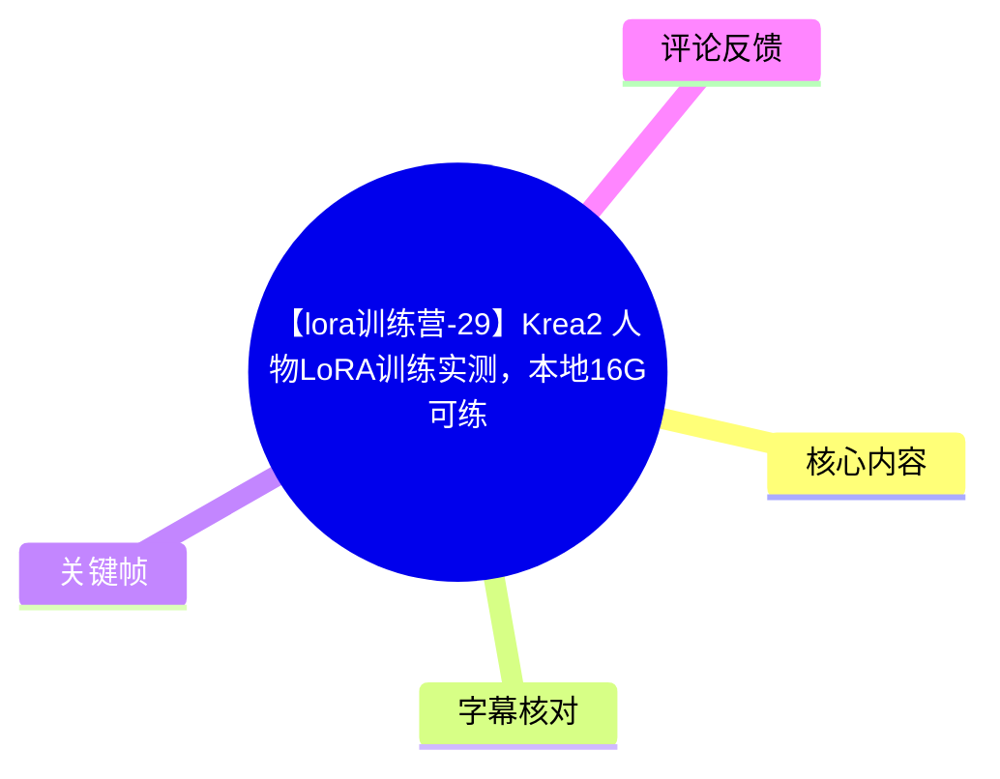
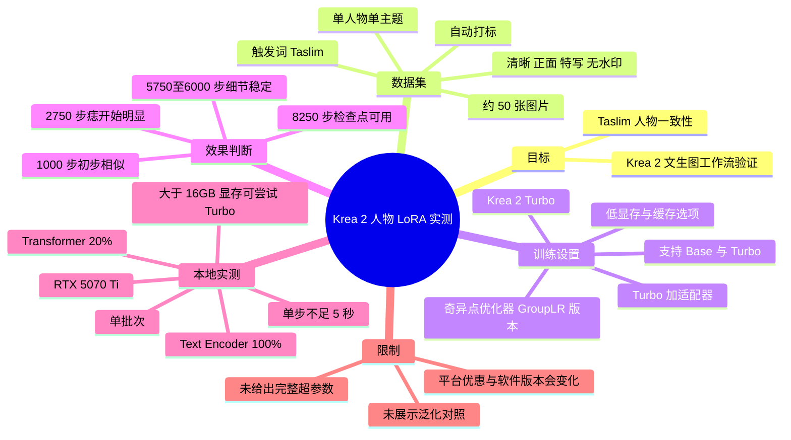
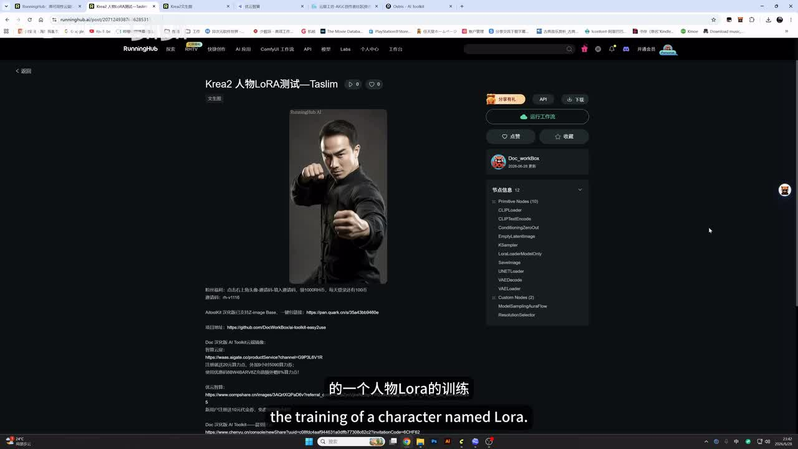
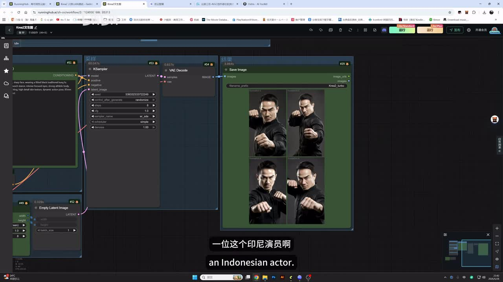
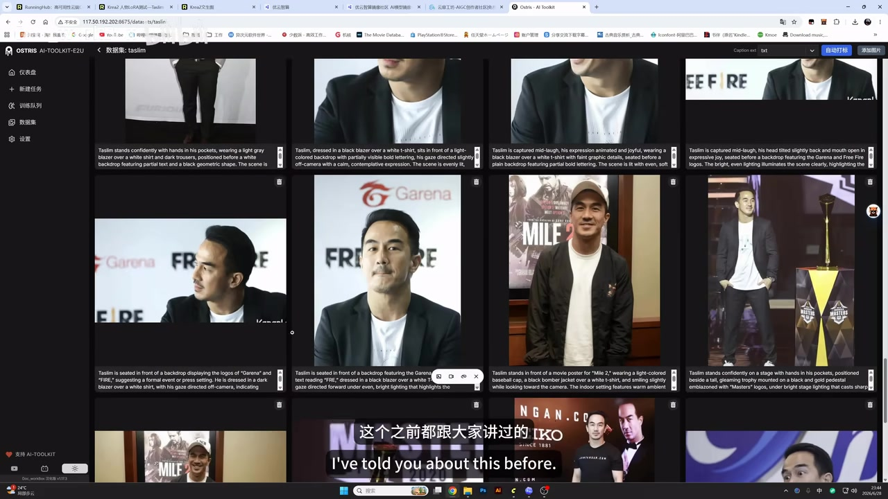
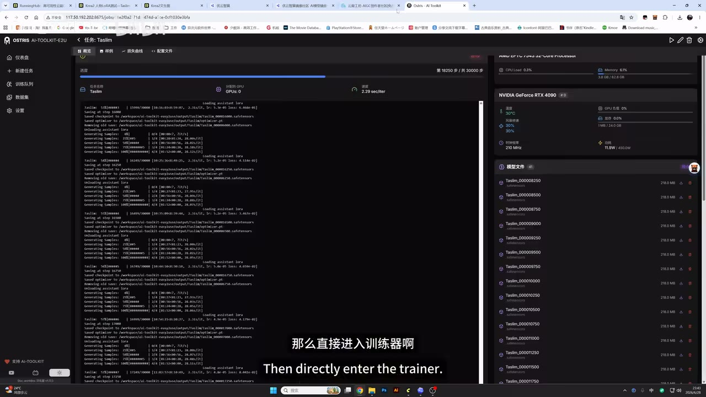

# 【lora训练营-29】Krea2 人物LoRA训练实测，本地16G可练

> 来源：[Bilibili 视频](https://www.bilibili.com/video/BV1AyT36tE1v) 
> UP 主：Doc_workBox｜时长：08:04｜分辨率：3840 × 2160｜合集：AIcode  
> 标签：教程、开源模型、LoRA 训练、RunningHub、AI Toolkit、人物 LoRA、Krea2、训练器、AIGC

## 小结

本期演示的是 **Krea 2 人物 LoRA** 的一次实测：UP 主以印尼演员 Taslim 为对象，使用约 50 张单人物图片训练，并在 Krea 2 的常规文生图工作流中加载训练结果验证人物一致性。视频核心结论是：在其所用训练器中，Krea 2 的 **Turbo 模型配合适配器**可用于人物 LoRA 训练，且相较 Base 模型具有更低显存占用的潜力。

数据集方面，视频强调素材应清晰、以正面和面部特写为主、尽量无水印，并且尽量维持“单一角色、单一主题”。自动打标后，UP 主只额外加入人物名 `Taslim`，将其作为触发词；其补充指令是“将图片中的男人称为 Taslim，不描述五官外貌”。

训练观察方面，UP 主没有只看整体“像不像”，而是以人物鼻侧的一颗痣作为细粒度拟合标志：约 1000 步时已有初步相似性，约 2750 步开始出现明显黑斑，约 5750～6000 步时该细节趋于稳定。因此，他认为该组数据约训练至 6000 步即可考虑停止；最终保留的最早可用检查点约为 8250 步，主观观察下未见明显过拟合。

本地可行性是视频的重要实测信息：UP 主使用 RTX 5070 Ti，在单批次训练时启用分层卸载，将 Transformer 设为 20%、Text Encoder 设为 100%，可以跑通 Krea 2 Turbo 训练；其口述单步约不足 5 秒。视频据此给出“显存大于 16GB 至少可运行 Turbo 版本”的经验判断，但这不是对全部硬件、分辨率、批量或配置的通用性能保证。

视频提到云端训练器入口、下载包与平台新用户优惠，但这些链接、积分、算力券、镜像内容和软件版本均具有强时效性。特别是优化器、Krea 2 模型适配方案及 AI Toolkit 的界面/参数可能随版本变化，复现前应以项目仓库、镜像说明和实际界面为准。

## 思维导图

## 目录

- [测试目标与工作流背景](#测试目标与工作流背景-0000)
- [训练器入口与数据集准备](#训练器入口与数据集准备-0110)
- [自动打标与触发词](#自动打标与触发词-0230)
- [Krea 2 Turbo 训练设置](#krea-2-turbo-训练设置-0300)
- [用微小特征判断训练进度](#用微小特征判断训练进度-0400)
- [本地 16GB 级显存实测与下载版本](#本地-16gb-级显存实测与下载版本-0640)
- [可复用步骤与检查清单](#可复用步骤与检查清单-0710)
- [结论、限制与时效性](#结论限制与时效性-0750)
- [字幕比对](#字幕比对)
- [评论分析](#评论分析)
- [处理记录](#处理记录)

## 测试目标与工作流背景 [00:00](https://www.bilibili.com/video/BV1AyT36tE1v?t=0)

视频开场说明主题为 Krea 2 的人物 LoRA 训练。UP 主先展示用于测试训练结果的工作流：这是一个普通的 Krea 2 文生图工作流，并在其中加入了训练得到的人物 LoRA。

本次训练对象为 `Taslim`。视频称其为一位印尼演员，并表示其曾出演近期热门电影《火遮炎》的男二号；该片名及角色信息来自口述 ASR，未在本素材中获得其他来源交叉验证，因此不作为训练方法的必要事实使用。训练任务本身是为该人物建立可通过触发词调用的形象 LoRA。

> 图：画面显示名为“Krea2 人物LoRA测试—Taslim”的页面及人物图像。它说明视频并非只讲参数，而是有预先准备的测试工作流和人物生成验证入口。

> 图：画面展示 Krea 2 节点式工作流与四张人物生成图。该帧的价值在于直观呈现 LoRA 被加载到常规生成流程后的测试形式：通过不同采样结果观察人物面部和整体身份是否稳定。

视频描述中还提供了模型、工作流和工具的下载/项目入口，包括夸克网盘链接、AI Toolkit Easy2Use GitHub 项目、云端镜像与 LO STUDIO 画布。这些属于作者发布时提供的外部资源，不代表本记录已验证其可访问性或内容安全性。

## 训练器入口与数据集准备 [01:10](https://www.bilibili.com/video/BV1AyT36tE1v?t=70)

UP 主说明训练器可在“优云智算”和“云扉工坊”中找到：

1. 在优云智算中进入“镜像社区”；
2. 选择 LoRA 训练相关镜像，寻找其训练器；
3. 云扉工坊的操作逻辑类似：进入工坊首页后，通过菜单找到训练器；
4. 进入训练器后，先转到数据集页面。

视频未给出完整 URL 操作过程、镜像版本号、价格、GPU 型号选择规则或云端完整配置，因此这些平台入口只能作为定位线索，不能据此推导固定的部署方案。

数据集共使用 **50 张图片**。素材类型包括人物杂志图片、其他人物材料及影视剧截图等；共同特点是主要围绕同一个人物，且画面中尽量只有该角色。UP 主提出的数据集筛选原则包括：

| 项目 | 视频中的建议 | 目的 |
| --- | --- | --- |
| 数量 | 本次实测 50 张 | 为单人物训练提供样本集合；视频未将 50 张定义为通用最低数量 |
| 清晰度 | 需要有一定清晰度 | 降低模糊素材对脸部细节学习的干扰 |
| 视角 | 正面居多 | 增强正脸身份特征的覆盖 |
| 构图 | 面部特写较多 | 让模型更容易学习脸部关键特征 |
| 水印 | 最好没有水印 | 避免水印被学入生成图 |
| 主体一致性 | 以单人物、单主题图片为主 | 降低身份、服装、场景等因素混杂 |

> 图：画面为训练器的数据集管理界面，展示多张同一人物素材及其英文描述。该帧能够对应“单人物、多姿态、多来源材料”的数据集组成，也能说明打标文本会与图片一并进入训练流程。

需要注意的是，“正面更多、特写更多、无水印”的建议是 UP 主在本次人物 LoRA 场景下的经验，并非所有训练任务的唯一数据分布。若目标还要求侧脸、远景、复杂表情或不同服装的可控生成，则数据中也应有针对性覆盖；这属于从视频原则延伸出的实践提醒，视频没有给出比例参数。

## 自动打标与触发词 [02:30](https://www.bilibili.com/video/BV1AyT36tE1v?t=150)

视频使用训练器内置的自动打标功能。UP 主没有详细展开每张图片的标签清洗过程，而是说明只补充了人物名称 `Taslim`，将其用作模型调用时的触发词。

其展示的打标补充思路可归纳为：

- 将图片中的男人称为 `Taslim`；
- **不要描述**人物的五官与外貌；
- 其余图像内容由自动打标功能处理。

这里的关键是将“身份绑定”与“外貌文本描述”区分开：UP 主希望 `Taslim` 作为身份标识被模型学习，而非通过大量固定的五官文字反复约束人物外观。视频没有展示完整原始提示词、自动标签模型版本、语言设置、标签格式或是否进行了逐图修订，因此无法据此复刻完全相同的 caption 输出。

## Krea 2 Turbo 训练设置 [03:00](https://www.bilibili.com/video/BV1AyT36tE1v?t=180)

视频称当前训练器支持对 Krea 2 的 **Base（底模）**和 **Turbo**模型分别进行训练。按 UP 主口述，通常意义上训练 LoRA 会选择 Base 模型；但 AI Toolkit 作者 Ostris 为 Krea 2 Turbo 做了适配器，思路与此前 Z-Image Turbo 训练适配相近。

UP 主的解释是：对 Turbo 模型配合适配器进行训练，意在避免“蒸馏模型”在训练中丢失其蒸馏相关特性；这种方案可能得到不弱于、甚至优于 Base 训练的效果，同时显存占用相较 Base 更低。这里的“可更好”和“更低”是视频中对该适配方案的技术判断，本素材未提供同一数据集、同一提示词、同一训练预算下的 Base/Turbo 对照数据，不能视为已量化结论。

本次实测的可确认设置如下：

| 配置项 | 视频选择/说明 |
| --- | --- |
| 基础模型路线 | Krea 2 Turbo |
| 支持范围 | 训练器支持 Base 与 Turbo |
| Turbo 适配 | 使用面向 Turbo 的适配器思路 |
| 优化器 | 奇异点优化器（ASR 中对应名称可能有识别误差） |
| 优化器版本 | GroupLR，即“组学习率”版本 |
| GroupLR 的口述特性 | 相比原版更保守、学习率调整频率更低、没那么激进 |
| 训练速度判断 | UP 主称该优化器可能略提高训练速度，但仍在测试 |
| 其他参数 | 基本保持默认 |
| 显存优化 | 开启低显存、缓存文本编码，以及缓存潜变量相关选项 |

关于 GroupLR，视频只是介绍其理念和作者的初步判断，并未提供具体学习率、权重衰减、rank、alpha、batch size、分辨率、epoch、保存间隔、随机种子或 scheduler 参数。因此，不能将“使用 GroupLR”简化成可保证速度和泛化的配方。

> 图：画面显示训练日志正在输出、右侧有 GPU 状态和多份检查点文件。它有助于理解视频后续为何能按步数回看模型：训练过程中会保存多个阶段性结果，供对比人物细节的学习程度。

## 用微小特征判断训练进度 [04:00](https://www.bilibili.com/video/BV1AyT36tE1v?t=240)

UP 主将人物鼻子旁的一颗痣作为判断拟合程度的重要细节。该方法的逻辑是：整体脸型开始相似，并不代表身份细节已充分学到；痣、细小疤痕等稳定且具有辨识度的局部特征，可作为检查模型是否真正掌握人物细节的观察点。

视频口述的阶段性观察如下：

| 训练步数 | 观察结果 | 解读 |
| --- | --- | --- |
| 约 1000 步 | 面部已有一定相似性 | 已出现初步身份趋近，但细节尚不足 |
| 约 2750 步 | 鼻侧开始出现较明显黑斑 | 代表目标微小特征开始被学到 |
| 约 3000 步 | 该细节继续逐渐呈现 | 可继续比较稳定性 |
| 约 5750～6000 步 | 痣趋于稳定 | UP 主认为此时基本拟合，可考虑收训 |
| 约 8250 步 | 最早仍保存下来的检查点 | UP 主主观评价效果不错，未见明显过拟合 |

UP 主原计划从更早阶段的检查点中挑选，但因夜间启动训练、早晨查看较晚，前面部分检查点已被覆盖，最终只能选择约 8250 步的最早留存结果。这个过程提示：如果要严格比较训练曲线，应提前确认**保存间隔、保留数量和覆盖策略**，否则关键的中间模型可能无法回溯。

“6000 步左右可以收”的结论仅适用于本视频的 Taslim 数据集、训练器、模型路线和观察标准。训练步数不能脱离数据量、重复次数、分辨率、batch、优化器与目标泛化能力单独迁移。尤其热评中已有用户对“拟合太快会损伤泛化”提出质疑，视频本身没有通过不同场景、不同服装、不同提示词或留出集做系统泛化评测。

## 本地 16GB 级显存实测与下载版本 [06:40](https://www.bilibili.com/video/BV1AyT36tE1v?t=400)

针对用户认为包含全部模型的训练器下载体积过大的问题，UP 主表示提供了多种包体选择，包括：

- 包含完整打标模型的版本；
- 不含基础模型、可由用户自行下载模型的版本；
- 体积较小的版本，视频口述约为 **3.9GB**。

这些包的具体文件名、校验值、依赖版本与下载时可用性未在素材中完整展示；应优先通过视频简介中的项目地址核实。

本地测试硬件为 **RTX 5070 Ti**。UP 主表示，在“单批次训练”前提下，采用以下分层卸载设置可运行：

| 项目 | 本次实测值 |
| --- | --- |
| 显卡 | NVIDIA GeForce RTX 5070 Ti |
| 训练批次 | 单批次 |
| Transformer 分层卸载比例 | 20% |
| Text Encoder 分层卸载比例 | 100% |
| 单步耗时 | 约 5 秒以内 |
| 结论 | 可跑通 Krea 2 Turbo 人物 LoRA 训练 |

UP 主进一步表示，显存大于 16GB 的本地设备“至少 Turbo 版本可以跑得动”。这里应严格理解为一次特定环境下的经验门槛，而不是“16GB 显存一定可训练”的承诺。显存实际占用还会随驱动、PyTorch/CUDA 版本、模型文件、图像尺寸、批量、缓存配置、系统后台显存和训练器版本变化。

## 可复用步骤与检查清单 [07:10](https://www.bilibili.com/video/BV1AyT36tE1v?t=430)

以下流程按视频实际讲解顺序整理，并明确区分“视频已说明”与“需自行确认”的部分。

### 1. 准备测试工作流

- 使用普通 Krea 2 文生图工作流；
- 预留 LoRA 加载位置；
- 在训练前后使用尽量一致的工作流进行人物一致性测试。

视频展示了生成结果，但没有给出完整提示词、采样器参数、CFG、种子、尺寸或 LoRA 权重。因此，若要横向比较不同步数的 checkpoint，应自行固定这些推理变量。

### 2. 整理人物数据集

- 准备约 50 张同一人物素材作为本次规模参考；
- 保证图片清晰；
- 让正面和面部特写占较大比例；
- 尽量移除水印；
- 优先选单人物、单主题画面；
- 保留一定姿势、场景和素材来源变化，以避免训练素材过度单一。

### 3. 自动打标并设定触发词

- 运行训练器的自动打标；
- 增加人物名 `Taslim`；
- 不额外描述人物五官外貌；
- 以该名字作为后续触发词。

如果训练其他人物，视频提供的是方法结构而不是固定词：应将 `Taslim` 替换为自定义、低冲突的人物触发词，并检查其是否与常见词或其他角色名称混淆。

### 4. 配置训练

- 模型路线选择 Krea 2 Turbo；
- 使用适配器方案；
- 采用视频所称的奇异点优化器 GroupLR 版本；
- 其他项目保持默认；
- 打开低显存、缓存文本编码和缓存潜变量相关功能。

由于缺少完整配置导出文件，建议在开始前截图或导出自己的配置，至少记录模型版本、分辨率、batch、学习率、保存间隔、数据重复和显存卸载策略。

### 5. 分阶段评估，而非只看最终模型

- 约 1000 步起观察整体脸部相似性；
- 继续检查可辨识的小特征，例如痣、小疤痕等；
- 当关键细节出现且稳定时，结合多种提示词查看是否需要继续；
- 本例中 UP 主将约 5750～6000 步视为可能的收训区间；
- 避免因检查点覆盖而丢失关键阶段结果。

### 6. 本地显存不足时的处理方向

- 优先尝试 Turbo 路线；
- 降至单批次训练；
- 使用 Transformer 20%、Text Encoder 100% 的分层卸载设置作为视频实测起点；
- 开启视频提到的低显存与缓存选项；
- 在自身设备上实测单步耗时、显存峰值与稳定性。

## 结论、限制与时效性 [07:50](https://www.bilibili.com/video/BV1AyT36tE1v?t=470)

本视频提供了一个清晰的人物 LoRA 判断框架：**先用干净、聚焦的单人物数据建立身份基础，再以微小且稳定的个人特征检查训练是否到位，而不是仅凭“整体像”决定继续训练。** 对人物脸部存在痣、疤痕或其他稳定标志的素材，这种评估方式具有直接可迁移性。

技术路线上的核心经验是：Krea 2 Turbo 通过适配器训练，可能在降低显存占用的同时保留较好的训练效果；UP 主实际跑通了 RTX 5070 Ti 的单批次训练。但其结论属于单次实测，没有展示与 Base 的严格对照，也没有给出完整训练参数和多场景泛化测试。

需要特别保留的限制包括：

1. **缺少完整超参数**：视频未公开学习率、rank、alpha、图像分辨率、数据重复、保存频率等决定训练结果的配置。
2. **缺少客观评估**：人物相似度和过拟合判断主要基于观察，没有留出验证集或定量指标。
3. **步骤数不能照搬**：6000 步是本例经验值，不是任何 50 张人像都适用的终止步数。
4. **本地门槛是条件化结论**：大于 16GB 显存可尝试 Turbo，依赖单批次、卸载比例和软件环境；并不覆盖 Base 模型或更高分辨率任务。
5. **资源与优惠具有时效性**：视频简介中的 RunningHub 积分、新用户 RH 币、云平台代金券、算力券、充值优惠码、下载包和镜像地址均可能在后续失效或变更。
6. **术语需以原界面为准**：ASR 对“Krea / Crea / Korea”“LoRA / RORA”等专有名词有误识别；本记录依据视频标题、标签和画面中的 Krea2、AI Toolkit 页面统一校正为 Krea 2 与 LoRA。

## 字幕比对

| 字幕来源 | 完整性 | 专有名词 | 时间轴 | 主要问题 |
| --- | --- | --- | --- | --- |
| Bilibili 站内字幕 | 不可用 | 无法评估 | 无法评估 | 素材处理阶段返回“Missing JSON resource URL”，未提供可用站内字幕 |
| 本次 ASR 字幕 | 覆盖了开场、数据集、训练设置、评估、本地测试和结尾 | 存在较多音近误识别 | 未提供逐句时间戳 | `Krea` 被识别为“Crea / Korea / Kryo”，`LoRA` 被识别为“Laura / RORA”，部分平台、片名和优化器名称不稳定 |

本次任务**已经执行 ASR**。由于站内字幕不可用，正文以本次 ASR 为主，并结合视频标题、标签、视频简介、关键帧中的界面文字和上下文进行有限校正。

重要校正包括：

| ASR 表述 | 正文采用 | 校正依据 |
| --- | --- | --- |
| Crea2 / Korea 2 / Kryo2 | Krea 2 | 视频标题、标签及关键帧页面标题均指向 Krea2 |
| Laura / RORA | LoRA | 标题、标签“lora训练”“人物LoRA”及上下文 |
| Taslim | Taslim | 关键帧页面标题“Krea2 人物LoRA测试—Taslim” |
| AI toolkit | AI Toolkit | 视频简介项目名称与关键帧界面 |
| “优云直算”等 | 优云智算 | 视频简介中的云端镜像说明；ASR 存在同音偏差 |

由于 ASR 没有逐句时间码，本文各章节时间轴按照视频内容的叙述顺序、全片时长和关键帧所示阶段进行定位，适用于快速跳转，不应视为逐字稿级精确切分。

## 评论分析

仅处理本次可获取的热评前三条。三条评论点赞数均为 0，不能据此判断观点代表性。

### 1. 人像训练出现“中间真人、前后卡通”

- 评论者：原始小咖啡  
- 原话要点：“为什么我训练人像，除了中间是真人，前后都是卡通？”
- 反映的问题：生成序列或结果中，只有中间部分保持真人写实感，而首尾趋向卡通风格。
- 与视频的关联：视频强调使用单人物、清晰、正面、特写、无水印的数据，并以 Krea 2 Turbo 路线训练；但没有直接解释写实/卡通风格漂移的原因。
- 可验证性：该现象来自单个用户描述，未提供模型、底模、提示词、数据集、训练步数或输出图，无法确认是数据混入、底模风格、提示词、LoRA 权重还是训练不足/过拟合导致。应将其作为待排查案例，而非视频方法已经证明的结论。

### 2. Raw 训练找不到 `Qwen3-VL-4B-Instruct`

- 评论者：火金土土  
- 原话要点：下载全量模型后，训练时找不到 `Qwen3-VL-4B-Instruct`，并报错：本地路径 `./models/Qwen3-VL-4B-Instruct` 不符合 Hugging Face `repo_id` 格式。
- 反映的问题：训练器/依赖可能未正确识别本地模型路径，转而将路径当作 Hugging Face 仓库 ID 解析。
- 与视频的关联：视频提到训练器有全量模型版和不含基础模型版，也涉及内置自动打标；评论中的 Qwen3-VL 模型可能与该工具链或 Raw 训练模式有关，但视频未展示此错误、未讲 Raw 训练，也未提供修复方案。
- 可信度与边界：评论粘贴了具体报错，信息量较高；但没有环境版本、启动方式、目录结构或配置文件，不能断定根因。排查时应以项目文档确认模型路径字段究竟要求本地目录还是 Hugging Face 仓库名，并核对模型是否完整下载。

### 3. “拟合太快可能意味着泛化差”

- 评论者：积雨空林2017  
- 原话要点：认为拟合度太快时泛化性可能较差，且与优化器选择有一定关系。
- 与视频的关联：视频确实在约 1000 步观察到初步相似、在 2750 步看到关键细节，并认为约 6000 步可收训；同时使用了 GroupLR 版本优化器。该评论对“快速拟合”的泛化风险提出了合理质疑。
- 可信度与边界：这是经验性观点，不是评论中给出的实验证据。“拟合快必然泛化差”属于过强表述：泛化还取决于数据多样性、标注策略、训练预算、LoRA 容量、底模与推理提示词。视频也没有通过留出集或多条件生成来验证泛化，因此该疑问仍未被素材解决。

## 处理记录

- Worker ID：`worker-mrj0www4-e8d79408`
- 模型：`gpt-5.6-terra`
- 使用的素材与工具结果：视频元数据、视频简介、关键帧、可获取热评前三条、本次 ASR 文本；素材产物包含 `merged.mp4`、`audio/audio.wav`、`frames/`、`comments/comments.json` 与 `asr/`。
- 字幕选择：已执行本次 ASR；站内字幕获取失败，错误为 `Missing JSON resource URL`，因此未使用站内字幕。正文采用 ASR，并以标题、标签、简介、关键帧和上下文校正明显专名误识别。
- 关键帧选择依据：
  - `frames/frame-001.jpg`：展示 RunningHub 的 Taslim 人物 LoRA 测试页面，适合说明测试目标；
  - `frames/frame-002.jpg`：展示 Krea 2 工作流和四宫格生成结果，适合说明训练结果的推理验证；
  - `frames/frame-003.jpg`：展示训练日志、GPU 状态和检查点列表，适合说明训练过程与步数模型保存；
  - `frames/frame-004.jpg`：展示数据集图像与 caption，适合说明数据准备和自动打标。
- 缓存清理：未提供可验证的缓存清理执行日志；仅依据素材清单完成整理，不能声称已执行文件级缓存删除。
- 未解决问题：
  - ASR 未提供逐句时间码，章节秒数为按内容顺序定位；
  - 训练的完整超参数、实际显存峰值、模型版本和 Base/Turbo 对照结果未在素材中给出；
  - 评论中的卡通化与 Qwen3-VL 本地路径报错未在视频内得到直接解答。
