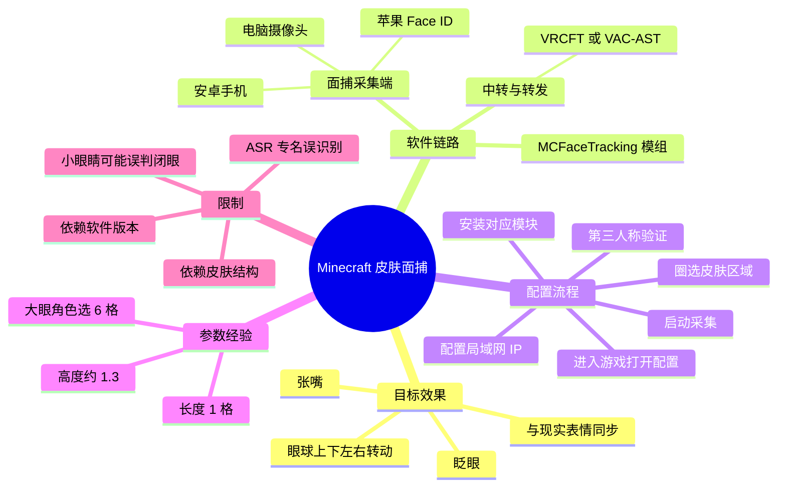
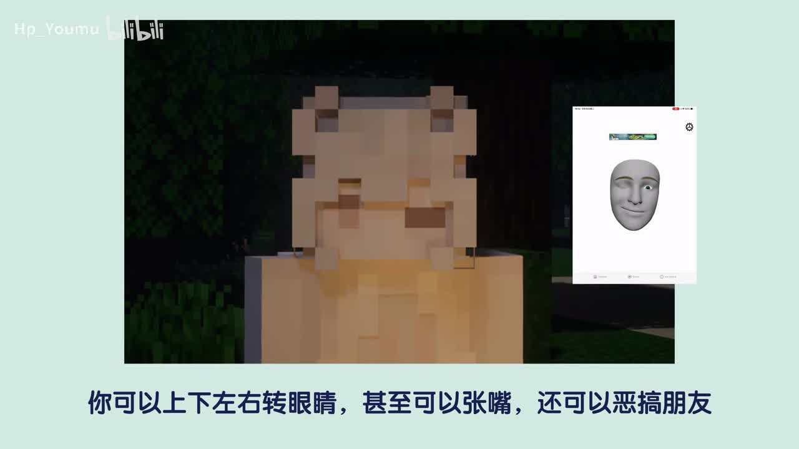
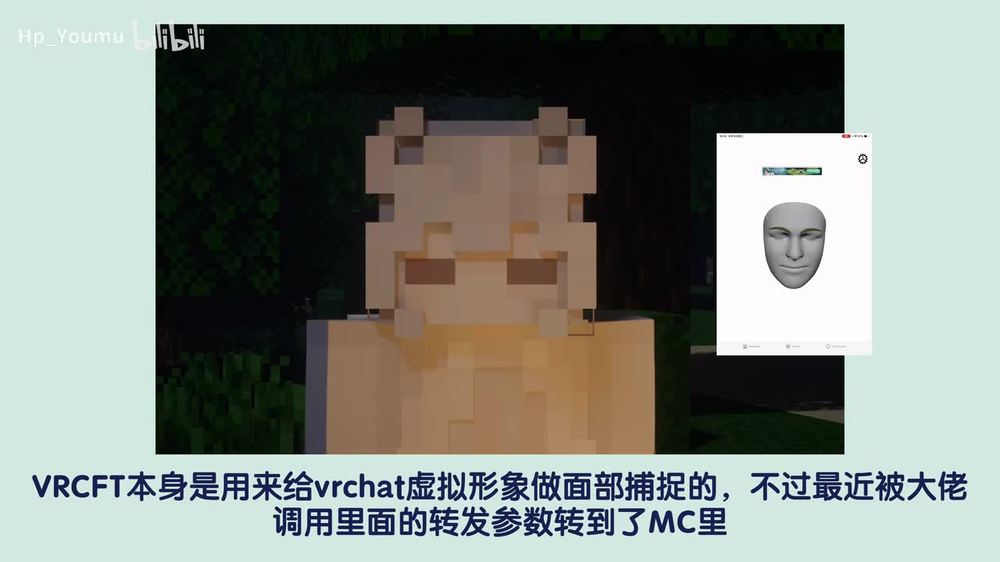
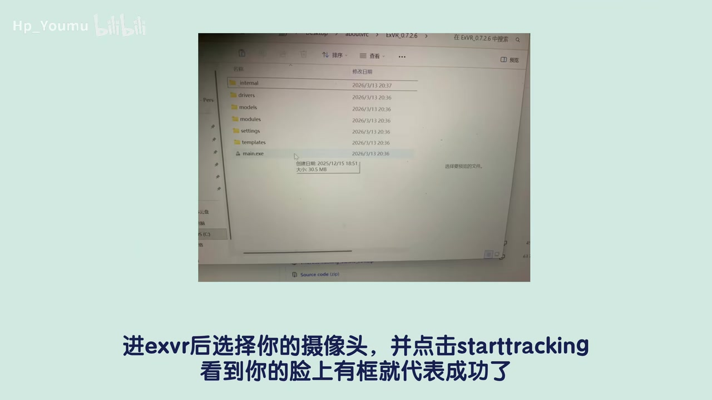

# 「模组推荐」神了！这个模组可以让你控制皮肤表情！

> 来源：[Bilibili 视频](https://www.bilibili.com/video/BV1L6jV63EkQ)  
> UP 主：雫雨aqua ｜ 发布时间：2026-06-16 ｜ 视频时长：02:56  
> 视频简介提供的模组发布页：[MCFaceTracking v1.0.4.6](https://github.com/squi2rel/MCFaceTracking/releases/tag/v1.0.4.6)

## 小结

视频推荐的是 Minecraft 皮肤面部追踪模组 **MCFaceTracking**（口播 ASR 将其多次误识别为“MIC”“MST”“ML4T”等）。它将现实中的面部捕捉数据转入 Minecraft，使角色皮肤能够表现眼球上下左右转动、眨眼和张嘴等效果；演示画面显示，游戏内方块化角色可随外部面捕窗口同步改变眼睛状态。

实现链路可概括为：**摄像头或手机采集人脸 → 面捕软件输出数据 → VRCFT/VAC-AST 类中转软件接收或转发 → Minecraft 内 MCFaceTracking 模组读取并驱动皮肤区域**。视频将采集端分为两类：电脑摄像头/安卓手机，以及具备 Face ID 的苹果设备；后者被作者主观评价为效果更好。

实际配置的关键不在于只安装模组，而在于让采集端、中转端和游戏端同时保持工作。安卓或电脑摄像头路线需要安装画面中写作 **EXVR** 的程序，选择摄像头并点击 `Start Tracking`；苹果 Face ID 路线则涉及名为 **iFacialMocap P2**（ASR 识别不稳定）的手机应用，并要填写电脑局域网 IP。

游戏内还必须逐格圈定皮肤的眼睛、眼珠及整体区域。视频给出的经验参数是：大眼角色整体选区通常为 **6 格**；眼睛建议使用“圆版位置”（原视频用词，具体界面名称应以实际版本为准）；长度设为 **1 格**、高度约 **1.3**。配置后可在“自动眨眼”界面检查，并切换第三人称观察效果。

本视频适合希望为 Minecraft 角色加入虚拟主播式面部表情、使用自定义皮肤且愿意进行本地软件与局域网配置的玩家。其局限在于：软件名称、模块名称和命令在 ASR 中存在较多误识别；不同版本的模组、面捕软件及皮肤结构可能导致菜单、命令或参数不一致，应以视频简介中的 GitHub Release 和实际软件界面为准。

## 思维导图

## 目录

- [功能与适用条件](#功能与适用条件-0000)
- [面捕数据如何进入 Minecraft](#面捕数据如何进入-minecraft-0010)
- [采集端选择：摄像头、安卓与 Face ID](#采集端选择摄像头安卓与-face-id-0028)
- [中转软件与局域网配置](#中转软件与局域网配置-0106)
- [游戏内皮肤区域配置](#游戏内皮肤区域配置-0136)
- [验证效果与排障思路](#验证效果与排障思路-0215)
- [结论与限制](#结论与限制)
- [字幕比对](#字幕比对)
- [评论分析](#评论分析)
- [处理记录](#处理记录)

## 功能与适用条件 [00:00](https://www.bilibili.com/video/BV1L6jV63EkQ?t=0)

视频开头直接展示效果：Minecraft 角色的眼部可同步现实中的眼球方向，且支持张嘴、眨眼等面部变化。作者以“恶搞朋友”为例说明该效果具有较强的社交展示属性，但这属于用途示例，不代表模组只限于此类使用。

从视频简介可核对，推荐的项目发布页为 **MCFaceTracking v1.0.4.6**。视频口播中的模组名称被 ASR 记录为“MST”“ML4T”等，但与简介提供的 GitHub 链接不一致，因此正文以简介中可验证的项目名 **MCFaceTracking** 为准。

> 图：画面左侧为 Minecraft 角色，右侧是灰色人脸模型的面捕界面；角色眼睛与外部人脸眼部状态同步变化。这是理解“现实面部输入驱动游戏皮肤”的核心演示证据。

### 前置条件

1. 已安装支持该模组的 Minecraft 客户端与对应模组加载环境；视频未明确说明具体 Minecraft 版本、加载器或服务端要求。
2. 有可用的人脸采集设备：电脑摄像头、安卓手机摄像头，或具有 Face ID 功能的苹果设备。
3. 能够在电脑上运行面捕与中转软件。
4. 使用可供配置眼部区域的自定义皮肤；皮肤眼睛结构会影响选区与最终效果。
5. 若采用手机向电脑传输数据，应确保设备与电脑的网络条件满足连接需求。视频在苹果路线中明确涉及电脑 IP 填写。

## 面捕数据如何进入 Minecraft [00:10](https://www.bilibili.com/video/BV1L6jV63EkQ?t=10)

作者说明，该方案并非由 Minecraft 直接读取摄像头，而是借用了原本用于 VRChat 虚拟形象面部捕捉的软件或其转发参数，再将数据接入 Minecraft。画面字幕将中转工具写作 **VRCFT**；ASR 将其多次识别为“VAC-AST”，两者无法仅凭现有文本完全确认是否为同一工具的不同读法或版本名称。

能够确定的是，该中转环节承担两个职责：

- 接收不同来源的脸部追踪数据；
- 将追踪数据转发给 Minecraft 侧模组使用。

> 图：该关键帧中的画面字幕明确表达“用于给 VRChat 虚拟形象做面部捕捉”的软件，其“转发参数”被用于 Minecraft。它补足了 ASR 中专有名词不稳定的背景信息，并说明该方案的技术来源。

### 数据路径的实际含义

- **采集端**：获得用户的面部、眼睛或口部状态。
- **中转端**：加载适配采集来源的模块，并使追踪数据可供后续程序读取。
- **Minecraft 模组端**：将收到的状态映射为皮肤上的像素/格子区域变化。

这也解释了为什么最终演示前，作者强调面部软件和中转软件都要处于开启状态：只打开游戏内模组并不会生成面捕数据。

## 采集端选择：摄像头、安卓与 Face ID [00:28](https://www.bilibili.com/video/BV1L6jV63EkQ?t=28)

### 路线 A：电脑摄像头或安卓手机 [00:33](https://www.bilibili.com/video/BV1L6jV63EkQ?t=33)

作者面向“只有电脑摄像头”或“拥有安卓手机”的用户，建议在电脑下载一个画面中显示为 **EXVR** 的软件。ASR 分别识别为“ELECT VR”“EXVR”，关键帧底部字幕和窗口文件夹名称均更接近 `EXVR`，故本文保留这一写法，但不将其扩展为未经素材证实的完整产品名称。

安卓手机路线还需要借助 Wi‑Fi 摄像头类软件，将手机摄像头作为电脑可访问的视频源。视频没有给出具体 App 名称、连接协议、端口或网络权限设置，因此这些部分不能据此推断。

### 在 EXVR 中启动跟踪 [00:45](https://www.bilibili.com/video/BV1L6jV63EkQ?t=45)

操作顺序如下：

1. 打开 EXVR。
2. 在软件内选择当前可用的摄像头。
3. 点击 `Start Tracking`。
4. 观察脸部是否出现识别框；作者以“脸上有框”作为启动成功标志。

> 图：画面展示 EXVR 文件夹窗口，底部字幕明确给出“选择你的摄像头，并点击 Start Tracking；看到你的脸上有框就代表成功了”。它为采集端软件名称与成功判据提供了直接画面依据。

### 路线 B：具备 Face ID 的苹果设备 [00:51](https://www.bilibili.com/video/BV1L6jV63EkQ?t=51)

作者推荐 iOS 用户使用名为 **iFacialMocap P2** 的免费软件；ASR 写作“iFacial Mocha P2”“iFace MochaP”，其拼写存在明显偏差，正文按常见产品名作保守校正，但未获得站内字幕或软件界面的进一步验证。

视频声称，该路线依赖苹果 Face ID 的激光建模能力，并认为其效果优于普通摄像头。这里应区分：

- **可确认的内容**：作者推荐具备 Face ID 的设备，并将其用于面部追踪。
- **作者主观判断**：其称该方案效果“吊打所有其他摄像头”。
- **不能从素材确认的内容**：实际精度、延迟、适配机型范围及与每一种摄像头的量化比较。

## 中转软件与局域网配置 [01:06](https://www.bilibili.com/video/BV1L6jV63EkQ?t=66)

作者接着进入中转软件设置。由于 ASR 对软件和模块名的识别不可靠，下面保留视频所传达的操作结构，同时对专名标注不确定性。

### 摄像头/安卓路线：安装对应模块 [01:08](https://www.bilibili.com/video/BV1L6jV63EkQ?t=68)

对于安卓或电脑摄像头用户，作者要求在中转软件左侧下载区域找到一个被 ASR 识别为 **MediaPro** 的模块，执行连接/安装操作后重启应用。

视频没有提供该模块的精确英文拼写、下载地址、版本号或安装失败时的处理方法。若实际软件中不存在该名称，应优先以所安装中转软件的官方模块列表及 MCFaceTracking 项目文档为准，不应机械按 ASR 拼写搜索。

### Face ID 路线：安装 iFacialMocap 相关模块 [01:16](https://www.bilibili.com/video/BV1L6jV63EkQ?t=76)

iOS 用户需要在同一区域安装与 iFacialMocap 对应的模块，安装后同样重启中转软件。该步骤的关键是让中转端能够接收手机传来的面捕数据，而不是仅在手机上单独运行面捕应用。

### 查询并填写电脑 IP [01:21](https://www.bilibili.com/video/BV1L6jV63EkQ?t=81)

作者要求在 Windows `CMD` 中输入一条用于查询当前 IP 的命令；ASR 识别为“IPCO ENVIC”，显然无法作为可信命令直接执行。视频未提供足够清晰的命令画面，因此不能将 ASR 文本当成有效指令。

可从视频流程确认的操作意图是：

1. 在电脑上查询局域网 IP 地址。
2. 在 iFacialMocap P2 的设置页面填写该电脑 IP。
3. 回到中转软件，确认相关模块已可用或已连接。

> 注意：视频没有交代 IP 字段是否还需要端口号、手机和电脑是否必须连接同一 Wi‑Fi、是否需要放行防火墙。这些通常会影响局域网连通性，但均不应被误写为视频已明确给出的步骤。

### 配置完成的判据 [01:31](https://www.bilibili.com/video/BV1L6jV63EkQ?t=91)

作者的完成判据是：回到中转软件后，能看到对应模块已经“可用”或正常工作。由于 ASR 对这一句中的用户类型和界面状态识别不清，建议实际操作时以模块状态、是否收到面捕数据以及游戏内最终响应为联合判断，而不是只依赖单一文字提示。

## 游戏内皮肤区域配置 [01:36](https://www.bilibili.com/video/BV1L6jV63EkQ?t=96)

### 打开 MCFaceTracking 配置菜单 [01:39](https://www.bilibili.com/video/BV1L6jV63EkQ?t=99)

安装 MCFaceTracking 模组后进入游戏。作者表示需要输入一条与模组名相关的命令来打开配置菜单，但 ASR 将命令识别为 `ML4t`，与可核对的模组项目名不匹配。

因此，本素材只能确认：

- 需要在游戏中通过命令打开配置菜单；
- 命令与 MCFaceTracking 模组有关；
- **无法根据 ASR 可靠地确认命令完整拼写及是否需要斜杠前缀**。

建议直接查阅 MCFaceTracking v1.0.4.6 的发布说明、模组内提示或命令补全结果，以实际版本为准。

### 圈选皮肤眼部区域 [01:45](https://www.bilibili.com/video/BV1L6jV63EkQ?t=105)

作者开始手把手演示皮肤部位选择。核心原则如下：

1. 不需要、也无法在普通选择步骤中一次选中“两只眼睛”。
2. 仅在添加左、右眼珠时选择“双眼”。
3. 之后继续进行整体区域的框选。
4. 配置完成后，在自动眨眼界面检查区域映射是否正确。

这里的“无法选上”描述的是作者所展示界面的操作限制，不应泛化为所有版本都绝对不支持双眼选择。对于不同皮肤布局，眼睛、眼白、瞳孔和眼睑的像素区域需按实际模型重新圈定。

### 视频给出的参数经验 [01:58](https://www.bilibili.com/video/BV1L6jV63EkQ?t=118)

| 配置项 | 视频建议 | 适用说明 |
| --- | --- | --- |
| 整体选区 | 大眼角色一般选 **6 格** | 仅为作者对“大眼角色”的经验值，不保证适合所有皮肤。 |
| 眼睛位置 | 推荐改为“圆版位置” | 原词可能受 ASR 影响，具体选项名称需以模组界面为准。 |
| 长度 | **1 格** | 视频给出的起始参数。 |
| 高度 | **约 1.3** | 视频给出的推荐值，可随皮肤比例调整。 |
| 校验位置 | 自动眨眼界面 | 用于确认选择区域与眨眼效果是否匹配。 |

这些参数的本质是把外部面捕的抽象眼部状态，映射到二维皮肤上的可变化区域。皮肤眼睛越小、越细或图案越复杂，越可能出现难以区分睁眼与闭眼、瞳孔偏移或选区不对齐的情况。

## 验证效果与排障思路 [02:15](https://www.bilibili.com/video/BV1L6jV63EkQ?t=135)

完成皮肤设置后，作者点击完成并开启第三人称视角。此时还需确认：

- 面部采集软件保持运行；
- 中转软件保持运行；
- 游戏已完成模组内映射配置；
- 第三人称下角色的眨眼等状态能随现实表情变化。

作者最终展示了角色随现实状态眨眼的结果。此处的验证不只是“游戏里有眼睛动画”，而是要确认外部面部状态与角色变化之间存在同步关系。

### 建议按链路定位故障

视频未系统讲述故障排查，以下仅将其已展示的链路转换为检查顺序，不额外假定具体软件机制：

1. **采集端无脸框或无面部模型反应**：先检查摄像头选择、采集端是否已点击开始追踪。
2. **采集端有反应，中转端没有模块可用状态**：检查模块是否完成安装并重启应用。
3. **iOS 端无法与电脑联动**：重新确认填写的是电脑当前局域网 IP；视频没有提供端口或防火墙方案，需查相应软件文档。
4. **中转端正常，但游戏内不响应**：确认 MCFaceTracking 模组已加载、配置菜单中的皮肤区域已保存、相关软件没有被关闭。
5. **角色始终闭眼或眨眼异常**：重新检查眼部选区、自动眨眼界面的映射结果，以及皮肤眼睛是否过小。

## 结论与限制

该视频的价值在于给出一条可复现的思路：将原本服务于虚拟形象的面捕数据转接到 Minecraft，并由皮肤区域映射获得更具表现力的角色表情。对于想做 Minecraft 虚拟主播形象、录制剧情或与朋友互动的玩家，这比固定贴图眼睛提供了更强的实时性。

但复现时不应把视频中的口播字符串逐字视作命令或软件名。当前素材没有可用的 Bilibili 站内字幕，而 ASR 对专有名词误识别明显，尤其涉及模组名、VRCFT/VAC-AST、EXVR、iFacialMocap、模块名和 CMD 命令。可验证信息应优先采用视频简介给出的 GitHub 项目链接与实际界面文字。

时效性方面，视频发布于 2026-06-16，简介链接指向 **MCFaceTracking v1.0.4.6**。模组版本、依赖软件的模块列表、命令、下载来源以及 Minecraft 兼容版本都可能在后续更新中变化；部署前应重新核对项目 Release 页面和依赖工具的官方文档。

## 字幕比对

| 字幕来源 | 完整性 | 专有名词 | 时间轴 | 主要问题 |
| --- | --- | --- | --- | --- |
| Bilibili 站内字幕 | 未提供可用字幕 | 无法评估 | 无法使用 | 素材明确说明未提供可用站内字幕。 |
| 本次 ASR 字幕 | 覆盖主要口播，31 段；诊断语音覆盖约 75.71% | 较差，存在多处误识别 | 可用，含毫秒级 SRT 时间段 | 模组名、软件名、模块名及 CMD 命令识别不可靠；尾段口播止于 02:23.720，视频其余时长未见可用口播转写。 |

### 最终字幕选择与校正

最终采用**本次 ASR 的时间轴**作为章节定位依据，因为没有站内字幕可供替代；同时以视频简介、关键帧画面文字和语义上下文校正专有名词，不把未经核验的 ASR 字符串视为事实。

已进行的重点校正如下：

| ASR 结果 | 采用表述 | 校正依据与置信说明 |
| --- | --- | --- |
| MIC、MST、ML4T | MCFaceTracking | 视频简介提供 GitHub 地址，链接明确指向 `squi2rel/MCFaceTracking` v1.0.4.6；高置信。 |
| ELECT VR、EXVR | EXVR | 关键帧底部字幕与文件夹名称均显示接近 `EXVR`；完整产品名未确认。 |
| VAC-AST | VRCFT/VAC-AST 类中转软件 | 关键帧字幕显示“VRCFT”，ASR 则为“VAC-AST”；两者关系无法由现有素材最终确认，保留不确定性。 |
| iFacial Mocha P2、iFace MochaP | iFacialMocap P2 | 依据上下文的 Face ID 面捕软件语义作保守修正；缺少清晰软件界面验证。 |
| IPCO ENVIC | “查询当前 IP 的 CMD 命令” | ASR 字符串不构成可信命令，未将其写成可执行指令。 |

本次 ASR 诊断未标记 `noAudioStream=true`，且提供了音频文件、中文识别结果与有效时间戳，说明源视频存在音轨；因此不存在“无音轨而改用画面理解”的情况。

## 评论分析

仅分析当前可获取的热评前三条，评论反映的是观众体验或期待，并非对模组功能的已验证技术结论。

1. **欧耶熊猫人（2236 赞）：“666到时候真整成 MCChat 了”**  
   评论将该模组联想到 VRChat 式的虚拟形象互动，说明观众认可 Minecraft 角色具备实时面部表现后，会更接近社交虚拟形象的体验。这与视频提到面捕软件原本服务于 VRChat 的背景相呼应，但“MCChat”是玩笑式愿景，不代表存在同名产品或完整功能体系。

2. **小节捏（889 赞）：“我眼睛小，它一直判定我在闭眼”**  
   该评论提供了重要的实际限制线索：面捕对小眼睛用户可能存在闭眼误判。视频本身没有讲这一问题，但它与视频中“大眼角色选 6 格”的皮肤经验形成呼应——无论是现实面部特征还是游戏皮肤眼部面积，都可能影响识别与映射。该反馈未附设备、软件版本、环境光或参数，不能据此判断问题普遍性。

3. **神様智善（39 赞）：“能用来erp吗？”**  
   这是对实时表情控制可能用途的调侃，并未提供配置信息、性能反馈或可靠的功能补充。该评论不构成使用建议，也不应推导为视频展示或支持任何特定用途。

## 处理记录

- Worker ID：`worker-mrj0wbly-5dc4e50c`
- 模型：`gpt-5.6-terra`
- 调用工具与素材：视频元数据、视频简介链接、关键帧、ASR 结果 JSON、ASR SRT 时间轴、热评 JSON。
- 使用的应用工具：本次任务提供的音频 ASR（`medium` 模型、`cuda`、`float16`）及关键帧/多模态画面理解；未提供额外可执行工具日志。
- 字幕选择：站内字幕不可用；检查并采用本次 ASR 的 SRT 时间轴。对 MCFaceTracking、EXVR 等内容结合简介与画面文字校正；对未能确认的软件、模块和命令保留不确定性。
- 关键帧选择依据：
  - `frames/frame-001.jpg`：展示 Minecraft 角色与外部面捕窗口同步，是功能效果的直接证据。
  - `frames/frame-002.jpg`：展示 VRCFT/VRChat 面捕转发到 Minecraft 的背景说明。
  - `frames/frame-004.jpg`：显示 EXVR 文件夹及 `Start Tracking` 操作文字，支持采集端操作整理。
- 时间轴依据：所有章节时间均按本次 ASR SRT 的真实起始时间换算为秒数生成，未按文字顺序猜测。
- 缓存清理：未提供缓存清理执行记录；本次仅使用任务输入中已列出的素材路径，无法声称已执行删除操作。
- 未解决问题：
  - VRCFT 与 ASR 所称“VAC-AST”是否为同一软件、具体版本为何，现有素材无法最终确认。
  - EXVR、iFacialMocap P2、相关模块的精确版本、下载地址与兼容性未在素材中完整给出。
  - 游戏内打开配置菜单的准确命令被 ASR 误识别，需以 MCFaceTracking v1.0.4.6 文档或游戏内命令提示核验。
