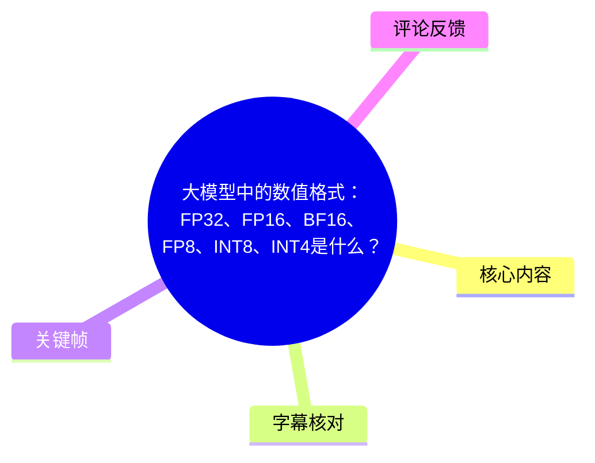
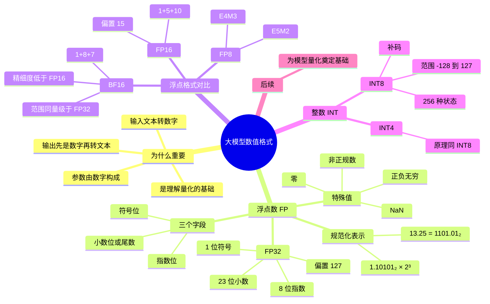
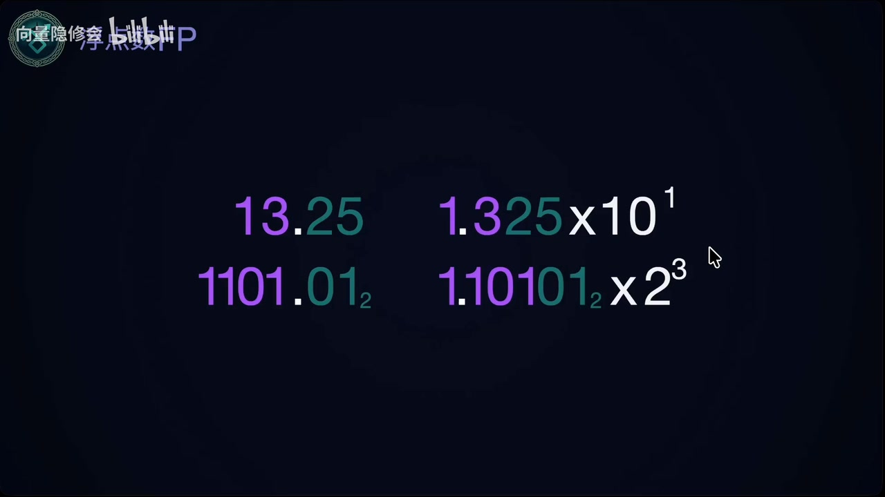
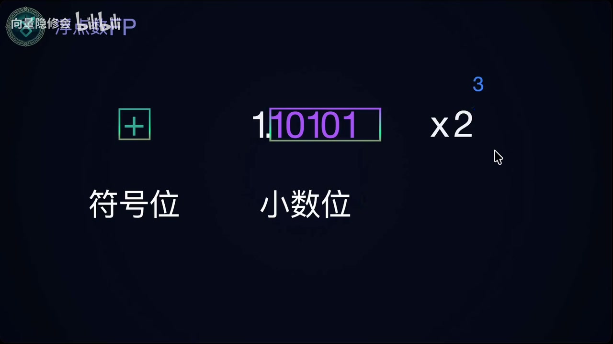

# 大模型中的数值格式：FP32、FP16、BF16、FP8、INT8、INT4是什么？

> 来源：[Bilibili 视频](https://www.bilibili.com/video/BV1aq7P6LEp6)<br>
> UP 主：向量隐修会｜时长：14 分 25 秒｜合集：AIcode  
> 视频主题：从浮点数编码原理出发，介绍 FP32、FP16、BF16、FP8、INT8、INT4 等模型常见数值格式，并说明它们为何是理解量化的前置知识。

## 小结

视频先回答了“为什么大模型需要关心数值格式”：文本输入会转换为数字，模型参数本身是数字，模型输出在转回可读文本之前也仍是数字。因此，数值表示方式直接构成大模型存储与计算的基础，也是后续理解模型量化的前提。

主体以 `13.25` 为例讲解二进制浮点数。该数可写为 `1101.01₂`，再规范化为 `1.10101₂ × 2³`。浮点数存储时将其拆成**符号位、尾数/小数位、指数位**；对于二进制规范化数，首位有效数字 `1` 通常隐含存储，不占尾数字段。

视频以 FP32 为核心案例：它由 1 位符号位、23 位小数位和 8 位指数位组成，指数使用偏置（bias）编码。FP32 的指数偏置为 `127`，存储指数等于真实指数加偏置；指数全 0 与全 1 分别保留给零、非正规数、无穷和 NaN 等特殊表示。

随后，视频对比了不同浮点格式的字段分配：FP16 是 `1 + 5 + 10` 位，BF16 是 `1 + 8 + 7` 位。BF16 的指数位与 FP32 同为 8 位，因此视频强调其数值范围可达到与 FP32 同量级，但尾数较短、精细度较差。FP8 则提及 `E4M3` 与 `E5M2` 两种格式，其中 `E` 指指数位数，`M` 指小数位数。

在整数部分，视频以 INT8 说明有符号整数与补码：INT8 总共有 `2⁸ = 256` 种状态，表示范围为 `-128` 至 `127`；负数采用“按位取反再加一”的补码规则。补码的运算价值在于可将减法统一为加法，例如 `1 + (-1)` 在 8 位截断后回到 `0`。

本视频属于基础概念讲解，并**没有**给出具体量化算法、模型权重量化流程、推理框架配置、校准方法或不同硬件上的性能数据。格式定义相对稳定，但 FP8 的具体编码变体、各框架支持情况及量化工程的最佳实践会随硬件和软件版本变化；实际部署仍需结合模型、算子、硬件和推理框架验证。

## 思维导图





## 目录

- [为什么大模型需要数值格式](#为什么大模型需要数值格式)
- [浮点数的二进制规范化：以 13.25 为例](#浮点数的二进制规范化以-1325-为例)
- [FP32：符号位、尾数位与指数位](#fp32符号位尾数位与指数位)
- [FP32 的偏置指数与特殊数值](#fp32-的偏置指数与特殊数值)
- [FP16、BF16 与 FP8 的字段分配](#fp16bf16-与-fp8-的字段分配)
- [INT8、INT4 与补码](#int8int4-与补码)
- [视频结论、应用边界与时效性](#视频结论应用边界与时效性)
- [关键帧索引](#关键帧索引)
- [字幕比对](#字幕比对)
- [评论分析](#评论分析)
- [处理记录](#处理记录)

## 为什么大模型需要数值格式 [00:00:18](https://www.bilibili.com/video/BV1aq7P6LEp6?t=18)

视频开场列举了 FP32、FP16、BF16、FP8、INT8、INT4 六类常见格式，并在随后说明理解它们的原因：

1. **输入侧**：用户输入的文本最终需要转换为数字。
2. **模型本体**：大模型由大量参数构成，而参数本质上也是数字。
3. **输出侧**：模型输出在被转换成可阅读文本之前，本质上仍是数字。
4. **量化前置知识**：理解数字格式有助于理解模型量化。

这里的“数字格式”不只是存储容量问题。对浮点格式而言，有限比特要在符号、指数、尾数之间分配；不同分配会影响可表示数值的范围与数值间隔。视频将此作为后续量化主题的基础，但本集未进入量化算法细节。


> 图：画面以“输入文本”为起点，适合作为理解“文本进入模型后需数值化”的视觉入口。它对应视频关于模型输入、参数与输出均建立在数字计算之上的背景说明。

## 浮点数的二进制规范化：以 13.25 为例 [01:33](https://www.bilibili.com/video/BV1aq7P6LEp6?t=93)

视频将 FP 解释为浮点数（Floating Point），并指出大模型中的大量参数以浮点数方式存储。随后用十进制数 `13.25` 说明从日常数值到二进制浮点表示的步骤。

### 1. 分别转换整数部分与小数部分

对于整数部分：

\[
13 = 8 + 4 + 1 = 2^3 + 2^2 + 2^0 = 1101_2
\]

对于小数部分：

\[
0.25 = \frac{1}{4} = 2^{-2} = 0.01_2
\]

因此：

\[
13.25 = 1101.01_2
\]

> ASR 在这一段中将若干二进制、指数表达识别为“二性质”“二性子”“二的四方”等，结合上下文和关键帧，应校正为“二进制”“二进制数”“\(2^2\)”等术语与表达。


> 图：画面单独呈现 `13.25`，明确了视频后续二进制拆解和浮点编码使用的统一示例数值。

### 2. 写成二进制科学计数法

类似十进制科学计数法：

\[
13.25 = 1.325 \times 10^1
\]

二进制数也可将小数点移动到首位有效数字之后：

\[
1101.01_2 = 1.10101_2 \times 2^3
\]

这个规范化表达是后面字段拆分的基础：

- `+`：数值符号；
- `1.10101₂`：有效数字；
- `3`：真实指数。



> 图：画面同时展示 `13.25`、`1101.01₂`、十进制科学计数法和二进制规范化式 `1.10101₂ × 2³`。它直观说明浮点编码不是直接保存十进制字符，而是保存规范化二进制数的关键组成。

## FP32：符号位、尾数位与指数位 [03:04](https://www.bilibili.com/video/BV1aq7P6LEp6?t=184)

视频将规范化后的二进制浮点数拆为三部分：

| 部分 | 作用 | 以 `1.10101₂ × 2³` 为例 |
| --- | --- | --- |
| 符号位（Sign） | 表示正负 | 正数对应 `0`，负数对应 `1` |
| 小数位/尾数字段（Fraction） | 保存有效数字的小数部分 | 保存 `10101...` |
| 指数位（Exponent） | 表示数量级 | 真实指数为 `3`，实际存储时经过偏置转换 |

视频特别说明：在二进制**规范化数**中，首位有效数字通常是 `1`，因此可以默认存在、不重复存储。换言之，示例中的有效数字虽为 `1.10101₂`，实际尾数字段只需存储其小数部分 `10101`，未占用的字段补零。



> 图：画面将 `+ 1.10101 × 2³` 中的部分分别标为“符号位”和“小数位”，是理解浮点字段分工的关键帧。指数部分位于右侧，三者共同恢复原数值。

### FP32 的位宽分配

视频给出的 FP32 字段分配为：

| 字段 | 位数 | 视频说明 |
| --- | ---: | --- |
| 符号位 | 1 bit | `0` 表示正数，`1` 表示负数 |
| 小数位 | 23 bit | 存储隐含首位 `1` 之后的二进制小数部分 |
| 指数位 | 8 bit | 使用偏置方式表示真实指数 |
| 总计 | 32 bit | 即 FP32 名称中的 32 |

对于示例的有效数字 `1.10101₂`，小数位写入 `10101` 后，其余位置补 `0`。这体现了视频的核心观点：浮点数通过字段组合来恢复数值，而不是以普通十进制文本形式保存。

## FP32 的偏置指数与特殊数值 [05:00](https://www.bilibili.com/video/BV1aq7P6LEp6?t=300)

### 偏置指数：把真实指数映射为可存储值

FP32 指数有 8 bit，视频给出偏置值：

\[
\text{Bias} = 2^{8-1} - 1 = 127
\]

真实指数记为 \(e\)，存储到指数位的值为：

\[
E = e + 127
\]

例如：

- 真实指数为 `3` 时：`3 + 127 = 130`；
- 真实指数为 `-3` 时：`-3 + 127 = 124`。

视频用数轴右移 127 的方式解释偏置：原本含有正、负的真实指数，经过偏置后都变为非负的存储指数，便于放入无符号的 8 bit 指数字段中。

### 正规数与指数可用范围

8 bit 指数字段可编码的原始值范围是 `0` 至 `255`。但视频指出，其中 `0` 与 `255` 被用于特殊规则，正规数使用的存储指数为：

\[
1 \leq E \leq 254
\]

对应真实指数为：

\[
-126 \leq e \leq 127
\]

视频将此范围内、按常规公式解释的浮点数称为**正规数**。

### 特殊情况：零、非正规数、无穷和 NaN

视频对指数全 0 或全 1 的情况进行了分类：

| 指数位状态 | Fraction 状态 | 视频说明 |
| --- | --- | --- |
| `E = 0` | `Fraction = 0` | 表示正零或负零 |
| `E = 0` | `Fraction ≠ 0` | 表示非正规数 |
| `E = 255` | `Fraction = 0` | 表示正无穷或负无穷 |
| `E = 255` | `Fraction ≠ 0` | 表示 NaN（Not a Number） |

视频对非正规数的解释是：它不使用正规数的隐含首位 `1`，而使用 `0` 作为前导有效位，并固定在最小可表达指数附近。其目的在于填补“最小正规数”与 `0` 之间的数值区间，避免数值直接断崖式变为零。

需要注意的是，视频此处为原理级介绍，未展开舍入模式、非正规数性能代价、NaN 载荷（payload）或 IEEE 754 的全部边界规则。

## FP16、BF16 与 FP8 的字段分配 [09:49](https://www.bilibili.com/video/BV1aq7P6LEp6?t=589)

在 FP32 的原理基础上，视频说明 FP16、BF16、FP8 的差别主要在于：**总 bit 数不同，以及符号、小数、指数三部分的空间如何分配**。

| 格式 | 符号位 | 指数位 | 小数位 | 视频强调的特点 |
| --- | ---: | ---: | ---: | --- |
| FP32 | 1 | 8 | 23 | 范围与精细度均较高，是讲解基准 |
| FP16 | 1 | 5 | 10 | 总共 16 bit，偏置为 15 |
| BF16 | 1 | 8 | 7 | 指数范围与 FP32 同量级，但精细度较低 |
| FP8 E4M3 | 1 | 4 | 3 | FP8 的一种格式，`M3` 表示 3 位小数 |
| FP8 E5M2 | 1 | 5 | 2 | FP8 的一种格式，`M2` 表示 2 位小数 |

### FP16

视频给出的 FP16 分配为：

\[
1\text{ 位符号} + 5\text{ 位指数} + 10\text{ 位小数} = 16\text{ bit}
\]

其指数偏置是：

\[
2^{5-1} - 1 = 15
\]

视频强调 FP16 与 FP32 在表示原理上相同，只是可用位数更少。

### BF16

视频指出 BF16 同样是 16 bit，但字段划分不同：

\[
1\text{ 位符号} + 8\text{ 位指数} + 7\text{ 位小数} = 16\text{ bit}
\]

由于 BF16 有 8 位指数，和 FP32 一样，因此视频称其可表示“FP32 这么一个量级”的范围；但 BF16 小数位只有 7 位，少于 FP16 的 10 位，也远少于 FP32 的 23 位，所以其数值精细度较差。

这里可提炼出视频的比较逻辑：

- **指数位多**：更有利于扩展可表示数值的数量级范围；
- **小数位多**：更有利于在相近数值之间提供更细的区分能力；
- 总 bit 数有限时，两者通常存在权衡。

### FP8：E4M3 与 E5M2

视频提及 FP8 的两种格式：

- `E4M3`：指数位为 4，小数位为 3；
- `E5M2`：指数位为 5，小数位为 2。

其中，`E` 指 Exponent（指数），`M` 指 Mantissa（尾数/小数位）。视频的概括是：指数位更大时能覆盖更大或更小的数值；小数位变少时精确度会下降。

视频未给出两种 FP8 格式分别适用训练、推理、权重或激活的工程建议，也未限定某一硬件或标准实现；不能据此直接推导具体框架中的 FP8 配置。

## INT8、INT4 与补码 [11:33](https://www.bilibili.com/video/BV1aq7P6LEp6?t=693)

浮点格式讲完后，视频转向 INT8 与 INT4，并说明二者代表有符号整数；具体以 INT8 为例，INT4 原理相同。

### INT8 的状态数与范围

INT8 有 8 bit，因此可形成：

\[
2^8 = 256
\]

种不同二进制状态。视频给出的有符号范围为：

\[
-128 \text{ 到 } 127
\]

也就是说：

- 非负部分可表示 `0` 至 `127`；
- 负数部分可表示 `-1` 至 `-128`。

### 补码的生成规则

视频指出 INT8 中的负数不采用独立符号位表示，而采用**补码（two's complement）**。对于一个正整数 \(x\)，求 \(-x\) 的 8 bit 补码步骤是：

1. 写出 \(x\) 的二进制编码；
2. 对每一位取反；
3. 结果加 `1`。

以 `-1` 为例：

```text
+1：00000001
取反：11111110
加一：11111111
```

因此在 8 bit 补码中：

```text
-1：11111111
```

同理，负二需要先写出正二，再取反加一。

### 补码的运算意义

视频通过 `1 + (-1)` 说明补码可统一加法与减法：

```text
  00000001   （+1）
+ 11111111   （-1）
----------
1 00000000
```

由于 INT8 只能保留 8 bit，最左侧的溢出进位被舍弃，最终结果为：

```text
00000000
```

即 `0`。

视频据此强调，补码让减法可以被当作加法处理，从而统一了这两类运算。视频没有继续讨论 INT4 的具体数值范围、量化缩放因子（scale）、零点（zero-point）、分组量化或反量化公式；这些内容属于后续量化工程层面。

## 视频结论、应用边界与时效性 [13:37](https://www.bilibili.com/video/BV1aq7P6LEp6?t=817)

视频最终归纳：

1. 浮点数的数值大小由符号、尾数/小数与指数等部分共同确定。
2. FP32、FP16、FP8 等类型的主要差异，在于总存储空间及三个字段之间的分配。
3. 理解这些编码原理，是理解模型量化的基础。
4. 下一讲将进入大模型中的具体量化算法。

### 可迁移的学习框架

理解格式时，可按以下顺序建立知识：

1. 先区分**浮点数**和**有符号整数**；
2. 对浮点数，先掌握“规范化二进制数 = 有效数字 × 2 的指数”；
3. 再理解符号位、指数位、尾数位分别决定什么；
4. 对比不同格式的位数分配，理解范围与精细度的权衡；
5. 最后再进入量化中的低比特表示、映射、缩放与误差问题。

### 本视频的限制

- 内容聚焦数值格式原理，未讲解具体量化算法。
- 未提供模型权重、激活值、KV Cache 等对象在量化中的区别。
- 未比较不同格式的显存占用、吞吐、延迟、精度损失或硬件支持。
- FP8 的具体格式和可用性在不同硬件、库与框架中可能不同，不能仅依据本视频判断部署兼容性。
- 视频中的数值格式与补码基础相对稳定；但量化工具链和模型部署建议具有时效性，应以实际使用的框架文档、硬件支持矩阵和测试结果为准。

## 关键帧索引

| 关键帧 | 对应内容 | 使用价值 |
| --- | --- | --- |
|  | 输入文本进入模型 | 建立文本需转为数值的学习背景 |
|  | `13.25` 作为统一示例 | 锚定后续二进制与浮点编码推导对象 |
|  | `1101.01₂` 与 `1.10101₂ × 2³` | 清楚呈现二进制规范化过程 |
|  | 符号位、小数位、指数 | 直观解释浮点数的三段式结构 |

## 字幕比对

| 字幕来源 | 完整性 | 专有名词 | 时间轴 | 主要问题 |
| --- | --- | --- | --- | --- |
| Bilibili 站内字幕 | 未提供可用字幕 | 无法评估 | 无法评估 | 字幕工具返回 `Invalid URL`，未获取到可用站内字幕 |
| 本次 ASR 字幕 | 较完整；48 个时间段，语音覆盖约 785.7 秒，占视频约 90.9% | 存在多处识别错误 | 完整；含 SRT 起止时间 | “Floating Point”“二进制”“Bias”“NaN”“补码”、指数表达和部分位宽描述出现误识别、错字或断词 |

### 最终字幕选择与校正

最终采用**本次 ASR 的 SRT 时间轴**作为章节定位依据。原因是站内字幕未能获取，而本次 ASR 已执行且具有完整分段时间戳。

对正文中影响理解的重要表述，依据 ASR 上下文、数学关系与关键帧进行了术语规范化，不改变视频的原始论述范围：

| ASR 原文或近似识别 | 正文采用 | 校正依据 |
| --- | --- | --- |
| “Floating Number” | Floating Point（浮点数） | FP 在计算机数值表示语境中指 Floating Point；视频后文持续讲解浮点编码 |
| “二性质”“二性子” | 二进制、二进制数 | 结合 `1101.01₂`、`1.10101₂ × 2³` 的关键帧与数学上下文 |
| “2 的四方” | \(2^2\) | `13 = 8 + 4 + 1 = 2³ + 2² + 2⁰` 的标准分解 |
| “偏质”“偏积” | 偏置（Bias） | 视频计算 `2^(8-1)-1=127` 并用于指数编码 |
| “net a number” | NaN（Not a Number） | 视频描述指数全 1、Fraction 非零时的非法数值类型 |
| “FB16” | BF16 | 标题、上下文及格式比较均指 BF16 |
| “补马” | 补码 | 整数编码与“取反加一”上下文一致 |

## 评论分析

> 仅处理本次可获取的热评前三条。评论反映的是用户表达，不作为已验证的技术事实。

1. **白时伶-alzero（25 赞）**  
   - 评论观点：“这个内容一般是计算机组成原来的前几节课”。  
   - 可提取的信息：评论者将视频定位为计算机组成原理中的基础数值表示知识。  
   - 可信度与边界：这一评价与视频内容相符——视频确实覆盖二进制、浮点表示和补码等基础概念；但“前几节课”取决于具体课程安排，并非统一课程标准。

2. **哈气山海（3 赞）**  
   - 评论内容：请求其他用户将整理笔记发送到邮箱。  
   - 可提取的信息：反映出观众存在笔记整理与复习需求。  
   - 可信度与边界：不包含技术补充、事实判断或争议信息。

3. **代可可脂白巧克力（3 赞）**  
   - 评论内容：同样请求其他用户将整理笔记发送到邮箱。  
   - 可提取的信息：与上一条类似，表明该基础主题可能有一定学习资料需求。  
   - 可信度与边界：不包含可核验的技术主张，也未提供对视频内容的补充。

## 处理记录

- Worker ID：`worker-mrj0wbly-5dc4e50c`
- 模型：`gpt-5.6-terra`
- 调用工具与素材：
  - 视频元数据：已提供；
  - 音频 ASR：已执行，模型为 `medium`，语言识别为 `zh`，语言置信度 `0.9970703125`；
  - ASR 运行设备与精度：`cuda` / `float16`；
  - ASR 时间轴素材：`asr/transcript.srt`、`asr/asr-transcript.txt`、`asr/asr-result.json`；
  - 关键帧目录：`frames/`；
  - 评论素材：`comments/comments.json`。
- 字幕选择：
  - 站内字幕获取失败，工具警告为 `Invalid URL`；
  - 本次 ASR 已执行并具有真实 SRT 时间戳；
  - 正文时间轴均优先按 ASR 分段起始时间换算为秒数生成。
- 关键帧选择依据：
  - 选择 `frame-001` 至 `frame-004`，因为已提供画面分别明确展示输入文本、`13.25` 示例、二进制规范化表达以及浮点字段拆分；
  - 未对未展示内容的其他帧作视觉内容推断，避免编造画面信息。
- 缓存清理：素材中未提供缓存清理执行记录；本次整理不对源工作区文件作删除性操作。
- 未解决问题：
  - 未获得可用 Bilibili 站内字幕，无法进行逐句官方字幕对照；
  - ASR 存在专有名词、数学符号和个别格式名称误识别，已在正文中以明确依据进行有限校正；
  - 视频未包含具体量化算法及部署实验，不能从本素材推导不同量化方案的实际效果。
