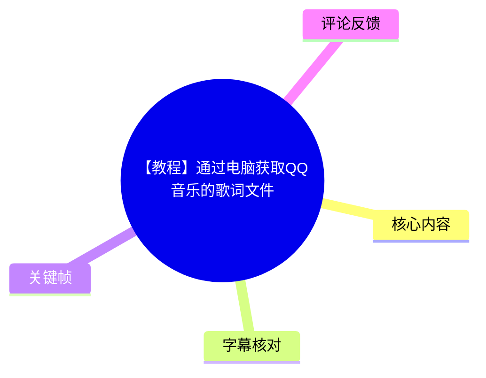
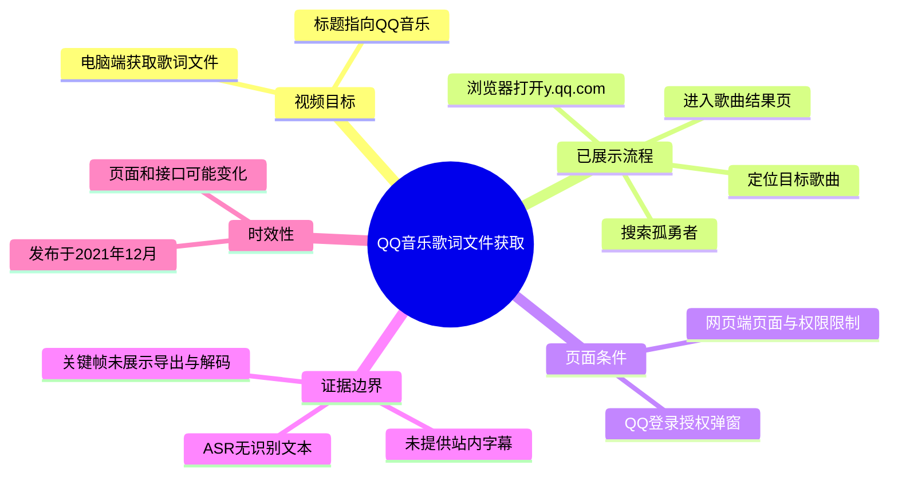
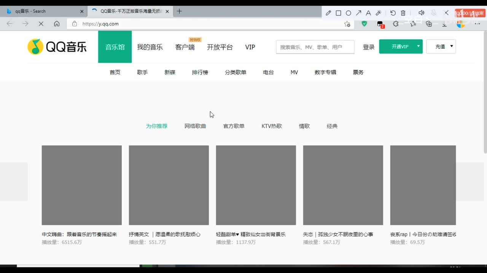
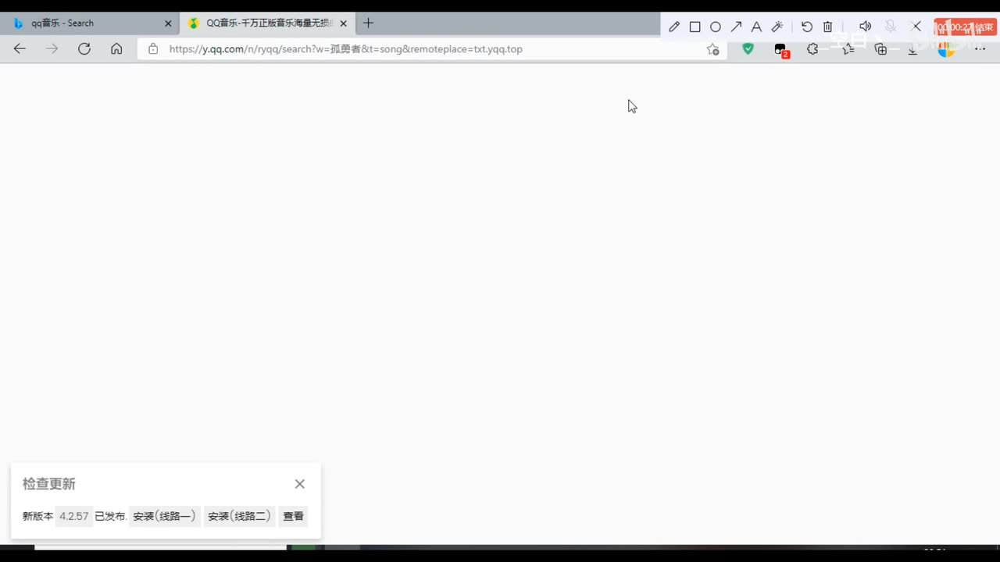
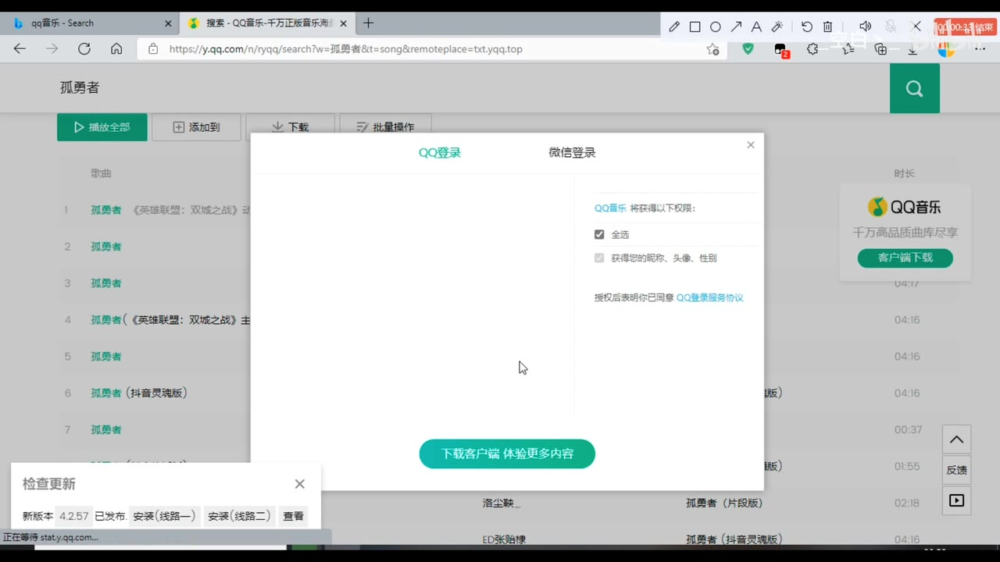
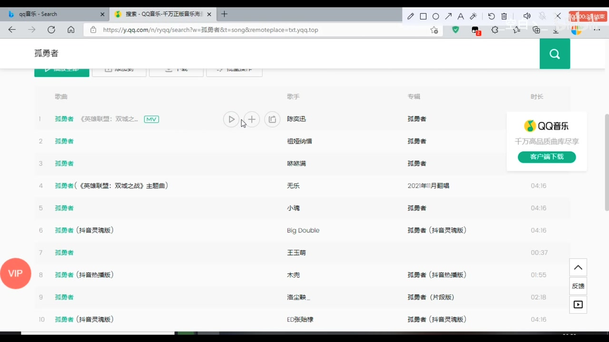

# 【教程】通过电脑获取QQ音乐的歌词文件

> 来源：[Bilibili 视频](https://www.bilibili.com/video/BV1ba411r73G)  
> UP 主：_空白丶_ ｜发布时间：2021-12-11 ｜视频时长：01:18  
> 视频简介补充：录屏在电脑端完成，剪辑由手机完成；UP 主表示看不懂可私信或加入主页群交流。

## 小结

本视频是一则电脑端 QQ 音乐歌词文件获取教程。根据可用关键帧，演示从 QQ 音乐网页端进入搜索页、以“孤勇者”为例搜索歌曲，并在搜索结果中定位目标歌曲的前半段流程。

画面显示教程使用的是浏览器访问 `y.qq.com`，而不是 QQ 音乐桌面客户端。搜索页地址栏中可见 QQ 音乐搜索路径，参数包含歌曲关键词“孤勇者”及 `t=song`，表明搜索目标被限定为歌曲结果。

搜索过程中网站出现 QQ 登录授权弹窗；教程随后回到歌曲列表。此处反映出网页端操作可能受到登录、授权状态或页面策略影响，不能假定所有用户都能在未登录状态下取得相同结果。

视频标题称目标是“获取 QQ 音乐的歌词文件”，元数据标签还包含 `lrc`、`base64`。不过，当前可用的站内字幕为空，本次 ASR 也没有识别到语音；所提供的可见关键帧仅覆盖搜索与结果列表阶段，未直接呈现歌词接口、Base64 内容、解码过程、下载按钮或最终 `.lrc` 文件。因此，这些后续具体技术步骤不能据此补写或臆测。

本教程发布于 2021 年 12 月。QQ 音乐网页端的页面结构、接口参数、登录门槛、版权限制与歌词可访问性均可能已经变化；应把视频中的路径视为历史操作线索，而非对当前可用性的保证。

适合读者：需要理解该视频演示范围、复核搜索拼写，或准备在当前 QQ 音乐网页端自行验证歌词导出可行性的用户。

## 思维导图





## 目录

- [视频背景与证据范围](#视频背景与证据范围)
- [打开 QQ 音乐网页端](#打开-qq-音乐网页端)
- [搜索歌曲并处理登录弹窗](#搜索歌曲并处理登录弹窗)
- [歌曲结果页与可确认信息](#歌曲结果页与可确认信息)
- [可复核操作步骤](#可复核操作步骤)
- [参数、限制与时效性](#参数限制与时效性)
- [字幕比对](#字幕比对)
- [评论分析](#评论分析)
- [处理记录](#处理记录)

## 视频背景与证据范围

视频时长为 78 秒，标题明确指向“通过电脑获取 QQ 音乐的歌词文件”。视频标签包括“浏览器”“歌词”“电脑”“lrc”“qq音乐”“base64”，其中“Base64”是元数据标签，不等同于已从画面中验证到的实际操作。

本次整理严格以可获得素材为准：

- **已可确认**：浏览器中的 QQ 音乐网页端、搜索“孤勇者”、歌曲搜索结果、QQ 登录授权弹窗。
- **不能确认**：具体歌词请求地址、歌曲 ID、请求头、Cookie、接口返回字段、Base64 是否实际出现、如何解码、如何保存为 `.lrc`、最终文件名及文件内容。
- **原因**：未提供可用站内字幕；ASR 结果为空；可见关键帧没有覆盖标题所称“获取歌词文件”的后续关键操作。

因此，下文将“画面事实”“元数据事实”和“尚待自行验证的部分”明确区分。

## 打开 QQ 音乐网页端

### 进入音乐馆首页 [00:14](https://www.bilibili.com/video/BV1ba411r73G?t=14)

画面显示浏览器打开 QQ 音乐网站 `y.qq.com`，页面顶部可见“音乐馆”“我的音乐”“客户端”“开放平台”“VIP”等导航，以及可用于搜索音乐、MV、歌单和用户的搜索框。



> 图：`frame-001.jpg` 展示教程所使用的网页端入口和顶部搜索框。它确认操作环境是浏览器内的 QQ 音乐页面，而非桌面客户端；这是复现搜索步骤的必要前提。

从该帧可见，视频通过网页搜索开始流程。对于需要复核教程的用户，最小前置条件是：

1. 使用桌面端浏览器；
2. 能正常访问 QQ 音乐网页端；
3. 准备好歌曲名或歌曲名加歌手名；
4. 接受网页端可能要求登录或出现权限提示。

## 搜索歌曲并处理登录弹窗

### 输入“孤勇者”并进入搜索 [00:24](https://www.bilibili.com/video/BV1ba411r73G?t=24)

画面切换至 QQ 音乐搜索页，搜索关键词为“孤勇者”。地址栏可辨识出搜索路径的关键结构：

```text
https://y.qq.com/n/ryqq/search?w=孤勇者&t=song&remoteplace=txt.yqq.top
```

其中，可以从画面直接确认或合理读取的参数含义如下：

| 参数/片段 | 画面可见值 | 可确认作用 |
| --- | --- | --- |
| 搜索路径 | `/n/ryqq/search` | QQ 音乐网页搜索页面路径 |
| `w` | `孤勇者` | 搜索关键词 |
| `t` | `song` | 搜索结果按歌曲类别展示 |
| `remoteplace` | `txt.yqq.top` | 出现在地址栏中的页面参数；视频未解释其具体机制，不能据此断言其对歌词获取的作用 |



> 图：`frame-002.jpg` 的价值在于保留了实际搜索词及地址栏参数，是当前素材中最直接的网页路径证据。`remoteplace` 虽然可见，但没有讲解字幕或后续画面支撑，不能擅自解释为歌词接口参数。

### QQ 登录授权提示 [00:34](https://www.bilibili.com/video/BV1ba411r73G?t=34)

搜索结果页面上弹出“QQ 登录 / 微信登录”窗口。窗口中“QQ登录”页签被选中，页面提示 QQ 音乐将获得权限，并提供“全选”等授权选项；底部还有“下载客户端 体验更多内容”的按钮。



> 图：`frame-003.jpg` 说明搜索或进一步操作期间可能出现账号授权要求。该帧对于判断复现限制很重要：页面行为可能随登录状态、地区、账号权限和当时网站策略而不同。

该帧并不能证明“登录后即可下载歌词”，只能证明视频所展示的网页流程中出现过登录授权界面。实践时应谨慎处理授权范围，不应为了获取单一内容而无必要地授予额外权限。

## 歌曲结果页与可确认信息

### 在结果列表中定位歌曲 [00:39](https://www.bilibili.com/video/BV1ba411r73G?t=39)

登录弹窗消失后，页面显示“孤勇者”的歌曲结果列表。第一条结果可见为“孤勇者（英雄联盟：双城之战）”，歌手栏显示“陈奕迅”；列表中还存在同名的其他翻唱、改编或不同版本条目。



> 图：`frame-004.jpg` 的价值在于展示同名结果不止一条。若后续需要取得与某一版本对应的歌词，必须先精确选中目标曲目，不能仅凭歌曲名判断。

从画面中可直接得到的经验是：**同名歌曲具有多版本结果，选择条目时至少应核对歌曲标题、歌手和专辑/版本信息。** 以画面为例：

| 列表信息 | 画面所示情况 | 对歌词匹配的意义 |
| --- | --- | --- |
| 歌曲名 | 多条“孤勇者”相关条目 | 仅凭歌名不足以唯一定位 |
| 歌手 | 第一条可见“陈奕迅”，其他条目歌手不同 | 应用于区分原唱、翻唱或改编版本 |
| 专辑/版本 | 可见“英雄联盟：双城之战”等描述 | 有助于避免选中同名版本 |
| 操作图标 | 条目附近可见播放、添加等图标 | 表明可对单曲继续操作；但素材未展示歌词导出入口 |

## 可复核操作步骤

### 基于画面可复现的前半段 [00:14](https://www.bilibili.com/video/BV1ba411r73G?t=14)

以下仅整理关键帧实际展示过的步骤，不把未出现的“歌词导出、请求抓包、Base64 解码、写入 LRC”伪装为视频已证实的内容：

1. 在电脑浏览器中访问 QQ 音乐网页端 `https://y.qq.com`。
2. 使用页面顶部搜索框输入目标歌名；视频示例为“孤勇者”。
3. 进入歌曲搜索结果页。可见 URL 中使用 `w=孤勇者` 和 `t=song`。
4. 若页面出现 QQ 登录/授权窗口，先判断是否确有继续操作的必要，并审阅授权项。
5. 在歌曲列表内结合歌曲名、歌手及版本信息选中目标条目。视频示例列表中第一条为陈奕迅演唱的“孤勇者（英雄联盟：双城之战）”。
6. **在此停止。** 当前可用画面未提供从选中歌曲到获得歌词文件的明确步骤，不能可靠补足。

### 对标题中“歌词文件”的验证清单

若读者希望自行继续验证视频标题所指结果，建议在当前网页环境中记录以下事实，而不是直接套用未经证实的旧方法：

- 是否存在可见的歌词查看、复制或下载功能；
- 是否必须登录；
- 目标曲目是否因版权、会员或地区而不可用；
- 是否能获得带时间标签的歌词，而非普通文本；
- 保存后的文件扩展名是否为 `.lrc`；
- 文件内容是否实际包含 LRC 时间标记，例如 `[00:12.34]`；
- 若页面存在编码文本或网络响应，应先确认其来源、版权许可与合法使用范围，再进行处理。

## 参数、限制与时效性

### 可见参数与技术边界 [00:24](https://www.bilibili.com/video/BV1ba411r73G?t=24)

| 项目 | 结论 | 证据或限制 |
| --- | --- | --- |
| 操作平台 | 电脑浏览器网页端 | 关键帧显示浏览器和 `y.qq.com` |
| 演示搜索词 | 孤勇者 | 搜索框及 URL 可见 |
| 搜索类别 | 歌曲 | URL 中可见 `t=song` |
| 登录要求 | 过程中出现 QQ/微信登录窗口 | 不代表每次或所有账号必然需要登录 |
| 目标格式 | 标题及标签指向歌词文件、`lrc` | 关键帧未显示实际文件 |
| Base64 | 仅在视频标签中出现 | 未见编码文本、解码步骤或输出内容 |
| 最终下载/导出 | 无法确认 | 当前可见素材未覆盖 |
| 版权与权限 | 可能受限 | 音乐与歌词内容可能受平台、地区和账号权限约束 |

### 时效性与合规提醒

视频发布于 2021 年 12 月，距素材抓取时间已较久。QQ 音乐网页的搜索 URL、前端页面、登录流程和服务端接口可能发生变化。特别是以下内容均不应从本视频中推导为当前稳定方案：

- `remoteplace=txt.yqq.top` 是否仍存在、是否必需；
- 某首歌是否仍可被网页端检索或播放；
- 是否能在网页端读取或导出同步歌词；
- 是否存在与歌词相关的公开接口；
- 登录和会员限制是否与视频录制时相同。

歌词通常属于受版权保护的内容。即使技术上能够在浏览器中查看或保存，也应遵守平台服务条款、著作权规定及授权范围；不要将其用于未经许可的批量抓取、传播或商业用途。

## 字幕比对

| 字幕来源 | 完整性 | 专有名词 | 时间轴 | 主要问题 |
| --- | --- | --- | --- | --- |
| Bilibili 站内字幕 | 未提供可用字幕 | 无法核验 | 无可用分段 | 素材清单明确说明未提供可用站内字幕 |
| 本次 ASR 字幕 | 空 | 无法识别 | ASR 具备时间戳能力，但无有效分段 | `medium` 模型未识别出任何语音段，`sentenceCount=0`、`speechSeconds=0`、`speechCoverage=0` |

本次 ASR 已被检查：识别语言自动判断为英语，置信度为 `0.541015625`，音频时长约 `77.53` 秒，但最终 `segments` 为空，诊断提示“未识别到语音片段”。素材中**没有** `noAudioStream=true` 标记，因此不能将其表述为“源视频没有音轨”；准确结论应是：存在音频提取产物，但本次 ASR 没有识别出可用语音文本。

最终未采用任何字幕文本作为正文证据。时间定位主要依据可见关键帧中的播放器时间叠字：约 00:14、00:24、00:34、00:39。以下专有信息通过关键帧画面校正或确认：

- 网站：QQ 音乐、`y.qq.com`
- 搜索词：孤勇者
- 搜索参数：`w=孤勇者`、`t=song`
- 目标条目可见信息：孤勇者（英雄联盟：双城之战）、陈奕迅
- 登录方式：QQ 登录、微信登录

## 评论分析

仅获取到 2 条热评，少于“热评前三条”的上限；以下不补造第 3 条评论。

| 评论者 | 点赞 | 观点与补充 | 可信度与处理 |
| --- | ---: | --- | --- |
| 九野野不野 | 6 | 指出视频中搜索栏应输入 `lyric`，而非其起初误读的 `lylrc`；该评论者称自己放大到高清后确认了拼写。 | 这是用户对画面文字的补充，且与标题“歌词”主题相关；但当前提供的可见关键帧未出现该搜索词，无法独立验证，不能将其提升为正文中的既定操作步骤。 |
| 愿为君落的雁 | 3 | 表示教程“直接解决了我的问题”，并认为比网上的方法可靠。 | 反映个体使用体验和正向反馈，不提供具体步骤、版本环境或验证细节，不能作为当前仍然有效的技术证明。 |

评论中没有形成可核验的争议结论。第一条关于 `lyric` 的拼写提示值得在复现时注意，但应以实际页面和当前可见教程内容为准。

## 处理记录

- Worker ID：`worker-mrj0wbly-5dc4e50c`
- 整理模型：`gpt-5.6-terra`
- 可用素材与工具产物：视频合并文件 `merged.mp4`、音频 `audio/audio.wav`、关键帧目录 `frames/`、ASR 产物 `asr/asr-result.json` 与 `asr/transcript.srt`、评论数据 `comments/comments.json`、视频元数据。
- ASR 检查：使用 `medium` 模型，CUDA、`float16`；自动语言识别结果为英语，置信度 `0.541015625`；无识别分段。未发现 `noAudioStream=true` 标记。
- 字幕选择：站内字幕未提供可用内容；本次 ASR 输出为空；因此不采用字幕转写，正文以元数据及关键帧可见内容为依据。
- 关键帧选择依据：选用 `frame-001.jpg` 至 `frame-004.jpg`，分别对应网页入口、搜索 URL、登录授权弹窗和歌曲结果列表；这些帧直接支撑正文中的操作环境、搜索参数、权限限制与版本辨别信息。
- 未纳入的推断：未将标签中的 `base64` 扩展为具体编码或解码流程；未假定存在歌词接口、下载链接、文件导出成功或 `.lrc` 输出。
- 缓存清理：素材未提供缓存清理执行记录，无法确认是否已清理；不虚构清理结果。
- 未解决问题：缺少视频后半段对应的可读字幕或关键帧证据，无法确认歌词文件取得、Base64 处理、LRC 保存及其在当前 QQ 音乐网页端的可用性。
