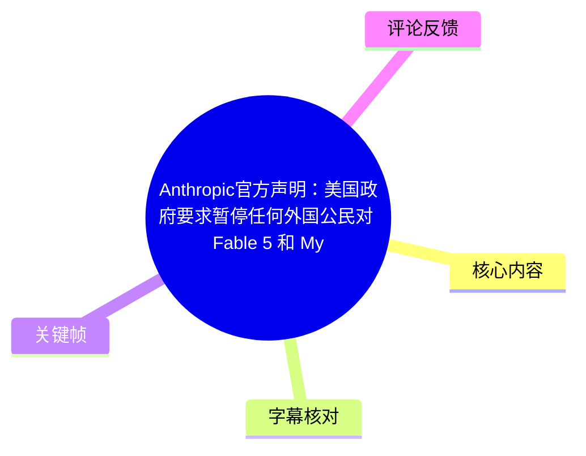
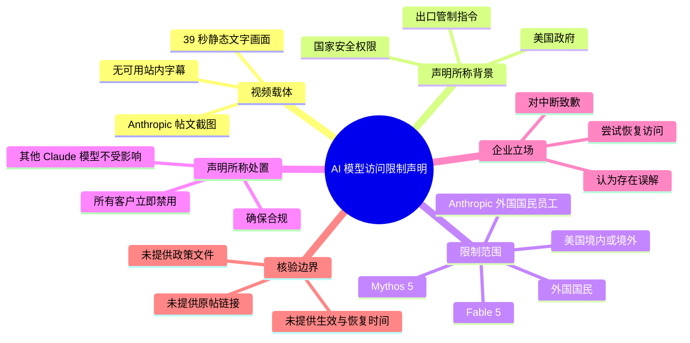
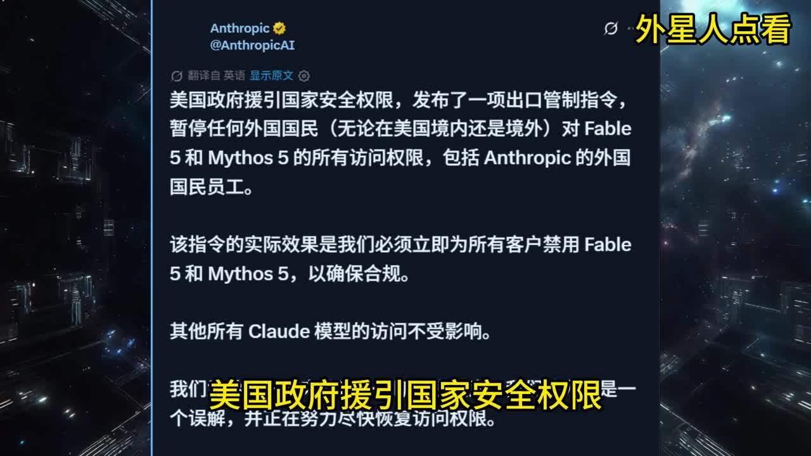
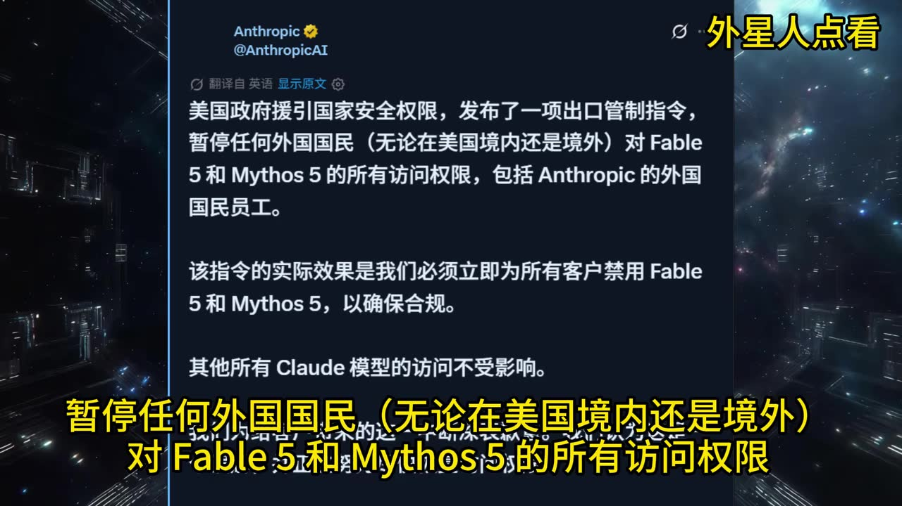
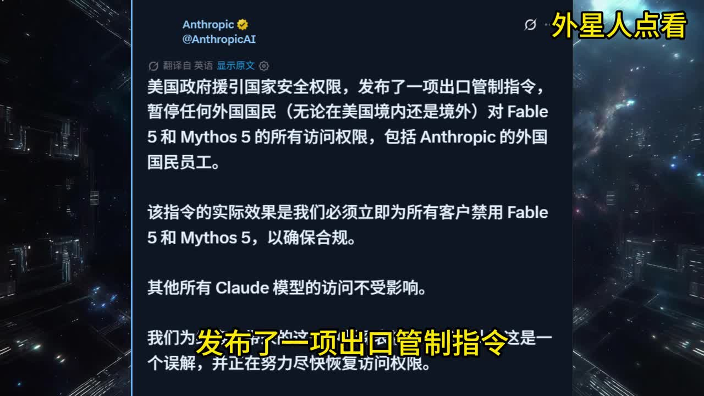
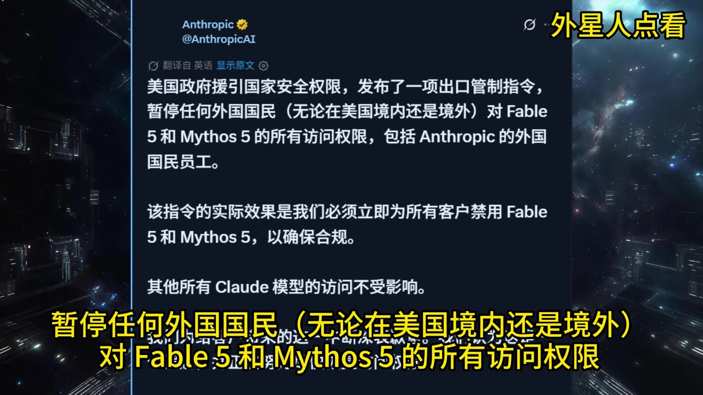

# Anthropic官方声明：美国政府要求暂停任何外国公民对 Fable 5 和 Mythos 5 的所有访问权限，包括 Anthropic 的外国国民员工！

> 来源：[Bilibili 视频](https://www.bilibili.com/video/BV1C6JJ6LEPq)  
> UP 主：外星人点看｜时长：39 秒｜分辨率：1920×1080  
> 标签：美国

## 小结

视频以一张标注为 **Anthropic @AnthropicAI** 的帖文截图为核心画面，转述了一项涉及美国出口管制与 AI 模型访问权限的声明。画面文字称：美国政府援引“国家安全权限”发布出口管制指令，要求暂停任何外国国民——无论位于美国境内或境外——对 **Fable 5** 和 **Mythos 5** 的全部访问权限，范围还包括 Anthropic 的外国国民员工。

按视频展示的声明，Anthropic 为确保合规，需要立即为**所有客户**禁用 Fable 5 和 Mythos 5；画面同时称，“其他所有 Claude 模型”的访问不受影响。这里存在一个值得特别注意的范围差异：限制对象按国籍定义为“外国国民”，而执行措施被描述为对“所有客户”禁用指定模型。

视频还展示了声明中的立场：Anthropic 对由此造成的中断表示歉意，认为该指令是“一个误解”，并正努力尽快恢复访问权限。该表述仅能证明视频画面所转述的说法，**不能单独证实原帖真实性、政策文件内容、禁用是否实际执行或恢复时间**。

这是一条时效性极强的短新闻材料，适合关注 AI 服务合规、跨境访问、出口管制与企业连续性的读者。视频没有提供政策文件编号、原帖链接、具体生效日期、受影响账户判定规则或恢复时间表，因此不能据此推导更广泛的模型可用性结论。

ASR 仅在 34.54—37.04 秒识别到一段语音，覆盖 38.19 秒音频中的约 2.5 秒；站内未提供可用字幕。本篇以画面中可读的完整声明为主要依据，并以 ASR 的带时间轴片段定位视频结尾处的口播/字幕内容。

## 思维导图

## 目录

- [材料背景与信息边界](#材料背景与信息边界)
- [画面声明的核心内容](#画面声明的核心内容)
  - [限制依据与适用对象](#限制依据与适用对象)
  - [对客户和模型访问的影响](#对客户和模型访问的影响)
  - [Anthropic 的表态与恢复预期](#anthropic-的表态与恢复预期)
- [技术与运营解读：如何理解访问控制范围](#技术与运营解读如何理解访问控制范围)
- [适用步骤与应对清单](#适用步骤与应对清单)
- [关键帧说明](#关键帧说明)
- [结论、限制与时效性](#结论限制与时效性)
- [字幕比对](#字幕比对)
- [评论分析](#评论分析)
- [处理记录](#处理记录)

## 材料背景与信息边界 [00:00:34](https://www.bilibili.com/video/BV1C6JJ6LEPq?t=34)

视频时长仅 39 秒，主体是经过中文翻译呈现的社交媒体帖文截图，背景为科幻风画面，并叠加“外星人点看”水印及逐句强调的黄色字幕。可获取的 ASR 带时间轴内容从 34.54 秒开始，说明视频尾段包含与画面文字相近的语音或字幕文本。

本视频所表达的新闻主张可拆为三层：

1. **政府行为的主张**：美国政府以国家安全权限为由发布出口管制指令。
2. **企业合规行为的主张**：Anthropic 因此暂停指定模型访问，并称是为确保合规。
3. **企业判断与后续行动**：Anthropic 认为存在误解，试图尽快恢复权限。

需要区分的是，视频画面并未附上可点击的 Anthropic 原帖地址、美国政府部门名称、出口管制命令编号、法规条款、发布日期或法律文本。因此，本篇将“美国政府发布指令”“Anthropic 必须禁用”等均明确表述为**视频画面转述的声明内容**，而非已完成独立核验的外部事实。

> 图：关键帧展示了带有“Anthropic @AnthropicAI”标识的中文帖文截图，以及“美国政府援引国家安全权限”“出口管制指令”等核心文字。它是判断视频信息来源形态、区分“截图转述”与“原始政策文件”的关键证据。

## 画面声明的核心内容 [00:00:34](https://www.bilibili.com/video/BV1C6JJ6LEPq?t=34)

### 限制依据与适用对象 [00:00:34](https://www.bilibili.com/video/BV1C6JJ6LEPq?t=34)

画面中的主要文本称：

> 美国政府援引国家安全权限，发布了一项出口管制指令，暂停任何外国国民（无论在美国境内还是境外）对 Fable 5 和 Mythos 5 的所有访问权限，包括 Anthropic 的外国国民员工。

其中可提取的限制参数如下：

| 项目 | 视频画面所称内容 | 可据此确认的边界 |
| --- | --- | --- |
| 依据 | 国家安全权限、出口管制指令 | 未给出具体法律、命令号或主管机关 |
| 被限制主体 | 任何外国国民 | 画面明确包含境内与境外，但未解释国籍、居留身份或双重国籍的判定标准 |
| 员工范围 | Anthropic 的外国国民员工 | 未说明涉及哪些岗位、权限层级或工作地点 |
| 受影响产品 | Fable 5、Mythos 5 | 名称以画面拼写为准；未提供产品文档、版本说明或服务入口 |
| 权限类型 | 所有访问权限 | 未细分网页、API、企业账户、管理控制台、推理服务或内部研发环境 |

视频标题与画面均使用 **Fable 5**、**Mythos 5** 的拼写；但本次 ASR 将第二个名称识别为 “Methos 5”。考虑到画面文字可清晰读为 **Mythos 5**，正文采用画面拼写，并保留 ASR 误识别记录于“字幕比对”。

> 图：关键帧以黄色大字突出“暂停任何外国国民（无论在美国境内还是境外）对 Fable 5 和 Mythos 5 的所有访问权限”。它直接呈现了视频强调的人员范围和地域范围，而不是笼统地称“海外用户受影响”。

### 对客户和模型访问的影响 [00:00:34](https://www.bilibili.com/video/BV1C6JJ6LEPq?t=34)

画面接着称：

> 该指令的实际效果是我们必须立即为所有客户禁用 Fable 5 和 Mythos 5，以确保合规。  
> 其他所有 Claude 模型的访问不受影响。

这一段包含两个需要并列理解的结论：

- **执行口径**：尽管前文按“外国国民”界定指令针对对象，视频所示企业执行结果却是“为所有客户禁用”两项指定模型。若该转述准确，意味着服务方可能采用了覆盖面更广的临时停用措施，而非仅对单个用户进行国籍筛查。
- **未受影响范围**：画面仅称“其他所有 Claude 模型”访问不受影响。这并不等于全部 Anthropic 产品、API 功能、企业集成、区域服务或未来模型均不受影响；原视频没有给出更细的产品清单。

从服务连续性角度看，若组织工作负载依赖指定模型，最直接的风险不是“访问变慢”，而是模型调用、产品功能或工作流发生**立即不可用**。但视频未提供具体故障码、控制台提示、API 响应、替代模型名称、迁移方案或 SLA 信息，不能据此写成确定的技术故障处置方案。

> 图：关键帧完整保留了“为所有客户禁用 Fable 5 和 Mythos 5”及“其他所有 Claude 模型的访问不受影响”两句，是辨析受限模型与声明中未受影响模型范围的核心画面依据。

### Anthropic 的表态与恢复预期 [00:00:34](https://www.bilibili.com/video/BV1C6JJ6LEPq?t=34)

视频画面底部的文本称：

> 我们为给客户带来的这一中断深表歉意。我们认为这是一个误解，并正在努力尽快恢复访问权限。

这段话提供的是企业的公开立场，而非恢复承诺：

- “深表歉意”确认其所描述的是一次服务中断；
- “认为这是一个误解”表明企业对指令或适用方式持不同意见；
- “努力尽快恢复”只表达方向，**没有给出确定的恢复日期、条件或保证**。

因此，在业务决策中，不应把这段表态理解为“短时间内必然恢复”。在恢复前，受影响方应按服务持续不可用的情形评估备选路径；但具体替代产品或迁移操作不在视频材料中，不能虚构为 Anthropic 的官方建议。

## 技术与运营解读：如何理解访问控制范围 [00:00:34](https://www.bilibili.com/video/BV1C6JJ6LEPq?t=34)

以下是依据视频文字可做的有限运营解读，不是视频中已证实的技术实现细节。

### 1. “人员资格”与“客户级禁用”是不同层面的控制

视频画面一方面以“外国国民”为对象，另一方面称为“所有客户”禁用指定模型。二者对应不同的访问控制层级：

| 控制层级 | 含义 | 视频能否确认 |
| --- | --- | --- |
| 身份/资格层 | 根据用户国籍、雇佣关系、所在地或授权资格决定是否允许访问 | 仅能确认视频声称限制对象涉及外国国民；无法确认实际判定机制 |
| 账户层 | 对特定个人、团队、组织账户实施停用 | 无法确认 |
| 产品层 | 将某一模型从控制台、API 或服务目录中整体下线 | 视频称“为所有客户禁用”，但未展示技术实现 |
| 地域层 | 按 IP、部署区域、支付主体或云区域限制访问 | 无法确认 |
| 内部权限层 | 限制企业员工接触模型权重、研发系统或内部工具 | 视频称包括外国国民员工，但无内部系统细节 |

### 2. “其他 Claude 模型不受影响”不是完整兼容性保证

视频中的这句话只是在声明层面划出了一个未受影响的模型范围。实际迁移是否可行通常仍取决于模型能力、接口兼容性、上下文长度、价格、吞吐量、区域可用性、安全审核与应用评测结果；这些参数在视频中均未出现。

因此，不能将“其他 Claude 模型不受影响”扩展为以下未经证明的说法：

- 其他模型一定能无代码替换；
- API 名称、输入输出格式和工具调用行为完全兼容；
- 企业已经可以无损迁移；
- 所有地区、所有账户、所有 Anthropic 产品都保持正常。

## 适用步骤与应对清单 [00:00:34](https://www.bilibili.com/video/BV1C6JJ6LEPq?t=34)

视频没有演示操作步骤、命令、接口调用或配置参数。对于需要将这类突发访问限制纳入风险管理的团队，可采用以下**通用核验与连续性步骤**；它们是整理者基于视频所述风险场景给出的工作建议，不是视频或 Anthropic 已公布的操作指南。

1. **确认信息源**
   - 查找 Anthropic 官方账号、官方状态页、产品公告及支持渠道的原始链接。
   - 查找对应政府部门或出口管制主管机关发布的法律文本、公告编号及生效时间。
   - 不要仅凭二次转译截图调整生产环境。

2. **盘点指定模型依赖**
   - 列出生产、测试、内部工具和第三方集成中是否出现 `Fable 5` 或 `Mythos 5`。
   - 区分直接 API 调用、模型路由、SDK 默认模型和供应商代管集成。
   - 记录依赖所属账户、组织、区域及负责人。

3. **确认实际服务状态**
   - 在授权账户中查看模型目录、调用日志和服务状态。
   - 保存时间戳、错误信息和影响范围；不要将“无法调用”自动归因为本视频中的事件。
   - 对未受影响模型进行隔离测试，避免把声明语句当作兼容性验证结果。

4. **准备降级与切换方案**
   - 为关键链路预设可替换模型、人工审核、限流或功能降级策略。
   - 在切换前重新评估输出质量、隐私要求、成本、延迟及合规边界。
   - 对高风险功能保留人工审批与回滚机制。

5. **持续追踪恢复条件**
   - 关注正式公告是否明确恢复对象、恢复时间与资格认定方式。
   - 若政策文本和服务公告存在差异，以更高优先级的正式说明和实际合同/支持答复为准。
   - 对“尽快恢复”保持审慎，不设置未经确认的恢复截止日期。

## 关键帧说明 [00:00:34](https://www.bilibili.com/video/BV1C6JJ6LEPq?t=34)

视频关键画面是同一帖文截图配合不同黄色字幕强调，适合用来核对文字而非推断额外技术背景。

| 关键帧 | 正文用途 | 画面价值 |
| --- | --- | --- |
|  | 材料来源与完整声明 | 可见 Anthropic 账号标识、出口管制表述及完整段落结构。 |
|  | 影响范围分析 | 保留“所有客户禁用”与“其他 Claude 模型不受影响”两项并列信息。 |
|  | 限制对象分析 | 黄色字幕突出“外国国民”及“境内或境外”的适用范围。 |
|  | 政策依据分析 | 黄色字幕突出“发布了一项出口管制指令”，便于定位视频强调的触发原因。 |

> 关键帧文件在所给素材中未附逐帧时间戳，因此本文不为单张图片虚构精确出现秒数；章节时间轴统一采用 ASR 可验证的 34.54 秒起点。

## 结论、限制与时效性 [00:00:34](https://www.bilibili.com/video/BV1C6JJ6LEPq?t=34)

视频的核心信息是：一则被标注为 Anthropic 的声明称，受美国出口管制指令影响，Fable 5 与 Mythos 5 将被立即禁用；声明描述的直接限制对象为外国国民，并包括 Anthropic 的外国国民员工，但企业侧执行影响被描述为面向所有客户。与此同时，声明称其他 Claude 模型不受影响，并称正努力恢复访问。

可迁移的经验是：面对模型访问受政策、身份资格或地域条件影响的情形，组织应把“特定模型的可用性”视为独立风险项，而非默认整个供应商服务都可用或都不可用；需要分别核查模型、账户、地区、身份资格和接口依赖。

本材料的主要限制包括：

- 视频没有提供政策文件、主管机关、命令编号、原文链接或可验证原帖 URL；
- 视频没有给出 Fable 5、Mythos 5 的产品资料、技术参数、API 名称或访问方式；
- 没有恢复时间表、豁免条件、客户资格规则、错误提示或替代方案；
- 站内没有可用字幕，ASR 覆盖率仅约 6.55%，无法以音频独立复原整段视频；
- 画面为中文翻译截图，可能与原始英文用词、法律术语或上下文存在差异。

因此，本文将其定位为**对视频所展示声明的结构化整理**，而非对相关政策或服务状态的独立事实核验。此类新闻会随政府命令、企业合规评估、账户状态和公告更新而快速变化，应以最新官方政策文本与服务状态为准。

## 字幕比对

| 字幕来源 | 完整性 | 专有名词 | 时间轴 | 主要问题 |
| --- | --- | --- | --- | --- |
| Bilibili 站内字幕 | 未提供可用字幕 | 无法评估 | 无法使用 | 素材明确标注“未提供可用站内字幕”。 |
| 本次 ASR 字幕 | 较低：仅识别 2 段，约 2.5 秒语音，覆盖率约 6.55% | 存在误识别：`Methos 5`；`Cloud` 应为画面中的 `Claude`；“中段”应为“中断” | 可用：34.540—36.440、36.440—37.040 | 第一段在极短时间内串联大量文字，缺少标点；未覆盖前 34 秒主要画面内容。 |

### 最终字幕与文本选择

- **站内字幕**：未提供，不能作为依据。
- **ASR**：已检查，音频文件存在，且 ASR 诊断未标记 `noAudioStream=true`；因此不能将字幕缺失归因于“源视频无音轨”。ASR 模型为 `medium`，识别语言为中文，置信语言概率为 0.9990234375。
- **最终采用策略**：以 ASR 提供的真实时间轴定位尾段，以关键帧中清晰可读的中文帖文截图补足 ASR 未覆盖内容。
- **关键校正**：
  - ASR 的 `Methos 5` 按画面校正为 `Mythos 5`；
  - ASR 的“其他所有 Cloud 模型”按画面校正为“其他所有 Claude 模型”；
  - ASR 的“给客户带来的这一中段”按画面语义校正为“给客户带来的这一中断”；
  - 画面使用 “Fable 5”“Mythos 5”，本文不将其擅自替换为其他已知模型名称。

## 评论分析

以下仅处理可获取的热评前三条。评论反映社区情绪和推测，不构成已核实事实。

1. **纯情白魔法师梅梅｜305 赞**  
   观点为“Anthropic 玩脱被铁拳了”。这是一种将事件归因于企业自身行为并将政府管制视为惩罚的情绪化解读。评论没有提供政策文件、企业行为证据或因果链条，不能据此确认 Anthropic 受到处罚或“玩脱”的具体原因。

2. **看点土味罢了｜240 赞**  
   评论质疑：“Fable 5 虽然强也没到这程度吧？被美国政府搞了？”其价值在于提出两项待核验问题：指定模型的能力或战略敏感性是否足以触发限制，以及事件是否确由政府干预导致。视频只展示了“国家安全权限”“出口管制指令”的说法，未提供足以回答模型能力、限制动机或决策过程的证据。

3. **肉酱薯条拌雪球山楂｜211 赞**  
   评论称“fable5目前最大的用户是五角大楼”，并以表情暗示讽刺。该说法可能意在指出模型与美国国防部门之间的潜在关联，但视频材料没有涉及五角大楼、采购关系、用户规模或合同信息。该评论应视为未经证实的社区说法，不能作为事件背景事实引用。

## 处理记录

- Worker ID：`worker-mrj0wjed-b0c290ad`
- 模型：`gpt-5.6-terra`
- ASR 模型与参数：`medium`；语言自动识别为中文（`zh`）；CUDA；`float16`；音频时长 38.1866875 秒。
- 使用的素材与工具结果：已使用视频元数据、ASR 结果与 SRT 时间轴、12 张关键帧路径清单、站内字幕状态、热评前三条；未提供外部政策文件或原帖链接。
- 字幕选择：站内无可用字幕；已检查本次 ASR。采用 ASR 的 34.54—37.04 秒真实时间轴，并用关键帧可读文本校正专有名词与补足未转写内容。
- 关键帧选择依据：`frame-001` 用于识别声明来源形态和完整文本；`frame-002` 用于核对“所有客户禁用”及“其他 Claude 模型不受影响”；`frame-003` 用于核对外国国民、境内外范围；`frame-004` 用于核对出口管制指令表述。未为素材中未提供时间戳的关键帧编造出现时间。
- 缓存清理：素材清单未提供缓存清理执行记录；本文不虚构已清理结果。
- 未解决问题：原帖真伪与原文、出口管制指令的正式文件及生效时间、Fable 5 与 Mythos 5 的产品定义、实际受影响账户范围、恢复条件与恢复时间均无法从现有素材确认。
