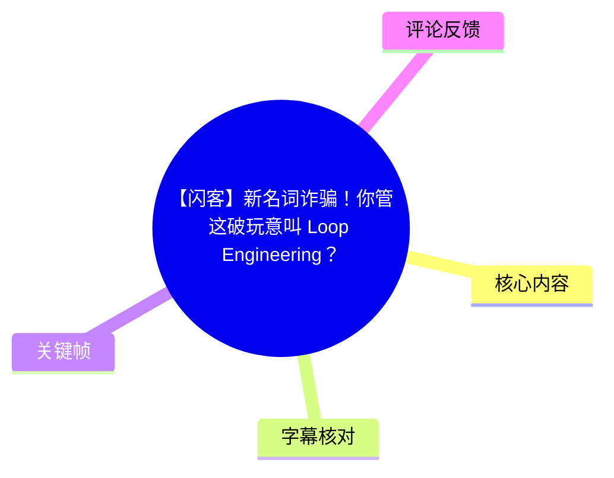
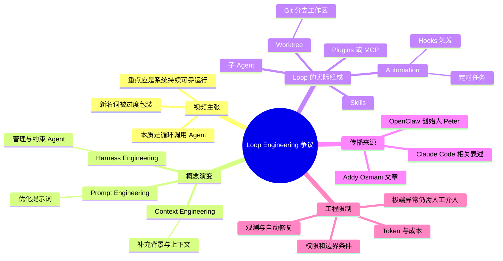
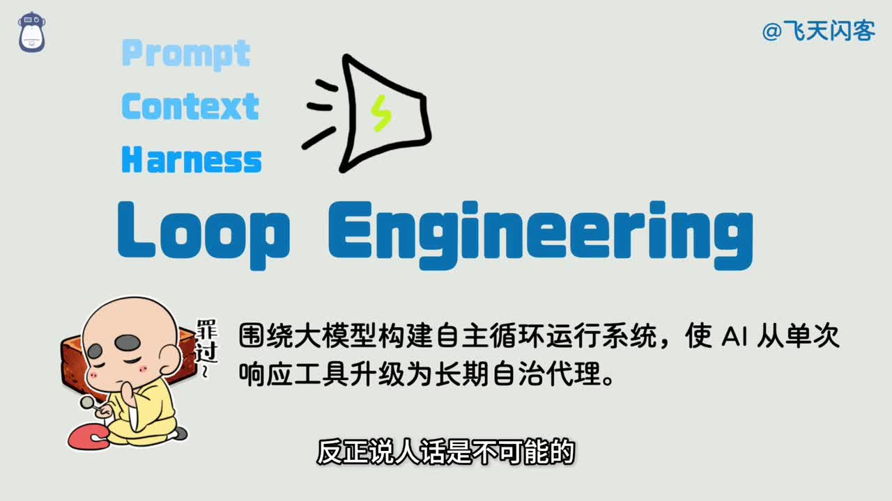
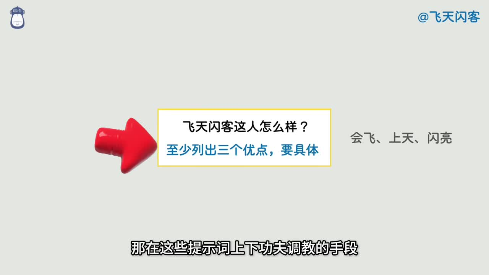
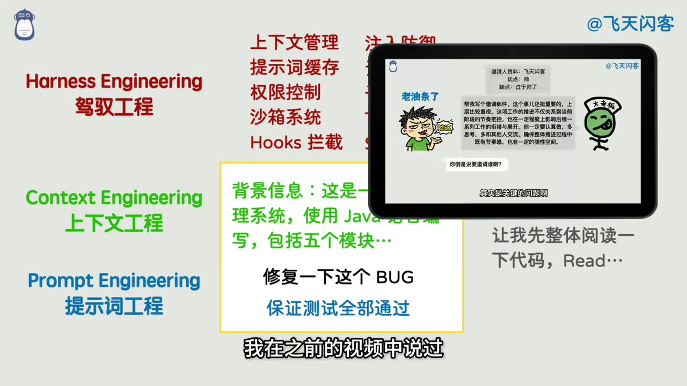
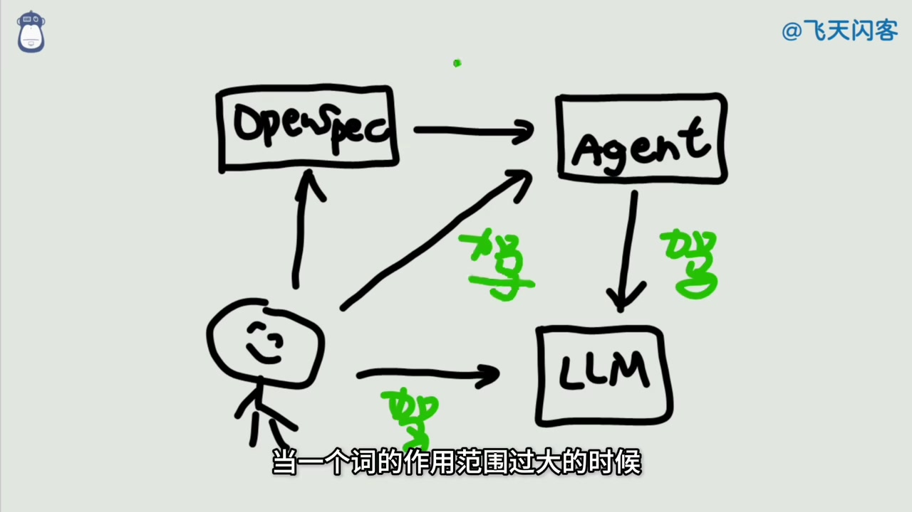

# 【闪客】新名词诈骗！你管这破玩意叫 Loop Engineering？

> 来源：[Bilibili 视频](https://www.bilibili.com/video/BV1Xg7v6PEr9)  
> UP 主：飞天闪客｜时长：8 分 02 秒｜分辨率：1920×1080  
> 视频简介提供的延伸来源：Claude Code Scheduled Tasks 文档、OpenClaw 创始人 Peter 的推文、Addy Osmani 的相关文章。  
> **时效提示**：视频元数据发布时间为 2026 年 6 月；工具功能、文章内容和相关人物的公开表述均可能在此后变化。本文仅整理所给视频素材，不将视频观点自动视为行业定论。

## 小结

视频批评近期流行的 “Loop Engineering（循环工程）” 概念被过度包装。作者的核心判断是：其可被还原为“以定时任务或事件触发器反复调用 Agent”，并非独立、边界清晰的新工程范式；把它命名为“下一代编程范式”容易制造技术焦虑和概念膨胀。

作者先回顾了 AI 使用方式的层层命名：围绕提示词改进回答被称为 Prompt Engineering；补充背景资料、提升回答准确性被称为 Context Engineering；面对复杂、长时间任务而加入上下文管理、提示词缓存、权限、沙箱、Hooks 等约束机制，被称为 Harness Engineering。视频认为这些概念之间存在连续关系，而 “Harness” 一词的作用范围过宽，已容易沦为泛化标签。

视频将 Loop Engineering 的传播归因于三类公开发言：Claude Code 相关人士对“更多使用 loop”的表述、OpenClaw 创始人 Peter 对“设计 loops 而非直接命令 Agent”的强调，以及 Addy Osmani 对该术语的系统化定义文章。作者认为，产品宣传、维持讨论热度和争夺术语解释权，都会放大一个新名词。

从实践角度，视频给出的可操作解释很直接：配置一个周期任务或 Hook，令 Agent 在指定频率下重复执行 prompt、检查状态、执行修复或提出建议。真正困难的并不是“循环”本身，而是使系统在长期运行中可观测、可控、可恢复，并在异常边界内避免人工持续介入。

这份内容适合正在使用 Claude Code、Agent、OpenSpec、MCP 或自动化编程工作流的人阅读。重点不在接受或反驳“Loop Engineering”这个名称，而在识别其实际组成：触发机制、工作状态、工具权限、子 Agent、验证与修复闭环。

限制是：视频本身带有鲜明评论和讽刺立场；ASR 有较多专有名词和语句错误，且未提供逐句时间戳。因此，本文将“视频作者的判断”与“素材中可确认的功能描述”分开表述；没有对简介链接中的外部文档和推文进行额外联网核验。

## 思维导图





## 目录

- [背景：从新术语热潮到概念质疑](#背景从新术语热潮到概念质疑)
- [概念谱系：Prompt、Context 与 Harness](#概念谱系promptcontext-与-harness)
- [Loop Engineering 的朴素含义与操作机制](#loop-engineering-的朴素含义与操作机制)
- [三位传播者与术语定义争议](#三位传播者与术语定义争议)
- [Addy Osmani 的五组件框架及视频批评](#addy-osmani-的五组件框架及视频批评)
- [实践步骤：把循环落为可控自动化](#实践步骤把循环落为可控自动化)
- [真正的工程难点、适用范围与限制](#真正的工程难点适用范围与限制)
- [字幕比对](#字幕比对)
- [评论分析](#评论分析)
- [处理记录](#处理记录)

## 背景：从新术语热潮到概念质疑 [00:00](https://www.bilibili.com/video/BV1Xg7v6PEr9?t=0)

视频以 “Loop Engineering” 在 AI 自媒体和技术讨论中的走红为切入点。作者提到，该词被部分传播内容置于 Prompt、Context、Harness 之后，包装为又一个“新时代”概念；画面中还出现“围绕大模型构建自主循环运行系统，使 AI 从单次响应工具升级为长期自治代理”的表述。作者对这种定义方式表示反感，认为其没有用清晰的日常语言说明实际做法。



> 图：画面并列显示 Prompt、Context、Harness 和 Loop Engineering，以及“让 AI 从单次响应工具升级为长期自治代理”的宣传式描述。它直观呈现了视频要批评的对象：通过把既有工程手段纳入新标签来制造代际感。

作者的立场不是否认自动化或 Agent 循环的价值，而是质疑该术语是否具备足够的独立性和解释力。视频将其称作“名词诈骗”属于作者的评价性措辞，不是对相关人物或工具的事实定性。

## 概念谱系：Prompt、Context 与 Harness [00:43](https://www.bilibili.com/video/BV1Xg7v6PEr9?t=43)

### 1. Prompt Engineering：调整提问方式

作者回顾，人们最初与大模型交互时只是直接提问；若答案不符合预期，便会发现一些表达方式能够改善结果。围绕提示词结构、约束和要求进行调教的做法，随后被命名为 **Prompt Engineering（提示词工程）**。

视频举例的核心不是复杂模板，而是提示更具体。例如，画面展示“飞天闪客这人怎么样？至少列出三个优点，要具体”相较于泛泛提问，能对回答数量和具体程度施加约束。



> 图：画面以“至少列出三个优点，要具体”为例，说明 Prompt Engineering 的基本机制是明确输出要求。该图有助于区分“提示词层面的指令改进”与后续的自动化循环。

### 2. Context Engineering：补充任务背景

当仅靠一句 prompt 不够时，可在提示前加入背景信息，例如系统背景、技术栈、代码模块、目标和既有约束。作者将这种做法对应为 **Context Engineering（上下文工程）**：借由增加相关上下文，提升输出的准确性与任务适配性。

### 3. Harness Engineering：为复杂 Agent 加管理和约束

视频认为，当任务复杂到需要多人或多轮对话、长时间执行时，就不能只依赖单次提问，需要在外部增加控制和管理，以降低 Agent 偏离目标的风险。画面列出的典型组成包括：

- 上下文管理；
- 提示词缓存；
- 权限控制；
- 沙箱系统；
- Hooks 拦截；
- 以及围绕 Agent 运行的其他约束机制。



> 图：画面将 Prompt Engineering、Context Engineering、Harness Engineering 分层展示，并写出上下文管理、权限控制、沙箱、Hooks 等要素。其价值在于把视频所说的“驾驭 Agent”具体化为工程控制面，而非抽象口号。

作者的论证是：从直接驾驭大模型，到让 Agent 代为处理上下文和任务，再到研究如何驾驭 Agent，本质上始终是在“驾驭”系统。因而 “Harness Engineering” 若覆盖范围过大，可能失去区分度，成为干扰理解的宽泛术语。

## Loop Engineering 的朴素含义与操作机制 [02:01](https://www.bilibili.com/video/BV1Xg7v6PEr9?t=121)

作者对 Loop Engineering 的压缩定义是：**循环调用 Agent，仅此而已。**

视频给出 Claude Code 相关“loop”功能的解释：使用类似 Cron 的计划机制，在未来一段时间反复执行某项工作；执行频率可按分钟、数分钟、每天或其他时间间隔设置。以最简单的例子来说，用户指定“告诉我当前时间”，工具会以每分钟一次的频率把同一 prompt 再次发送给 Agent，并自动触发执行。

可以将视频描述的工作流抽象为：

```text
触发器（Cron / 定时任务 / Hook）
  → 将任务说明或 Prompt 交给 Agent
  → Agent 读取上下文、调用工具并执行
  → 输出结果、记录状态或尝试修复
  → 等待下一次触发
```

视频同时指出，国内一些 Agent 工具早已支持“定时任务”类能力。这里是作者借以反驳“全新范式”叙事的比较，并未在素材中提供各产品功能、上线时间或实现细节的逐项证据。



> 图：手绘图把人、OpenSpec、Agent 和 LLM 之间的连接画出，并以“驾驭”标注人对 OpenSpec、Agent 和 LLM 的控制关系。它支持作者的论点：循环只是控制关系和自动化触发的一层外壳，不能替代对整体系统的设计。

## 三位传播者与术语定义争议 [02:34](https://www.bilibili.com/video/BV1Xg7v6PEr9?t=154)

视频将该词的热度归因于三位人物的公开表达；以下是**视频中的叙述与作者推断**，并非本文对其动机的独立核实。

### Claude Code 相关人士 Boris

作者称第一位为 Boris，并称其为 Claude Code 创始人。视频提到，他在访谈中表示自己减少了与 Agent 的直接对话，越来越多地使用 loop；后续表述又更激进，近似于“全部”都使用 loop。

随后，视频结合 Claude Code 的 Scheduled Tasks/计划任务能力解释所谓 loop 的实现逻辑：基于 Cron 或类似调度器反复运行任务。视频简介确实列有 Claude Code 官方 Scheduled Tasks 文档链接，但本次素材未提供该文档正文，故不能据此补充未出现在视频中的参数或命令格式。

### OpenClaw 创始人 Peter

作者称第二位为 Peter、OpenClaw 创始人，并转述其推文立场：与其继续直接命令 Agent，不如“设计 loops 来命令”。作者认为这种说法具有明显标题党色彩，把原本的自动化调度与 Agent 协作提升成了趋势宣言。

### Addy Osmani

作者称第三位为谷歌的 Addy Osmani，并提及其还具有知名博主身份，曾在前端和软件工程领域写作，近两年转向 AI 主题。视频作者认为，其文章试图为前两者带起热度的概念作出正式定义、争夺定义权。这是作者对文章传播动机的解读，而非可由本素材验证的事实。

## Addy Osmani 的五组件框架及视频批评 [04:20](https://www.bilibili.com/video/BV1Xg7v6PEr9?t=260)

视频概述 Addy Osmani 文章提出的 Loop 所需五类组件：

| 组件 | 视频中的解释 | 在循环系统中的位置 |
| --- | --- | --- |
| Automation（自动化机制） | 定时任务，或通过 Hook 自动触发 | 决定何时启动下一轮 |
| Worktree | Git 分支/工作区 | 隔离或承载代码修改 |
| Skills（技能） | Agent 可使用的能力单元 | 提供可复用行动能力 |
| 插件或 MCP | 外部工具、服务或协议接入 | 扩展 Agent 的工具边界 |
| 子 Agent | 由主流程调用的辅助 Agent | 分解或并行处理子任务 |

作者对此框架提出三项批评：

1. **并非完整要素集合**：五项未必覆盖稳定运行一个自动化 Agent 系统所需的全部条件，例如评估、告警、资源预算、回滚和人工升级路径在视频概述中未被归入其中。
2. **不够正交**：这些概念之间可能有交叉或包含关系。例如插件/MCP、Skills、子 Agent 都可能属于执行能力或工具编排层，并不必然是同一层级的并列元素。
3. **Scope 不在同一维度**：Automation 是触发与调度机制，Worktree 是代码工作区策略，MCP 是工具接入方式，子 Agent 是执行主体组织方式；将其并排为固定“五组件”，会混合不同抽象层。

视频认为，文章后半段主要是在介绍这些已知概念，缺少真正新鲜的技术内容；结尾又承认直接写 Prompt 同样有效、需要找到平衡。作者借此反问：既然不同方案本来就需要权衡（trade-off），为何开头又以强烈的“Prompt 时代之后”叙事进行包装。

## 实践步骤：把循环落为可控自动化 [05:36](https://www.bilibili.com/video/BV1Xg7v6PEr9?t=336)

视频没有提供可直接复制的命令、配置文件或完整代码，因此不能编造 Claude Code 或其他工具的具体语法。按照视频明确给出的机制，可将一个“循环调用 Agent”的设计整理为以下步骤。

### 步骤 1：先定义可验证的任务目标

不要仅设置“持续优化项目”这种无边界指令。应将目标限制为可检查的工作，例如：

- 定期检查某项服务或代码状态；
- 在发现特定异常时提出修复建议；
- 定期执行检查、汇总结果；
- 在满足特定前置条件时才尝试修改。

视频最后强调，多数人甚至尚未用简单提示词写过一个小型 Demo；因此应先验证单次 prompt 能否稳定完成任务，再讨论长期循环。

### 步骤 2：选择触发方式和频率

视频明确提及两种自动化入口：

- **计划任务/Cron**：按每分钟、每五分钟、每天或其他周期运行；
- **Hook**：在某类事件发生时自动触发。

频率不是越高越好。触发间隔会直接影响调用次数、Token 消耗、成本、重复执行风险和外部系统负载。热评中对“无限 token”的调侃也反映出这一现实约束，但评论本身不能替代成本测算。

### 步骤 3：给 Agent 配置必要的工作上下文与能力

根据任务需求，准备：

- 当前目标、项目背景和执行边界；
- 必要的代码工作区或 Git 分支策略；
- 所需 Skills、插件、MCP 或外部工具；
- 是否需要子 Agent 处理子任务。

这一步对应视频对 Harness 的描述：单纯循环发送 prompt 不足以保证质量，仍要管理上下文、工具和权限。

### 步骤 4：配置权限、隔离与停止条件

视频在 Harness 语境中明确列举权限控制、沙箱系统、Hooks 拦截等机制。用于长期任务时，应至少明确：

- Agent 可以读什么、写什么、执行什么；
- 是否允许直接修改代码或外部状态；
- 哪些操作必须进入沙箱或隔离工作区；
- 何种错误、预算消耗或连续失败应停止循环；
- 何时需要转交人工确认。

### 步骤 5：让每轮执行留下可检查结果

视频的最终标准不是“有循环”，而是“这套机制能持续跑起来、遇到问题也能自动修复”。因此，每轮至少需要能判断：

```text
本轮是否被触发
→ 是否完成任务
→ 是否发现异常
→ 是否进行了修改
→ 修改后是否通过验证
→ 是否需要重试、停止或人工介入
```

上述检查链是根据视频“持续运行、自动修复、边界条件”主题做的工程化展开；视频未指定日志格式、重试次数、监控指标或测试命令，实际项目需自行确定。

## 真正的工程难点、适用范围与限制 [06:55](https://www.bilibili.com/video/BV1Xg7v6PEr9?t=415)

视频在结尾将重点从术语转回工程目标：人类一直在尝试把重复劳动交给系统。Agent 出现后，已经存在“由 Agent 替人循环与大模型沟通、通过多轮完成具体任务”的思路；现在进一步追求的是让程序与 Agent 持续协作，以处理更大、更持久的问题。

作者还以分布式系统的 Raft 循环为例，说明“循环”这层外壳并不重要，重要的是它能否让系统稳定持续运行。这里应注意：视频只作类比，没有主张 Raft 与 Agent Loop 在机制上等同。

### 可迁移的经验

- 先问“系统实际如何触发、执行、验证和恢复”，再讨论它属于哪个新术语。
- 将单次 prompt、上下文组织、Agent 管理和自动化调度视作不同层面，避免用一个宽泛标签混为一谈。
- 自动运行的价值取决于持续性与可修复性，而不是调用次数或是否冠以 “Loop Engineering”。
- 不要跳过基础阶段：没有可控的代码仓库、清晰任务和单次调用验证时，复杂循环通常只会放大不确定性。

### 关键限制

1. **Token 和成本**：高频循环会放大调用成本。视频未提供价格、额度或成本参数，不能据此计算具体开销。
2. **极端情况不能保证自治**：作者明确限定“只要不出现极端情况，完全不需要人类参与”是理想目标；极端异常、错误权限、工具故障和需求变化仍可能需要人工处理。
3. **算法与边界条件才是难点**：长期可靠运行需要精巧设计，至少涉及任务判断、异常处理、验证与修复边界，而不是只增加一个定时器。
4. **术语边界仍在变化**：该视频发布时讨论的定义、产品能力及相关人物立场具时效性；不应将本视频中的用语视作稳定的行业标准。
5. **视频没有实现验证**：素材没有展示一个端到端的 Loop 系统运行记录、成功率、失败率、成本或安全测试，因此不能据此证明某种架构优劣。

## 字幕比对 [07:32](https://www.bilibili.com/video/BV1Xg7v6PEr9?t=452)

本次任务中**站内字幕和本次 ASR 均已提供并执行**，但质量差异显著。

| 字幕来源 | 完整性 | 专有名词 | 时间轴 | 主要问题 |
| --- | --- | --- | --- | --- |
| Bilibili 站内字幕 | 与本视频内容基本不对应 | 出现 Faker、T1、ONER、Keria、贾克斯等电竞词 | 未提供有效时间轴 | 内容为英雄联盟赛事解说，无法用于本视频整理 |
| 本次 ASR 字幕 | 覆盖了视频主要论点和叙事顺序 | 多处识别错误，但可结合语境修正 | 未提供逐句时间戳 | 存在同音错词、重复句、英文名与产品名误识别 |
| 最终采用 | 以 ASR 为主，结合标题、简介、关键帧和上下文校正 | Claude Code、OpenClaw、Addy Osmani、Harness、Worktree、MCP 等 | 章节时间为按内容顺序定位的近似时间点 | 无法生成逐句精确字幕时间轴 |

重要校正依据如下：

- 站内字幕完全是另一段电竞内容，未参与正文事实整理。
- ASR 中的 “Cloud Code” 依据视频简介中的 Claude 官方文档链接、标题主题与上下文，整理为 **Claude Code**。
- ASR 中的 “OpenCloud” 依据视频简介中 “OpenClaw 创始人 Peter 的推特”，整理为 **OpenClaw**。
- ASR 中的 “Eddy” 依据视频简介中列出的作者，整理为 **Addy Osmani**。
- ASR 中的 “work trace” 依据其后“其实就是 git 分支”以及常见术语，整理为 **Worktree**；视频所表达的是 Git 工作区/分支隔离语境。
- “Harnes / Hunis”等多种写法，结合画面和上下文统一整理为 **Harness**。
- 关键帧中的 Prompt、Context、Harness、OpenSpec、Agent、LLM 等文字，为概念关系校正提供了直接视觉依据。

## 评论分析 [07:45](https://www.bilibili.com/video/BV1Xg7v6PEr9?t=465)

仅处理素材中可获取的热评前三条，按点赞数与提供顺序记录如下。评论反映观众态度，不构成已验证事实。

1. **士大夫留个记号（252 赞）**  
   评论把用户在 Claude Code 或 Codex 中断后输入“继续”的行为戏称为下一代范式 “continue engineer”。这是对视频“概念命名过度”主旨的顺势讽刺：若缺少清晰边界，普通操作也可以被包装成新工程术语。它没有提供技术补充或证据。

2. **FhyTan（50 赞）**  
   评论认为拥有充足 Token 的“大佬”所推崇的循环玩法，普通用户使用可能会面临高成本，甚至“用一个破产”。其补充价值在于指出资源预算问题，与视频关于长期循环的隐性成本限制相呼应；但“破产”显然是夸张表达，素材未提供 Token 定价、调用量或成本数据。

3. **七氪（3 赞）**  
   评论再次强调几位相关人物“拥有无限 token”，普通人不宜轻易 loop。与第二条一样，观点集中在资源不对称和实际调用成本。需要注意，人物是否拥有“无限 Token”并未在视频素材中得到证明，应视为评论者的调侃或主观判断。

## 处理记录 [08:00](https://www.bilibili.com/video/BV1Xg7v6PEr9?t=480)

- **Worker ID**：worker-mrj0wbly-5dc4e50c
- **模型**：gpt-5.6-terra
- **调用工具与素材**：基于任务提供的元数据、视频素材清单、站内字幕、ASR 字幕、12 张关键帧路径及可获取热评 JSON 进行整理；未在本记录中声明任何未提供的联网检索或外部工具调用。
- **字幕选择**：本次 ASR 已执行，作为正文主要依据；站内字幕因内容为英雄联盟赛事解说、与本视频不匹配而弃用。对 ASR 的 Claude Code、OpenClaw、Addy Osmani、Worktree、Harness 等错误识别，依据视频简介、关键帧文字和上下文做了保守校正。
- **关键帧选择依据**：选用 `frame-001` 至 `frame-004`，因为它们分别直接呈现 Loop Engineering 的宣传定义、具体 Prompt 示例、Prompt/Context/Harness 分层和 OpenSpec—Agent—LLM 关系，能够为正文的概念解释提供视觉证据；未使用无法从给定素材确认内容价值的其余帧。
- **缓存清理**：素材仅声明已生成 `merged.mp4`、音频、帧、字幕、ASR 和评论等输出；未提供缓存目录或清理执行结果，故不虚构“已清理”结论。
- **未解决问题**：ASR 未附逐句时间戳，章节时间为依据内容先后和视频总时长作出的近似定位；视频简介中的外部链接未被本任务素材展开，本文未对其内容、人物身份或产品功能进行独立验证。

## 评论分析

本次流程未获取到可用热评，因此不推断观众态度或额外结论。
