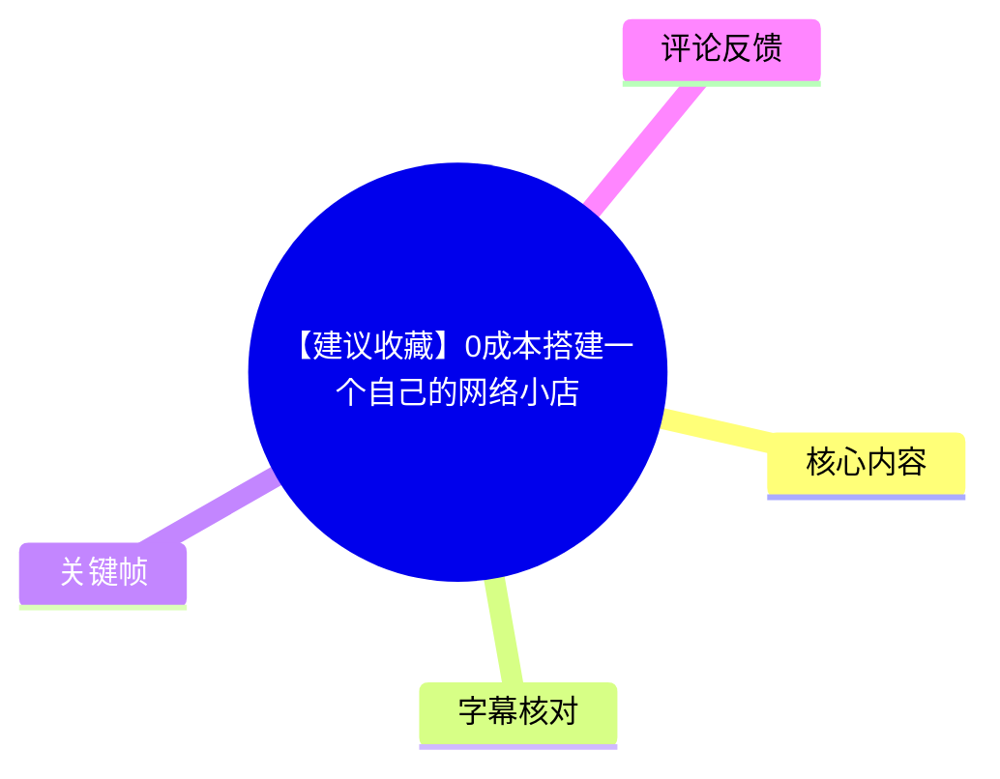
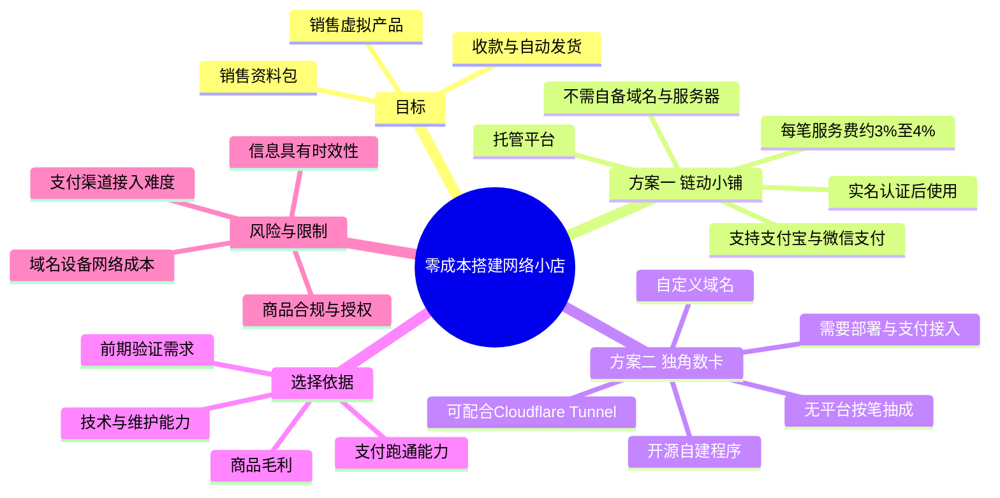
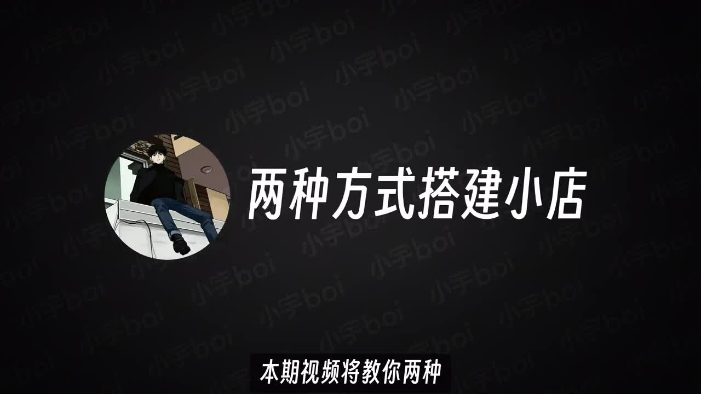
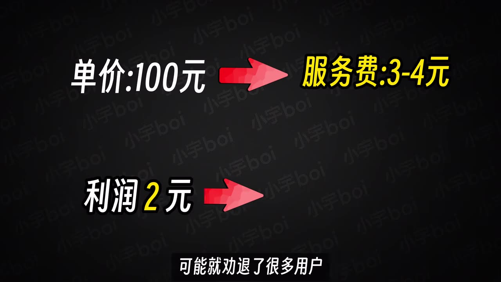
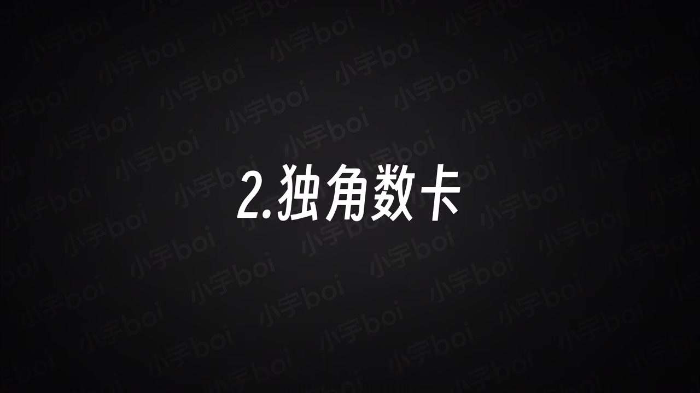
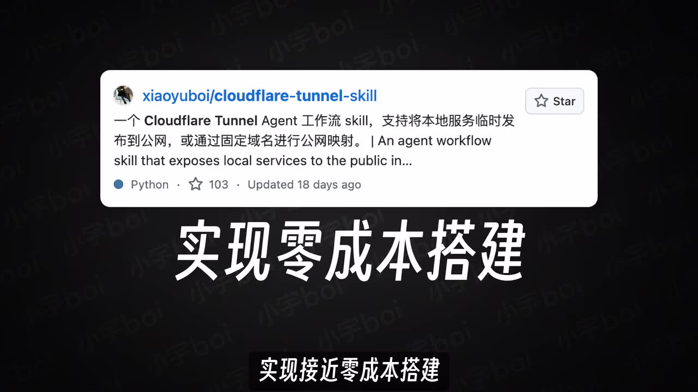

## 小结

视频提供了两条搭建“可收款、可自动发货”的虚拟商品网络小店路径，目标用户是想销售资料包、数字内容等虚拟产品、且希望以低前期成本开始的人。

第一种是使用第三方托管平台**链动小铺**：不需要自行准备域名或服务器，完成实名认证后即可使用，支持支付宝、微信支付、订单管理、优惠券、分销和购买通知等功能。它的核心代价是每笔交易需支付约 **3%–4% 服务费**，因此更适合刚起步、优先验证需求的人，而不一定适合低毛利商品。

第二种是自建开源程序**独角数卡**：需要域名、部署环境和自行打通支付渠道，但建成后站点归自己控制，可使用自定义域名，且不受第三方平台按笔抽成。UP 主展示了将程序部署在自己的 Mac mini，并通过 Cloudflare Tunnel 对公网开放的思路，以降低服务器成本；但这并不等于没有设备、电力、网络、域名、支付接入和维护成本。

视频的关键经验是：先根据**商品毛利、技术能力、运营阶段**选择方案。低门槛验证可优先考虑托管平台；若交易量增长、抽成明显侵蚀利润，或需要域名和更强的自主控制，再考虑独角数卡等自建方案。

视频只介绍了工具路径，并未提供完整的支付通道申请、域名注册、合规审核、商品来源授权、税务或消费者权益处理流程。销售的数字商品是否合规、是否拥有转售授权，仍需由经营者自行确认。平台费率、支付渠道能力和开源项目部署方式都可能随时间变动。

## 思维导图

## 目录

- [背景、目标与两种路线](#背景目标与两种路线)
- [方案一：链动小铺的低门槛托管模式](#方案一链动小铺的低门槛托管模式)
- [方案二：独角数卡与自建站点](#方案二独角数卡与自建站点)
- [实践决策：如何选择并落地](#实践决策如何选择并落地)
- [参数、限制与时效性](#参数限制与时效性)
- [关键帧索引](#关键帧索引)
- [字幕比对](#字幕比对)
- [评论分析](#评论分析)
- [处理记录](#处理记录)

## [背景、目标与两种路线](https://www.bilibili.com/video/BV14tTj6CEuM?t=0)

视频时长 **219 秒（3 分 39 秒）**，由小宇Boi发布，收录于 **AIcode** 合集。元数据记录的发布时间戳为 `1783044466`，按 UTC+8 换算约为 **2026-07-03**；本次素材抓取时间为 **2026-07-13**。截至抓取时，视频有 28,328 次播放、1,472 次收藏、1,560 次点赞；这些互动数据仅反映抓取时状态，不代表当前数值。

UP 主开场提出的目标是：在**不自行购买传统服务器、不写代码**的前提下，搭建一个能够收款、自动发货的网络小店，适合售卖资料包或其他虚拟产品。后续内容实际将“低成本”拆分为两种不同含义：

1. **托管平台的零基础开店**：基础设施和支付能力由平台提供，商家以每笔服务费交换便利性。
2. **自建程序的接近零现金增量成本**：利用已有本地设备和网络，再通过公网穿透工具暴露服务；但需要自己负责部署、支付、运维和风险。

> 图：画面明确写出“**两种方式搭建小店**”，是理解全片结构的总览关键帧。它提示两条路线不是同一成本模型：一条购买平台服务，一条购买或承担自主性与维护责任。

视频没有将“零成本”定义为绝对没有支出。结合其后文，较准确的理解应是：**可以不购买传统云服务器，或以较低前期投入开始**；但服务费、网络、电费、硬件折旧、域名以及支付接入所需的时间与资格条件依然可能存在。

## [方案一：链动小铺的低门槛托管模式](https://www.bilibili.com/video/BV14tTj6CEuM?t=25)

### [定位、前提与功能](https://www.bilibili.com/video/BV14tTj6CEuM?t=25)

第一条路线是使用第三方平台**链动小铺**。视频陈述，该方式不需要自行准备域名和服务器，完成实名认证后可开始使用；官方提供注册文档，UP 主认为按文档注册可以较快完成开店。

视频中明确提到或展示的能力包括：

- 支持**支付宝、微信支付**；
- 支持电脑端与手机端访问；
- 支持订单查看；
- 商品购买后可通过**微信或邮箱通知**商家；
- 可配置优惠券；
- 可设置分销系统；
- 支持嵌入样式（ASR 原文为“炖入样食”，结合上下文仅能确认其表达了与嵌入/样式相关的能力，具体功能名称需以平台文档为准）。

这些能力说明，托管平台将店铺页面、订单、发货与部分运营工具整合在同一后台中。对于不希望处理服务器部署、域名解析和基础站点维护的用户，这是一条流程更短的路径。

### [成本模型：每笔约 3%–4% 服务费](https://www.bilibili.com/video/BV14tTj6CEuM?t=55)

UP 主强调，免费或低门槛托管并非无代价：链动小铺的每笔交易需要额外支付约 **3%–4% 服务费**。该费率是视频中的陈述，不应直接视为平台在任何时间、所有支付方式和全部商家类型下的固定公开规则，实际应在注册和结算页面复核。

> 图：关键帧以“单价 100 元 → 服务费 3–4 元”及“利润 2 元”的对照，直观说明视频的主要经济判断：费率看似不高，但在低利润商品上可能吞没原本利润。

视频给出的计算逻辑可整理为：

| 项目 | 示例值 | 含义 |
| --- | ---: | --- |
| 商品售价 | 100 元 | 示例中的订单成交额 |
| 平台服务费 | 3–4 元 | 按售价约 3%–4%计算 |
| 商品原始利润 | 2 元 | 视频用于说明低毛利情形 |
| 结果 | 利润可能被覆盖 | 服务费大于示例原始利润 |

因此，判断是否适合使用托管平台，不能只看“能否免费开店”，还需看：

- 商品的单笔毛利；
- 订单量与长期累计服务费；
- 自动化功能能节约多少人工时间；
- 自建技术与维护成本是否反而更高；
- 是否处于仅需小规模测试产品需求的阶段。

UP 主还提到，平台文档中曾提及可自行配置支持渠道，但其向相关人员询问后得到“不再支持”的答复。该信息是视频作者的沟通结果，存在明显时效性；读者不应据此断言当前平台规则，需以平台最新官方文档和客服答复为准。

### [适用结论](https://www.bilibili.com/video/BV14tTj6CEuM?t=90)

链动小铺适合以下情形：

- 第一次开设数字商品店铺，希望快速验证需求；
- 缺少服务器、域名、部署和支付接入经验；
- 商品毛利足以覆盖约 3%–4% 的每笔服务费；
- 更看重立即可用的支付、订单与自动发货能力。

不太适合的情形则包括：商品本身毛利很低、订单规模增长后抽成累积显著，或经营者需要自定义域名和更强的数据、页面、支付流程控制权。

## [方案二：独角数卡与自建站点](https://www.bilibili.com/video/BV14tTj6CEuM?t=105)

### [独角数卡的特点与功能](https://www.bilibili.com/video/BV14tTj6CEuM?t=105)

第二条路线是采用开源程序**独角数卡**搭建自己的平台。视频称其为 GitHub 上热度较高的开源项目，并指出官方提供了较详细的使用文档。

与托管平台不同，这一模式需要经营者提供或控制部署环境、域名，并自行对接自己的支付账户。建成后，网站的控制权更高，可以使用自定义域名，且视频称其“不存在中间商按笔抽成”。

> 图：画面写有“2. 独角数卡”，用于标识从托管平台切换到自建开源程序的章节。它帮助读者将后续的服务器、域名、支付与公网访问讨论归入第二条路线。

视频中提及的独角数卡能力包括：

- 电脑端管理后台；
- 查看交易数据和经营数据；
- 商品管理；
- 订单管理；
- 查看访问者或订单相关 IP 地址；
- 用户管理；
- 会员等级；
- 优惠券；
- 推广返利；
- 系统设置中的多项配置；
- 对接多种支付渠道，视频列举支付宝、PayPal、加密货币等。

UP 主为了制作视频，称自己专门销售了约一个月的虚拟产品，并通过后台观察交易数据。其同时提醒，后台显示的“总利润”并不准确，因为有些商品未填写成本，未被纳入利润计算。这是一个重要的经营数据口径提醒：**销售额、收款额、毛利、净利润不能混用**；如商品成本、退款、支付通道费用、域名、设备折旧和人工时间未录入，利润指标会偏高。

### [本地设备部署与 Cloudflare Tunnel 思路](https://www.bilibili.com/video/BV14tTj6CEuM?t=137)

独角数卡是开源程序，视频明确说明它需要自行部署到可访问的环境中。UP 主提出的低成本思路是：不购买传统云服务器，而是在本地电脑上部署程序，再通过 Cloudflare Tunnel 之类的工具将本地服务暴露至公网。

> 图：关键帧展示 GitHub 项目 `xiaoyuboi/cloudflare-tunnel-skill`，描述为把本地服务临时发布到公网或通过固定域名进行公网映射的工作流 Skill。这是视频“接近零成本搭建”主张所依赖的技术路径，而非独角数卡本身的功能。

按视频描述，可抽象为以下步骤：

1. 准备一台持续运行的本地设备；
2. 在该设备中部署独角数卡；
3. 使用 Docker 等方式运行程序；视频口述中提及“建议在 Docker 中”；
4. 通过 Cloudflare Tunnel 将本地服务映射到公网；
5. 为站点配置域名；
6. 在独角数卡中配置并测试支付渠道；
7. 创建商品、库存/卡密与自动发货规则；
8. 使用低价测试商品完成端到端购买验证。

视频称其自己的站点部署在 **Mac mini** 上，因此“服务器成本”表现为已有设备条件下的电费与网费。但这不能泛化为每位用户都无需支付服务器费用：如果没有可长期运行的设备、稳定网络或公网访问方案，仍可能需要采购设备或使用云服务。

### [支付对接是主要难点](https://www.bilibili.com/video/BV14tTj6CEuM?t=164)

UP 主认为，独角数卡方案的主要难点在于自行跑通支付系统。虽然程序可支持支付宝、PayPal、加密货币等多个渠道，但“支持”不代表商家无需审核即可启用。实际接入通常取决于支付服务商、账户类型、主体资质、商品类别、接口要求和地区规则；视频未展示具体配置页面、接口参数或申请流程。

视频建议遇到部署或配置问题时借助 AI 询问。这是一种学习和排障建议，但 AI 输出不能代替官方文档、支付服务商规则和安全审查，尤其不应将密钥、私钥、支付回调签名等敏感信息直接提供给不可信服务。

若支付未跑通，UP 主提出一种替代做法：在商品页面底部添加联系方式，由买家直接联系商家后通过微信付款。此做法只能作为视频中提出的运营备选方案，不等同于自动发货流程，也会带来人工处理、对账、售后、隐私和平台规则等额外问题。

## [实践决策：如何选择并落地](https://www.bilibili.com/video/BV14tTj6CEuM?t=185)

### [两种方案的对比](https://www.bilibili.com/video/BV14tTj6CEuM?t=185)

| 对比维度 | 链动小铺 | 独角数卡 |
| --- | --- | --- |
| 形态 | 第三方托管平台 | 开源自建程序 |
| 域名 | 视频称不需要自备 | 需要自行提供或配置 |
| 服务器/部署 | 平台承担基础设施 | 自行部署；可用本地设备加公网穿透 |
| 支付 | 视频称支持支付宝、微信支付 | 需自行打通渠道；视频列举支付宝、PayPal、加密货币等 |
| 服务费 | 每笔约 3%–4% | 视频称无平台中间商按笔抽成 |
| 自定义能力 | 平台配置范围内 | 更高，可用自定义域名和系统配置 |
| 技术门槛 | 低 | 较高 |
| 维护责任 | 以平台为主 | 商家自行承担更多部署、运行与安全责任 |
| 更适合 | 需求验证、零基础起步 | 有一定技术能力、重视长期控制与低边际费率者 |

### [按视频逻辑执行的最小验证流程](https://www.bilibili.com/video/BV14tTj6CEuM?t=195)

视频最后提到，UP 主在两个网站中都添加了**0.01 元（1 分钱）的测试商品**，用来测试是否有效。结合全片内容，可将其整理成不超出视频信息范围的验证顺序：

1. **确认售卖内容**：明确销售资料包或其他虚拟产品，并确认自己拥有合法的销售、分发或授权资格。
2. **选择路线**：  
   - 想迅速开始、接受按笔服务费：选择链动小铺；  
   - 需要自定义域名、控制权和长期低边际费率：评估独角数卡。
3. **完成基础配置**：  
   - 托管模式：注册、实名认证、配置商品与收款；  
   - 自建模式：部署程序、配置公网访问、域名和支付。
4. **建立商品交付规则**：准备可自动发放的数字内容、卡密或对应的发货信息。
5. **创建 0.01 元测试商品**：模拟真实购买路径，检查下单、支付、订单记录、通知与发货是否完整。
6. **核对经营数据口径**：为商品补充成本，以免把未扣成本的销售数据误读为利润。
7. **正式上架前复核**：检查购买页面、联系方式、退款售后方式、支付状态回调和访问稳定性。

## [参数、限制与时效性](https://www.bilibili.com/video/BV14tTj6CEuM?t=205)

### 视频中的关键参数

| 参数或事实 | 视频表达 | 使用时的注意事项 |
| --- | --- | --- |
| 视频时长 | 219 秒 | 单P视频，分P标题为“零成本开小店_V4 发布版” |
| 托管平台服务费 | 每笔约 3%–4% | 需按最新支付方式、结算规则与商家页面核实 |
| 示例商品售价 | 100 元 | 仅用于说明服务费影响，不是定价建议 |
| 示例利润 | 2 元 | 用于说明低毛利产品可能无法覆盖服务费 |
| 自建部署环境 | 本地电脑；UP 主举例 Mac mini | 需要持续运行、稳定网络与安全维护 |
| 公网访问方式 | Cloudflare Tunnel / 相关 Skill | 工具可用性、域名映射和安全策略可能变化 |
| 测试商品价格 | 0.01 元 | 仅用于链路测试，不代表适用于所有支付渠道 |
| 支付渠道举例 | 支付宝、微信支付、PayPal、加密货币 | 实际能否接入取决于渠道、资质、地区和商品类别 |

### 需要特别区分的限制

- **“不需要服务器”与“自建需要部署环境”并不矛盾，但适用对象不同。** 前者主要对应使用托管平台；后者对应独角数卡。将本地电脑作为服务器只是不购买云服务器，不是没有服务器角色。
- **“没有中间商抽成”不等于交易完全无费用。** 视频只讨论平台按笔抽成；支付渠道、域名、设备、电力、网络和维护等成本未被完整量化。
- **自动发货依赖完整交易链路。** 商品内容准备、订单状态、支付回调、库存或卡密发放等任一环节未完成，都可能导致无法自动交付。
- **支付接入是视频承认的主要难点。** 即使程序提供支付适配，也不等于可以绕过支付服务商的账户、资质、商品合规或风控要求。
- **内容合规未在视频中展开。** 售卖资料包、账号、软件、课程或其他数字产品前，应确认版权、授权、平台规则、消费者权益和所在地法律要求；不能因技术上可以发货就推定其可合法销售。
- **安全维护未展开。** 对公网开放本地服务会增加攻击面。视频未给出访问控制、备份、更新、密钥管理、HTTPS、漏洞修复或异常订单处理步骤，因此不能据此视为生产环境安全指南。

## [关键帧索引](https://www.bilibili.com/video/BV14tTj6CEuM?t=0)

| 关键帧 | 正文位置 | 画面价值 |
| --- | --- | --- |
|  | 背景、目标与两种路线 | 直观确认视频围绕两条建店路线展开。 |
|  | 独角数卡部署思路 | 提供本地服务发布到公网的技术线索，并显示项目名称。 |
|  | 链动小铺成本模型 | 将 3%–4% 服务费与低毛利场景关联，是视频最重要的定量论据。 |
|  | 独角数卡与自建站点 | 明确第二方案名称，辅助校正 ASR 对项目名的误识别。 |

其余关键帧虽在素材目录中存在，但当前提供的可视内容未包含对应画面信息，故未将其用于事实说明，避免对画面内容作未经证实的推断。

## [字幕比对](https://www.bilibili.com/video/BV14tTj6CEuM?t=0)

本次任务已执行 ASR。站内字幕抓取失败，素材警告为：`Missing JSON resource URL`，且输入中明确标注“未提供可用站内字幕”。

| 字幕来源 | 完整性 | 专有名词 | 时间轴 | 主要问题 |
| --- | --- | --- | --- | --- |
| Bilibili 站内字幕 | 不可用 | 无法评估 | 无法评估 | 字幕工具进程退出，缺少 JSON 资源 URL，未取得可用站内字幕。 |
| 本次 ASR 字幕 | 覆盖了全片主要叙述 | 存在明显误识别 | 未提供逐句时间戳，仅能按内容段落估计 | “链动小铺”“独角数卡”等名称多次识别错误；部分句子漏词或语义不完整。 |

最终以**本次 ASR 为主**，结合视频标题、简介、标签、关键帧和上下文进行有限校正；没有将无法从素材确认的内容补写为事实。

重点校正或保留不确定性的词语如下：

| ASR 表述 | 整理后写法 | 校正依据 |
| --- | --- | --- |
| “连度小铺”“连绿小库” | 链动小铺 | 视频简介明确写为“链动小铺”。 |
| “主角书卡”“杜角树卡”“Karen 项目” | 独角数卡 | 视频简介与标签明确写为“独角数卡”。 |
| “小语”“小雨” | UP 主 / 小宇Boi | 标题与作者元数据为“小宇Boi”；ASR 对人名存在同音误识别。 |
| “LXGear”“这个 scale” | Cloudflare Tunnel 相关 Skill / 工具 | 关键帧显示 GitHub 项目 `xiaoyuboi/cloudflare-tunnel-skill`；无法确认 ASR 中具体命令或术语，故不补写命令。 |
| “炖入样食” | 与嵌入或样式有关的功能 | 语音含混，视频素材未提供足以确认的功能原文，因此保留不确定性。 |
| “实面证证之后” | 完成实名认证后 | 依据 ASR 上下文及托管平台开户流程表述；未额外断言具体认证规则。 |

## [评论分析](https://www.bilibili.com/video/BV14tTj6CEuM?t=214)

仅处理本次可获取的热评前三条，评论均属于用户表达，不能作为已验证事实。

1. **a硕0318**（2 赞）：“刚做好了一个出了要的私信我”  
   - 评论文本存在明显错字或语义缺失，较可能是在表达自己刚做好某个店铺、商品或服务并邀请私信。  
   - 由于未给出店铺链接、搭建方式、商品信息或可验证成果，不能据此证明其已成功使用视频方案。  
   - 该评论反映部分观众可能会在教程视频下进行服务或商品推广，读者应警惕私信交易的支付、交付与售后风险。

2. **小雪残今夜**（3 赞）：“怎么感觉卖知识比有知识还挣钱[笑哭]”  
   - 这是对“知识/资料类虚拟商品”商业现象的调侃，折射出观众对知识产品定价、包装与变现的讨论。  
   - 它没有提供可验证的收入数据，也不能推出知识产品一定比实际专业能力更赚钱。  
   - 对实践者的提醒是：数字产品的价值应当建立在真实内容、明确授权、可交付性和用户需求上，而不是只依赖营销包装。

3. **titi14714736**（1 赞）：“卖啥虚拟产品”  
   - 评论直接询问适合销售的虚拟产品类型。  
   - 视频仅举出资料包和虚拟产品，没有给出具体选品清单，因此无法依据本片得出某类产品更易销售的结论。  
   - 选品前仍需核验版权、转售权、平台限制与交付能力，尤其应避免销售未经授权的课程、软件、账号或受版权保护的内容。

## [处理记录](https://www.bilibili.com/video/BV14tTj6CEuM?t=0)

- **Worker ID**：`worker-mrj0wjed-b0c290ad`
- **模型**：`gpt-5.6-terra`
- **任务视频**：`BV14tTj6CEuM`，标题《【建议收藏】0成本搭建一个自己的网络小店》
- **素材与工具记录**：使用任务提供的视频元数据、素材清单、关键帧、热评数据和 ASR 结果；素材流水线输出包含 `merged.mp4`、`audio/audio.wav`、`frames/`、`comments/comments.json` 与 `asr/`。站内字幕工具曾执行但失败，报错为缺少 JSON 资源 URL。
- **字幕选择**：站内字幕不可用；已执行本次 ASR，并以 ASR 为正文基础。专有名词仅依据标题、简介、标签和关键帧进行交叉校正。
- **关键帧选择依据**：选用 `frame-001` 展示双方案总览、`frame-002` 确认 Cloudflare Tunnel Skill 项目线索、`frame-003` 支撑 3%–4% 服务费与低毛利示例、`frame-004` 确认独角数卡章节；未对未展示内容的其他帧作推断。
- **评论范围**：仅分析可获取热评前三条，未扩展至其他评论或弹幕。
- **缓存清理**：提供的素材清单未包含缓存清理执行结果；本文不宣称已完成未被记录的清理操作。
- **未解决问题**：无法从现有素材确认链动小铺当前费率和支付规则、独角数卡的具体版本及部署命令、Cloudflare Tunnel 的完整配置、支付渠道准入条件，以及 ASR 中少数含混功能词的准确原文。

## 评论分析

本次流程未获取到可用热评，因此不推断观众态度或额外结论。
