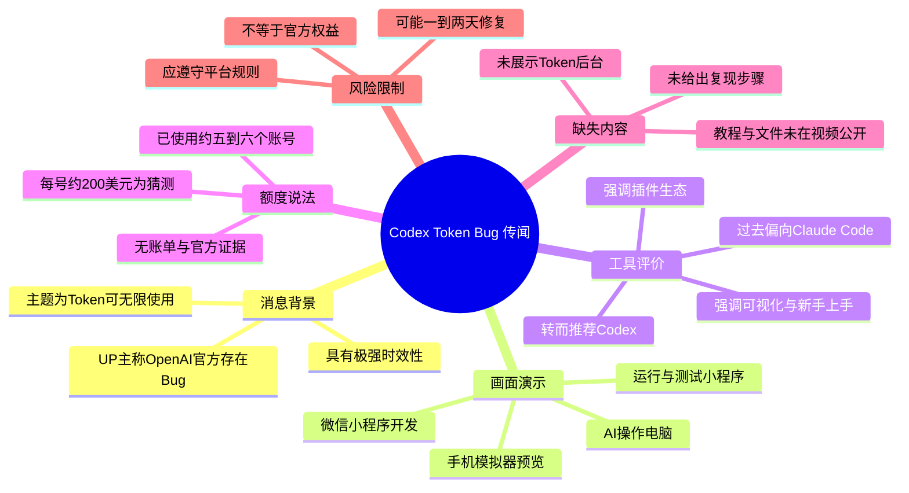
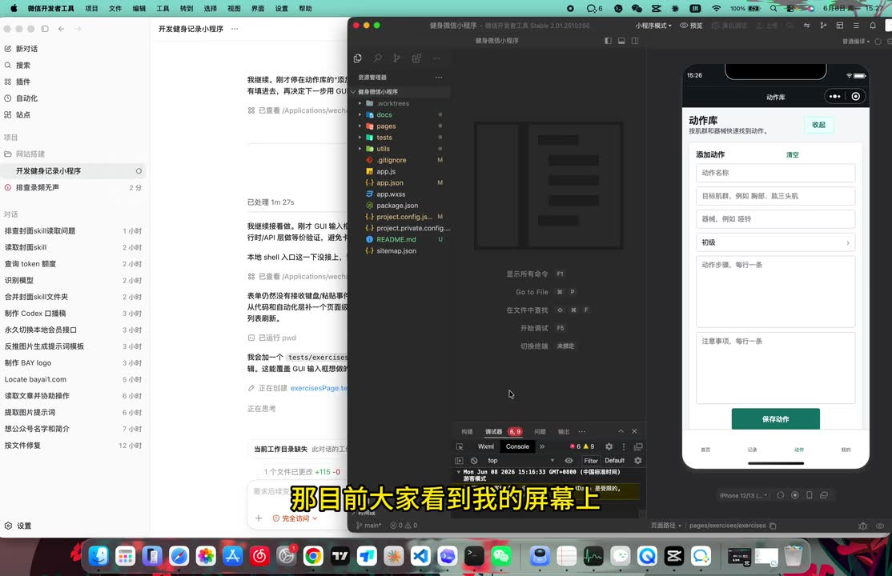
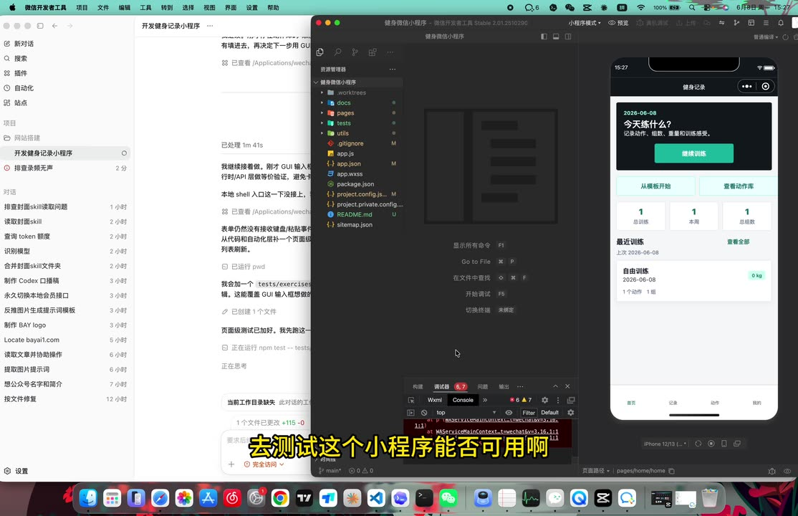
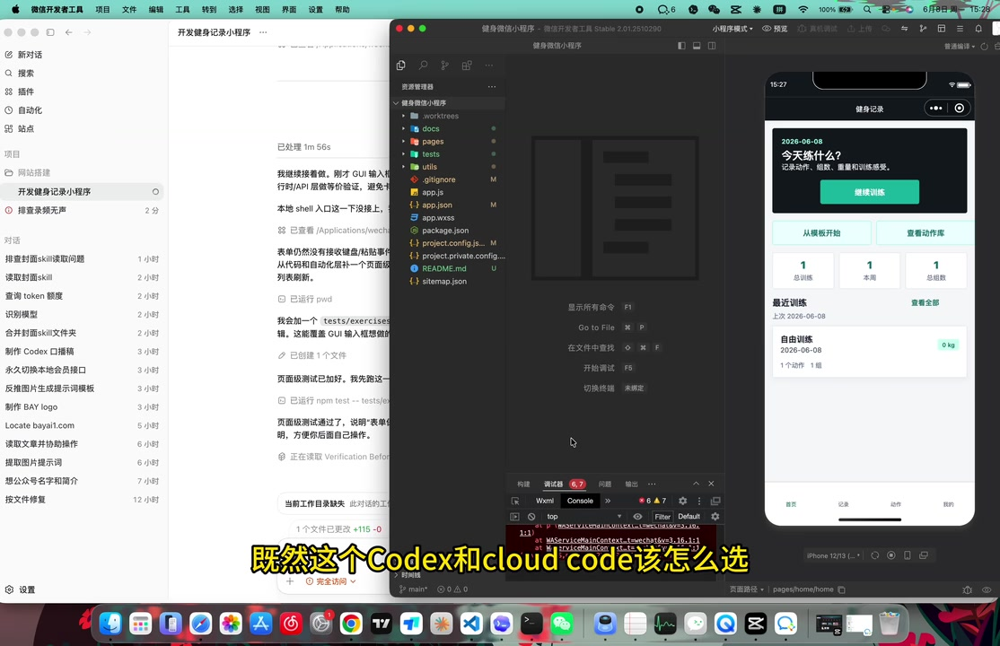

# 突发BUG！Codex可以无限使用token？

> 来源：[Bilibili 视频](https://www.bilibili.com/video/BV1R2ET6fEJK) 
> UP 主：JayJie学AI ｜发布时间：2026-06-08 ｜视频时长：03:11 
> 视频简介称：“十万火急！我已经用了6个账号了，趁着还没拉闸，赶紧薅起来！”

## 小结

视频是一则具有强时效性的工具动态分享。UP 主称，OpenAI 官方账号相关的 Codex（ASR 多处识别为“CodeS”）可能存在一个使 Token 可“无限使用”的 Bug，并提醒观众若尚未修复可尽快关注；但这是一项**未经视频内证据充分验证的个人说法**，不能据此认定为官方功能或稳定权益。

UP 主展示的实际画面并非 Token 配置或账单页面，而是一个由 AI 辅助开发中的微信小程序：左侧是开发/对话记录，中间为代码编辑器与终端，右侧为手机模拟器。其核心演示是 AI 正在操作电脑、运行并测试小程序，画面可见项目文件、调试控制台及模拟器中的页面效果。

在工具选择上，UP 主称自己此前会在 Codex 与 Claude Code 之间“毫不犹豫”选择 Claude Code；但在体验到所称的额度异常后，转而高度评价 Codex 的插件生态和可视化体验，认为它对新手更容易上手。这里属于个人工作流偏好，不构成性能、价格或可靠性的客观对比测试。

视频**没有公开可复现的领取、登录、配置、规避限制或“无限 Token”操作步骤**。UP 主只表示可向其领取相关文件，并以视频流量为条件考虑后续更新教程。因此，不能从本视频整理出可执行的 Bug 利用流程，也不应将其解读为绕过服务配额、批量注册账号或规避平台规则的指导。

UP 主估计该问题若存在，可能在一到两天内修复；同时称自己使用了约五到六个账号，并“猜测”每个账号约有 200 美元额度，但明确表示自己不确定、也没有实际使用过官方 Codex。这些数值均为口述估计，缺乏账单、官方公告或后台页面佐证。

适合读者：希望了解视频中 Codex 与 Claude Code 使用体验差异、AI Agent 可视化开发场景，以及如何审慎判断“突发额度 Bug”消息的开发者。对于配额、订阅权益、账号合规与实际可用性，应以 OpenAI 当时的官方产品页面、账户后台与服务条款为准。

## 思维导图

## 目录

- [背景：一则高度时效的额度异常传闻](#背景一则高度时效的额度异常传闻)
- [画面中的 AI 辅助小程序开发](#画面中的-ai-辅助小程序开发)
- [Codex 与 Claude Code：UP 主的工作流转向](#codex-与-claude-codeup-主的工作流转向)
- [“无限 Token”说法、参数与证据边界](#无限-token说法参数与证据边界)
- [视频实际提供与未提供的操作信息](#视频实际提供与未提供的操作信息)
- [结论、限制与时效性](#结论限制与时效性)
- [字幕比对](#字幕比对)
- [评论分析](#评论分析)
- [处理记录](#处理记录)

## 背景：一则高度时效的额度异常传闻 [00:00](https://www.bilibili.com/video/BV1R2ET6fEJK?t=0)

视频开头说明其录音条件有限：“没有麦克风”，但 UP 主仍决定及时发布。其宣称的新闻点是：OpenAI 官方可能出现了与 Codex 相关的 Bug，导致 Token 可被“无限使用”。

这里需要区分三个层次：

1. **视频中的陈述**：UP 主将此描述为“OpenAI 官方的 Bug”，并称当前可使用“无限 Token”。
2. **标题表达**：标题使用问号——“Codex可以无限使用token？”——表明至少在标题层面保留了不确定性。
3. **可验证证据**：给定素材中未出现 OpenAI 官方公告、账户额度页、Token 使用明细、订阅方案说明、错误日志或服务状态页面。因此，视频本身不足以验证 Bug 的存在、影响范围、触发条件或持续时间。

视频时长仅 191 秒，定位更接近临时资讯与个人体验预告，而不是完整技术教程或正式的产品测评。

## 画面中的 AI 辅助小程序开发 [00:24](https://www.bilibili.com/video/BV1R2ET6fEJK?t=24)

UP 主说明，屏幕上正在开发一个小程序，AI 会“自己去给我操作电脑”、运行该小程序并测试其能否使用。画面呈现出一个多窗口开发环境：

- 左侧：微信开发者工具/相关工作台及对话式任务记录；
- 中间：代码编辑器、项目目录、终端/控制台；
- 右侧：手机模拟器，用于查看小程序页面与交互结果；
- 画面中的项目包含页面、测试、配置等目录或文件，但视频没有逐项讲解代码实现。

> 图：该关键帧同时呈现左侧任务记录、中间代码工程和右侧手机模拟器的“动作库”页面，直观支撑了“AI 正在参与开发和运行小程序”的演示语境；但它并未展示 Token 额度或 Bug 证据。

### 演示结果：运行后在模拟器中验证页面 [00:24](https://www.bilibili.com/video/BV1R2ET6fEJK?t=24)

随着演示推进，右侧模拟器出现“健身记录”页面，可见日期、训练入口、统计卡片、近期训练等界面元素。UP 主以此说明 AI 不只是生成代码，还在操作和测试小程序是否可用。

> 图：模拟器中的“健身记录”首页与训练数据卡片说明程序已能被启动并呈现页面，是理解“运行并测试小程序”这一演示目标的关键画面。它只能证明视频中存在该界面展示，不能独立证明所有功能均已通过测试。

这段演示提供的技术经验是：对于带界面的应用开发，代码生成之外还需要启动项目、观察运行反馈、检查模拟器页面。视频所展示的是这种端到端工作流的结果，而非可复现的自动化配置细节。

## Codex 与 Claude Code：UP 主的工作流转向 [00:49](https://www.bilibili.com/video/BV1R2ET6fEJK?t=49)

UP 主回顾自己此前对 Codex 与 Claude Code 的选择：过去会倾向 Claude Code；但在当天试用所称的 Codex 之后，认为 Codex “非常厉害”，随后进一步强调它“非常牛”。

其给出的理由主要是使用体验，而非基准测试数据：

| 对比维度 | UP 主对 Codex 的表述 | UP 主对 Claude Code 的表述 | 证据性质 |
| --- | --- | --- | --- |
| 插件生态 | 认为生态较好 | 本段未展开比较 | 个人体验 |
| 可视化 | 认为可视化对小白更友好 | 对照为命令行形态 | 个人体验 |
| 上手难度 | “特别简单轻松” | 认为命令行上手较困难 | 主观判断 |
| 推荐倾向 | 称当前主力推荐使用 Codex | 过去曾优先选择 Claude Code | 工作流偏好 |
| 性能、成本、稳定性 | 未给出量化指标 | 未给出量化指标 | 视频未覆盖 |

> 图：画面中间是项目文件与终端，右侧是运行中的模拟器，符合 UP 主对“插件生态、可视化、开发测试”的讨论背景。画面未显示 Codex 或 Claude Code 的版本号、模型、套餐、调用次数或性能对照数据。

### 对新手的可迁移启示 [01:11](https://www.bilibili.com/video/BV1R2ET6fEJK?t=71)

UP 主把“可视化”和“插件”视为降低新手门槛的因素。这一判断可以作为工具选型时的检查维度，但不应直接等同于某个工具在所有任务上更优：

- 若工作内容需要频繁查看文件改动、终端输出、运行预览与调试信息，图形化 IDE/插件整合通常有助于降低上下文切换成本。
- 若团队已有成熟命令行流程、自动化脚本或远程开发环境，则命令行工具的学习曲线未必意味着实际效率更低。
- 应基于实际项目评估：支持的 IDE、可用模型、权限范围、代码修改可控性、测试能力、价格和组织合规要求。

视频没有给出这两类工具的版本号、模型版本、测试任务、耗时、成功率或费用对照，因而无法从中得出通用的产品优劣结论。

## “无限 Token”说法、参数与证据边界 [01:35](https://www.bilibili.com/video/BV1R2ET6fEJK?t=95)

UP 主在此再次将“无限 Token”定义为 OpenAI 官方的一个 Bug，并表示“应该也算”。“应该”这一措辞本身反映出其对问题性质并不完全确定。

### 视频提到的唯一量化信息 [02:21](https://www.bilibili.com/video/BV1R2ET6fEJK?t=141)

视频中出现的额度相关参数如下：

| 项目 | 视频原意 | 可靠性与限制 |
| --- | --- | --- |
| 使用账号数量 | UP 主称已使用约 5～6 个账号 | 个人口述，未展示账号或记录 |
| 单账号额度 | “大概”“应该”约 200 美元 | UP 主明确表示不确定 |
| 所属权益 | 提到官方账号的免费 Token | 未说明账号类型、资格条件、地区、订阅关系或发放规则 |
| 可用状态 | 宣称可“无限”使用 | 未给出累计用量、限流表现、时间窗口或复现条件 |
| 修复预期 | 估计 1～2 天内可能修复 | 个人预测，非官方时间表 |

重要的是，UP 主明确补充：“我不太确定，因为我没有去用过官方的一个 Codex。”因此，视频内部已对“每号约 200 美元”这一说法设置了明显保留。整理时不能将其改写成已确认的固定额度。

### 为什么不能把它视为稳定能力

“无限 Token”可能在不同语境下指代不同现象，例如界面未显示余量、短期试用额度、计量延迟、特定账号状态、后台显示异常，或对配额机制的误读。素材没有提供足够信息区分这些情况。

因此，在事实层面只能记录：

- UP 主报告了一个疑似异常现象；
- UP 主据此调整了对 Codex 的使用推荐；
- 该现象是否真实、是否广泛存在、是否已修复，均无法通过本视频确认。

## 视频实际提供与未提供的操作信息 [02:36](https://www.bilibili.com/video/BV1R2ET6fEJK?t=156)

### 视频实际提供的信息

1. **使用场景**：AI 协助开发、运行和测试微信小程序。
2. **选型经验**：UP 主认为可视化插件形态对新手更友好。
3. **动态提示**：所称额度异常可能短时间内变化。
4. **后续承诺**：UP 主称可向其领取有关文件；若视频获得较高流量，计划再更新教程。

### 视频没有提供的信息

以下内容均未在本视频中展示，不能补写或推断：

- Token 异常的具体触发步骤；
- 账号注册、资格获取、登录方式或地区要求；
- Codex 的安装方式、插件名称、版本号或模型配置；
- API Key、命令、脚本、提示词或配置文件；
- 额度页面、账单截图、调用日志、Token 统计；
- “无限”状态持续时间、最大上限、限流规则；
- 与 Claude Code 在同一任务下的量化比较；
- 所谓“文件”的内容、来源、安全性与适用条件。

### 合规与安全边界

即使某一服务确实存在计费或额度异常，也不意味着可以合规地批量创建账号、绕过限制或持续利用异常。实际使用前应核验官方条款、账号资格与账单信息；不要向非官方来源提供账号密码、验证码、API Key、支付信息或会话令牌。

## 结论、限制与时效性 [03:00](https://www.bilibili.com/video/BV1R2ET6fEJK?t=180)

视频最终再次表示：若本期视频“爆了或者火了”，UP 主会更新“无限 Token”的教程。可见本片本身是预告性质内容，重点是传播一则紧急消息与表达工具偏好，而非完成教程交付。

综合来看：

- **可确认的内容**：视频确实展示了 AI 参与小程序开发、运行与模拟器查看的工作场景；UP 主确实表达了从偏向 Claude Code 到推荐 Codex 的个人态度转变。
- **仅为口述、未验证的内容**：OpenAI 官方 Bug、无限 Token、单号约 200 美元、使用约五到六个账号、将在 1～2 天内修复。
- **无法从视频获得的内容**：Bug 的操作方法、适用账号、可持续性、官方立场、风险范围和后续教程具体内容。
- **时效性**：该视频发布于 2026-06-08，且 UP 主自己预计问题可能迅速修复。任何关于额度状态的判断均只具有发布当时的短期参考价值，不能用于描述当前服务状态。

## 字幕比对

| 字幕来源 | 完整性 | 专有名词 | 时间轴 | 主要问题 |
| --- | --- | --- | --- | --- |
| Bilibili 站内字幕 | 未提供可用站内字幕，无法比对正文 | 无法判断 | 无可用分段 | 素材明确标注“未提供可用站内字幕” |
| 本次 ASR 字幕 | 覆盖较完整：9 段，语音覆盖约 183.09 秒，占视频约 95.98% | 存在误识别，如“CodeS”“Cloud Code”“无线Token”等 | 可用，含 00:00:00,270 至 00:03:09,080 的真实 SRT 分段 | 有口语重复、断句不自然、个别术语和语义错误 |

本次采用 **ASR 时间轴作为章节定位依据**，因为没有可用站内字幕。ASR 诊断显示：识别语言为中文，置信概率约 0.9512；共有 9 个语音段；首段语音起于 00:00:00.270，末段止于 00:03:09.080；未报告大间隔警告。

术语处理遵循“最小校正”原则：

- 视频标题写作 **Codex**，而 ASR 多处写成“CodeS”；正文在涉及产品名称时以标题中的“Codex”为主要写法，并保留 ASR 误识别说明。
- ASR 的“无线 Token”“无纤 Token”结合视频标题与上下文，理解为 UP 主所说的“无限 Token”；这仅是字幕文本规范化，不等于认可其事实真实性。
- “Cloud Code”依据 ASR 音译及上下文记录为 **Claude Code**，但视频没有出现清晰的产品文字对照或版本信息，因此仅用于表述 UP 主的口述比较。
- 关键帧确认了小程序开发、代码编辑器、控制台与手机模拟器等视觉事实；关键帧没有显示 Token 后台或官方额度证明，故未对相关口述作视觉层面的证实。

ASR 结果中**没有** `noAudioStream=true` 标记；素材同时提供了 `audio/audio.wav`，且诊断取得高语音覆盖率，说明源视频存在可识别音轨，并非无音轨视频。

## 评论分析

以下仅分析可获取的热评前三条。三条评论点赞数均为 0，且都没有提供可核验的技术细节。

| 评论者 | 评论内容 | 观点与可用信息 | 可信度分析 |
| --- | --- | --- | --- |
| asdsad12344 | “三连了哥” | 表达支持，并称已完成点赞、投币、收藏等互动（“三连”）。 | 不包含对 Codex、Token 或 Bug 的事实补充。 |
| 比利比利罗 | “有没有呀[doge]” | 结合上下文，可能在询问 UP 主提到的文件或教程是否已提供。 | 问句未说明具体对象，不能证明文件、Bug 或教程存在。 |
| 比利比利罗 | “求文件” | 直接请求视频中提及的“无限 Token”相关文件。 | 反映观众对操作资料的需求，但评论没有包含文件内容、来源或有效性。 |

评论区的主要信号是观众关注后续文件/教程，而不是对 Bug 真实性的独立验证。不能把“求文件”或互动支持视为对额度异常的佐证。

## 处理记录

- Worker ID：`worker-mrj0www4-e8d79408`
- 模型：`gpt-5.6-terra`
- 音频识别模型：`medium`（CUDA / float16；自动识别语言为中文）
- 使用的素材与工具产物：视频元数据、ASR 结果与 SRT 时间轴、关键帧、热评 JSON；未提供可用站内字幕。
- 字幕选择：站内字幕不可用；检查并采用本次 ASR 的 9 个带时间戳分段作为时间轴依据，同时对“Codex / Claude Code / 无限 Token”等明显误识别进行上下文标注与最小规范化。
- 关键帧选择依据：选用 `frames/frame-002.jpg` 展示 AI 开发环境与动作库页面，`frames/frame-003.jpg` 展示运行后的小程序首页，`frames/frame-004.jpg` 展示项目结构、终端与模拟器；这些画面直接服务于“开发、运行、测试”的正文论述。未将关键帧作为额度或 Bug 的证据，因为画面中未出现相关后台信息。
- 热评范围：仅处理素材提供的热评前三条，未扩展检索其他评论。
- 缓存清理：提供的素材未包含缓存清理执行日志或结果，无法确认是否已清理；本记录不对清理状态作编造性声明。
- 未解决问题：无法验证所称 OpenAI Bug、无限 Token 的真实性与当前状态；无法核验约 200 美元额度、五到六个账号的口述；视频未给出文件内容、操作教程、产品版本或官方证据。
