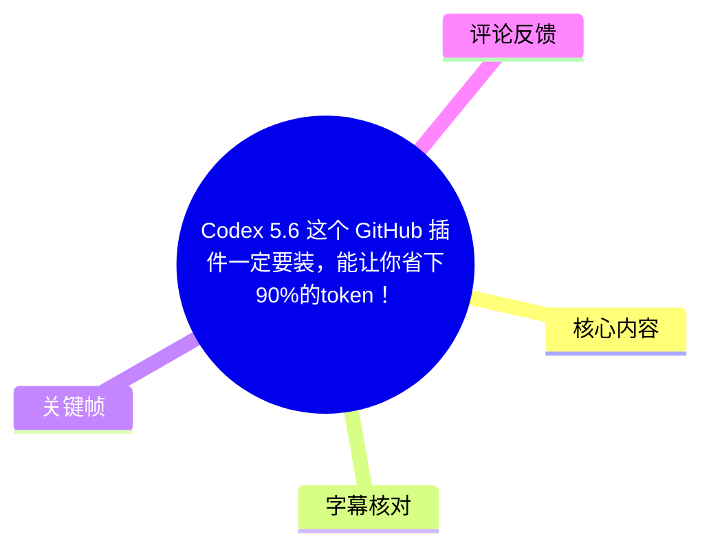
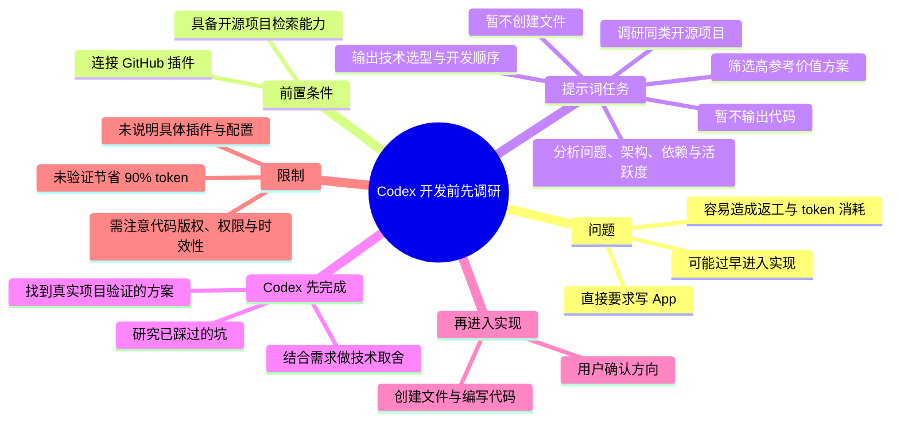

# Codex 5.6 这个 GitHub 插件一定要装，能让你省下90%的token！

> 来源：[Bilibili 视频](https://www.bilibili.com/video/BV1GAuF6CEwb)<br>
> UP 主：MaynorAI｜时长：12 秒｜合集：AIcode  
> 标签：软件、GitHub、token  
> 注：视频未提供可用站内字幕；本次 ASR 亦没有识别出可用语音文本。本文以可见画面文字为主要依据。

## 小结

视频以“90% 的人都把 Codex 用反了”为核心观点，反对一开始就让 Codex 直接“帮我写一个 App”。画面给出的替代流程是：先为 Codex 连接 GitHub 插件，再让它调研同类开源项目、筛选参考方案、分析架构与技术依赖，最后输出技术选型、系统架构、MVP 范围和开发顺序；只有在用户确认方向后，才进入代码实现。

这套方法的关键不在于某一段神奇提示词，而在于把 AI 辅助开发拆成两个阶段：**先调研和决策，后实现**。前一阶段要充分利用已有开源项目的实践信息，减少未经验证的架构选择、重复踩坑与返工；后一阶段才让 Codex 编写文件和代码。

画面宣称该方法“能省下 90% 的 token”，但视频没有提供 token 统计口径、对照实验、项目规模、模型版本差异或插件检索成本。因此，“省下 90%”应理解为作者的经验性宣传结论，不能作为已被视频证明的普适量化事实。

视频中提到的是“GitHub 插件”，但未展示具体插件名称、安装入口、授权范围、配置方法、可访问仓库范围或 Codex 5.6 的官方能力说明。实践时需要自行确认所用 Codex 客户端、插件机制、GitHub 权限和企业代码合规策略。

适合希望用 Codex 或类似代码智能体进行新项目规划、技术选型、原型开发的人阅读。对于已有明确架构、只需修复局部缺陷或编写小函数的任务，先进行大规模开源调研未必划算，应按任务复杂度调整。

## 思维导图





## 目录

- [视频主张与画面证据](#视频主张与画面证据)
- [推荐的提示词与执行步骤](#推荐的提示词与执行步骤)
- [技术经验：为什么先调研再写代码](#技术经验为什么先调研再写代码)
- [参数、限制与时效性](#参数限制与时效性)
- [关键帧说明](#关键帧说明)
- [字幕比对](#字幕比对)
- [评论分析](#评论分析)
- [处理记录](#处理记录)

## [视频主张与画面证据](https://www.bilibili.com/video/BV1GAuF6CEwb?t=0)

由于站内字幕缺失、ASR 没有产生带时间戳的语音分段，无法依据字幕为画面文字建立更细粒度的可靠时间切片。本节链接定位到视频起点；以下内容来自视频关键帧中持续展示的文字画面，而非由语音转写补全。

视频开头的文字主张包括：

- 标题式结论：**“Codex 5.6 这个 GitHub 插件一定要装，能让你省下 90% 的 token！”**
- 对常见使用方式的批评：**“90% 的人都 Codex 用反了。”**
- 被批评的直接指令：**“帮我写一个 App。”**
- 作者提出的替代策略：先连接 GitHub 插件，先调研、做决策，确认后再写代码。

这里的“用反了”并不意味着所有直接编码任务都不适合 Codex；视频的实际论点是，在需求尚未定型、架构尚未确定、需要参考行业已有实现的新项目场景中，直接进入编码会跳过关键的方案验证过程。


> 图：关键帧展示了视频的主要文字内容，包括“先连接 GitHub 插件”、调研提示词及三项预期收益。它是本文梳理方法步骤的直接视觉依据。

## [推荐的提示词与执行步骤](https://www.bilibili.com/video/BV1GAuF6CEwb?t=0)

画面给出的提示词如下。为保留原意，仅进行了换行排版；其中的“XXX”是待开发项目的占位符：

```text
我要开发一个 XXX。暂时不要创建文件，也不要输出代码。
先在 GitHub 调研同类开源项目，筛选出最有参考价值的方案。
分析它们解决了什么问题，采用什么架构、依赖哪些技术，
目前是否活跃，以及有哪些设计值得复用或避免。
最后结合我的需求，给出技术选型、系统架构、MVP 范围和开发顺序。
得到我的确认后，再进入实现阶段。
```

按视频的实际表达，可整理为以下操作顺序：

1. **连接 GitHub 插件**  
   视频将 GitHub 连接能力视为前提，但没有说明具体插件名、启用路径、认证方式或权限范围。实施时不能假设任何未展示的配置步骤。

2. **描述待开发目标**  
   用“我要开发一个 XXX”说明项目方向。视频没有给出需求模板，因此功能边界、目标用户、技术约束、预算、上线环境等细节仍需由使用者自行补充。

3. **明确禁止过早实现**  
   在首轮指令中加入“暂时不要创建文件，也不要输出代码”。这一限制的目的，是防止智能体在信息不足时立即生成代码和工程目录。

4. **调研同类开源项目**  
   要求在 GitHub 查找相近项目，并筛选“最有参考价值”的方案。视频没有给出筛选数量、星标阈值、许可证筛选条件或质量评分规则。

5. **分析项目而非只罗列链接**  
   画面要求分析的维度包括：
   - 项目解决了什么问题；
   - 采用什么架构；
   - 依赖哪些技术；
   - 项目目前是否活跃；
   - 哪些设计值得复用；
   - 哪些设计应避免。

6. **生成项目决策建议**  
   调研后，结合当前需求输出：
   - 技术选型；
   - 系统架构；
   - MVP 范围；
   - 开发顺序。

7. **等待确认，再进入实现**  
   只有“得到我的确认后”，再让 Codex 创建文件、输出代码和推进实现。

这个流程的本质是将“让 AI 写代码”的单轮请求改为“调研—比较—决策—确认—实现”的分阶段协作。视频并未展示真实执行结果，因此不能据此推断该提示词在所有仓库、所有模型或所有项目上都能稳定得到同等质量的调研报告。

## [技术经验：为什么先调研再写代码](https://www.bilibili.com/video/BV1GAuF6CEwb?t=0)

视频明确列出，按上述方法，Codex 会先完成三件事：

1. **找到经过真实项目验证的方案**  
   “真实项目验证”是视频的判断标准，意在避免从零构思时只依赖模型的泛化生成。需要注意：开源项目存在并不自动等于方案适用于当前项目，仍应检查维护状态、适配条件、部署环境与许可证。

2. **研究别人已经踩过的坑**  
   通过阅读同类项目的实现、Issue、Pull Request、文档或变更记录，理论上可识别常见问题和权衡。视频没有展示实际读取哪些 GitHub 信息，也没有证明插件一定能覆盖 Issue、PR 或完整仓库历史。

3. **根据需求做出技术取舍**  
   视频把架构、依赖与开发顺序的判断放在编码之前。该顺序尤其适用于存在多个技术路线的项目，例如需要在快速验证、可维护性、部署复杂度、团队熟悉度之间取舍的场景。

从 token 使用角度，视频隐含的逻辑是：如果前期方向错误，后续代码生成、修改、重构和上下文回填都会持续消耗 token；先压缩不确定性，有机会减少返工轮数。  
但这不等于调研本身“免费”：检索仓库、读取文档、总结多个项目也会产生上下文与调用成本。是否节省 token，取决于调研深度、仓库数量、任务复杂度、模型上下文窗口及后续返工规模。


> 图：画面下方列出“找到经过真实项目验证的方案”“研究别人已经踩过的坑”“根据你的需求做出技术取舍”三项结果，说明视频强调的是开发决策前移，而不是单纯要求模型多写代码。

## [参数、限制与时效性](https://www.bilibili.com/video/BV1GAuF6CEwb?t=0)

### 视频中可确认的参数与信息

| 项目 | 视频或元数据中可确认的内容 |
| --- | --- |
| 视频时长 | 12 秒 |
| 画面方向与分辨率 | 竖屏，1080 × 2160 |
| 工具名称 | Codex、GitHub 插件 |
| 提示词中的项目占位符 | `XXX` |
| 首轮输出约束 | 暂时不创建文件、不输出代码 |
| 调研对象 | GitHub 上的同类开源项目 |
| 调研维度 | 问题、架构、技术依赖、活跃度、可复用/应避免的设计 |
| 决策交付物 | 技术选型、系统架构、MVP 范围、开发顺序 |
| 实现触发条件 | 用户确认方向后再实现 |
| token 节省说法 | “能省下 90% 的 token”，未提供测量方法或证据 |

### 视频未说明的关键事项

以下信息没有出现在已提供的字幕、ASR 或关键帧中，不能补充臆测：

- GitHub 插件的确切名称、来源、版本和安装方式；
- Codex “5.6”具体对应何种产品版本、发布渠道或功能变更；
- GitHub 授权范围、是否需要个人访问令牌、是否读取私有仓库；
- 如何判断“最有参考价值”的开源项目；
- 搜索关键词、仓库数量、筛选规则和分析深度；
- 是否自动分析 Issue、PR、Release、提交频率或安全公告；
- 生成建议的格式、篇幅、是否附带项目链接和证据引用；
- “90% token”节省率的基线、样本量、项目类型与复现实验；
- 对第三方代码的许可证、抄袭风险、供应链安全与数据泄露处理。

### 实践限制与风险

- **检索结果时效性**：GitHub 项目的维护状态会变化。即便提示词要求判断“目前是否活跃”，也应以实际检索当日的 Release、提交记录、Issue 响应和安全公告为准。
- **开源许可证限制**：参考架构、借鉴设计与复制代码是不同层次的行为。若将开源代码直接纳入商业项目，必须自行核对许可证义务。
- **私有代码权限**：给工具连接 GitHub 前，应最小化授权范围，避免不必要地暴露私有仓库、密钥、Issue 或业务资料。
- **模型判断并非审计**：智能体对“架构”“活跃度”“值得复用”的结论需要人工复核，尤其是安全、合规、成本和可运维性决策。
- **小任务不一定受益**：对需求清晰的脚本、局部 Bug 修复、已有代码库内的小改动，完整调研流程可能增加额外成本。
- **标题时效性**：视频标题中的“Codex 5.6”及插件能力属于工具生态信息，可能随产品版本、接入政策与插件可用性变化。本文仅记录视频当时的说法，不将其视为长期不变的官方规格。

## [关键帧说明](https://www.bilibili.com/video/BV1GAuF6CEwb?t=0)

提供的 12 张关键帧均呈现同一类竖屏文字帖画面，未见可据以可靠划分不同内容段落的显著切换。因此选择其中具有完整文字可读性的帧作为正文证据，而不将帧序号推断为精确发生时间。

| 关键帧 | 用途 | 画面价值 |
| --- | --- | --- |
| `frames/frame-001.jpg` | 核心论点与完整提示词 | 可直接核对“先连接 GitHub 插件”“不要创建文件/输出代码”及调研要求。 |
| `frames/frame-006.jpg` | 方法结果 | 清晰展示视频归纳的三项前置工作，支撑“先调研、后编码”的总结。 |
| `frames/frame-012.jpg` | 流程收束 | 保留“等方向确定后，再让它开始写代码”的最终执行条件。 |


> 图：画面结尾强调先确定方向、再开始写代码。这一条件是视频流程中防止过早实现的关键控制点。

## [字幕比对](https://www.bilibili.com/video/BV1GAuF6CEwb?t=0)

| 字幕来源 | 完整性 | 专有名词 | 时间轴 | 主要问题 |
| --- | --- | --- | --- | --- |
| Bilibili 站内字幕 | 未提供可用字幕 | 无法核验 | 无可用 SRT 时间段 | 无法作为正文事实或时间轴依据。 |
| 本次 ASR 字幕 | 空 | 未识别出任何专有名词 | ASR 虽标记具备时间戳能力，但 `segments` 为空，不能建立时间轴 | 诊断显示语言推断为英语、置信度约 0.6006；语音句数为 0、语音覆盖率为 0。 |

本次 ASR 使用模型为 `large-v3-turbo`，识别结果为空，并带有“未识别到语音分段”的诊断警告。素材中**没有** `noAudioStream=true` 标记，因此不能断言源视频没有音轨；只能如实记录为：已有音频文件，但 ASR 未检测到可转写语音。

最终未采用站内字幕或 ASR 文本，而是采用关键帧可见的中文文字进行多模态整理。通过画面确认并保留的关键术语包括：

- Codex 5.6；
- GitHub 插件；
- token；
- MVP；
- 技术选型；
- 系统架构；
- 开发顺序。

由于没有可用的带时间戳文本，本文所有正文章节均链接到 `t=0`，不伪造秒级内容切分。

## [评论分析](https://www.bilibili.com/video/BV1GAuF6CEwb?t=0)

本次素材提供的热评数据中，`items` 为空；虽然视频元数据显示共有 3 条回复，但未获取到可分析的热评正文。

因此没有可供归纳的评论观点、补充信息或争议内容，也不能将未获取到的评论数量视为用户认可或反对该方法的证据。

## [处理记录](https://www.bilibili.com/video/BV1GAuF6CEwb?t=0)

- Worker ID：`worker-mrj0www4-e8d79408`
- 模型：`gpt-5.6-terra`
- ASR 模型：`large-v3-turbo`（CUDA，`int8_float16`）
- 使用的素材工具产物：视频元数据、音频文件、ASR 诊断与结果、关键帧 `frames/`、评论数据 `comments/comments.json`。
- 字幕选择：站内未提供可用字幕；本次 ASR 的 `segments` 为空，未采用。正文改以关键帧画面文字为依据。
- 关键帧选择依据：`frame-001.jpg`、`frame-006.jpg`、`frame-012.jpg`均清晰呈现完整或关键的中文文字内容；所有提供帧画面高度相近，无法据帧序号可靠推定细分时间。
- 时间轴处理：无站内 SRT、无 ASR 语音分段，故未编造内容级秒数；章节统一链接到视频起点 `t=0`。
- 评论处理：仅允许处理可获取热评前三条；本次实际可获取热评为 0 条，未作推断性分析。
- 缓存清理：素材清单未提供缓存清理执行记录，无法确认是否已清理；不虚构清理结果。
- 未解决问题：具体 GitHub 插件名称与配置、Codex 5.6 的产品定义、90% token 节省的测量依据、实际执行效果及源视频是否存在可听语音，均无法从现有素材验证。

## 评论分析

本次流程未获取到可用热评，因此不推断观众态度或额外结论。
