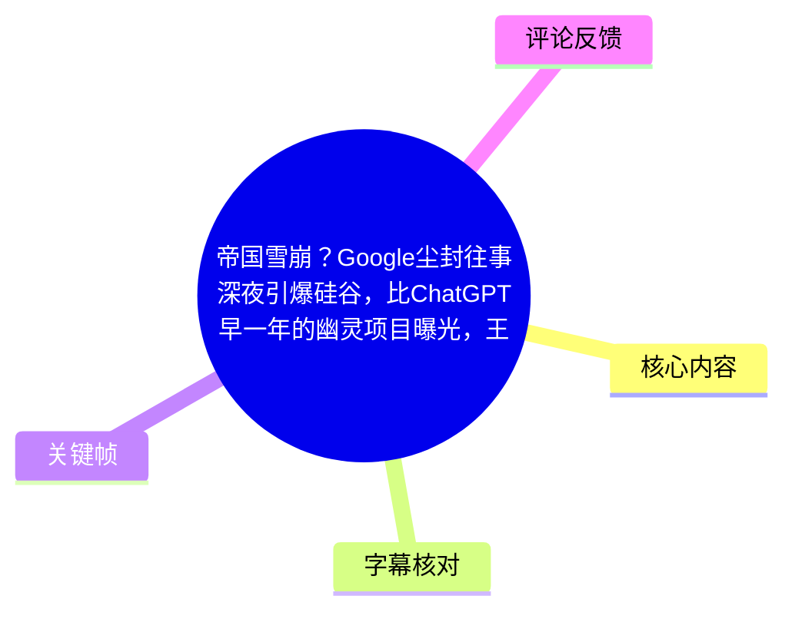
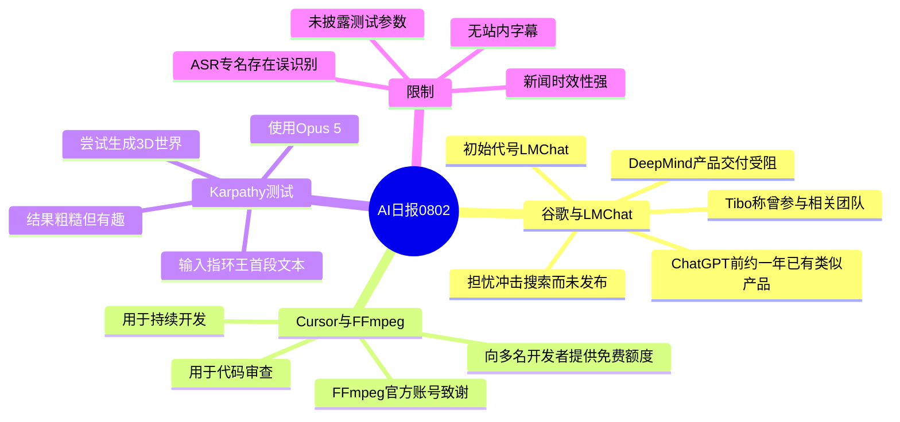
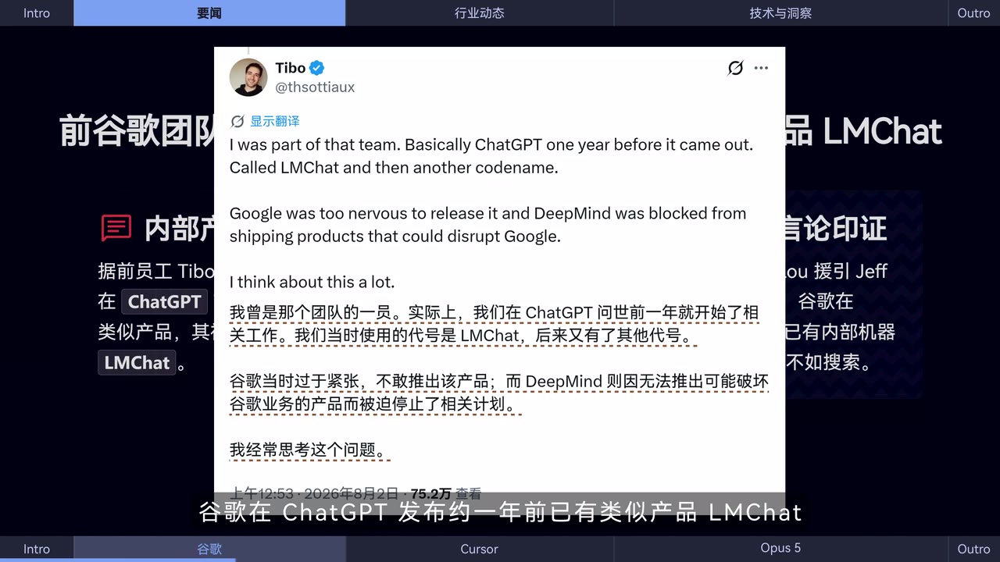
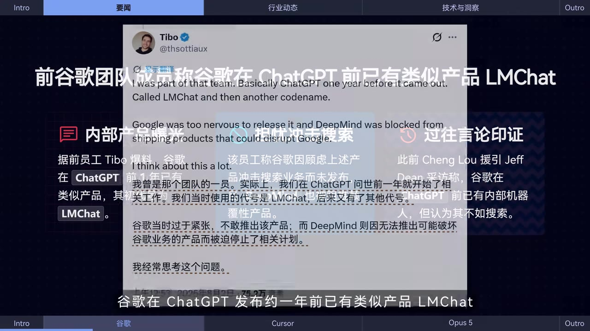
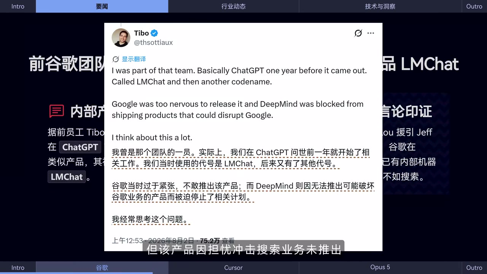

# 帝国雪崩？Google尘封往事深夜引爆硅谷，比ChatGPT早一年的幽灵项目曝光，王座拱手让人！| AI日报0802

> 来源：[Bilibili 视频](https://www.bilibili.com/video/BV1y33969ETz)  
> UP 主：黑鸦Heya｜视频时长：00:50｜分辨率：3840 × 2160  
> 信息性质：短时效 AI 新闻播报。视频发布于 2026-08-02，所述动态应以相关当事人后续公开说明为准。

## 小结

本期 50 秒 AI 日报集中播报三则动态：一是前谷歌团队成员 Tibo 表示，谷歌在 ChatGPT 发布约一年前已开发出类似产品，初始代号为 **LMChat**，但因担心冲击搜索业务而没有推出；二是 **FFmpeg** 官方账号感谢 Cursor 向多名 FFmpeg 开发者提供免费额度，用于持续开发与代码审查；三是 Andrej Karpathy 用 **Opus 5** 测试从《指环王》首段文字生成可渲染 3D 世界的能力，评价是“粗糙但有趣”。

视频中最具讨论度的是 LMChat 事件。画面展示的 Tibo 原帖进一步称，他曾是相关团队成员；谷歌当时因过于紧张而未发布该产品，DeepMind 也被阻止交付可能扰动谷歌业务的产品。视频还以“过往言论印证”的形式提及 Cheng Lou 对 Jeff Dean 的采访，但这部分只可视为视频转述，不能据此推导谷歌内部所有产品决策的完整因果链。

对开发者而言，FFmpeg 与 Cursor 的消息说明：AI 编程工具的额度支持可被开源项目用于维护工作，尤其是持续开发与代码审查；但视频没有披露额度数量、发放对象名单、兑换条件、使用期限或 Cursor 的具体合作机制，因此不能将其理解为普遍适用的长期资助政策。

Karpathy 的演示提供的经验是：不要只依赖单一、传统或脱离实际应用的 LLM 测试方式，而要用包含自然语言理解、场景组织与视觉/图形输出要求的综合任务观察模型能力。不过，视频未给出完整提示词、运行环境、渲染管线、评测指标、结果截图或可复现实验链接；“3GS”的 ASR 转写存在不确定性，不能据此确认具体技术栈。

本视频为新闻摘要而非深度调查或教程。它适合关注 AI 行业动态、开源软件维护及生成式 3D 能力的人快速浏览；涉及谷歌内部历史、FFmpeg 资助详情和模型测试结论时，应回到原帖、官方公告或可复现实验材料进行核验。

## 思维导图

## 目录

- [新闻背景与证据边界](#新闻背景与证据边界)
- [谷歌 LMChat：已有类似产品但未发布](#谷歌-lmchat已有类似产品但未发布)
- [Cursor 向 FFmpeg 开发者提供免费额度](#cursor-向-ffmpeg-开发者提供免费额度)
- [Karpathy 的 3D 世界生成测试](#karpathy-的-3d-世界生成测试)
- [可迁移的实践观察框架](#可迁移的实践观察框架)
- [关键帧索引](#关键帧索引)
- [结论与限制](#结论与限制)
- [字幕比对](#字幕比对)
- [评论分析](#评论分析)
- [处理记录](#处理记录)

## 新闻背景与证据边界 [00:00](https://www.bilibili.com/video/BV1y33969ETz?t=0)

这是一条由三则短讯组成的 AI 日报，ASR 的有效语音从 **00:00.300** 开始，到 **00:48.740** 结束，覆盖约 48.44 秒，占音频总时长约 98.5%。由于本次 ASR 仅产生两个长分段，且站内字幕不可用，无法为每一条短讯提供经字幕逐句确认的更细粒度起止时间。

阅读本片时需区分三类信息：

1. **当事人陈述**：Tibo 的帖文内容，以及 FFmpeg 官方账号、Andrej Karpathy 的公开发帖，均由视频转述或展示。
2. **视频的归纳**：例如“担忧冲击搜索业务未推出”“用于支持持续开发和代码审查”等，是对帖文信息的中文摘要。
3. **不可由本片验证的细节**：LMChat 的能力、开发完成度、产品决策流程；Cursor 免费额度的规模与规则；Opus 5 的具体版本、提示词及“3GS”所代表的技术，均未完整披露。

## 谷歌 LMChat：已有类似产品但未发布 [00:00](https://www.bilibili.com/video/BV1y33969ETz?t=0)

### 视频陈述

ASR 的首段从 00:00.300 延续至 00:24.630，其中首先播报谷歌相关消息：Codex 负责人 **Tibo** 在回复某个帖子时称，谷歌在 ChatGPT 发布约一年前已经有类似产品；他曾在相关团队工作，该产品最初代号为 **LMChat**。视频称，谷歌因担心此类产品会冲击搜索业务而没有推出。

画面中展示的英文原帖和中文翻译补充了比 ASR 更明确的内容：

- Tibo 称：“I was part of that team.”
- 他表示，该产品“基本上是在 ChatGPT 发布一年前的 ChatGPT”。
- 该项目当时的代号是 **LMChat**，后来还有其他代号。
- 帖文称谷歌对于发布它“过于紧张”。
- 帖文还称 DeepMind 被阻止交付可能扰动谷歌业务的产品。
- Tibo 表示自己经常思考这件事。

> 图：该帧直接展示 Tibo 的英文原帖及画面内的中文翻译，是核对“LMChat”“ChatGPT 前一年”“担忧发布影响谷歌业务”等关键表述的核心视觉证据。它比 ASR 中连写且存在专名误识别的文本更适合确认项目代号与原话范围。

### 视频给出的“过往言论”关联

画面总览还列出“过往言论印证”：此前 Cheng Lou 在采访 Jeff Dean 时，提及谷歌在 ChatGPT 前已有内部聊天机器人，但认为其不如搜索。这是视频画面中的概述性信息，当前素材没有提供采访原文、完整上下文、日期或链接，因此只能记录为视频所展示的关联线索，不能将其直接视为对 LMChat 项目细节的独立证实。

> 图：该帧将本条新闻组织为“内部产品曝光、担忧冲击搜索、过往言论印证”三部分，清楚呈现视频的叙事结构；其中前两项有 Tibo 帖文画面支撑，第三项仍需追溯采访原始材料。

### 应如何理解“未推出”

“未推出”只能说明视频转述中存在“没有正式发布/交付”的说法，并不自动等于：

- 产品已达到面向公众稳定可用的完成度；
- 产品能力与后来 ChatGPT 完全相同；
- 谷歌所有相关项目均被停止；
- 搜索业务顾虑是唯一决策原因；
- 某个单一团队或个人可代表谷歌全部管理层决策。

因此，这则新闻更适合作为“大公司既有技术能力与产品化激励可能错位”的案例线索，而非判断各家模型能力高低的充分证据。

## Cursor 向 FFmpeg 开发者提供免费额度 [00:00](https://www.bilibili.com/video/BV1y33969ETz?t=0)

ASR 首段在谷歌消息后提到：**FFmpeg 官方账号发文感谢 Cursor 为多名 FFmpeg 开发者提供免费额度**。第二个 ASR 分段继续说明，FFmpeg 表示这些额度将用于支持项目的持续开发和代码审查工作。

可从视频中确定的事项包括：

| 项目 | 视频可确认的内容 |
| --- | --- |
| 提供方 | Cursor |
| 致谢方 | FFmpeg 官方账号 |
| 受益对象 | 多名 FFmpeg 开发者 |
| 支持形式 | 免费额度 |
| 用途 | 持续开发、代码审查 |

视频未说明的关键参数包括：免费额度数额、是 API 额度还是产品订阅额度、获得资格、发放时间、有效期、适用模型、是否有商业或数据使用条件，以及对 FFmpeg 合并代码的质量控制流程。

### 对开源维护的实际启示

若开源维护者获得 AI 工具额度，较合理的使用边界可包括：

1. **辅助理解历史代码与变更上下文**：用于定位模块关系、归纳提交记录或梳理待办事项。
2. **协助代码审查**：让工具提示潜在边界条件、风格不一致或测试缺口，但不能替代维护者审查。
3. **生成或补充测试思路**：优先在隔离环境中验证，再决定是否提交。
4. **保留人工责任链**：对于性能、兼容性、安全、版权和许可证相关改动，最终判断仍应由项目维护者完成。

视频没有展示任何 Cursor 操作界面、命令、代码样例或评测数据，因此这里不能延伸为特定 Cursor 工作流教程。

## Karpathy 的 3D 世界生成测试 [00:24](https://www.bilibili.com/video/BV1y33969ETz?t=24)

第二段 ASR 从 **00:24.630** 开始。视频称，Andrej Karpathy 近日发帖表示，不应再使用一种被 ASR 识别为“醍醐骑自行车”的方式测试 LLM；这串文字语义不通，无法仅据现有素材可靠还原其原始术语，故不作擅自校正。

视频可较明确确认的测试描述为：

1. Karpathy 使用 **Opus 5** 进行测试。
2. 他向模型输入《指环王》的第一段文本。
3. 要求模型通过被 ASR 识别为“3GS”的方式渲染该故事。
4. 目标是考察模型的 **3D 世界生成能力**。
5. 他对结果的评价是：**有些粗糙，但很有趣**。

### 这类测试在观察什么

按照视频描述，这不是仅考察问答准确率的任务，而是将文学文本转换为可视化三维场景的综合任务。它可能涉及：

- 从文本提取人物、地点、时间、动作与氛围；
- 将叙事关系转化为空间布局和可见对象；
- 生成或编排渲染逻辑；
- 处理视觉效果与交互/展示结果之间的衔接。

但上述只是由“文本输入—3D 世界生成”任务形式可推得的能力维度，不是视频披露的模型内部机制或正式测评结论。

### 复现时必须补齐的参数

如要将此类演示做成可比较实验，至少应记录：

| 参数类别 | 本视频是否给出 | 复现时应补充 |
| --- | ---: | --- |
| 模型名称 | 部分给出：Opus 5 | 完整型号、版本、访问日期 |
| 文本输入 | 仅称《指环王》第一段 | 原文版本、完整文本、语言与长度 |
| 提示词 | 未给出 | 系统提示词、用户提示词、迭代轮次 |
| 图形技术 | ASR 识别为“3GS”，不确定 | 实际引擎、库、版本与运行环境 |
| 生成结果 | 仅有“粗糙但有趣”的评价 | 源码、截图/视频、错误日志 |
| 评价标准 | 未给出 | 可运行性、语义一致性、帧率、资产质量、人工评分 |
| 成本与时延 | 未给出 | Token 用量、生成时长、设备配置 |

特别是“3GS”这一术语：它来自 ASR，未获得站内字幕或清晰画面文字交叉验证。不能把它等同于任何特定 3D 引擎、渲染框架或图形技术。

## 可迁移的实践观察框架 [00:24](https://www.bilibili.com/video/BV1y33969ETz?t=24)

结合视频的三条新闻，可以形成一套较谨慎的 AI 信息判断方法：

### 1. 区分“技术存在”与“产品发布”

LMChat 话题提醒我们，内部原型、可用产品和规模化商业发布是不同阶段。判断一个“曾经存在的项目”时，应分别询问：

- 是概念验证、内部工具，还是可对外提供的产品？
- 是否有安全、成本、性能、合规和用户体验方面的公开证据？
- 未发布是否仅因商业冲突，还是还存在其他未披露约束？

### 2. 把开源额度视为资源，而非质量保证

Cursor 对 FFmpeg 开发者的额度支持可以降低部分开发与审查成本，但不能证明 AI 生成代码天然可靠。适合采用“AI 提议—自动化测试—人工复审—小范围合并”的流程，而非跳过维护治理机制。

### 3. 用可复现的综合任务评估模型

Karpathy 的案例强调任务真实性：如果要考察模型是否能完成创作与工程结合的工作，应记录输入、提示、工具链、输出与评价标准。仅凭一张演示图或一句“很有趣”不足以比较不同模型。

## 关键帧索引

| 关键帧 | 对应内容 | 正文使用价值 |
| --- | --- | --- |
|  | LMChat、搜索业务顾虑、过往言论三栏概述 | 展示视频如何组织谷歌新闻的论点与线索。 |
|  | Tibo 帖文截图与视频字幕 | 用于比对视频字幕覆盖的原帖信息，辅助识别“LMChat”专名。 |
|  | 英文原帖及中文翻译 | 直接支撑“曾参与团队”“ChatGPT 前一年”“DeepMind 受阻”等表述。 |
|  | 原帖中“Google was too nervous to release it”相关段落 | 聚焦“担忧冲击搜索/谷歌业务”这一视频核心归因，但仍应理解为发帖者陈述。 |

> 现有可见关键帧均聚焦谷歌 LMChat 新闻。没有获得可供核对 Cursor/FFmpeg 或 Karpathy 测试画面的明确关键帧，因此正文未为这两条消息添加未经确认的图片说明。

## 结论与限制 [00:48](https://www.bilibili.com/video/BV1y33969ETz?t=48)

视频在 00:48.740 左右结束，属于高度压缩的新闻播报。核心信息可归纳为：

- **谷歌 LMChat**：视频展示的 Tibo 帖文称，谷歌在 ChatGPT 前约一年已拥有类似产品，并因担忧影响既有业务而未发布；这是理解“大公司创新者困境”的一个当事人视角。
- **FFmpeg 与 Cursor**：AI 工具额度正进入开源维护场景，可服务于持续开发与代码审查，但额度规则和实际影响尚未披露。
- **Opus 5 的 3D 测试**：文本到三维场景生成是比传统静态问答更综合的能力观察任务；当前公开视频信息不足以进行严格复现或横向性能比较。

主要限制如下：

1. 视频时长仅 50 秒，信息密度高，未展示完整消息来源、原始链接或技术细节。
2. 站内字幕未能获取，字幕工具记录显示 `Invalid URL`；因此没有可用站内 SRT 可作逐字对照。
3. 本次 ASR 时间覆盖完整，但只有两个长分段，多个专有名词存在连写、同音或误识别。
4. 谷歌事件的关键证据是当事人公开帖文，不等同于完整内部档案或官方企业说明。
5. FFmpeg 支持政策、Opus 5 测试结果均可能随时间变化，阅读时应优先检查当事人或官方最新公告。

## 字幕比对

| 字幕来源 | 完整性 | 专有名词 | 时间轴 | 主要问题 |
| --- | --- | --- | --- | --- |
| Bilibili 站内字幕 | 不可用 | 无法评估 | 无法评估 | 素材未提供可用站内字幕；字幕获取工具警告为 `Invalid URL`。 |
| 本次 ASR 字幕 | 较完整，语音覆盖约 98.5% | 存在多处不稳定识别 | 可用，共 2 段真实时间戳 | 分段过长；“FmPaget”“额渡”“醍醐骑自行车”“3GS”等转写存在明显疑点。 |

### 最终字幕选择与校正原则

最终以**本次 ASR 的真实时间轴**作为章节定位依据：第一段为 **00:00.300–00:24.630**，第二段为 **00:24.630–00:48.740**。由于站内字幕不可用，未进行站内字幕文本合并。

结合关键帧进行的有限校正如下：

- ASR 中的 “Teebo” 与画面帖文账号对应为 **Tibo**。
- ASR 中的 “LMChat” 可由原帖画面明确确认。
- ASR 的 “FmPaget / FF MPAG” 根据语境与视频口播主题整理为 **FFmpeg**；画面未提供该条新闻截图，故仅作为高置信度语境校正记录。
- “额度”是对 ASR “额渡”的常规文字修正。
- “醍醐骑自行车”与“3GS”没有足够的画面或原文材料确认，正文保留其“ASR 识别结果不确定”的状态，不强行扩展为具体术语。

ASR 诊断中**未标记** `noAudioStream=true`；相反，已提取音频并识别到近完整语音覆盖，因此不存在“源视频没有音轨”的情形。

## 评论分析

以下仅分析当前可获取的热评前三条。评论反映观众态度和讨论线索，不作为已验证事实。

### 1. 银河帝国太阳系星区（167 赞）

该评论以体育解说式戏仿长文批评谷歌 AI 的产品延期、版本表现和组织管理，并提到 Gemini 3.1、3.5 Pro、Gemini 4、Kimi、DeepSeek、千问等多个名称。

- **观点**：评论者认为谷歌 AI 存在“起步早、落地慢”的问题，且对其模型更新与产品战略持强烈负面态度。
- **补充信息**：提及多款模型及其可能的发布、跑分或竞争关系，但没有来源链接和可核验数据。
- **可信度与争议**：文本明显采用讽刺、夸张和二创表达，适合作为社区情绪样本，不能作为 Gemini 版本性能、发布状态或谷歌内部管理情况的事实依据。

### 2. 比利王987（317 赞）

> “谷歌要被百度同化了，起大早赶晚集这一块”

- **观点**：以“起大早赶晚集”概括谷歌拥有早期技术储备、却未能及时形成市场产品的印象。
- **与视频的关系**：与视频中 LMChat 在 ChatGPT 前约一年存在但未发布的叙事直接呼应。
- **可信度与争议**：这是价值判断和类比，不提供新的可核查证据；“被同化”的说法是情绪化修辞，不宜作事实解读。

### 3. Guajava（308 赞）

> “当年我还转发给朋友，嘲笑这人炼丹炼魔怔了[笑哭]谁曾想半年后chatgpt就公布了”

- **观点**：评论者回顾自己曾不看好某位从业者或相关观点，后因 ChatGPT 发布而改变认知。
- **补充信息**：反映 ChatGPT 发布前后公众对大模型能力预期发生变化的个人记忆。
- **可信度与争议**：没有说明“这人”具体是谁、何时何地发表过何种观点，因此不可用于还原具体事件；其价值主要是呈现观众对技术突破后见之明的反思。

## 处理记录

- **Worker ID**：worker-mrj0www4-e8d79408
- **模型**：gpt-5.6-terra
- **ASR 模型与参数**：large-v3-turbo；语言识别为 `zh`，置信度 0.998046875；CUDA 推理；`int8_float16`。
- **使用的素材工具结果**：已提供视频元数据、音频 `audio/audio.wav`、关键帧目录、ASR SRT、ASR 分段 JSON 和热评 JSON；站内字幕获取尝试失败，警告为 `subtitles: Tool process exited with code 1` 与 `Invalid URL`。
- **字幕选择**：站内字幕不可用；检查并采用本次 ASR 的两段真实时间戳作为时间轴基础。ASR 无 `noAudioStream=true` 标记，且语音覆盖率为 98.5%。
- **关键帧选择依据**：选择 `frame-001` 至 `frame-004`，因为其画面明确展示 LMChat 主题页、Tibo 原帖、英文原文及中文翻译，可直接支撑谷歌部分的核心表述；未对未见明确画面的 Cursor 和 Karpathy 新闻虚构配图含义。
- **时间轴依据**：章节链接仅使用 ASR/SRT 可直接确认的 00:00、00:24 和 00:48 秒位置；未依据文稿顺序虚构 Cursor 新闻或谷歌子论点的精确秒点。
- **缓存清理**：素材中未提供缓存清理执行记录；本整理未声明已执行任何未经证实的缓存删除操作。
- **未解决问题**：无法取得站内字幕；无法由现有素材确认 Karpathy 原帖中被 ASR 识别为“醍醐骑自行车”“3GS”的原始英文术语；FFmpeg 免费额度的数量、规则和期限未披露。
