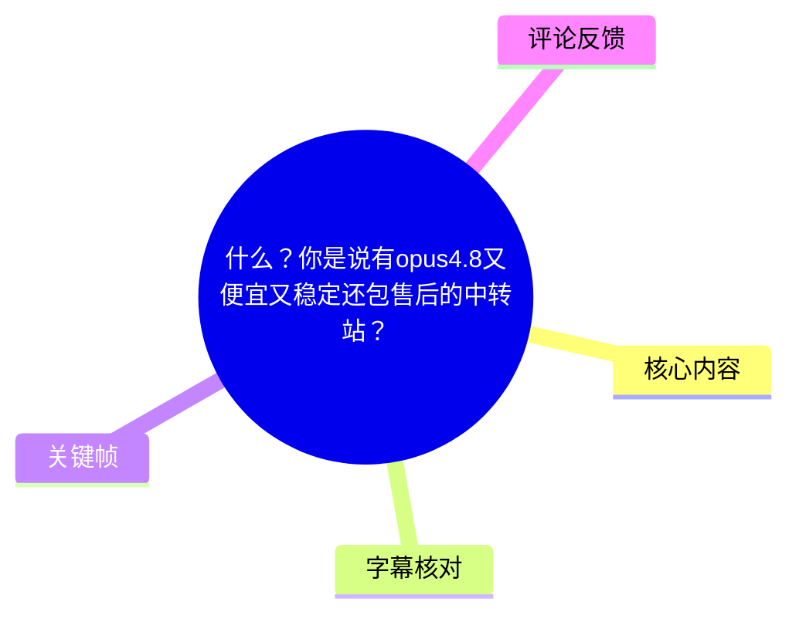
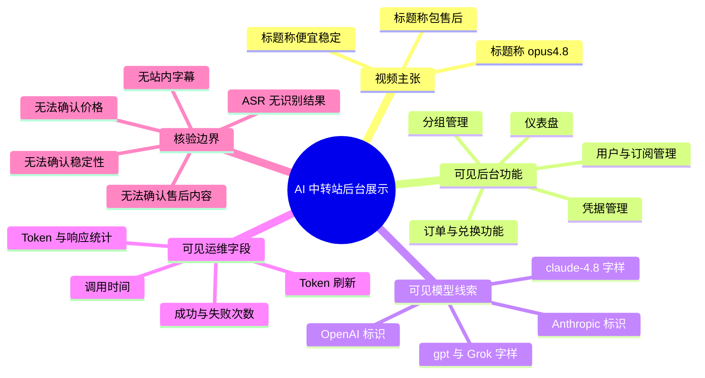
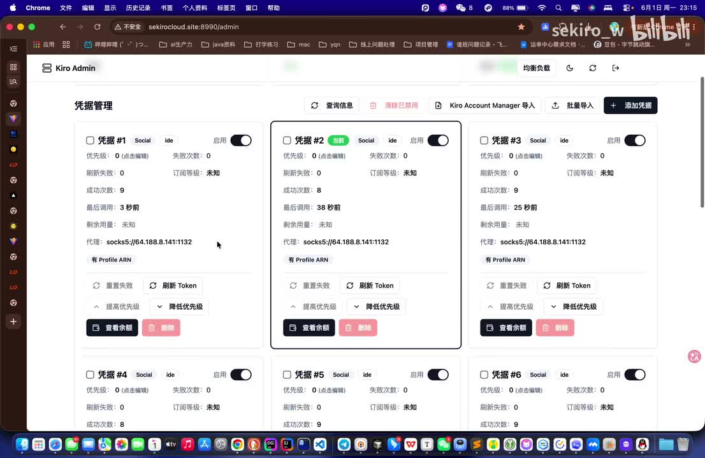
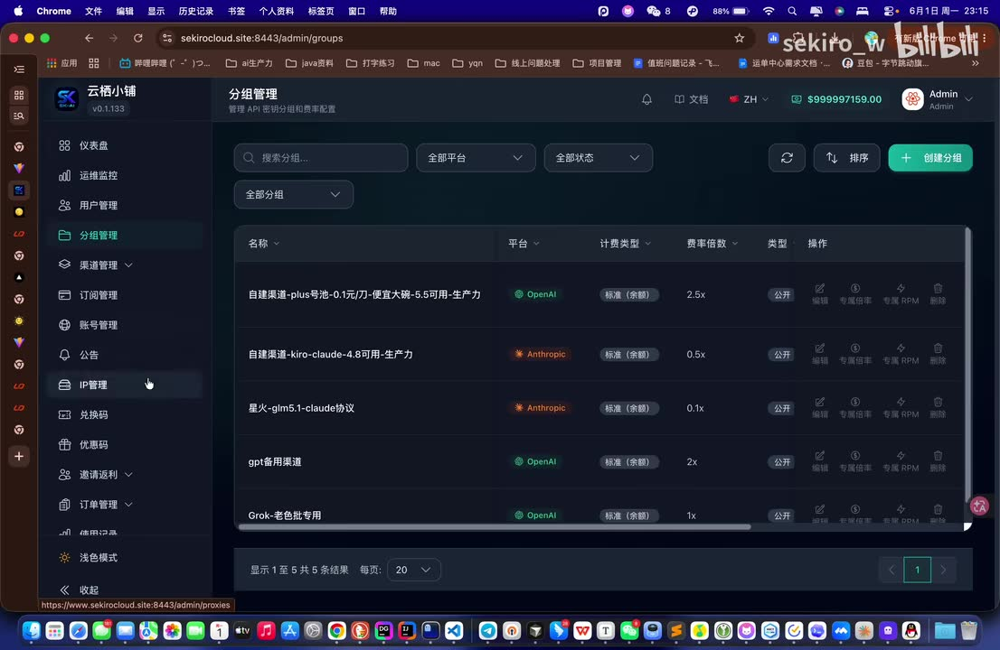
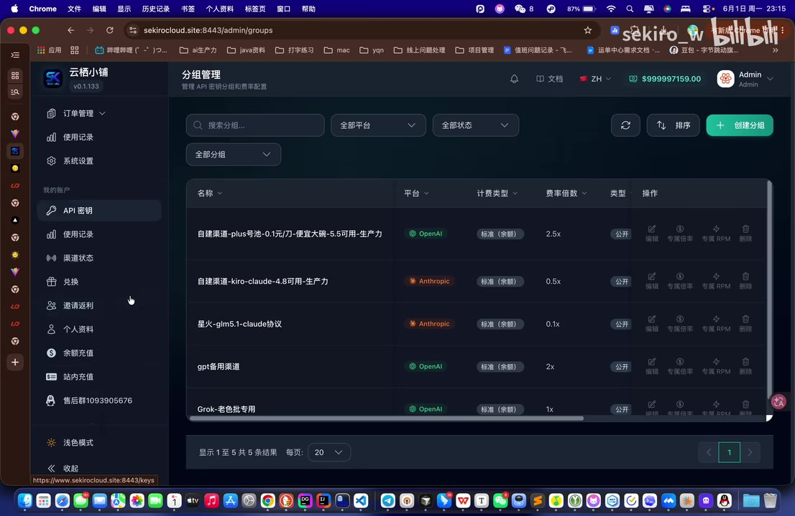
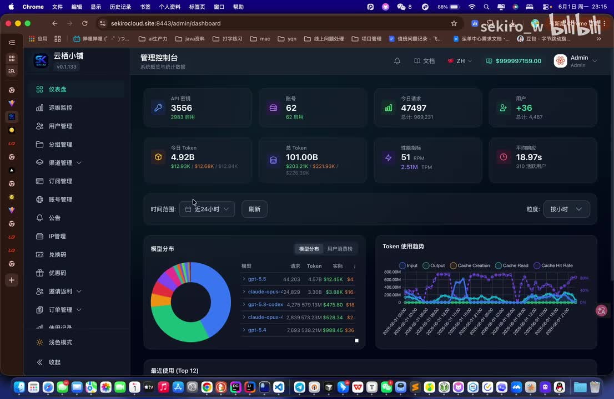

# 什么？你是说有opus4.8又便宜又稳定还包售后的中转站？

> 来源：[Bilibili 视频](https://www.bilibili.com/video/BV1U9Vf6EEWx)  
> UP 主：sekiro_w｜时长：49 秒｜合集：AIcode  
> 标签：直播、cladue、售后、记录、code、中转站、opus、token、gpt、openai

## 小结

本视频以屏幕录制方式展示一个名为“云栖小铺”的后台管理界面，并在标题中宣传一个提供 **“opus4.8”** 的中转服务，卖点被概括为“便宜、稳定、包售后”。不过，视频素材中没有可用的语音识别文本，也没有站内字幕，因此无法从口播核验具体套餐、单价、模型接口、调用规则、稳定性指标或售后承诺的细节。

可从关键帧直接确认的内容包括：后台存在仪表盘、凭据管理、分组管理、渠道管理、用户管理、订阅管理、订单管理、兑换码、优惠码、邀请码、使用记录等菜单；管理端分组列表中出现了包含 Anthropic、OpenAI 的平台标识，以及带有 `claude-4.8`、`gpt`、`Grok` 等字样的分组名称。

截图中的一个 Anthropic 分组名称含有“`kiro-claude-4.8可用-生产力`”字样，因而可以确认：**该后台界面至少展示了一个名称中包含 Claude 4.8 的分组。** 但“opus4.8”是否为实际可调用的官方模型标识、是否等同于 Claude Opus、具体版本号为何、是否对所有用户可用，均不能仅据截图确认。

视频还展示了凭据卡片及调用统计界面：卡片有启用开关、失败次数、成功次数、最后调用时间、代理地址、刷新 Token 等字段；仪表盘中则显示 API 密钥、账号、当日请求、当日 Token、总 Token、平均响应等运营指标。这些内容说明服务具有一定的后台管理与监控设计，但**不能直接证明其稳定性、价格优势或售后质量**。

适合将本文作为“如何审阅 AI 中转站宣传素材”的案例记录，而不宜将其视为购买建议。涉及账号、Token、代理、第三方转发服务时，应优先核验服务条款、模型来源、数据处理方式、计费规则、退款政策与账号安全风险。

## 思维导图

## 目录

- [素材范围与时间轴说明](#素材范围与时间轴说明)
- [后台界面与服务管理能力](#后台界面与服务管理能力)
- [模型与分组信息](#模型与分组信息)
- [可见运营指标与凭据管理](#可见运营指标与凭据管理)
- [实践核验步骤](#实践核验步骤)
- [结论、限制与时效性](#结论限制与时效性)
- [字幕比对](#字幕比对)
- [评论分析](#评论分析)
- [处理记录](#处理记录)

## [素材范围与时间轴说明](https://www.bilibili.com/video/BV1U9Vf6EEWx?t=0)

视频总时长为 49 秒。本次素材没有提供可用的 Bilibili 站内字幕；本次 ASR 已执行，但识别结果为空，未产生任何可用的带时间戳语音分段。

因此，无法依据 ASR/SRT 中真实的起止时间为各画面建立精确秒级定位。本文所有章节统一链接至视频起点 `t=0`，仅作为进入视频的入口，**不表示该章节内容发生在 00:00，也不以画面文件顺序推断视频时间位置**。

可用证据的优先级如下：

1. **关键帧中的可读界面文字**：可用于确认界面上实际显示的名称、菜单与字段。
2. **视频标题与元数据**：可用于记录 UP 主的宣传表述与视频基本信息。
3. **热评**：仅作为评论者观点或补充线索，不能替代事实验证。
4. **ASR 与站内字幕**：本视频均未提供可用内容，不能用于还原口播或时间轴。

## [后台界面与服务管理能力](https://www.bilibili.com/video/BV1U9Vf6EEWx?t=0)

关键帧显示的管理系统标题为“云栖小铺”，页面右侧显示“Admin”身份；截图地址栏中可见 `sekirocloud.site:8443/admin/...` 等管理路径。这里仅记录为视频所展示的界面信息，不据此判断域名归属、服务合法性或实际运营主体。

后台侧边栏可见的功能包括：

- 仪表盘；
- 运维监控；
- 用户管理；
- 分组管理；
- 渠道管理；
- 订阅管理；
- 账号管理；
- 公告；
- IP 管理；
- 兑换码；
- 优惠码；
- 邀请返利；
- 订单管理；
- 使用记录；
- 系统设置；
- API 密钥；
- 渠道状态；
- 余额充值、站内充值；
- 标注为“售后群”的入口。

这些模块表明，视频展示的是一个面向 API 或模型转发业务的运营后台，而非单一聊天应用界面。可见功能覆盖用户、密钥、渠道、分组、订单与优惠等常见运营环节。

> 图：该帧展示“凭据管理”页面。每张卡片包含启用开关、优先级、失败次数、刷新失败、成功次数、最后调用、剩余用量、代理地址与 Token 刷新按钮等元素。其价值在于确认视频展示了凭据池与调用状态管理机制，但无法据此确认凭据来源、账号类型或真实可用性。

从凭据卡片的可见字段看，系统至少尝试记录以下运行状态：

| 字段/操作 | 画面可见含义 | 可确认范围 |
| --- | --- | --- |
| 启用 | 控制单个凭据是否参与使用 | 可确认存在开关，不可确认实际调度逻辑 |
| 优先级 | 显示“0（点击编辑）” | 可确认有优先级字段 |
| 失败次数 | 多张卡片均显示 `0` | 仅为截图瞬间状态，不代表长期稳定性 |
| 成功次数 | 可见 `8`、`9` 等数值 | 只能确认界面记录过成功调用 |
| 最后调用 | 可见“3 秒前”“38 秒前”“25 秒前” | 说明界面显示相对调用时间 |
| 刷新 Token | 卡片操作按钮 | 可确认存在 Token 刷新操作，不可确认刷新来源及有效性 |
| 查看余额 | 卡片操作按钮 | 可确认界面提供余额查看入口，不可确认余额计费主体 |

尤其需要注意：截图中“失败次数为 0”与“成功次数为若干”只能反映截图时后台所显示的数据。它不构成对“稳定”的持续性证明，原因包括样本量、统计窗口、失败计数规则、是否隐藏失败、不同模型或不同区域的差异，均未在素材中给出。

## [模型与分组信息](https://www.bilibili.com/video/BV1U9Vf6EEWx?t=0)

视频标题使用“opus4.8”这一表述；而画面中能直接辨认的内容是分组管理列表及其平台标识、费率倍数和分组名称。画面未展示具体 API 请求、模型 ID 配置页、官方文档或返回结果，因此对模型能力与来源必须保持谨慎。

> 图：该帧是判断模型线索的核心证据。列表中能看到 OpenAI、Anthropic 平台标识，且有名称含“kiro-claude-4.8可用-生产力”的 Anthropic 分组。它能够支持“界面中出现 Claude 4.8 字样”的描述，但不能证明对应模型为官方渠道、正式名称或所有用户均可调用。

从画面可读的分组名称与字段包括：

| 分组名称/条目 | 平台标识 | 画面可见计费类型 | 费率倍数 | 可作出的谨慎结论 |
| --- | --- | --- | --- | --- |
| 自建渠道-plus号池-0.1元/刀-便宜大碗-5.5可用-生产力 | OpenAI | 标准（余额） | 2.5x | 这是一个含价格宣传文字的分组名称；不能据此推导实际结算价格或适用模型 |
| 自建渠道-kiro-claude-4.8可用-生产力 | Anthropic | 标准（余额） | 0.5x | 界面明确出现 `claude-4.8` 字样与 Anthropic 标识 |
| 星火-glm-5.1-claude协议 | Anthropic | 标准（余额） | 0.1x | 名称显示“claude协议”，但协议兼容不等于模型本体或官方来源 |
| gpt备用渠道 | OpenAI | 标准（余额） | 2x | 表明存在名为 GPT 备用渠道的分组 |
| Grok-老色批专用 | OpenAI | 标准（余额） | 1x | 仅能确认页面中存在此命名分组及 OpenAI 标识 |

“费率倍数”是画面中明确的字段，但视频未解释它的计算基准。`0.5x`、`0.1x`、`1x`、`2x`、`2.5x` 可能关联输入/输出 Token、渠道成本、用户等级或系统内部倍率，不能直接换算成每百万 Token 的价格，也不能与官方价格做严格比较。

> 图：该帧补充了分组操作区及左侧“API 密钥”“售后群”等入口。它有助于理解该系统将模型分组、API 密钥和售后入口置于同一后台体系内；但“售后群”仅是菜单文字，不能证明响应时效、服务范围或问题解决质量。

### 关于“opus4.8”的证据边界

素材中存在三个层次不同的信息，不能混为一谈：

1. **标题主张**：标题说“有 opus4.8 又便宜又稳定还包售后的中转站”。这是发布者的营销性表述。
2. **画面证据**：分组列表出现“`kiro-claude-4.8可用-生产力`”以及 Anthropic 标识。
3. **未展示信息**：没有清晰展示名为“opus4.8”的实际模型 ID、API 响应、调用日志、官方授权关系、价格页或售后规则。

因此，较严谨的结论是：**视频标题将服务与“opus4.8”关联，后台截图中则出现与 Anthropic/Claude 4.8 相关的分组名称；二者之间的具体对应关系尚未被素材证明。**

## [可见运营指标与凭据管理](https://www.bilibili.com/video/BV1U9Vf6EEWx?t=0)

仪表盘关键帧展示了该后台的汇总指标与模型使用趋势。可读到的数字包括：

- API 密钥：`3556`，其中 `2983 启用`；
- 账号：`62`，其中 `62 启用`；
- 今日请求：`47497`；
- 用户：`+36`，总计 `4,467`；
- 今日 Token：`4.92K`；
- 总 Token：`101.00B`；
- 性能指标：`51 RPM`、`2.51M TPM`；
- 平均响应：`18.97s`，并标有“310 活跃用户”。

> 图：该帧提供视频中最集中、最量化的运营数据。其价值在于说明后台有请求量、Token、吞吐和平均响应的统计面板；但这些数字没有时间范围、统计口径、日志来源及独立审计材料，不能单独作为服务规模或稳定性的验证结论。

画面中还显示模型分布与 Token 使用趋势图。模型分布区域可辨认出 `gpt-5.5`、`claude-opus-2.4-2829`、`gpt-5.3-codex`、`claude-opus-4`、`gpt-5.4` 等文字，但列表分辨率有限，且未展示完整模型配置、请求成功率或各模型的可用地区。

对“稳定”的判断，建议至少要求下列未在视频中完整呈现的证据：

- 按模型、区域、时间段划分的成功率；
- P50、P95、P99 延迟，而不只是平均响应时间；
- 限流、超时、429、5xx 等错误的统计口径；
- 上游故障时的自动切换策略；
- 模型下线、降级、替代模型与用户通知规则；
- 连续多天或多周的状态页、故障公告与复盘记录。

## [实践核验步骤](https://www.bilibili.com/video/BV1U9Vf6EEWx?t=0)

若需要评估此类 AI 中转站，而非仅浏览后台演示，可按以下顺序进行核验。以下为通用审查步骤，不是视频中已展示的具体操作教程。

### 1. 核对实际模型标识

要求服务方提供可复制的模型列表、请求示例及原始响应中的 `model` 字段，并明确回答：

- “opus4.8”是否为产品昵称、内部路由名称还是实际 API 模型 ID；
- `claude-4.8` 与“opus4.8”的关系；
- 请求是否会被路由到替代模型；
- 是否存在模型降级、混用或按负载切换的规则；
- 用户能否在响应中识别最终被调用的模型。

不要只以后台分组名称或宣传文案确认模型身份。

### 2. 将“费率倍数”换算为可比较的价格

画面显示 `0.1x`、`0.5x`、`1x`、`2x`、`2.5x` 等费率倍数，但没有基准价。购买前应取得完整价目表，并确认：

- 输入 Token、输出 Token、缓存读写 Token 是否分别计费；
- 倍数的基准单位是什么；
- 是否有最低消费、充值门槛、过期余额、订阅费或提现限制；
- 是否区分模型、上下文长度、速率档位与高峰期；
- 价格变动是否会提前公告。

只有在同一 Token 口径、同一模型与同一缓存策略下，才可以比较“便宜”。

### 3. 用可复现工作负载测试稳定性

测试应覆盖真实使用场景，而不是只发送一次简单请求。可至少记录：

| 测试维度 | 建议记录内容 |
| --- | --- |
| 成功率 | 总请求数、成功数、超时数、429 数、5xx 数 |
| 延迟 | 首 Token 时间、总响应时间、P50/P95/P99 |
| 输出一致性 | 模型标识、输出长度、是否异常截断 |
| 长上下文 | 不同上下文长度下的成功率与延迟 |
| 并发 | 单并发与多并发下的限流情况 |
| 时段 | 高峰与低峰、至少跨多个日期 |
| 失败恢复 | 出错后重试、切换渠道、退款或补偿行为 |

截图中的“平均响应 18.97s”无法替代上述测试：平均值会掩盖尾部延迟，且无法得知数据时间范围。

### 4. 在充值前确认售后与资金规则

视频标题称“包售后”，后台也可见“售后群”字样，但没有展示售后条款。购买前建议确认：

- 售后联系方式与工作时间；
- 响应 SLA 或预期处理时间；
- 模型不可用、余额异常、误扣费、接口报错分别如何处理；
- 退款条件、余额有效期、优惠码使用规则；
- 是否有公开公告、工单记录或状态页；
- 服务主体、隐私政策与数据保存/删除机制。

### 5. 保护账号、密钥与业务数据

中转站通常意味着请求会经过第三方系统。使用时应避免将长期高权限密钥、生产数据库内容、个人隐私、客户机密或未公开代码直接输入。建议：

- 为每个项目创建独立、可撤销的 API Key；
- 设置预算、速率和 IP 白名单；
- 定期轮换密钥；
- 使用脱敏测试数据验证；
- 保存本地调用日志，以便核对计费与排障；
- 明确第三方是否记录提示词、响应、IP 与支付信息。

## [结论、限制与时效性](https://www.bilibili.com/video/BV1U9Vf6EEWx?t=0)

### 可确认结论

- 视频展示了一个名为“云栖小铺”的管理后台。
- 后台可见凭据、分组、渠道、用户、订阅、订单、兑换、优惠、API 密钥及使用记录等运营功能。
- 分组列表可见 Anthropic、OpenAI 平台标识。
- 画面中存在包含 `claude-4.8` 字样的 Anthropic 分组名称。
- 画面中存在调用成功/失败计数、Token 刷新、请求量、Token 总量、吞吐和平均响应等指标。
- 视频标题主张服务“便宜、稳定、包售后”，但这些属于发布者表述。

### 无法由素材确认的事项

- “opus4.8”的准确模型名称、API 模型 ID、上游来源与官方关系；
- 具体价格、计费单位、费率倍数换算方法和充值规则；
- 长期成功率、峰值性能、故障率、限流政策与实际可用地区；
- 售后群是否真实有效，以及售后范围、响应时间、退款能力；
- 后台统计数字的统计周期、口径、真实性与是否经过独立审计；
- 数据隐私、安全措施、日志留存策略及合规性。

### 时效性

本视频元数据发布时间为 2026-06-01。模型可用性、分组名称、费率、账号池规模、后台数据和售后政策均可能随时变化。截图中出现的模型版本、价格宣传文字与统计数字只适用于录屏时点，不能视为当前报价或持续服务承诺。

## [字幕比对](https://www.bilibili.com/video/BV1U9Vf6EEWx?t=0)

| 字幕来源 | 完整性 | 专有名词 | 时间轴 | 主要问题 |
| --- | --- | --- | --- | --- |
| Bilibili 站内字幕 | 未提供可用字幕 | 无法评估 | 无 | 素材明确标注“未提供可用站内字幕” |
| 本次 ASR 字幕 | 0 个识别分段 | 无法识别 | 无 | ASR 已执行；语言自动判断为英语，置信度 `0.541015625`；未识别到语音，语音覆盖率为 `0` |

本次 ASR 使用 `medium` 模型，在 CUDA 与 `float16` 条件下完成。诊断结果提示：未识别到任何语音分段，建议确认源视频是否含可听语音或是否需要选择正确音轨。

最终未采用任何字幕文本，也没有将模型名称、参数或口播内容补写为字幕事实。文中涉及的专有名词均来自以下可见来源：

- 视频标题中的“opus4.8”；
- 关键帧中显示的 `claude-4.8`、Anthropic、OpenAI、gpt、Grok、Token、RPM、TPM 等界面文字；
- 视频元数据标签。

由于没有真实的 ASR/SRT 起止时间，本文章节没有伪造精确画面时间点；所有时间轴链接均指向 `t=0`。

## [评论分析](https://www.bilibili.com/video/BV1U9Vf6EEWx?t=0)

可获取热评共 2 条，少于“前三条”的上限，因此仅分析这 2 条。

| 排名/点赞 | 评论者 | 评论内容概括 | 分析与可信度 |
| --- | --- | --- | --- |
| 1／2 赞 | sekiro_w | 以“手慢无”提示时效，并附带多行疑似兑换码、密钥或邀请码形式的字符串 | 评论由 UP 主本人发布，可能意在发放限时权益或引导用户操作；但字符串用途、有效性、使用条件与安全性均未验证。为避免传播潜在凭据、兑换码或敏感访问内容，本文不复述原始字符串。 |
| 2／0 赞 | 文和岂可乱武 | “加油！” | 属于一般支持性互动，没有提供可核验的产品体验、价格、模型质量或售后信息。 |

评论不能证明服务质量。尤其是涉及兑换码、Token、密钥或账号访问的内容，应避免直接使用来源不明的字符串，并警惕其可能带来的账号安全、费用或合规风险。

## [处理记录](https://www.bilibili.com/video/BV1U9Vf6EEWx?t=0)

- Worker ID：`worker-mrj0wjed-b0c290ad`
- 模型：`gpt-5.6-terra`
- 视频素材：`merged.mp4`；音频：`audio/audio.wav`；视频时长：`48.7386875` 秒（ASR 诊断）/ 元数据标称 49 秒。
- 调用工具与模型：本次 ASR 已执行，ASR 模型为 `medium`，设备为 CUDA，计算类型为 `float16`，自动语言识别结果为英语，置信度 `0.541015625`。
- 使用的素材工具输出：视频元数据、关键帧目录、ASR 诊断结果、ASR 输出状态、热评 JSON。
- 字幕选择：站内字幕不可用；本次 ASR 输出为空、无时间戳片段；最终不采用字幕文本，不生成伪造时间轴。
- 时间轴策略：由于不存在 `HH:MM:SS,mmm --> HH:MM:SS,mmm` 的真实 ASR/SRT 分段，无法按字幕起止时间换算章节秒数；章节链接统一使用视频起点 `t=0`，并已明确其不代表精确定位。
- 关键帧选择依据：
  - `frames/frame-001.jpg`：展示凭据管理卡片、调用次数、代理与 Token 刷新等字段；
  - `frames/frame-002.jpg`：展示仪表盘统计、模型分布与 Token 趋势；
  - `frames/frame-003.jpg`：展示含 Anthropic/OpenAI 标识、`claude-4.8` 字样和费率倍数的分组列表；
  - `frames/frame-004.jpg`：补充展示分组操作及“API 密钥”“售后群”等关联入口。
- 未选用其余关键帧：素材仅提供了其余帧的文件路径，未提供可供核验的画面内容；为避免根据文件编号或文字顺序臆测，不将其作为事实依据。
- 缓存清理：素材未提供缓存清理执行日志或结果，无法确认是否已清理；本文不虚构清理状态。
- 未解决问题：无可用语音转写；无法核验模型实际 ID、价格与计费口径、稳定性统计口径、售后规则、服务主体及数据处理政策。

## 评论分析

- 热评 1：手慢无[doge_金箍] 6c804a60adc10a04f4adb7bf68e889b0 a3a706b4c8d4f512e202990984051b58 2ce1046eb91e098258e2fab4bf03928b 69890a729504830df730dbf224467c9c 788af7ff685410cb7d018928bc0d54a3 sh428e0295c38407383c6c6eb70341f731 5eb07772adde84081de114f7b1f745f5 e71746ac7bb067692a19cadd8b79ac97 fe727b6a4a187b1753266afbdb02b2f0 b9f8cb62482b19899465539d79af6fd4
- 热评 2：加油！

以上内容是观众反馈摘录，只用于补充理解视频反响，不作为正文事实依据。
