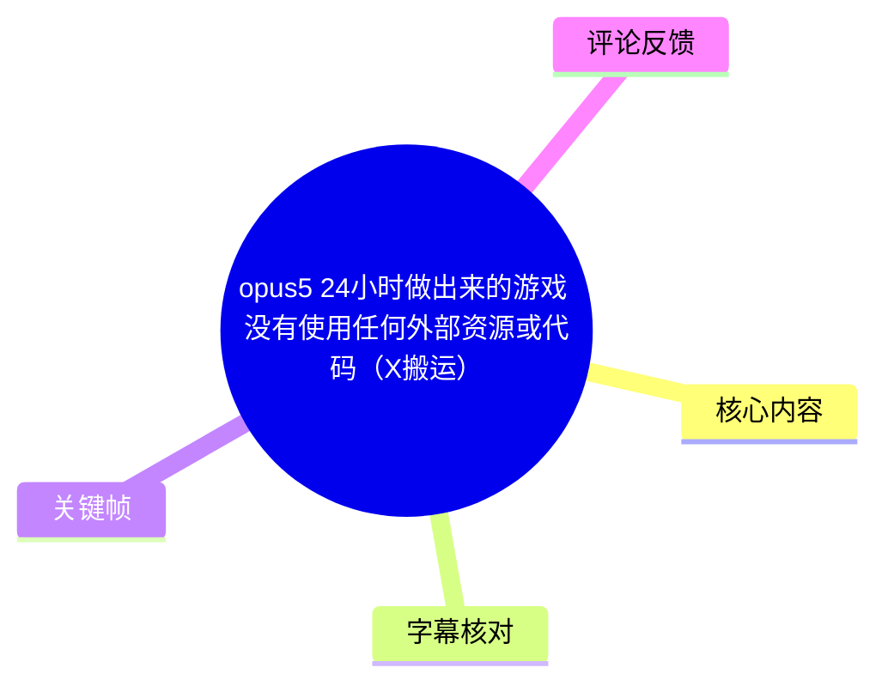
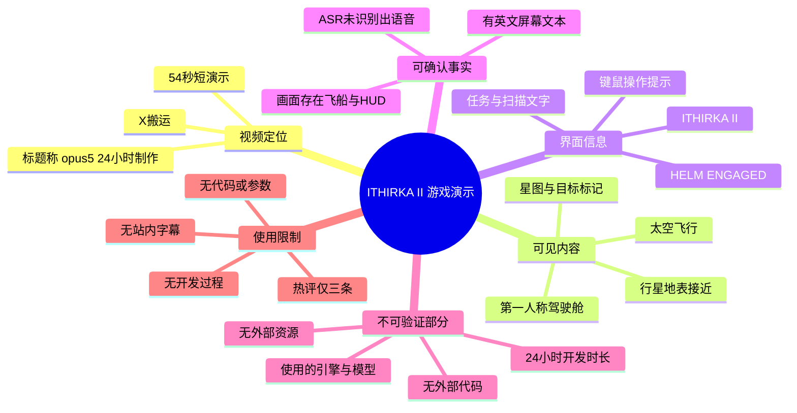
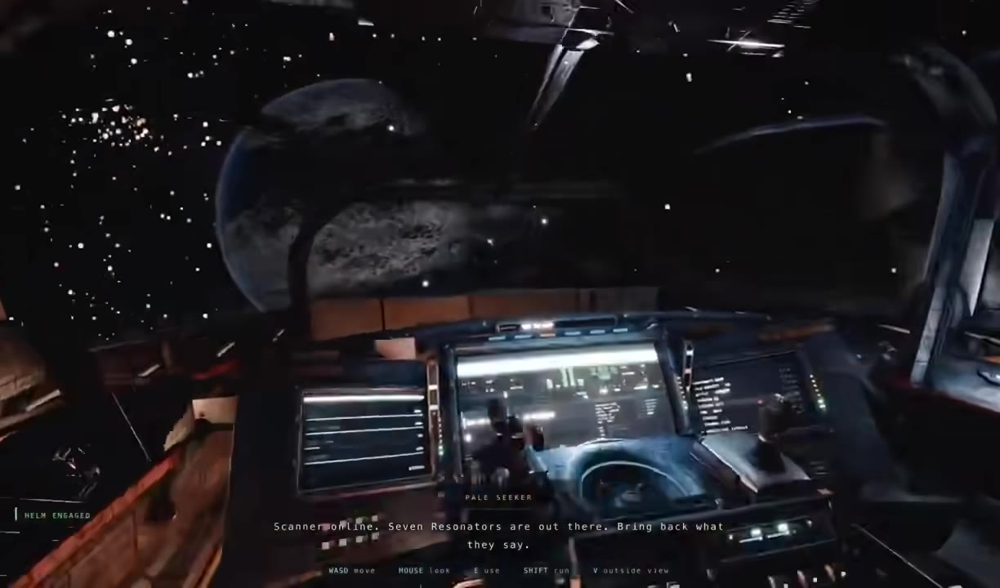
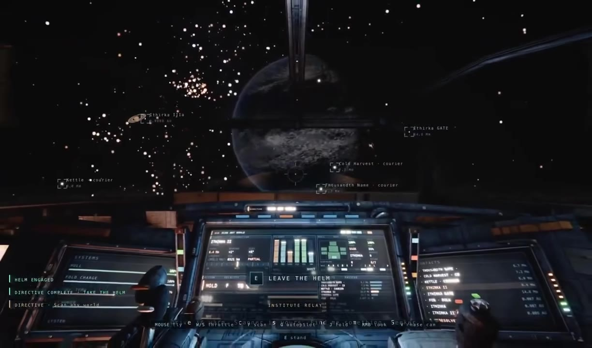
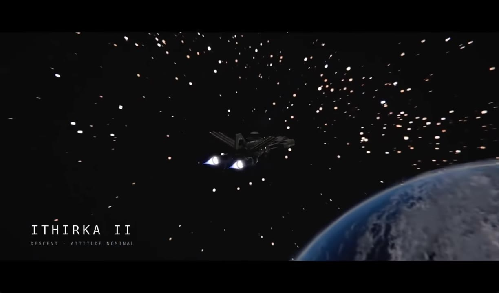
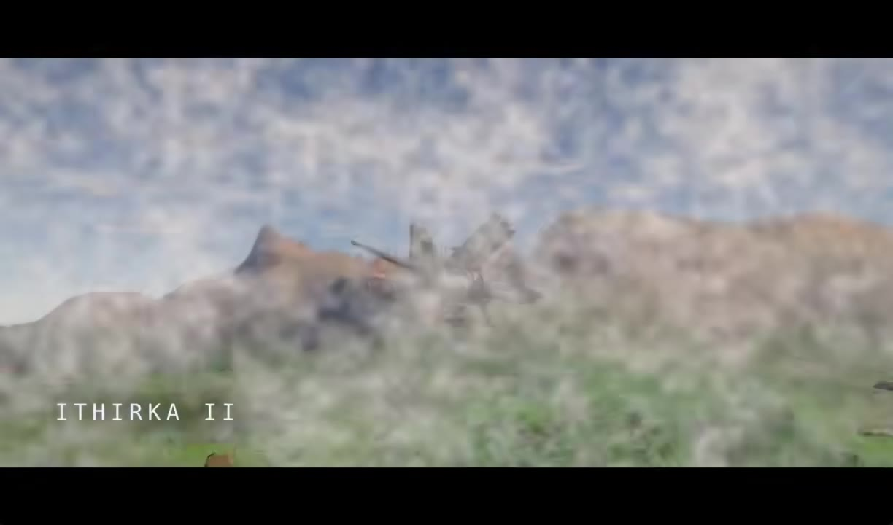

# opus5 24小时做出来的游戏 没有使用任何外部资源或代码（X搬运）

> 来源：[Bilibili 视频](https://www.bilibili.com/video/BV1Po3y6AEja)  
> UP 主：不来嗯忒｜合集：AIcode｜视频时长：54 秒｜标签：游戏、演示、资源  
> 标题中的“X搬运”表明该视频为来自 X 平台的搬运内容；原始发布者、制作过程及工具链均未在现有素材中提供。

## 小结

视频主体是一段约 54 秒的科幻第一人称太空游戏演示。画面先后呈现飞船驾驶舱、星图/任务标记、飞船在行星轨道附近飞行，以及飞向地表环境的镜头；画面内出现游戏名或关卡名 **“ITHIRKA II”**，并带有“DESCENT · ATTITUDE NOMINAL”字样。

视频标题宣称该游戏由 “opus5” 在 24 小时内完成，且“没有使用任何外部资源或代码”。但这属于标题转述，现有视频画面没有展示开发日志、代码、提示词、引擎界面、资产来源、生成记录或可复现步骤，因此不能据此独立验证“24 小时”“无外部资源”“无代码”三项主张。

从画面可确认的游戏表达包括：驾驶舱内的仪表盘与交互提示、目标/航线信息、太空与行星环境，以及带任务叙事气氛的英文屏幕文本。可见的控制提示包括 `WASD move`、`MOUSE look`、`E use`、`SHIFT run`，以及与飞船相关的 `E leave the helm`、鼠标飞行、`W/S throttle`、`R autopilot` 等；这些仅能说明演示画面中存在相应操作提示，不能证明所有功能均已完整实现。

本视频没有可用站内字幕；本次 ASR 虽检测到约 53.03 秒音频时长，但未识别出任何语音分段。诊断结果是“未识别到语音”，**并非** `noAudioStream=true`，所以不能把它描述为“源视频没有音轨”。正文主要依据视频标题、元数据、关键帧中的可见文字与画面信息整理。

适合关注 AI 辅助游戏原型、科幻游戏 UI、短时开发成果展示的人阅读。其核心价值是观察一个短演示如何用驾驶舱、HUD、任务文字、星图和环境切换建立“可玩太空探索游戏”的观感；其关键限制是开发过程与技术实现完全缺失，不能直接作为 Opus 5 或任意 AI 编程工具能力的严格测评依据。

## 思维导图





## 目录

- [视频定位与信息边界](#视频定位与信息边界)
- [科幻驾驶舱与任务界面](#科幻驾驶舱与任务界面)
- [太空航行、目标与场景切换](#太空航行目标与场景切换)
- [可见交互、技术线索与实践启示](#可见交互技术线索与实践启示)
- [标题主张、限制与时效性](#标题主张限制与时效性)
- [字幕比对](#字幕比对)
- [评论分析](#评论分析)
- [处理记录](#处理记录)

## [视频定位与信息边界 [00:00]](https://www.bilibili.com/video/BV1Po3y6AEja?t=0)

### 已知元数据

- 视频标题：`opus5 24小时做出来的游戏 没有使用任何外部资源或代码（X搬运）`
- 视频时长：54 秒。
- 分辨率：1224 × 720。
- UP 主：不来嗯忒。
- 描述栏内容：`-`，未提供制作说明、原帖链接、作者署名、模型版本、提示词、引擎或下载地址。
- 采集时元数据统计：播放 3727、点赞 40、收藏 39、分享 41、评论 44；此类互动数会持续变化，仅反映采集时状态。

### 信息边界

标题包含三项值得区分的制作主张：

| 标题说法 | 现有素材能否验证 | 原因 |
| --- | --- | --- |
| 使用 opus5 制作 | 不能独立验证 | 未提供模型调用记录、原帖上下文、开发界面或作者说明。 |
| 24 小时做出来 | 不能独立验证 | 没有时间线、提交记录、录屏或开发日志。 |
| 未使用任何外部资源或代码 | 不能独立验证 | 未提供资产清单、依赖清单、工程文件或许可证信息。 |

因此，较严谨的表述应为：**该视频标题声称作品满足上述条件，视频本身展示了一个具有科幻太空题材视觉与交互提示的游戏演示，但不足以验证其生产过程。**

## [科幻驾驶舱与任务界面 [00:00]](https://www.bilibili.com/video/BV1Po3y6AEja?t=0)

视频开头的关键画面为第一人称飞船驾驶舱：前方大面积舷窗外是星空和一颗行星，驾驶台由中部主屏、左右辅助屏、操纵杆和大量仪表构成。画面以昏暗座舱、冷色显示屏和高对比宇宙背景建立科幻氛围。



> 图：该帧展示驾驶舱内视角、行星背景及底部英文任务文本。它直接说明演示并非单纯静态概念图，而是按第一人称飞行/操作场景组织了画面与 HUD。

画面中可辨识的英文文本包括：

- `HELM ENGAGED`：舵位/驾驶状态已接管或已启用。
- `Scanner online. Seven Resonators are out there. Bring back what they say.`：扫描器在线；外部存在七个 “Resonators”，要求带回它们“所说的内容”。这构成了一个任务目标，但 `Resonators` 的具体物件、机制和收集条件未被进一步解释。
- 底部操作提示：`WASD move`、`MOUSE look`、`E use`、`SHIFT run`、`V outside view`。其中前四项是典型第一人称角色控制提示，`V outside view` 则暗示可切换至外部观察视角。

这些文本表明演示尝试同时提供步行/自由视角和飞船驾驶相关的交互语境。不过，短片没有展示角色离开驾驶舱后的实际移动、使用交互物的完整过程或任务完成反馈，因此不能将提示文字等同于功能已被完整验证。



> 图：该帧可见星图中的多个标记、驾驶台屏幕与中央 `E LEAVE THE HELM` 提示。它有助于确认作品至少在界面呈现上区分了“驾驶舵位”状态和可退出舵位的交互动作。

第二个驾驶舱画面进一步显示：

- 中央出现 `E LEAVE THE HELM`，意味着玩家当前处于控制飞船的位置，可通过 `E` 离开。
- 左下状态区可见 `DIRECTIVE COMPLETE` 和 `TAKE THE HELM` 等文字，说明界面存在任务/指令状态的组织。
- 画面下方可辨识飞船控制说明，如鼠标飞行、`W/S throttle`、`R autopilot`、`J fold`、`RMB look`、`CHASE CAM` 等。由于文字较小且部分受画面遮挡，不能据此推断每个按键实际绑定或功能逻辑，只能记录它们作为可见 UI 信息。
- 舷窗前的空间区域出现多个名称/类型标记，其中部分可见为 `courier`。这说明星图或导航层尝试标注可前往、可追踪或与任务相关的对象，但对象关系未获得视频解释。

## [太空航行、目标与场景切换 [00:00]](https://www.bilibili.com/video/BV1Po3y6AEja?t=0)

演示随后展示外部飞船镜头：飞船置于星空与大型行星背景中，画面左下明确写有：

```text
ITHIRKA II
DESCENT · ATTITUDE NOMINAL
```



> 图：该帧以飞船、星空和行星构成外部视角，并显示 “ITHIRKA II / DESCENT · ATTITUDE NOMINAL”。它是识别作品名称/场景名称及“下降阶段”氛围的重要证据。

从这一帧可做出的有限判断是：

1. **ITHIRKA II** 是画面中被明确展示的名称；它可能是游戏名、任务名、地点名或章节名，但视频没有给出定义，不能擅自定性。
2. `DESCENT · ATTITUDE NOMINAL` 可直译为“下降·姿态正常”，呈现飞行状态播报风格。
3. 外部镜头能与驾驶舱中 `V outside view` 的提示形成一致的视觉线索，但仍不能仅凭一帧确认这是玩家实时切换所得，还是预先剪辑的宣传镜头。

后续画面将飞船放入更接近地表的环境：近景可见云层、山地/岩地、植被色块与飞船轮廓，仍保留 `ITHIRKA II` 文字。



> 图：该帧将场景从轨道/深空推进到具有云层、地貌与植被色彩的地表附近，是判断演示包含至少两类环境景观——太空与行星地表——的主要依据。

这一转换是短演示中最有效的叙事手段之一：先用座舱与任务提示交代“行动者和目标”，再用外部太空镜头建立尺度，最后以地表接近镜头暗示可探索或可降落的目的地。不过，视频没有展示着陆、碰撞、地形交互、敌人、资源采集、存档、战斗或结算，故上述“探索”仅能理解为场景设计意图，不能视为已验证的完整玩法循环。

## [可见交互、技术线索与实践启示 [00:00]](https://www.bilibili.com/video/BV1Po3y6AEja?t=0)

### 画面中可见的交互与系统线索

| 类别 | 画面可见内容 | 能确认的程度 |
| --- | --- | --- |
| 角色操作 | `WASD move`、`MOUSE look`、`E use`、`SHIFT run` | 确认 UI 提示存在；未确认实际角色操作画面。 |
| 飞船操作 | `E LEAVE THE HELM`、鼠标飞行、`W/S throttle`、`R autopilot` 等 | 确认存在驾驶相关提示；部分文本模糊，且无完整操作演示。 |
| 视角切换 | `V outside view`、外部飞船镜头 | 视觉上相互印证，但不能确认镜头是否为实时玩家视角。 |
| 任务系统 | `Scanner online`、七个 `Resonators`、`DIRECTIVE COMPLETE` | 确认有任务文案与状态性 UI；任务流程没有展示。 |
| 导航/对象 | 星图/空间中多个带名称的方框标记 | 确认界面尝试标注对象；对象类型与可交互性不明。 |
| 飞行状态 | `HELM ENGAGED`、`DESCENT · ATTITUDE NOMINAL` | 确认采用飞行状态播报式文案；底层飞行模拟逻辑未知。 |

### 可迁移的展示经验

尽管视频未给出制作步骤，仍可从成片结构中提炼出有限的演示经验：

1. **先展示可识别的操作位置**  
   驾驶舱能够在极短时间内让观众识别“玩家正在操控飞船”。主屏、辅助屏、操纵杆与舷窗共同传达角色位置，不需要额外旁白。

2. **让 UI 文案承担世界观与目标说明**  
   `Scanner online`、`Seven Resonators`、`DIRECTIVE COMPLETE` 等短句同时服务于任务目标、世界设定和“系统正在运行”的感觉。对于时长很短的原型展示，这是压缩叙事信息的方式。

3. **通过尺度变化证明场景不止一个静态界面**  
   驾驶舱内景、外部深空、行星近地环境三种构图依次出现，可在很少镜头内表现“从控制台到宇宙，再到目的地”的空间跨度。

4. **提示按键应与实际演示对应**  
   本片的 UI 中出现多个键鼠说明，但未充分展示它们分别被触发后的结果。若用于技术展示，更可复现的做法是将“按键提示—输入动作—界面/世界反馈”完整串联，避免观众仅能看到静态提示。

### 本视频未提供的实现步骤与参数

现有素材中**没有**以下内容：

- 游戏引擎、渲染管线、编程语言或部署平台；
- Opus 5 的具体产品名称、版本、访问方式、提示词、上下文长度或调用次数；
- 美术资产、纹理、贴图、音效、字体、模型的来源与生成方式；
- 项目目录、代码片段、构建命令、性能数据、帧率或硬件配置；
- “24 小时”内各阶段的时间分配；
- “没有使用任何外部资源或代码”的判定标准。

因此，不能从本视频整理出可执行的代码、命令、参数配置或严格复刻流程。任何补充实现方案都将超出真实素材范围，故不在本文编造。

## [标题主张、限制与时效性 [00:00]](https://www.bilibili.com/video/BV1Po3y6AEja?t=0)

### 结论

这是一段以科幻太空飞行与驾驶舱交互为核心观感的短游戏展示。其已被画面支持的内容是：存在飞船座舱、导航/对象标记、英文任务文本、键鼠提示、太空飞船镜头和地表附近场景；`ITHIRKA II` 是画面中明确出现的名称。

若将其作为 AI 辅助原型案例，最值得关注的是它如何在短时间内用 HUD、任务文案、座舱细节和环境转换构建“具有可操作性”的印象，而不是把它当作已被完整披露的工程案例。

### 主要限制

1. **制作主张未被证明**：标题所述的模型、耗时、资源和代码限制没有原始证据链。
2. **玩法覆盖不完整**：画面未完整展示移动、飞行、自动驾驶、任务领取、目标回收、失败条件或完成结局。
3. **技术细节缺失**：无法判断使用了何种引擎、现成框架、生成模型或资产处理方式。
4. **音频语义不可用**：ASR 未获得语音文本，无法用旁白或对白补全上下文。
5. **搬运属性带来上下文缺口**：视频标题注明“X搬运”，但未提供原帖链接与原作者信息，难以核对原始声明是否被完整转述。

### 时效性

- 视频元数据的发布时间按时间戳可换算至 2026-07-29，但时区未注明。
- “Opus 5”相关产品能力、可用性、价格、版本命名和政策可能随时间变化；本视频没有提供版本号，不能将其视为当前能力基准。
- 页面播放、点赞、收藏、转发和评论统计均为采集时快照，不构成长期数据。
- 作品若存在后续开发、原作者补充、代码公开或撤回声明，均不会自动反映在本视频现有素材中。

## 字幕比对

| 字幕来源 | 完整性 | 专有名词 | 时间轴 | 主要问题 |
| --- | --- | --- | --- | --- |
| Bilibili 站内字幕 | 不可用；素材明确注明未提供可用字幕 | 无法核验 | 无可用分段 | 无法作为正文事实来源。 |
| 本次 ASR 字幕 | 空；0 个语音分段 | 无法识别或校正 | 虽启用了时间戳能力，但没有产生任何字幕时间段 | 诊断显示未识别到语音，`speechCoverage=0`。 |
| 关键帧可见文本 | 仅覆盖画面中可读文字 | 可辨识 `ITHIRKA II`、`Resonators`、`HELM` 等部分文本 | 关键帧清单未提供逐帧时间戳 | 字符细小、局部模糊，不能替代完整字幕。 |

### ASR 检查结论

本次 ASR 使用 `large-v3-turbo`，自动识别语言结果为英语（语言概率约 0.6006），音频分析时长约为 53.03 秒，但输出 `segments: []`，即没有任何识别到的语音片段。诊断警告为：

> No speech segments were recognized; verify that the source contains audible speech and retry with the correct audio track.

现有诊断**未标记** `noAudioStream=true`。因此，应如实表述为：音频文件已被提取并被 ASR 分析，但 ASR 未识别出语音；不能据此断定原视频没有音轨，也不能将该结果归因为工具失败。

### 最终字幕策略

正文未采用站内字幕或 ASR 转写作为事实来源，而是采用：

1. 视频标题与元数据，用于说明视频定位与标题主张；
2. 关键帧中的可见英文 UI/任务文字，用于记录画面可验证内容；
3. 谨慎的多模态画面理解，用于描述驾驶舱、飞船、星空、行星和地表环境。

涉及 `ITHIRKA II`、`Scanner online`、`Seven Resonators`、`E LEAVE THE HELM`、`DESCENT · ATTITUDE NOMINAL` 等词语，均来自关键帧可见文字；其中小字按键说明存在局部不清晰，已避免扩展为未经展示的机制说明。

## 评论分析

以下仅分析本次可获取的热评前三条，不将评论内容视为已验证事实。

| 评论者 | 点赞 | 评论要点 | 分析 |
| --- | ---: | --- | --- |
| 昨日重现001 | 3 | “nb，这些纹理和贴图都是自己生成的？” | 评论者认可视觉效果，并追问纹理与贴图是否由制作者自行生成。这正好触及标题“没有使用任何外部资源”的关键问题，但该评论是疑问而非证据，视频素材也未提供资产来源，不能据此确认贴图生成方式。 |
| 爬行无毛怪 | 8 | “瘫坐” | 属于简短的情绪化/玩笑式反应，可能表达对作品效果或标题冲击力的惊讶，但没有提供技术、制作或事实层面的补充信息。 |
| 杠精MrS | 0 | “想多了，你把网断了试试” | 该评论对“无外部资源或代码”类主张提出质疑，暗示制作过程可能依赖联网服务或外部能力。此观点具有合理的核验价值：应区分“最终工程未引入外部资产/代码”与“制作时完全不使用网络或外部服务”。但评论没有给出具体证据，不能据此判定标题为真或为假。 |

评论区的主要争议集中在“资源与贴图是否自生成”“是否依赖网络或外部服务”。这些都是需要原作者提供资产清单、工具调用记录、许可证说明或完整开发录屏才能回答的问题。

## 处理记录

- Worker ID：`worker-mrj0wbly-5dc4e50c`
- 整理模型：`gpt-5.6-terra`
- ASR 模型：`large-v3-turbo`，设备：CUDA，计算类型：`int8_float16`，自动检测语言：英语。
- 使用的素材与工具结果：检查了提供的视频元数据、关键帧清单、ASR 覆盖诊断、ASR 空字幕结果及可获取热评前三条；未获得可用站内字幕、原始工程、代码、提示词或开发日志。
- 字幕选择：站内字幕不可用；本次 ASR 输出为空且未生成时间分段；正文改以标题、元数据和关键帧可见文本为依据。未出现 `noAudioStream=true` 标记。
- 时间轴依据：由于没有站内 SRT，也没有 ASR 语音分段，除视频起点 `00:00` 外不存在可核验的字幕时间锚点；各正文视频章节均链接至已知的起点，未根据文字顺序虚构后续秒数。
- 关键帧选择依据：选择 `frame-001.jpg` 与 `frame-002.jpg` 证明驾驶舱、HUD、任务/交互文本和星图标记；选择 `frame-003.jpg` 记录 `ITHIRKA II` 与外部飞船镜头；选择 `frame-004.jpg` 说明画面包含靠近地表的环境转换。关键帧未提供单帧时间戳，故不为其附会具体秒数。
- 缓存清理：提供的素材中没有缓存清理执行日志；无法核验是否已清理，故不作“已清理”声明。
- 未解决问题：原始 X 帖子与作者身份、Opus 5 的准确版本及使用方式、24 小时开发证据、外部资源/代码的判定范围、引擎与资产来源、完整玩法和音频内容均未能从现有素材确认。
