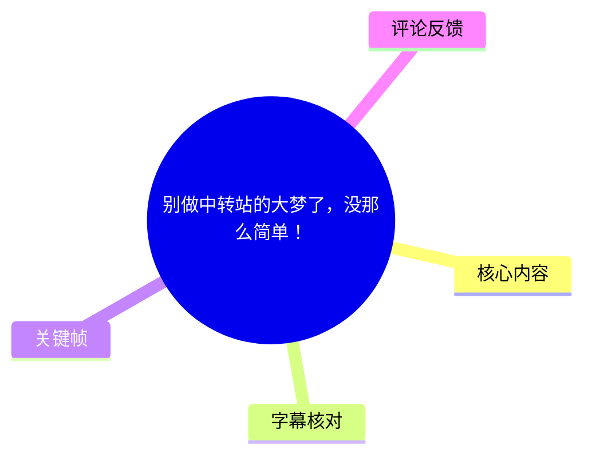
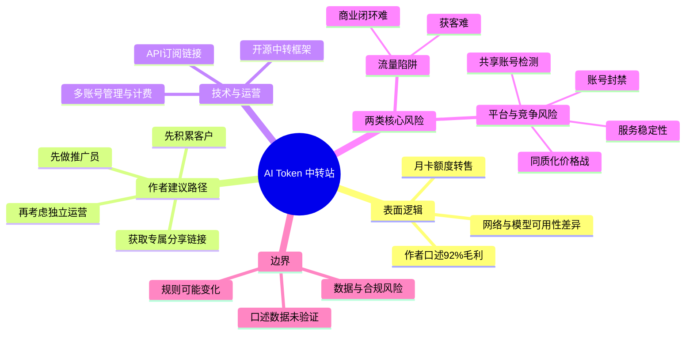
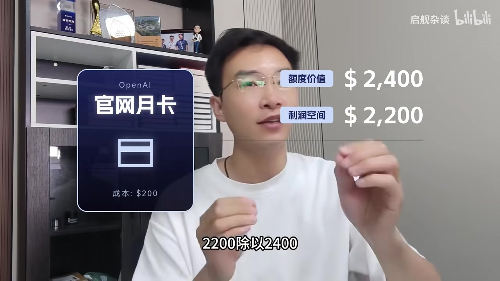
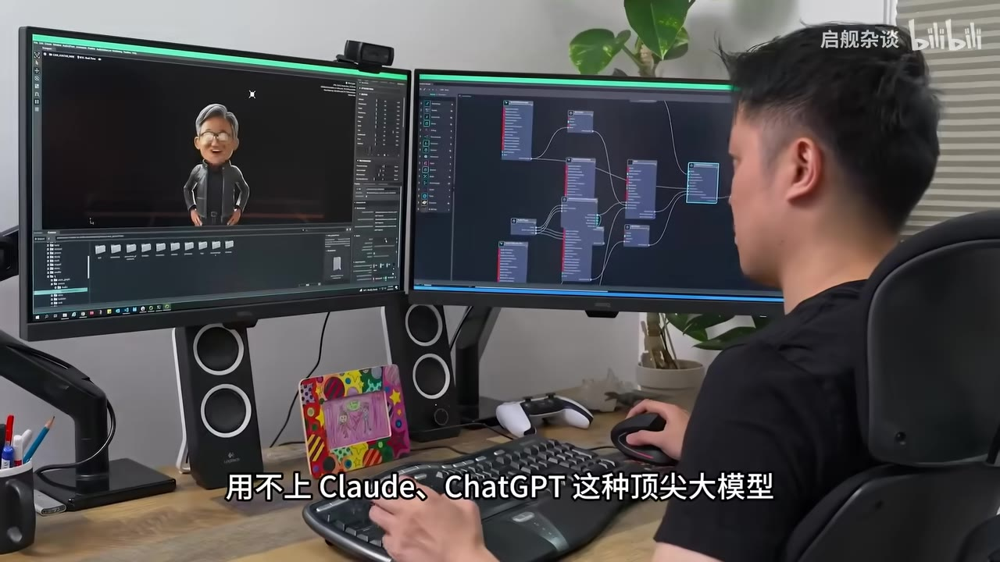

# 别做中转站的大梦了，没那么简单！

> 来源：[Bilibili 视频](https://www.bilibili.com/video/BV1Nz5e61Ett)  
> UP 主：启舰杂谈｜时长：03:01｜分辨率：1920×1080  
> 标签：AI、Claude、ChatGPT、AI 教程、中转站、AI 学习、AI 中转站

## 小结

视频讨论的是“AI Token 中转站/转售”生意，而不是某项具体产品的使用教程。作者先用“200 美元月卡、2,400 美元可用额度、卖出后利润空间 2,200 美元、毛利率 92%”说明其表面上的信息差逻辑，随后强调：这并不意味着普通人可以靠堆账号轻松获利。

作者给普通人的建议是，若仍想进入相关市场，先做已有平台的推广员，通过专属分享链接负责获客和销售，暂不承担 Token 池维护与多账号运营；等积累到客户后再考虑独立运营。这是视频中的商业路径建议，不构成对其收益、合规性或可执行性的验证。

视频把风险归为两类：第一是**流量陷阱**，即技术和搭建门槛并非主要困难，真正难点是把 AI 使用、内容/获客和交易转化做成商业闭环；第二是**平台封禁与同质化竞争**，包括平台可能检测共享账号/“拼卡”行为、账号被封、价格战，以及用户对服务稳定性的要求。

视频中提及的价格、可用额度、平台检测与账号政策均为作者口述，未给出平台名称、套餐页面、服务条款或交易数据作为佐证。尤其“92% 毛利率”是基于作者设定的标价和额度计算出的示例口径，未扣除支付通道、获客、售后、退款、坏账、账号损失、税费及合规成本，不能视为实际净利润或普遍收益率。

适合将本文作为对 AI 服务转售模式、流量获客和平台依赖风险的辨析材料。若涉及真实账户、订阅、API 或用户数据，应优先核查服务商现行条款、当地法律、数据处理规则与授权边界；不应把视频内容当作规避平台规则或开展账号共享的操作指南。

## 思维导图

## 目录

- [主题、口径与时效边界](#主题口径与时效边界)
- [表面收益模型：92% 从何而来](#表面收益模型92从何而来)
- [作者提出的入局路径](#作者提出的入局路径)
- [技术环节与其真实门槛](#技术环节与其真实门槛)
- [风险一：流量与商业闭环](#风险一流量与商业闭环)
- [风险二：封禁、同质化与稳定性](#风险二封禁同质化与稳定性)
- [视频结尾与课程推广信息](#视频结尾与课程推广信息)
- [可迁移经验、限制与核查清单](#可迁移经验限制与核查清单)
- [字幕比对](#字幕比对)
- [评论分析](#评论分析)
- [处理记录](#处理记录)

## [主题、口径与时效边界](https://www.bilibili.com/video/BV1Nz5e61Ett?t=0)

视频开头以“卖 AI Token”为题，称网络上教授这一模式的人通常不会讲清真实风险和“底牌”。作者表示有朋友靠该业务运营了 3 年，并承诺拆解业务底层逻辑、避坑点及普通人进入方式。

需要区分以下三层信息：

1. **作者的叙事与判断**：中转站是信息差生意、风险很大、流量比技术重要、平台会检测“拼卡”。
2. **作者给出的示例参数**：200 美元月卡、2,400 美元额度价值、2,200 美元利润空间、92% 毛利率等。
3. **尚未被素材验证的事实**：具体是哪家平台、何种订阅、额度是否可转售、是否允许共享、平台检测机制、朋友实际经营年限与实际盈利，素材均未给出独立证据。

视频没有报道可独立核验的新闻事件；其核心是作者针对 AI 服务转售市场的经验性观点和商业推广内容。

> 图：画面以醒目的“真正风险”文字配合警示符号呈现视频主旨。它有助于理解本片并非单纯鼓吹高利润，而是以“风险揭示”为叙事入口。关键帧文件未提供精确时间戳，因此本文不据此反推其播放秒数。

## [表面收益模型：92% 从何而来](https://www.bilibili.com/video/BV1Nz5e61Ett?t=30)

### 作者的业务逻辑

作者称，部分国内用户因网络问题无法直接使用 Claude、ChatGPT 等顶尖大模型，由此产生代用或转售需求。其描述的模式是：从“官网”购买月卡，获得可用额度，再把额度或 Token 分批出售。

作者在约 00:37—00:54 给出的口述参数如下：

| 项目 | 作者口述 |
| --- | ---:|
| 月卡成本 | 200 美元 |
| 官方可用额度的计价 | 2,400 美元 |
| 口述“利润空间” | 2,200 美元 |
| 计算方式 | 2,200 ÷ 2,400 |
| 得出的毛利率 | 约 92% |
| 按量售价示例 | 1,000 Token / 10 美元 |

按照该口述模型：

\[
\frac{2400 - 200}{2400} = \frac{2200}{2400} \approx 91.67\%
\]

四舍五入后约为 **92%**。这里更接近“以销售额为分母的毛利率”表达；但它成立的前提是 2,400 美元额度能被全部出售并全部回款。

> 图：画面直接列出“官网月卡”、成本 200 美元、额度价值 2,400 美元和利润空间 2,200 美元，是理解视频 92% 计算口径的最关键视觉证据。

### 该模型未计入的成本与前提

视频没有展开成本核算。因而下列因素不能被忽略，也不能从“92%”中自动得出：

- 额度是否确实按作者设定的价格售罄；
- 客户获取成本、内容投放成本和销售时间成本；
- 支付手续费、汇率波动、退款、拒付、坏账与售后成本；
- 账号被限制或封禁后的损失；
- 服务器、域名、运维、客服、监控与故障处理成本；
- 订阅/API 的使用权是否允许再销售、代用或多人共享；
- 数据处理、消费者权益、税务及其他合规成本。

因此，视频中的 2,200 美元是作者示例中的“利润空间”，而非经过完整成本表验证的净利润。

### 站内字幕与 ASR 的补充差异

站内中文字幕在“1,000 Token / 10 美元”后直接进入“账号足够多就能躺赚”的提问；本次 ASR 在相应位置额外识别出“要么按包月卖 300 人民币一个月”。由于 ASR 在此处存在大量错字且时间轴整体偏移，本文将其列为**可能存在的补充口述**，不把它提升为已由站内字幕确认的核心参数。

## [作者提出的入局路径](https://www.bilibili.com/video/BV1Nz5e61Ett?t=63)

作者明确劝退普通人“一上来就建自己的中转站”，理由是风险极大；其建议的顺序是先成为推广员，再在有客户基础后自行运营。

### 视频中的路径（按原述顺序整理）

1. **寻找市场上已有的大型中转站**。  
   作者没有给出具体平台名称、筛选标准或验证渠道。

2. **获取专属分享链接**。  
   该链接被描述为推广归因/分成的基础。

3. **只负责搞流量和销售**。  
   作者认为推广员可以把重心放在获客和转化。

4. **将 Token 池维护交由平台处理**。  
   视频称维护不必由推广员操心，但未说明平台如何保障账户、数据、账单和服务责任。

5. **客户积累后再独立运营**。  
   这是作者的策略建议，不意味着客户、信任、供应稳定性或合规能力会自然具备。

该路径实质上是先用分销/推广测试市场需求和获客能力，再决定是否承担更重的供应与运营责任。作者认为“正反馈极快”，但没有提供转化率、佣金比例、获客成本、留存率或推广者收益等数据。

> **边界提醒：**“推广—积累客户—自营”只是视频的商业建议。无论是推广还是自营，只要涉及代售订阅、共享账户、转交 API 凭证或处理用户内容，都可能受平台规则、合同关系和数据安全要求约束。

## [技术环节与其真实门槛](https://www.bilibili.com/video/BV1Nz5e61Ett?t=88)

作者称，当前中转站常使用同一类开源 AI 中转框架；在视频中出现了“Sub2API”字样，并称只需填入订阅链接，系统即可自动处理多账号管理和计费。

> 图：画面展示双显示器上的数字内容制作界面与节点式工作流。它与视频中“AI 工具/技术框架”的背景相呼应，但并不能证明视频所称中转站系统的具体实现、平台名称或功能细节。

### 视频实际提供的技术信息

| 技术/运营项 | 视频说法 | 素材可确认程度 |
| --- | --- | --- |
| 开源框架 | “基本上都是同一套开源的……框架” | 仅为作者概括，未给出项目名或版本 |
| Sub2API | 画面/字幕出现“Sub2API” | 可确认视频提到该名称；无法从素材确认安装方式、维护状态或适用范围 |
| API/订阅链接 | 填入订阅链接 | 为作者口述；未展示配置过程 |
| 多账号管理 | 系统自动处理 | 未展示机制、权限和风控策略 |
| 计费系统 | 系统自动处理 | 未展示计费口径、账单准确性或资金流 |

### 技术门槛低不等于经营门槛低

作者本意是指出：搭建页面、接入 API、计费和账号管理可以被工具自动化，因而技术本身不是关键壁垒。这个判断不应被误解为“业务没有门槛”。

至少从视频后半段的论证看，真正未被自动化解决的部分包括：

- 持续、可信的获客；
- 供应链和服务可用性；
- 账户或上游异常时的客户沟通与补偿；
- 费用、用量和权益的透明计量；
- 服务条款、隐私和数据处理责任；
- 同质化环境中的差异化与用户信任。

视频没有提供部署命令、源代码、系统配置、接口密钥处理方式或账号绕过方案；本文也不补充此类可能用于绕开平台限制的操作细节。

## [风险一：流量与商业闭环](https://www.bilibili.com/video/BV1Nz5e61Ett?t=104)

作者将“流量陷阱”称为第一个、也是最致命的问题。其论证是：即使有人让你“只做销售”，把一个购买 Token 的链接突然发给正在刷视频的人，对方也没有理由信任或购买。

由此作者给出的核心判断是：

> 不论卖 Token 还是做其他 AI 项目，最大门槛不在技术本身，而在于如何真正用好 AI 获取流量，并做成商业闭环。

这里的“商业闭环”在视频中未被定义为可量化流程，但可按其上下文理解为：从触达潜在用户、建立信任、完成购买，到持续服务和复购的连续过程。视频没有给出具体流量平台、内容策略、转化漏斗数据或投放方法。

### 可迁移的经验

- 不要把“能接入工具”误认为“能产生需求”。
- 不要把“获得推广链接”误认为“获得客户”。
- 对依赖外部平台的业务，获客能力、信任基础和售后能力往往比初始搭建更难建立。
- 应先验证需求、单客获取成本、转化率、留存率和服务成本，再讨论规模化。

### 作者的课程推广

作者在此段插入推广信息，称开放了一套涵盖 **11 个顶尖 AI 工具、109 节课程、500 多个商业案例**的实战课，要求评论“学习”即可获得。该课程的具体内容、价格、交付方式、案例真实性及效果均未在素材中展示，不能据此判断课程质量或商业效果。

## [风险二：封禁、同质化与稳定性](https://www.bilibili.com/video/BV1Nz5e61Ett?t=140)

第二类风险是“官方封禁”。作者称各大平台都在检测“拼卡”或账号共享行为，一经检测就可能封号。素材未列明具体平台，也没有展示规则原文或封禁案例，因此应将其理解为作者的风险提示，而非可量化、适用于所有服务商的结论。

### 作者描述的风险链条

1. 中转站搭建本身技术门槛较低；
2. 大量参与者使用相近的工具和模式；
3. 市场容易陷入同质化竞争与价格战；
4. 用户最终更看重服务稳定性；
5. 作者因此认为后期必须拥有“自己的号池”，以便某些账号失效后仍能维持服务；
6. 最终依靠客户数量和信任建立品牌。

### 应如何理解“号池”说法

视频把多账号冗余视为保障服务连续性的办法，但这并不自动使业务合规，也不意味着可通过多账号绕开平台的限制。若相关服务条款禁止共享、转售、规避限制或以个人订阅提供商用服务，多账号安排本身可能放大而不是消除风险。

对用户而言，所谓“稳定性”还包括：

- 上游服务是否有正式授权；
- 账户或接口受限时能否透明告知；
- 已购权益是否能持续兑现；
- 用户输入的数据由谁处理、保存和访问；
- 计费与余额是否可审计；
- 出现异常时是否有退款、迁移或补偿机制。

视频强调“服务不下限”，但没有展示任何服务等级协议、容灾数据、隐私政策或客户案例，因而不能作为稳定性的证明。

## [视频结尾与课程推广信息](https://www.bilibili.com/video/BV1Nz5e61Ett?t=167)

结尾处，作者称若本视频点赞超过 **1 万**，下一期将拆解其团队在做的 AI 视频带货玩法。随后以“我的视频杭州都出不去，根本不可能散会”作调侃收尾。

这一点赞目标和“下期内容”属于发布时的互动承诺，不代表后续视频一定已经发布，也不构成对 AI 视频带货方法有效性的证据。视频结束时间约为 03:00，素材元数据中的音频时长为 180.6745 秒。

## [可迁移经验、限制与核查清单](https://www.bilibili.com/video/BV1Nz5e61Ett?t=172)

### 可以带走的经验

1. **先辨别毛利口径。**  
   高毛利示例不等于高净利，更不等于现金流稳定；必须把售罄率、获客、售后、封禁、退款和合规成本纳入计算。

2. **技术自动化不能替代需求验证。**  
   即便接入、计费、管理都可工具化，客户从哪里来、为什么信任、是否持续付费，仍是经营核心。

3. **对上游依赖要做压力测试。**  
   若产品依赖一个或少数模型供应商、账号和 API，规则变化、服务中断或封禁都可能直接影响交付。

4. **稳定性应以可验证的服务能力衡量。**  
   不应仅用“账号多”判断稳定；授权、告警、透明度、数据保护、退款机制和客户支持同样重要。

### 实施前应核查的事项

| 核查维度 | 应确认的问题 |
| --- | --- |
| 服务条款 | 订阅、API、额度是否允许代售、共享、转供或商用？ |
| 账号权限 | 账户归属、访问范围、密钥保管和责任边界是什么？ |
| 数据安全 | 用户提示词、文件、账单和身份信息由谁保存、保存多久、如何删除？ |
| 财务模型 | 售罄率、获客成本、手续费、退款、坏账、运维和税费是否已计入？ |
| 服务连续性 | 上游故障或账户受限后，客户权益如何处理？ |
| 客户告知 | 定价、额度规则、限制、退款与隐私说明是否清晰可见？ |
| 法律合规 | 业务所在地区对数据、消费者保护、税务和跨境服务有哪些要求？ |

### 时效性与证据限制

- 视频页面元数据记录的发布时间为 **2026-05-15**；本文不将当时的描述视为当前平台政策。
- 视频没有公开月卡所属平台、额度来源或价格依据，所有价格参数仅能按“作者口述示例”引用。
- “Claude”“ChatGPT”“Sub2API”等名称在字幕/画面中出现，但视频未展示其版本、账户类型、许可范围或正式文档。
- 本文不对账号共享、转售模式的合法性、合规性、盈利性或安全性作背书。

## 字幕比对

站内存在阿拉伯语、英语、西班牙语、日语、葡萄牙语及中文字幕；其中 **`p01-ai-zh.srt`** 与视频语言一致，且具有从 00:00:00.080 到 00:03:00.660 的细粒度时间轴，因此作为正文时间轴和主要转写依据。

本次 ASR 已实际检查：识别语言为中文，置信度为 **0.99951171875**，模型为 `medium`，音频时长为 **180.6745 秒**，诊断为 `speechCoverage: 0.8044`、`firstSpeechAt: 30.1`、`lastSpeechAt: 175.44`。诊断中**没有** `noAudioStream=true`，因此源视频存在音轨；问题不在于无音轨，而在于 ASR 仅输出 7 个超长片段，并将开头内容错误地从 30.1 秒起标记，无法作为可靠的逐句时间轴。

| 字幕来源 | 完整性 | 专有名词 | 时间轴 | 主要问题 |
| --- | --- | --- | --- | --- |
| Bilibili 站内中文字幕 `p01-ai-zh.srt` | 覆盖 00:00:00.080—00:03:00.660，分段细 | Claude、ChatGPT、Token、Sub2API 大体可辨 | 可直接使用，正文优先采用 | 存在语音识别式错字，如“air token”“九十十二%”“cloud拆的GBT”“GI代化框架”；“包月 300 元”未出现在该字幕 |
| 本次 ASR `medium` | 覆盖主要讲话内容，但只分为 7 个长段 | 可识别 Token、Claude、GPT、Sub2API 等线索 | 不可靠：开头内容被错标为 30.1 秒起，分段过粗 | 错字较多，如“毛利力”“避空指南”“大中软站”“地带化框架”“铅接”“封好”；末段也未覆盖站内字幕的调侃收尾 |
| 站内外语字幕 | 内容与中文字幕基本对应 | 英语等版本有助于确认“gross margin”“affiliate”等概念 | 细粒度、与中文时间一致 | 属机器翻译性质，个别术语与原中文不完全一致，不作为中文事实的首要依据 |

### 最终字幕合并原则

- **时间轴**：采用站内中文字幕的真实 SRT 起止时间换算秒数。
- **中文语义**：以站内中文为主，结合 ASR 和外语字幕做交叉核对。
- **关键术语校正**：
  - “卖 air token”统一整理为“卖 AI Token”；
  - “九十十二%”按多语字幕与上下文校正为“92%”；
  - “cloud拆的GBT”按画面字幕和多语字幕整理为“Claude、ChatGPT 等顶尖大模型”；
  - “GI代化框架/地带化框架”无法从素材确认具体术语，正文只保留“开源框架”的泛化描述；
  - “Sub2API”保留视频出现的拼写，但不据此推断其具体功能或版本；
  - “包月卖 300 人民币一个月”仅见于 ASR，站内字幕未支持，故标为待确认补充而非确定参数。

## 评论分析

仅获取到 2 条热评，未提供第 3 条，因此不补写或推测不存在的评论。

1. **二大爷x2（7 赞）**  
   > “你以为人家盈利是靠套利和掺水，实则真正赚钱是靠出卖你的数据”

   - 观点：评论者认为表面套利并非真正利润来源，真正风险/盈利点可能是用户数据。
   - 补充价值：将讨论从账号与价格转向数据隐私，提示用户关注自己输入给中转服务的信息。
   - 可信度与边界：该评论没有提供证据、平台名称、数据流向或案例；不能据此认定视频所谈中转站存在出售数据行为。它更适合作为需要核查隐私政策、日志留存和数据访问权限的提醒。

2. **简雍诗也（1 赞）**  
   > “在国内可以用国外的模型吗，比如用gpt，那老美不是拿到我们都数据了吗”

   - 观点：评论者关心国内使用境外模型时，数据是否会被境外服务商获取。
   - 补充价值：指出跨境模型服务中的数据处理、传输与访问问题，和视频仅谈“网络问题/可用性”的视角形成补充。
   - 可信度与边界：这是疑问而非结论。不同服务的收集规则、模型训练设置、企业版协议、数据存储位置和用户控制项并不相同，不能用“使用国外模型”直接推导具体数据一定被何方获取。应以服务商当前隐私政策、数据控制选项与适用法律为准。

## 处理记录

- **Worker ID**：`worker-mrj0wbly-5dc4e50c`
- **整理模型**：`gpt-5.6-terra`
- **ASR 模型**：`medium`（CUDA、`float16`；识别语言：中文；语言置信度：0.99951171875）
- **使用的素材/工具结果**：视频元数据、站内多语 SRT、`asr/transcript.srt`、`asr/asr-result.json`、关键帧目录、热评 JSON；未提供可核验的网页检索、平台条款查询或外部数据库查询结果。
- **字幕选择**：以站内 `p01-ai-zh.srt` 为主要正文和时间轴依据；已检查本次 ASR，因其存在开头时间错位、超长合并分段和较多错字，仅用于交叉核对及发现“包月 300 元”这一待确认补充。
- **音轨判断**：ASR 诊断未标记 `noAudioStream=true`，并识别出 145.34 秒语音内容；据此确认源视频有音轨。
- **关键帧选择依据**：选用 `frame-001.jpg` 说明“真正风险”的开场主题，`frame-003.jpg` 对应 AI 工具/工作流的技术背景，`frame-004.jpg` 直接展示 200、2,400、2,200 美元的收益模型。关键帧列表未附逐帧时间戳，故未以图片反推时间轴。
- **评论处理范围**：严格处理可获取热评前 3 条；实际仅获取 2 条，已如实说明。
- **缓存清理**：素材中未提供缓存清理执行记录；本文不虚构已执行清理操作。
- **未解决问题**：无法从现有素材确认具体月卡与 API 的所属平台、转售授权、额度计价依据、Sub2API 的版本/功能、作者朋友的经营数据、课程交付情况，以及 ASR 中“包月 300 元”的准确性。
